# 외부 입력 45장 · 1600스텝 LoRA 시각 검수표

366쌍 중 학습 347쌍으로 학습한 새 LoRA의 결과다. 기존 공개 어댑터와 구분한다. 입력 45장은 학습 입력과 해시가 겹치지 않으며, 목표 얼굴 이미지는 추론에 전달하지 않았다.

기반 모델: Qwen-Image-Edit-2511. LoRA 강도 1.0, 시드 62294, 추론 20스텝, CFG 4.0, 출력·참조 VAE 512×512, 크롭 없음.

체크포인트 SHA-256: `9cddfaec307af146ce5311669c2e0ab42fdf68abe836364fa329e32861e9e37e`

45장 생성과 파일 무결성 검증을 완료하고, 2026-09-18에 입력·출력 45쌍과 5.2의 방향별 Mira 기준 15장을 대조해 AI 시각 검수 의견을 작성했다. 사용자는 얼굴·헤어·표정에 큰 특이점이 없고 일부 복장 변경이 있다고 판단했다. 아래 세부 관찰은 이 종합 판단과 구분하며, 개별 이미지의 채택·폐기를 뜻하지 않는다. 관리번호는 기존 P712-CAM 번호를 유지한다.

얼굴·헤어·화풍이 Mira에 가까운지, 특히 ±45°·±90°에서 입력 얼굴의 앞뒤 길이를 그대로 따르는지 확인한다. 동시에 방향·표정·자세·의상·배경·구도 보존을 확인한다. 미적용 결과는 이번 표에 없으므로 개선 폭을 정량적으로 단정하지 않는다.

## 검수 의견

**얼굴·헤어는 대체로 양호하고 표정에도 큰 이상은 없으며, 일부 복장 변경은 명확한 의상 보존 오류다.** Mira 계열의 얼굴·청록 단발은 방향과 입력 인물이 달라도 전반적으로 나타난다. 입력 보존과 그림 전체의 화풍 통일은 별도로 평가한다. 정면 사례 008·023·038에서는 공통 인상이 비교적 쉽게 읽힌다. 측면에서도 기준 계열의 얼굴·헤어가 나타나므로 이번 결과만으로 “입력의 얼굴 비율을 그대로 유지한다”고 일반화하지 않는다. 다만 머리카락 외곽은 두개골 윤곽과 다르며, 방향·표정·원근도 달라 앞뒤 길이가 기준과 같아졌다는 정량 결론은 내리지 않는다.

- **큰 구도와 동작:** 방향, 손 흔들기, 가슴 위 손, 책 들기 등은 대체로 이어진다. 인물의 화면 점유율과 체형·목·손 비율은 달라지는 사례가 있다.
- **의상 디자인:** 009·011·019·026·028·029에서 칼라 또는 목선 변화가 눈에 띈다. 색을 유지한 것과 디자인을 보존한 것은 구분한다.
- **표정:** 전체적인 표현에 큰 특이점은 없다는 사용자 판단을 반영한다. 010·037·042 등에서 입 벌어짐과 웃음 강도가 달라지는 세부 차이는 관찰되지만, 이를 얼굴 표현의 이상이나 전체적인 표정 실패로 확대하지 않는다. 정확한 입력 표정 보존 여부를 비교하는 참고 사항으로 남긴다.
- **소품:** 040은 책을 든 동작은 남지만 닫힌 책이 펼쳐진 책으로 바뀐다. 물체 존재와 물체 상태 보존은 다르다.
- **배경과 화풍:** 방·카페·서가의 큰 배치는 대체로 남는다. 특히 성인 입력에서는 인물의 평면 채색과 배경의 사진 질감이 함께 남아 전체 화풍 변환이 고르지 않다. 장난감·책·바닥 무늬의 단순화와 실제 누락은 구분해 판단해야 한다.
- **유아 입력 031–045:** 성인 Mira 계열 얼굴로의 변환 자체는 목적에 부합할 수 있다. 그러나 목·어깨·가슴·몸통 비율까지 바뀌는 것은 별도의 보존 문제다. 유아 나이 표현이 달라졌다는 이유만으로 실패 처리하지 않는다.

이 검수표에는 같은 조건의 미적용 결과나 구모델 결과가 없으므로 데이터 보강 효과와 학습 스텝의 효과를 분리해 입증할 수 없다. 누적 3200스텝 결과는 같은 45장·프롬프트·시드·추론 설정으로 비교하고, 얼굴 특징 강화와 위 보존 문제의 악화 여부를 함께 판단한다. 더 오래 학습하면 반드시 개선된다고 결론 내리지 않는다.

## 사용자 검수 의견: 복장 일부 변경

사용자 검수에서 복장이 일부 바뀌는 사례를 확인했다. 입력의 의상 색상이 유지되어도 칼라·목선·트임이 달라지면 의상 디자인을 보존한 것으로 보지 않는다. 얼굴·헤어·화풍 변환과 구분되는 **의상 보존 오류**로 기록한다. 아래 관리번호는 기존 AI 검수에서 지목한 사례이며, 개별 항목의 최종 채택·폐기 판정을 뜻하지 않는다.

- **P712-CAM-009·011:** 셔츠 칼라가 사라지고 목선이 바뀐다.
- **P712-CAM-019:** 목선이 더 깊은 V 형태로 바뀐다.
- **P712-CAM-026:** 칼라처럼 보이는 형태가 추가된다.
- **P712-CAM-028·029:** 목선이 둥근 형태로 바뀐다.

누적 3200스텝 결과에서도 같은 입력과 관리번호를 우선 비교한다. Mira 특징이 강화되더라도 복장 변경이 늘어나면 보존 품질이 개선됐다고 판단하지 않는다.

검수는 아래 Markdown의 입력·출력 원본 이미지와 관리번호별 의견을 기준으로 진행한다. 별도의 합성 검수 시트는 보관하지 않는다.

## 항목별 비교

| 관리번호 · 입력 조건 | 입력 | LoRA 적용 · 1600스텝 | 시각 검수 의견 |
| --- | --- | --- | --- |
| P712-CAM-001 · man / low / -90° | 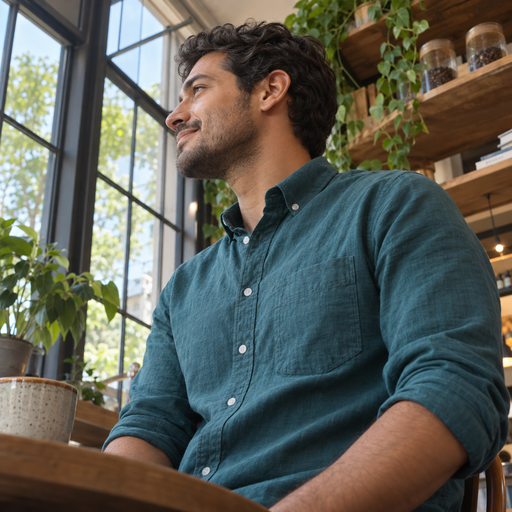 | 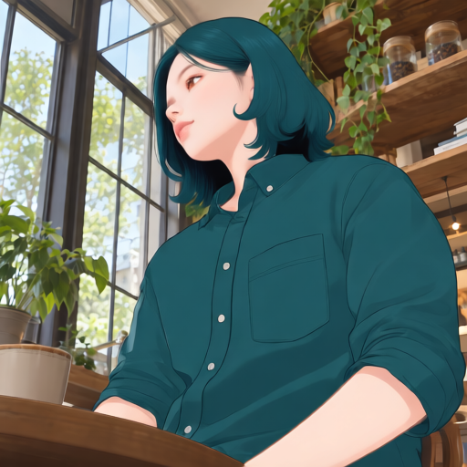 | 낮은 시점과 셔츠·창틀 배치는 대체로 유지. Mira 계열 측면 얼굴이 보이나 인물은 평면적인 채색, 배경은 사진 질감이 강해 화풍 통일은 부분적. |
| P712-CAM-002 · man / low / -45° |  | 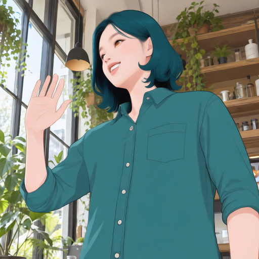 | 손을 든 자세와 입을 벌린 웃음 유지. 얼굴·헤어 변환은 뚜렷하나 손과 팔의 크기·윤곽이 달라짐. |
| P712-CAM-003 · man / low / 0° | 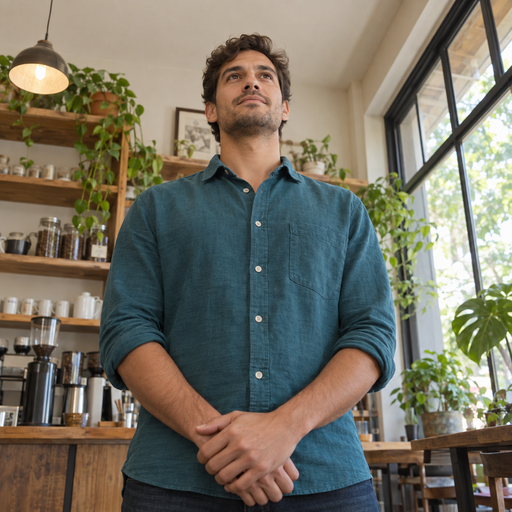 | 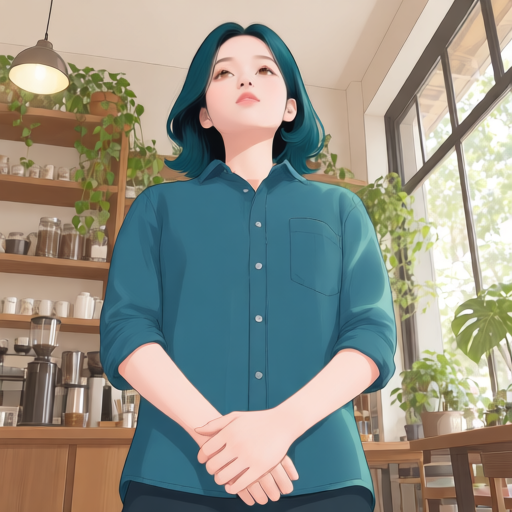 | 올려다보는 방향과 모은 손 유지. 얼굴이 작아지고 목이 길어 보이며 어깨·몸통 폭이 줄어 입력 체형 보존은 불완전. |
| P712-CAM-004 · man / low / 45° |  | 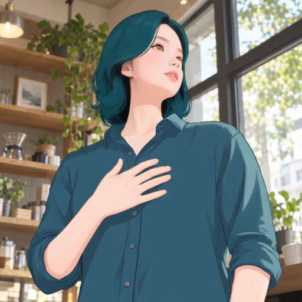 | 가슴 위 손과 오른쪽 시선 유지. 턱을 든 정도와 얼굴 윤곽이 달라짐. 선반·창틀 배치는 대체로 남음. |
| P712-CAM-005 · man / low / 90° |  | 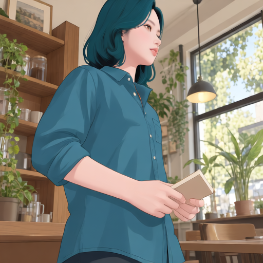 | 책과 측면 자세 유지. 입력의 치아가 보이는 웃음이 닫힌 입으로 약화. 후두부 길이 자체의 정량 판정은 보류. |
| P712-CAM-006 · man / level / -90° | 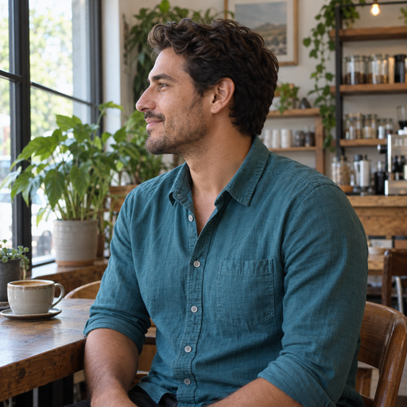 | 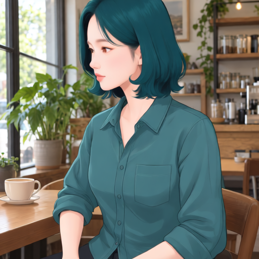 | 좌향 측면과 컵·창문 유지. Mira 측면 특징은 보이나 어깨·팔·가슴 윤곽이 바뀜. 배경의 사진 질감이 강함. |
| P712-CAM-007 · man / level / -45° | 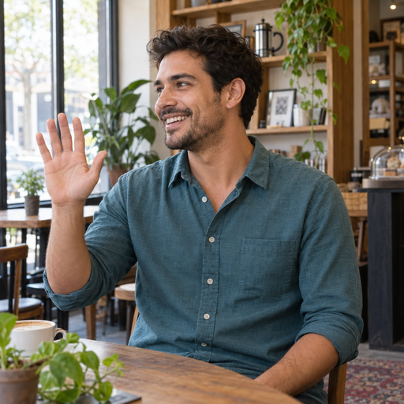 | 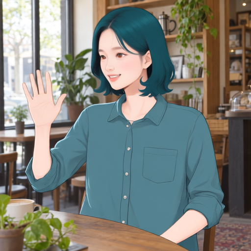 | 손 흔들기와 웃음 유지. 인물·손이 작아지고 셔츠 주름이 단순화됨. 배경 물체 배치는 대체로 유지. |
| P712-CAM-008 · man / level / 0° | 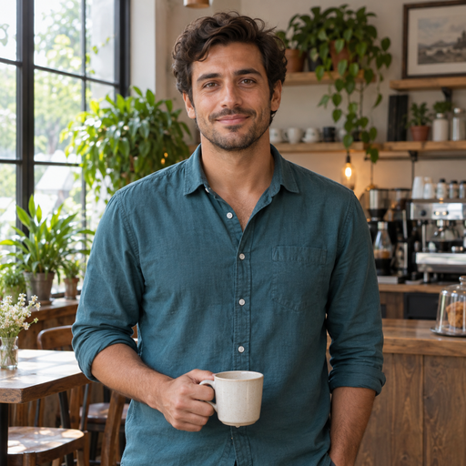 | 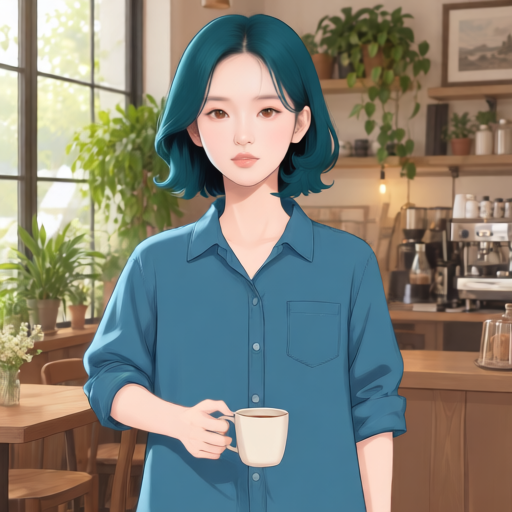 | 정면 얼굴·청록 단발이 기준 인상과 가까움. 컵을 쥔 동작 유지. 미소는 약해지고 몸통·머리 크기가 작아짐. |
| P712-CAM-009 · man / level / 45° | 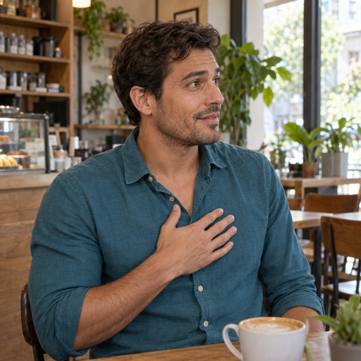 | 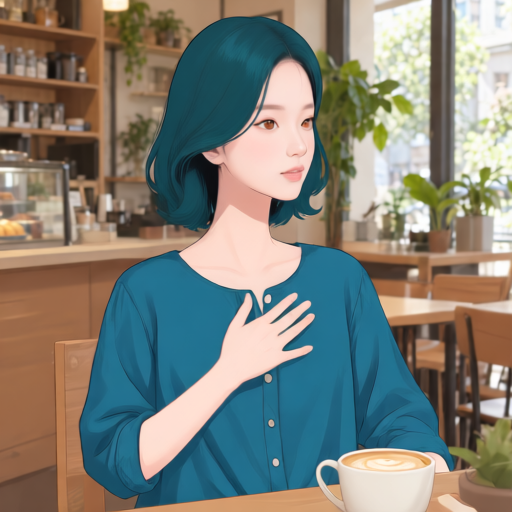 | 가슴 위 손과 컵 유지. 셔츠의 칼라·목선이 둥근 목선으로 바뀜. 의상 디자인 보존의 명확한 확인 대상. |
| P712-CAM-010 · man / level / 90° |  | 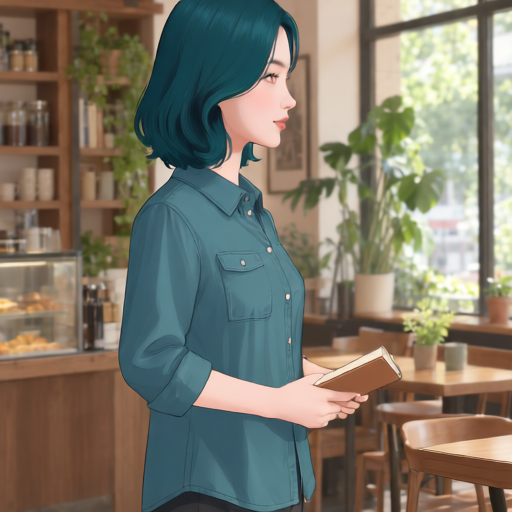 | 책·수평 측면·창가 구도 유지. 치아가 보이는 웃음이 닫힌 입으로 바뀜. 헤어 외곽은 일관되나 동일 두상 여부는 보류. |
| P712-CAM-011 · man / elevated / -90° | 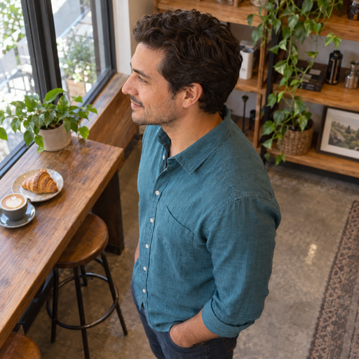 | 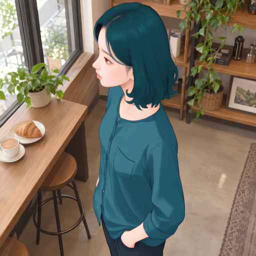 | 높은 시점과 주머니에 넣은 손 유지. 셔츠 칼라가 사라지고 목선이 변형됨. 몸통이 가늘어짐. |
| P712-CAM-012 · man / elevated / -45° | 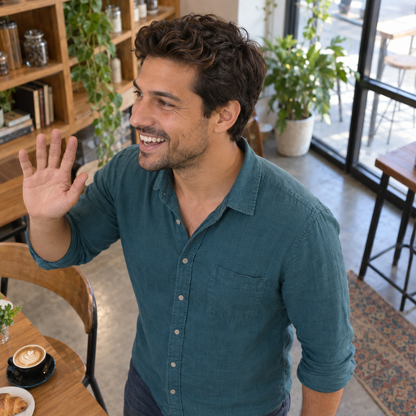 | 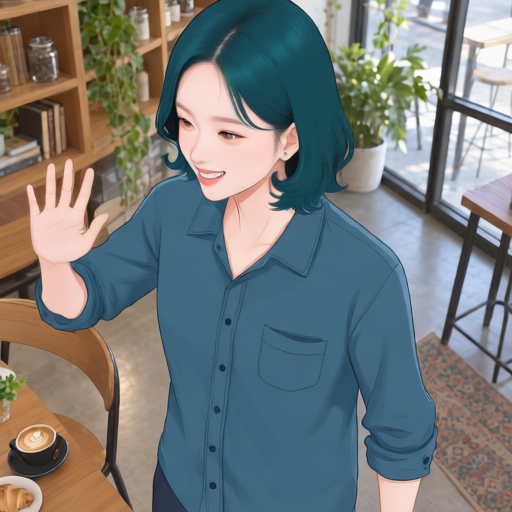 | 높은 시점·손 흔들기·웃음 유지. 인물 크기와 손 윤곽이 달라짐. 테이블·컵의 큰 위치는 유지. |
| P712-CAM-013 · man / elevated / 0° | 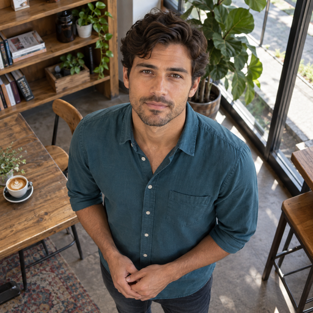 | 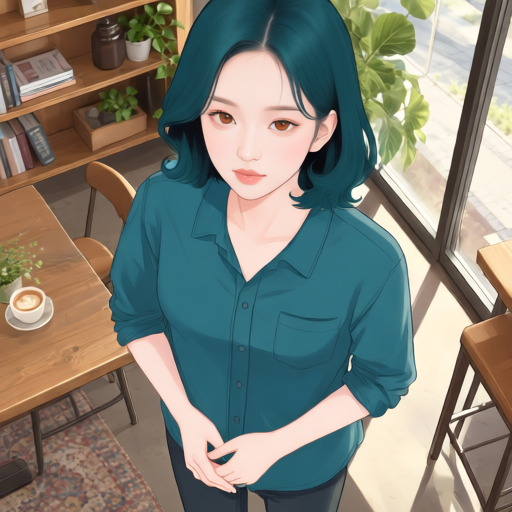 | 위쪽 카메라를 향한 시선과 모은 손 유지. 머리·눈의 비중이 커지고 몸통이 가늘어짐. |
| P712-CAM-014 · man / elevated / 45° | 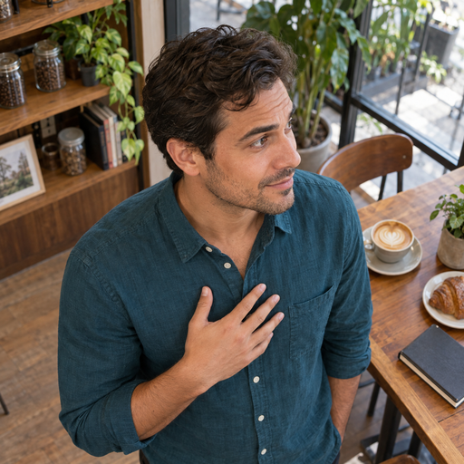 | 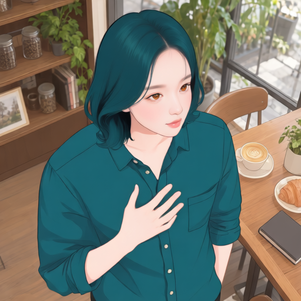 | 가슴 위 손과 높은 시점 유지. 얼굴·머리 비중이 커짐. 장면 배치는 대체로 유지하나 비율 보존은 부분적. |
| P712-CAM-015 · man / elevated / 90° |  | 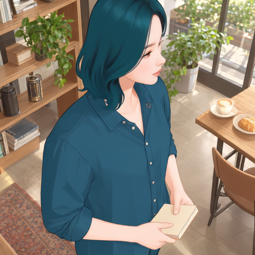 | 책과 높은 시점의 우향 자세 유지. 웃음이 약해지고 얼굴·헤어가 화면에서 차지하는 비중이 커짐. |
| P712-CAM-016 · woman / low / -90° | 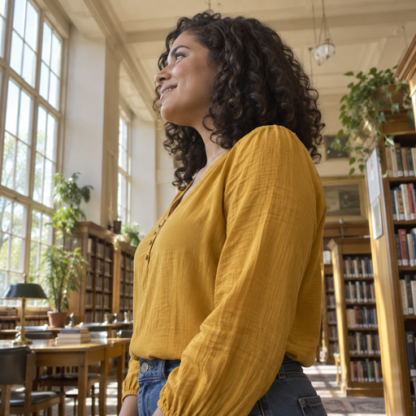 | 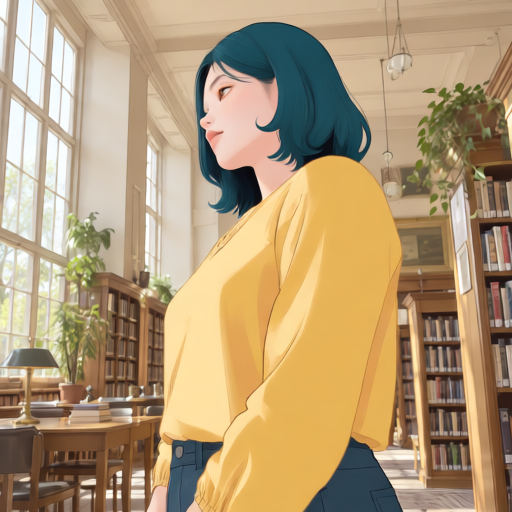 | 좌향 낮은 시점과 노란 상의 유지. 얼굴·헤어 변환이 뚜렷하고 머리 부피가 줄어듦. 배경과 인물의 채색 질감 차이가 남음. |
| P712-CAM-017 · woman / low / -45° | 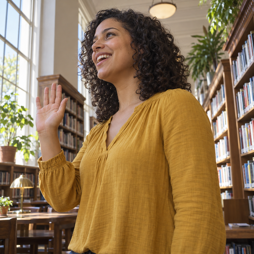 | 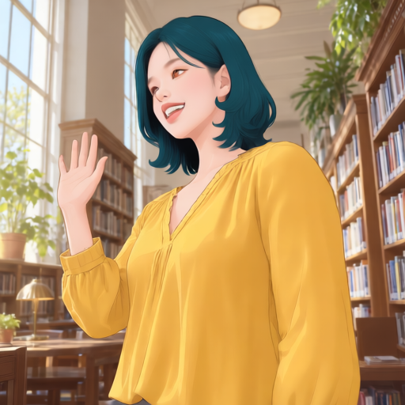 | 손 흔들기와 열린 웃음 유지. 블라우스 주름·소매 형태가 단순화되고 손 크기가 달라짐. |
| P712-CAM-018 · woman / low / 0° | 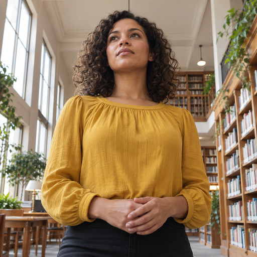 | 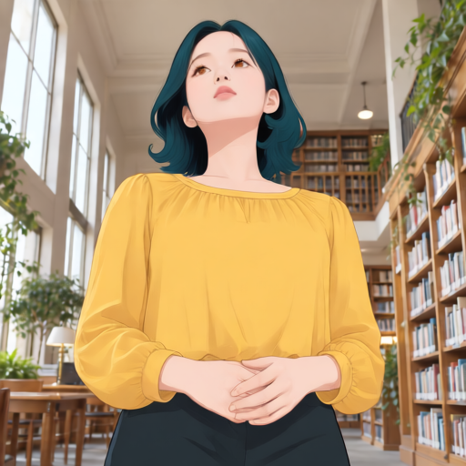 | 올려다보는 얼굴과 모은 손 유지. 목·턱이 길어 보이고 손가락 배치가 재구성됨. |
| P712-CAM-019 · woman / low / 45° | 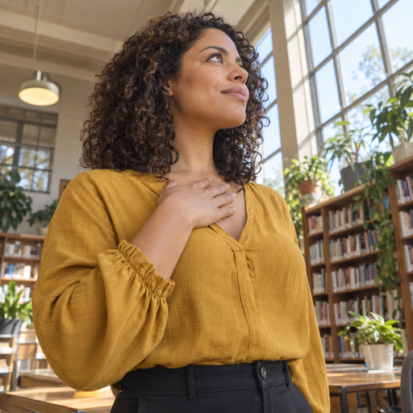 | 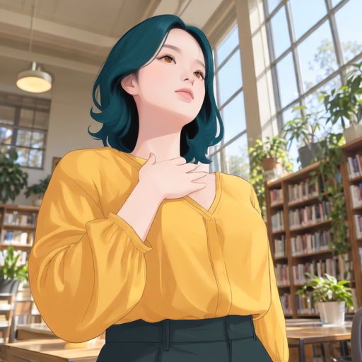 | 가슴 위 손과 시선 방향 유지. 상의 목선이 더 깊은 V 형태로 바뀌고 가슴·몸통 윤곽도 달라짐. |
| P712-CAM-020 · woman / low / 90° |  | 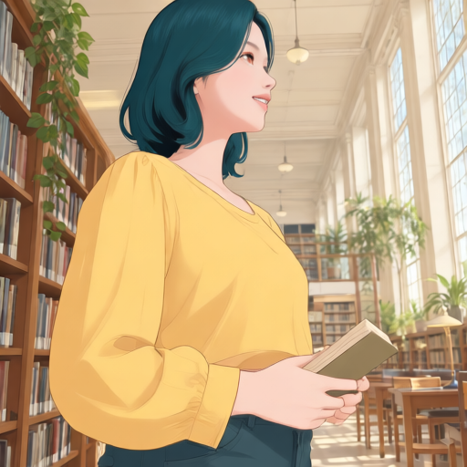 | 책과 오른쪽을 보는 낮은 시점 유지. 웃음은 남으나 입의 벌어짐이 줄고 목선·소매 세부가 달라짐. |
| P712-CAM-021 · woman / level / -90° | 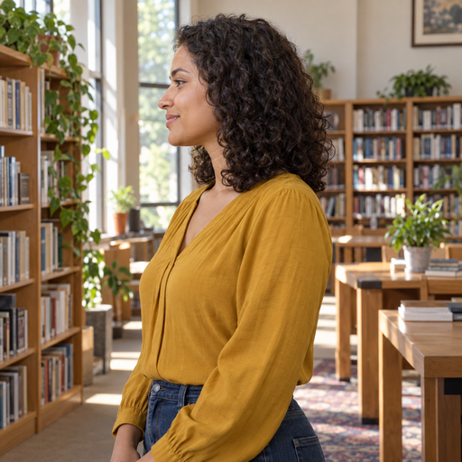 | 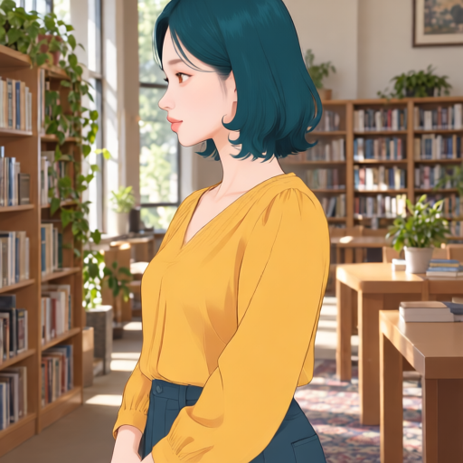 | 좌향 측면과 서 있는 자세 유지. 기준 단발·측면 인상이 보임. 어깨·허리 폭과 상의 주름이 바뀜. |
| P712-CAM-022 · woman / level / -45° |  | 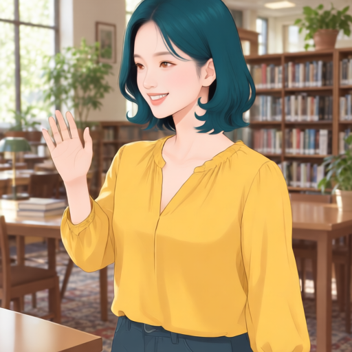 | 손 흔들기·열린 웃음과 기존 중앙 트임의 V형 목선 유지. 입력에도 같은 목선 구조가 있어 목선 변경 사례에서 제외한다. |
| P712-CAM-023 · woman / level / 0° | 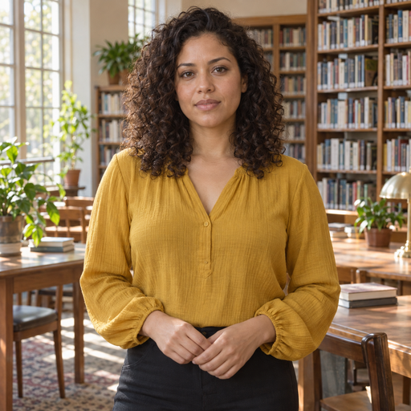 | 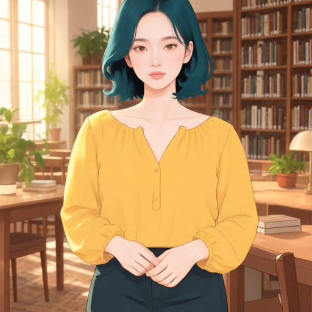 | 정면 인상과 단발이 비교적 안정적. 모은 손과 도서관 배치 유지. 상의 트임·손가락·몸통 비율은 바뀜. |
| P712-CAM-024 · woman / level / 45° | 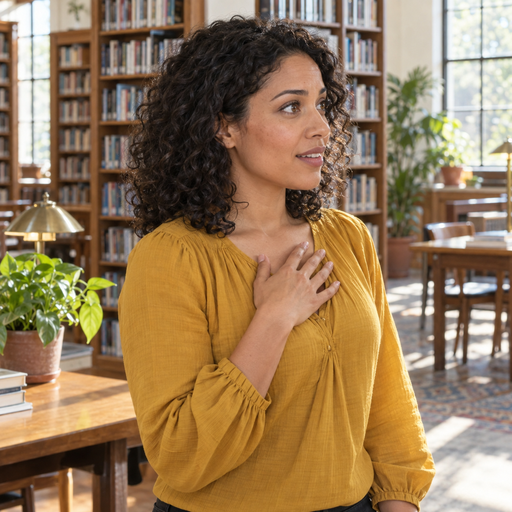 | 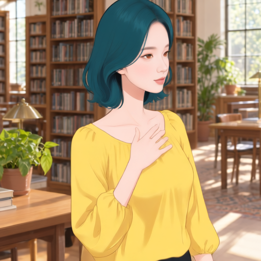 | 가슴 위 손과 우향 시선 유지. 입력의 열린 입이 닫히며 표정이 차분해짐. 머리 부피와 손 위치가 달라짐. |
| P712-CAM-025 · woman / level / 90° |  | 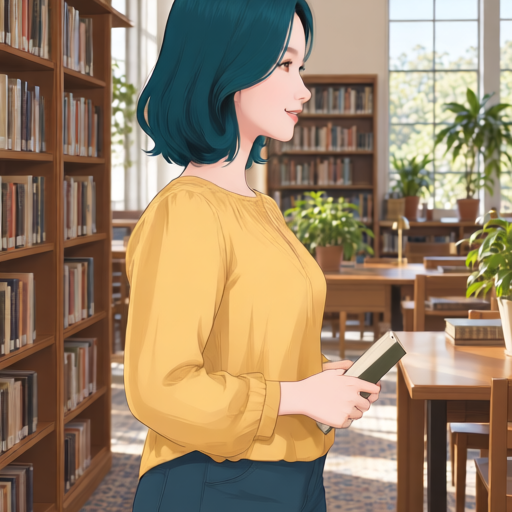 | 책과 우향 측면 유지. 미소는 남지만 입 벌어짐이 줄어듦. 의상 주름·허리 비율은 단순화됨. |
| P712-CAM-026 · woman / elevated / -90° | 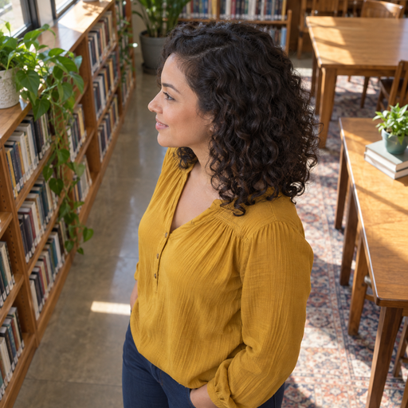 | 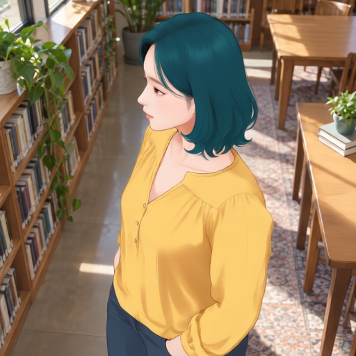 | 높은 시점·좌향 자세 유지. 상의 목선에 칼라처럼 보이는 형태가 생김. 머리 크기와 어깨 윤곽이 바뀜. |
| P712-CAM-027 · woman / elevated / -45° | 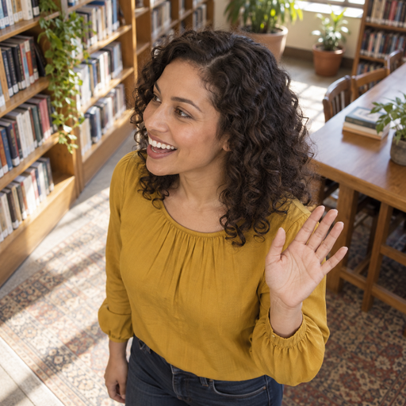 | 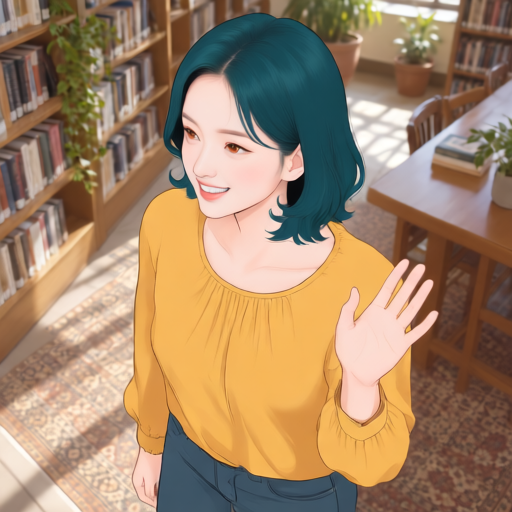 | 높은 시점·손 흔들기·웃음 유지. 인물 채색은 일러스트로 바뀌지만 바닥·서가의 사진 질감이 남음. |
| P712-CAM-028 · woman / elevated / 0° | 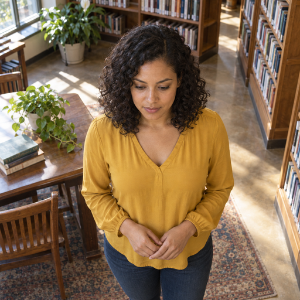 | 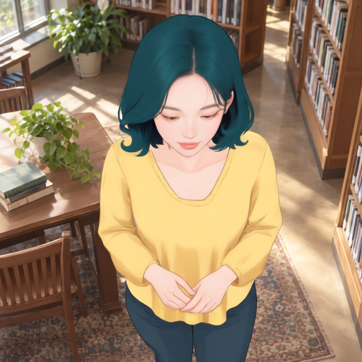 | 아래를 보는 시선과 모은 손 유지. V 목선이 둥근 목선으로 바뀜. 얼굴과 손이 이상화·단순화됨. |
| P712-CAM-029 · woman / elevated / 45° | 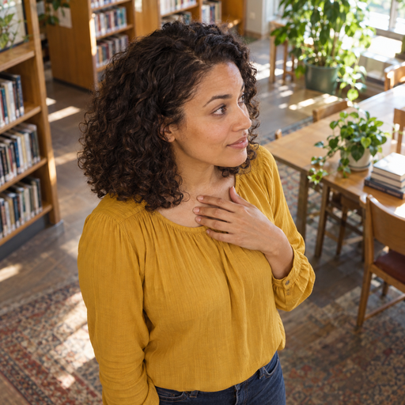 | 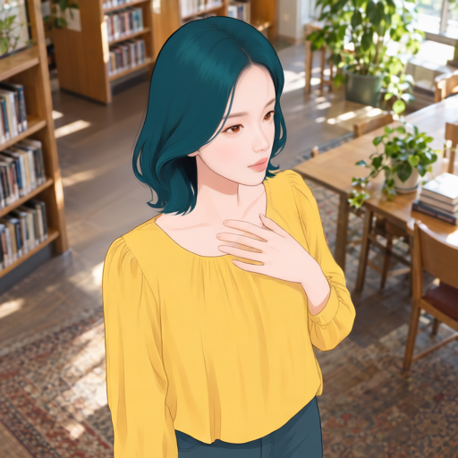 | 가슴 위 손과 높은 시점 유지. 입이 닫히고 표정이 약화됨. 목선이 둥글어져 원래 디자인과 차이. |
| P712-CAM-030 · woman / elevated / 90° |  | 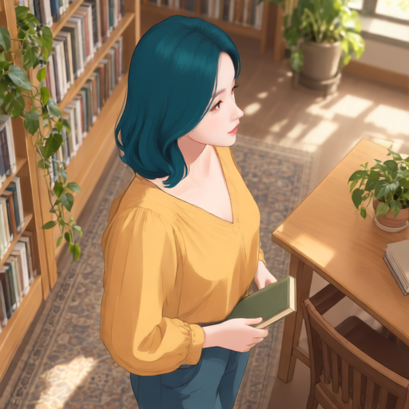 | 책과 높은 시점의 우향 자세 유지. 치아가 보이는 웃음이 닫힌 입으로 바뀜. 책·손의 각도도 달라짐. |
| P712-CAM-031 · toddler / low / -90° | 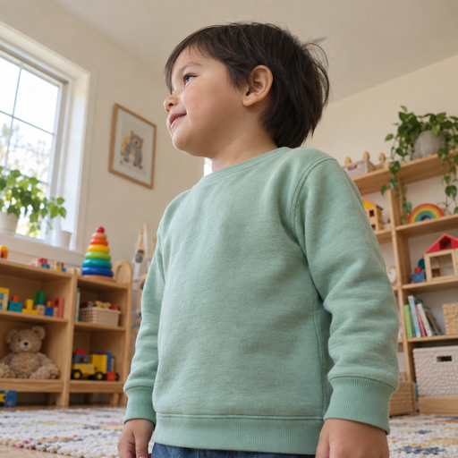 | 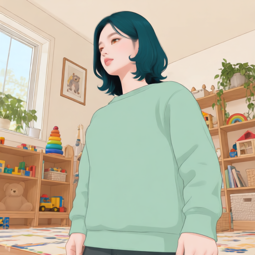 | 낮은 시점과 민트 상의 유지. 성인 Mira 계열 얼굴로 변환되면서 목·어깨·가슴 비율도 변함. 얼굴 변환과 몸 비율 변화는 분리 판단 필요. |
| P712-CAM-032 · toddler / low / -45° | 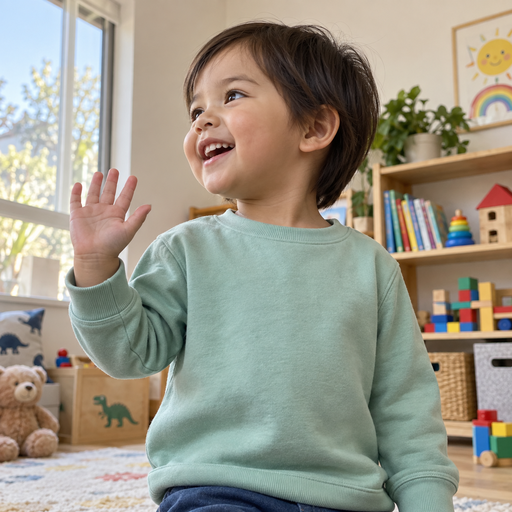 | 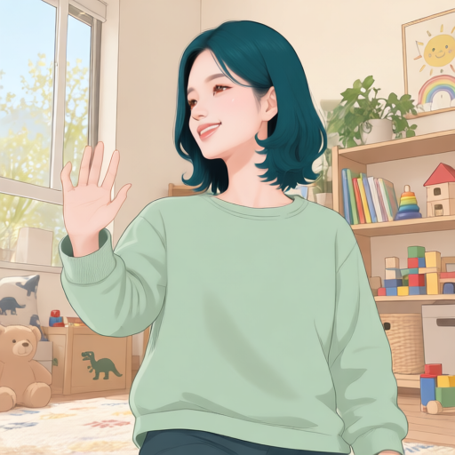 | 손 흔들기와 웃음은 유지. 머리·몸 비율과 손 크기가 성인형으로 이동. 배경도 비교적 넓게 일러스트화됨. |
| P712-CAM-033 · toddler / low / 0° | 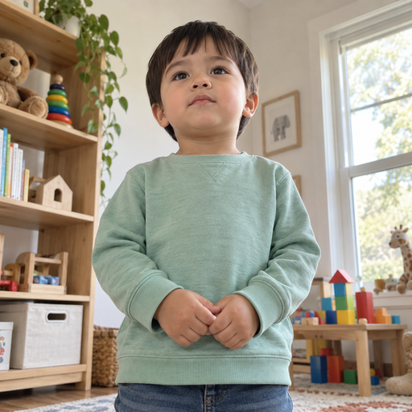 | 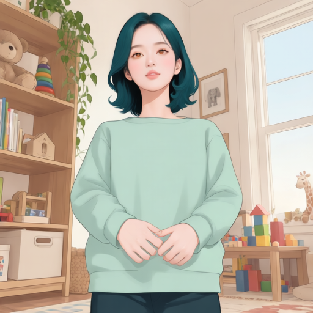 | 정면·모은 손 유지. 작은 유아 얼굴에서 성인형 얼굴·긴 목으로 변환되고 몸통도 길어 보임. |
| P712-CAM-034 · toddler / low / 45° | 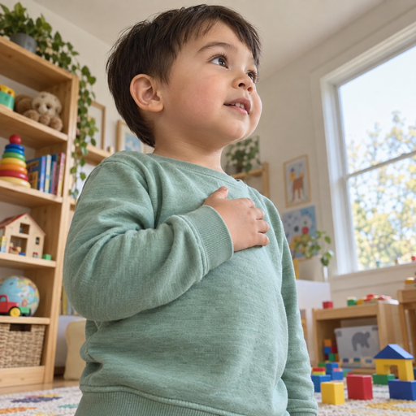 | 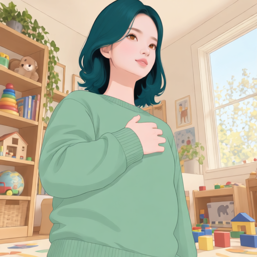 | 가슴 위 손과 우향 시선 유지. 입이 닫히고 목·가슴·손 크기가 변함. 창문·장난감의 큰 배치는 유지. |
| P712-CAM-035 · toddler / low / 90° | 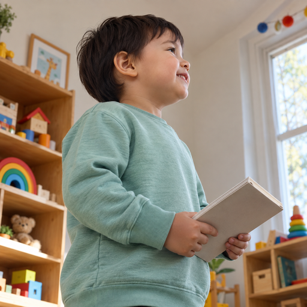 | 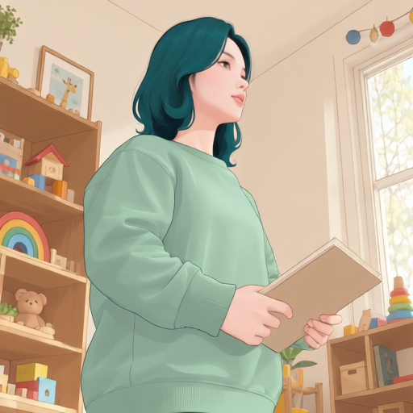 | 책과 우향 낮은 시점 유지. 웃음이 약해지고 몸통·팔 비율이 달라짐. 배경의 윤곽도 단순화됨. |
| P712-CAM-036 · toddler / level / -90° | 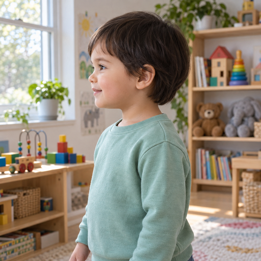 | 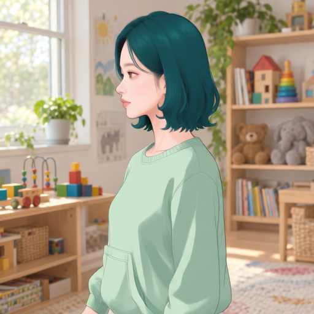 | 좌향 측면·민트 상의 유지. 성인형 턱·목·가슴 윤곽으로 변화. 뒤쪽 머리 외곽은 기준 계열이지만 원본과 동일 비율은 아님. |
| P712-CAM-037 · toddler / level / -45° | 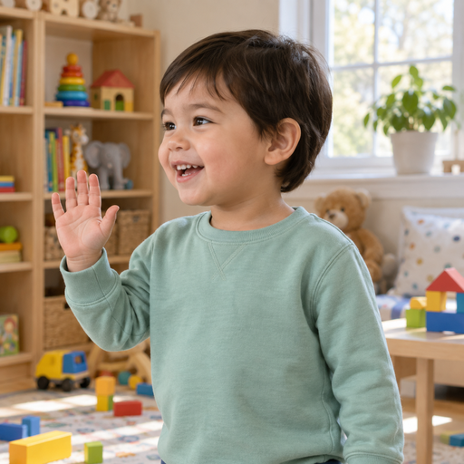 | 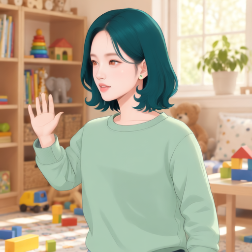 | 손 흔들기는 유지되나 열린 웃음이 거의 사라짐. 얼굴·손·몸 비율이 성인형으로 바뀜. |
| P712-CAM-038 · toddler / level / 0° | 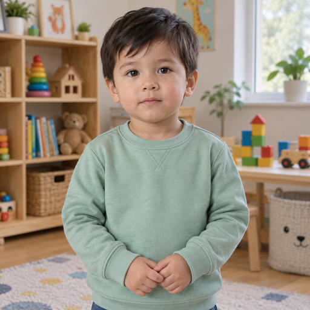 | 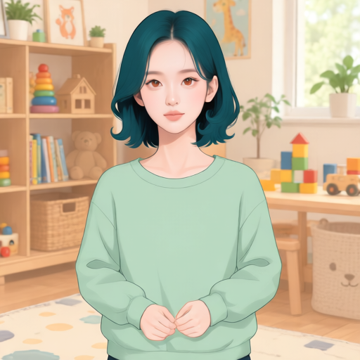 | 정면 Mira 인상은 분명함. 모은 손과 방의 큰 배치 유지. 머리가 작아지고 목·몸통이 길어져 입력 비율 변화가 큼. |
| P712-CAM-039 · toddler / level / 45° | 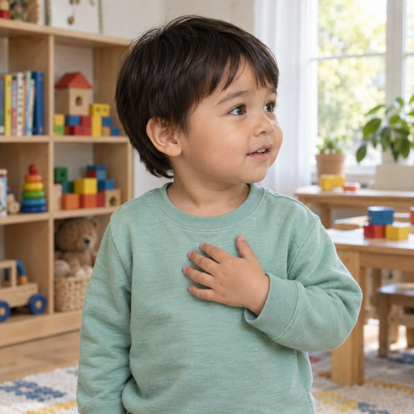 | 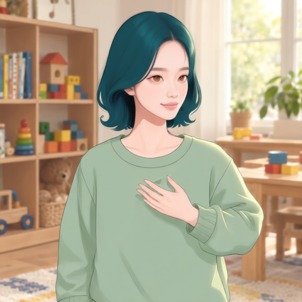 | 가슴 위 손·우향 시선 유지. 유아 표정이 차분한 미소로 바뀌며 턱·목·어깨 비율도 변함. |
| P712-CAM-040 · toddler / level / 90° | 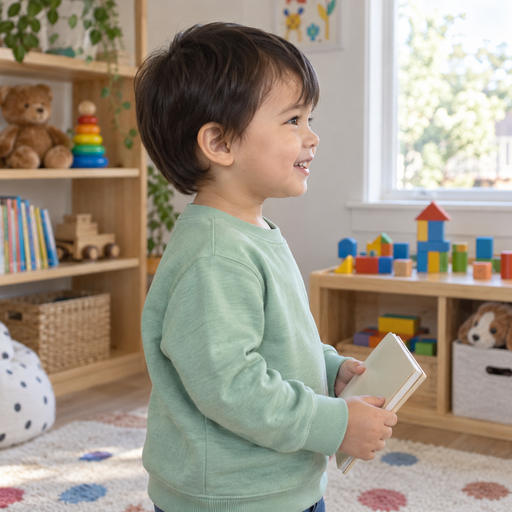 | 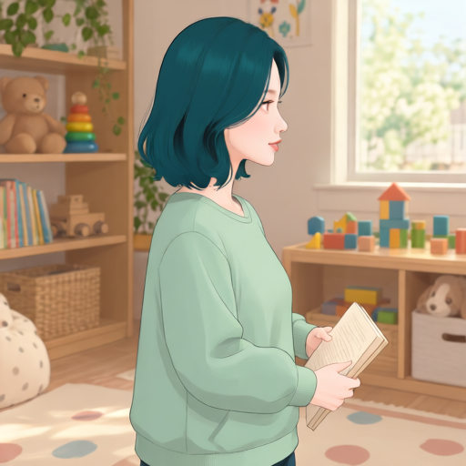 | 우향 측면과 책을 든 동작 유지. 책이 닫힌 상태에서 펼친 상태로 바뀜. 소품 상태 보존의 명확한 확인 대상. |
| P712-CAM-041 · toddler / elevated / -90° | 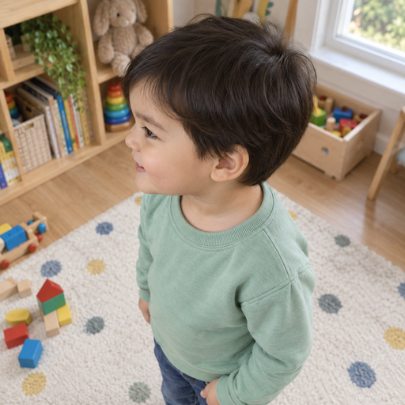 | 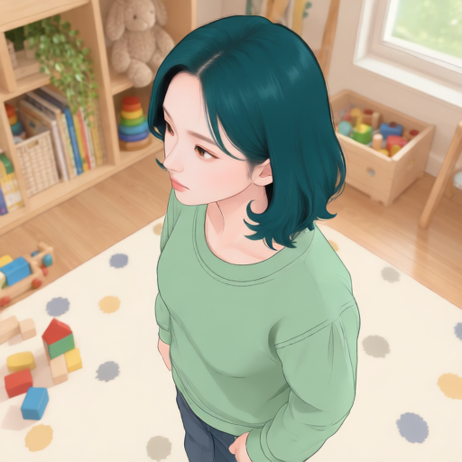 | 높은 시점·좌향 자세 유지. 머리·목·상체 비율 변화가 보임. 카펫과 장난감은 단순화되지만 큰 배치는 유지. |
| P712-CAM-042 · toddler / elevated / -45° | 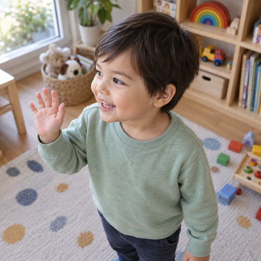 | 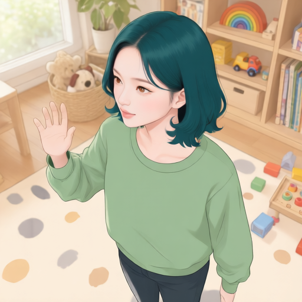 | 높은 시점과 손 흔들기 유지. 열린 웃음이 닫힌 입으로 약화. 인물 비율과 소매·손 크기가 달라짐. |
| P712-CAM-043 · toddler / elevated / 0° | 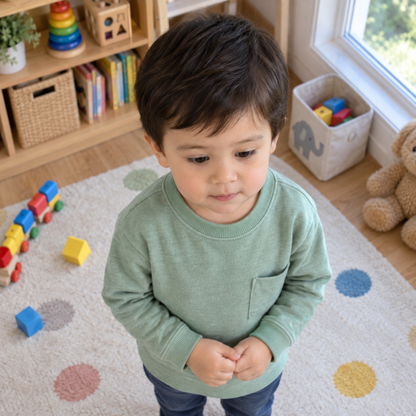 | 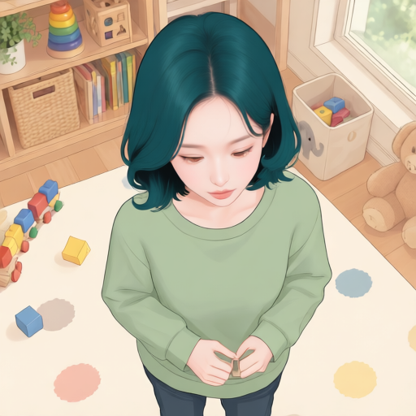 | 아래를 보는 시선과 모은 손 유지. 손 모양이 다시 그려지고 머리·상체 비율이 바뀜. 바닥 무늬는 단순화됨. |
| P712-CAM-044 · toddler / elevated / 45° | 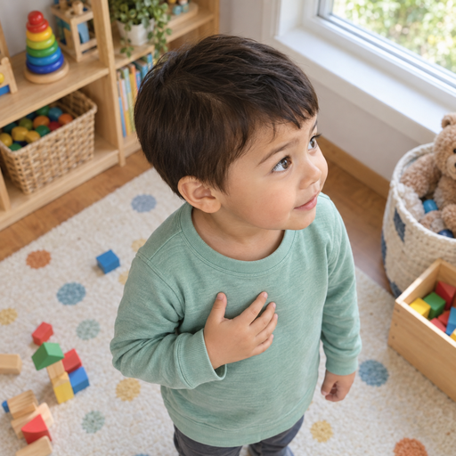 | 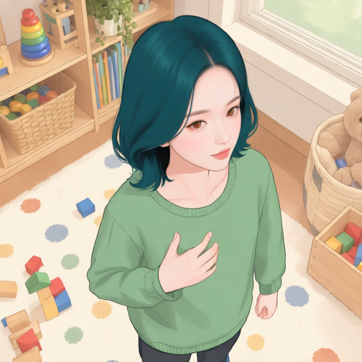 | 가슴 위 손과 높은 시점 유지. 성인형 얼굴·목·손으로 변환. 큰 배경 배치는 유지하나 작은 물체 윤곽은 달라짐. |
| P712-CAM-045 · toddler / elevated / 90° | 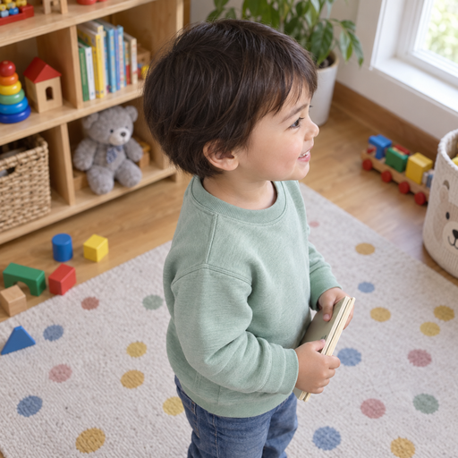 | 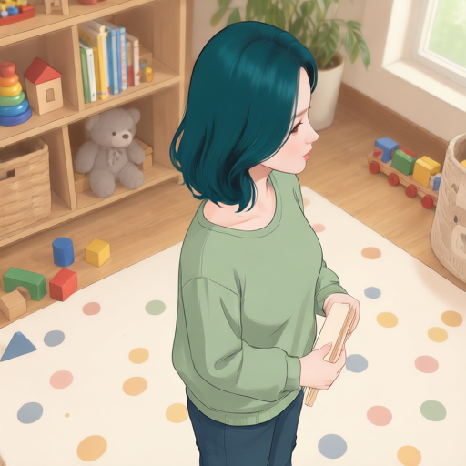 | 책과 높은 시점의 우향 자세 유지. 몸통이 길어지고 책·손 크기 및 각도가 바뀜. 미소가 약화됨. |
