# 12개 입력 강도 비교 · 1600 vs 3200

**현재 권장: 누적 3200스텝 · 강도 0.75.** 2026-09-20 사용자 선택이다. 아래 항목별 관찰은 그대로 유지하며, 문서 하단의 0.5 후보 의견은 선택 이전의 AI 검수 기록이다.

[검수 요약](bfs-camera-366-review.md) · [45장 스텝 비교](bfs-camera-366-step-review.md) · [12개 강도 비교](bfs-camera-366-scale-review.md)

Mira 토르소 참조는 [P7-5.2의 15방향 원본](../../../../parts/part-07/chapter-05/section-02.md) 중 각 입력의 시점·좌우 방향에 대응하는 이미지다. 얼굴·헤어·화풍 비교용이며, 의상·동작·몸 비율의 보존 기준은 입력 이미지다. 참조를 표에 추가한 것이며 생성 시 모델에 전달한 이미지는 아니다.

같은 강도의 1600·3200 결과를 좌우로 비교한다. 각 이미지 행 바로 아래에 해당 검수 의견을 배치했다. 입력과 미적용은 각 항목에서 한 번만 표시한다.

| 항목 | 주요 확인점 | 항목 | 주요 확인점 |
| --- | --- | --- | --- |
| [006](#case-006) | 측면·인물 크기 | [009](#case-009) | 칼라 |
| [010](#case-010) | 추가 포켓·책 | [015](#case-015) | 셔츠 구조 |
| [017](#case-017) | 목선·앞단추 | [023](#case-023) | 상의 길이 |
| [026](#case-026) | 목선·주머니 손 | [028](#case-028) | 목선·시선 |
| [037](#case-037) | 웃음 | [038](#case-038) | 손 모양 |
| [041](#case-041) | 소매·바지 길이 | [043](#case-043) | 소매·밑단·포켓 |

## P712-CAM-006 · man / level / -90°

| 입력 | Mira 토르소 참조 | 미적용 |
| --- | --- | --- |
|  |  | 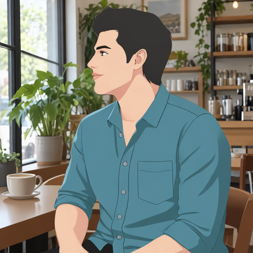 |

미적용 관찰: 좌향 측면·칼라·단추·포켓·컵은 남지만 청록 단발로 변환되지 않음. 몸통·얼굴 비율과 컵 크기도 바뀌어 미적용이 원본 보존의 완전한 기준은 아님.

| 강도 | 1600스텝 | 3200스텝 |
| --- | --- | --- |
| **0.5** | 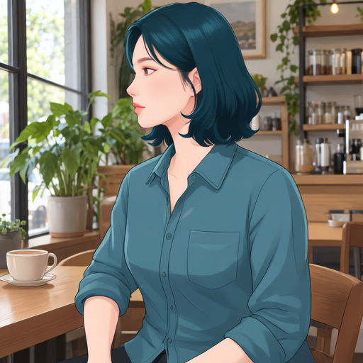 | 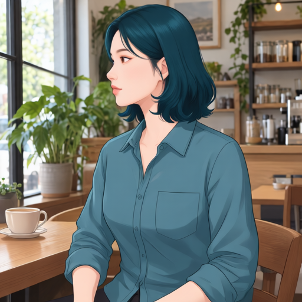 |
| 검수 의견 | 청록 단발과 좌향 측면 유지. 머리 위 여백은 1.0보다 입력에 가까우나 몸통이 가늘어지고 포켓·칼라 윤곽이 바뀜. | 1.0의 정면 회전과 인물 축소가 완화됨. 청록 단발·측면·셔츠 구조가 남지만 포켓 모양·몸 비율은 입력과 다름. |
| **0.75** | 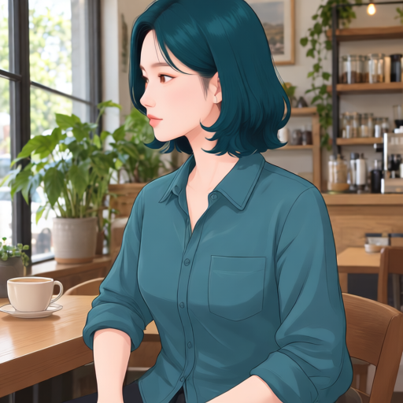 | 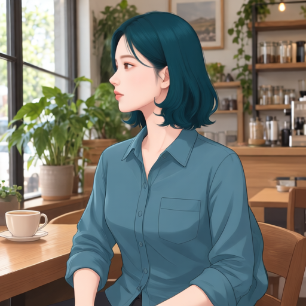 |
| 검수 의견 | 0.5와 유사한 얼굴·측면·셔츠 구조. 머리 위가 잘리고 입력보다 가는 몸통 변화가 남음. | 1.0보다 측면을 잘 유지하지만 0.5보다 머리·상체가 작아짐. 셔츠 구조는 유지. |
| **1.0** |  | 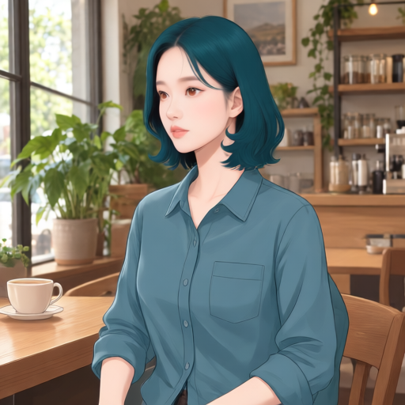 |
| 검수 의견 | 측면과 셔츠 구조는 남지만 머리 상단이 잘리고 몸통 비율이 달라짐. | 얼굴이 정면 쪽으로 돌아오고 인물 크기가 크게 줄어듦. 0.5·0.75에서 이 변화가 완화됨. |

[기존 강도 1.0 검수](bfs-camera-366-step-review.md#case-006) · [검수 요약](bfs-camera-366-review.md)

## P712-CAM-009 · man / level / 45°

| 입력 | Mira 토르소 참조 | 미적용 |
| --- | --- | --- |
|  |  | 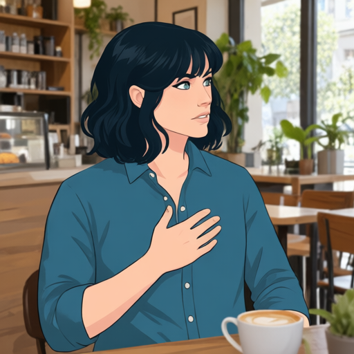 |

미적용 관찰: 칼라·단추·가슴 위 손·컵 유지. 머리와 얼굴은 적용 결과의 공통 인상과 다르고 인물 크기도 줄어듦.

| 강도 | 1600스텝 | 3200스텝 |
| --- | --- | --- |
| **0.5** | 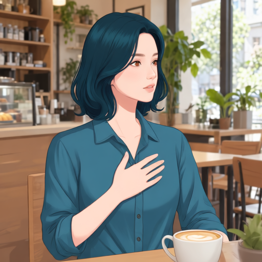 | 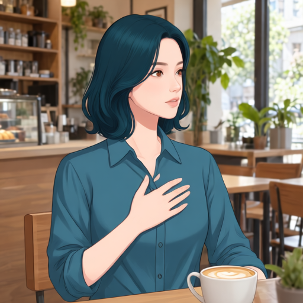 |
| 검수 의견 | 칼라·단추가 남아 1.0의 목선 변경을 완화. 얼굴·단발 변환은 남지만 몸통 폭·손·컵 표현은 입력과 다름. | 칼라·단추·가슴 위 손 유지. 1.0보다 우향 얼굴이 남지만 입력보다는 정면에 가까움. |
| **0.75** | 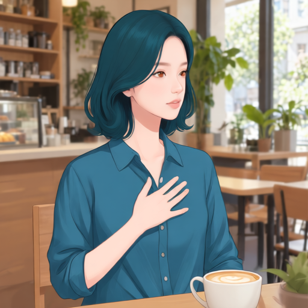 | 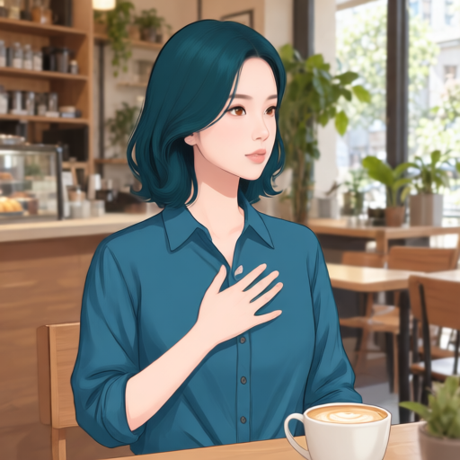 |
| 검수 의견 | 칼라 유지. 0.5보다 정돈된 단발·얼굴이나 몸통 축소와 정면 쪽 방향 차이는 남음. | 칼라 유지. 0.5와 유사한 구도이며 얼굴 방향·손 비율 변화는 남음. |
| **1.0** |  | 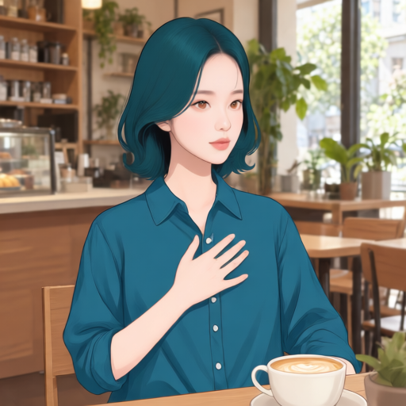 |
| 검수 의견 | 칼라가 사라져 둥근 목선으로 변경됨. 낮은 강도 두 조건에서는 칼라가 복구됨. | 칼라는 남지만 낮은 강도보다 얼굴이 정면에 가까워지고 입이 닫힘. 의상 세부·몸통 비율 차이 지속. |

[기존 강도 1.0 검수](bfs-camera-366-step-review.md#case-009) · [검수 요약](bfs-camera-366-review.md)

## P712-CAM-010 · man / level / 90°

| 입력 | Mira 토르소 참조 | 미적용 |
| --- | --- | --- |
|  |  | 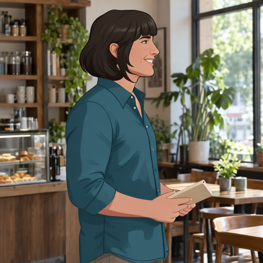 |

미적용 관찰: 우향 측면·열린 웃음·책·포켓 없는 셔츠 유지. 짙은 갈색 단발로 바뀌어 적용 결과와 헤어·얼굴 인상이 다름.

| 강도 | 1600스텝 | 3200스텝 |
| --- | --- | --- |
| **0.5** |  | 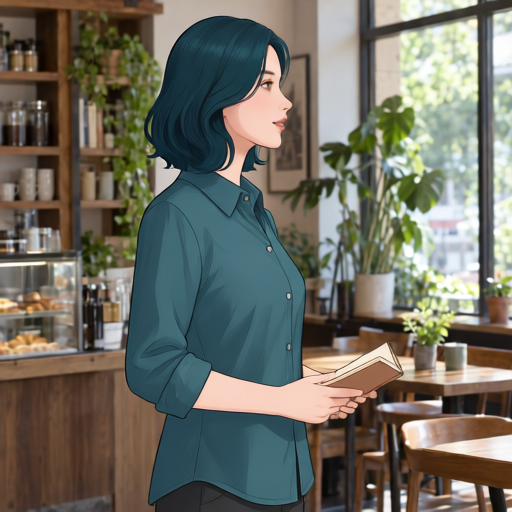 |
| 검수 의견 | 1.0의 추가 포켓이 없고 입이 조금 열려 있음. 머리 위 여백도 복구되나 몸통이 가늘고 책 윗면이 벌어진 형태로 바뀜. | 포켓 추가 없이 측면·청록 단발 유지. 1.0보다 입 벌어짐이 남지만 입력의 큰 웃음에는 못 미침. 책 상태가 달라짐. |
| **0.75** | 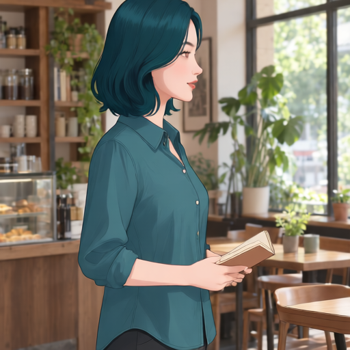 | 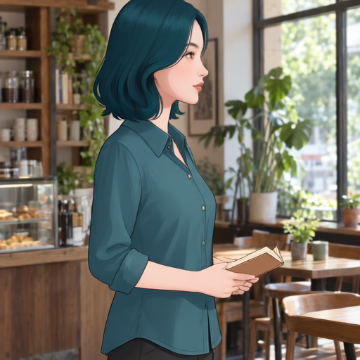 |
| 검수 의견 | 추가 포켓은 없지만 웃음이 닫힌 입으로 약해짐. 책 상태·몸 비율 변화는 남음. | 포켓 없음. 0.5보다 웃음이 약하고 머리 위가 잘림. 책 상태·가느다란 몸통 변화 지속. |
| **1.0** |  | 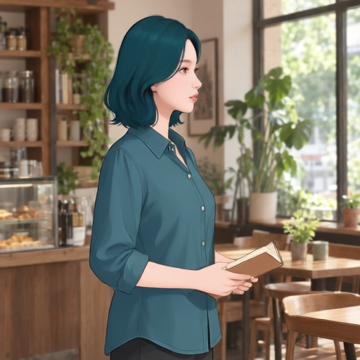 |
| 검수 의견 | 입력에 없던 덮개 포켓이 추가됨. 웃음이 약해지고 책 색·크기 차이도 남음. | 포켓은 없지만 인물 축소·닫힌 입이 나타남. 강도 저하만으로 책 상태까지 복구되지는 않음. |

[기존 강도 1.0 검수](bfs-camera-366-step-review.md#case-010) · [검수 요약](bfs-camera-366-review.md)

## P712-CAM-015 · man / elevated / 90°

| 입력 | Mira 토르소 참조 | 미적용 |
| --- | --- | --- |
|  |  | 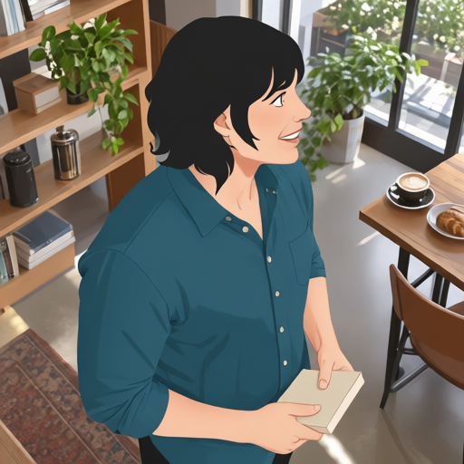 |

미적용 관찰: 높은 시점·열린 웃음·칼라·단추·책 유지. 검은 머리와 다른 얼굴 인상이며 몸통·손 비율 변화는 있음.

| 강도 | 1600스텝 | 3200스텝 |
| --- | --- | --- |
| **0.5** | 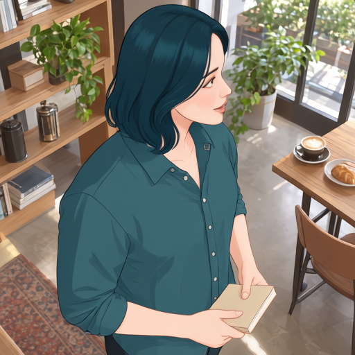 | 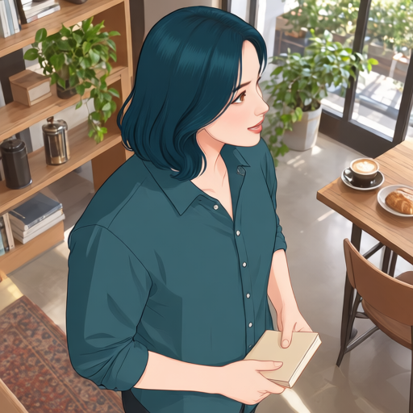 |
| 검수 의견 | 청록 단발과 칼라·단추·책 유지. 1.0보다 머리 여백이 남고 약한 웃음이 보이지만 가슴 포켓은 뚜렷하지 않음. | 1.0에서 사라진 칼라·앞단추가 복구되고 약한 웃음도 남음. 방향도 1.0보다 측면에 가깝지만 포켓 세부는 미복구. |
| **0.75** | 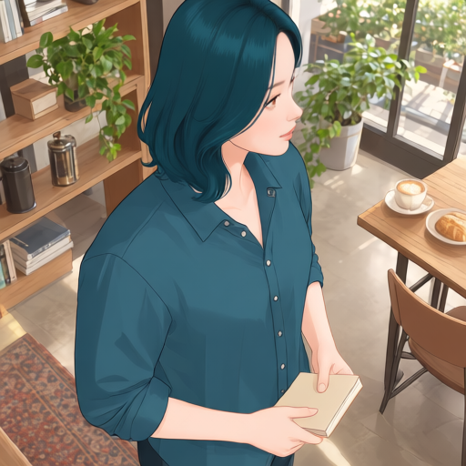 | 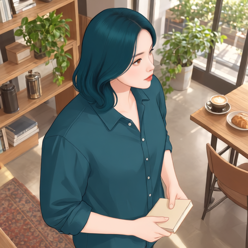 |
| 검수 의견 | 칼라·단추는 유지하나 머리 상단이 잘리고 웃음이 약해짐. 포켓·손·몸 비율 차이는 남음. | 칼라·앞단추는 복구. 0.5보다 얼굴이 정면 쪽으로 돌아오고 입이 닫힘. |
| **1.0** |  | 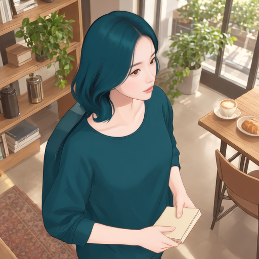 |
| 검수 의견 | 칼라·단추는 남지만 머리 비중이 크고 웃음이 약함. 입력 포켓은 뚜렷하게 보존되지 않음. | 칼라·단추가 사라진 둥근 목선 상의. 낮은 강도에서는 주요 셔츠 구조가 돌아옴. |

[기존 강도 1.0 검수](bfs-camera-366-step-review.md#case-015) · [검수 요약](bfs-camera-366-review.md)

## P712-CAM-017 · woman / low / -45°

| 입력 | Mira 토르소 참조 | 미적용 |
| --- | --- | --- |
|  |  | 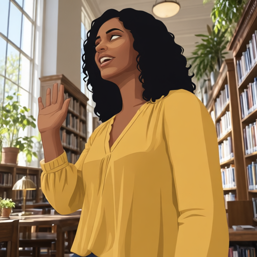 |

미적용 관찰: 손 흔들기·웃음·V형 트임은 남지만 검은 곱슬머리가 이어짐. 인물 채색과 배경 질감 차이가 큼.

| 강도 | 1600스텝 | 3200스텝 |
| --- | --- | --- |
| **0.5** |  |  |
| 검수 의견 | 청록 단발·웃음·V형 트임·손 흔들기 유지. 주름·손 크기와 턱을 든 정도는 입력과 다름. | 1.0의 앞단추 추가 없이 V형 트임을 유지. 얼굴·단발과 열린 웃음도 남아 의상 보존 개선이 보임. |
| **0.75** |  | 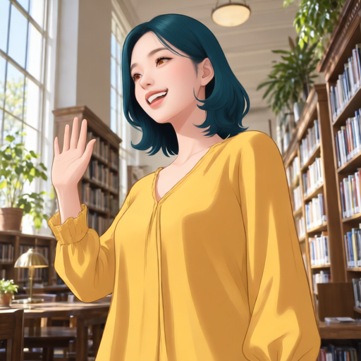 |
| 검수 의견 | 0.5와 유사. V형 트임과 웃음이 남고 몸통·소매 주름은 재구성됨. | 앞단추는 없으나 목선 가장자리·중앙 여밈이 달라지고 얼굴이 더 정면 쪽으로 이동. |
| **1.0** |  |  |
| 검수 의견 | V형 트임·웃음·손 흔들기는 유지. 얼굴 방향·손·주름 차이 있음. | 둥근 목선·작은 트임과 앞단추 줄이 추가됨. 낮은 강도에서 해당 변경이 완화됨. |

[기존 강도 1.0 검수](bfs-camera-366-step-review.md#case-017) · [검수 요약](bfs-camera-366-review.md)

## P712-CAM-023 · woman / level / 0°

| 입력 | Mira 토르소 참조 | 미적용 |
| --- | --- | --- |
|  |  | 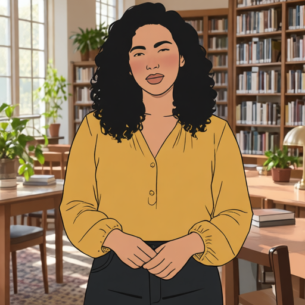 |

미적용 관찰: V형 목선·단추·모은 손은 남으나 눈이 가늘어지고 굵은 윤곽선의 다른 얼굴·곱슬머리로 표현됨.

| 강도 | 1600스텝 | 3200스텝 |
| --- | --- | --- |
| **0.5** | 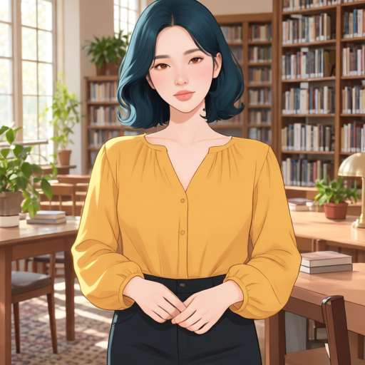 | 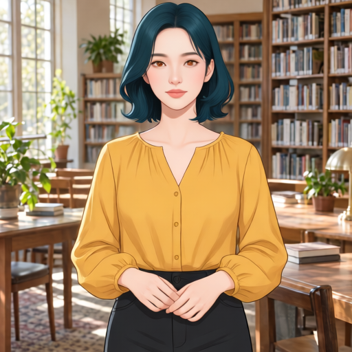 |
| 검수 의견 | 얼굴·청록 단발 변환 유지. 복부 노출은 없지만 목선 테두리·트임과 앞단추 길이가 달라지고 몸통이 가늘어짐. | 1.0의 짧은 상의·복부 노출이 없어지고 트임·단추가 돌아옴. 다만 여밈이 허리까지 길어지고 몸통 비율은 달라짐. |
| **0.75** | 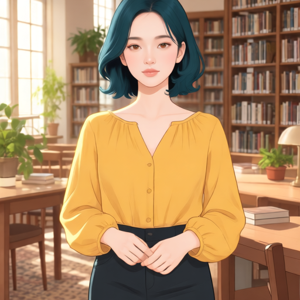 | 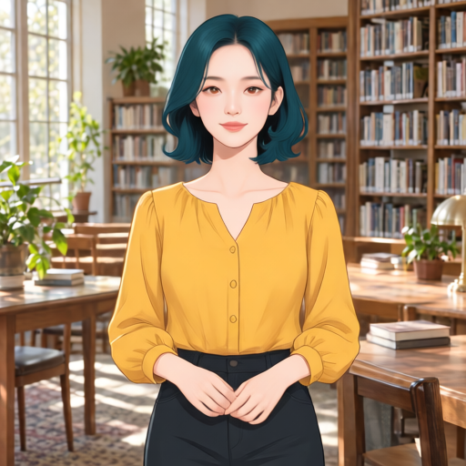 |
| 검수 의견 | 0.5와 비슷한 의상 구조 변경. 정면·모은 손 유지, 인물과 배경의 채색 차이는 남음. | 복부 노출 없이 트임·단추 복구. 0.5보다 인물이 작아지고 어깨·몸통이 가늘어져 구도 차이가 커짐. |
| **1.0** |  | 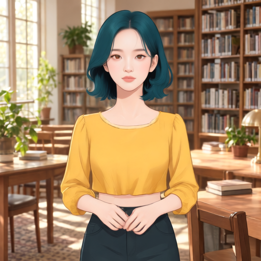 |
| 검수 의견 | 목선 트임·단추 일부는 남으나 원래 V형 목선 디자인과 차이. 복부 노출은 없음. | 트임·단추가 사라지고 복부가 드러남. 낮은 강도 두 조건에서 해당 변화가 완화됨. |

[기존 강도 1.0 검수](bfs-camera-366-step-review.md#case-023) · [검수 요약](bfs-camera-366-review.md)

## P712-CAM-026 · woman / elevated / -90°

| 입력 | Mira 토르소 참조 | 미적용 |
| --- | --- | --- |
|  |  | 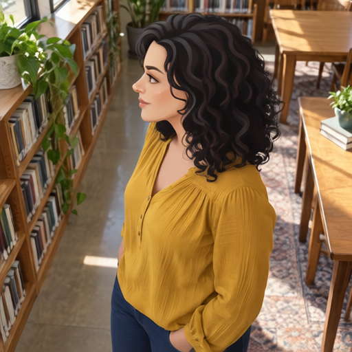 |

미적용 관찰: 좌향·높은 시점·트임·단추·주머니 손은 비교적 남음. 검은 곱슬머리가 유지되어 목표 단발 변환과 다름.

| 강도 | 1600스텝 | 3200스텝 |
| --- | --- | --- |
| **0.5** | 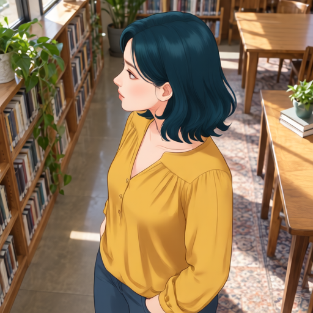 | 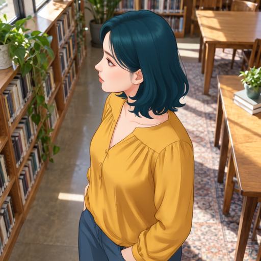 |
| 검수 의견 | 트임·단추·주머니 손 유지. 목선 주변의 넓은 패널·칼라 같은 형태는 1.0과 마찬가지로 입력과 다름. | 1.0에서 사라진 트임·단추와 주머니 손이 돌아옴. 그러나 목선 패널 모양이 입력과 달라 완전 복구는 아님. |
| **0.75** | 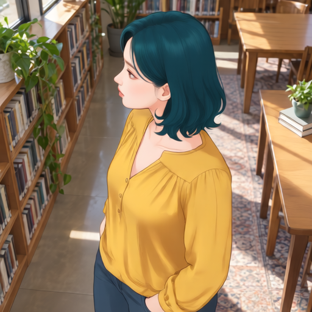 | 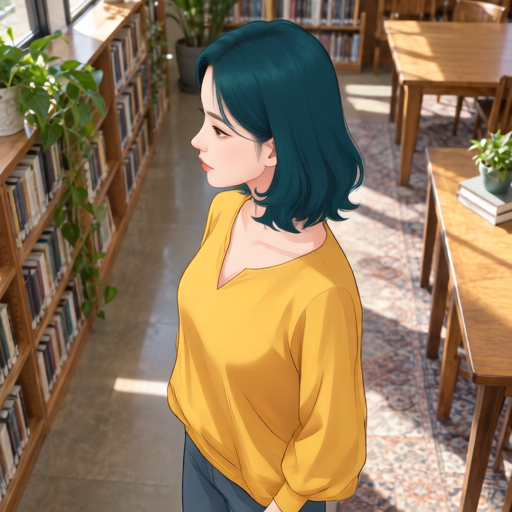 |
| 검수 의견 | 0.5와 유사하며 목선 구조 변경이 남음. 단발 외곽·시선에도 차이. | V형 트임은 남지만 단추·주름 구조가 없어지고 팔을 내린 자세. 0.5보다 의상·자세 보존이 약함. |
| **1.0** |  | 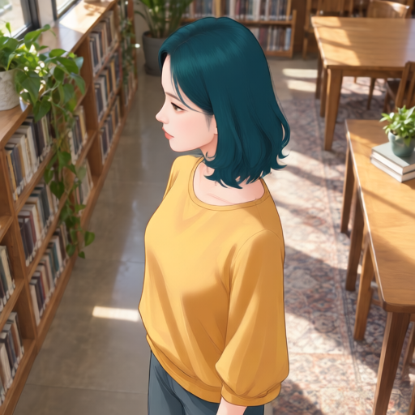 |
| 검수 의견 | 칼라처럼 보이는 목선 구조가 나타남. 단추·주머니 손은 남음. | 둥근 목선으로 바뀌고 단추·트임이 사라짐. 주머니 손 자세도 보존되지 않음. |

[기존 강도 1.0 검수](bfs-camera-366-step-review.md#case-026) · [검수 요약](bfs-camera-366-review.md)

## P712-CAM-028 · woman / elevated / 0°

| 입력 | Mira 토르소 참조 | 미적용 |
| --- | --- | --- |
|  |  | 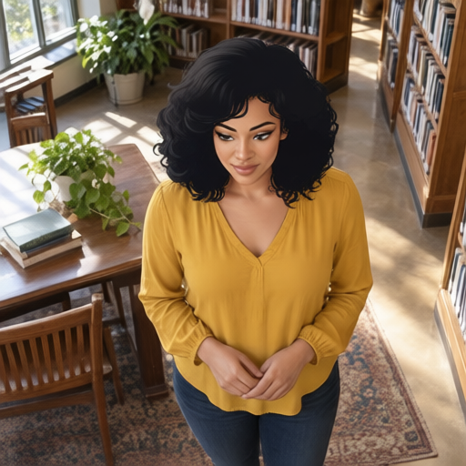 |

미적용 관찰: V형 목선·모은 손·높은 시점 유지. 눈 방향과 검은 곱슬머리·얼굴 인상은 입력 및 적용 결과와 다름.

| 강도 | 1600스텝 | 3200스텝 |
| --- | --- | --- |
| **0.5** |  | 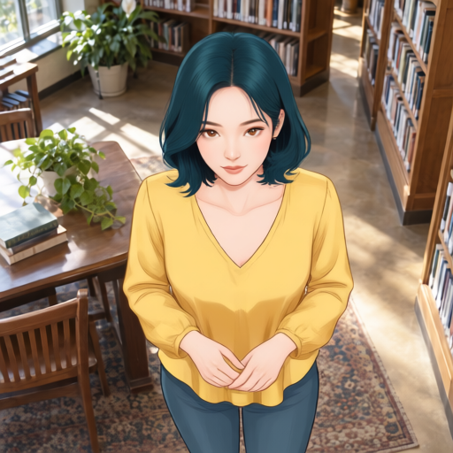 |
| 검수 의견 | 1.0의 둥근 목선 대신 V형이 나타나지만 입력보다 깊고 중앙 여밈은 사라짐. 아래를 보던 시선이 카메라 쪽으로 바뀌어 보존의 상충이 있음. | V형 목선이 돌아오나 입력보다 깊고 여밈 구조는 다름. 카메라를 보는 시선은 1.0과 마찬가지로 입력과 다름. |
| **0.75** | 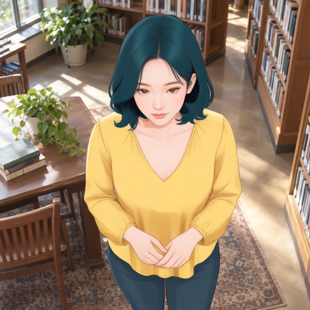 | 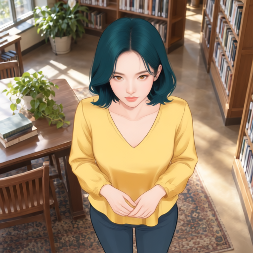 |
| 검수 의견 | V형 목선은 남지만 깊이·여밈 차이 지속. 시선은 1.0만큼 아래로 향하지 않음. | 0.5와 유사한 V형·카메라 시선. 어깨·몸통과 소매 비율은 달라짐. |
| **1.0** |  | 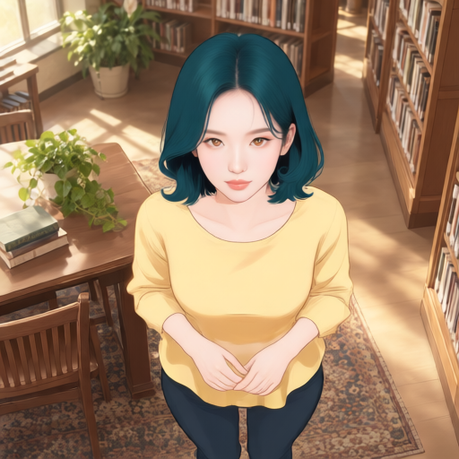 |
| 검수 의견 | 아래를 보는 시선은 남지만 V형 목선이 둥글게 바뀜. | 얕은 둥근 목선과 카메라 시선으로 변화. 낮은 강도에서도 시선은 복구되지 않음. |

[기존 강도 1.0 검수](bfs-camera-366-step-review.md#case-028) · [검수 요약](bfs-camera-366-review.md)

## P712-CAM-037 · toddler / level / -45°

| 입력 | Mira 토르소 참조 | 미적용 |
| --- | --- | --- |
|  |  | 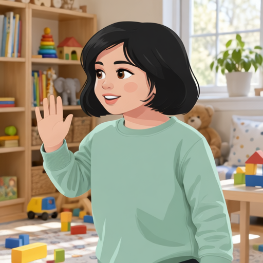 |

미적용 관찰: 손 흔들기·열린 웃음·민트 긴소매 유지. 검은 단발·큰 눈의 다른 캐릭터 인상이며 손·체형도 달라짐.

| 강도 | 1600스텝 | 3200스텝 |
| --- | --- | --- |
| **0.5** |  |  |
| 검수 의견 | 1.0보다 치아가 보이는 웃음이 남음. 청록 단발·손 흔들기 유지. 목 길이·손 크기와 목둘레 삼각 봉제 소실은 남음. | 웃음과 손 흔들기 유지. 1.0보다 측면 방향이 남지만 원래보다 웃음은 작고 목·손 비율 차이는 지속. |
| **0.75** | 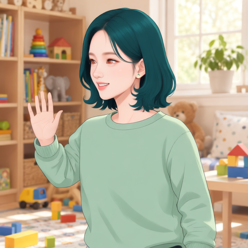 |  |
| 검수 의견 | 0.5와 유사하게 작은 열린 웃음이 보임. 원래 웃음 정도와 몸 비율에는 차이. | 치아가 보이는 웃음이 가장 뚜렷한 편. 얼굴은 0.5보다 정면에 가깝고 몸 비율은 원본과 다름. |
| **1.0** |  |  |
| 검수 의견 | 입 벌어짐과 웃음이 크게 약함. 손 흔들기·상의 큰 구조 유지. | 열린 웃음이 돌아온 상태. 0.75와 비슷한 공통 얼굴·단발이며 소매·허리 주름 차이는 남음. |

[기존 강도 1.0 검수](bfs-camera-366-step-review.md#case-037) · [검수 요약](bfs-camera-366-review.md)

## P712-CAM-038 · toddler / level / 0°

| 입력 | Mira 토르소 참조 | 미적용 |
| --- | --- | --- |
|  |  | 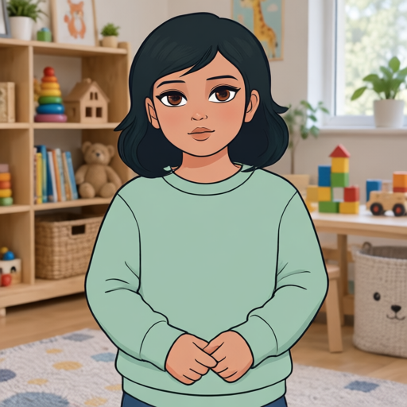 |

미적용 관찰: 정면·모은 손·긴소매 유지. 굵은 선과 큰 눈·짙은 단발의 다른 얼굴 인상이며 몸 비율도 바뀜.

| 강도 | 1600스텝 | 3200스텝 |
| --- | --- | --- |
| **0.5** | 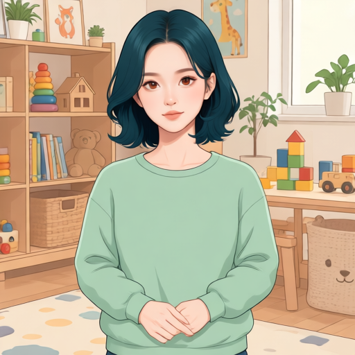 | 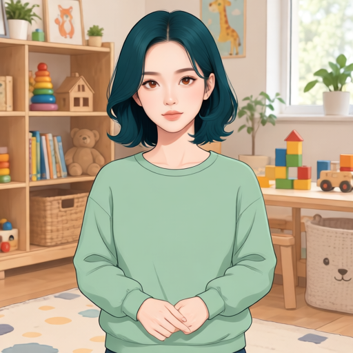 |
| 검수 의견 | 1.0과 유사한 얼굴·청록 단발·긴소매. 손이 포개진 형태로 재구성되고 창밖 풍경이 거의 사라짐. 배경 선이 더 또렷한 일러스트. | 1.0과 유사한 정면 얼굴·단발·민트 상의. 손은 포개진 형태이며 원래 목둘레 삼각 봉제가 없음. |
| **0.75** | 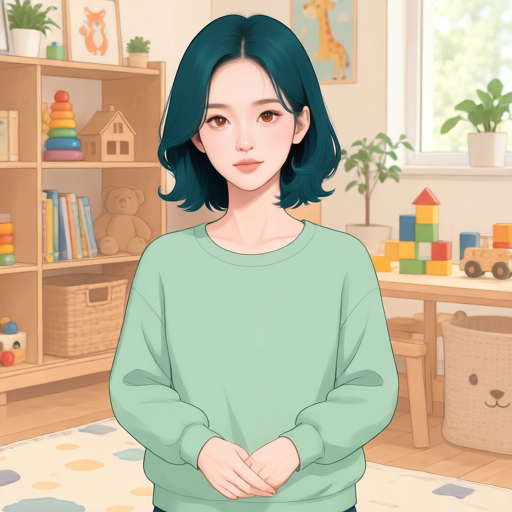 | 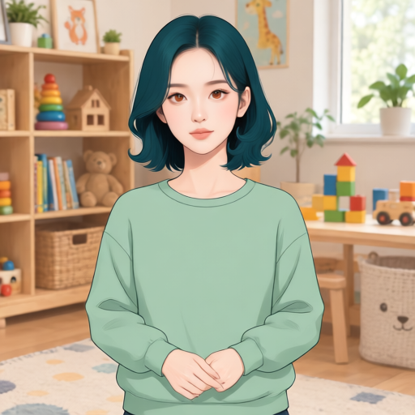 |
| 검수 의견 | 얼굴·단발·상의 큰 구조는 1.0과 유사. 손 포개짐·목 길이·몸 비율 차이는 지속. | 0.5와 매우 유사. 목·몸통 비율과 손 모양의 입력 대비 변화는 남음. |
| **1.0** |  |  |
| 검수 의견 | 모은 손·공통 얼굴 인상 유지. 입력보다 긴 목과 작은 머리, 단순한 배경. | 정면 얼굴·상의 큰 구조 유지. 낮은 강도보다 손이 원래 모은 주먹 형태에 가까워 보임. 몸 비율 변화는 지속. |

[기존 강도 1.0 검수](bfs-camera-366-step-review.md#case-038) · [검수 요약](bfs-camera-366-review.md)

## P712-CAM-041 · toddler / elevated / -90°

| 입력 | Mira 토르소 참조 | 미적용 |
| --- | --- | --- |
|  |  | 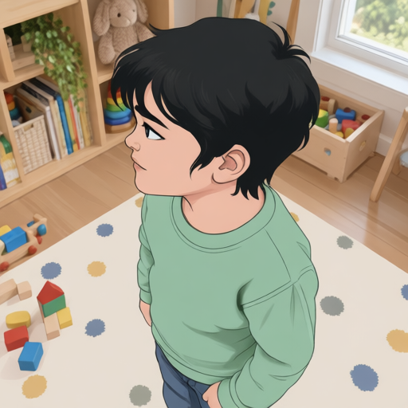 |

미적용 관찰: 긴소매·긴 바지·높은 시점 유지. 검은 짧은 머리와 크게 바뀐 눈·얼굴 인상. 목선·몸 비율 차이도 있음.

| 강도 | 1600스텝 | 3200스텝 |
| --- | --- | --- |
| **0.5** | 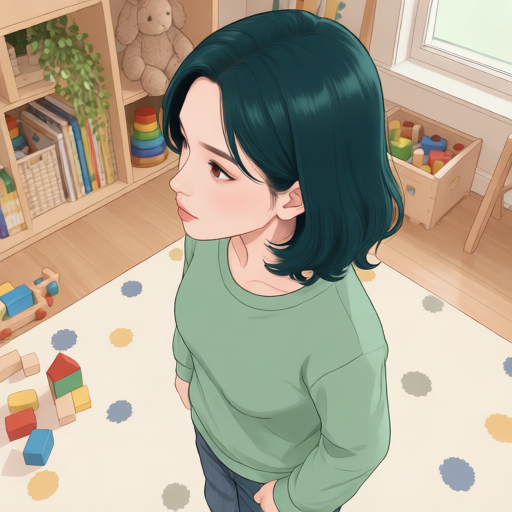 | 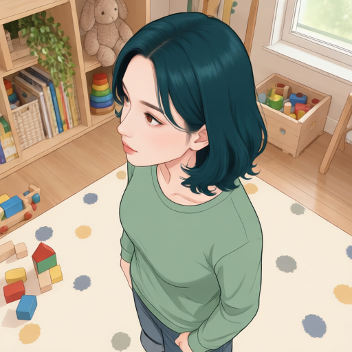 |
| 검수 의견 | 청록 단발·긴소매·긴 바지 유지. 목·어깨·가슴 비율은 입력과 다르고 배경은 넓게 일러스트화됨. | 1.0의 반소매·짧은 상의·반바지 변화가 없어지고 긴소매·긴 바지가 돌아옴. 몸 비율 변화는 남음. |
| **0.75** | 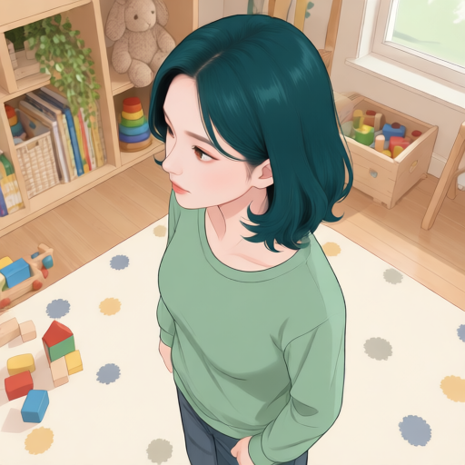 | 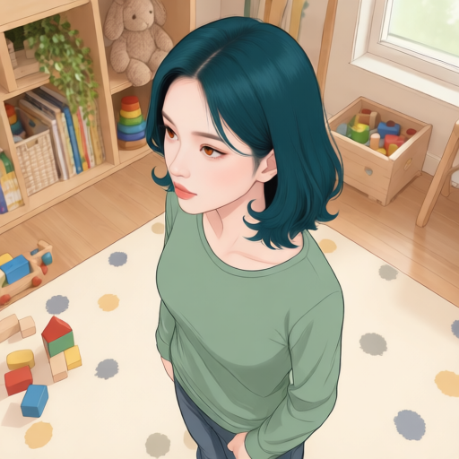 |
| 검수 의견 | 1.0과 유사한 의상·자세. 머리 외곽·목선·몸 비율은 입력과 차이. | 긴소매·긴 바지와 허리 가림이 복구됨. 0.5보다 얼굴이 정면에 가깝고 몸통은 더 가늘어 보임. |
| **1.0** |  | 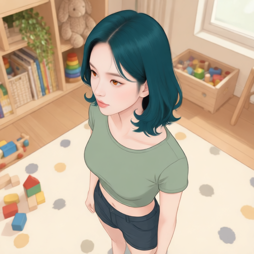 |
| 검수 의견 | 긴소매·긴 바지 유지. 성인형 목·상체 비율 변화가 남음. | 반소매·복부 노출·반바지로 큰 의상 변경. 낮은 강도 두 조건에서는 이 구조 변경이 사라짐. |

[기존 강도 1.0 검수](bfs-camera-366-step-review.md#case-041) · [검수 요약](bfs-camera-366-review.md)

## P712-CAM-043 · toddler / elevated / 0°

| 입력 | Mira 토르소 참조 | 미적용 |
| --- | --- | --- |
|  |  | 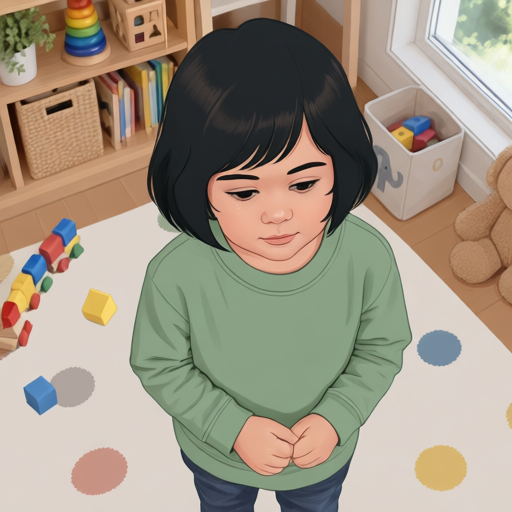 |

미적용 관찰: 아래 시선·모은 손·긴소매 유지. 가슴 포켓은 미적용에서도 사라짐. 검은 단발과 다른 얼굴 인상.

| 강도 | 1600스텝 | 3200스텝 |
| --- | --- | --- |
| **0.5** | 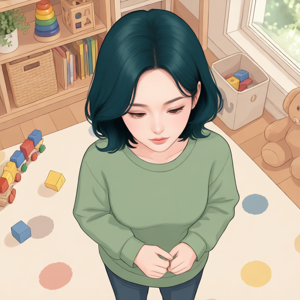 | 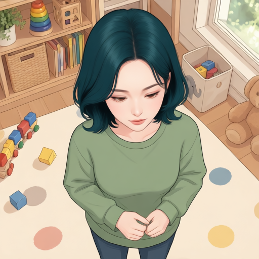 |
| 검수 의견 | 아래 시선·모은 손·긴소매·허리 가림 유지. 포켓 소실과 목·가슴·손 비율 변화는 지속. | 1.0의 짧은 소매·허리 노출이 없어짐. 모은 손도 입력 동작에 더 가깝지만 포켓은 여전히 없음. |
| **0.75** | 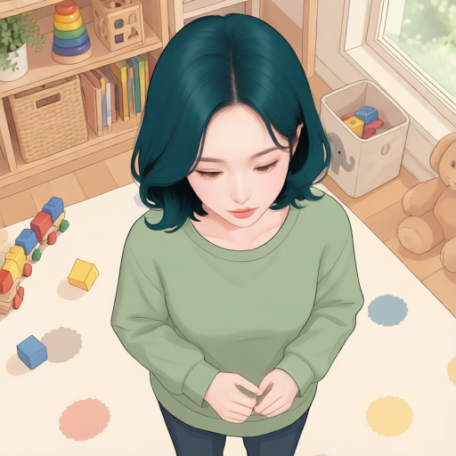 | 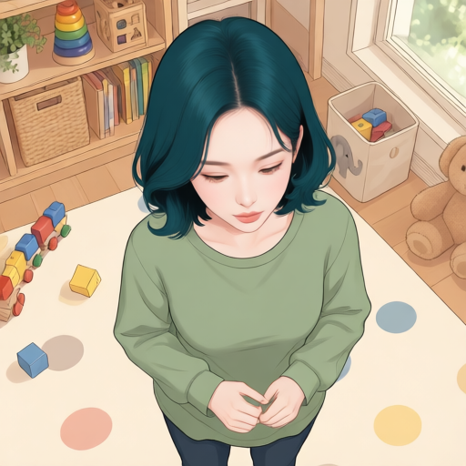 |
| 검수 의견 | 0.5와 유사. 눈꺼풀·손가락·소매 주름 차이는 있으나 포켓은 복구되지 않음. | 긴소매·허리 가림이 돌아옴. 몸통·손 비율 차이와 포켓 소실은 지속. |
| **1.0** |  | 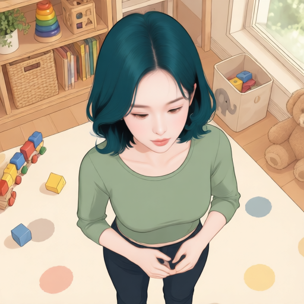 |
| 검수 의견 | 긴소매와 허리 가림 유지. 가슴 포켓은 사라지고 손 모양이 다시 그려짐. | 소매가 짧아지고 허리가 드러남. 낮은 강도에서 길이는 복구되지만 포켓 소실은 모든 조건에 남음. |

[기존 강도 1.0 검수](bfs-camera-366-step-review.md#case-043) · [검수 요약](bfs-camera-366-review.md)

## 사용자 얼굴 검수 — 2026-09-20

사용자 얼굴 검수에서는 1600스텝의 홍채와 이목구비 간 거리에 차이가 보이지만, 3200스텝에서는 해당 오류가 거의 보이지 않는다고 판단했다. 이 얼굴 재현 차이를 현재 권장값 3200스텝·강도 0.75의 근거로 기록한다. 의상·시선·손·몸 비율 보존에 대한 기존 AI 관찰은 별도 평가로 유지한다. 홍채와 이목구비 간 거리를 수치로 측정한 결과가 아니라 사용자 시각 검수 의견이다.

사용자는 강도 1.0에서 머리 방향 오류가 0.75보다 더 많이 보인다고 판단했다. 따라서 3200스텝의 얼굴 재현과 강도 0.75의 방향 보존을 함께 고려해 현재 권장 설정을 3200스텝·0.75로 정한다. 이는 사용자 시각 검수에 따른 상대 비교이며 오류율을 계수한 결과는 아니다.

## 비교 조건·종합 판단과 한계

**강도를 낮추면 여러 의상 구조 변경이 완화된다. 다만 시선·손·몸 비율·의상 세부는 남아 있어 AI 검수만으로 일괄 대체 조건을 확정하지 않았다는 당시 관찰이다.** AI가 입력 12장, 미적용 12장, 1600·3200스텝의 강도 0.5·0.75·1.0 결과 72장을 원본으로 대조했다(총 96장). 신규 생성 60장과 기존 1.0 결과 24장을 사용했다. 아래 의견은 사용자 최종 판단과 구분한다.

[1600스텝 강도 비교 계획](camera-preservation-scale-v1-step1600/plan.json)과 [3200스텝 강도 비교 계획](camera-preservation-scale-v1-step3200/plan.json)의 입력·프롬프트·시드·추론 설정을 대조했다. 시드 62294, 20스텝, CFG 4, 출력·참조 VAE 512×512, VL 384, 크롭 없음이며 기존 두 가중치를 사용했다. 신규 60장의 출력 해시·512×512 크기와 결과 기록 대응을 확인했다. 미적용은 1600 실행에서 어댑터를 끈 공통 결과이며 3200용으로 중복 생성하지 않았다.

이번 얼굴·헤어 의견은 같은 입력의 강도별 공통 인상과 청록 단발 유지에 대한 관찰이다. 방향별 Mira 기준 원본과의 별도 정체성 재평가·유사도 측정은 수행하지 않았으므로 “기준 정체성 완전 일치”로 읽지 않는다. 모든 조건에서 그림 전체의 화풍이 균일해진 것도 아니다. 특히 성인 입력은 인물의 평면 채색과 배경의 사진 질감이 함께 남는다.

### 비교 결론과 남은 문제

| 확인 축 | 실제 관찰 | 후속 판단 |
| --- | --- | --- |
| 1600의 의상 오류 완화 | 009 칼라, 010 추가 포켓은 0.5·0.75에서 개선 | 강도만으로 완화되는 오류가 있음 |
| 3200의 큰 의상 변경 완화 | 015 칼라·단추, 017 앞단추 추가, 023 복부 노출, 041 반소매·반바지, 043 소매·밑단 길이는 낮은 강도에서 완화 | 특히 0.5를 다음 비교 후보로 남김. 세부 디자인 완전 복구는 아님 |
| 방향·인물 크기 | 006은 3200·0.5에서 측면과 인물 크기가 1.0보다 입력에 가까움 | 다른 항목에서도 방향·비율을 함께 봐야 함 |
| 강도 간 차이 | 026은 3200·0.5에서 트임·단추·주머니 손이 돌아오지만 0.75는 단추·손 자세가 복구되지 않음 | 0.75가 0.5보다 항상 낫지 않음 |
| 시선과 의상의 상충 | 028은 낮은 강도에서 V형 목선이 돌아오지만 입력보다 깊고 여밈이 없으며, 시선은 1600·1.0보다 카메라 쪽으로 향함 | 의상 하나만 보고 전체 개선으로 판정하지 않음 |
| 표정 | 037은 1600의 낮은 강도에서 웃음이 남고, 3200·0.75에서 웃음이 뚜렷함 | 조건별 차이가 있어 얼굴 전체 실패·성공으로 단순화하지 않음 |
| 손·소품 | 038은 낮은 강도에서 모은 주먹이 포개진 손으로 바뀜. 010은 책 윗면이 벌어진 형태가 남음 | 안정적인 정면 사례와 소품 상태도 회귀 점검 필요 |
| 남는 의상 오류 | 026 목선 패널, 028 목선 깊이·여밈, 043 포켓 소실이 남음. 043은 미적용에서도 포켓이 없음 | 강도 조절만으로 해결 불가. 학습 쌍과 기반 편집의 영향을 분리해 점검 |

미적용 결과는 대체로 청록 단발과 학습된 공통 얼굴 인상을 만들지 못하며, 원본 인물 비율·얼굴·의상도 일부 바꾼다. 따라서 미적용을 완전 보존 결과나 Mira 정체성의 정답으로 쓰지 않는다.

사용자 선택 이전의 AI 검수에서는 **1600·0.5와 3200·0.5를 후속 비교 후보**로 제안했다. 현재 권장 설정은 사용자 판단에 따른 **3200·0.75**다. 3200·0.5에서 큰 의상 오류가 줄었더라도 1600·1.0보다 시선·손 보존이 나빠지는 항목이 있고 기준 얼굴·전체 화풍의 항목별 비열화도 아직 입증하지 않았다. [개선 계획](../../../../../management/authoring/part-07-p7-5-10-preservation-improvement-plan.md)의 “새로운 악화 없이 개선” 조건 충족을 선언하지 않는다. 45장 자동 확대나 재학습은 이 검수 작성에서 실행하지 않았다. 다음 우선 작업은 남은 오류와 관련된 학습 입력·목표의 대응 점검이다.

한 시드에서 오류를 중심으로 선택한 12개 입력의 정성 비교다. 독립 테스트 성능·전체 오류율·과적합의 증거로 일반화하지 않는다. 과거 생성 결과 JSON의 상태는 당시 실행 기록으로 유지하며 이번 시각 검수 완료 사실은 이 표에 기록한다.
