# 45장 스텝 비교 · 강도 1.0

**사용자 얼굴 검수(2026-09-20):** 1600스텝에서는 홍채와 이목구비 간 거리 차이가 보이지만, 3200스텝에서는 해당 오류가 거의 보이지 않는다는 판단이다. 현재 권장 설정은 3200스텝·강도 0.75이며, 아래 강도 1.0의 기존 항목별 관찰은 별도로 보존한다.

사용자는 강도 1.0에서 머리 방향 오류가 0.75보다 더 많이 보인다고 판단했다. 따라서 3200스텝의 얼굴 재현과 강도 0.75의 방향 보존을 함께 고려해 현재 권장 설정을 3200스텝·0.75로 정한다. 이는 사용자 시각 검수에 따른 상대 비교이며 오류율을 계수한 결과는 아니다.

[검수 요약](bfs-camera-366-review.md) · [45장 스텝 비교](bfs-camera-366-step-review.md) · [12개 강도 비교](bfs-camera-366-scale-review.md)

Mira 토르소 참조는 [P7-5.2의 15방향 원본](../../../../parts/part-07/chapter-05/section-02.md) 중 각 입력의 시점·좌우 방향에 대응하는 이미지다. 얼굴·헤어·화풍 비교용이며, 의상·동작·몸 비율의 보존 기준은 입력 이미지다. 참조를 표에 추가한 것이며 생성 시 모델에 전달한 이미지는 아니다.

입력과 1600·3200스텝 원본을 나란히 보고, 바로 아래에서 기존 검수 의견을 확인한다. 관리번호와 관찰 내용은 그대로 유지했다.

| 입력 묶음 | 관리번호 바로가기 |
| --- | --- |
| 남성 입력 | [001](#case-001) · [002](#case-002) · [003](#case-003) · [004](#case-004) · [005](#case-005) · [006](#case-006) · [007](#case-007) · [008](#case-008) · [009](#case-009) · [010](#case-010) · [011](#case-011) · [012](#case-012) · [013](#case-013) · [014](#case-014) · [015](#case-015) |
| 여성 입력 | [016](#case-016) · [017](#case-017) · [018](#case-018) · [019](#case-019) · [020](#case-020) · [021](#case-021) · [022](#case-022) · [023](#case-023) · [024](#case-024) · [025](#case-025) · [026](#case-026) · [027](#case-027) · [028](#case-028) · [029](#case-029) · [030](#case-030) |
| 유아 입력 | [031](#case-031) · [032](#case-032) · [033](#case-033) · [034](#case-034) · [035](#case-035) · [036](#case-036) · [037](#case-037) · [038](#case-038) · [039](#case-039) · [040](#case-040) · [041](#case-041) · [042](#case-042) · [043](#case-043) · [044](#case-044) · [045](#case-045) |

## 남성 입력

### P712-CAM-001 · man / low / -90°

| 입력 | Mira 토르소 참조 |
| --- | --- |
|  |  |

| 1600 · 1.0 | 3200 · 1.0 |
| --- | --- |
|  | 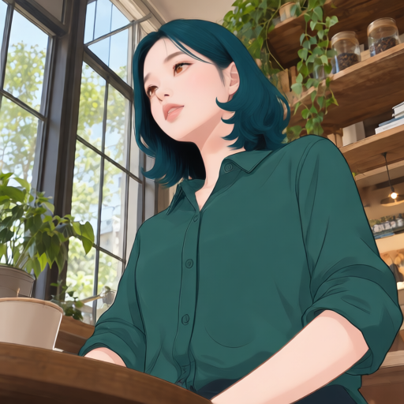 |

| 1600 검수 의견 | 3200 비교 의견 |
| --- | --- |
| 낮은 시점과 셔츠·창틀 배치는 대체로 유지. Mira 계열 측면 얼굴이 보이나 인물은 평면적인 채색, 배경은 사진 질감이 강해 화풍 통일은 부분적. | 청록 단발·얼굴 변환은 이어지지만 1600보다 얼굴이 정면 쪽으로 돌아와 입력의 좌향 측면 보존이 약해짐. 몸통이 가늘어지고 가슴 포켓의 위치·윤곽과 단추 색도 바뀜. 창틀·선반의 큰 배치는 유지. |

### P712-CAM-002 · man / low / -45°

| 입력 | Mira 토르소 참조 |
| --- | --- |
|  |  |

| 1600 · 1.0 | 3200 · 1.0 |
| --- | --- |
|  | 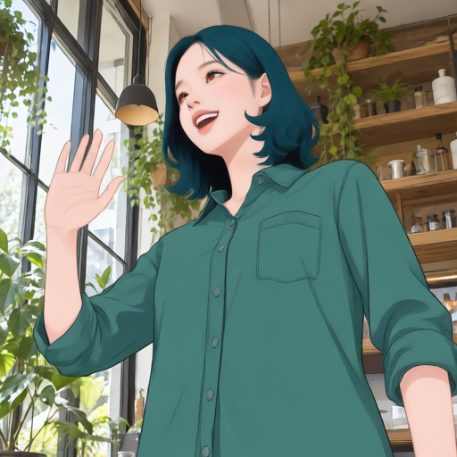 |

| 1600 검수 의견 | 3200 비교 의견 |
| --- | --- |
| 손을 든 자세와 입을 벌린 웃음 유지. 얼굴·헤어 변환은 뚜렷하나 손과 팔의 크기·윤곽이 달라짐. | 손 흔들기와 열린 웃음은 유지. 1600보다 머리·어깨가 작아지고 몸통이 가늘어져 입력의 화면 점유율 차이가 커짐. 가슴 포켓은 남으나 입구·주름·단추 표현이 달라짐. |

### P712-CAM-003 · man / low / 0°

| 입력 | Mira 토르소 참조 |
| --- | --- |
|  |  |

| 1600 · 1.0 | 3200 · 1.0 |
| --- | --- |
|  | 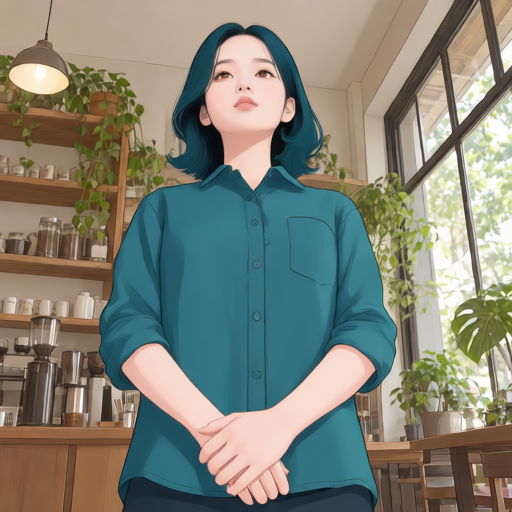 |

| 1600 검수 의견 | 3200 비교 의견 |
| --- | --- |
| 올려다보는 방향과 모은 손 유지. 얼굴이 작아지고 목이 길어 보이며 어깨·몸통 폭이 줄어 입력 체형 보존은 불완전. | 올려다보는 정면과 모은 손, 카페 배치는 유지. 1600과 유사한 얼굴·단발이며 머리·어깨 폭과 몸통이 입력보다 작음. 칼라·단추·포켓 윤곽은 다시 그려져 세부 의상 보존은 부분적. |

### P712-CAM-004 · man / low / 45°

| 입력 | Mira 토르소 참조 |
| --- | --- |
|  |  |

| 1600 · 1.0 | 3200 · 1.0 |
| --- | --- |
|  | 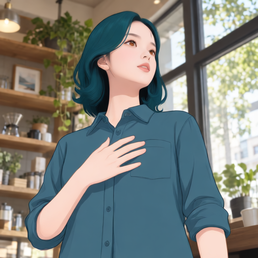 |

| 1600 검수 의견 | 3200 비교 의견 |
| --- | --- |
| 가슴 위 손과 오른쪽 시선 유지. 턱을 든 정도와 얼굴 윤곽이 달라짐. 선반·창틀 배치는 대체로 남음. | 가슴 위 손과 카페 구도는 유지. 1600보다 얼굴이 정면 쪽으로 돌아와 입력의 우향 시선·머리 방향과 차이가 남음. 머리·어깨 폭이 줄고 칼라·포켓 형태가 더 뚜렷하게 재구성됨. |

### P712-CAM-005 · man / low / 90°

| 입력 | Mira 토르소 참조 |
| --- | --- |
|  |  |

| 1600 · 1.0 | 3200 · 1.0 |
| --- | --- |
|  | 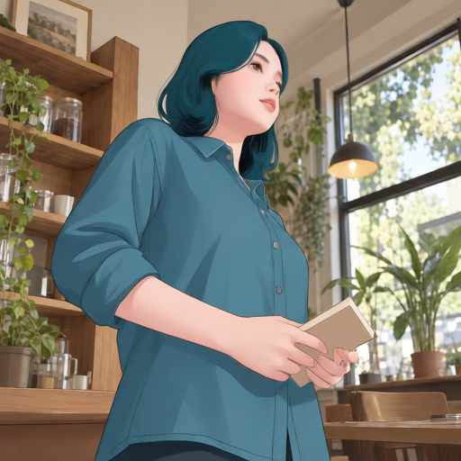 |

| 1600 검수 의견 | 3200 비교 의견 |
| --- | --- |
| 책과 측면 자세 유지. 입력의 치아가 보이는 웃음이 닫힌 입으로 약화. 후두부 길이 자체의 정량 판정은 보류. | 책을 든 동작과 큰 배경 배치는 유지. 1600에서 잘렸던 머리 위 여백이 돌아오지만 얼굴은 입력 측면보다 정면 쪽으로 보임. 치아가 보이는 웃음은 약해지고 상체·소매 윤곽이 달라짐. |

### P712-CAM-006 · man / level / -90°

| 입력 | Mira 토르소 참조 |
| --- | --- |
|  |  |

| 1600 · 1.0 | 3200 · 1.0 |
| --- | --- |
|  |  |

| 1600 검수 의견 | 3200 비교 의견 |
| --- | --- |
| 좌향 측면과 컵·창문 유지. Mira 측면 특징은 보이나 어깨·팔·가슴 윤곽이 바뀜. 배경의 사진 질감이 강함. | 1600보다 머리와 몸이 크게 작아지고 낮게 배치되어 인물이 뒤로 물러난 듯한 구도로 바뀜. 좌향 측면도 정면 쪽으로 돌아와 방향 보존이 약함. 컵·의자·선반은 남지만 입력의 인물 크기·몸 비율과 차이가 큼. |

[이 입력의 강도 비교](bfs-camera-366-scale-review.md#case-006)

### P712-CAM-007 · man / level / -45°

| 입력 | Mira 토르소 참조 |
| --- | --- |
|  |  |

| 1600 · 1.0 | 3200 · 1.0 |
| --- | --- |
|  | 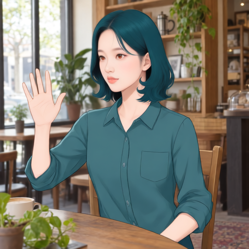 |

| 1600 검수 의견 | 3200 비교 의견 |
| --- | --- |
| 손 흔들기와 웃음 유지. 인물·손이 작아지고 셔츠 주름이 단순화됨. 배경 물체 배치는 대체로 유지. | 손 흔들기와 카페 배치는 유지하지만, 1600에 남아 있던 치아가 보이는 웃음이 닫힌 입으로 바뀜. 상체가 더 가늘어지고 의자 노출이 늘어 입력 체형·화면 점유율과 차이가 커짐. |

### P712-CAM-008 · man / level / 0°

| 입력 | Mira 토르소 참조 |
| --- | --- |
|  |  |

| 1600 · 1.0 | 3200 · 1.0 |
| --- | --- |
|  | 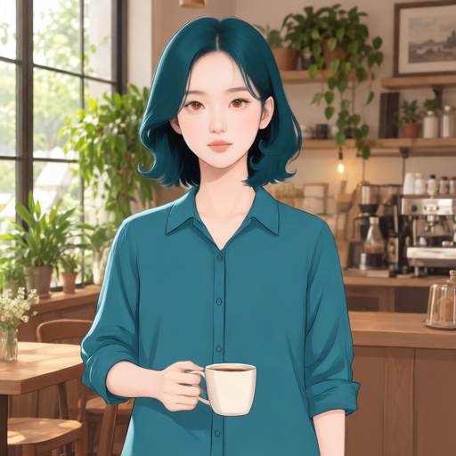 |

| 1600 검수 의견 | 3200 비교 의견 |
| --- | --- |
| 정면 얼굴·청록 단발이 기준 인상과 가까움. 컵을 쥔 동작 유지. 미소는 약해지고 몸통·머리 크기가 작아짐. | 정면 얼굴·단발과 컵을 든 동작 유지. 1600보다 어깨·팔이 더 가늘고 가슴 포켓이 사라짐. 입력의 미소는 약해지며 반대 손의 주머니 자세도 뚜렷하게 보존되지 않음. |

### P712-CAM-009 · man / level / 45°

| 입력 | Mira 토르소 참조 |
| --- | --- |
|  |  |

| 1600 · 1.0 | 3200 · 1.0 |
| --- | --- |
|  |  |

| 1600 검수 의견 | 3200 비교 의견 |
| --- | --- |
| 가슴 위 손과 컵 유지. 셔츠의 칼라·목선이 둥근 목선으로 바뀜. 의상 디자인 보존의 명확한 확인 대상. | 1600에서 사라졌던 셔츠 칼라가 다시 나타나 목선 보존은 개선된 부분. 가슴 위 손과 컵은 유지되지만, 얼굴은 입력보다 정면에 가까우며 몸통 폭·손 크기 차이는 남음. |

[이 입력의 강도 비교](bfs-camera-366-scale-review.md#case-009)

### P712-CAM-010 · man / level / 90°

| 입력 | Mira 토르소 참조 |
| --- | --- |
|  |  |

| 1600 · 1.0 | 3200 · 1.0 |
| --- | --- |
|  |  |

| 1600 검수 의견 | 3200 비교 의견 |
| --- | --- |
| 책·수평 측면·창가 구도 유지. 입력에 없던 덮개·단추가 있는 가슴 포켓이 추가됨: 의상 보존 오류. 웃음 강도 차이는 세부 관찰로 남기며 얼굴·헤어의 큰 이상과 구분한다. | 1600에서 추가됐던 덮개·단추 가슴 포켓이 사라져 해당 오류는 완화됨. 책을 든 우향 자세는 유지하나 웃음은 닫힌 입으로 약해지고 머리·몸통 크기가 줄어듦. 책 표지색·각도 차이는 남음. |

[이 입력의 강도 비교](bfs-camera-366-scale-review.md#case-010)

### P712-CAM-011 · man / elevated / -90°

| 입력 | Mira 토르소 참조 |
| --- | --- |
|  |  |

| 1600 · 1.0 | 3200 · 1.0 |
| --- | --- |
|  | 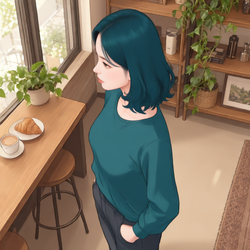 |

| 1600 검수 의견 | 3200 비교 의견 |
| --- | --- |
| 높은 시점과 주머니에 넣은 손 유지. 셔츠 칼라가 사라지고 목선이 변형됨. 몸통이 가늘어짐. | 높은 시점·좌향 자세·주머니에 넣은 손은 유지. 1600의 칼라 소실이 이어지고, 앞단추와 가슴 포켓까지 사라져 둥근 목선의 단색 상의로 바뀜. 의상 디자인 보존은 더 약해짐. |

### P712-CAM-012 · man / elevated / -45°

| 입력 | Mira 토르소 참조 |
| --- | --- |
|  |  |

| 1600 · 1.0 | 3200 · 1.0 |
| --- | --- |
|  | 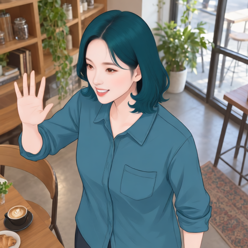 |

| 1600 검수 의견 | 3200 비교 의견 |
| --- | --- |
| 높은 시점·손 흔들기·웃음 유지. 인물 크기와 손 윤곽이 달라짐. 테이블·컵의 큰 위치는 유지. | 높은 시점·손 흔들기·치아가 보이는 웃음은 유지. 1600보다 머리가 작아져 상단 여백이 생기지만 입력보다 몸통은 가늘고 포켓·칼라·소매 주름이 재구성됨. |

### P712-CAM-013 · man / elevated / 0°

| 입력 | Mira 토르소 참조 |
| --- | --- |
|  |  |

| 1600 · 1.0 | 3200 · 1.0 |
| --- | --- |
|  | 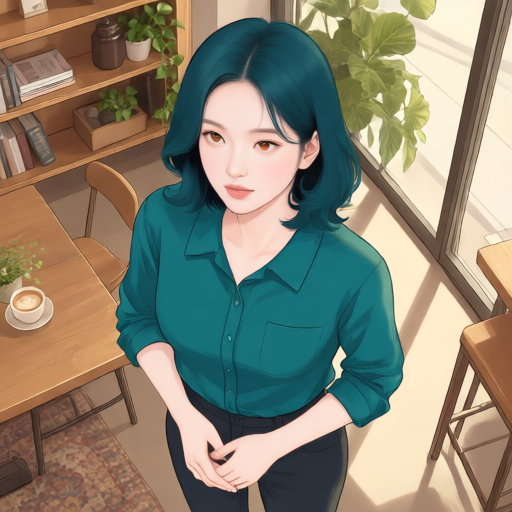 |

| 1600 검수 의견 | 3200 비교 의견 |
| --- | --- |
| 위쪽 카메라를 향한 시선과 모은 손 유지. 머리·눈의 비중이 커지고 몸통이 가늘어짐. | 모은 손과 높은 시점은 유지. 1600보다 머리 크기는 줄지만 시선이 정면 카메라보다 옆으로 비켜 보임. 입력에서 밖으로 나온 셔츠 밑단이 바지 안으로 들어간 형태로 바뀌어 허리선·착장 방식이 달라짐. |

### P712-CAM-014 · man / elevated / 45°

| 입력 | Mira 토르소 참조 |
| --- | --- |
|  |  |

| 1600 · 1.0 | 3200 · 1.0 |
| --- | --- |
|  | 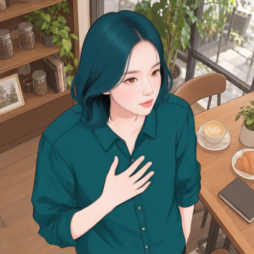 |

| 1600 검수 의견 | 3200 비교 의견 |
| --- | --- |
| 가슴 위 손과 높은 시점 유지. 얼굴·머리 비중이 커짐. 장면 배치는 대체로 유지하나 비율 보존은 부분적. | 가슴 위 손·우향 구도는 1600과 대체로 유사. 입력보다 얼굴이 정면에 가깝고 어깨·몸통이 가늘게 표현됨. 가슴 포켓과 칼라 윤곽이 입력 및 1600과 달라져 의상 세부 변화가 남음. |

### P712-CAM-015 · man / elevated / 90°

| 입력 | Mira 토르소 참조 |
| --- | --- |
|  |  |

| 1600 · 1.0 | 3200 · 1.0 |
| --- | --- |
|  |  |

| 1600 검수 의견 | 3200 비교 의견 |
| --- | --- |
| 책과 높은 시점의 우향 자세 유지. 웃음이 약해지고 얼굴·헤어가 화면에서 차지하는 비중이 커짐. | 책을 든 동작과 높은 시점은 유지하지만 셔츠의 칼라·앞단추·포켓이 사라지고 둥근 목선 상의로 바뀜. 1600보다 의상 보존이 약해짐. 입력의 웃음도 닫힌 입으로 바뀌고 얼굴 방향은 정면 쪽으로 이동. |

[이 입력의 강도 비교](bfs-camera-366-scale-review.md#case-015)

## 여성 입력

### P712-CAM-016 · woman / low / -90°

| 입력 | Mira 토르소 참조 |
| --- | --- |
|  |  |

| 1600 · 1.0 | 3200 · 1.0 |
| --- | --- |
|  | 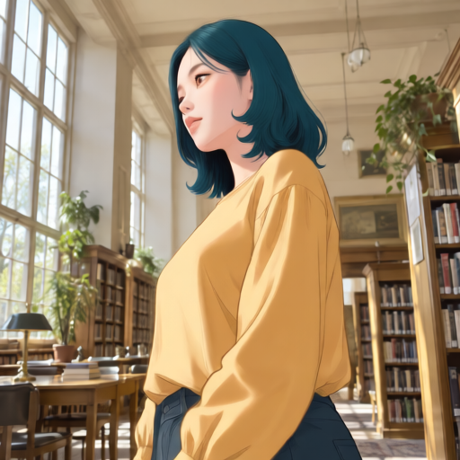 |

| 1600 검수 의견 | 3200 비교 의견 |
| --- | --- |
| 좌향 낮은 시점과 노란 상의 유지. 얼굴·헤어 변환이 뚜렷하고 머리 부피가 줄어듦. 배경과 인물의 채색 질감 차이가 남음. | 좌향·낮은 시점과 서가 배치는 유지. 1600보다 얼굴이 조금 정면 쪽으로 돌아오고 어깨 폭이 줄어듦. 노란 상의는 남지만 목선의 여밈·단추가 생략되고 소매·허리 주름이 달라짐. |

### P712-CAM-017 · woman / low / -45°

| 입력 | Mira 토르소 참조 |
| --- | --- |
|  |  |

| 1600 · 1.0 | 3200 · 1.0 |
| --- | --- |
|  |  |

| 1600 검수 의견 | 3200 비교 의견 |
| --- | --- |
| 손 흔들기와 열린 웃음 유지. 블라우스 주름·소매 형태가 단순화되고 손 크기가 달라짐. | 손 흔들기와 열린 웃음은 유지되나 얼굴은 1600보다 정면 쪽으로 이동. 입력의 V형 목선이 둥근 목선과 작은 트임으로 바뀌고 앞단추 줄이 추가되어 의상 보존이 약해짐. |

[이 입력의 강도 비교](bfs-camera-366-scale-review.md#case-017)

### P712-CAM-018 · woman / low / 0°

| 입력 | Mira 토르소 참조 |
| --- | --- |
|  |  |

| 1600 · 1.0 | 3200 · 1.0 |
| --- | --- |
|  | 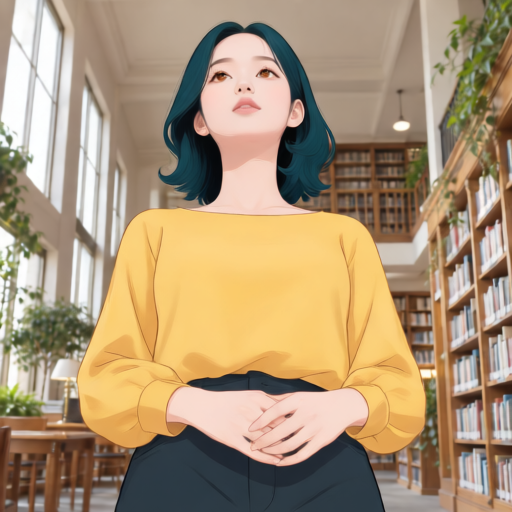 |

| 1600 검수 의견 | 3200 비교 의견 |
| --- | --- |
| 올려다보는 얼굴과 모은 손 유지. 목·턱이 길어 보이고 손가락 배치가 재구성됨. | 올려다보는 정면과 모은 손은 유지. 1600에 남아 있던 목둘레 주름·테두리가 사라져 넓고 단순한 목선으로 바뀜. 어깨·몸통이 가늘어지고 허리선이 높아져 입력 비율과 차이가 커짐. |

### P712-CAM-019 · woman / low / 45°

| 입력 | Mira 토르소 참조 |
| --- | --- |
|  |  |

| 1600 · 1.0 | 3200 · 1.0 |
| --- | --- |
|  | 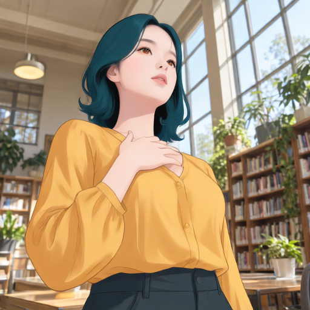 |

| 1600 검수 의견 | 3200 비교 의견 |
| --- | --- |
| 가슴 위 손과 시선 방향 유지. 상의 목선이 더 깊은 V 형태로 바뀌고 가슴·몸통 윤곽도 달라짐. | 가슴 위 손과 올려다보는 방향은 유지. 1600의 깊은 V 목선은 줄어들지만 앞단추가 추가되고 가슴·허리 윤곽이 바뀌어 입력 의상으로 복구됐다고 볼 수 없음. |

### P712-CAM-020 · woman / low / 90°

| 입력 | Mira 토르소 참조 |
| --- | --- |
|  |  |

| 1600 · 1.0 | 3200 · 1.0 |
| --- | --- |
|  |  |

| 1600 검수 의견 | 3200 비교 의견 |
| --- | --- |
| 책과 오른쪽을 보는 낮은 시점 유지. 웃음은 남으나 입의 벌어짐이 줄고 목선·소매 세부가 달라짐. | 책을 든 동작은 유지하지만 1600보다 얼굴이 정면 쪽으로 돌아옴. V 목선·여밈이 사라지고 상의 밑단이 짧아져 복부가 드러나는 새 의상 오류가 나타남. |

### P712-CAM-021 · woman / level / -90°

| 입력 | Mira 토르소 참조 |
| --- | --- |
|  |  |

| 1600 · 1.0 | 3200 · 1.0 |
| --- | --- |
|  | 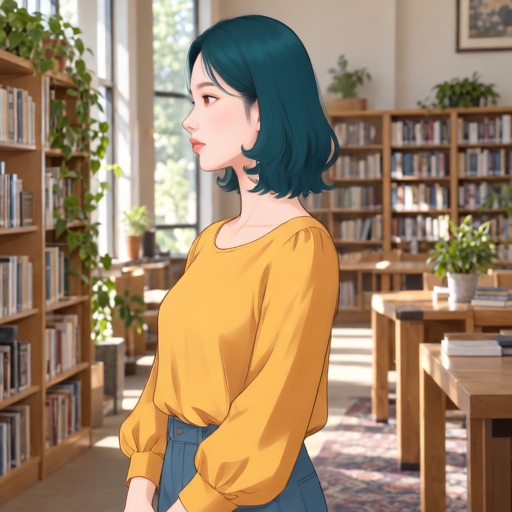 |

| 1600 검수 의견 | 3200 비교 의견 |
| --- | --- |
| 좌향 측면과 서 있는 자세 유지. 기준 단발·측면 인상이 보임. 어깨·허리 폭과 상의 주름이 바뀜. | 좌향 측면과 서가 배치는 유지. 1600에서 잘렸던 머리 위 여백은 돌아오지만 머리·몸이 작아지고 몸통이 가늘어짐. 입력과 1600의 V형 목선이 둥근 목선으로 바뀜. |

### P712-CAM-022 · woman / level / -45°

| 입력 | Mira 토르소 참조 |
| --- | --- |
|  |  |

| 1600 · 1.0 | 3200 · 1.0 |
| --- | --- |
|  | 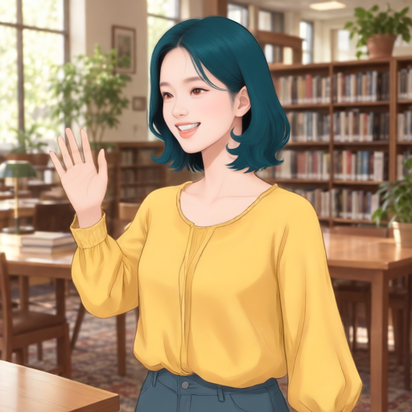 |

| 1600 검수 의견 | 3200 비교 의견 |
| --- | --- |
| 손 흔들기·열린 웃음과 기존 중앙 트임의 V형 목선 유지. 입력에도 같은 목선 구조가 있어 목선 변경 사례에서 제외한다. | 손 흔들기와 치아가 보이는 웃음 유지. 1600에서 유지됐던 중앙 트임의 V형 목선이 닫힌 둥근 목선으로 바뀜. 머리·상체가 작아져 화면 점유율도 감소. |

### P712-CAM-023 · woman / level / 0°

| 입력 | Mira 토르소 참조 |
| --- | --- |
|  |  |

| 1600 · 1.0 | 3200 · 1.0 |
| --- | --- |
|  |  |

| 1600 검수 의견 | 3200 비교 의견 |
| --- | --- |
| 정면 인상과 단발이 비교적 안정적. 모은 손과 도서관 배치 유지. 상의 트임·손가락·몸통 비율은 바뀜. | 정면 얼굴·단발과 모은 손 유지. 1600보다 인물이 작아지고 어깨·몸통이 가늘어짐. 목선 트임·앞단추가 사라지며 상의 밑단이 짧아져 복부가 드러나는 새 의상 오류가 나타남. |

[이 입력의 강도 비교](bfs-camera-366-scale-review.md#case-023)

### P712-CAM-024 · woman / level / 45°

| 입력 | Mira 토르소 참조 |
| --- | --- |
|  |  |

| 1600 · 1.0 | 3200 · 1.0 |
| --- | --- |
|  | 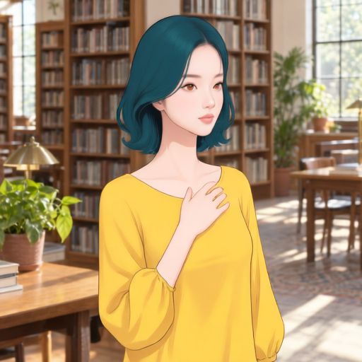 |

| 1600 검수 의견 | 3200 비교 의견 |
| --- | --- |
| 가슴 위 손과 우향 시선 유지. 입력의 열린 입이 닫히며 표정이 차분해짐. 머리 부피와 손 위치가 달라짐. | 가슴 위 손은 유지하지만 1600보다 얼굴이 정면 쪽으로 돌아와 우향 시선 보존이 약해짐. 입력의 열린 입이 닫힌 상태가 이어지고 머리·몸통이 작아짐. 목선 트임은 보이지 않고 상의 주름도 단순화됨. |

### P712-CAM-025 · woman / level / 90°

| 입력 | Mira 토르소 참조 |
| --- | --- |
|  |  |

| 1600 · 1.0 | 3200 · 1.0 |
| --- | --- |
|  | 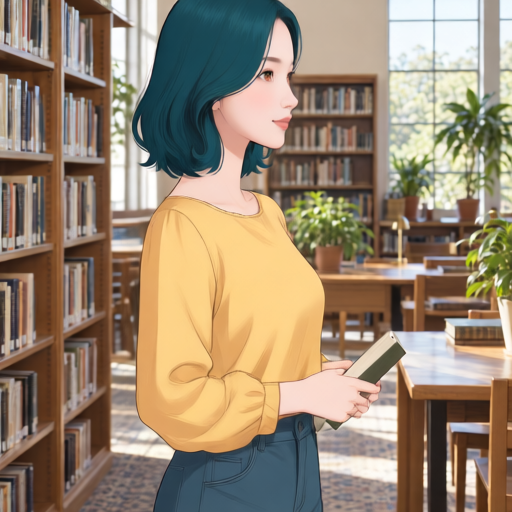 |

| 1600 검수 의견 | 3200 비교 의견 |
| --- | --- |
| 책과 우향 측면 유지. 미소는 남지만 입 벌어짐이 줄어듦. 의상 주름·허리 비율은 단순화됨. | 책과 우향 자세는 유지. 1600보다 얼굴이 조금 정면 쪽으로 돌아오고 웃음은 닫힌 입으로 약해짐. 둥근 목선 변화가 이어지며 허리선이 높아지고 셔츠 밑단이 바지 안으로 들어가 착장 방식이 달라짐. |

### P712-CAM-026 · woman / elevated / -90°

| 입력 | Mira 토르소 참조 |
| --- | --- |
|  |  |

| 1600 · 1.0 | 3200 · 1.0 |
| --- | --- |
|  |  |

| 1600 검수 의견 | 3200 비교 의견 |
| --- | --- |
| 높은 시점·좌향 자세 유지. 상의 목선에 칼라처럼 보이는 형태가 생김. 머리 크기와 어깨 윤곽이 바뀜. | 높은 시점·좌향은 유지. 1600의 칼라처럼 보이는 형태는 없어지지만 입력의 V형 트임·단추까지 사라져 둥근 목선 상의로 바뀜. 주머니에 넣은 손 자세도 팔을 내린 형태로 바뀌어 의상·자세 복구로 볼 수 없음. |

[이 입력의 강도 비교](bfs-camera-366-scale-review.md#case-026)

### P712-CAM-027 · woman / elevated / -45°

| 입력 | Mira 토르소 참조 |
| --- | --- |
|  |  |

| 1600 · 1.0 | 3200 · 1.0 |
| --- | --- |
|  | 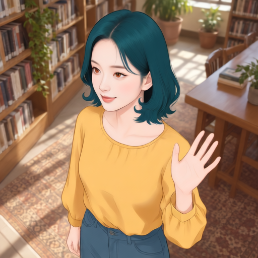 |

| 1600 검수 의견 | 3200 비교 의견 |
| --- | --- |
| 높은 시점·손 흔들기·웃음 유지. 인물 채색은 일러스트로 바뀌지만 바닥·서가의 사진 질감이 남음. | 높은 시점과 손 흔들기는 유지. 1600에 남아 있던 치아가 보이는 웃음이 닫힌 입으로 바뀜. 목둘레 주름이 줄고 몸통이 가늘어지지만 서가·탁자·바닥의 큰 배치는 유지. |

### P712-CAM-028 · woman / elevated / 0°

| 입력 | Mira 토르소 참조 |
| --- | --- |
|  |  |

| 1600 · 1.0 | 3200 · 1.0 |
| --- | --- |
|  |  |

| 1600 검수 의견 | 3200 비교 의견 |
| --- | --- |
| 아래를 보는 시선과 모은 손 유지. V 목선이 둥근 목선으로 바뀜. 얼굴과 손이 이상화·단순화됨. | 모은 손·높은 시점은 유지하나 입력과 1600의 아래를 보는 시선이 카메라를 보는 시선으로 바뀜. V 목선 소실은 이어지고 둥근 목선이 더 얕아짐. 배경은 1600보다 부드럽게 단순화됨. |

[이 입력의 강도 비교](bfs-camera-366-scale-review.md#case-028)

### P712-CAM-029 · woman / elevated / 45°

| 입력 | Mira 토르소 참조 |
| --- | --- |
|  |  |

| 1600 · 1.0 | 3200 · 1.0 |
| --- | --- |
|  | 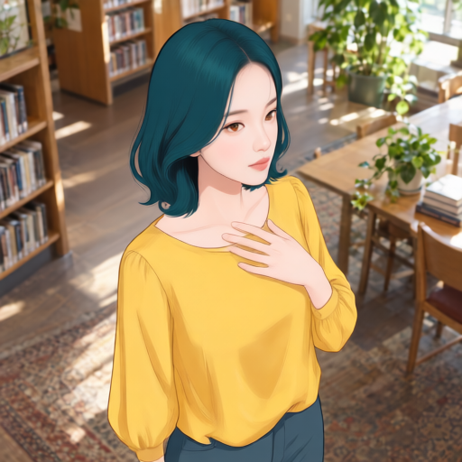 |

| 1600 검수 의견 | 3200 비교 의견 |
| --- | --- |
| 가슴 위 손과 높은 시점 유지. 입이 닫히고 표정이 약화됨. 목선이 둥글어져 원래 디자인과 차이. | 가슴 위 손·높은 시점은 유지. 1600의 넓은 둥근 목선이 더 좁고 단순해졌지만 입력의 주름·여밈 구조가 복구되지는 않음. 몸통·소매 주름과 허리선도 달라짐. |

### P712-CAM-030 · woman / elevated / 90°

| 입력 | Mira 토르소 참조 |
| --- | --- |
|  |  |

| 1600 · 1.0 | 3200 · 1.0 |
| --- | --- |
|  | 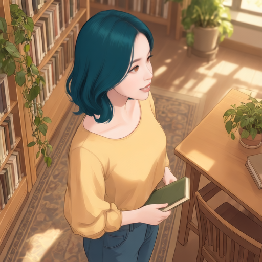 |

| 1600 검수 의견 | 3200 비교 의견 |
| --- | --- |
| 책과 높은 시점의 우향 자세 유지. 치아가 보이는 웃음이 닫힌 입으로 바뀜. 책·손의 각도도 달라짐. | 책과 높은 시점은 유지. 1600의 닫힌 입보다 웃음이 드러나 입력 표정에 가까워진 부분이 있으나, V 목선이 넓은 둥근 목선으로 바뀜. 얼굴 방향·어깨와 책의 각도 차이는 남음. |

## 유아 입력

### P712-CAM-031 · toddler / low / -90°

| 입력 | Mira 토르소 참조 |
| --- | --- |
|  |  |

| 1600 · 1.0 | 3200 · 1.0 |
| --- | --- |
|  | 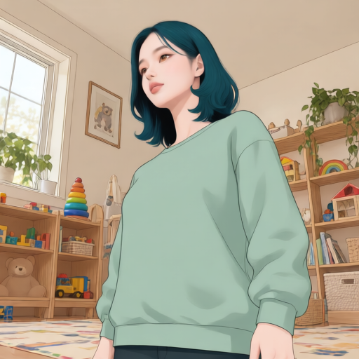 |

| 1600 검수 의견 | 3200 비교 의견 |
| --- | --- |
| 낮은 시점과 민트 상의 유지. 성인 Mira 계열 얼굴로 변환되면서 목·어깨·가슴 비율도 변함. 얼굴 변환과 몸 비율 변화는 분리 판단 필요. | 낮은 시점과 민트 상의·방 배치는 유지. 1600보다 얼굴이 정면 쪽으로 돌아오고 목이 더 드러나며 어깨·몸통 비율이 변함. 소매·가슴 주름이 늘었지만 입력의 체형 보존 개선으로 보기는 어려움. |

### P712-CAM-032 · toddler / low / -45°

| 입력 | Mira 토르소 참조 |
| --- | --- |
|  |  |

| 1600 · 1.0 | 3200 · 1.0 |
| --- | --- |
|  | 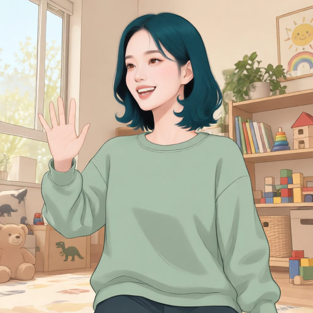 |

| 1600 검수 의견 | 3200 비교 의견 |
| --- | --- |
| 손 흔들기와 웃음은 유지. 머리·몸 비율과 손 크기가 성인형으로 이동. 배경도 비교적 넓게 일러스트화됨. | 손 흔들기·열린 웃음·둥근 목선은 유지. 1600보다 얼굴은 정면 쪽으로 돌아오고 손가락·팔·몸통 윤곽이 재구성됨. 선반·장난감의 큰 배치는 남지만 바닥 무늬가 더 단순해짐. |

### P712-CAM-033 · toddler / low / 0°

| 입력 | Mira 토르소 참조 |
| --- | --- |
|  |  |

| 1600 · 1.0 | 3200 · 1.0 |
| --- | --- |
|  | 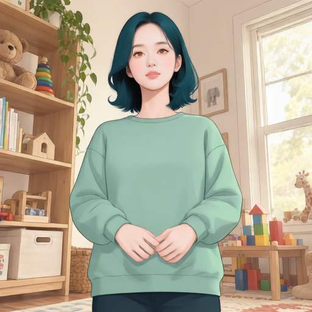 |

| 1600 검수 의견 | 3200 비교 의견 |
| --- | --- |
| 정면·모은 손 유지. 작은 유아 얼굴에서 성인형 얼굴·긴 목으로 변환되고 몸통도 길어 보임. | 정면과 모은 손·민트 상의 유지. 1600과 비슷한 성인형 얼굴·목 비율이 이어지고 입력의 위쪽 시선은 정면에 가까워짐. 목둘레와 소매·몸통 주름은 달라지며 창밖 나무 표현은 1600보다 다시 드러남. |

### P712-CAM-034 · toddler / low / 45°

| 입력 | Mira 토르소 참조 |
| --- | --- |
|  |  |

| 1600 · 1.0 | 3200 · 1.0 |
| --- | --- |
|  | 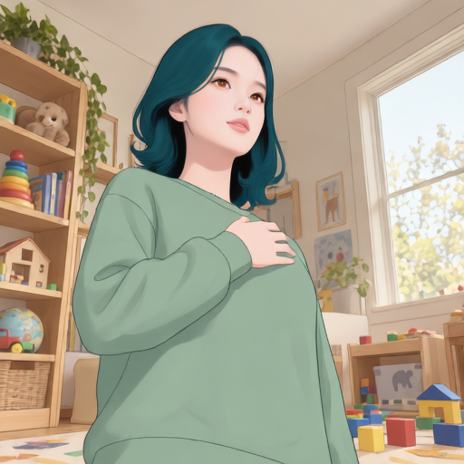 |

| 1600 검수 의견 | 3200 비교 의견 |
| --- | --- |
| 가슴 위 손과 우향 시선 유지. 입이 닫히고 목·가슴·손 크기가 변함. 창문·장난감의 큰 배치는 유지. | 가슴 위 손·낮은 시점·큰 배경 배치는 유지. 1600보다 머리·어깨·손이 작아지고 얼굴이 정면 쪽으로 이동. 입력의 열린 입이 닫힌 상태는 이어지며 소매와 밑단의 골지 표현이 줄어듦. |

### P712-CAM-035 · toddler / low / 90°

| 입력 | Mira 토르소 참조 |
| --- | --- |
|  |  |

| 1600 · 1.0 | 3200 · 1.0 |
| --- | --- |
|  | 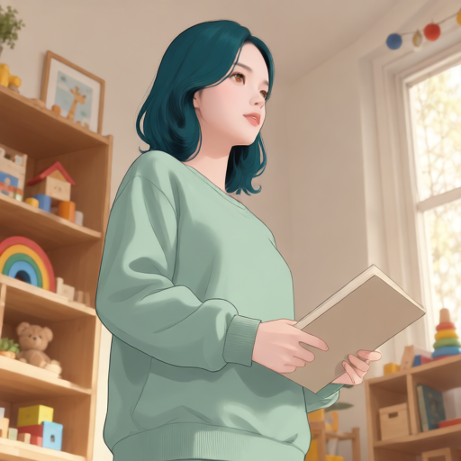 |

| 1600 검수 의견 | 3200 비교 의견 |
| --- | --- |
| 책과 우향 낮은 시점 유지. 웃음이 약해지고 몸통·팔 비율이 달라짐. 배경의 윤곽도 단순화됨. | 책을 든 동작·낮은 시점 유지. 1600보다 얼굴이 정면 쪽으로 돌아오고 어깨·팔이 가늘어짐. 책 크기·각도 차이와 약해진 웃음은 남고 배경 선반은 더 부드럽게 흐려짐. |

### P712-CAM-036 · toddler / level / -90°

| 입력 | Mira 토르소 참조 |
| --- | --- |
|  |  |

| 1600 · 1.0 | 3200 · 1.0 |
| --- | --- |
|  | 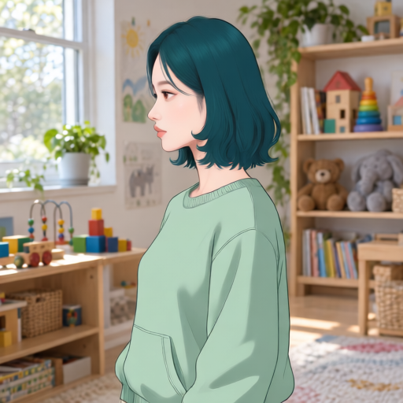 |

| 1600 검수 의견 | 3200 비교 의견 |
| --- | --- |
| 좌향 측면·민트 상의 유지. 성인형 턱·목·가슴 윤곽으로 변화. 뒤쪽 머리 외곽은 기준 계열이지만 원본과 동일 비율은 아님. | 좌향 측면·방 배치와 1600의 성인형 목·몸 비율이 이어짐. 입력에 없던 앞쪽 큰 포켓이 1600과 3200 모두에 보이므로 의상 오류가 지속됨. 소매·가슴 윤곽도 입력과 다름. |

### P712-CAM-037 · toddler / level / -45°

| 입력 | Mira 토르소 참조 |
| --- | --- |
|  |  |

| 1600 · 1.0 | 3200 · 1.0 |
| --- | --- |
|  |  |

| 1600 검수 의견 | 3200 비교 의견 |
| --- | --- |
| 손 흔들기는 유지되나 열린 웃음이 거의 사라짐. 얼굴·손·몸 비율이 성인형으로 바뀜. | 손 흔들기·둥근 목선 유지. 1600보다 치아가 보이는 웃음이 돌아와 표정 보존은 일부 개선됨. 얼굴은 더 정면에 가까우며 입력보다 긴 목·큰 손과 달라진 상체 비율은 남음. |

[이 입력의 강도 비교](bfs-camera-366-scale-review.md#case-037)

### P712-CAM-038 · toddler / level / 0°

| 입력 | Mira 토르소 참조 |
| --- | --- |
|  |  |

| 1600 · 1.0 | 3200 · 1.0 |
| --- | --- |
|  |  |

| 1600 검수 의견 | 3200 비교 의견 |
| --- | --- |
| 정면 Mira 인상은 분명함. 모은 손과 방의 큰 배치 유지. 머리가 작아지고 목·몸통이 길어져 입력 비율 변화가 큼. | 정면 얼굴·단발과 모은 손은 1600과 매우 유사. 목선 폭·손가락·소매 주름에 작은 차이가 있으나 입력보다 긴 목과 작은 머리 비율은 지속됨. 배경 큰 배치도 유지. |

[이 입력의 강도 비교](bfs-camera-366-scale-review.md#case-038)

### P712-CAM-039 · toddler / level / 45°

| 입력 | Mira 토르소 참조 |
| --- | --- |
|  |  |

| 1600 · 1.0 | 3200 · 1.0 |
| --- | --- |
|  | 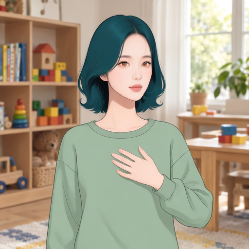 |

| 1600 검수 의견 | 3200 비교 의견 |
| --- | --- |
| 가슴 위 손·우향 시선 유지. 유아 표정이 차분한 미소로 바뀌며 턱·목·어깨 비율도 변함. | 가슴 위 손·방 배치는 유지. 1600보다 얼굴이 정면 쪽으로 돌아와 입력의 우향 시선 보존이 약함. 닫힌 입과 길어진 목·손 비율은 이어지고 어깨·몸통 폭이 더 줄어듦. |

### P712-CAM-040 · toddler / level / 90°

| 입력 | Mira 토르소 참조 |
| --- | --- |
|  |  |

| 1600 · 1.0 | 3200 · 1.0 |
| --- | --- |
|  | 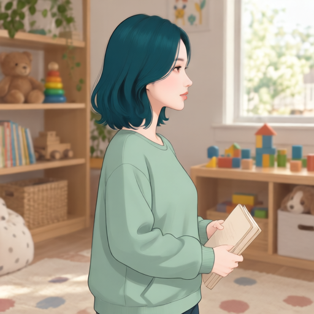 |

| 1600 검수 의견 | 3200 비교 의견 |
| --- | --- |
| 우향 측면과 책을 든 동작 유지. 책이 닫힌 상태에서 펼친 상태로 바뀜. 소품 상태 보존의 명확한 확인 대상. | 우향 측면·책을 든 동작은 1600과 유사. 책 면의 선은 줄었지만 여러 면이 벌어진 형태가 남아 입력의 닫힌 책으로 복구됐다고 보기 어려움. 웃음이 약해지고 입력보다 긴 목·가느다란 몸통 비율도 지속. |

### P712-CAM-041 · toddler / elevated / -90°

| 입력 | Mira 토르소 참조 |
| --- | --- |
|  |  |

| 1600 · 1.0 | 3200 · 1.0 |
| --- | --- |
|  |  |

| 1600 검수 의견 | 3200 비교 의견 |
| --- | --- |
| 높은 시점·좌향 자세 유지. 머리·목·상체 비율 변화가 보임. 카펫과 장난감은 단순화되지만 큰 배치는 유지. | 높은 시점·좌향 얼굴과 방의 큰 배치는 유지. 1600의 긴소매 상의·긴 바지가 짧은 소매와 복부가 드러나는 짧은 상의·반바지로 바뀜. 의상 및 몸 비율 보존이 크게 약해진 사례. |

[이 입력의 강도 비교](bfs-camera-366-scale-review.md#case-041)

### P712-CAM-042 · toddler / elevated / -45°

| 입력 | Mira 토르소 참조 |
| --- | --- |
|  |  |

| 1600 · 1.0 | 3200 · 1.0 |
| --- | --- |
|  | 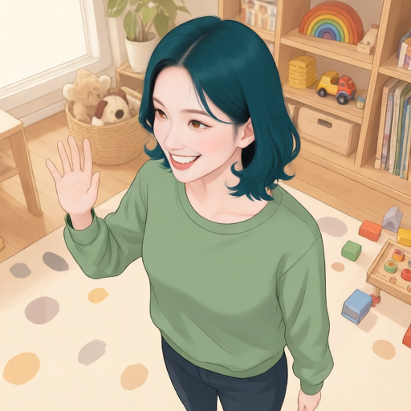 |

| 1600 검수 의견 | 3200 비교 의견 |
| --- | --- |
| 높은 시점과 손 흔들기 유지. 열린 웃음이 닫힌 입으로 약화. 인물 비율과 소매·손 크기가 달라짐. | 높은 시점·손 흔들기는 유지. 1600의 닫힌 입에서 치아가 보이는 열린 웃음이 돌아와 표정 보존은 개선됨. 성인형 목·몸 비율은 이어지고 창밖 풍경과 바닥 무늬는 더 단순화됨. |

### P712-CAM-043 · toddler / elevated / 0°

| 입력 | Mira 토르소 참조 |
| --- | --- |
|  |  |

| 1600 · 1.0 | 3200 · 1.0 |
| --- | --- |
|  |  |

| 1600 검수 의견 | 3200 비교 의견 |
| --- | --- |
| 아래를 보는 시선과 모은 손 유지. 손 모양이 다시 그려지고 머리·상체 비율이 바뀜. 바닥 무늬는 단순화됨. | 아래를 보는 시선·모은 손·높은 시점 유지. 입력의 가슴 포켓이 사라진 상태는 이어지고, 1600보다 소매가 짧아지며 상의 밑단이 올라가 허리 피부가 드러남. 몸통·팔도 가늘어져 의상·비율 보존이 약해짐. |

[이 입력의 강도 비교](bfs-camera-366-scale-review.md#case-043)

### P712-CAM-044 · toddler / elevated / 45°

| 입력 | Mira 토르소 참조 |
| --- | --- |
|  |  |

| 1600 · 1.0 | 3200 · 1.0 |
| --- | --- |
|  | 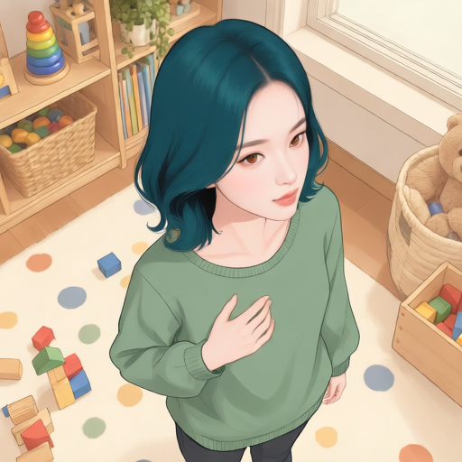 |

| 1600 검수 의견 | 3200 비교 의견 |
| --- | --- |
| 가슴 위 손과 높은 시점 유지. 성인형 얼굴·목·손으로 변환. 큰 배경 배치는 유지하나 작은 물체 윤곽은 달라짐. | 가슴 위 손·높은 시점·골지 목선과 밑단은 유지. 1600과 유사한 얼굴·단발이며 입력보다 정면에 가까운 시선과 성인형 몸 비율은 지속. 손가락·소매 윤곽과 바닥 무늬 배치가 일부 달라짐. |

### P712-CAM-045 · toddler / elevated / 90°

| 입력 | Mira 토르소 참조 |
| --- | --- |
|  |  |

| 1600 · 1.0 | 3200 · 1.0 |
| --- | --- |
|  | 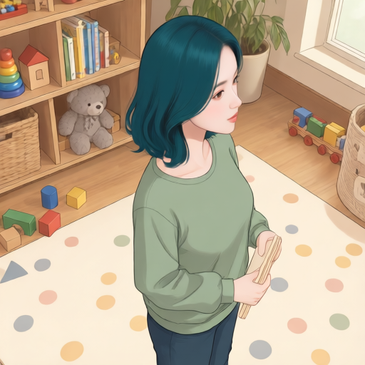 |

| 1600 검수 의견 | 3200 비교 의견 |
| --- | --- |
| 책과 높은 시점의 우향 자세 유지. 몸통이 길어지고 책·손 크기 및 각도가 바뀜. 미소가 약화됨. | 책을 든 자세·높은 시점 유지. 1600보다 얼굴이 정면 쪽으로 돌아오고 입력의 열린 웃음은 닫힌 입으로 약해진 상태가 이어짐. 길어진 몸통과 책·손 크기 및 각도 차이도 남음. |

## 조건과 이전 검수 기록

366쌍 중 학습 347쌍으로 학습한 1600스텝 LoRA와, 그 종료 상태에서 추가 1600스텝을 학습한 누적 3200스텝 LoRA의 결과다. 현재 공개된 1600스텝 가중치와 이번 3200스텝 실험 결과를 구분한다. 입력 45장은 학습 입력과 해시가 겹치지 않으며, 목표 얼굴 이미지는 추론에 전달하지 않았다.

기반 모델: Qwen-Image-Edit-2511. 기존 45장 표는 LoRA 강도 1.0, 시드 62294, 추론 20스텝, CFG 4.0, 출력·참조 VAE 512×512, 크롭 없음이다. [12개 강도 비교](bfs-camera-366-scale-review.md)에는 2026-09-20 검수한 미적용·0.5·0.75 결과와 기존 1.0 결과를 함께 정리했다.

| 비교 대상 | 체크포인트 SHA-256 | 생성·검수 상태 |
| --- | --- | --- |
| 1600스텝 | `9cddfaec307af146ce5311669c2e0ab42fdf68abe836364fa329e32861e9e37e` | 45장 생성 완료, 2026-09-18 시각 검수 의견 기록 |
| 누적 3200스텝 | `3614fd3e83d9f99408cab412ff678a82c5b8a8700e2d5e731507de5b2ee75cc5` | 45장 생성 완료, 2026-09-19 파일 무결성 확인 및 45장 AI 시각 비교 검수 의견 기록 |

[1600스텝 생성 조건](codex-camera-lora-366-v1/plan.json)과 3200스텝 생성 조건(로컬 실행 계획: `.tmp/p7-5-10/camera-366-step3200-evaluation-plan.json`)을 대조했다. 입력 45장·관리번호·프롬프트·시드·전처리·추론 설정은 같고 체크포인트와 그 해시만 다르다. 3200스텝 결과는 2026-09-19 09:13 KST에 생성이 완료되었으며, 45개 이미지와 결과 JSON의 대응·해시·512×512 크기를 확인했다. 2026-09-19에 입력·1600스텝·3200스텝 원본을 45개 관리번호별로 대조해 아래 비교 의견을 작성했다.

1600스텝 결과는 45장 생성과 파일 무결성 검증을 완료하고, 2026-09-18에 입력·출력 45쌍과 5.2의 방향별 Mira 기준 15장을 대조해 AI 시각 검수 의견을 작성했다. 사용자는 얼굴·헤어·표정에 큰 특이점이 없고 일부 복장 변경이 있다고 판단했다. 아래 세부 관찰은 이 종합 판단과 구분하며, 개별 이미지의 채택·폐기를 뜻하지 않는다. 관리번호는 기존 P712-CAM 번호를 유지한다.

얼굴·헤어·화풍이 Mira에 가까운지, 특히 ±45°·±90°에서 입력 얼굴의 앞뒤 길이를 그대로 따르는지 확인한다. 동시에 방향·표정·자세·의상·배경·구도 보존을 확인한다. 기존 45장 표에는 미적용 결과가 없고, 후속 12개 입력 비교에만 미적용 결과가 있다. 개선 폭을 정량적으로 단정하지 않는다.

### 1600스텝 검수 의견

**얼굴·헤어는 대체로 양호하고 표정에도 큰 이상은 없으며, 일부 복장 변경은 명확한 의상 보존 오류다.** Mira 계열의 얼굴·청록 단발은 방향과 입력 인물이 달라도 전반적으로 나타난다. 입력 보존과 그림 전체의 화풍 통일은 별도로 평가한다. 정면 사례 008·023·038에서는 공통 인상이 비교적 쉽게 읽힌다. 측면에서도 기준 계열의 얼굴·헤어가 나타나므로 이번 결과만으로 “입력의 얼굴 비율을 그대로 유지한다”고 일반화하지 않는다. 다만 머리카락 외곽은 두개골 윤곽과 다르며, 방향·표정·원근도 달라 앞뒤 길이가 기준과 같아졌다는 정량 결론은 내리지 않는다.

- **큰 구도와 동작:** 방향, 손 흔들기, 가슴 위 손, 책 들기 등은 대체로 이어진다. 인물의 화면 점유율과 체형·목·손 비율은 달라지는 사례가 있다.
- **의상 디자인:** 009·011·019·026·028·029에서 칼라 또는 목선 변화가 눈에 띈다. 010에서는 입력에 없던 덮개·단추가 있는 가슴 포켓이 추가됐다. 색을 유지한 것과 디자인을 보존한 것은 구분한다.
- **표정:** 전체적인 표현에 큰 특이점은 없다는 사용자 판단을 반영한다. 010·037·042 등에서 입 벌어짐과 웃음 강도가 달라지는 세부 차이는 관찰되지만, 이를 얼굴 표현의 이상이나 전체적인 표정 실패로 확대하지 않는다. 정확한 입력 표정 보존 여부를 비교하는 참고 사항으로 남긴다.
- **소품:** 040은 책을 든 동작은 남지만 닫힌 책이 펼쳐진 책으로 바뀐다. 물체 존재와 물체 상태 보존은 다르다.
- **배경과 화풍:** 방·카페·서가의 큰 배치는 대체로 남는다. 특히 성인 입력에서는 인물의 평면 채색과 배경의 사진 질감이 함께 남아 전체 화풍 변환이 고르지 않다. 장난감·책·바닥 무늬의 단순화와 실제 누락은 구분해 판단해야 한다.
- **유아 입력 031–045:** 성인 Mira 계열 얼굴로의 변환 자체는 목적에 부합할 수 있다. 그러나 목·어깨·가슴·몸통 비율까지 바뀌는 것은 별도의 보존 문제다. 유아 나이 표현이 달라졌다는 이유만으로 실패 처리하지 않는다.

이 45장 스텝 비교에는 미적용 결과나 데이터 보강 전 모델의 결과가 없다. 미적용은 별도의 12개 강도 비교에서 확인한다. 같은 학습 데이터와 추론 조건에서 1600스텝과 재개 학습한 누적 3200스텝을 비교할 수 있지만, 데이터 보강 효과를 이 비교만으로 분리해 입증할 수는 없다. 3200스텝 시각 검수에서는 얼굴 특징 강화와 위 보존 문제의 악화 여부를 함께 판단한다. 더 오래 학습하면 반드시 개선된다고 결론 내리지 않는다.

### 1600스텝 사용자 검수 의견: 복장 일부 변경

사용자 검수에서 복장이 일부 바뀌는 사례를 확인했다. 입력의 의상 색상이 유지되어도 칼라·목선·트임이 달라지거나 포켓이 추가되면 의상 디자인을 보존한 것으로 보지 않는다. 얼굴·헤어·화풍 변환과 구분되는 **의상 보존 오류**로 기록한다. 아래 관리번호는 사용자 검수와 AI 재확인에서 기록한 사례이며, 개별 항목의 최종 채택·폐기 판정을 뜻하지 않는다.

- **P712-CAM-010:** 입력에 없던 덮개·단추가 있는 가슴 포켓이 추가된다. 사용자 지적 후 원본 입력·출력을 대조해 확인한 의상 보존 오류다.
- **P712-CAM-009·011:** 셔츠 칼라가 사라지고 목선이 바뀐다.
- **P712-CAM-019:** 목선이 더 깊은 V 형태로 바뀐다.
- **P712-CAM-026:** 칼라처럼 보이는 형태가 추가된다.
- **P712-CAM-028·029:** 목선이 둥근 형태로 바뀐다.

누적 3200스텝 결과에서도 같은 입력과 관리번호를 우선 비교한다. Mira 특징이 강화되더라도 복장 변경이 늘어나면 보존 품질이 개선됐다고 판단하지 않는다.

기존 의견은 1600스텝 결과에 대한 기록이며 3200스텝 판정으로 옮기지 않는다. 검수는 아래 Markdown의 입력·두 스텝 출력 원본 이미지와 관리번호별 의견을 기준으로 진행한다. 별도의 합성 검수 시트는 보관하지 않는다.

### 3200스텝 AI 시각 비교 검수 의견

**일부 의상 오류와 표정은 개선됐지만, 새로운 의상 변경과 방향·인물 비율 변화가 나타나 전체 보존 품질이 1600스텝보다 개선됐다고 판단하기 어렵다.** 2026-09-19에 45개 항목의 입력·1600스텝·3200스텝 원본 총 135장을 대조했다. 다음은 AI의 육안 관찰이며 사용자 최종 채택 판정과 구분한다. 이번 비교에서는 Mira 기준 이미지와의 유사도 점수를 측정하지 않았다.

- **얼굴·헤어:** 청록 단발과 공통된 얼굴 인상은 계속 나타난다. 038 등은 두 체크포인트가 유사하다. 다만 001·006·020·024·035·039·045 등은 3200스텝 얼굴이 더 정면 쪽으로 돌아와 입력 방향과 차이가 커진다. 이것을 목표 얼굴 유사도 향상으로 해석하지 않는다.
- **의상:** 009의 칼라 복구와 010의 추가 포켓 제거는 개선된 부분이다. 반면 011·015의 셔츠 구조 소실, 017의 앞단추 추가, 020·023·041·043의 상의 길이 변화는 보존 문제다. 특히 041은 긴소매·긴 바지가 짧은 소매·반바지로 바뀐다. 의상 색 유지와 디자인 보존을 구분한다.
- **표정·시선:** 030·037·042는 1600스텝보다 웃음이 드러난다. 반대로 007·027은 열린 웃음이 닫힌 입으로 바뀌고, 028은 아래를 보던 시선이 카메라를 향한다. 표정 변화는 항목마다 다르며 얼굴 표현 전체의 실패로 확대하지 않는다.
- **동작·비율:** 손 흔들기·모은 손·가슴 위 손·책 들기의 큰 동작은 대체로 남는다. 006·021·023 등에서는 인물이 작아지거나 몸통이 가늘어지고, 026은 주머니에 넣은 손 자세도 달라진다. 유아 입력의 목표 얼굴 변환 자체와 목·몸통·팔 비율 변화는 별도로 판단한다.
- **소품·배경:** 040은 책을 든 동작이 남지만 입력의 닫힌 책 상태가 명확히 복구되지 않는다. 창문·서가·장난감의 큰 배치는 대체로 이어진다. 028·032·042 등은 배경 세부가 더 단순해지며, 성인 입력에서는 인물과 배경의 질감 차이가 남는 사례도 있다.

#### 기존 의상 지적 항목 재확인

| 관리번호 | 3200스텝 관찰 | 비교 판단 |
| --- | --- | --- |
| P712-CAM-009 | 셔츠 칼라가 다시 나타남 | 해당 오류 완화. 얼굴 방향·몸 비율 차이는 남음 |
| P712-CAM-010 | 추가됐던 덮개·단추 가슴 포켓이 사라짐 | 해당 오류 완화. 표정·비율 차이는 남음 |
| P712-CAM-011 | 칼라 소실에 더해 앞단추·가슴 포켓도 사라짐 | 의상 보존 악화 |
| P712-CAM-019 | 깊은 V 목선은 줄지만 앞단추가 추가됨 | 입력 디자인 복구로 보기 어려움 |
| P712-CAM-026 | 칼라 같은 형태가 없어지고 둥근 목선으로 바뀜. 원래 트임·단추도 사라짐 | 다른 디자인으로 바뀌어 오류 해소로 보기 어려움 |
| P712-CAM-028 | V 목선이 사라진 채 더 얕은 둥근 목선이 됨 | 오류 지속 |
| P712-CAM-029 | 목선이 더 좁고 단순해지며 원래 주름·여밈이 복구되지 않음 | 오류 지속 |

추가 주의 항목은 008·015·017·018·020·021·022·023·030·041·043이다. 036의 입력에 없는 큰 앞포켓과 043의 가슴 포켓 소실은 이번 대조에서 두 체크포인트 모두에 확인한 보완 관찰이며, 기존 1600스텝 기록을 수정하지 않고 여기에 남긴다.

이번 45장은 학습 입력과 해시가 겹치지 않는 외부 입력이며 학습 데이터의 검증용 19쌍과는 별도다. 한 시드·한 LoRA 강도에서 나온 정성 비교이므로 전체 성능 점수, 오류율 또는 과적합의 확정 근거로 삼지 않는다. 현재 결과는 3200스텝의 일괄 대체 채택을 뒷받침하지 않으며, 후속 비교에서는 위 개선 사례와 새 오류 사례를 함께 재확인한다.
