# P7-5.10 LoRA 데이터셋 검토표

구성 기준일: 2026-09-17

[5.10 원고로 돌아가기](../../../../parts/part-07/chapter-05/section-10.md)

[통합 데이터셋 JSON: 217개](p7-5-10-paired-dataset.json)

[이전 학습에 사용한 193쌍 기록](../sec-12/p7-5-11-bfs-paired-dataset-v1.json)

## 데이터셋 구성

현재 **217개를 한 목록에서 관리**한다. 기존 193쌍은 준비 완료이며, 추가 24개는 입력 활용이 확정되었으며, 11개는 기존 목표를 재사용하고 13개만 새 목표 생성·검수를 기다린다. 아래 기존 193쌍 표와 끝의 추가 24개 표는 같은 통합 JSON에 대응한다. 기존 193쌍은 입력 → 목표 순서로 보여 준다. 사용자 채택 판단에서 최종 폐기 27건을 제외한 구성으로, 기존 AI 검수 의견과는 구분한다. 데이터셋 구성이며 학습 완료나 성능 검증 결과를 뜻하지 않는다.

- 학습: **174쌍**, 중복을 제외한 Mira 목표 **37장**.
- 검증: **19쌍**, 중복을 제외한 Mira 목표 **4장**.
- 기존 준비 완료: **193쌍**, 중복을 제외한 Mira 목표 **41장**. 같은 목표에 서로 다른 입력이 대응하므로 쌍 수와 목표 이미지 수는 다르다.
- 추가 생성 목표 후보 **123장**은 대응 입력이 아직 없어 이 데이터셋에 포함하지 않았다.

같은 목표에서 파생된 입력은 같은 분할에 둔다. 다만 공통 Mira 기준 이미지에서 파생된 자료이므로 이 분할만으로 외부 장면에 대한 독립 검증을 보장하지 않는다. 관리번호는 기존 `P711-IN-NNN`을 유지하며 폐기 번호를 재사용하지 않는다.

## 학습 방향과 확인 기준

`control_image`는 모델에 주는 입력이고 `image`는 학습 목표다. 얼굴·헤어는 Mira 아이덴티로, 전체 화풍은 Mira 목표 화풍으로 바꾼다. **입력 표정·얼굴 방향·포즈·의상 디자인·카메라와 구도·배경 사물과 배치는 보존**한다. 배경의 화풍 변화와 사물 손실·추가·배치 변경을 구분하여 확인한다.

모든 쌍에 적용하는 학습 지시(`caption`)는 다음과 같다.

> Transform the woman into mira_person with Mira's facial identity and hairstyle, and render the entire image in Mira's target illustration style. Preserve the input facial expression, head direction, pose, clothing design, camera viewpoint, perspective, framing, subject position, apparent body scale, background objects and scene layout.

이미지를 클릭하면 원본을 확인할 수 있다. 각 행의 목표 그룹은 같은 목표를 공유하는 입력을 식별하며, JSON에는 이미지 경로와 해시·분할·채택 이유가 기록되어 있다.

[기존 입력 후보 검수 비교표](input-candidate-comparison.md)

[추가 목표 후보 검수 비교표](target-candidate-review.md)

## 학습 174쌍

| 관리번호 · 입력 ID | 입력 (`control_image`) | Mira 목표 (`image`) | 분할 · 목표 그룹 |
| --- | --- | --- | --- |
| **P711-IN-001** `bfs-input-01-soft-photo` |  |  | `train` `target-01` |
| **P711-IN-002** `bfs-input-02-watercolor` |  |  | `train` `target-02` |
| **P711-IN-003** `bfs-input-03-clay-render` |  |  | `train` `target-03` |
| **P711-IN-004** `bfs-input-04-ink-illustration` |  |  | `train` `target-04` |
| **P711-IN-005** `bfs-input-05-oil-painting` | [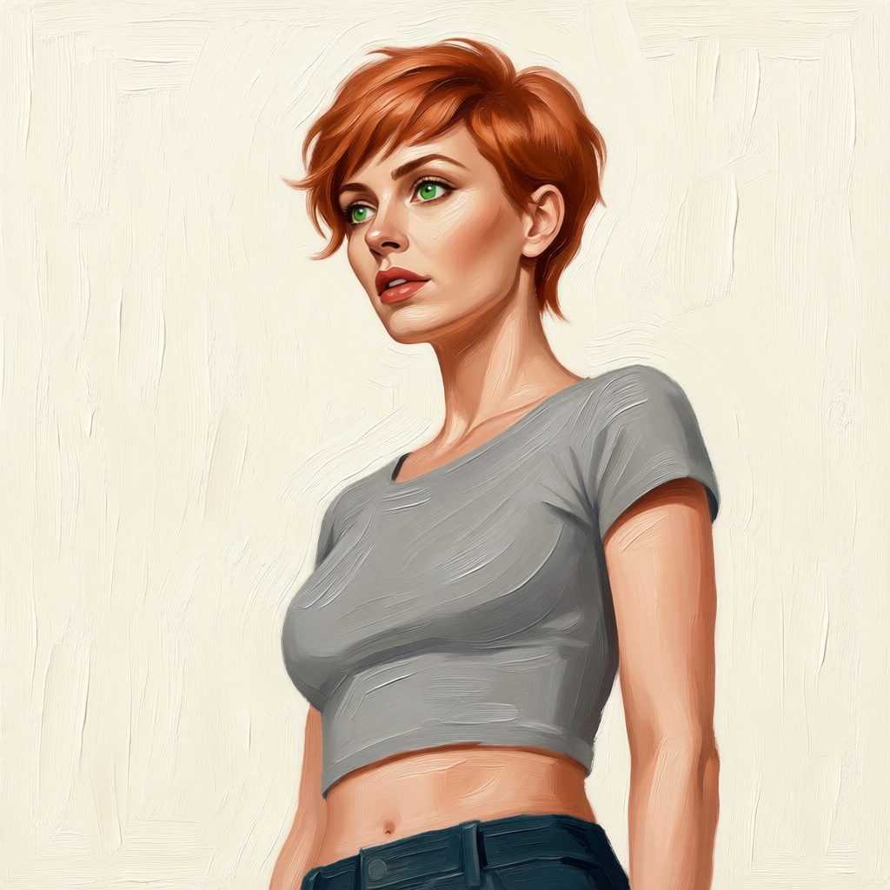](input-images/bfs-input-05-oil-painting.png) |  | `train` `target-05` |
| **P711-IN-006** `bfs-input-06-soft-photo` |  |  | `train` `target-06` |
| **P711-IN-007** `bfs-input-07-watercolor` |  |  | `train` `target-07` |
| **P711-IN-008** `bfs-input-08-clay-render` |  |  | `train` `target-08` |
| **P711-IN-009** `bfs-input-09-ink-illustration` |  |  | `train` `target-09` |
| **P711-IN-010** `bfs-input-10-oil-painting` |  |  | `train` `target-10` |
| **P711-IN-011** `bfs-input-11-soft-photo` |  |  | `train` `target-11` |
| **P711-IN-012** `bfs-input-12-watercolor` |  |  | `train` `target-12` |
| **P711-IN-013** `bfs-input-13-clay-render` |  |  | `train` `target-13` |
| **P711-IN-014** `bfs-input-14-ink-illustration` |  |  | `train` `target-14` |
| **P711-IN-015** `bfs-input-15-oil-painting` |  |  | `train` `target-15` |
| **P711-IN-016** `bfs-input-16-soft-photo` |  |  | `train` `target-16` |
| **P711-IN-018** `bfs-input-18-clay-render` | [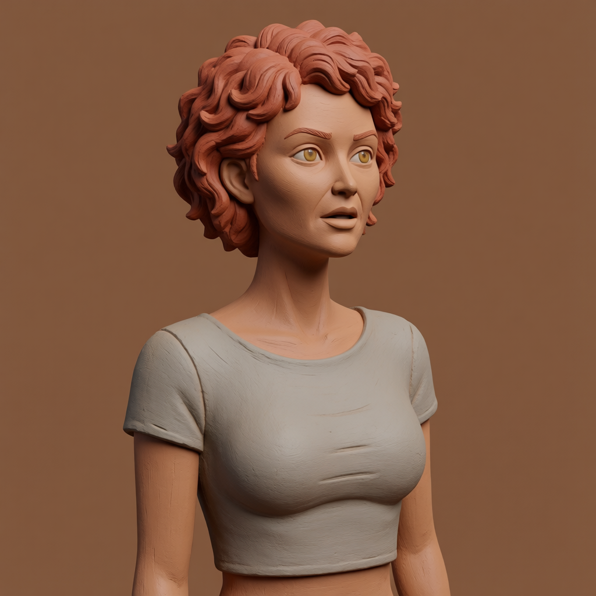](input-images/bfs-input-18-clay-render.png) |  | `train` `target-18` |
| **P711-IN-024** `bfs-input-24-ink-illustration` | [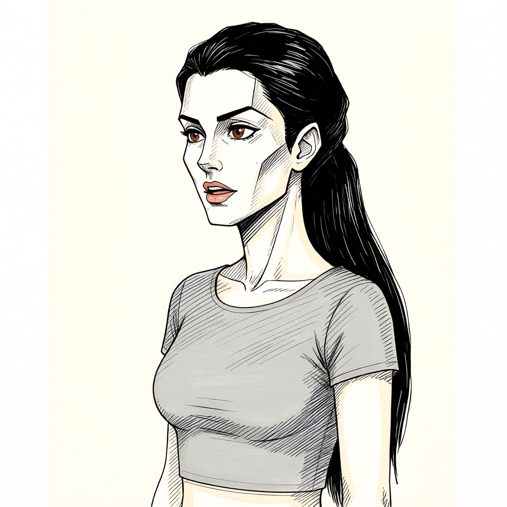](input-images/bfs-input-24-ink-illustration.png) |  | `train` `target-24` |
| **P711-IN-025** `bfs-input-25-oil-painting` |  |  | `train` `target-25` |
| **P711-IN-027** `bfs-input-27-watercolor` |  |  | `train` `target-27` |
| **P711-IN-029** `bfs-input-29-ink-illustration` |  |  | `train` `target-29` |
| **P711-IN-030** `bfs-input-30-oil-painting` |  |  | `train` `target-30` |
| **P711-IN-031** `bfs-input-31-soft-photo` | [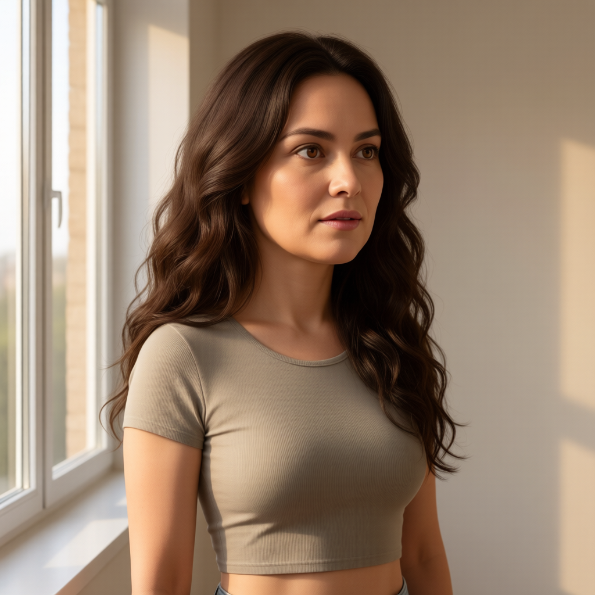](input-images/bfs-input-31-soft-photo.png) |  | `train` `target-31` |
| **P711-IN-033** `bfs-input-33-clay-render` |  |  | `train` `target-33` |
| **P711-IN-034** `bfs-input-34-ink-illustration` | [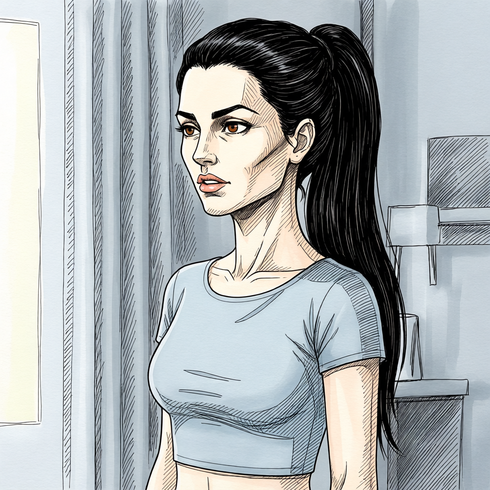](input-images/bfs-input-34-ink-illustration.png) |  | `train` `target-34` |
| **P711-IN-035** `bfs-input-35-oil-painting` |  |  | `train` `target-35` |
| **P711-IN-036** `bfs-input-36-soft-photo` | [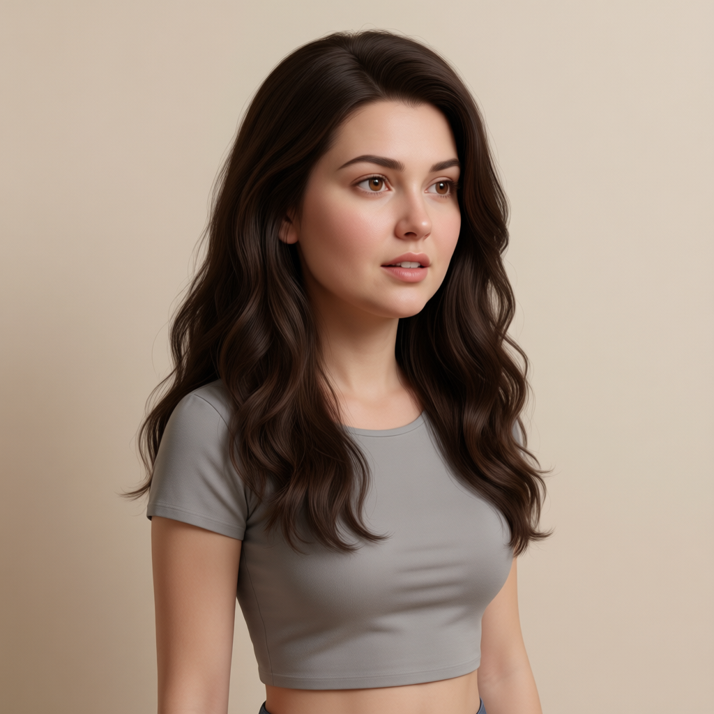](input-images/bfs-input-36-soft-photo.png) |  | `train` `target-36` |
| **P711-IN-037** `bfs-input-37-watercolor` |  |  | `train` `target-37` |
| **P711-IN-038** `bfs-input-38-clay-render` |  |  | `train` `target-38` |
| **P711-IN-039** `bfs-input-39-ink-illustration` |  |  | `train` `target-39` |
| **P711-IN-040** `bfs-input-40-oil-painting` |  |  | `train` `target-40` |
| **P711-IN-041** `bfs-input-41-soft-photo` |  |  | `train` `target-41` |
| **P711-IN-042** `bfs-input-42-watercolor` |  |  | `train` `target-42` |
| **P711-IN-043** `bfs-input-43-clay-render` |  |  | `train` `target-43` |
| **P711-IN-044** `bfs-input-44-ink-illustration` |  |  | `train` `target-44` |
| **P711-IN-045** `bfs-input-01-watercolor` |  |  | `train` `target-01` |
| **P711-IN-046** `bfs-input-02-clay-render` |  |  | `train` `target-02` |
| **P711-IN-047** `bfs-input-03-ink-illustration` |  |  | `train` `target-03` |
| **P711-IN-049** `bfs-input-05-soft-photo` |  |  | `train` `target-05` |
| **P711-IN-050** `bfs-input-06-watercolor` |  |  | `train` `target-06` |
| **P711-IN-051** `bfs-input-07-clay-render` |  |  | `train` `target-07` |
| **P711-IN-052** `bfs-input-08-ink-illustration` | [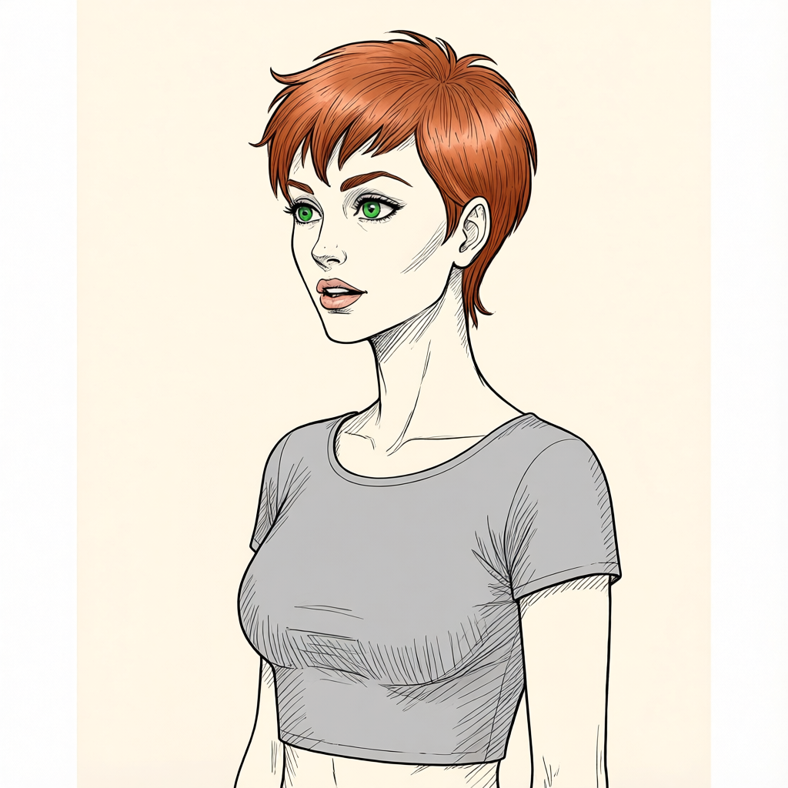](input-images/bfs-input-08-ink-illustration.png) |  | `train` `target-08` |
| **P711-IN-053** `bfs-input-09-oil-painting` |  |  | `train` `target-09` |
| **P711-IN-054** `bfs-input-10-soft-photo` |  |  | `train` `target-10` |
| **P711-IN-055** `bfs-input-11-watercolor` |  |  | `train` `target-11` |
| **P711-IN-056** `bfs-input-12-clay-render` |  |  | `train` `target-12` |
| **P711-IN-057** `bfs-input-13-ink-illustration` |  |  | `train` `target-13` |
| **P711-IN-058** `bfs-input-14-oil-painting` |  |  | `train` `target-14` |
| **P711-IN-059** `bfs-input-15-soft-photo` |  |  | `train` `target-15` |
| **P711-IN-060** `bfs-input-16-watercolor` |  |  | `train` `target-16` |
| **P711-IN-061** `bfs-input-17-clay-render` |  |  | `train` `target-17` |
| **P711-IN-062** `bfs-input-18-ink-illustration` |  |  | `train` `target-18` |
| **P711-IN-068** `bfs-input-24-oil-painting` |  |  | `train` `target-24` |
| **P711-IN-069** `bfs-input-25-soft-photo` |  |  | `train` `target-25` |
| **P711-IN-071** `bfs-input-27-clay-render` |  |  | `train` `target-27` |
| **P711-IN-073** `bfs-input-29-oil-painting` |  |  | `train` `target-29` |
| **P711-IN-074** `bfs-input-30-soft-photo` |  |  | `train` `target-30` |
| **P711-IN-076** `bfs-input-32-clay-render` |  |  | `train` `target-32` |
| **P711-IN-077** `bfs-input-33-ink-illustration` | [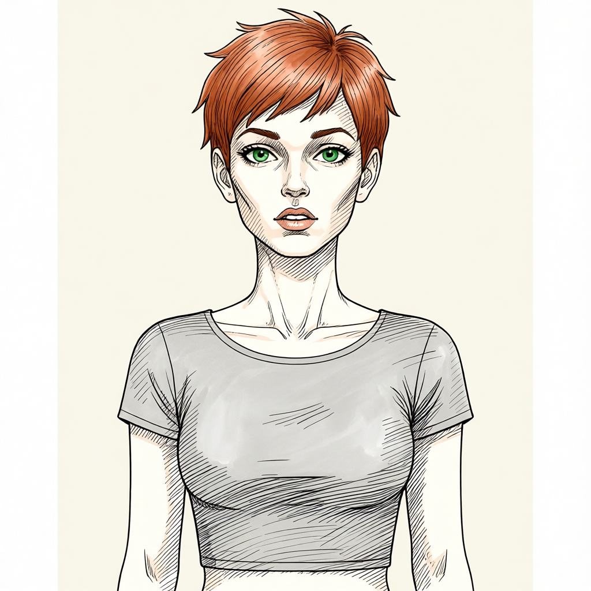](input-images/bfs-input-33-ink-illustration.png) |  | `train` `target-33` |
| **P711-IN-078** `bfs-input-34-oil-painting` | [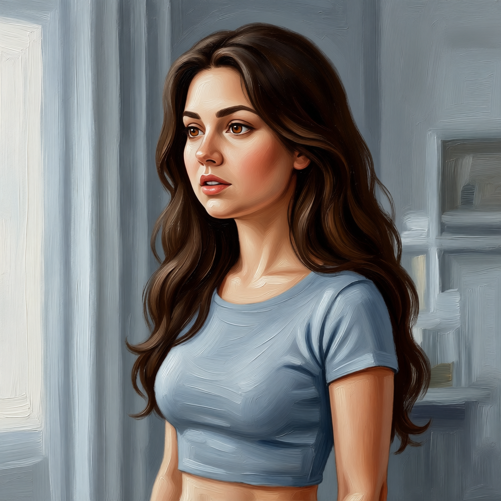](input-images/bfs-input-34-oil-painting.png) |  | `train` `target-34` |
| **P711-IN-079** `bfs-input-35-soft-photo` |  |  | `train` `target-35` |
| **P711-IN-080** `bfs-input-36-watercolor` |  |  | `train` `target-36` |
| **P711-IN-081** `bfs-input-37-clay-render` |  |  | `train` `target-37` |
| **P711-IN-082** `bfs-input-38-ink-illustration` | [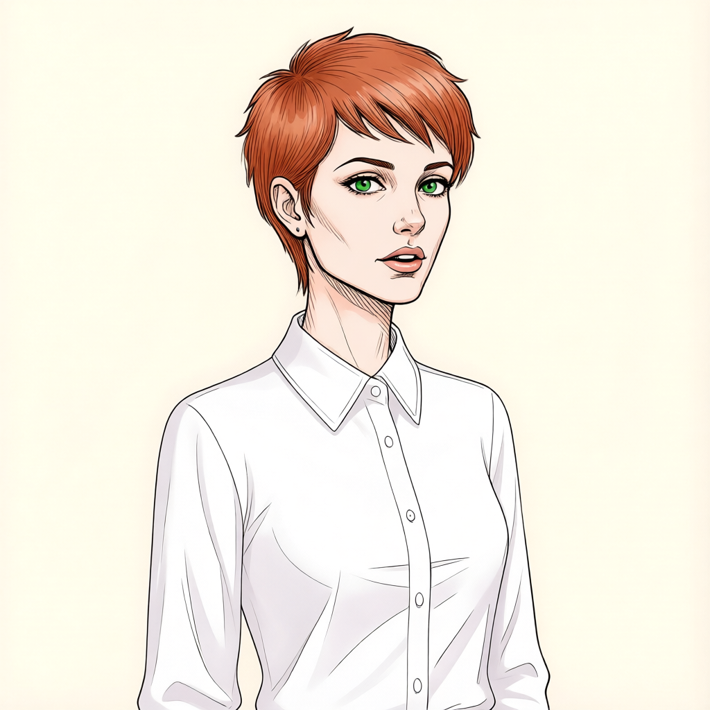](input-images/bfs-input-38-ink-illustration.png) |  | `train` `target-38` |
| **P711-IN-083** `bfs-input-39-oil-painting` |  |  | `train` `target-39` |
| **P711-IN-084** `bfs-input-40-soft-photo` |  |  | `train` `target-40` |
| **P711-IN-085** `bfs-input-41-watercolor` |  |  | `train` `target-41` |
| **P711-IN-086** `bfs-input-42-clay-render` |  |  | `train` `target-42` |
| **P711-IN-087** `bfs-input-43-ink-illustration` | [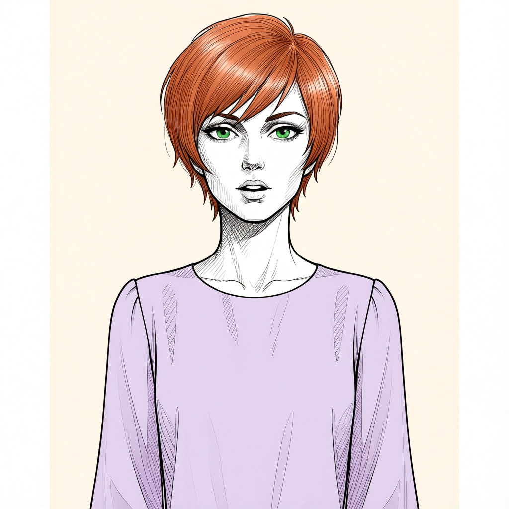](input-images/bfs-input-43-ink-illustration.png) |  | `train` `target-43` |
| **P711-IN-088** `bfs-input-44-oil-painting` | [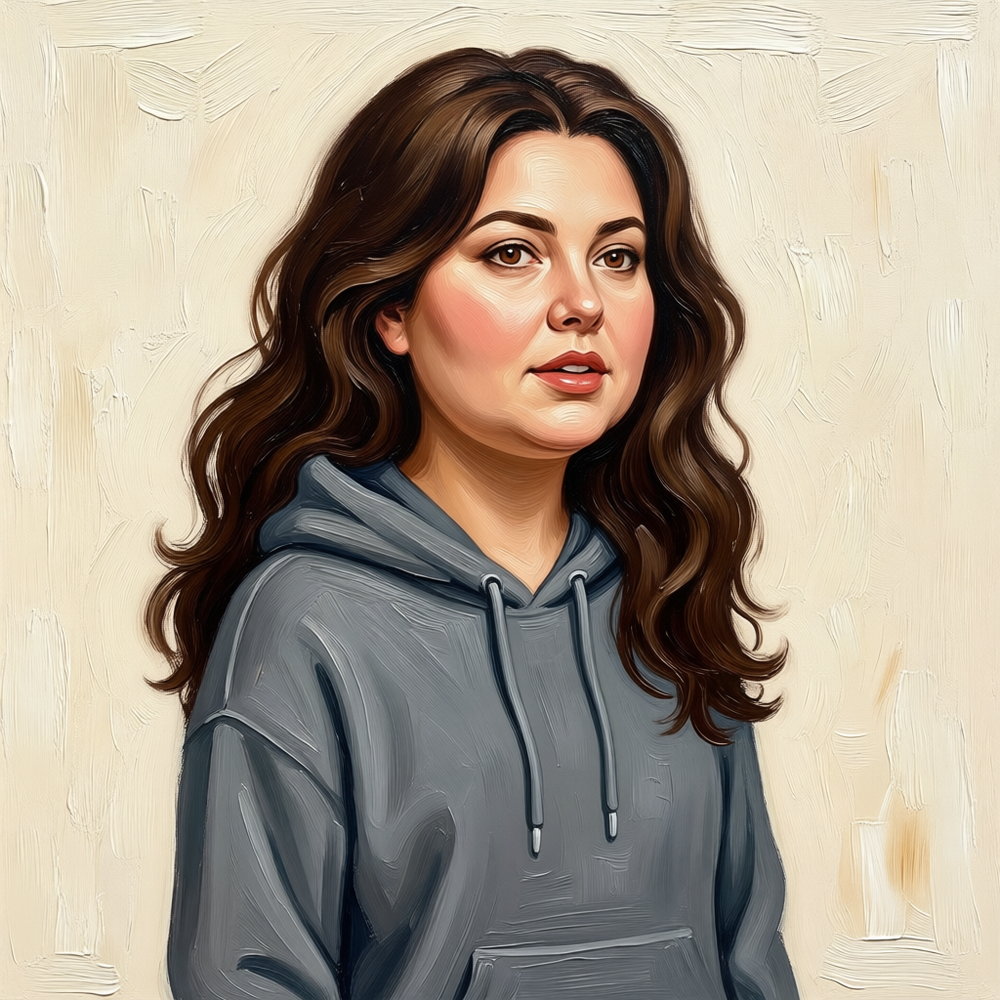](input-images/bfs-input-44-oil-painting.png) |  | `train` `target-44` |
| **P711-IN-089** `bfs-input-01-clay-render` |  |  | `train` `target-01` |
| **P711-IN-090** `bfs-input-02-ink-illustration` | [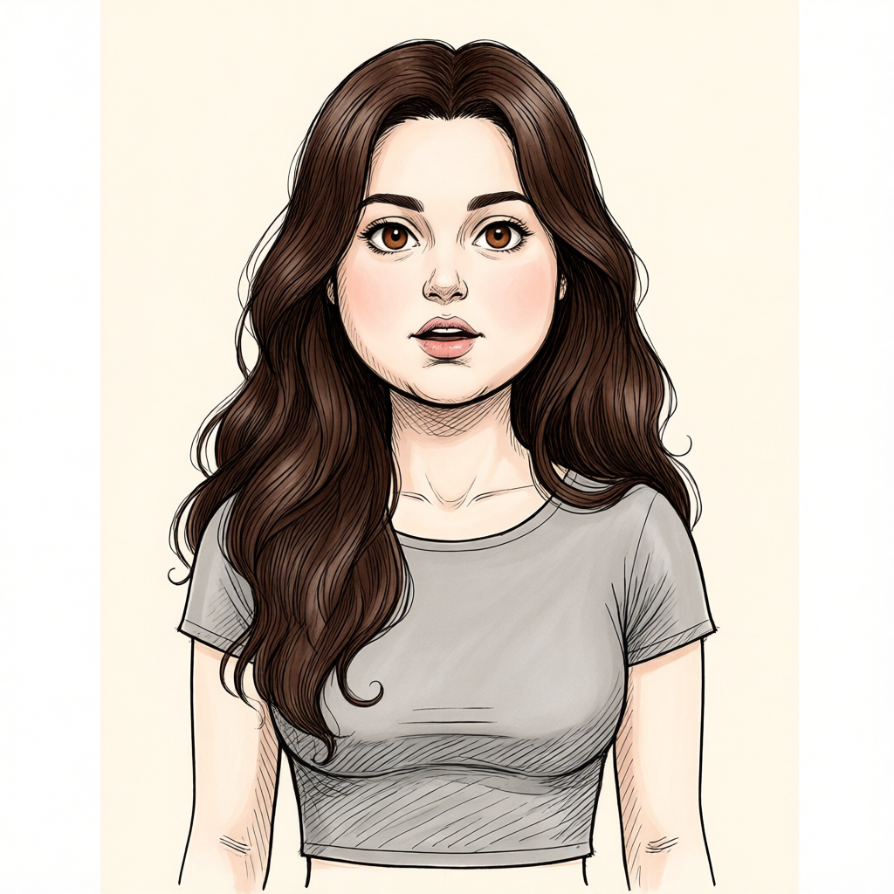](input-images/bfs-input-02-ink-illustration.png) |  | `train` `target-02` |
| **P711-IN-091** `bfs-input-03-oil-painting` | [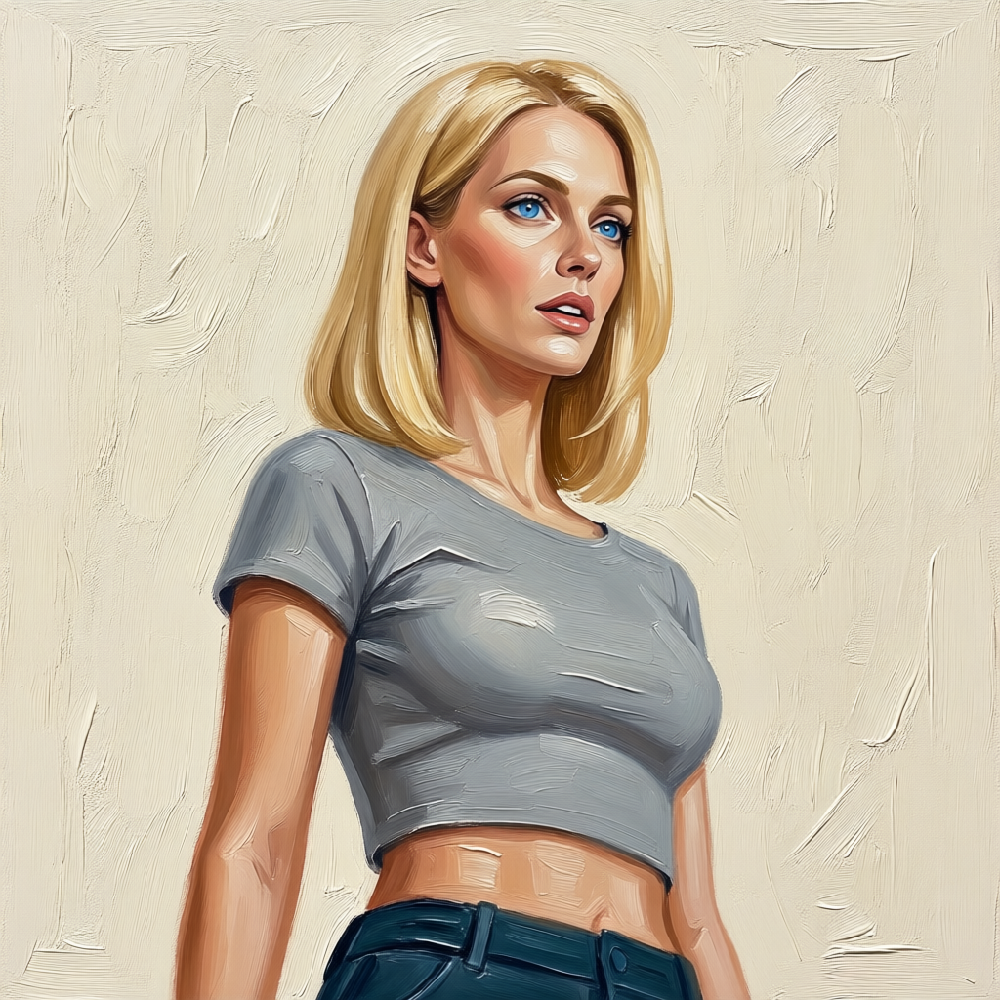](input-images/bfs-input-03-oil-painting.png) |  | `train` `target-03` |
| **P711-IN-093** `bfs-input-05-watercolor` |  |  | `train` `target-05` |
| **P711-IN-094** `bfs-input-06-clay-render` |  |  | `train` `target-06` |
| **P711-IN-095** `bfs-input-07-ink-illustration` | [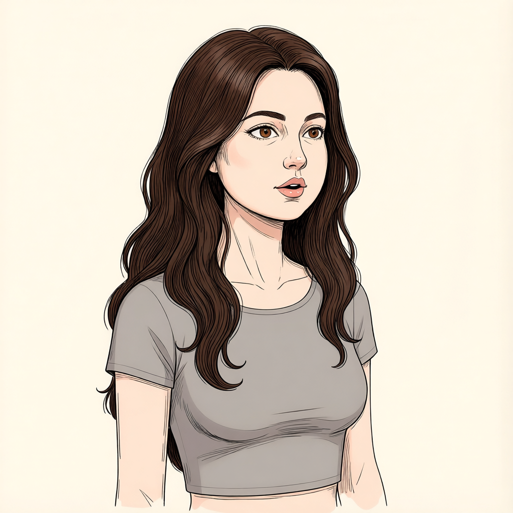](input-images/bfs-input-07-ink-illustration.png) |  | `train` `target-07` |
| **P711-IN-096** `bfs-input-08-oil-painting` |  |  | `train` `target-08` |
| **P711-IN-097** `bfs-input-09-soft-photo` |  |  | `train` `target-09` |
| **P711-IN-098** `bfs-input-10-watercolor` |  |  | `train` `target-10` |
| **P711-IN-099** `bfs-input-11-clay-render` |  |  | `train` `target-11` |
| **P711-IN-100** `bfs-input-12-ink-illustration` |  |  | `train` `target-12` |
| **P711-IN-101** `bfs-input-13-oil-painting` |  |  | `train` `target-13` |
| **P711-IN-102** `bfs-input-14-soft-photo` |  |  | `train` `target-14` |
| **P711-IN-103** `bfs-input-15-watercolor` |  |  | `train` `target-15` |
| **P711-IN-104** `bfs-input-16-clay-render` |  |  | `train` `target-16` |
| **P711-IN-105** `bfs-input-17-ink-illustration` |  |  | `train` `target-17` |
| **P711-IN-106** `bfs-input-18-oil-painting` |  |  | `train` `target-18` |
| **P711-IN-112** `bfs-input-24-soft-photo` |  |  | `train` `target-24` |
| **P711-IN-113** `bfs-input-25-watercolor` |  |  | `train` `target-25` |
| **P711-IN-115** `bfs-input-27-ink-illustration` | [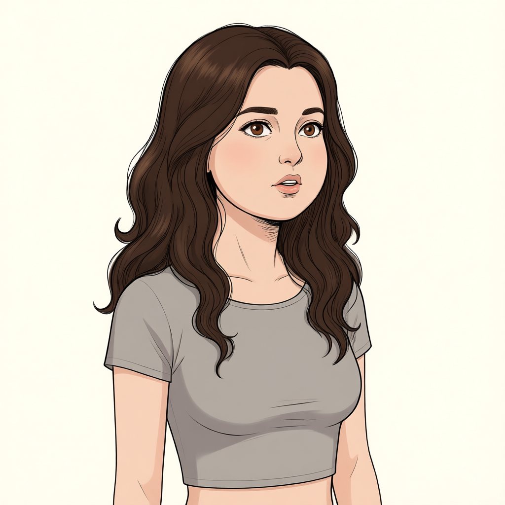](input-images/bfs-input-27-ink-illustration.png) |  | `train` `target-27` |
| **P711-IN-117** `bfs-input-29-soft-photo` |  |  | `train` `target-29` |
| **P711-IN-118** `bfs-input-30-watercolor` |  |  | `train` `target-30` |
| **P711-IN-119** `bfs-input-31-clay-render` |  |  | `train` `target-31` |
| **P711-IN-121** `bfs-input-33-oil-painting` |  |  | `train` `target-33` |
| **P711-IN-122** `bfs-input-34-soft-photo` |  |  | `train` `target-34` |
| **P711-IN-123** `bfs-input-35-watercolor` |  |  | `train` `target-35` |
| **P711-IN-124** `bfs-input-36-clay-render` | [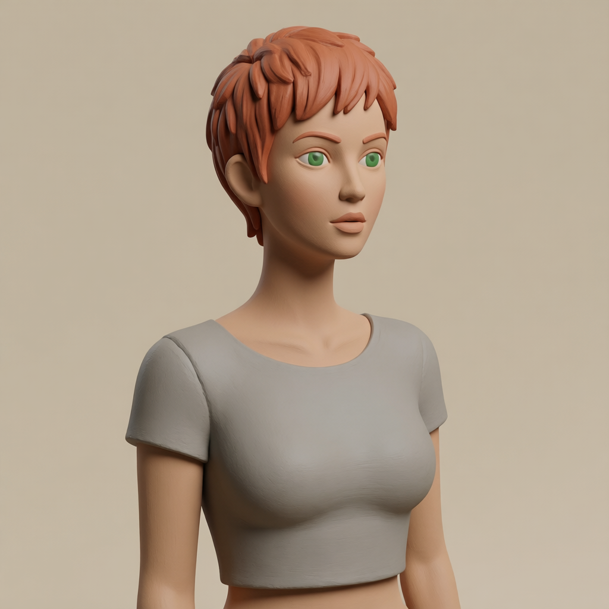](input-images/bfs-input-36-clay-render.png) |  | `train` `target-36` |
| **P711-IN-125** `bfs-input-37-ink-illustration` |  |  | `train` `target-37` |
| **P711-IN-126** `bfs-input-38-oil-painting` |  |  | `train` `target-38` |
| **P711-IN-127** `bfs-input-39-soft-photo` |  |  | `train` `target-39` |
| **P711-IN-129** `bfs-input-41-clay-render` |  |  | `train` `target-41` |
| **P711-IN-130** `bfs-input-42-ink-illustration` | [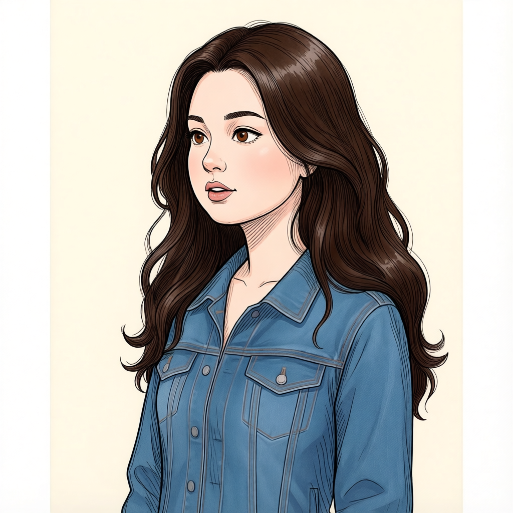](input-images/bfs-input-42-ink-illustration.png) |  | `train` `target-42` |
| **P711-IN-131** `bfs-input-43-oil-painting` |  |  | `train` `target-43` |
| **P711-IN-132** `bfs-input-44-soft-photo` |  |  | `train` `target-44` |
| **P711-IN-133** `bfs-input-01-ink-illustration` |  |  | `train` `target-01` |
| **P711-IN-134** `bfs-input-02-oil-painting` |  |  | `train` `target-02` |
| **P711-IN-135** `bfs-input-03-soft-photo` |  |  | `train` `target-03` |
| **P711-IN-137** `bfs-input-05-clay-render` |  |  | `train` `target-05` |
| **P711-IN-138** `bfs-input-06-ink-illustration` |  |  | `train` `target-06` |
| **P711-IN-139** `bfs-input-07-oil-painting` |  |  | `train` `target-07` |
| **P711-IN-140** `bfs-input-08-soft-photo` |  |  | `train` `target-08` |
| **P711-IN-141** `bfs-input-09-watercolor` |  |  | `train` `target-09` |
| **P711-IN-142** `bfs-input-10-clay-render` |  |  | `train` `target-10` |
| **P711-IN-143** `bfs-input-11-ink-illustration` |  |  | `train` `target-11` |
| **P711-IN-144** `bfs-input-12-oil-painting` |  |  | `train` `target-12` |
| **P711-IN-146** `bfs-input-14-watercolor` |  |  | `train` `target-14` |
| **P711-IN-147** `bfs-input-15-clay-render` |  |  | `train` `target-15` |
| **P711-IN-148** `bfs-input-16-ink-illustration` |  |  | `train` `target-16` |
| **P711-IN-149** `bfs-input-17-oil-painting` |  |  | `train` `target-17` |
| **P711-IN-150** `bfs-input-18-soft-photo` | [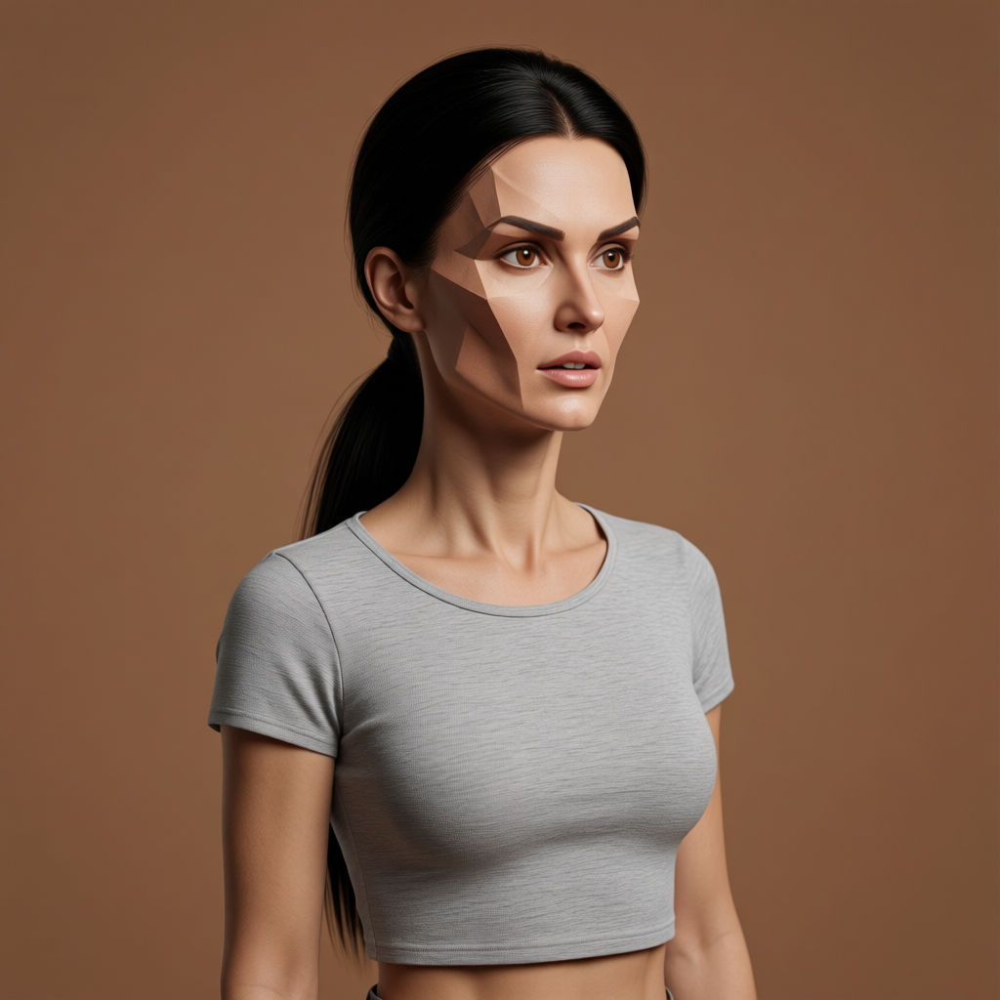](input-images/bfs-input-18-soft-photo.png) |  | `train` `target-18` |
| **P711-IN-156** `bfs-input-24-watercolor` |  |  | `train` `target-24` |
| **P711-IN-157** `bfs-input-25-clay-render` |  |  | `train` `target-25` |
| **P711-IN-159** `bfs-input-27-oil-painting` |  |  | `train` `target-27` |
| **P711-IN-161** `bfs-input-29-watercolor` | [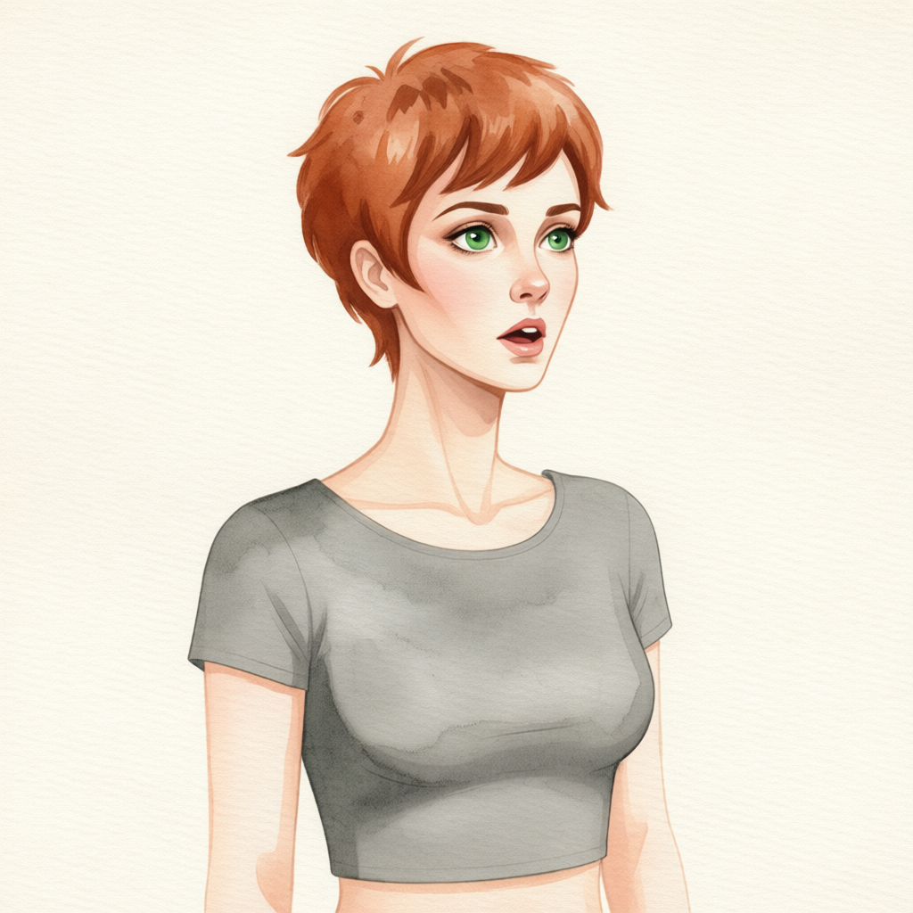](input-images/bfs-input-29-watercolor.png) |  | `train` `target-29` |
| **P711-IN-162** `bfs-input-30-clay-render` |  |  | `train` `target-30` |
| **P711-IN-163** `bfs-input-31-ink-illustration` |  |  | `train` `target-31` |
| **P711-IN-164** `bfs-input-32-oil-painting` |  |  | `train` `target-32` |
| **P711-IN-165** `bfs-input-33-soft-photo` |  |  | `train` `target-33` |
| **P711-IN-166** `bfs-input-34-watercolor` |  |  | `train` `target-34` |
| **P711-IN-167** `bfs-input-35-clay-render` |  |  | `train` `target-35` |
| **P711-IN-168** `bfs-input-36-ink-illustration` | [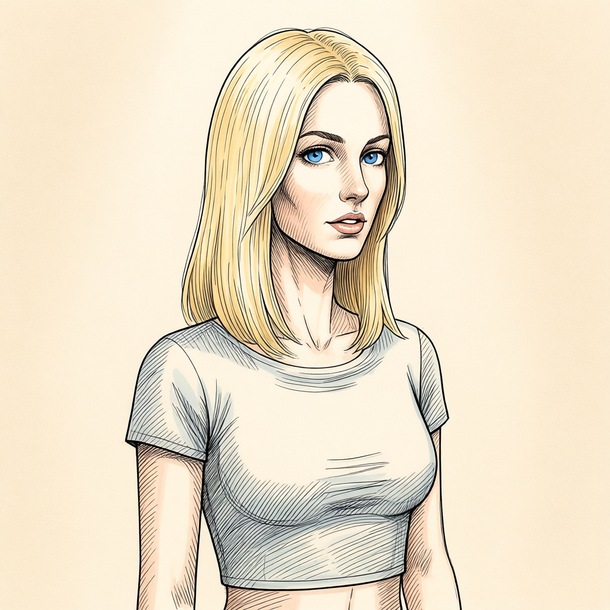](input-images/bfs-input-36-ink-illustration.png) |  | `train` `target-36` |
| **P711-IN-169** `bfs-input-37-oil-painting` |  |  | `train` `target-37` |
| **P711-IN-170** `bfs-input-38-soft-photo` |  |  | `train` `target-38` |
| **P711-IN-171** `bfs-input-39-watercolor` |  |  | `train` `target-39` |
| **P711-IN-172** `bfs-input-40-clay-render` |  |  | `train` `target-40` |
| **P711-IN-173** `bfs-input-41-ink-illustration` | [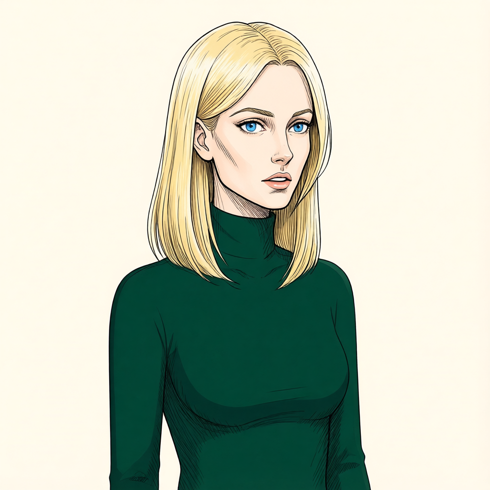](input-images/bfs-input-41-ink-illustration.png) |  | `train` `target-41` |
| **P711-IN-174** `bfs-input-42-oil-painting` | [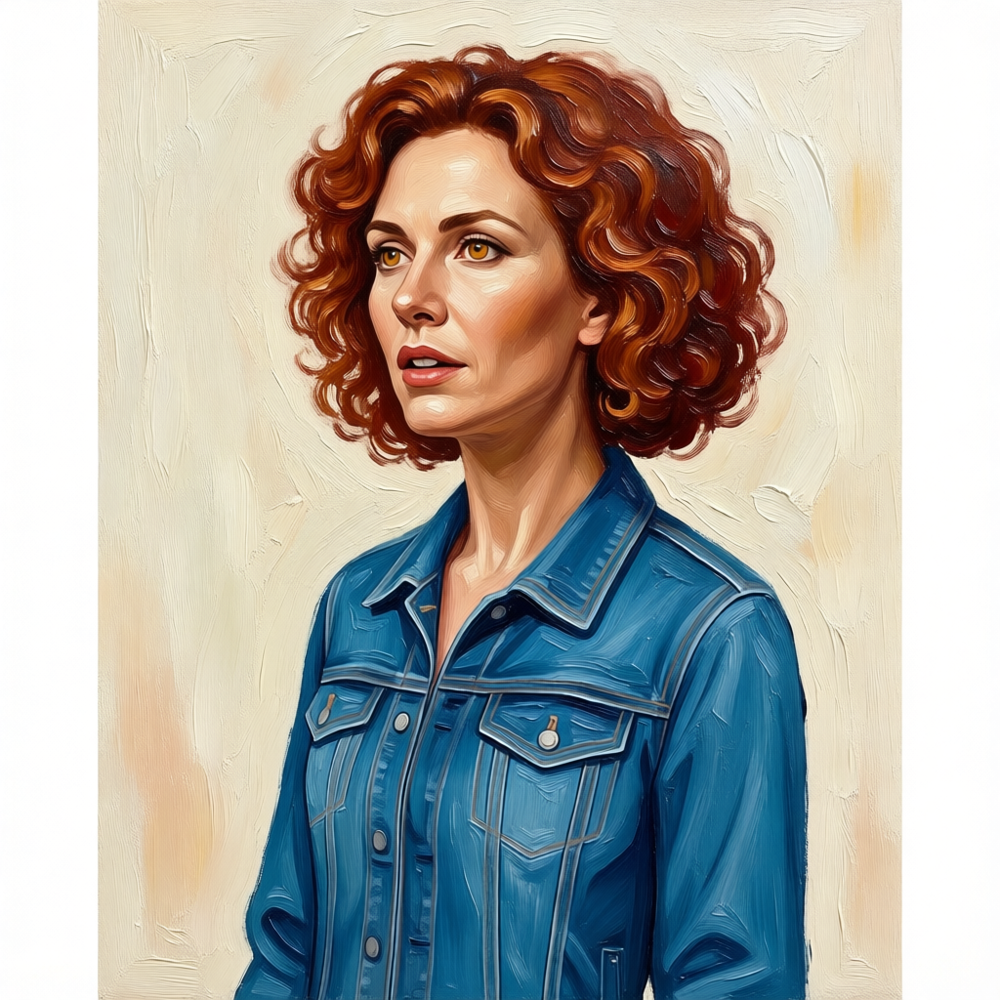](input-images/bfs-input-42-oil-painting.png) |  | `train` `target-42` |
| **P711-IN-175** `bfs-input-43-soft-photo` |  |  | `train` `target-43` |
| **P711-IN-176** `bfs-input-44-watercolor` |  |  | `train` `target-44` |
| **P711-IN-178** `bfs-input-02-soft-photo` | [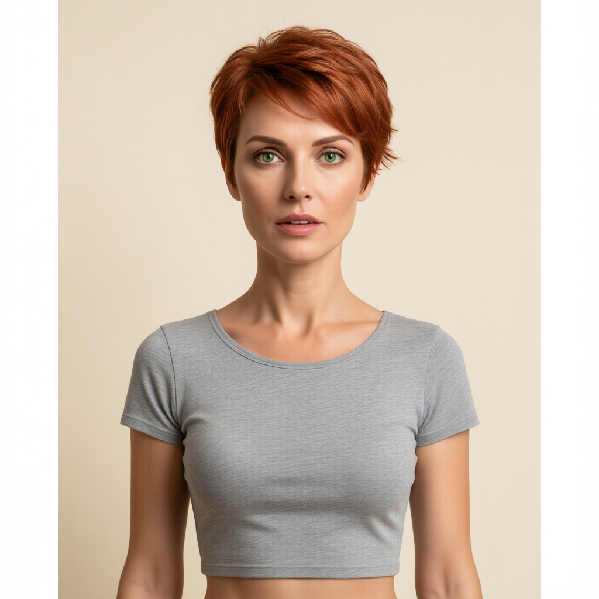](input-images/bfs-input-02-soft-photo.png) |  | `train` `target-02` |
| **P711-IN-179** `bfs-input-03-watercolor` | [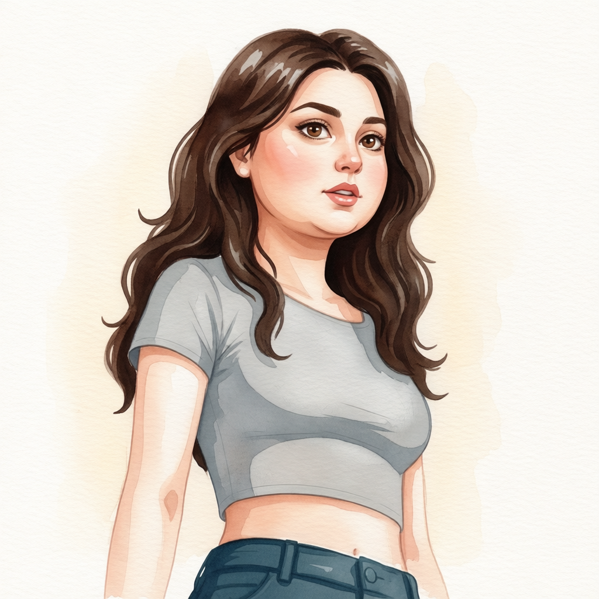](input-images/bfs-input-03-watercolor.png) |  | `train` `target-03` |
| **P711-IN-181** `bfs-input-05-ink-illustration` |  |  | `train` `target-05` |
| **P711-IN-182** `bfs-input-06-oil-painting` |  |  | `train` `target-06` |
| **P711-IN-183** `bfs-input-07-soft-photo` | [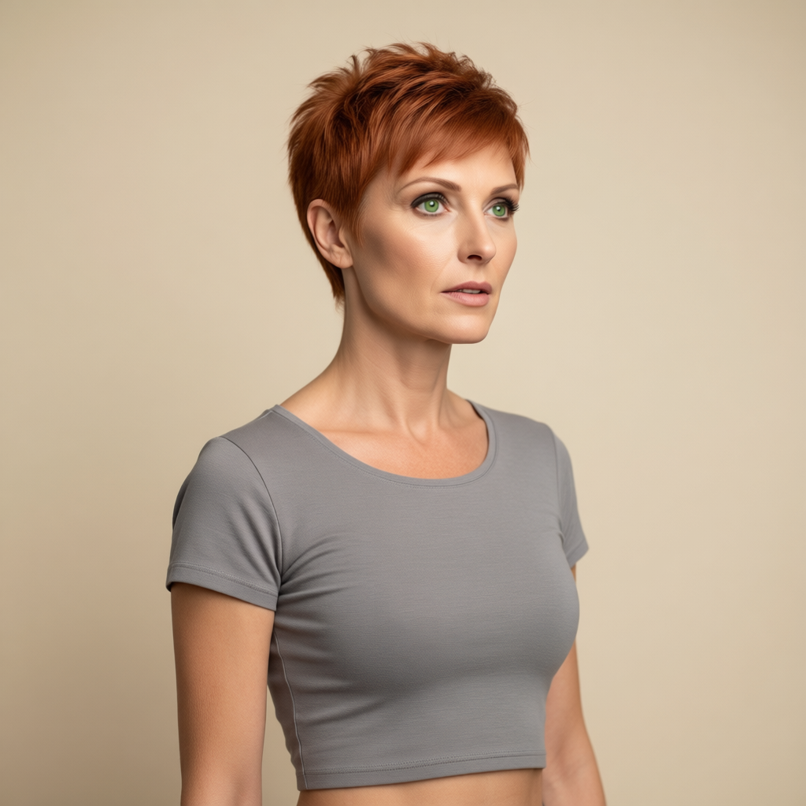](input-images/bfs-input-07-soft-photo.png) |  | `train` `target-07` |
| **P711-IN-184** `bfs-input-08-watercolor` |  |  | `train` `target-08` |
| **P711-IN-185** `bfs-input-09-clay-render` |  |  | `train` `target-09` |
| **P711-IN-186** `bfs-input-10-ink-illustration` |  |  | `train` `target-10` |
| **P711-IN-187** `bfs-input-11-oil-painting` |  |  | `train` `target-11` |
| **P711-IN-188** `bfs-input-12-soft-photo` | [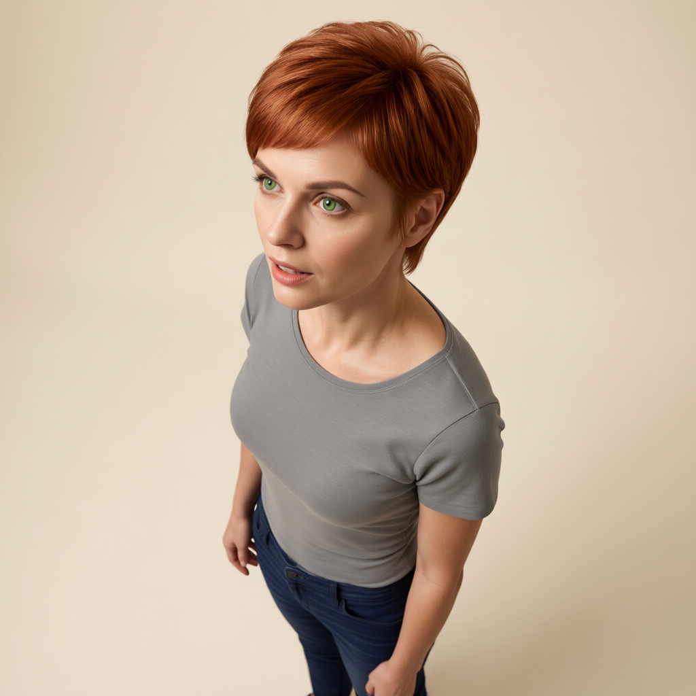](input-images/bfs-input-12-soft-photo.png) |  | `train` `target-12` |
| **P711-IN-189** `bfs-input-13-watercolor` |  |  | `train` `target-13` |
| **P711-IN-190** `bfs-input-14-clay-render` |  |  | `train` `target-14` |
| **P711-IN-191** `bfs-input-15-ink-illustration` |  |  | `train` `target-15` |
| **P711-IN-192** `bfs-input-16-oil-painting` |  |  | `train` `target-16` |
| **P711-IN-193** `bfs-input-17-soft-photo` |  |  | `train` `target-17` |
| **P711-IN-194** `bfs-input-18-watercolor` |  |  | `train` `target-18` |
| **P711-IN-200** `bfs-input-24-clay-render` |  |  | `train` `target-24` |
| **P711-IN-201** `bfs-input-25-ink-illustration` | [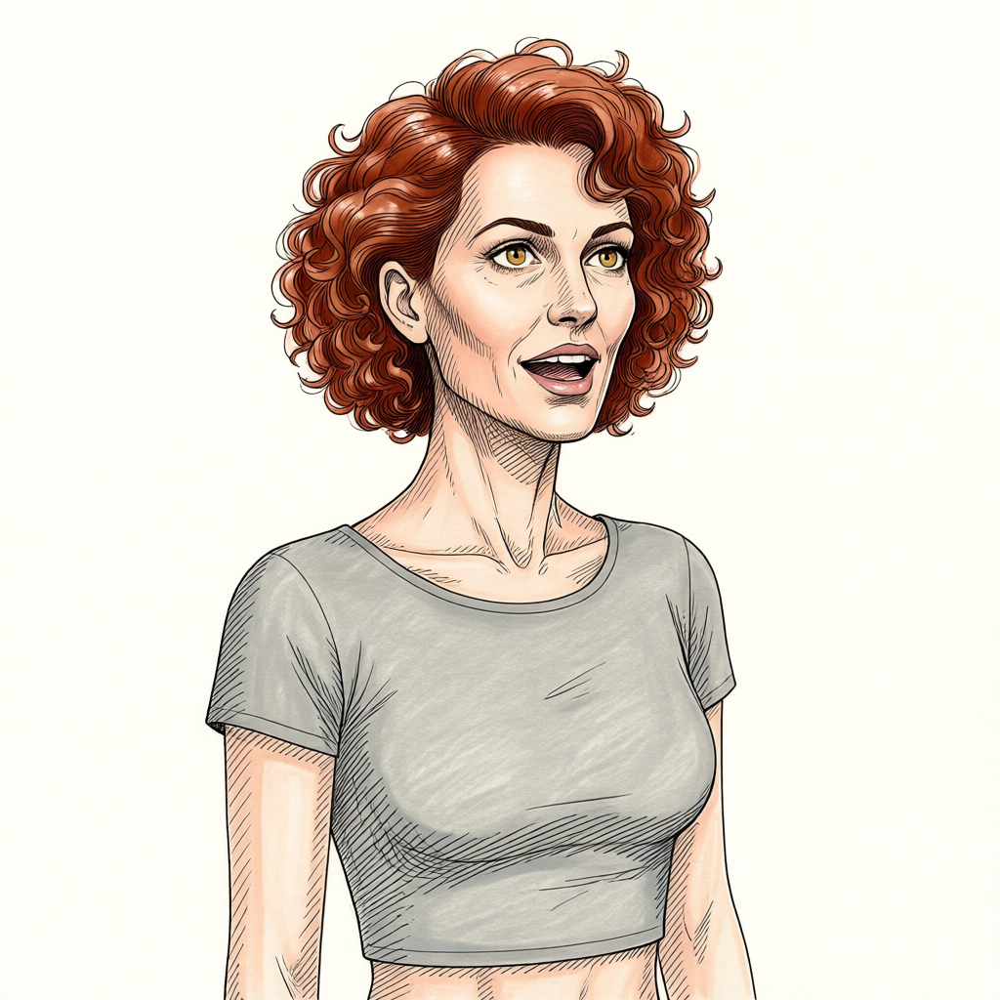](input-images/bfs-input-25-ink-illustration.png) |  | `train` `target-25` |
| **P711-IN-203** `bfs-input-27-soft-photo` | [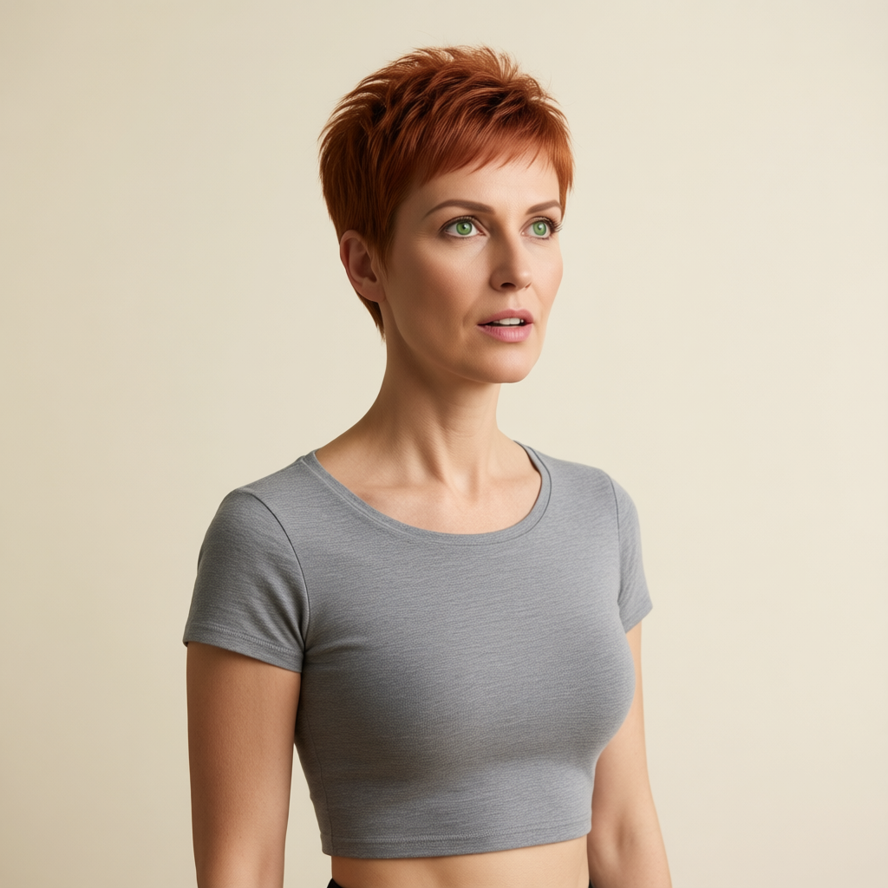](input-images/bfs-input-27-soft-photo.png) |  | `train` `target-27` |
| **P711-IN-205** `bfs-input-29-clay-render` |  |  | `train` `target-29` |
| **P711-IN-206** `bfs-input-30-ink-illustration` |  |  | `train` `target-30` |
| **P711-IN-207** `bfs-input-31-oil-painting` |  |  | `train` `target-31` |
| **P711-IN-208** `bfs-input-32-soft-photo` |  |  | `train` `target-32` |
| **P711-IN-209** `bfs-input-33-watercolor` |  |  | `train` `target-33` |
| **P711-IN-210** `bfs-input-34-clay-render` |  |  | `train` `target-34` |
| **P711-IN-211** `bfs-input-35-ink-illustration` | [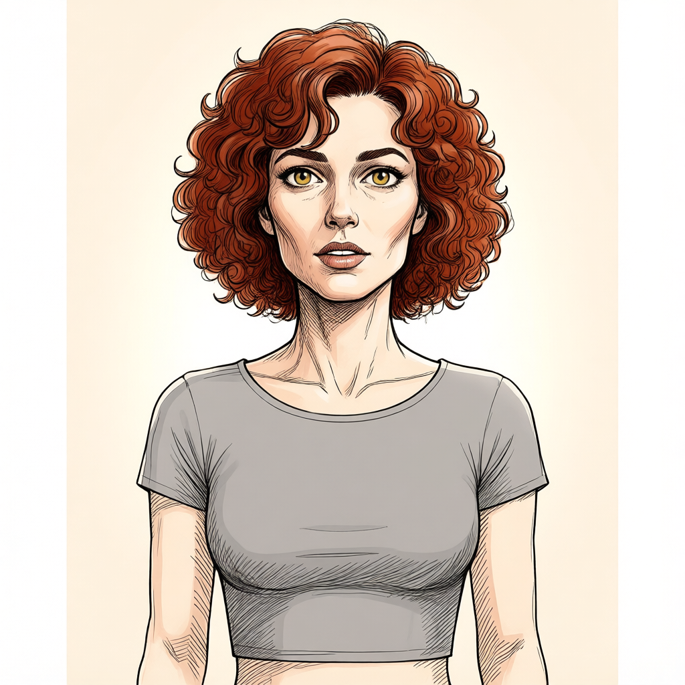](input-images/bfs-input-35-ink-illustration.png) |  | `train` `target-35` |
| **P711-IN-212** `bfs-input-36-oil-painting` |  |  | `train` `target-36` |
| **P711-IN-213** `bfs-input-37-soft-photo` |  |  | `train` `target-37` |
| **P711-IN-214** `bfs-input-38-watercolor` |  |  | `train` `target-38` |
| **P711-IN-215** `bfs-input-39-clay-render` |  |  | `train` `target-39` |
| **P711-IN-216** `bfs-input-40-ink-illustration` | [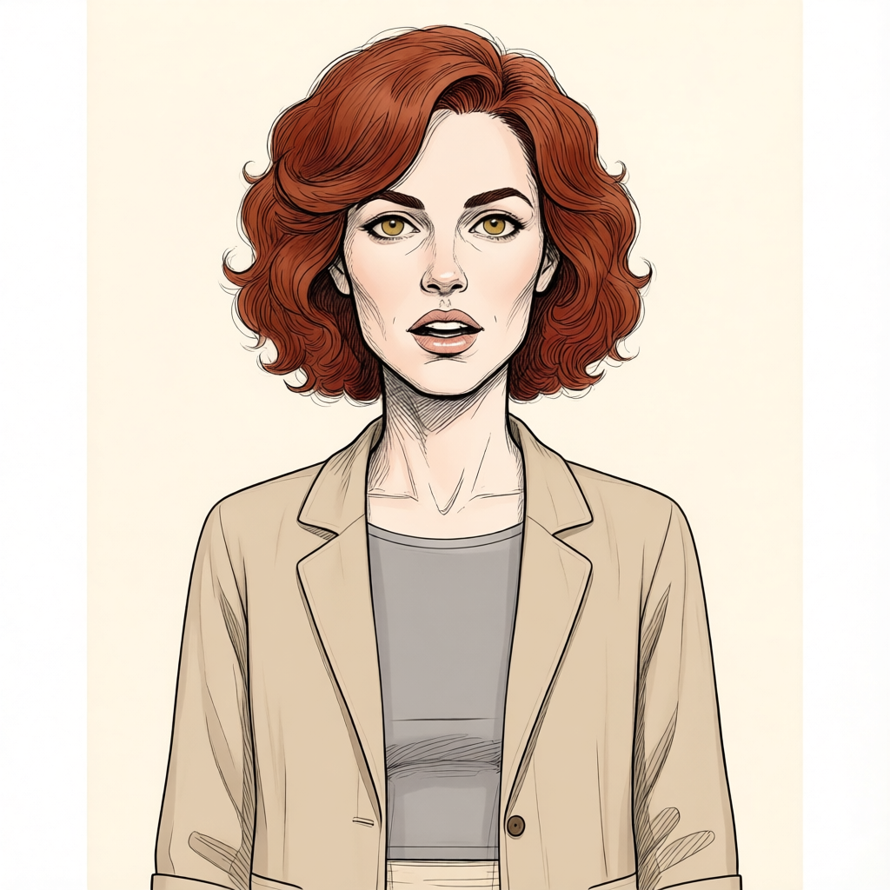](input-images/bfs-input-40-ink-illustration.png) |  | `train` `target-40` |
| **P711-IN-217** `bfs-input-41-oil-painting` |  |  | `train` `target-41` |
| **P711-IN-218** `bfs-input-42-soft-photo` |  |  | `train` `target-42` |
| **P711-IN-219** `bfs-input-43-watercolor` |  |  | `train` `target-43` |
| **P711-IN-220** `bfs-input-44-clay-render` | [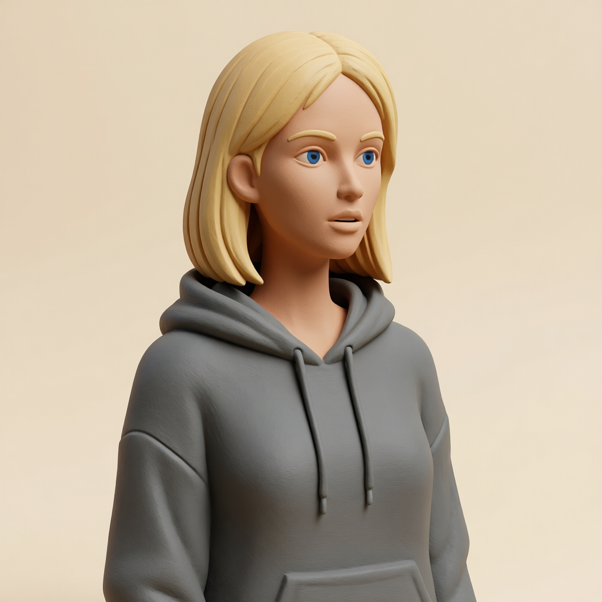](input-images/bfs-input-44-clay-render.png) |  | `train` `target-44` |

## 검증 19쌍

| 관리번호 · 입력 ID | 입력 (`control_image`) | Mira 목표 (`image`) | 분할 · 목표 그룹 |
| --- | --- | --- | --- |
| **P711-IN-019** `bfs-input-19-ink-illustration` |  |  | `validation` `target-19` |
| **P711-IN-020** `bfs-input-20-oil-painting` |  |  | `validation` `target-20` |
| **P711-IN-021** `bfs-input-21-soft-photo` |  |  | `validation` `target-21` |
| **P711-IN-022** `bfs-input-22-watercolor` |  |  | `validation` `target-22` |
| **P711-IN-063** `bfs-input-19-oil-painting` |  |  | `validation` `target-19` |
| **P711-IN-064** `bfs-input-20-soft-photo` |  |  | `validation` `target-20` |
| **P711-IN-066** `bfs-input-22-clay-render` |  |  | `validation` `target-22` |
| **P711-IN-107** `bfs-input-19-soft-photo` |  |  | `validation` `target-19` |
| **P711-IN-108** `bfs-input-20-watercolor` |  |  | `validation` `target-20` |
| **P711-IN-109** `bfs-input-21-clay-render` | [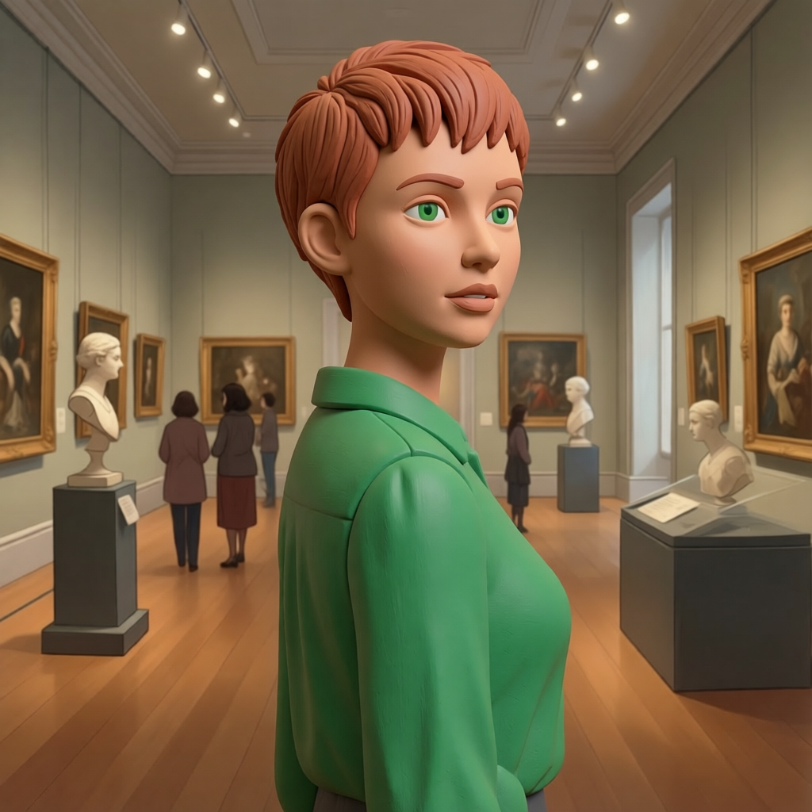](input-images/bfs-input-21-clay-render.png) |  | `validation` `target-21` |
| **P711-IN-110** `bfs-input-22-ink-illustration` |  |  | `validation` `target-22` |
| **P711-IN-151** `bfs-input-19-watercolor` |  |  | `validation` `target-19` |
| **P711-IN-152** `bfs-input-20-clay-render` |  |  | `validation` `target-20` |
| **P711-IN-153** `bfs-input-21-ink-illustration` | [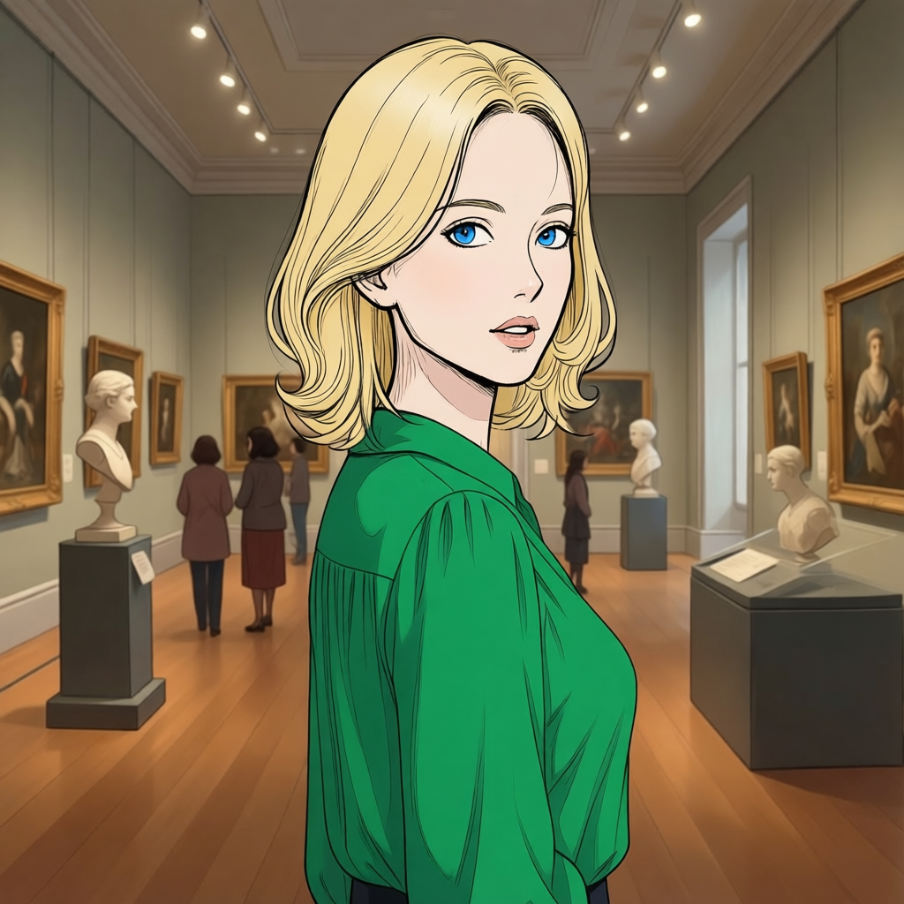](input-images/bfs-input-21-ink-illustration.png) |  | `validation` `target-21` |
| **P711-IN-154** `bfs-input-22-oil-painting` |  |  | `validation` `target-22` |
| **P711-IN-195** `bfs-input-19-clay-render` |  |  | `validation` `target-19` |
| **P711-IN-196** `bfs-input-20-ink-illustration` |  |  | `validation` `target-20` |
| **P711-IN-197** `bfs-input-21-oil-painting` |  |  | `validation` `target-21` |
| **P711-IN-198** `bfs-input-22-soft-photo` |  |  | `validation` `target-22` |

## 추가 24개: 기존 목표 재사용 11개·새 목표 대기 13개

통합 합계는 **217개**다. 준비 완료는 **204쌍**(기존 193 + 목표 재사용 11), 새 목표 대기는 **13개**다. 분할 예약은 학습 198개·검증 19개다. 대기 항목이 남아 있는 통합 목록으로 학습을 시작하면 중단한다. 새 목표 검수 후 같은 행의 해시와 상태를 확정한다.

| 관리번호 | 입력 | 목표 · 상태 |
| --- | --- | --- |
| P710-PROP-001 |  |  기존 목표 재사용 · 준비 완료 |
| P710-PROP-002 |  |  기존 목표 재사용 · 준비 완료 |
| P710-PROP-003 |  | P710-TGT-003 · 생성·검수 대기 |
| P710-PROP-004 |  | P710-TGT-004 · 생성·검수 대기 |
| P710-PROP-005 |  |  기존 목표 재사용 · 준비 완료 |
| P710-PROP-006 |  |  기존 목표 재사용 · 준비 완료 |
| P710-PROP-007 |  | P710-TGT-007 · 생성·검수 대기 |
| P710-PROP-008 |  | P710-TGT-008 · 생성·검수 대기 |
| P710-PROP-009 |  | P710-TGT-009 · 생성·검수 대기 |
| P710-PROP-010 |  | P710-TGT-010 · 생성·검수 대기 |
| P710-PROP-011 |  | P710-TGT-011 · 생성·검수 대기 |
| P710-PROP-012 |  | P710-TGT-012 · 생성·검수 대기 |
| P710-PROP-013 |  |  기존 목표 재사용 · 준비 완료 |
| P710-PROP-014 |  | P710-TGT-014 · 생성·검수 대기 |
| P710-PROP-015 |  |  기존 목표 재사용 · 준비 완료 |
| P710-PROP-016 |  |  기존 목표 재사용 · 준비 완료 |
| P710-PROP-017 |  |  기존 목표 재사용 · 준비 완료 |
| P710-PROP-018 |  | P710-TGT-018 · 생성·검수 대기 |
| P710-PROP-019 |  |  기존 목표 재사용 · 준비 완료 |
| P710-PROP-020 |  | P710-TGT-020 · 생성·검수 대기 |
| P710-PROP-021 |  | P710-TGT-021 · 생성·검수 대기 |
| P710-PROP-022 |  |  기존 목표 재사용 · 준비 완료 |
| P710-PROP-023 |  | P710-TGT-023 · 생성·검수 대기 |
| P710-PROP-024 |  |  기존 목표 재사용 · 준비 완료 |
