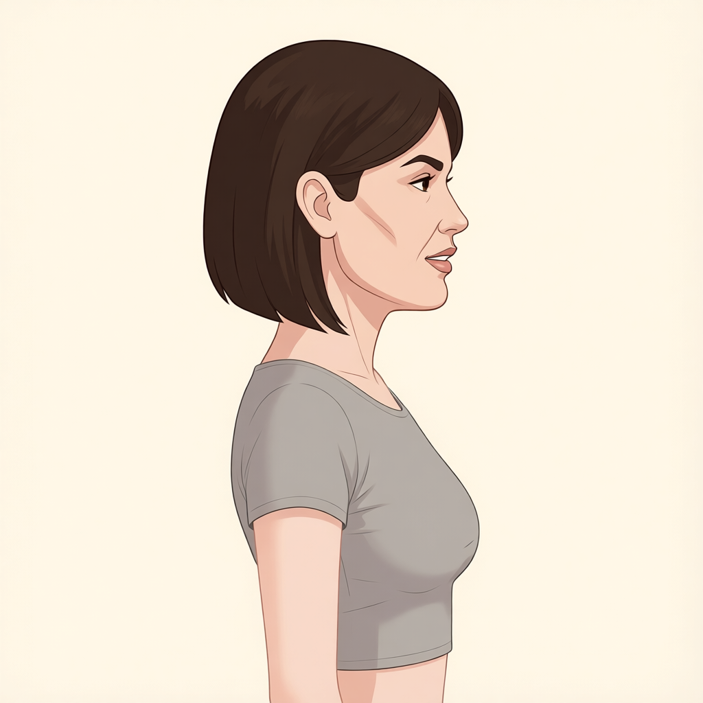
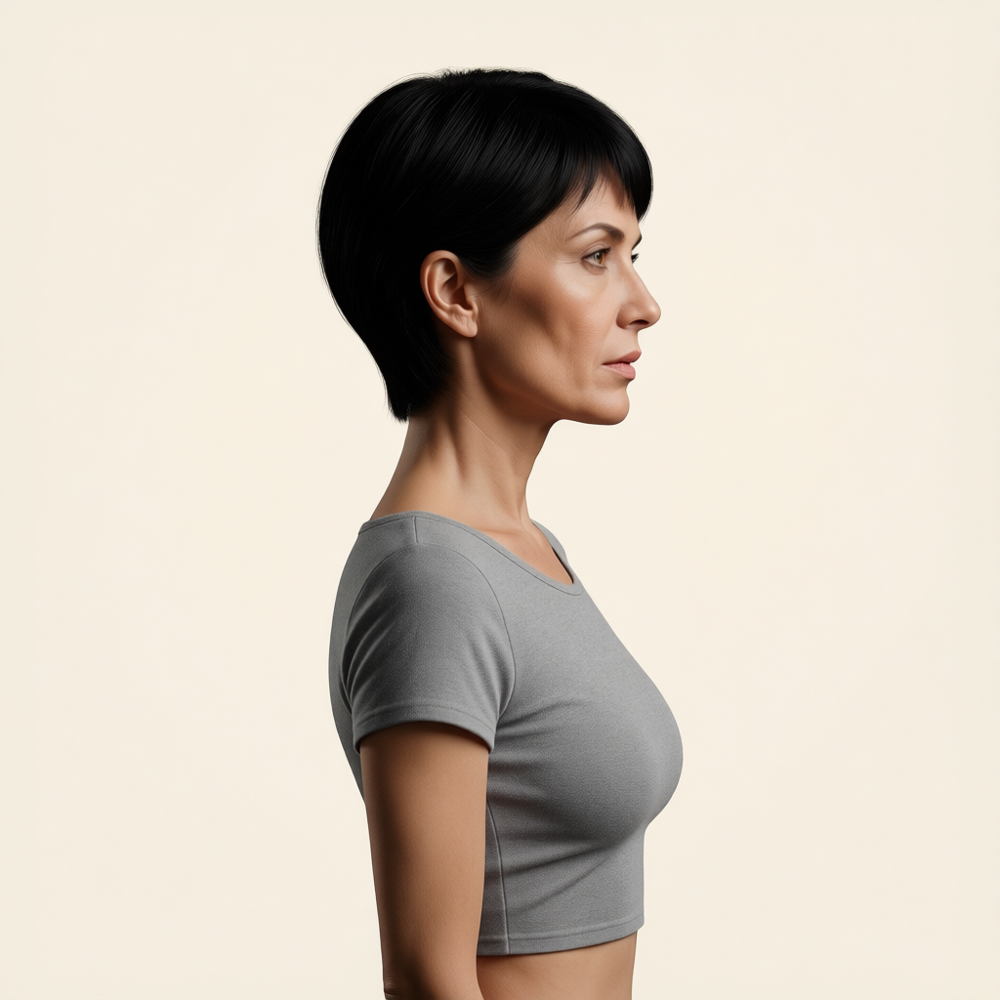
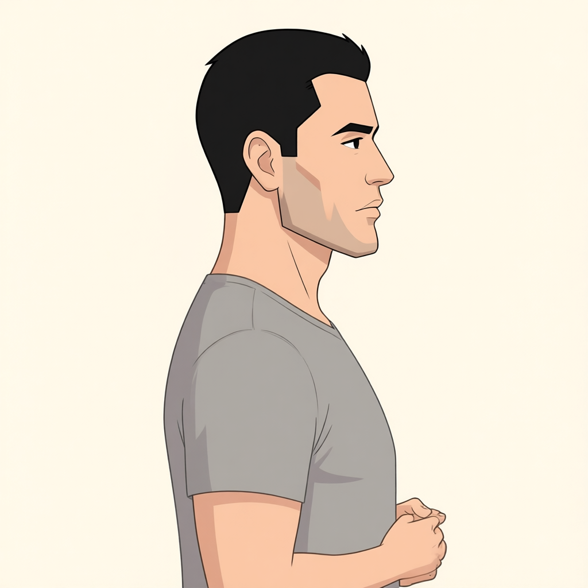
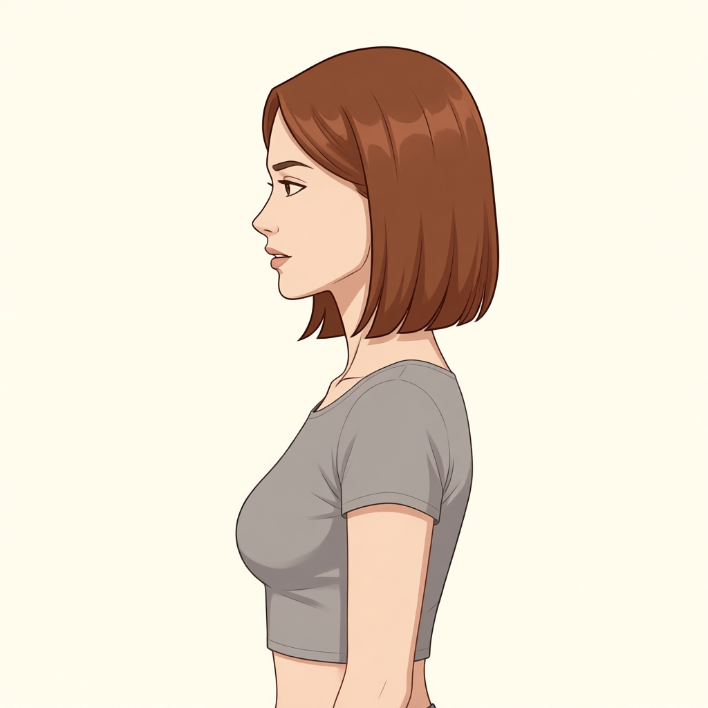
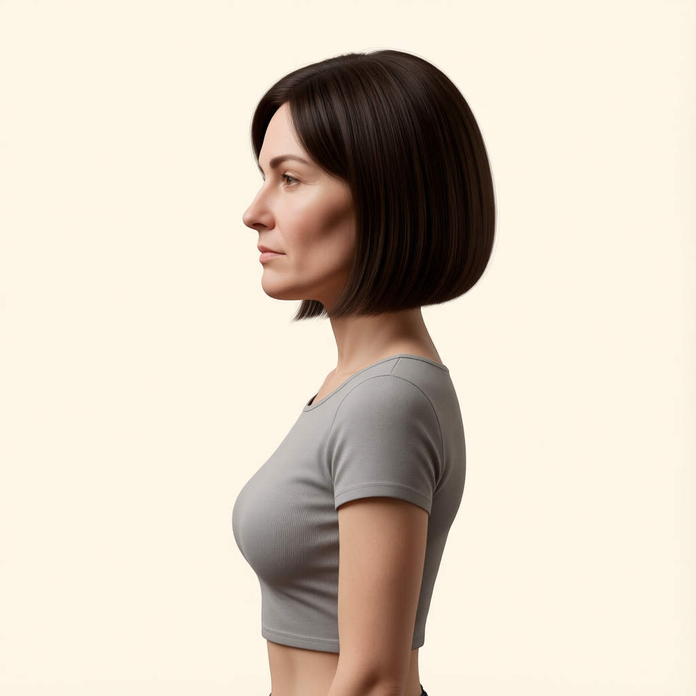
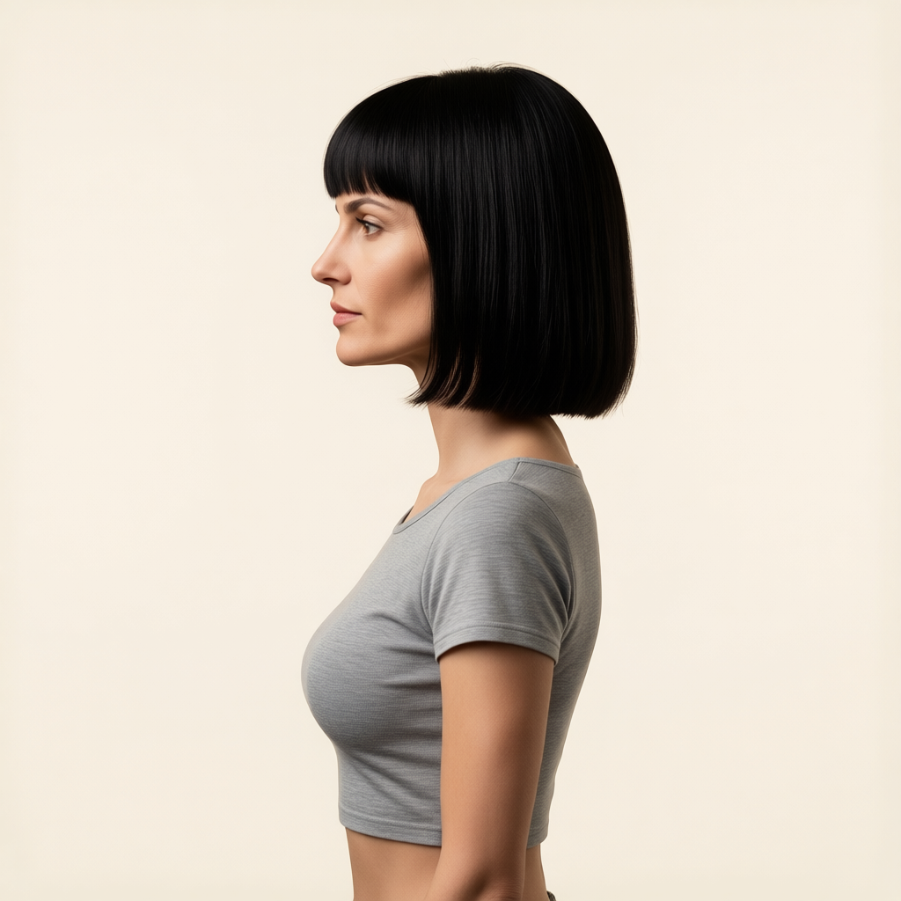

# P7-5.10 얼굴 비율 보강 후보 24개 비교표

수평 좌우 90도에서 생성한 첫 24개 입력 후보와 대응하는 Mira 목표를 비교한다. 생성·파일 해시 확인은 완료했다. 사용자는 24개에 특이사항이 없다고 판단했으며, 추가 크로스체크에서는 아래 재검토 사항을 확인했다. 이후 사용자가 **입력 24개를 모두 활용하고 각 입력에 맞는 Mira 목표를 추가 생성**하기로 결정했다. 아래 차이는 입력 폐기 사유가 아니라 새 목표에서 보존할 입력 조건으로 관리한다. 이후 생성되는 156개는 이 표에 포함하지 않는다.

학습 방향은 **생성 입력 → Mira 목표**다. 아래 표의 Mira 열은 최초 비교에 사용한 5.2 기준 이미지이며, 새로 생성할 최종 목표와 구분한다. 목표를 참조해 다른 얼굴·화풍의 입력을 만든 역방향 생성 결과이며, 아래 목표 이미지는 기존 5.2 자산을 연결해 재사용한다.

확인할 사항: 입력의 얼굴 길이·폭·턱선이 목표와 충분히 달라졌는지, 머리 방향·표정·시선·구도·포즈·의상·배경 구조가 유지됐는지 비교한다. 얼굴 윤곽과 헤어 실루엣은 변경 대상이다. 방향 라벨은 생성 조건이며 실제 각도를 측정한 값이 아니다.

[생성 조건 JSON](p7-5-10-bfs-proportion-input-pool-v1.json)

[후보 카탈로그 JSON](input-images/proportion-v1/candidate-catalog.json)

카탈로그는 후속 생성에 따라 늘어나지만 이 표의 관리번호 `P710-PROP-001`–`024`는 고정한다. 이미지를 클릭하면 확대해 볼 수 있다.

## 사용자 결정과 새 목표 생성

입력 `P710-PROP-001`–`024`는 사용자 채택 상태다. 새 목표는 같은 번호의 `P710-TGT-001`–`024`로 연결한다. 생성 목록의 `training_input`·`training_input_sha256`이 채택된 입력을 가리킨다.

[입력에 맞춘 Mira 목표 생성 조건 JSON](p7-5-10-mira-matched-targets-v1.json)

첫 번째 참조는 실제 입력이며 카메라·포즈·표정·의상·배경을 제공한다. 두 번째 참조는 같은 방향의 5.2 Mira 이미지이며 얼굴 비율·헤어·화풍을 제공한다. 예를 들어 012의 새 목표는 두 손을 모은 동작을 유지하고, 입 벌림이나 긴 상의가 있는 입력도 그 조건에 맞는 Mira 목표를 만든다.

새 목표 저장 위치는 `target-images/proportion-matched-v1/`다. 현재 156개 입력 생성이 사용하는 GPU가 비면 목표 24개 생성을 시작한다. 최종 학습 쌍은 새 목표의 Mira 정체성과 입력 조건 보존을 확인한 뒤 구성하며, 기존 193쌍과 함께 [통합 217개 데이터셋](p7-5-10-paired-dataset.json)에서 관리한다. 새 목표 생성·검수 전에는 학습 준비를 통과하지 못한다.

## 크로스체크 결과

24개 전체를 동일한 512px 표시 크기의 입력·목표 비교로 확인하고, 입 주변이 의심되는 7개(003·004·008·010·014·018·023)는 원본 해상도에서 얼굴 영역을 추가 확인했다. 파일 무결성 검사는 시각적 적합성 판정과 별개다. 아래 내용은 정성 검수이며 얼굴 비율의 수치 변화나 학습 효과를 검증한 결과가 아니다.

| 관리번호 (`P710-PROP-` 접두어) | 확인 사항 | 검수 의견 |
| --- | --- | --- |
| **012** | 목표의 내려둔 팔과 달리 팔을 굽혀 몸 앞에서 두 손을 모은 동작이 나타난다. | 명확한 포즈 변경. 기존 포즈 보존 기준에 맞지 않아 재검토가 필요하다. |
| **003·004·008·010** | 목표보다 입이 벌어지고 치아 또는 입 안의 흰 영역이 드러난다. 003·008은 미소 인상도 강해진다. | 얼굴 구조 변경과 별개로 표정·입 벌림 보존을 재검토한다. |
| **014·018·023** | 목표의 미세한 입술 틈에 비해 입 벌림 또는 치아 노출이 커 보인다. | 앞 항목보다 판단 여지가 있으나, 입 벌림 보존을 엄격하게 적용하면 추가 확인이 필요하다. |
| **007·009·011·020·021·023** | 목표에서 보이는 짧은 상의 밑단·복부 노출이 사라지고, 긴 티셔츠처럼 보이는 형태로 바뀐다. 어깨·가슴·몸통 외곽도 변한다. | 얼굴·헤어 이외의 의상 길이·몸 형태 변화다. 성별에 따른 외형 차이만으로 포즈 변경을 단정하지 않되, 의상·몸 크기 보존 기준과 대조한다. |

012에서도 의상·몸통 변화가 함께 보인다. 위 번호의 합집합은 13개이며, 나머지 **001·002·005·006·013·015·016·017·019·022·024**에서는 이번 비교 해상도에서 명확한 추가 포즈·객체 손실 문제를 지목하지 않았다. 이는 픽셀 단위 일치나 최종 학습 적합성을 보증하지 않는다.

좌우 방향과 단색 배경은 대체로 유지된다. 배경 색조·질감 변화는 있지만 사물의 추가·손실은 확인하지 못했다. 다만 원래 배경에 사물이 없어 복잡한 장면의 배경 보존을 평가한 것은 아니다. 얼굴·헤어·화풍 차이는 나타나지만, 요청한 긴 얼굴·넓은 얼굴·각진 턱의 구분 강도와 짧은 머리 지시의 이행 정도는 일정하지 않다. 이는 후보의 다양성과 쌍 보존 문제를 나누어 판단할 사항이다.

## 수평 −90도

| 관리번호 · 생성 조건 | 생성 입력 후보 | Mira 목표 |
| --- | --- | --- |
| P710-PROP-001 여성·긴 얼굴 · 사진풍 [생성 기록](input-images/proportion-v1/bfs-proportion-torso-level-minus-90-woman-long-photo-result.json) |  |  |
| P710-PROP-002 여성·긴 얼굴 · 일러스트 [생성 기록](input-images/proportion-v1/bfs-proportion-torso-level-minus-90-woman-long-illustration-result.json) |  |  |
| P710-PROP-003 여성·짧고 넓은 얼굴 · 사진풍 [생성 기록](input-images/proportion-v1/bfs-proportion-torso-level-minus-90-woman-wide-photo-result.json) |  |  |
| P710-PROP-004 여성·짧고 넓은 얼굴 · 일러스트 [생성 기록](input-images/proportion-v1/bfs-proportion-torso-level-minus-90-woman-wide-illustration-result.json) |  |  |
| P710-PROP-005 여성·각진 턱 · 사진풍 [생성 기록](input-images/proportion-v1/bfs-proportion-torso-level-minus-90-woman-square-photo-result.json) |  |  |
| P710-PROP-006 여성·각진 턱 · 일러스트 [생성 기록](input-images/proportion-v1/bfs-proportion-torso-level-minus-90-woman-square-illustration-result.json) |  |  |
| P710-PROP-007 남성·긴 얼굴 · 사진풍 [생성 기록](input-images/proportion-v1/bfs-proportion-torso-level-minus-90-man-long-photo-result.json) |  |  |
| P710-PROP-008 남성·긴 얼굴 · 일러스트 [생성 기록](input-images/proportion-v1/bfs-proportion-torso-level-minus-90-man-long-illustration-result.json) |  |  |
| P710-PROP-009 남성·짧고 넓은 얼굴 · 사진풍 [생성 기록](input-images/proportion-v1/bfs-proportion-torso-level-minus-90-man-wide-photo-result.json) |  |  |
| P710-PROP-010 남성·짧고 넓은 얼굴 · 일러스트 [생성 기록](input-images/proportion-v1/bfs-proportion-torso-level-minus-90-man-wide-illustration-result.json) |  |  |
| P710-PROP-011 남성·각진 턱 · 사진풍 [생성 기록](input-images/proportion-v1/bfs-proportion-torso-level-minus-90-man-square-photo-result.json) |  |  |
| P710-PROP-012 남성·각진 턱 · 일러스트 [생성 기록](input-images/proportion-v1/bfs-proportion-torso-level-minus-90-man-square-illustration-result.json) |  |  |

## 수평 +90도

| 관리번호 · 생성 조건 | 생성 입력 후보 | Mira 목표 |
| --- | --- | --- |
| P710-PROP-013 여성·긴 얼굴 · 사진풍 [생성 기록](input-images/proportion-v1/bfs-proportion-torso-level-plus-90-woman-long-photo-result.json) |  |  |
| P710-PROP-014 여성·긴 얼굴 · 일러스트 [생성 기록](input-images/proportion-v1/bfs-proportion-torso-level-plus-90-woman-long-illustration-result.json) |  |  |
| P710-PROP-015 여성·짧고 넓은 얼굴 · 사진풍 [생성 기록](input-images/proportion-v1/bfs-proportion-torso-level-plus-90-woman-wide-photo-result.json) |  |  |
| P710-PROP-016 여성·짧고 넓은 얼굴 · 일러스트 [생성 기록](input-images/proportion-v1/bfs-proportion-torso-level-plus-90-woman-wide-illustration-result.json) |  |  |
| P710-PROP-017 여성·각진 턱 · 사진풍 [생성 기록](input-images/proportion-v1/bfs-proportion-torso-level-plus-90-woman-square-photo-result.json) |  |  |
| P710-PROP-018 여성·각진 턱 · 일러스트 [생성 기록](input-images/proportion-v1/bfs-proportion-torso-level-plus-90-woman-square-illustration-result.json) |  |  |
| P710-PROP-019 남성·긴 얼굴 · 사진풍 [생성 기록](input-images/proportion-v1/bfs-proportion-torso-level-plus-90-man-long-photo-result.json) |  |  |
| P710-PROP-020 남성·긴 얼굴 · 일러스트 [생성 기록](input-images/proportion-v1/bfs-proportion-torso-level-plus-90-man-long-illustration-result.json) |  |  |
| P710-PROP-021 남성·짧고 넓은 얼굴 · 사진풍 [생성 기록](input-images/proportion-v1/bfs-proportion-torso-level-plus-90-man-wide-photo-result.json) |  |  |
| P710-PROP-022 남성·짧고 넓은 얼굴 · 일러스트 [생성 기록](input-images/proportion-v1/bfs-proportion-torso-level-plus-90-man-wide-illustration-result.json) |  |  |
| P710-PROP-023 남성·각진 턱 · 사진풍 [생성 기록](input-images/proportion-v1/bfs-proportion-torso-level-plus-90-man-square-photo-result.json) |  |  |
| P710-PROP-024 남성·각진 턱 · 일러스트 [생성 기록](input-images/proportion-v1/bfs-proportion-torso-level-plus-90-man-square-illustration-result.json) |  |  |
