# P7-5.10 외부 평가 입력 45장

Codex 내장 ImageGen으로 생성한 가상 남성·여성·유아 각 1명의 상반신 이미지다. 인물별 세로 3단계 × 가로 5단계로 15장씩, 총 45장을 구성한다. 배경·포즈·표정은 생성 조건에 포함했다.

- 최종 입력: `*-512.png`, 512×512 PNG.
- 개별 생성 기록: 이미지와 같은 이름의 `*-512.json` 45개. 인물·앵글·프롬프트·최종 경로·해상도·해시·축소 조건을 기록한다. 경로는 이 디렉터리를 기준으로 해석하며 `source`는 최초 생성 위치의 이력이다.
- 생성 원본 파일은 사용자 요청으로 삭제했다. 원본 해상도·해시와 최초 생성 위치는 이력으로만 남긴다. 최종 이미지는 정사각형 원본 전체를 LANCZOS 축소했으며 추가 크롭은 하지 않았다.
- [전체 생성 프롬프트·앵글·파일 해시](generation-manifest.json)
- 세로: 로우(`low`)·눈높이(`level`)·엘리베이티드(`elevated`).
- 가로: −90°·−45°·0°·+45°·+90°. 기존 [15방향 생성기의 분류](../../sec-02/p7_5_2_qwen_edit_2511_generate_mira_torso_multiview.py)를 따른다.

각도는 생성 요청의 범주이며 측정한 카메라 좌표가 아니다. 인물별 외형 설명을 반복했지만 정확한 동일인이나 3D 회전을 보장하지 않는다. 배경 세부·포즈·표정도 달라지므로 앵글만을 독립 변수로 둔 통제 실험 자료는 아니다. 현재 366쌍 학습·검증 데이터셋과 별도로 사용하는 외부 합성 입력이다. 1600·누적 3200스텝의 강도 1.0 결과와, 이 중 12개 입력의 강도 비교를 완료했다. [평가 결과 검수 요약](../bfs-camera-366-review.md)에서 결과를 확인한다.

## 저장 위치와 생성 이력

현재 관리 위치는 `sec-10/codex-camera-inputs-v1/`이다. 2026-09-20에 이미지 45장과 개별 생성 기록 45개, 생성 목록을 `sec-12`에서 옮겼다. 이미지·JSON의 내용과 해시는 유지했다. JSON의 `section_id: P7-5.12`와 `P712-CAM-*` 관리번호는 최초 생성·실험의 식별자이며 현재 원고의 소속은 P7-5.10이다.

과거 평가 계획과 결과 기록의 경로·해시를 보존하기 위해 이전 위치에는 새 폴더를 가리키는 상대 심볼릭 링크만 남긴다. 새 평가에는 이 폴더의 `generation-manifest.json`을 `--input-manifest`로 지정한다.

## 남성 · 카페

| 로우 · -90° | 로우 · -45° | 로우 · +0° | 로우 · +45° | 로우 · +90° |
| --- | --- | --- | --- | --- |
|  |  |  |  |  |

| 눈높이 · -90° | 눈높이 · -45° | 눈높이 · +0° | 눈높이 · +45° | 눈높이 · +90° |
| --- | --- | --- | --- | --- |
| [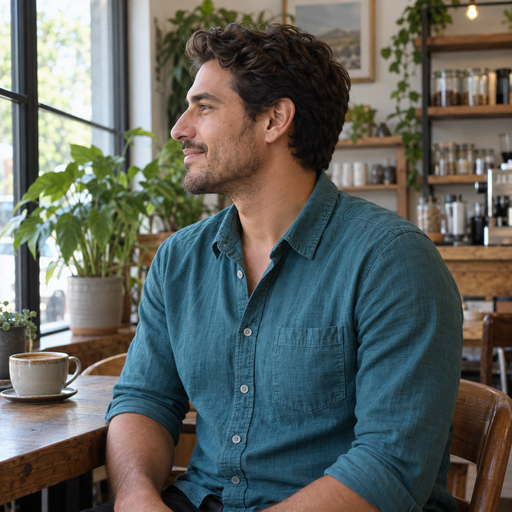](man-level-minus-90-512.png) |  |  |  |  |

| 엘리베이티드 · -90° | 엘리베이티드 · -45° | 엘리베이티드 · +0° | 엘리베이티드 · +45° | 엘리베이티드 · +90° |
| --- | --- | --- | --- | --- |
| [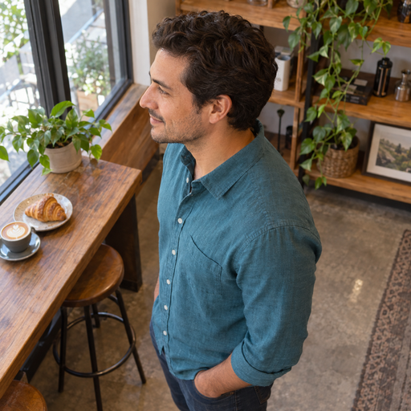](man-elevated-minus-90-512.png) | [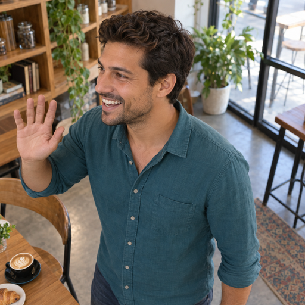](man-elevated-minus-45-512.png) | [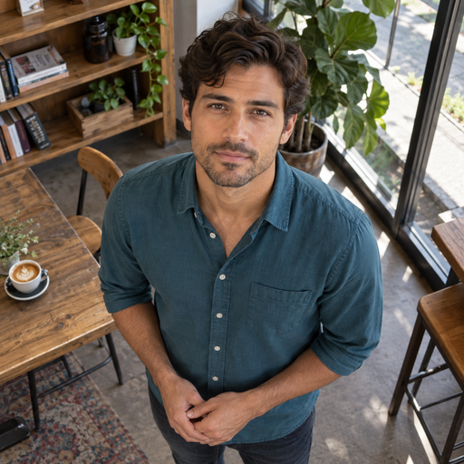](man-elevated-zero-512.png) |  |  |

## 여성 · 도서관

| 로우 · -90° | 로우 · -45° | 로우 · +0° | 로우 · +45° | 로우 · +90° |
| --- | --- | --- | --- | --- |
|  |  |  |  |  |

| 눈높이 · -90° | 눈높이 · -45° | 눈높이 · +0° | 눈높이 · +45° | 눈높이 · +90° |
| --- | --- | --- | --- | --- |
|  |  |  |  |  |

| 엘리베이티드 · -90° | 엘리베이티드 · -45° | 엘리베이티드 · +0° | 엘리베이티드 · +45° | 엘리베이티드 · +90° |
| --- | --- | --- | --- | --- |
| [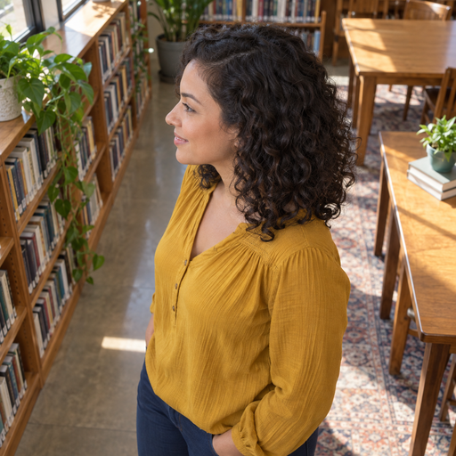](woman-elevated-minus-90-512.png) |  |  |  |  |

## 유아 · 놀이방

| 로우 · -90° | 로우 · -45° | 로우 · +0° | 로우 · +45° | 로우 · +90° |
| --- | --- | --- | --- | --- |
| [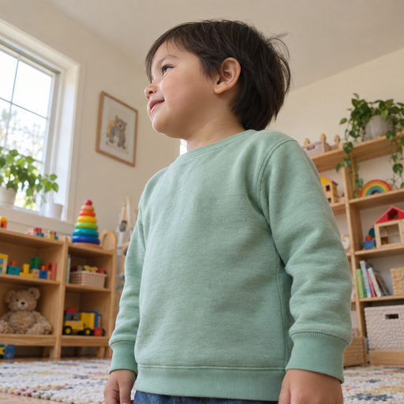](toddler-low-minus-90-512.png) |  | [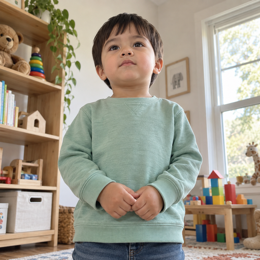](toddler-low-zero-512.png) | [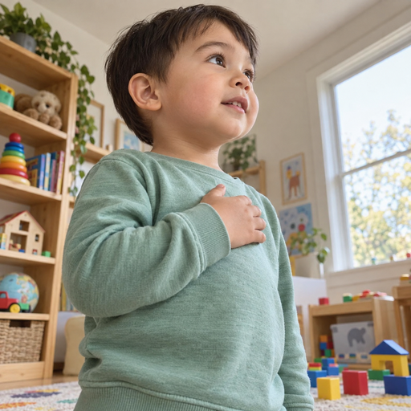](toddler-low-plus-45-512.png) |  |

| 눈높이 · -90° | 눈높이 · -45° | 눈높이 · +0° | 눈높이 · +45° | 눈높이 · +90° |
| --- | --- | --- | --- | --- |
| [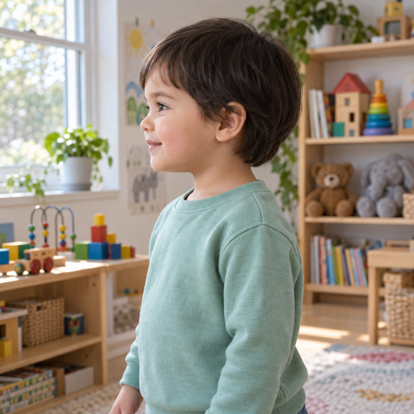](toddler-level-minus-90-512.png) | [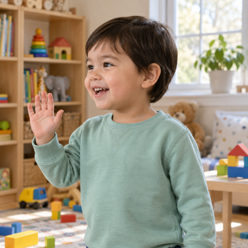](toddler-level-minus-45-512.png) | [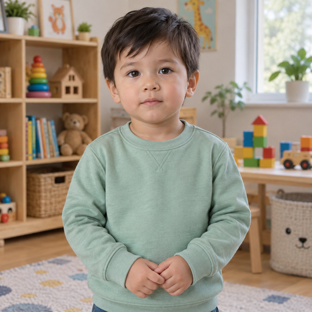](toddler-level-zero-512.png) | [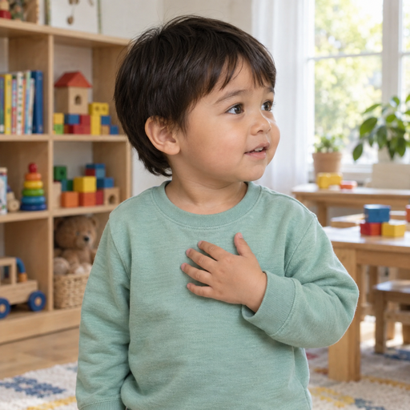](toddler-level-plus-45-512.png) | [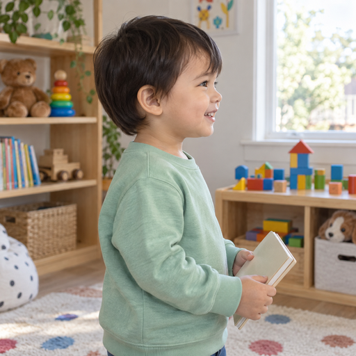](toddler-level-plus-90-512.png) |

| 엘리베이티드 · -90° | 엘리베이티드 · -45° | 엘리베이티드 · +0° | 엘리베이티드 · +45° | 엘리베이티드 · +90° |
| --- | --- | --- | --- | --- |
| [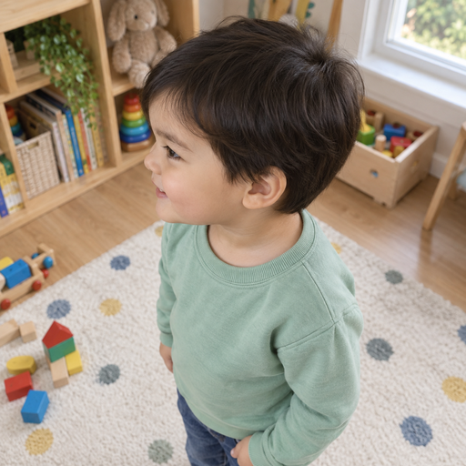](toddler-elevated-minus-90-512.png) | [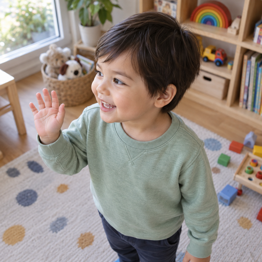](toddler-elevated-minus-45-512.png) | [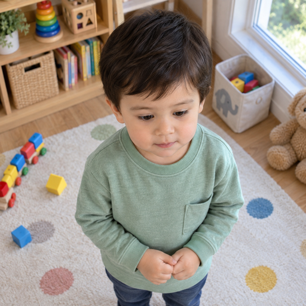](toddler-elevated-zero-512.png) | [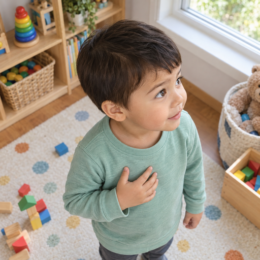](toddler-elevated-plus-45-512.png) | [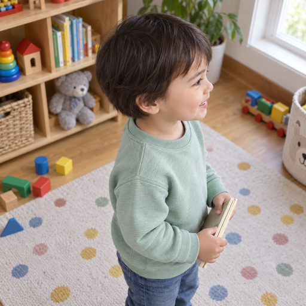](toddler-elevated-plus-90-512.png) |
