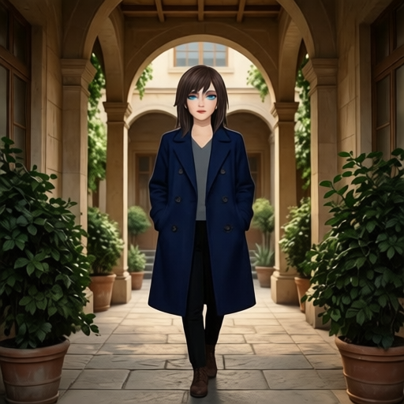
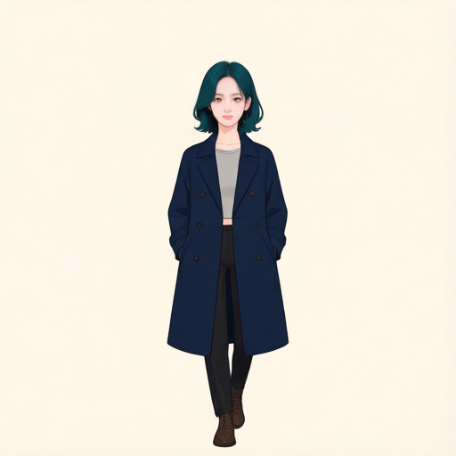

---
language:
- en
- ko
license: apache-2.0
base_model: Qwen/Qwen-Image-Edit-2511
base_model_relation: adapter
library_name: diffusers
pipeline_tag: image-to-image
tags:
- lora
- qwen-image-edit
- character
- image-editing
---
# Mira BFS LoRA for Qwen-Image-Edit-2511

An educational character-editing LoRA trained for AiBook section P7-5.12. The concept was inspired by [BFS Head V5](https://huggingface.co/mr2along/BFS). This adapter was trained anew on Qwen-Image-Edit-2511; BFS weights were not used as initialization.

The intended edit changes the input person's face and hair into Mira's identity (including a teal bob) and renders the whole image in the target illustration style. The input expression, head direction, pose, clothing design, framing, props and scene layout should remain. These preservation goals are not fully achieved; see limitations below.

## Download

```bash
hf download devchan64/mira-bfs-qwen-image-edit-2511-lora mira_bfs.safetensors --local-dir ./mira-bfs
```

Use the adapter with **Qwen/Qwen-Image-Edit-2511**. It is not a standalone model. The final checkpoint has 1600 optimizer steps, rank 16 and alpha 16. SHA-256 is recorded in `SHA256SUMS`.

## Apply with Diffusers

The example follows the tested Diffusers 0.37.0 pipeline. The process-local VAE reference size override is important: the default 1024 reference processing caused severe zoom/cropping in our initial 512-resolution evaluation. It is an internal API and should be checked before changing Diffusers versions. The vision-language condition retains its default 384 size.

```python
import torch
from PIL import Image
from diffusers import QwenImageEditPlusPipeline
from diffusers.pipelines.qwenimage import pipeline_qwenimage_edit_plus as pipeline_module

pipeline_module.VAE_IMAGE_SIZE = 512 ** 2
assert pipeline_module.CONDITION_IMAGE_SIZE == 384 ** 2
pipe = QwenImageEditPlusPipeline.from_pretrained(
    "Qwen/Qwen-Image-Edit-2511", torch_dtype=torch.bfloat16
)
pipe.load_lora_weights(
    "devchan64/mira-bfs-qwen-image-edit-2511-lora",
    weight_name="mira_bfs.safetensors", adapter_name="mira"
)
pipe.set_adapters("mira", adapter_weights=1.0)
pipe.enable_sequential_cpu_offload()
pipe.vae.enable_slicing()
image = Image.open("input.png").convert("RGB")
assert image.size == (512, 512), "Use a square 512x512 input for this evaluated setup"
prompt = (
    "Transform the woman into mira_person with Mira's facial identity and hairstyle, "
    "and render the entire image in Mira's target illustration style. "
    "Preserve the input facial expression, head direction, pose, clothing design, "
    "camera viewpoint, perspective, framing, subject position, apparent body scale, "
    "background objects and scene layout."
)
with torch.inference_mode():
    result = pipe(
        image=[image], prompt=prompt, negative_prompt=" ",
        width=512, height=512, num_inference_steps=20,
        true_cfg_scale=4.0, guidance_scale=1.0,
        generator=torch.Generator(device="cuda").manual_seed(62294),
    ).images[0]
result.save("mira-output.png")
```

Only the input image is passed to the model. Do not provide the target portrait as an additional reference to reproduce this evaluation. GPU inference and the base model are required. The full evaluated base model is large; downloading the adapter alone does not supply its dependencies.

## Training data and settings

Synthetic paired edits: 193 accepted input/target pairs, split into 174 training and 19 validation pairs. They use 41 unique Mira targets (37 training, 4 validation). Inputs were generated in five appearances/styles from existing Mira targets; training reverses that generation direction. Variants of the same target remain in the same split. The extra 123 target candidates are not in this training set.

Training used Musubi Tuner commit `e0cbd8f3dfe38365b10f8bc790b980f8894e8ba1`, resolution/control resolution 512, batch size 1, rank/alpha 16, learning rate 1e-4, 1600 steps, seed 62294, FP8 base/scaled processing and 55 swapped blocks. No optimizer/resume state or base-model weights are distributed here. Training settings are in `training-settings.json`.

## Evaluation and limitations

All 19 held-out inputs were generated with and without the final adapter (38 outputs): seed 62294, 20 inference steps, CFG 4.0, strength 1.0, 512 output and 512 VAE reference processing. Visual inspection found Mira facial/hair features and target illustration styling. Educational end-to-end training and application goals were met.

However, all five corridor variants lost substantial plants or architecture; two became nearly blank backgrounds. Mouth opening often decreased and clothing details sometimes changed. This is not a general-purpose identity or scene-preservation guarantee. The 19 validation pairs derive from only four target scenes and do not establish external-scene generalization. Only one seed, final step and adapter strength were evaluated here; 1600 is not a proven optimal training duration.

Representative gallery and corridor examples below include both a stronger preservation case and a clear background-loss case. Targets are comparison-only.

| Input | No LoRA | LoRA 1600 | Target (comparison only) |
| --- | --- | --- | --- |
|  |  |  |  |
|  |  |  |  |

## Sources and license

- [AiBook repository](https://github.com/devchan64/AiBook), P7-5.12 (Korean manuscript, dataset construction and detailed review).
- [Qwen-Image-Edit-2511](https://huggingface.co/Qwen/Qwen-Image-Edit-2511), base model (model card declares Apache-2.0).
- [Musubi Tuner](https://github.com/kohya-ss/musubi-tuner), trainer.
- [BFS](https://huggingface.co/mr2along/BFS), concept inspiration.

This release is distributed under Apache-2.0. See LICENSE. No affiliation with or endorsement by Qwen or the BFS authors is implied.
