# P7-5.12 입력 후보 비교표

검수 기록 기준일: 2026-09-15

남은 입력 후보 **193개**를 Mira 목표와 비교한다. 최초 생성 조건 220개 중 사용자 확정 폐기는 **27개(방향 3·배경 5·표정 19)**다. 기존 AI 검수 상태는 실험용 채택 2개·확대 검수 보류 191개이며, 이번 폐기가 나머지 전체에 대한 추가 검수 완료를 뜻하지 않는다.

현재 목표는 얼굴·헤어를 Mira 아이덴티로, 전체 화풍을 Mira 목표 화풍으로 변환하면서 **입력 표정과 구도·포즈, 배경의 사물·배치를 보존**하는 것이다.

관리번호 `P711-IN-NNN`은 원래 생성 순번에 고정한다. 폐기 후에도 번호를 당겨 쓰거나 재사용하지 않는다.

[검수 목록 JSON](p7-5-11-input-review-v1.json)

[후보 카탈로그 JSON](input-images/candidate-catalog.json)

## 목표별 비교

구도·몸 자세·얼굴 방향·표정·의상·배경 요소를 구분해 확인한다. 체형이나 화풍 차이만으로 포즈 변화라고 단정하지 않는다. 이미지를 클릭하면 원본을 볼 수 있다.

## target-01

| 관리번호 · 입력 ID | Mira 목표 | 생성 입력 후보 | 현재 검수 의견 |
| --- | --- | --- | --- |
| **P711-IN-001** bfs-input-01-soft-photo |  |  | **확대 검수 보류** 정면 얼굴에서 입력별 얼굴·헤어·표현 방식은 달라졌다. 사진풍의 의상 추가와 목·어깨 범위, 입력별 입 벌림을 추가 확인한다. |
| **P711-IN-045** bfs-input-01-watercolor |  | [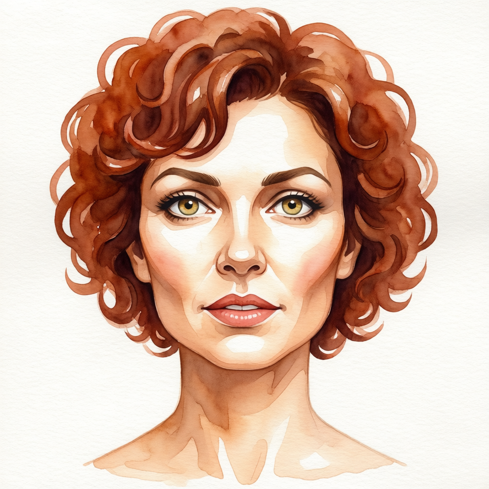](input-images/bfs-input-01-watercolor.png) | **확대 검수 보류** 정면 얼굴에서 입력별 얼굴·헤어·표현 방식은 달라졌다. 사진풍의 의상 추가와 목·어깨 범위, 입력별 입 벌림을 추가 확인한다. |
| **P711-IN-089** bfs-input-01-clay-render |  | [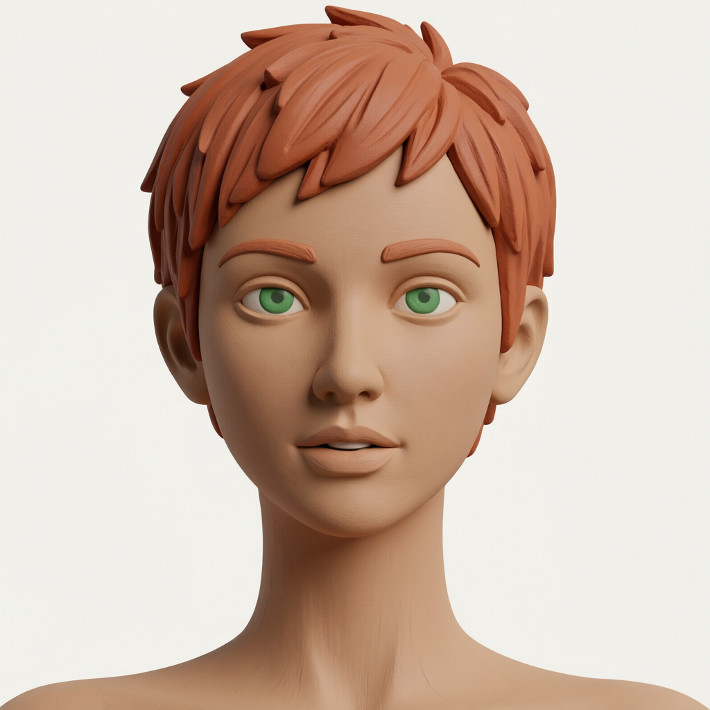](input-images/bfs-input-01-clay-render.png) | **확대 검수 보류** 정면 얼굴에서 입력별 얼굴·헤어·표현 방식은 달라졌다. 사진풍의 의상 추가와 목·어깨 범위, 입력별 입 벌림을 추가 확인한다. |
| **P711-IN-133** bfs-input-01-ink-illustration |  | [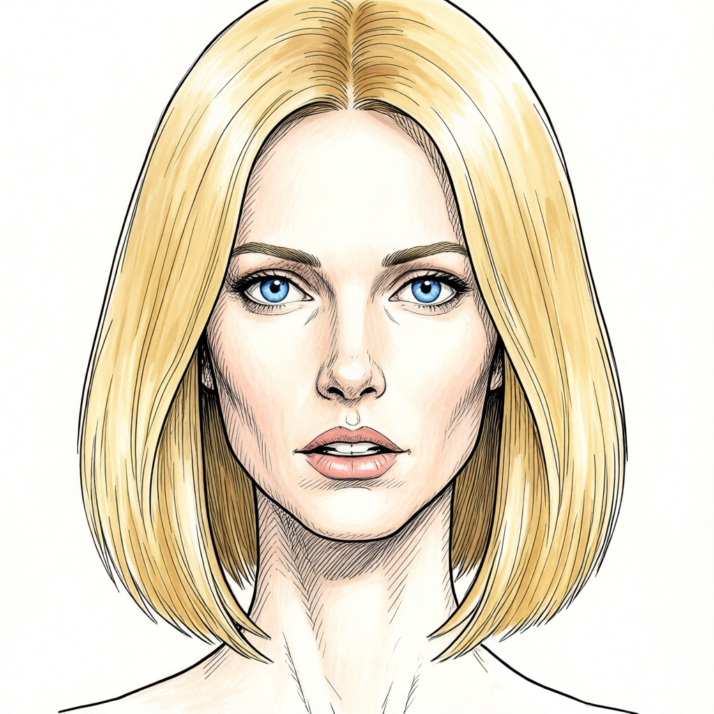](input-images/bfs-input-01-ink-illustration.png) | **확대 검수 보류** 정면 얼굴에서 입력별 얼굴·헤어·표현 방식은 달라졌다. 사진풍의 의상 추가와 목·어깨 범위, 입력별 입 벌림을 추가 확인한다. |

## target-02

| 관리번호 · 입력 ID | Mira 목표 | 생성 입력 후보 | 현재 검수 의견 |
| --- | --- | --- | --- |
| **P711-IN-002** bfs-input-02-watercolor |  |  | **확대 검수 보류** 정면 회색 상의와 배치는 이어지나 상체 굴곡·몸 비례가 입력마다 달라진다. |
| **P711-IN-046** bfs-input-02-clay-render |  | [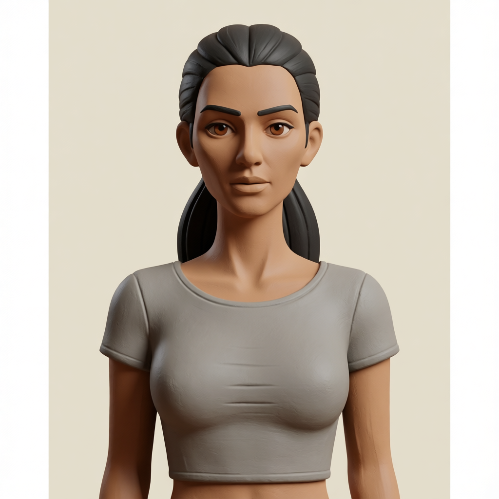](input-images/bfs-input-02-clay-render.png) | **확대 검수 보류** 정면 회색 상의와 배치는 이어지나 상체 굴곡·몸 비례가 입력마다 달라진다. |
| **P711-IN-090** bfs-input-02-ink-illustration |  |  | **확대 검수 보류** 정면 회색 상의와 배치는 이어지나 상체 굴곡·몸 비례가 입력마다 달라진다. |
| **P711-IN-134** bfs-input-02-oil-painting |  | [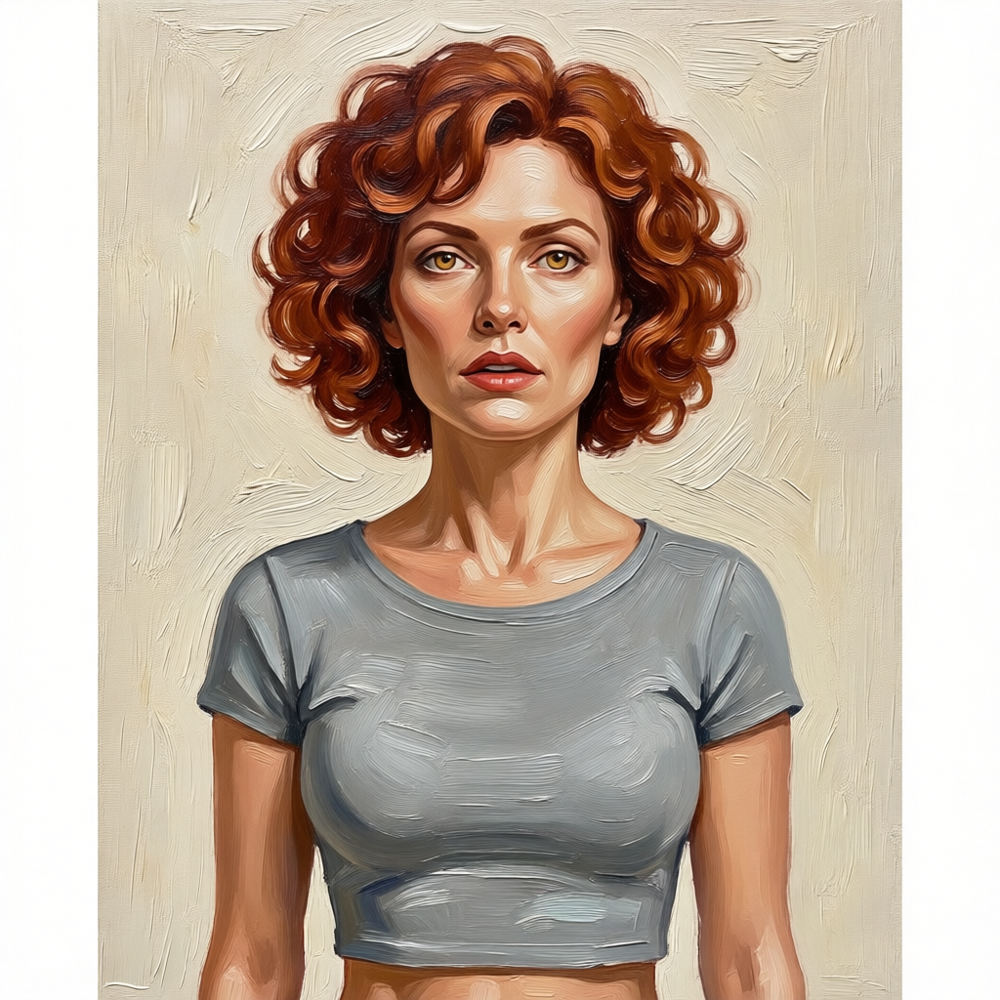](input-images/bfs-input-02-oil-painting.png) | **확대 검수 보류** 정면 회색 상의와 배치는 이어지나 상체 굴곡·몸 비례가 입력마다 달라진다. |
| **P711-IN-178** bfs-input-02-soft-photo |  |  | **확대 검수 보류** 정면 회색 상의와 배치는 이어지나 상체 굴곡·몸 비례가 입력마다 달라진다. |

## target-03

| 관리번호 · 입력 ID | Mira 목표 | 생성 입력 후보 | 현재 검수 의견 |
| --- | --- | --- | --- |
| **P711-IN-003** bfs-input-03-clay-render |  |  | **확대 검수 보류** 로우앵글 사선과 회색 크롭 상의·바지 배치는 대체로 이어진다. 입 벌림과 허리·가슴 비례는 확대 검수가 필요하다. |
| **P711-IN-047** bfs-input-03-ink-illustration |  |  | **확대 검수 보류** 로우앵글 사선과 회색 크롭 상의·바지 배치는 대체로 이어진다. 입 벌림과 허리·가슴 비례는 확대 검수가 필요하다. |
| **P711-IN-091** bfs-input-03-oil-painting |  |  | **확대 검수 보류** 로우앵글 사선과 회색 크롭 상의·바지 배치는 대체로 이어진다. 입 벌림과 허리·가슴 비례는 확대 검수가 필요하다. |
| **P711-IN-135** bfs-input-03-soft-photo |  | [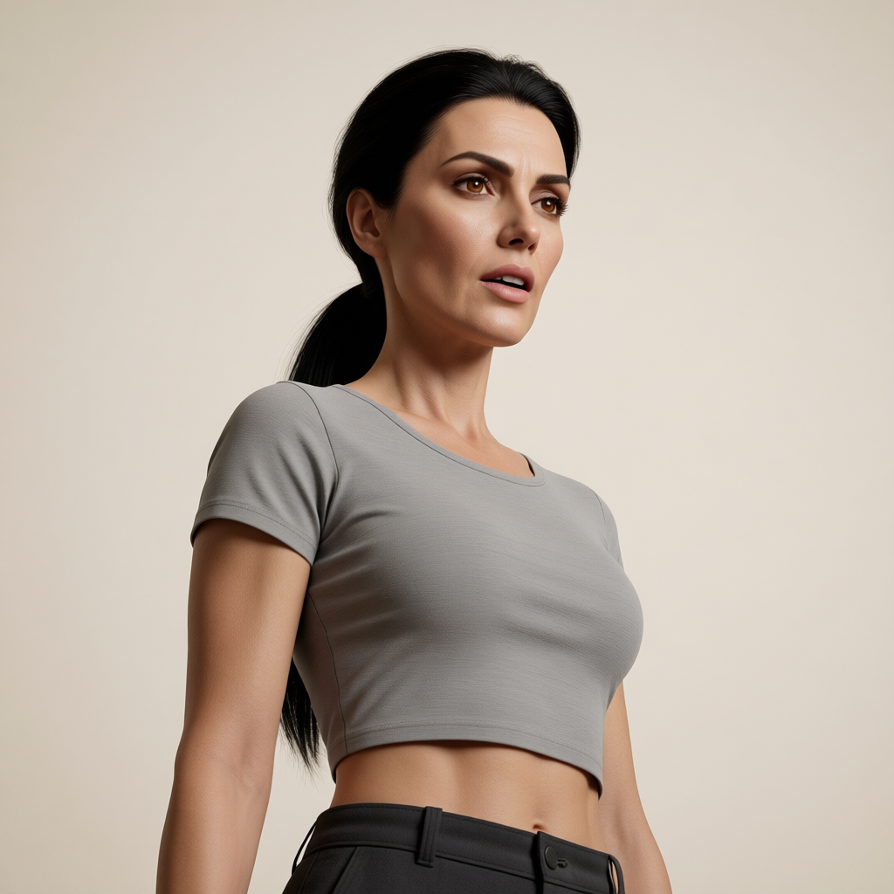](input-images/bfs-input-03-soft-photo.png) | **확대 검수 보류** 로우앵글 사선과 회색 크롭 상의·바지 배치는 대체로 이어진다. 입 벌림과 허리·가슴 비례는 확대 검수가 필요하다. |
| **P711-IN-179** bfs-input-03-watercolor |  |  | **확대 검수 보류** 로우앵글 사선과 회색 크롭 상의·바지 배치는 대체로 이어진다. 입 벌림과 허리·가슴 비례는 확대 검수가 필요하다. |

## target-04

| 관리번호 · 입력 ID | Mira 목표 | 생성 입력 후보 | 현재 검수 의견 |
| --- | --- | --- | --- |
| **P711-IN-004** bfs-input-04-ink-illustration |  | [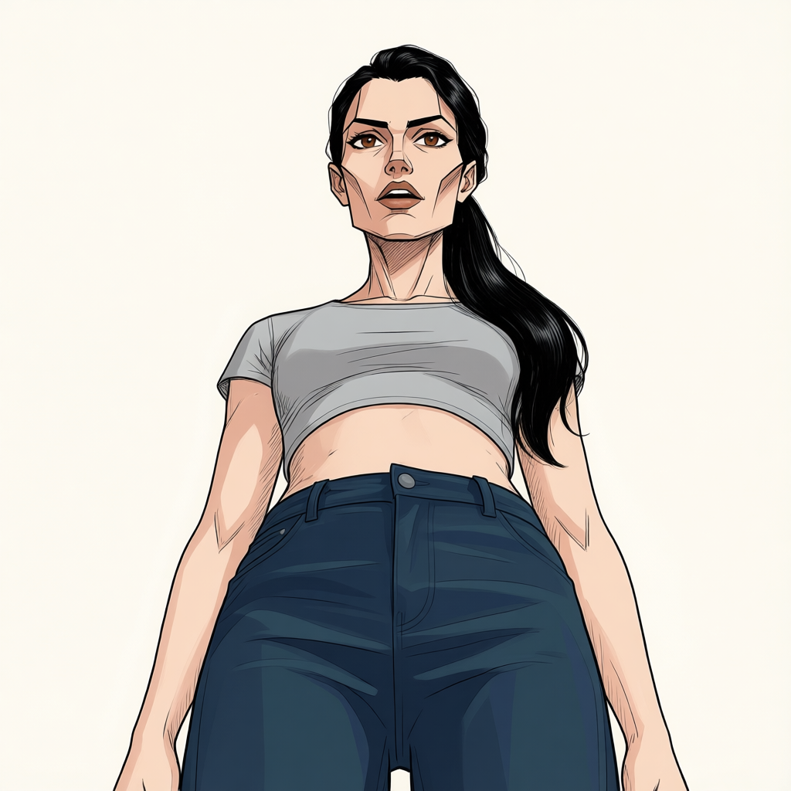](input-images/bfs-input-04-ink-illustration.png) | **확대 검수 보류** 올려다보는 방향은 이어지지만 여러 입력에서 원래보다 입을 크게 벌렸다. |

## target-05

| 관리번호 · 입력 ID | Mira 목표 | 생성 입력 후보 | 현재 검수 의견 |
| --- | --- | --- | --- |
| **P711-IN-005** bfs-input-05-oil-painting |  |  | **확대 검수 보류** 낮은 사선 방향과 회색 크롭 상의는 이어진다. 목·가슴·허리 비례와 화풍별 입 벌림을 확인한다. |
| **P711-IN-049** bfs-input-05-soft-photo |  |  | **확대 검수 보류** 낮은 사선 방향과 회색 크롭 상의는 이어진다. 목·가슴·허리 비례와 화풍별 입 벌림을 확인한다. |
| **P711-IN-093** bfs-input-05-watercolor |  |  | **확대 검수 보류** 낮은 사선 방향과 회색 크롭 상의는 이어진다. 목·가슴·허리 비례와 화풍별 입 벌림을 확인한다. |
| **P711-IN-137** bfs-input-05-clay-render |  |  | **확대 검수 보류** 낮은 사선 방향과 회색 크롭 상의는 이어진다. 목·가슴·허리 비례와 화풍별 입 벌림을 확인한다. |
| **P711-IN-181** bfs-input-05-ink-illustration |  |  | **확대 검수 보류** 낮은 사선 방향과 회색 크롭 상의는 이어진다. 목·가슴·허리 비례와 화풍별 입 벌림을 확인한다. |

## target-06

| 관리번호 · 입력 ID | Mira 목표 | 생성 입력 후보 | 현재 검수 의견 |
| --- | --- | --- | --- |
| **P711-IN-006** bfs-input-06-soft-photo |  |  | **확대 검수 보류** 측면 방향은 대체로 이어진다. 얼굴 회전량과 상체 두께 변화의 허용 범위를 확인한다. |
| **P711-IN-050** bfs-input-06-watercolor |  | [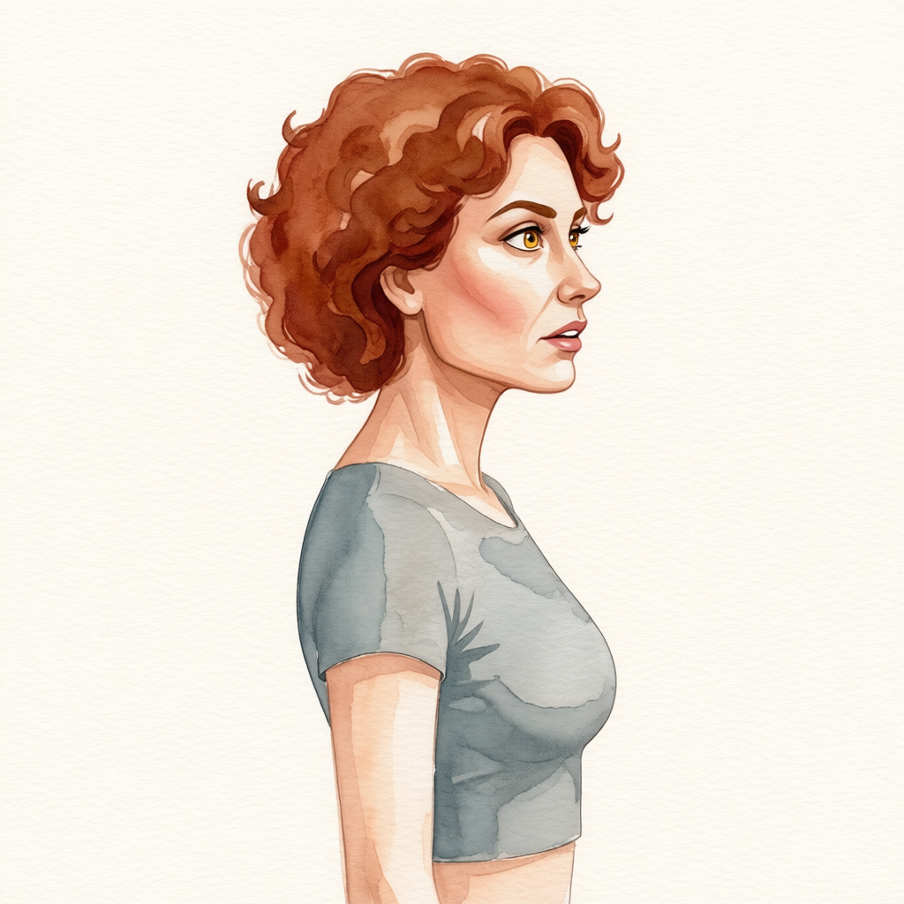](input-images/bfs-input-06-watercolor.png) | **확대 검수 보류** 측면 방향은 대체로 이어진다. 얼굴 회전량과 상체 두께 변화의 허용 범위를 확인한다. |
| **P711-IN-094** bfs-input-06-clay-render |  |  | **확대 검수 보류** 측면 방향은 대체로 이어진다. 얼굴 회전량과 상체 두께 변화의 허용 범위를 확인한다. |
| **P711-IN-138** bfs-input-06-ink-illustration |  |  | **확대 검수 보류** 측면 방향은 대체로 이어진다. 얼굴 회전량과 상체 두께 변화의 허용 범위를 확인한다. |
| **P711-IN-182** bfs-input-06-oil-painting |  |  | **확대 검수 보류** 측면 방향은 대체로 이어진다. 얼굴 회전량과 상체 두께 변화의 허용 범위를 확인한다. |

## target-07

| 관리번호 · 입력 ID | Mira 목표 | 생성 입력 후보 | 현재 검수 의견 |
| --- | --- | --- | --- |
| **P711-IN-007** bfs-input-07-watercolor |  | [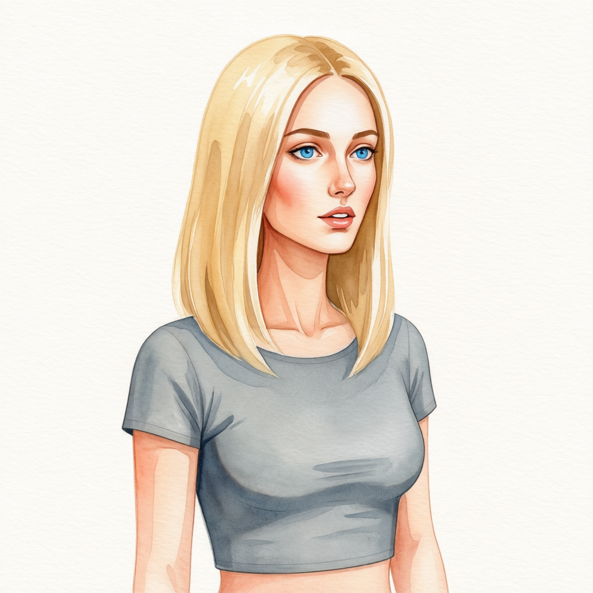](input-images/bfs-input-07-watercolor.png) | **확대 검수 보류** 사선 상반신과 회색 상의가 이어진다. 몸 굴곡과 입 벌림에 변화가 있다. |
| **P711-IN-051** bfs-input-07-clay-render |  | [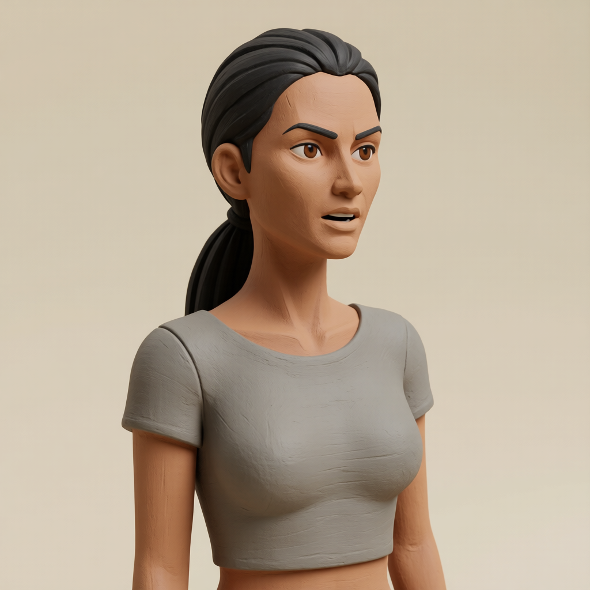](input-images/bfs-input-07-clay-render.png) | **확대 검수 보류** 사선 상반신과 회색 상의가 이어진다. 몸 굴곡과 입 벌림에 변화가 있다. |
| **P711-IN-095** bfs-input-07-ink-illustration |  |  | **확대 검수 보류** 사선 상반신과 회색 상의가 이어진다. 몸 굴곡과 입 벌림에 변화가 있다. |
| **P711-IN-139** bfs-input-07-oil-painting |  | [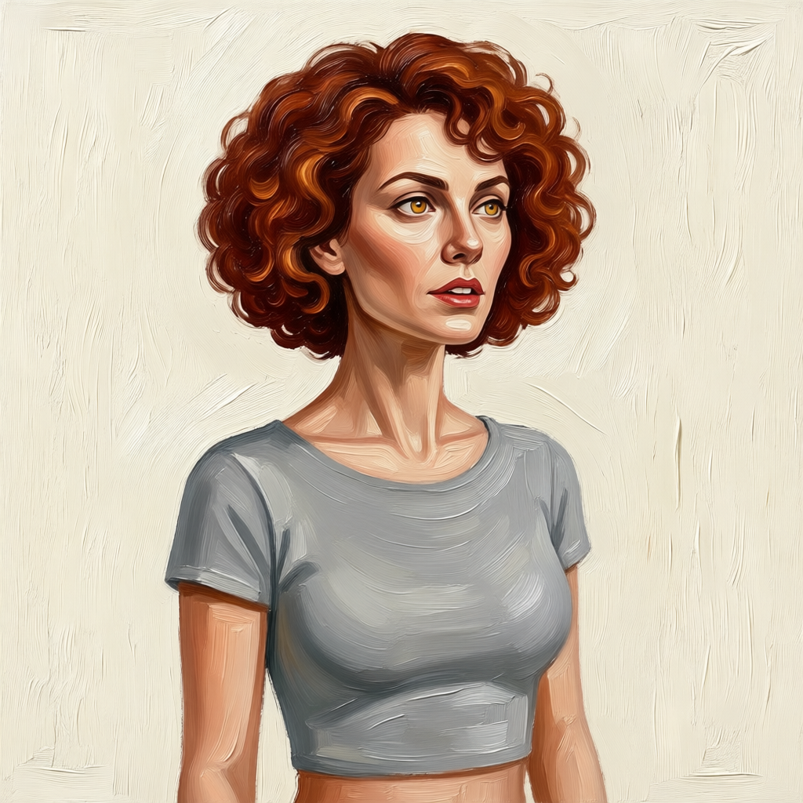](input-images/bfs-input-07-oil-painting.png) | **확대 검수 보류** 사선 상반신과 회색 상의가 이어진다. 몸 굴곡과 입 벌림에 변화가 있다. |
| **P711-IN-183** bfs-input-07-soft-photo |  |  | **확대 검수 보류** 사선 상반신과 회색 상의가 이어진다. 몸 굴곡과 입 벌림에 변화가 있다. |

## target-08

| 관리번호 · 입력 ID | Mira 목표 | 생성 입력 후보 | 현재 검수 의견 |
| --- | --- | --- | --- |
| **P711-IN-008** bfs-input-08-clay-render |  |  | **확대 검수 보류** 사선 방향은 이어지나 상의 밑단·노출되는 허리와 상체 비례가 달라 보인다. |
| **P711-IN-052** bfs-input-08-ink-illustration |  |  | **확대 검수 보류** 사선 방향은 이어지나 상의 밑단·노출되는 허리와 상체 비례가 달라 보인다. |
| **P711-IN-096** bfs-input-08-oil-painting |  | [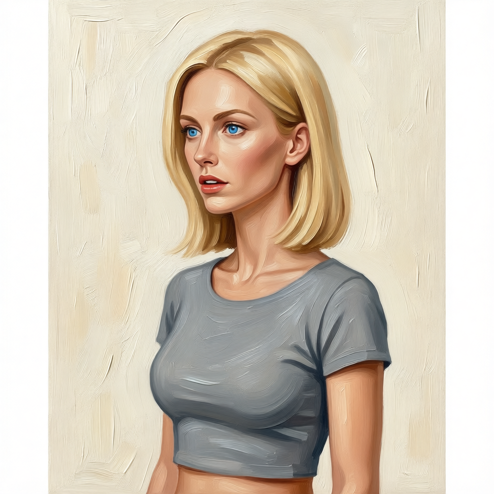](input-images/bfs-input-08-oil-painting.png) | **확대 검수 보류** 사선 방향은 이어지나 상의 밑단·노출되는 허리와 상체 비례가 달라 보인다. |
| **P711-IN-140** bfs-input-08-soft-photo |  | [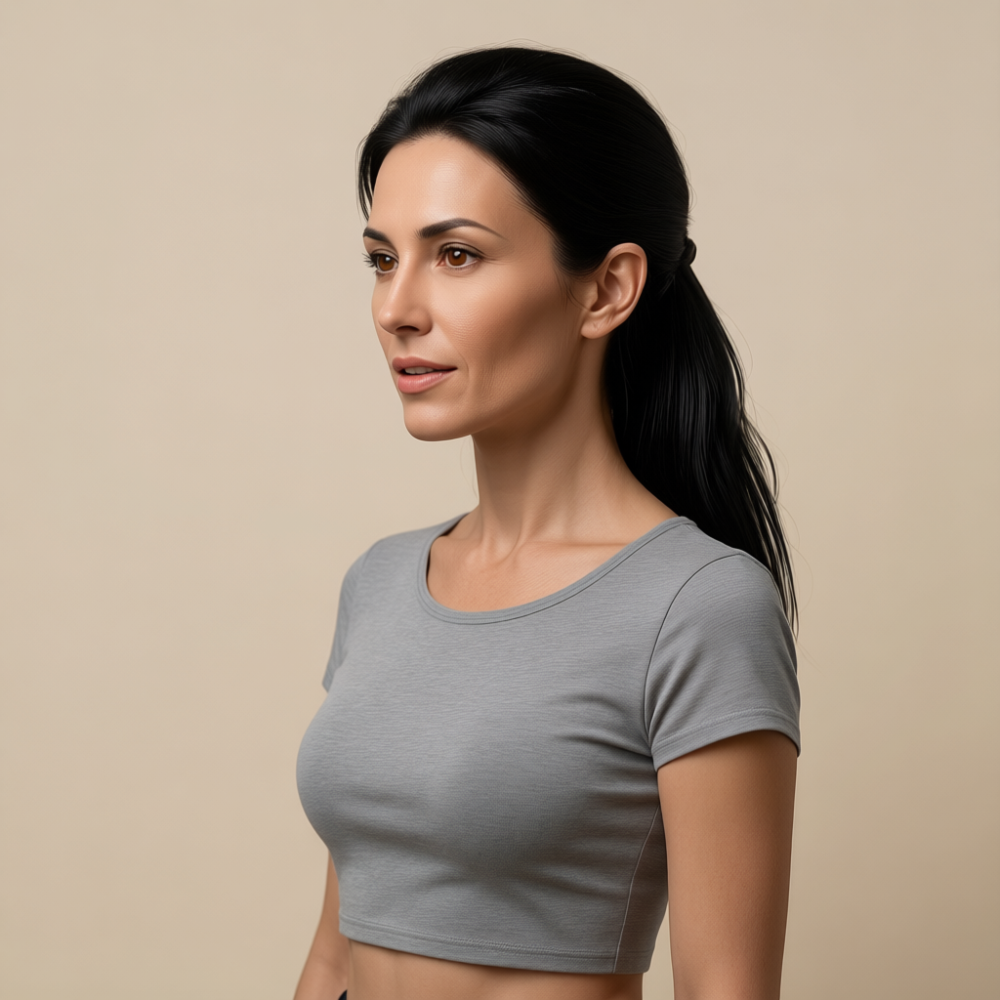](input-images/bfs-input-08-soft-photo.png) | **확대 검수 보류** 사선 방향은 이어지나 상의 밑단·노출되는 허리와 상체 비례가 달라 보인다. |
| **P711-IN-184** bfs-input-08-watercolor |  | [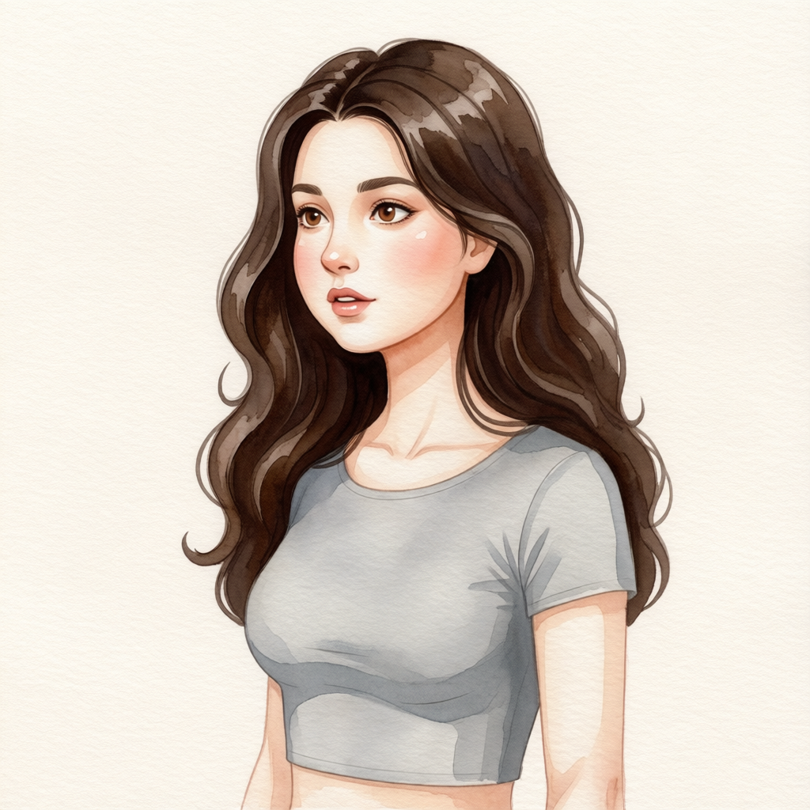](input-images/bfs-input-08-watercolor.png) | **확대 검수 보류** 사선 방향은 이어지나 상의 밑단·노출되는 허리와 상체 비례가 달라 보인다. |

## target-09

| 관리번호 · 입력 ID | Mira 목표 | 생성 입력 후보 | 현재 검수 의견 |
| --- | --- | --- | --- |
| **P711-IN-009** bfs-input-09-ink-illustration |  | [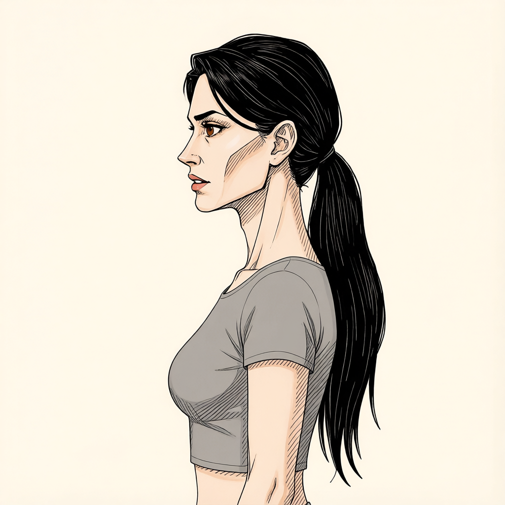](input-images/bfs-input-09-ink-illustration.png) | **확대 검수 보류** 측면과 상의는 이어진다. 사진풍의 옷 기장과 입력별 상체 두께를 확인한다. |
| **P711-IN-053** bfs-input-09-oil-painting |  |  | **확대 검수 보류** 측면과 상의는 이어진다. 사진풍의 옷 기장과 입력별 상체 두께를 확인한다. |
| **P711-IN-097** bfs-input-09-soft-photo |  |  | **확대 검수 보류** 측면과 상의는 이어진다. 사진풍의 옷 기장과 입력별 상체 두께를 확인한다. |
| **P711-IN-141** bfs-input-09-watercolor |  | [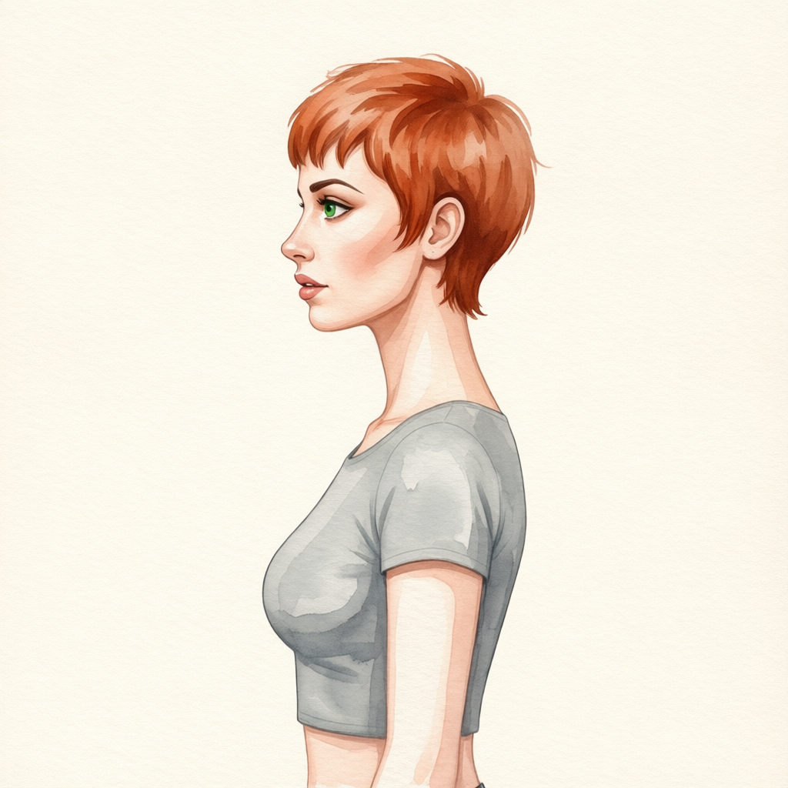](input-images/bfs-input-09-watercolor.png) | **확대 검수 보류** 측면과 상의는 이어진다. 사진풍의 옷 기장과 입력별 상체 두께를 확인한다. |
| **P711-IN-185** bfs-input-09-clay-render |  |  | **확대 검수 보류** 측면과 상의는 이어진다. 사진풍의 옷 기장과 입력별 상체 두께를 확인한다. |

## target-10

| 관리번호 · 입력 ID | Mira 목표 | 생성 입력 후보 | 현재 검수 의견 |
| --- | --- | --- | --- |
| **P711-IN-010** bfs-input-10-oil-painting |  |  | **확대 검수 보류** 고각도 전신 배치와 발 위치는 대체로 대응한다. 목·어깨·시선·손의 세부 확인이 필요하다. |
| **P711-IN-054** bfs-input-10-soft-photo |  | [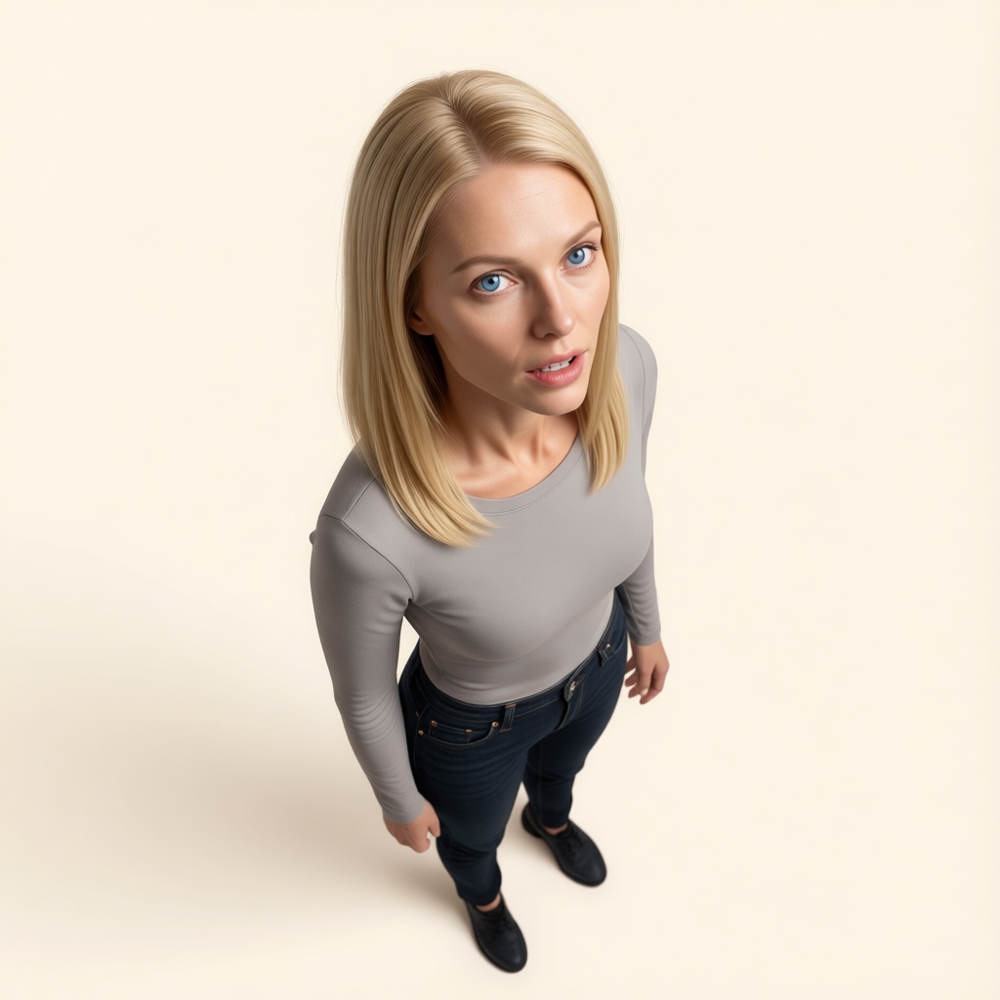](input-images/bfs-input-10-soft-photo.png) | **확대 검수 보류** 고각도 전신 배치와 발 위치는 대체로 대응한다. 목·어깨·시선·손의 세부 확인이 필요하다. |
| **P711-IN-098** bfs-input-10-watercolor |  |  | **확대 검수 보류** 고각도 전신 배치와 발 위치는 대체로 대응한다. 목·어깨·시선·손의 세부 확인이 필요하다. |
| **P711-IN-142** bfs-input-10-clay-render |  |  | **확대 검수 보류** 고각도 전신 배치와 발 위치는 대체로 대응한다. 목·어깨·시선·손의 세부 확인이 필요하다. |
| **P711-IN-186** bfs-input-10-ink-illustration |  | [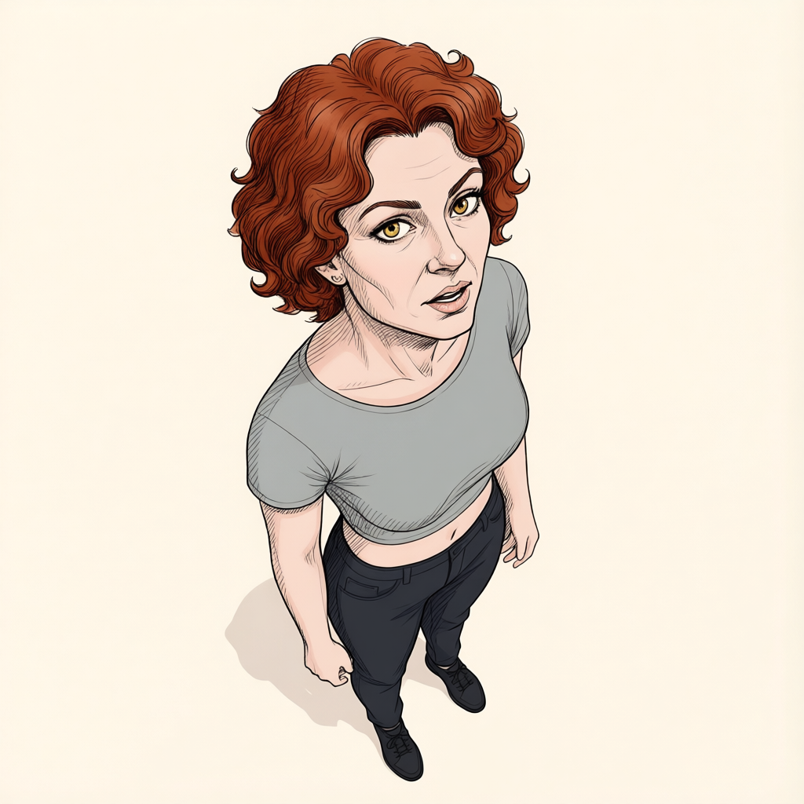](input-images/bfs-input-10-ink-illustration.png) | **확대 검수 보류** 고각도 전신 배치와 발 위치는 대체로 대응한다. 목·어깨·시선·손의 세부 확인이 필요하다. |

## target-11

| 관리번호 · 입력 ID | Mira 목표 | 생성 입력 후보 | 현재 검수 의견 |
| --- | --- | --- | --- |
| **P711-IN-011** bfs-input-11-soft-photo |  |  | **확대 검수 보류** 높은 정면 시점과 발 배치는 이어진다. 얼굴 크기와 표정·입 벌림이 달라 보인다. |
| **P711-IN-055** bfs-input-11-watercolor |  |  | **확대 검수 보류** 높은 정면 시점과 발 배치는 이어진다. 얼굴 크기와 표정·입 벌림이 달라 보인다. |
| **P711-IN-099** bfs-input-11-clay-render |  |  | **확대 검수 보류** 높은 정면 시점과 발 배치는 이어진다. 얼굴 크기와 표정·입 벌림이 달라 보인다. |
| **P711-IN-143** bfs-input-11-ink-illustration |  |  | **확대 검수 보류** 높은 정면 시점과 발 배치는 이어진다. 얼굴 크기와 표정·입 벌림이 달라 보인다. |
| **P711-IN-187** bfs-input-11-oil-painting |  | [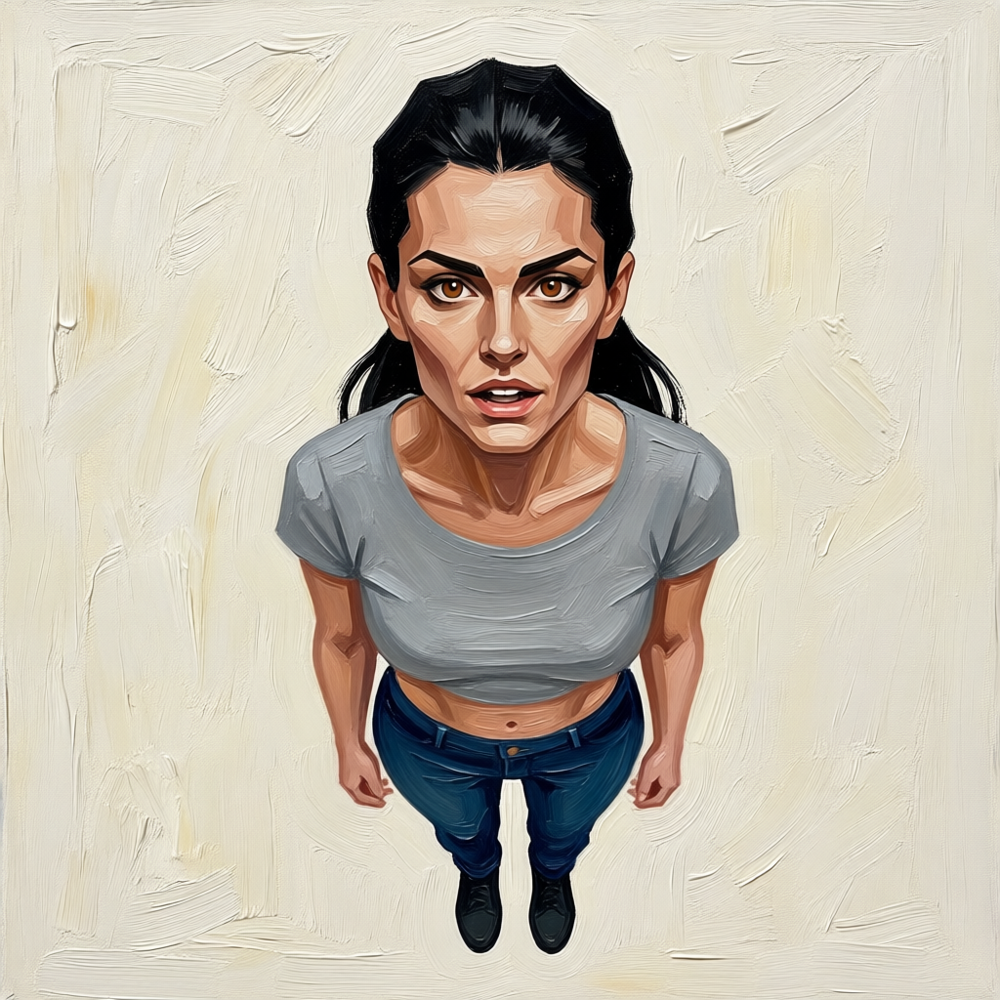](input-images/bfs-input-11-oil-painting.png) | **확대 검수 보류** 높은 정면 시점과 발 배치는 이어진다. 얼굴 크기와 표정·입 벌림이 달라 보인다. |

## target-12

| 관리번호 · 입력 ID | Mira 목표 | 생성 입력 후보 | 현재 검수 의견 |
| --- | --- | --- | --- |
| **P711-IN-012** bfs-input-12-watercolor |  |  | **확대 검수 보류** 높은 사선 시점과 몸·발 배치는 이어진다. 몸 비례와 입 벌림을 확인한다. |
| **P711-IN-056** bfs-input-12-clay-render |  | [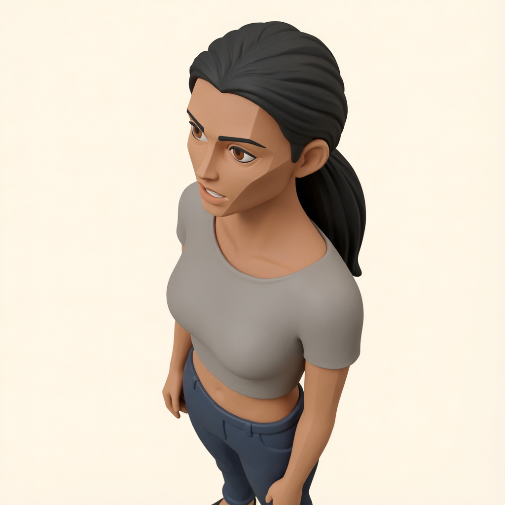](input-images/bfs-input-12-clay-render.png) | **확대 검수 보류** 높은 사선 시점과 몸·발 배치는 이어진다. 몸 비례와 입 벌림을 확인한다. |
| **P711-IN-100** bfs-input-12-ink-illustration |  | [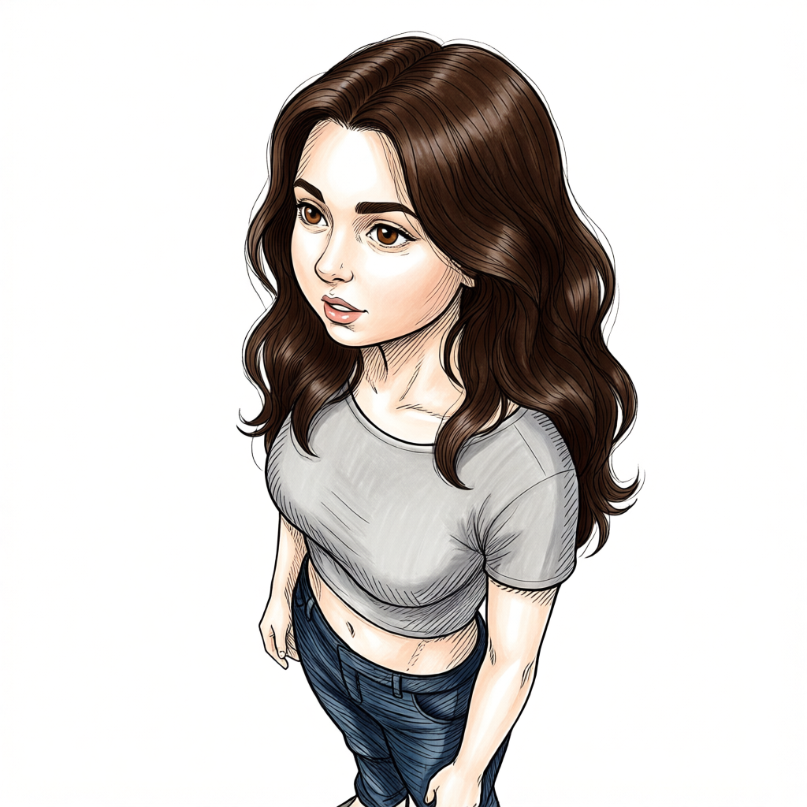](input-images/bfs-input-12-ink-illustration.png) | **확대 검수 보류** 높은 사선 시점과 몸·발 배치는 이어진다. 몸 비례와 입 벌림을 확인한다. |
| **P711-IN-144** bfs-input-12-oil-painting |  | [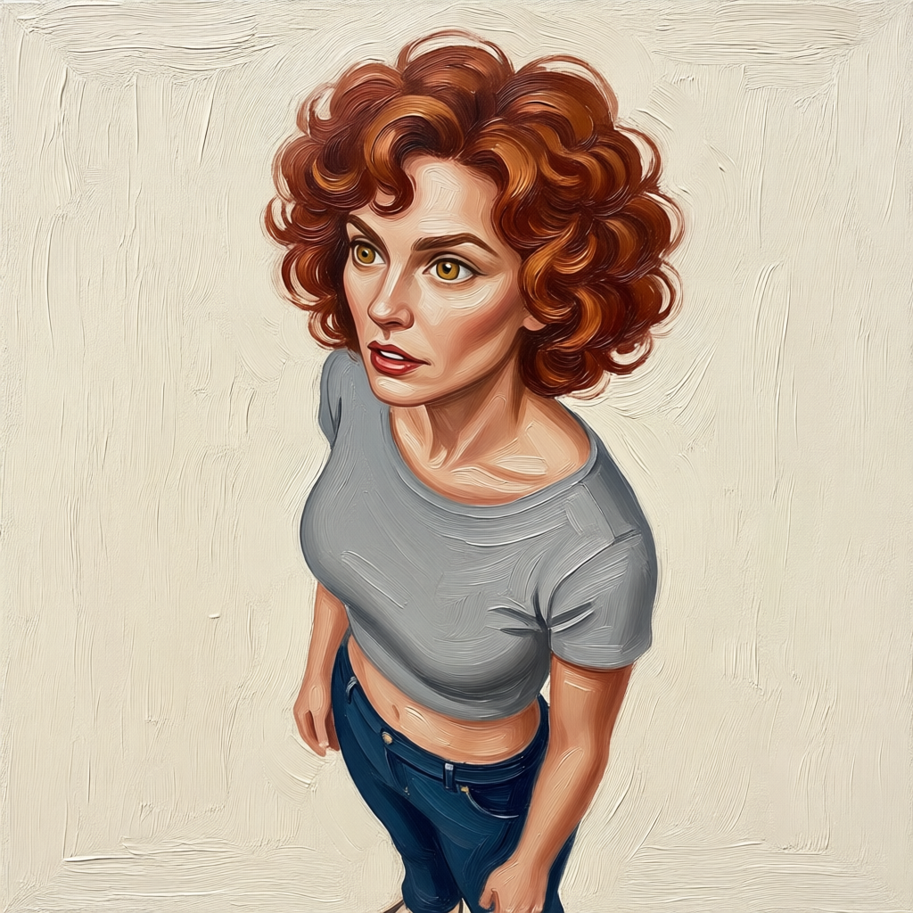](input-images/bfs-input-12-oil-painting.png) | **확대 검수 보류** 높은 사선 시점과 몸·발 배치는 이어진다. 몸 비례와 입 벌림을 확인한다. |
| **P711-IN-188** bfs-input-12-soft-photo |  |  | **확대 검수 보류** 높은 사선 시점과 몸·발 배치는 이어진다. 몸 비례와 입 벌림을 확인한다. |

## target-13

| 관리번호 · 입력 ID | Mira 목표 | 생성 입력 후보 | 현재 검수 의견 |
| --- | --- | --- | --- |
| **P711-IN-013** bfs-input-13-clay-render | [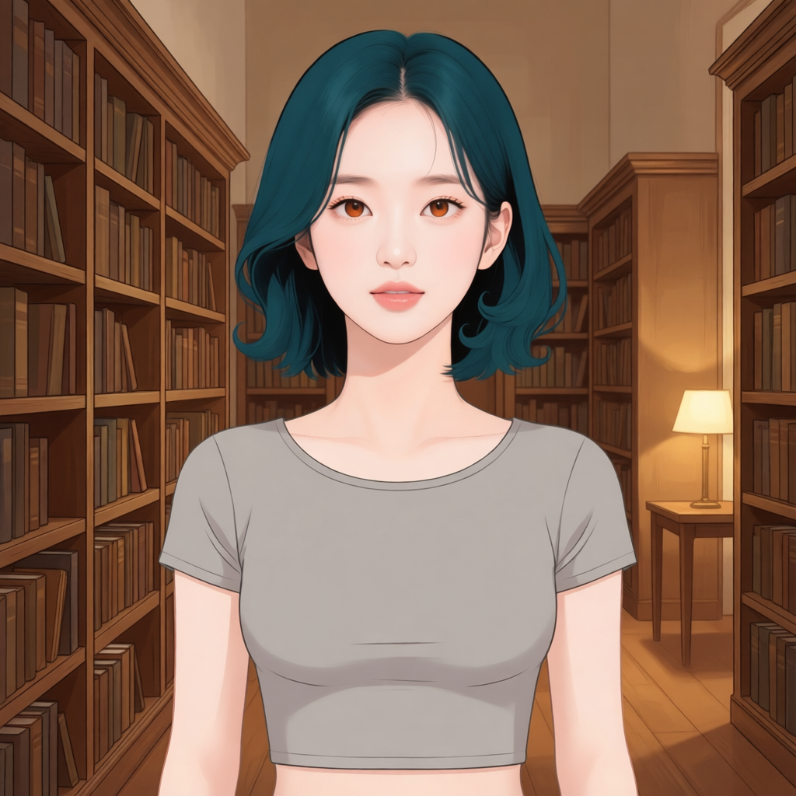](training-images/p7-5-11-mira-v2-background-01.png) |  | **확대 검수 보류** 도서관 선반 배치는 대체로 이어진다. 일부 화풍에서 인물과 배경의 표현 방식이 섞이며 입력별 몸 비례가 달라진다. |
| **P711-IN-057** bfs-input-13-ink-illustration |  |  | **확대 검수 보류** 도서관 선반 배치는 대체로 이어진다. 일부 화풍에서 인물과 배경의 표현 방식이 섞이며 입력별 몸 비례가 달라진다. |
| **P711-IN-101** bfs-input-13-oil-painting |  | [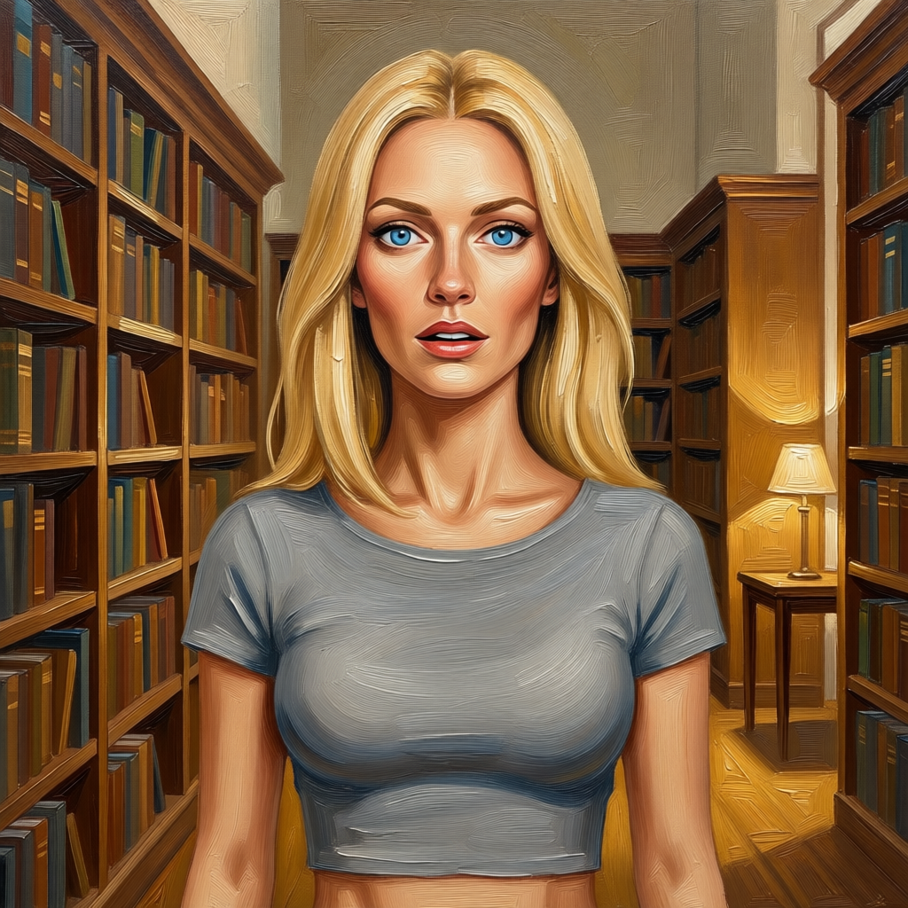](input-images/bfs-input-13-oil-painting.png) | **확대 검수 보류** 도서관 선반 배치는 대체로 이어진다. 일부 화풍에서 인물과 배경의 표현 방식이 섞이며 입력별 몸 비례가 달라진다. |
| **P711-IN-189** bfs-input-13-watercolor |  |  | **확대 검수 보류** 도서관 선반 배치는 대체로 이어진다. 일부 화풍에서 인물과 배경의 표현 방식이 섞이며 입력별 몸 비례가 달라진다. |

## target-14

| 관리번호 · 입력 ID | Mira 목표 | 생성 입력 후보 | 현재 검수 의견 |
| --- | --- | --- | --- |
| **P711-IN-014** bfs-input-14-ink-illustration |  |  | **확대 검수 보류** 공원 배치가 이어진다. 사진풍·점토·펜화 인물에 비해 배경의 원래 그림 표현이 많이 남아 전체 화풍 전환 여부를 확인해야 한다. |
| **P711-IN-058** bfs-input-14-oil-painting |  | [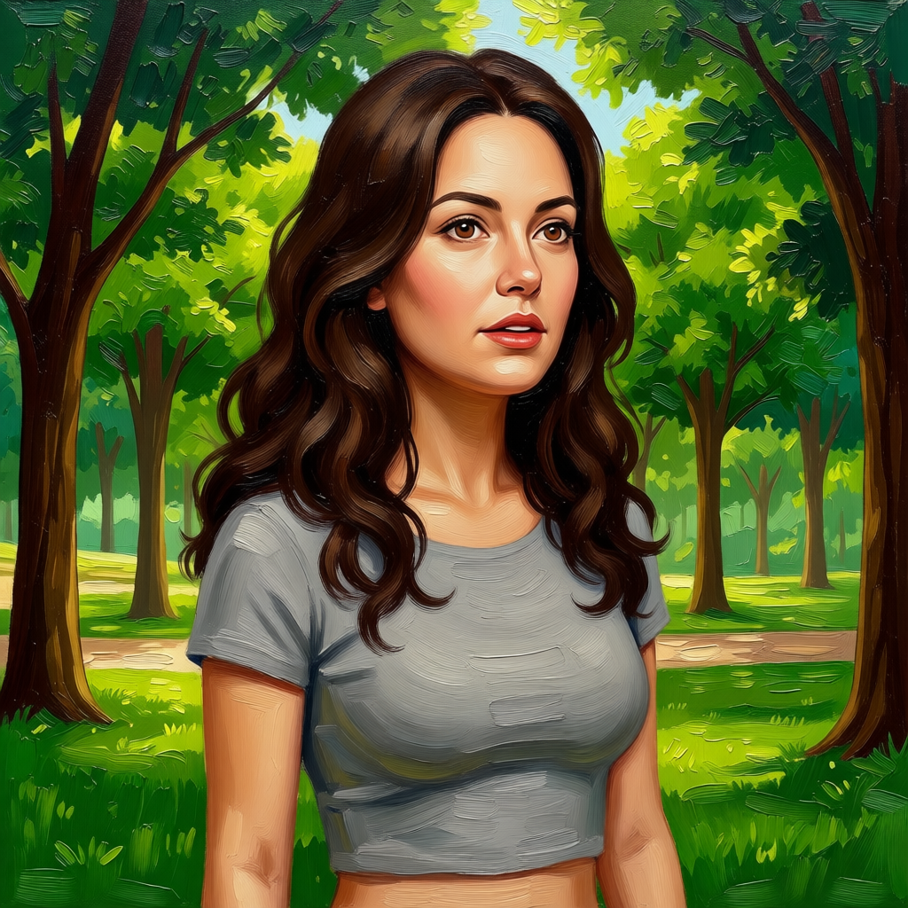](input-images/bfs-input-14-oil-painting.png) | **확대 검수 보류** 공원 배치가 이어진다. 사진풍·점토·펜화 인물에 비해 배경의 원래 그림 표현이 많이 남아 전체 화풍 전환 여부를 확인해야 한다. |
| **P711-IN-102** bfs-input-14-soft-photo |  |  | **확대 검수 보류** 공원 배치가 이어진다. 사진풍·점토·펜화 인물에 비해 배경의 원래 그림 표현이 많이 남아 전체 화풍 전환 여부를 확인해야 한다. |
| **P711-IN-146** bfs-input-14-watercolor |  | [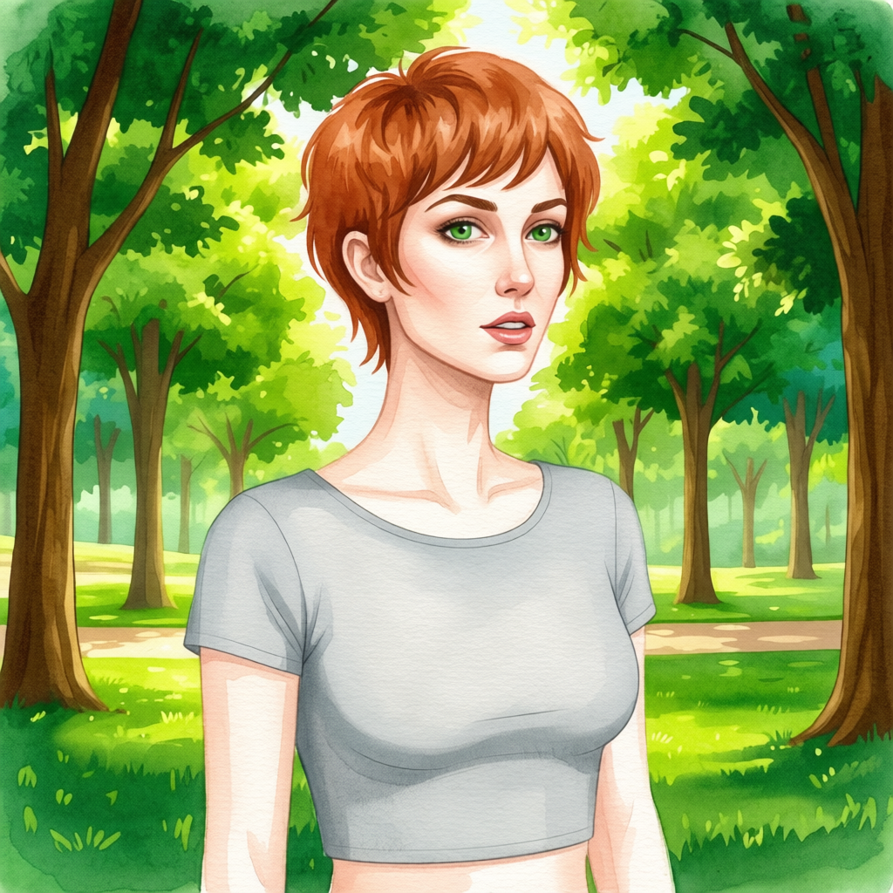](input-images/bfs-input-14-watercolor.png) | **확대 검수 보류** 공원 배치가 이어진다. 사진풍·점토·펜화 인물에 비해 배경의 원래 그림 표현이 많이 남아 전체 화풍 전환 여부를 확인해야 한다. |
| **P711-IN-190** bfs-input-14-clay-render |  | [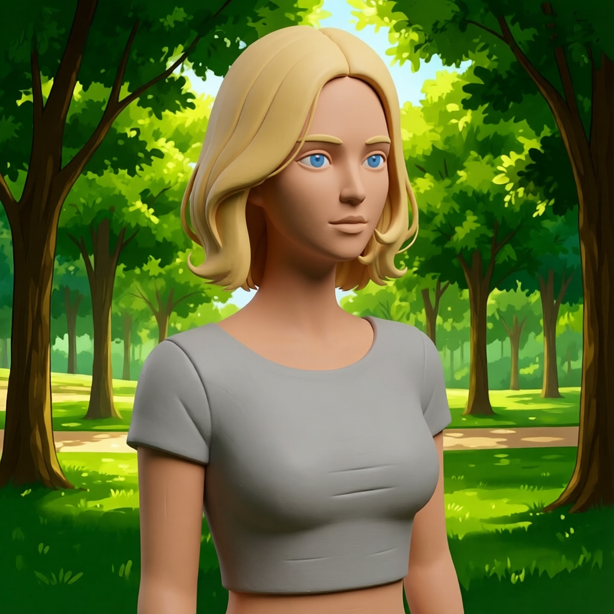](input-images/bfs-input-14-clay-render.png) | **확대 검수 보류** 공원 배치가 이어진다. 사진풍·점토·펜화 인물에 비해 배경의 원래 그림 표현이 많이 남아 전체 화풍 전환 여부를 확인해야 한다. |

## target-15

| 관리번호 · 입력 ID | Mira 목표 | 생성 입력 후보 | 현재 검수 의견 |
| --- | --- | --- | --- |
| **P711-IN-015** bfs-input-15-oil-painting | [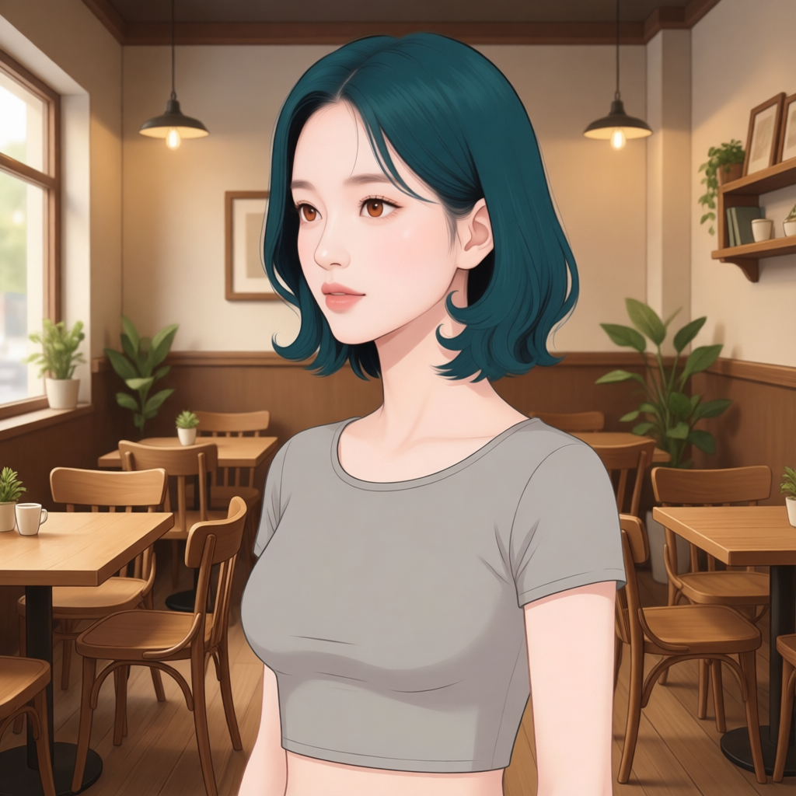](training-images/p7-5-11-mira-v2-background-03.png) |  | **확대 검수 보류** 카페의 책상·창·화분 배치는 대체로 이어진다. 수채화의 가장자리 소실과 인물·배경 화풍의 일치 여부를 확인한다. |
| **P711-IN-059** bfs-input-15-soft-photo |  | [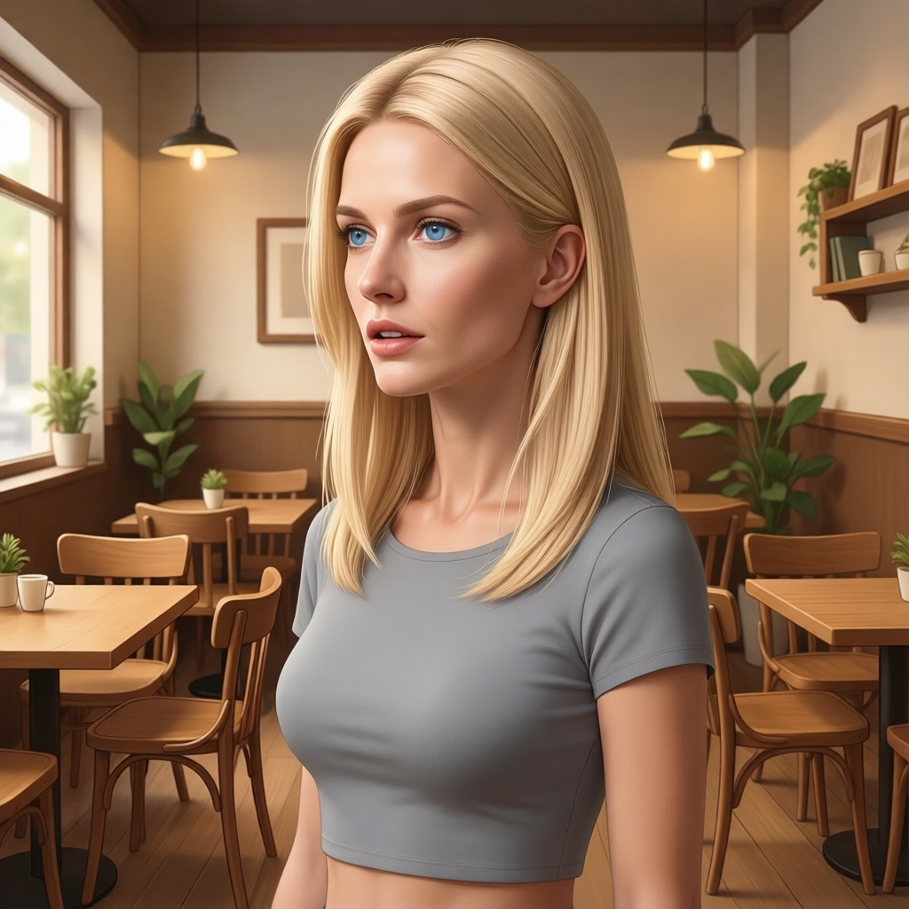](input-images/bfs-input-15-soft-photo.png) | **확대 검수 보류** 카페의 책상·창·화분 배치는 대체로 이어진다. 수채화의 가장자리 소실과 인물·배경 화풍의 일치 여부를 확인한다. |
| **P711-IN-103** bfs-input-15-watercolor |  | [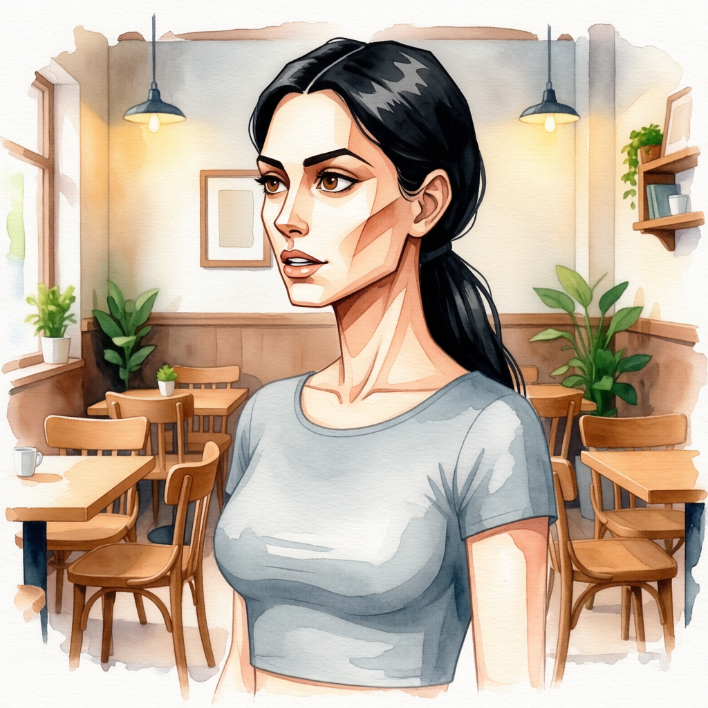](input-images/bfs-input-15-watercolor.png) | **확대 검수 보류** 카페의 책상·창·화분 배치는 대체로 이어진다. 수채화의 가장자리 소실과 인물·배경 화풍의 일치 여부를 확인한다. |
| **P711-IN-147** bfs-input-15-clay-render |  | [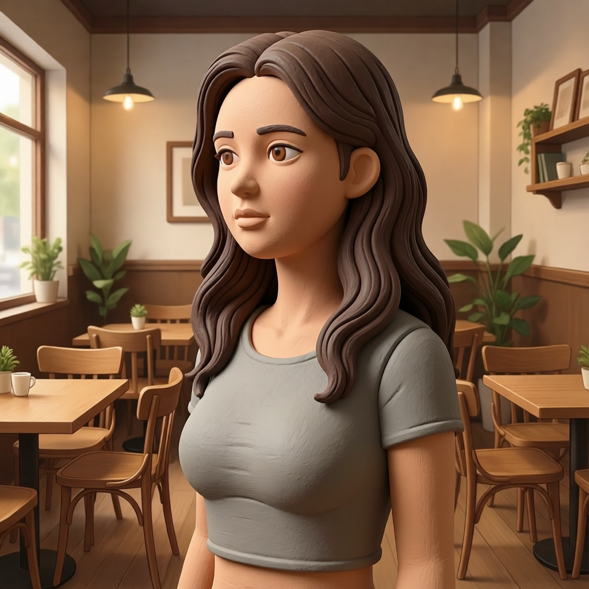](input-images/bfs-input-15-clay-render.png) | **확대 검수 보류** 카페의 책상·창·화분 배치는 대체로 이어진다. 수채화의 가장자리 소실과 인물·배경 화풍의 일치 여부를 확인한다. |
| **P711-IN-191** bfs-input-15-ink-illustration |  | [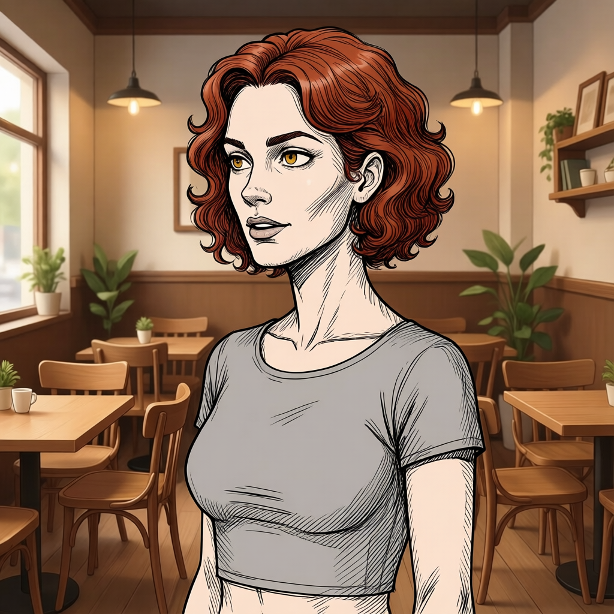](input-images/bfs-input-15-ink-illustration.png) | **확대 검수 보류** 카페의 책상·창·화분 배치는 대체로 이어진다. 수채화의 가장자리 소실과 인물·배경 화풍의 일치 여부를 확인한다. |

## target-16

| 관리번호 · 입력 ID | Mira 목표 | 생성 입력 후보 | 현재 검수 의견 |
| --- | --- | --- | --- |
| **P711-IN-016** bfs-input-16-soft-photo | [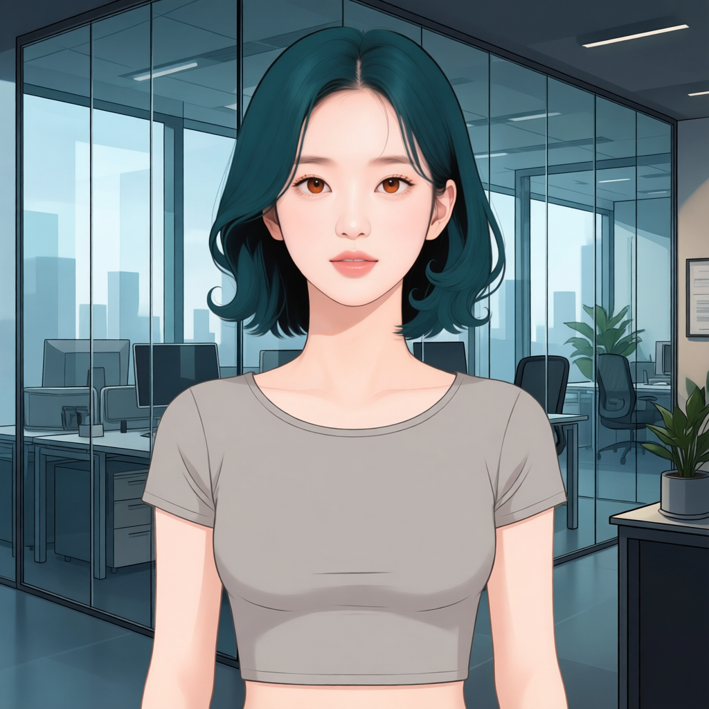](training-images/p7-5-11-mira-v2-background-04.png) |  | **확대 검수 보류** 사무실 배치가 이어지지만 입력별 몸 비례와 입 벌림이 다르다. 배경까지 화풍이 전환됐는지 추가 확인한다. |
| **P711-IN-060** bfs-input-16-watercolor |  |  | **확대 검수 보류** 사무실 배치가 이어지지만 입력별 몸 비례와 입 벌림이 다르다. 배경까지 화풍이 전환됐는지 추가 확인한다. |
| **P711-IN-104** bfs-input-16-clay-render |  |  | **확대 검수 보류** 사무실 배치가 이어지지만 입력별 몸 비례와 입 벌림이 다르다. 배경까지 화풍이 전환됐는지 추가 확인한다. |
| **P711-IN-148** bfs-input-16-ink-illustration |  |  | **확대 검수 보류** 사무실 배치가 이어지지만 입력별 몸 비례와 입 벌림이 다르다. 배경까지 화풍이 전환됐는지 추가 확인한다. |
| **P711-IN-192** bfs-input-16-oil-painting |  | [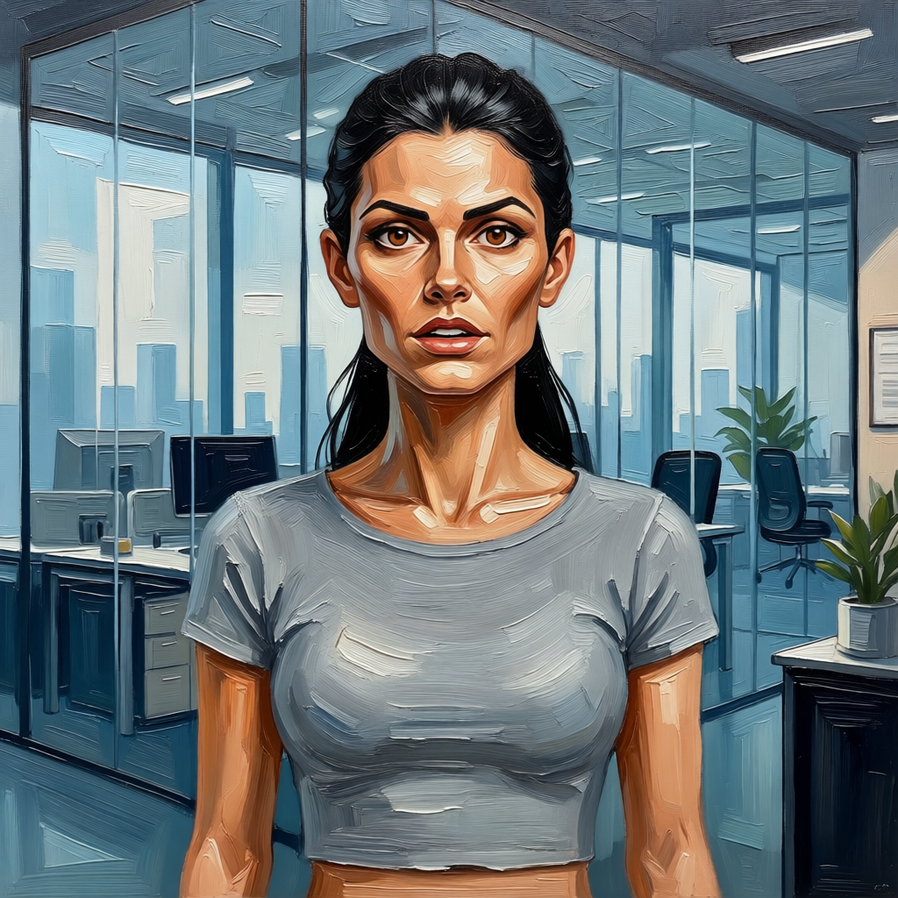](input-images/bfs-input-16-oil-painting.png) | **확대 검수 보류** 사무실 배치가 이어지지만 입력별 몸 비례와 입 벌림이 다르다. 배경까지 화풍이 전환됐는지 추가 확인한다. |

## target-17

| 관리번호 · 입력 ID | Mira 목표 | 생성 입력 후보 | 현재 검수 의견 |
| --- | --- | --- | --- |
| **P711-IN-061** bfs-input-17-clay-render | [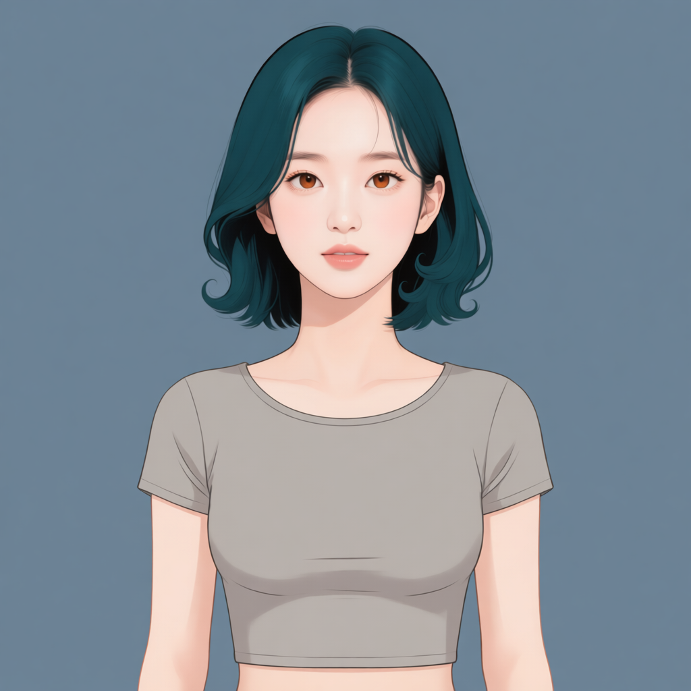](training-images/p7-5-11-mira-v2-background-07.png) |  | **확대 검수 보류** 단색 배경과 정면 상반신이 기준이다. 수채화의 배경 패턴 생성과 점토의 입 벌림이 눈에 띈다. |
| **P711-IN-105** bfs-input-17-ink-illustration |  | [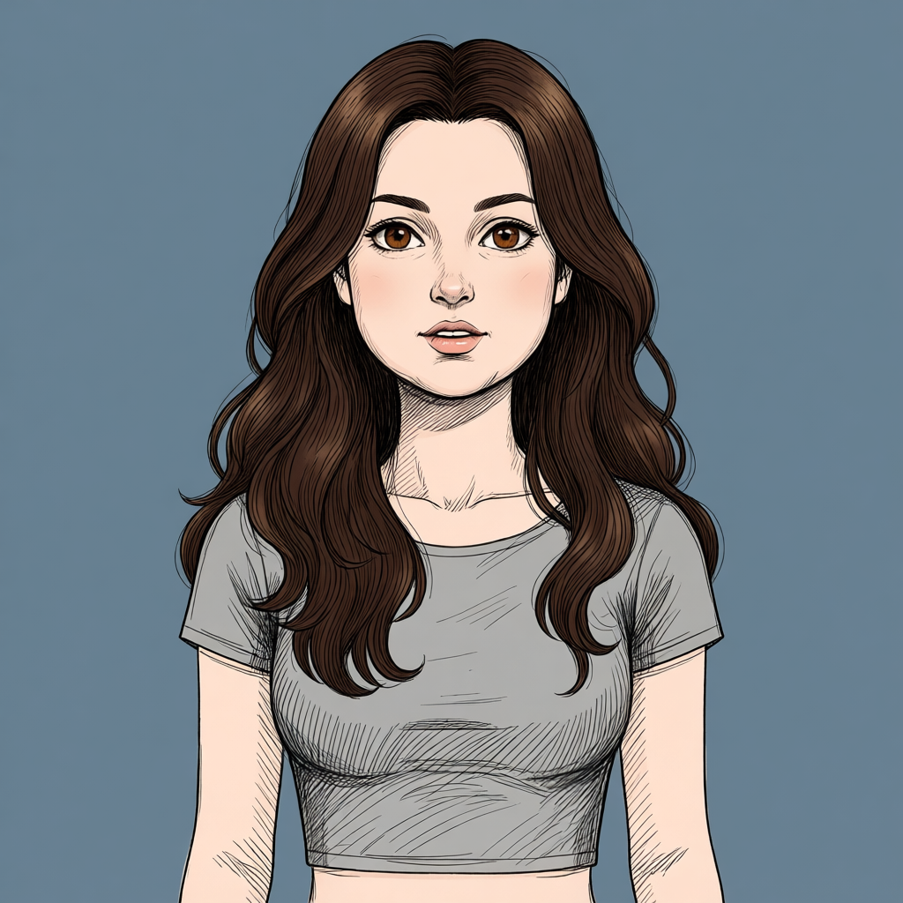](input-images/bfs-input-17-ink-illustration.png) | **확대 검수 보류** 단색 배경과 정면 상반신이 기준이다. 수채화의 배경 패턴 생성과 점토의 입 벌림이 눈에 띈다. |
| **P711-IN-149** bfs-input-17-oil-painting |  | [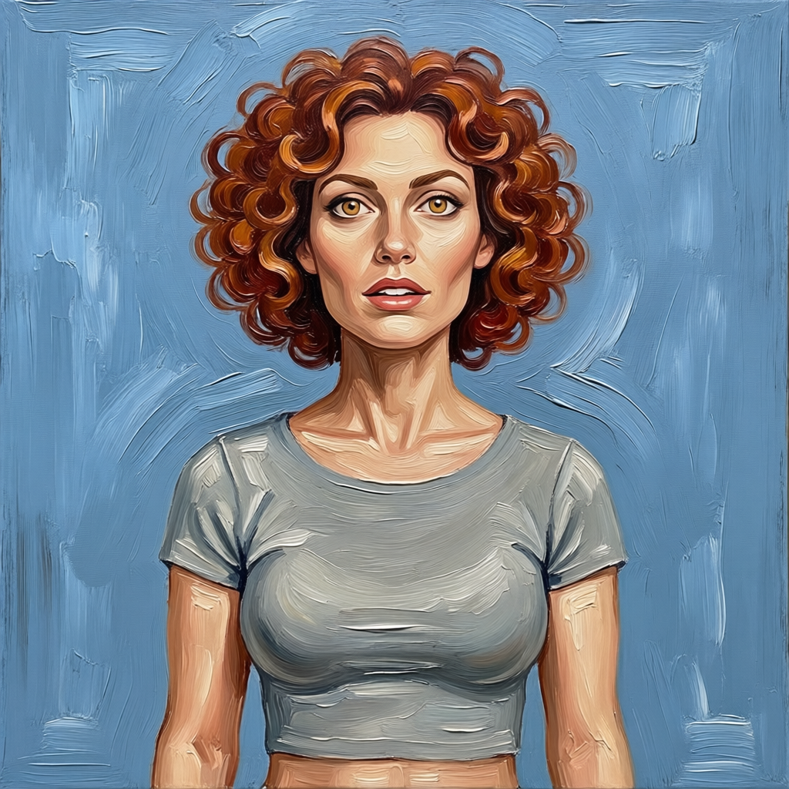](input-images/bfs-input-17-oil-painting.png) | **확대 검수 보류** 단색 배경과 정면 상반신이 기준이다. 수채화의 배경 패턴 생성과 점토의 입 벌림이 눈에 띈다. |
| **P711-IN-193** bfs-input-17-soft-photo |  |  | **확대 검수 보류** 단색 배경과 정면 상반신이 기준이다. 수채화의 배경 패턴 생성과 점토의 입 벌림이 눈에 띈다. |

## target-18

| 관리번호 · 입력 ID | Mira 목표 | 생성 입력 후보 | 현재 검수 의견 |
| --- | --- | --- | --- |
| **P711-IN-018** bfs-input-18-clay-render |  |  | **확대 검수 보류** 갈색 배경과 사선 상반신이 기준이다. 수채화의 여백·화면 점유와 유화 배경의 추상 무늬를 확인한다. |
| **P711-IN-062** bfs-input-18-ink-illustration |  | [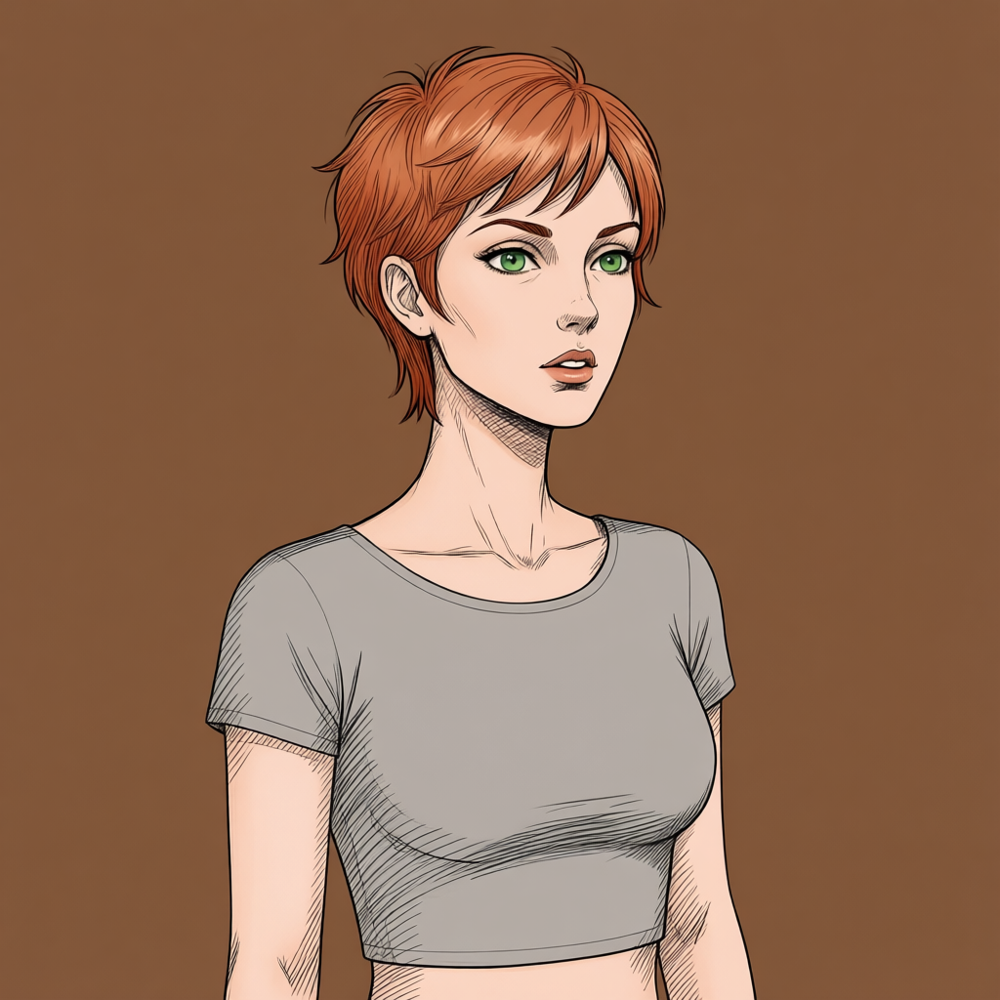](input-images/bfs-input-18-ink-illustration.png) | **확대 검수 보류** 갈색 배경과 사선 상반신이 기준이다. 수채화의 여백·화면 점유와 유화 배경의 추상 무늬를 확인한다. |
| **P711-IN-106** bfs-input-18-oil-painting |  |  | **확대 검수 보류** 갈색 배경과 사선 상반신이 기준이다. 수채화의 여백·화면 점유와 유화 배경의 추상 무늬를 확인한다. |
| **P711-IN-150** bfs-input-18-soft-photo |  |  | **확대 검수 보류** 갈색 배경과 사선 상반신이 기준이다. 수채화의 여백·화면 점유와 유화 배경의 추상 무늬를 확인한다. |
| **P711-IN-194** bfs-input-18-watercolor |  | [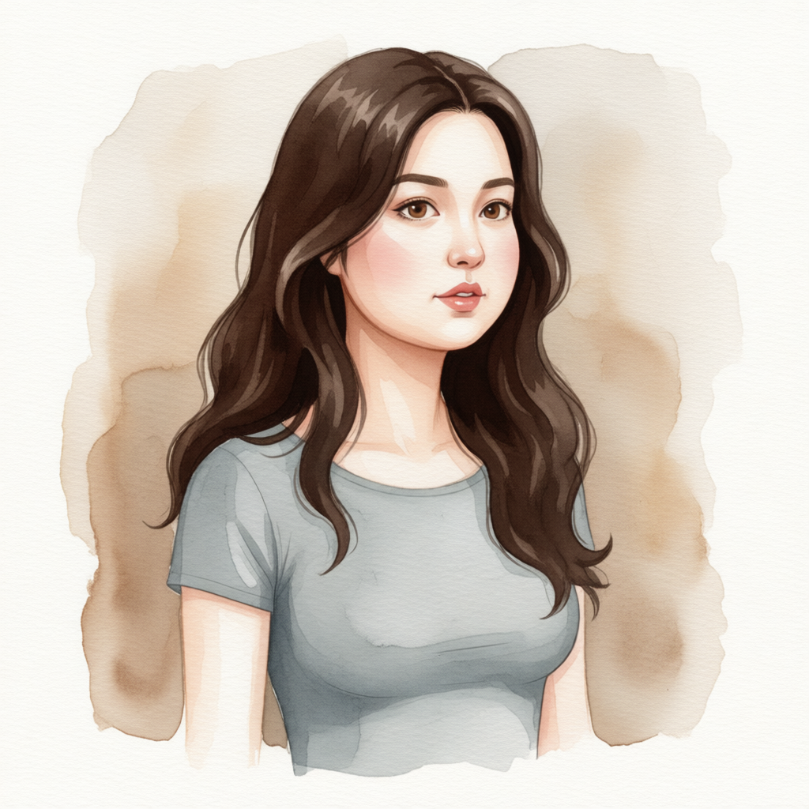](input-images/bfs-input-18-watercolor.png) | **확대 검수 보류** 갈색 배경과 사선 상반신이 기준이다. 수채화의 여백·화면 점유와 유화 배경의 추상 무늬를 확인한다. |

## target-19

| 관리번호 · 입력 ID | Mira 목표 | 생성 입력 후보 | 현재 검수 의견 |
| --- | --- | --- | --- |
| **P711-IN-019** bfs-input-19-ink-illustration |  |  | **확대 검수 보류** 강가 벤치와 손을 든 동작은 이어진다. 손가락·컵 없는 손의 동작 및 인물과 배경 화풍의 일관성을 추가 검수한다. |
| **P711-IN-063** bfs-input-19-oil-painting |  |  | **확대 검수 보류** 강가 벤치와 손을 든 동작은 이어진다. 손가락·컵 없는 손의 동작 및 인물과 배경 화풍의 일관성을 추가 검수한다. |
| **P711-IN-107** bfs-input-19-soft-photo |  |  | **확대 검수 보류** 강가 벤치와 손을 든 동작은 이어진다. 손가락·컵 없는 손의 동작 및 인물과 배경 화풍의 일관성을 추가 검수한다. |
| **P711-IN-151** bfs-input-19-watercolor |  | [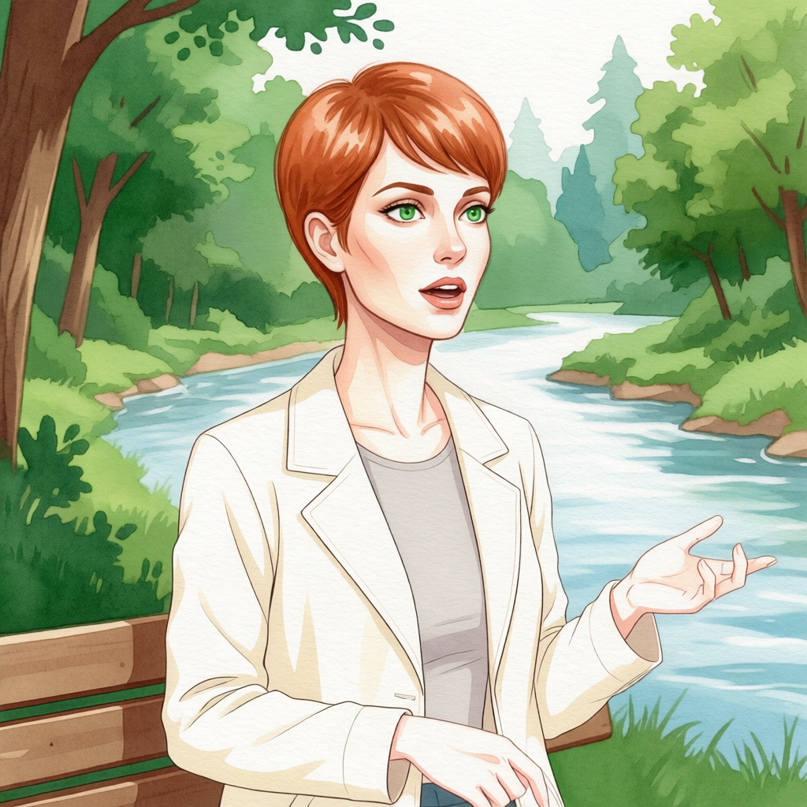](input-images/bfs-input-19-watercolor.png) | **확대 검수 보류** 강가 벤치와 손을 든 동작은 이어진다. 손가락·컵 없는 손의 동작 및 인물과 배경 화풍의 일관성을 추가 검수한다. |
| **P711-IN-195** bfs-input-19-clay-render |  |  | **확대 검수 보류** 강가 벤치와 손을 든 동작은 이어진다. 손가락·컵 없는 손의 동작 및 인물과 배경 화풍의 일관성을 추가 검수한다. |

## target-20

| 관리번호 · 입력 ID | Mira 목표 | 생성 입력 후보 | 현재 검수 의견 |
| --- | --- | --- | --- |
| **P711-IN-020** bfs-input-20-oil-painting | [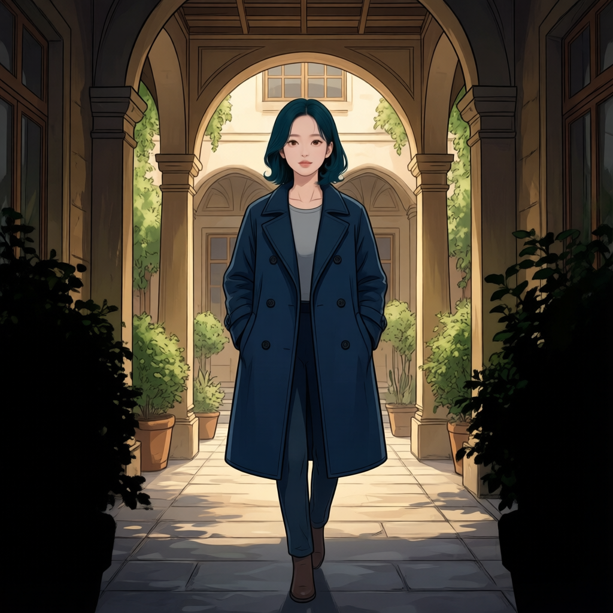](validation/images/p7-5-11-mira-v2-evaluation-04.png) |  | **확대 검수 보류** 복도 전신·코트·화분은 이어진다. 손의 위치, 단추와 코트 길이, 작은 얼굴의 시선은 확대 검수가 필요하다. |
| **P711-IN-064** bfs-input-20-soft-photo |  |  | **확대 검수 보류** 복도 전신·코트·화분은 이어진다. 손의 위치, 단추와 코트 길이, 작은 얼굴의 시선은 확대 검수가 필요하다. |
| **P711-IN-108** bfs-input-20-watercolor |  | [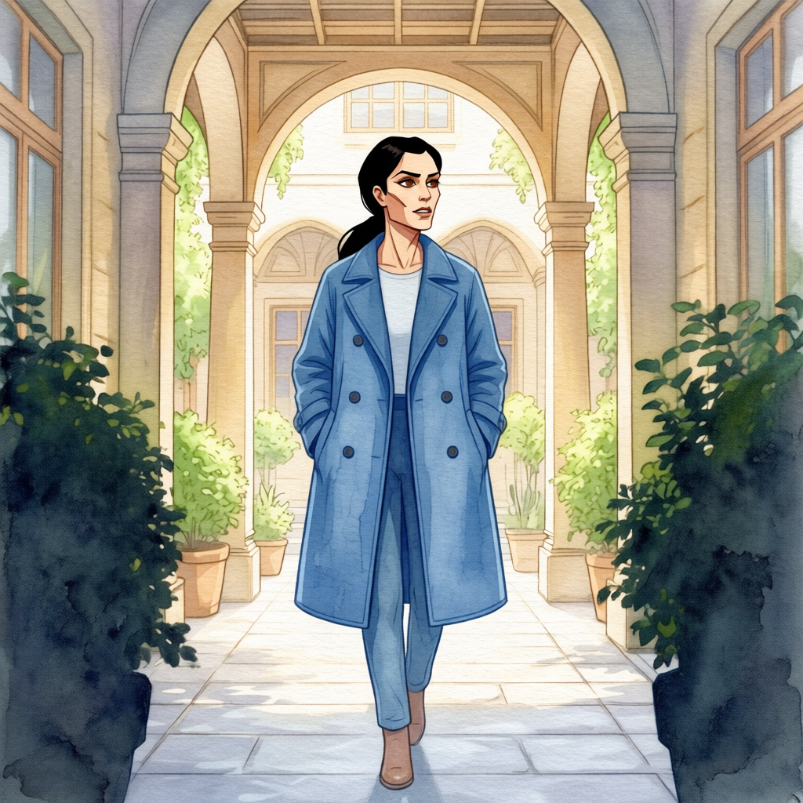](input-images/bfs-input-20-watercolor.png) | **확대 검수 보류** 복도 전신·코트·화분은 이어진다. 손의 위치, 단추와 코트 길이, 작은 얼굴의 시선은 확대 검수가 필요하다. |
| **P711-IN-152** bfs-input-20-clay-render |  | [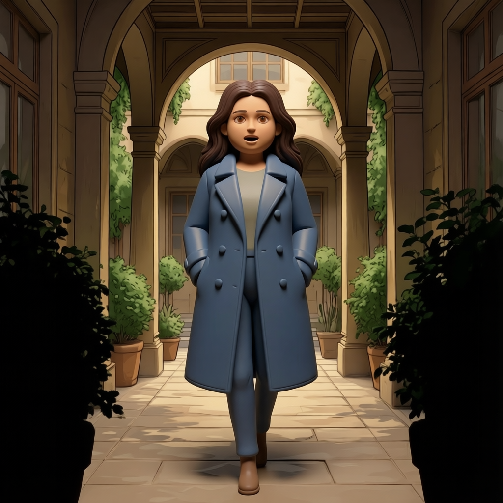](input-images/bfs-input-20-clay-render.png) | **확대 검수 보류** 복도 전신·코트·화분은 이어진다. 손의 위치, 단추와 코트 길이, 작은 얼굴의 시선은 확대 검수가 필요하다. |
| **P711-IN-196** bfs-input-20-ink-illustration |  |  | **확대 검수 보류** 복도 전신·코트·화분은 이어진다. 손의 위치, 단추와 코트 길이, 작은 얼굴의 시선은 확대 검수가 필요하다. |

## target-21

| 관리번호 · 입력 ID | Mira 목표 | 생성 입력 후보 | 현재 검수 의견 |
| --- | --- | --- | --- |
| **P711-IN-021** bfs-input-21-soft-photo | [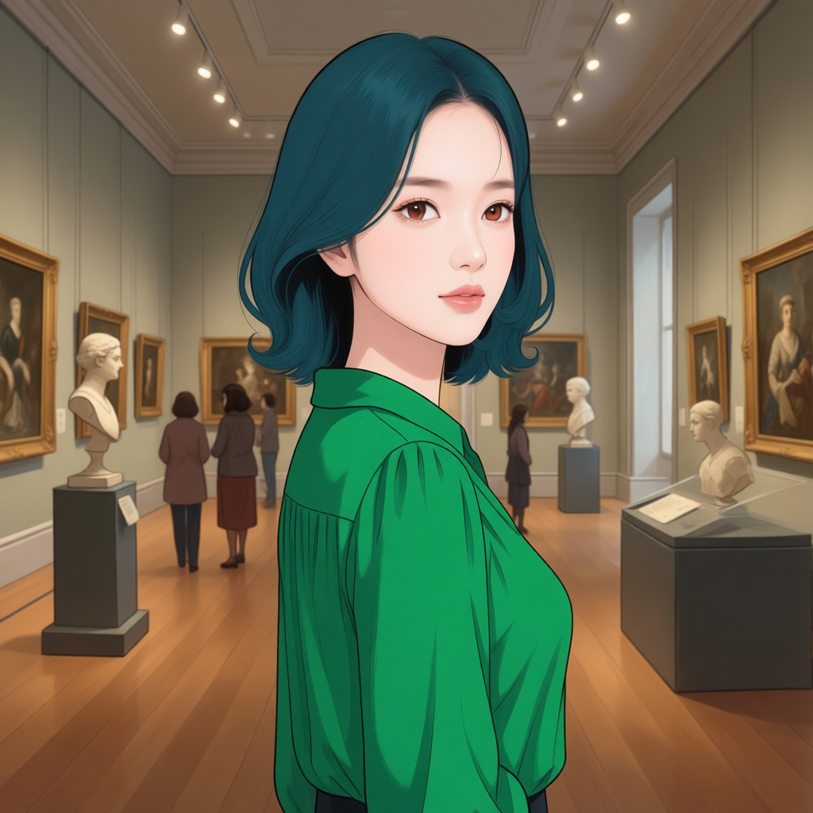](validation/images/p7-5-11-mira-v2-evaluation-05.png) |  | **확대 검수 보류** 미술관·초록 셔츠의 방향은 대체로 이어진다. 수채화에서 장면이 사라졌고 다른 입력은 배경 화풍과 몸 굴곡을 확인해야 한다. |
| **P711-IN-109** bfs-input-21-clay-render |  |  | **확대 검수 보류** 미술관·초록 셔츠의 방향은 대체로 이어진다. 수채화에서 장면이 사라졌고 다른 입력은 배경 화풍과 몸 굴곡을 확인해야 한다. |
| **P711-IN-153** bfs-input-21-ink-illustration |  |  | **확대 검수 보류** 미술관·초록 셔츠의 방향은 대체로 이어진다. 수채화에서 장면이 사라졌고 다른 입력은 배경 화풍과 몸 굴곡을 확인해야 한다. |
| **P711-IN-197** bfs-input-21-oil-painting |  |  | **확대 검수 보류** 미술관·초록 셔츠의 방향은 대체로 이어진다. 수채화에서 장면이 사라졌고 다른 입력은 배경 화풍과 몸 굴곡을 확인해야 한다. |

## target-22

| 관리번호 · 입력 ID | Mira 목표 | 생성 입력 후보 | 현재 검수 의견 |
| --- | --- | --- | --- |
| **P711-IN-022** bfs-input-22-watercolor |  | [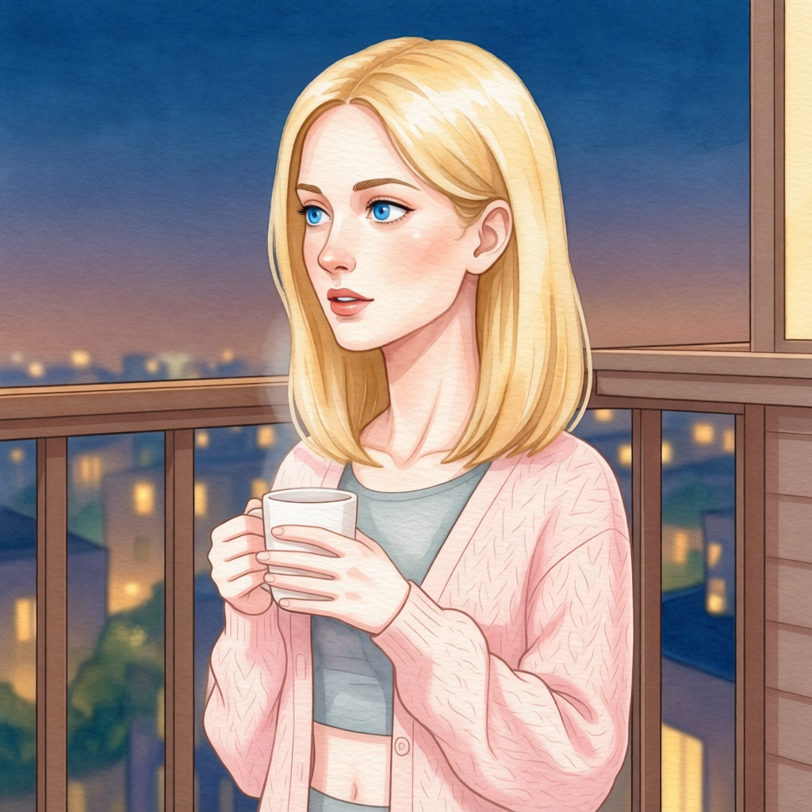](input-images/bfs-input-22-watercolor.png) | **확대 검수 보류** 컵을 양손으로 잡은 동작과 창틀은 이어진다. 손가락·컵 테두리·표정 및 배경 화풍 전환을 확대 검수한다. |
| **P711-IN-066** bfs-input-22-clay-render |  |  | **확대 검수 보류** 컵을 양손으로 잡은 동작과 창틀은 이어진다. 손가락·컵 테두리·표정 및 배경 화풍 전환을 확대 검수한다. |
| **P711-IN-110** bfs-input-22-ink-illustration |  | [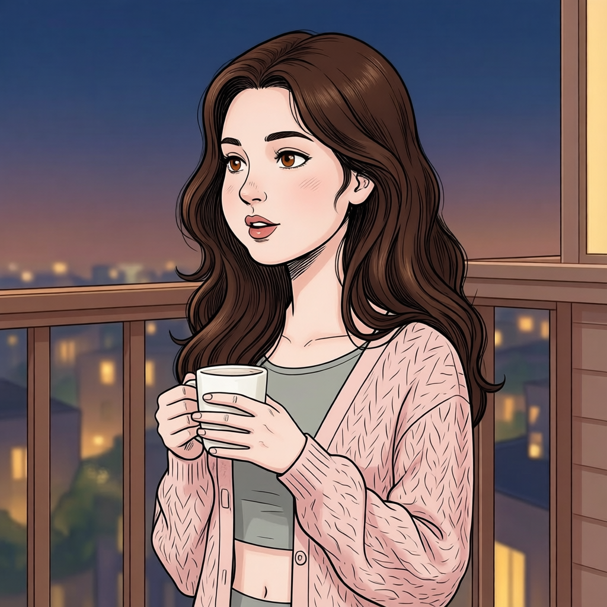](input-images/bfs-input-22-ink-illustration.png) | **확대 검수 보류** 컵을 양손으로 잡은 동작과 창틀은 이어진다. 손가락·컵 테두리·표정 및 배경 화풍 전환을 확대 검수한다. |
| **P711-IN-154** bfs-input-22-oil-painting |  | [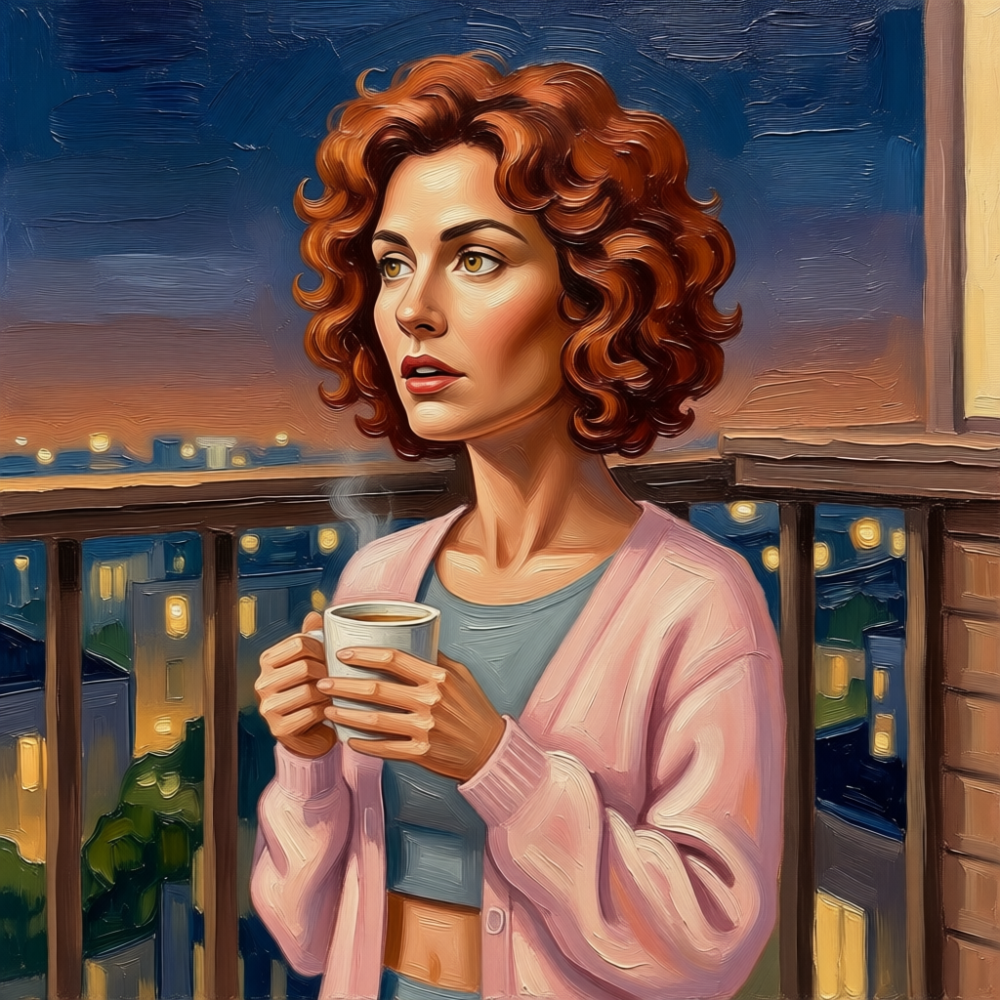](input-images/bfs-input-22-oil-painting.png) | **확대 검수 보류** 컵을 양손으로 잡은 동작과 창틀은 이어진다. 손가락·컵 테두리·표정 및 배경 화풍 전환을 확대 검수한다. |
| **P711-IN-198** bfs-input-22-soft-photo |  |  | **확대 검수 보류** 컵을 양손으로 잡은 동작과 창틀은 이어진다. 손가락·컵 테두리·표정 및 배경 화풍 전환을 확대 검수한다. |

## target-24

| 관리번호 · 입력 ID | Mira 목표 | 생성 입력 후보 | 현재 검수 의견 |
| --- | --- | --- | --- |
| **P711-IN-024** bfs-input-24-ink-illustration | [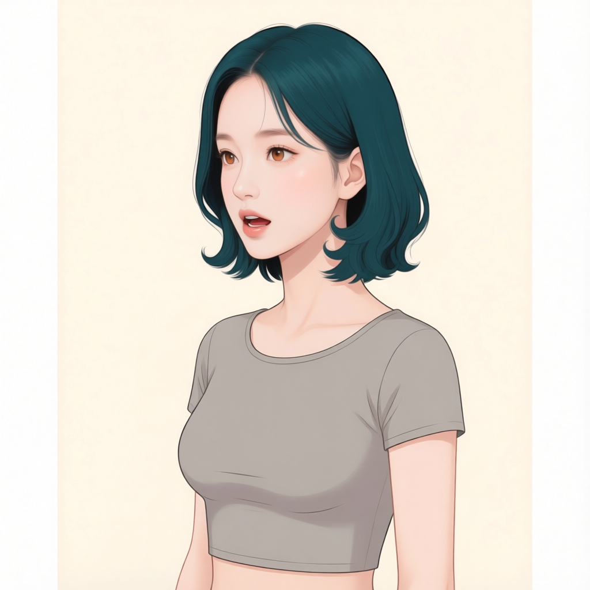](training-images/p7-5-11-mira-v2-expression-02.png) |  | **확대 검수 보류** 벌어진 입과 사선 방향은 이어진다. 눈썹 움직임, 몸 비례와 목 길이의 세부 대응을 확인한다. |
| **P711-IN-068** bfs-input-24-oil-painting |  |  | **확대 검수 보류** 벌어진 입과 사선 방향은 이어진다. 눈썹 움직임, 몸 비례와 목 길이의 세부 대응을 확인한다. |
| **P711-IN-112** bfs-input-24-soft-photo |  |  | **확대 검수 보류** 벌어진 입과 사선 방향은 이어진다. 눈썹 움직임, 몸 비례와 목 길이의 세부 대응을 확인한다. |
| **P711-IN-156** bfs-input-24-watercolor |  | [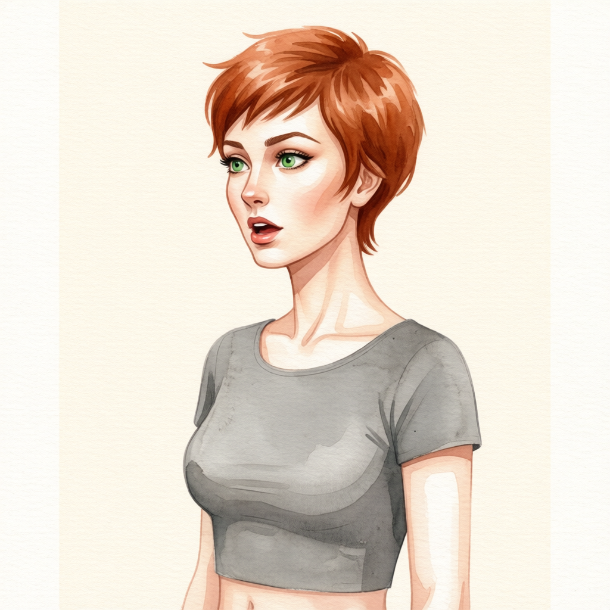](input-images/bfs-input-24-watercolor.png) | **확대 검수 보류** 벌어진 입과 사선 방향은 이어진다. 눈썹 움직임, 몸 비례와 목 길이의 세부 대응을 확인한다. |
| **P711-IN-200** bfs-input-24-clay-render |  |  | **확대 검수 보류** 벌어진 입과 사선 방향은 이어진다. 눈썹 움직임, 몸 비례와 목 길이의 세부 대응을 확인한다. |

## target-25

| 관리번호 · 입력 ID | Mira 목표 | 생성 입력 후보 | 현재 검수 의견 |
| --- | --- | --- | --- |
| **P711-IN-025** bfs-input-25-oil-painting |  | [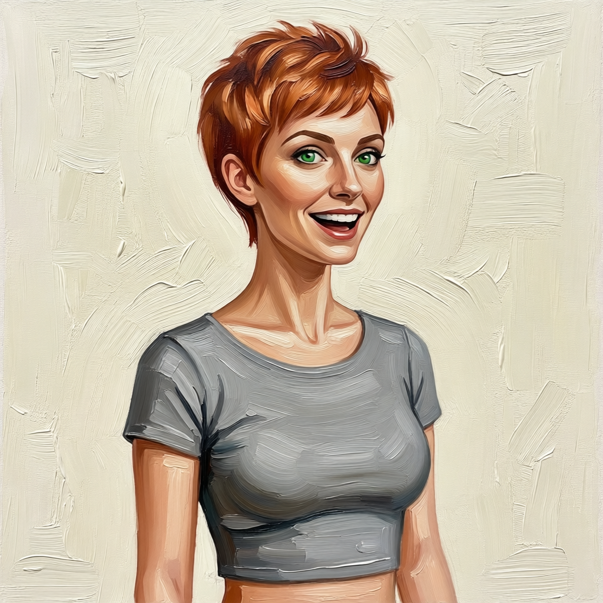](input-images/bfs-input-25-oil-painting.png) | **확대 검수 보류** 치아가 보이는 미소는 이어지나 목표보다 눈을 더 크게 뜨고 입 벌림도 달라져 표정 보존을 추가 확인한다. |
| **P711-IN-069** bfs-input-25-soft-photo |  |  | **확대 검수 보류** 치아가 보이는 미소는 이어지나 목표보다 눈을 더 크게 뜨고 입 벌림도 달라져 표정 보존을 추가 확인한다. |
| **P711-IN-113** bfs-input-25-watercolor |  | [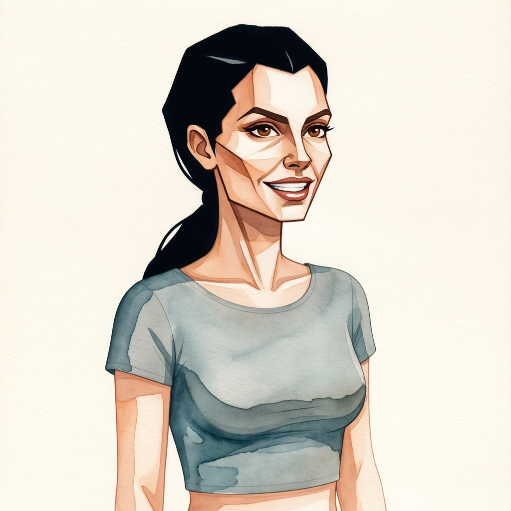](input-images/bfs-input-25-watercolor.png) | **확대 검수 보류** 치아가 보이는 미소는 이어지나 목표보다 눈을 더 크게 뜨고 입 벌림도 달라져 표정 보존을 추가 확인한다. |
| **P711-IN-157** bfs-input-25-clay-render |  | [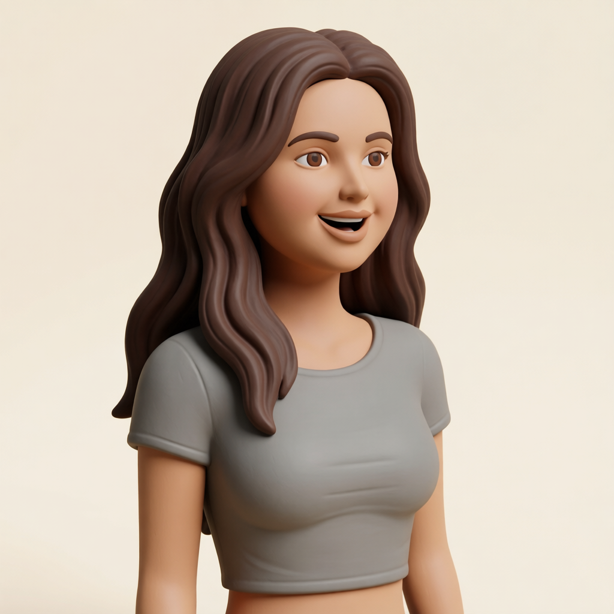](input-images/bfs-input-25-clay-render.png) | **확대 검수 보류** 치아가 보이는 미소는 이어지나 목표보다 눈을 더 크게 뜨고 입 벌림도 달라져 표정 보존을 추가 확인한다. |
| **P711-IN-201** bfs-input-25-ink-illustration |  |  | **확대 검수 보류** 치아가 보이는 미소는 이어지나 목표보다 눈을 더 크게 뜨고 입 벌림도 달라져 표정 보존을 추가 확인한다. |

## target-27

| 관리번호 · 입력 ID | Mira 목표 | 생성 입력 후보 | 현재 검수 의견 |
| --- | --- | --- | --- |
| **P711-IN-027** bfs-input-27-watercolor | [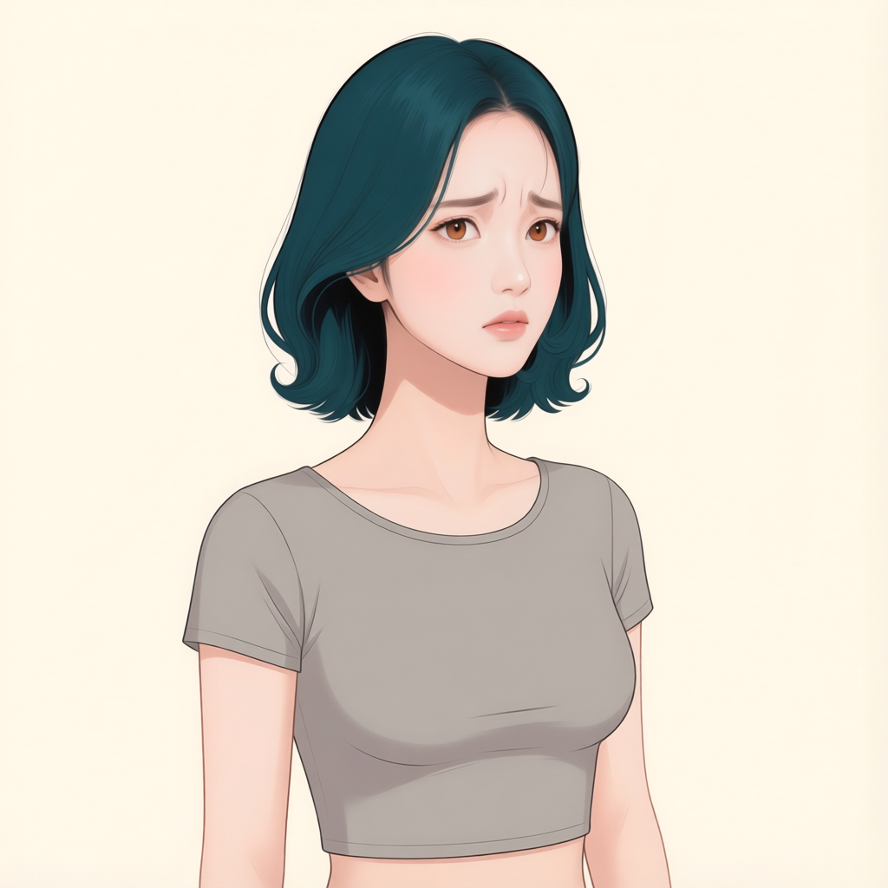](training-images/p7-5-11-mira-v2-expression-05.png) | [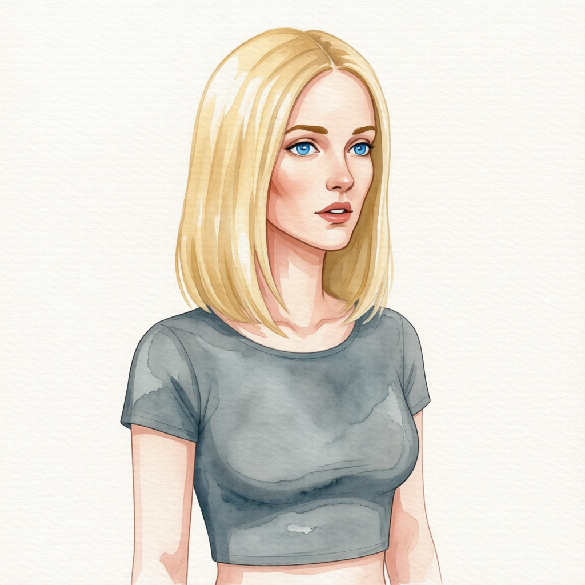](input-images/bfs-input-27-watercolor.png) | **확대 검수 보류** 목표의 올라간 안쪽 눈썹과 처진 입꼬리가 입력에서 약해지거나 다른 표정으로 보인다. |
| **P711-IN-071** bfs-input-27-clay-render |  |  | **확대 검수 보류** 목표의 올라간 안쪽 눈썹과 처진 입꼬리가 입력에서 약해지거나 다른 표정으로 보인다. |
| **P711-IN-115** bfs-input-27-ink-illustration |  |  | **확대 검수 보류** 목표의 올라간 안쪽 눈썹과 처진 입꼬리가 입력에서 약해지거나 다른 표정으로 보인다. |
| **P711-IN-159** bfs-input-27-oil-painting |  |  | **확대 검수 보류** 목표의 올라간 안쪽 눈썹과 처진 입꼬리가 입력에서 약해지거나 다른 표정으로 보인다. |
| **P711-IN-203** bfs-input-27-soft-photo |  |  | **확대 검수 보류** 목표의 올라간 안쪽 눈썹과 처진 입꼬리가 입력에서 약해지거나 다른 표정으로 보인다. |

## target-29

| 관리번호 · 입력 ID | Mira 목표 | 생성 입력 후보 | 현재 검수 의견 |
| --- | --- | --- | --- |
| **P711-IN-029** bfs-input-29-ink-illustration |  |  | **확대 검수 보류** 놀란 입 모양이 이어지는 후보도 있으나 원형 입·눈썹 모양이 입력에 따라 달라져 추가 검수가 필요하다. |
| **P711-IN-073** bfs-input-29-oil-painting |  |  | **확대 검수 보류** 놀란 입 모양이 이어지는 후보도 있으나 원형 입·눈썹 모양이 입력에 따라 달라져 추가 검수가 필요하다. |
| **P711-IN-117** bfs-input-29-soft-photo |  |  | **확대 검수 보류** 놀란 입 모양이 이어지는 후보도 있으나 원형 입·눈썹 모양이 입력에 따라 달라져 추가 검수가 필요하다. |
| **P711-IN-161** bfs-input-29-watercolor |  |  | **확대 검수 보류** 놀란 입 모양이 이어지는 후보도 있으나 원형 입·눈썹 모양이 입력에 따라 달라져 추가 검수가 필요하다. |
| **P711-IN-205** bfs-input-29-clay-render |  | [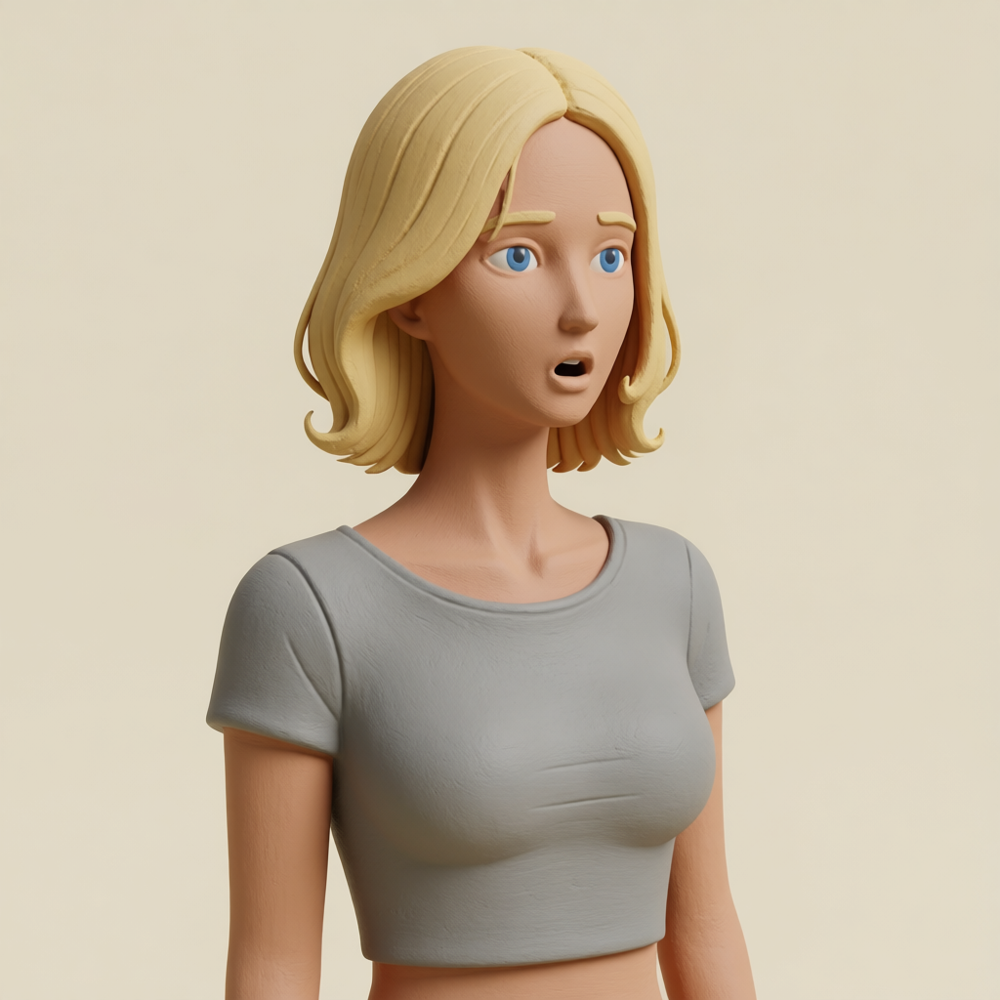](input-images/bfs-input-29-clay-render.png) | **확대 검수 보류** 놀란 입 모양이 이어지는 후보도 있으나 원형 입·눈썹 모양이 입력에 따라 달라져 추가 검수가 필요하다. |

## target-30

| 관리번호 · 입력 ID | Mira 목표 | 생성 입력 후보 | 현재 검수 의견 |
| --- | --- | --- | --- |
| **P711-IN-030** bfs-input-30-oil-painting |  |  | **확대 검수 보류** 정면·회색 상의는 이어진다. 목선·몸 비례와 조명 차이가 단순 화풍 차이인지 확인한다. |
| **P711-IN-074** bfs-input-30-soft-photo |  |  | **확대 검수 보류** 정면·회색 상의는 이어진다. 목선·몸 비례와 조명 차이가 단순 화풍 차이인지 확인한다. |
| **P711-IN-118** bfs-input-30-watercolor |  | [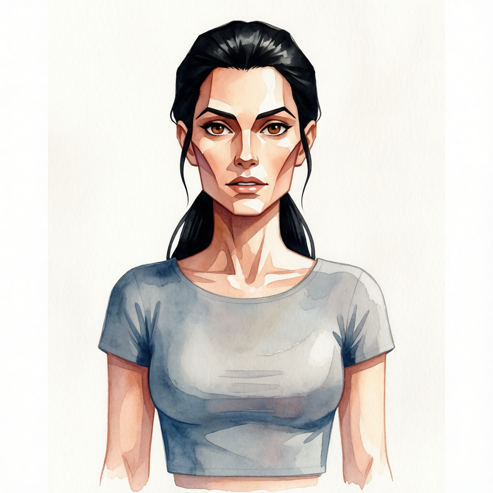](input-images/bfs-input-30-watercolor.png) | **확대 검수 보류** 정면·회색 상의는 이어진다. 목선·몸 비례와 조명 차이가 단순 화풍 차이인지 확인한다. |
| **P711-IN-162** bfs-input-30-clay-render |  | [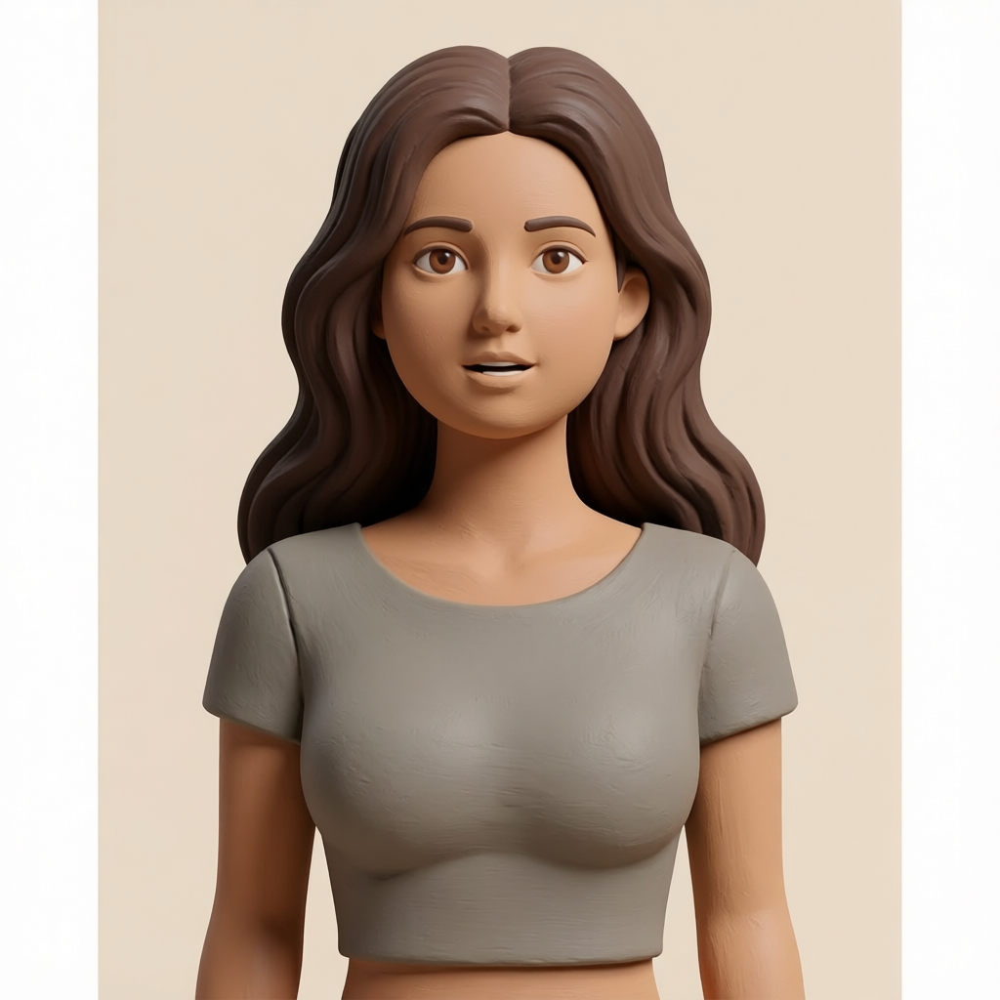](input-images/bfs-input-30-clay-render.png) | **확대 검수 보류** 정면·회색 상의는 이어진다. 목선·몸 비례와 조명 차이가 단순 화풍 차이인지 확인한다. |
| **P711-IN-206** bfs-input-30-ink-illustration |  | [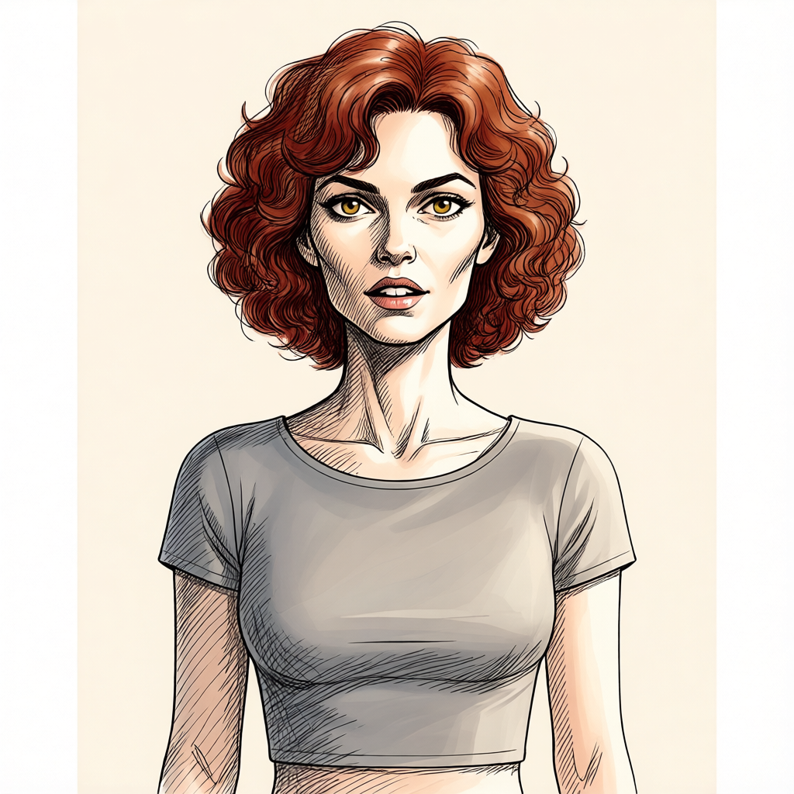](input-images/bfs-input-30-ink-illustration.png) | **확대 검수 보류** 정면·회색 상의는 이어진다. 목선·몸 비례와 조명 차이가 단순 화풍 차이인지 확인한다. |

## target-31

| 관리번호 · 입력 ID | Mira 목표 | 생성 입력 후보 | 현재 검수 의견 |
| --- | --- | --- | --- |
| **P711-IN-031** bfs-input-31-soft-photo |  |  | **확대 검수 보류** 창가 사선 인물과 창틀이 기준이다. 수채화는 창 배경이 사라졌고 다른 입력은 표정과 그림자 대응을 확인한다. |
| **P711-IN-119** bfs-input-31-clay-render |  |  | **확대 검수 보류** 창가 사선 인물과 창틀이 기준이다. 수채화는 창 배경이 사라졌고 다른 입력은 표정과 그림자 대응을 확인한다. |
| **P711-IN-163** bfs-input-31-ink-illustration |  | [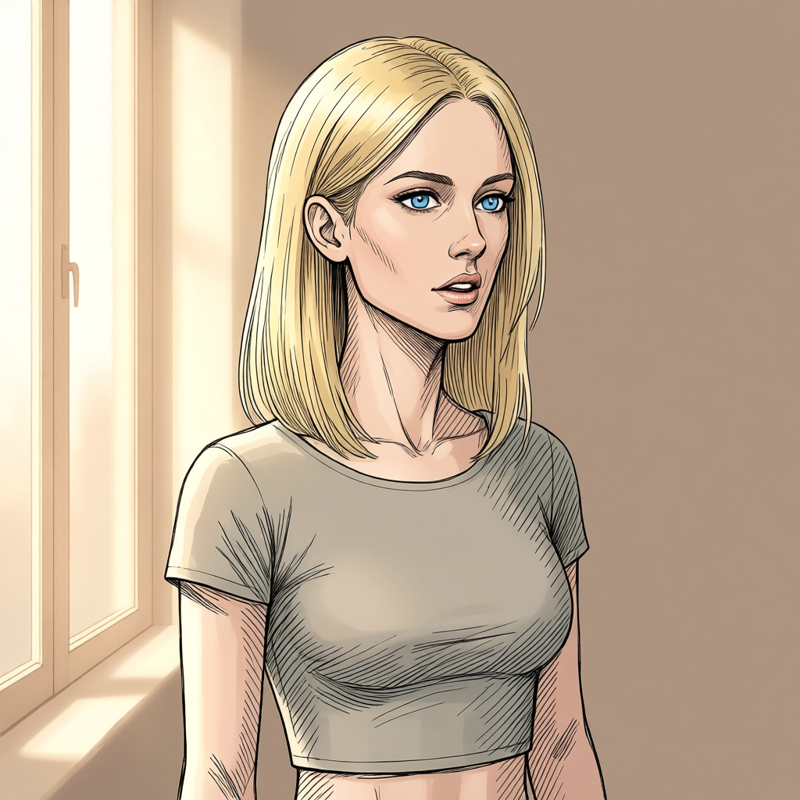](input-images/bfs-input-31-ink-illustration.png) | **확대 검수 보류** 창가 사선 인물과 창틀이 기준이다. 수채화는 창 배경이 사라졌고 다른 입력은 표정과 그림자 대응을 확인한다. |
| **P711-IN-207** bfs-input-31-oil-painting |  |  | **확대 검수 보류** 창가 사선 인물과 창틀이 기준이다. 수채화는 창 배경이 사라졌고 다른 입력은 표정과 그림자 대응을 확인한다. |

## target-32

| 관리번호 · 입력 ID | Mira 목표 | 생성 입력 후보 | 현재 검수 의견 |
| --- | --- | --- | --- |
| **P711-IN-076** bfs-input-32-clay-render | [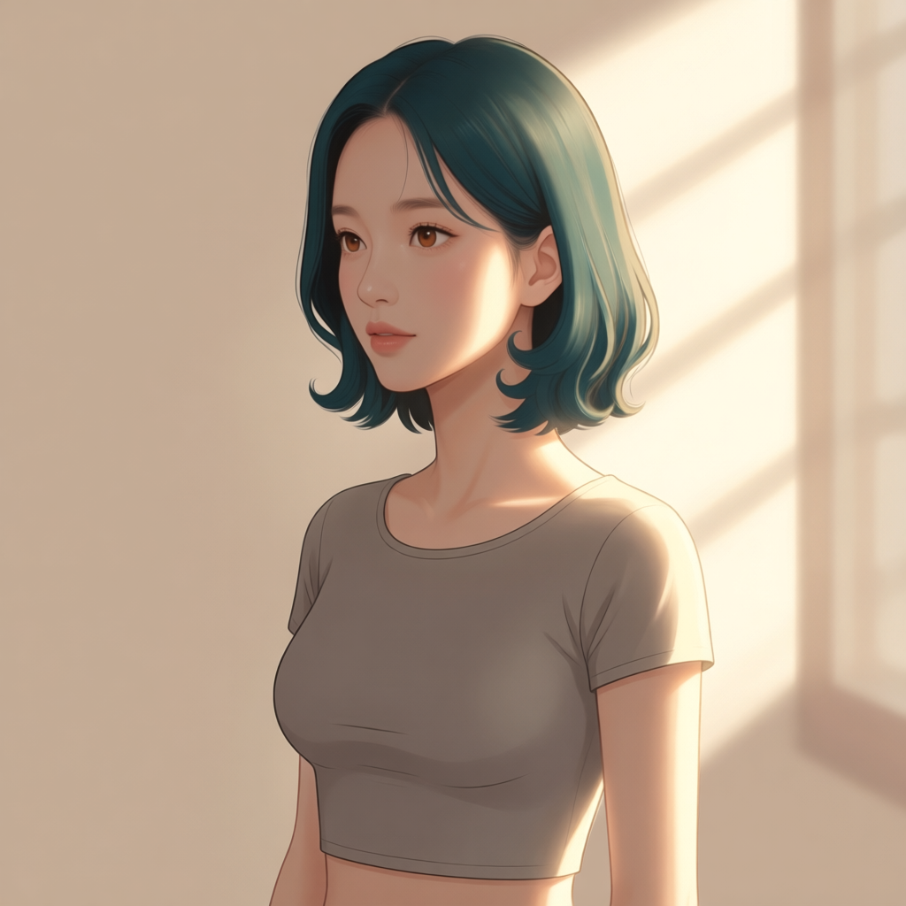](training-images/p7-5-11-mira-v2-lighting-03.png) |  | **확대 검수 보류** 창틀 그림자가 있는 역광 장면이다. 수채화·펜화는 배경의 창 그림자가 사라졌다. |
| **P711-IN-164** bfs-input-32-oil-painting |  |  | **확대 검수 보류** 창틀 그림자가 있는 역광 장면이다. 수채화·펜화는 배경의 창 그림자가 사라졌다. |
| **P711-IN-208** bfs-input-32-soft-photo |  | [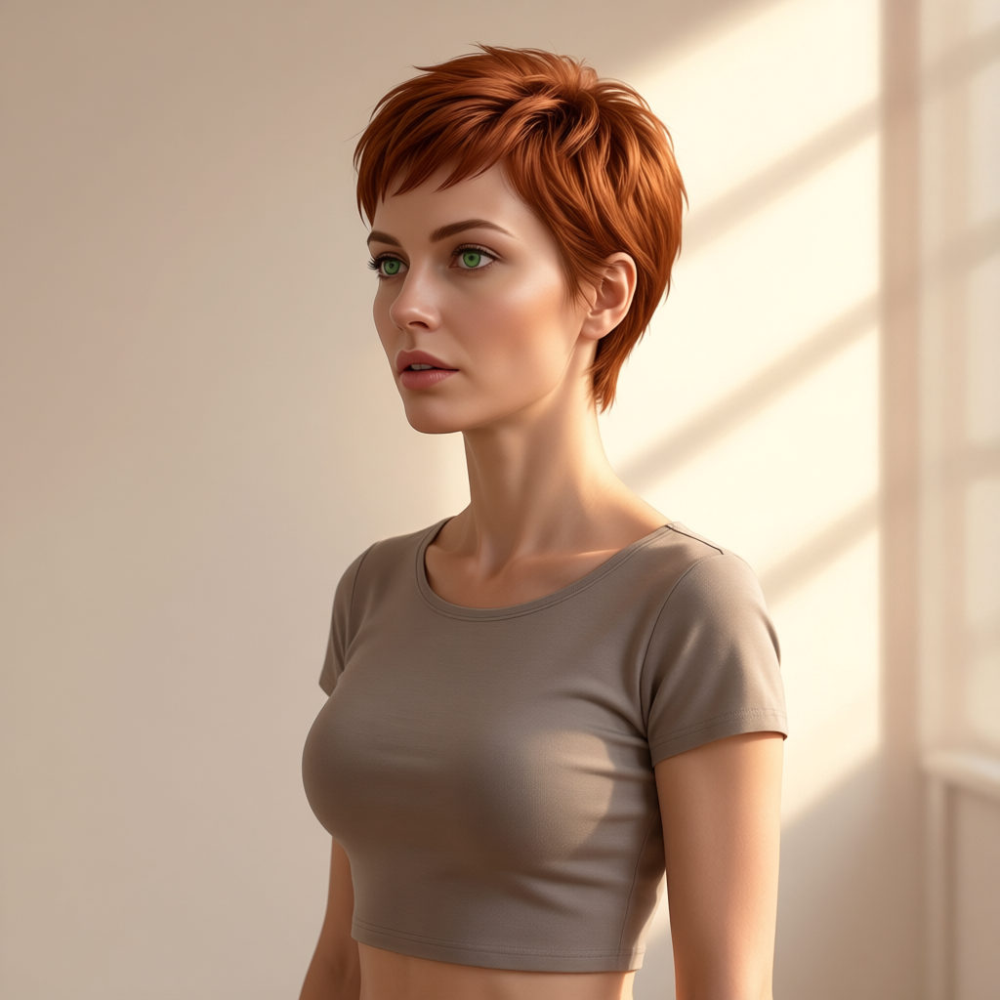](input-images/bfs-input-32-soft-photo.png) | **확대 검수 보류** 창틀 그림자가 있는 역광 장면이다. 수채화·펜화는 배경의 창 그림자가 사라졌다. |

## target-33

| 관리번호 · 입력 ID | Mira 목표 | 생성 입력 후보 | 현재 검수 의견 |
| --- | --- | --- | --- |
| **P711-IN-033** bfs-input-33-clay-render |  |  | **확대 검수 보류** 정면·회색 상의는 이어진다. 상체 굴곡·배경의 밝은 띠·입 벌림의 대응을 확인한다. |
| **P711-IN-077** bfs-input-33-ink-illustration |  |  | **확대 검수 보류** 정면·회색 상의는 이어진다. 상체 굴곡·배경의 밝은 띠·입 벌림의 대응을 확인한다. |
| **P711-IN-121** bfs-input-33-oil-painting |  |  | **확대 검수 보류** 정면·회색 상의는 이어진다. 상체 굴곡·배경의 밝은 띠·입 벌림의 대응을 확인한다. |
| **P711-IN-165** bfs-input-33-soft-photo |  |  | **확대 검수 보류** 정면·회색 상의는 이어진다. 상체 굴곡·배경의 밝은 띠·입 벌림의 대응을 확인한다. |
| **P711-IN-209** bfs-input-33-watercolor |  |  | **확대 검수 보류** 정면·회색 상의는 이어진다. 상체 굴곡·배경의 밝은 띠·입 벌림의 대응을 확인한다. |

## target-34

| 관리번호 · 입력 ID | Mira 목표 | 생성 입력 후보 | 현재 검수 의견 |
| --- | --- | --- | --- |
| **P711-IN-034** bfs-input-34-ink-illustration |  |  | **확대 검수 보류** 푸른 실내 조명이 기준이다. 수채화는 밝은 종이 여백으로 바뀌고 다른 입력은 창틀·빛 배치의 대응을 확인한다. |
| **P711-IN-078** bfs-input-34-oil-painting |  |  | **확대 검수 보류** 푸른 실내 조명이 기준이다. 수채화는 밝은 종이 여백으로 바뀌고 다른 입력은 창틀·빛 배치의 대응을 확인한다. |
| **P711-IN-122** bfs-input-34-soft-photo |  |  | **확대 검수 보류** 푸른 실내 조명이 기준이다. 수채화는 밝은 종이 여백으로 바뀌고 다른 입력은 창틀·빛 배치의 대응을 확인한다. |
| **P711-IN-166** bfs-input-34-watercolor |  | [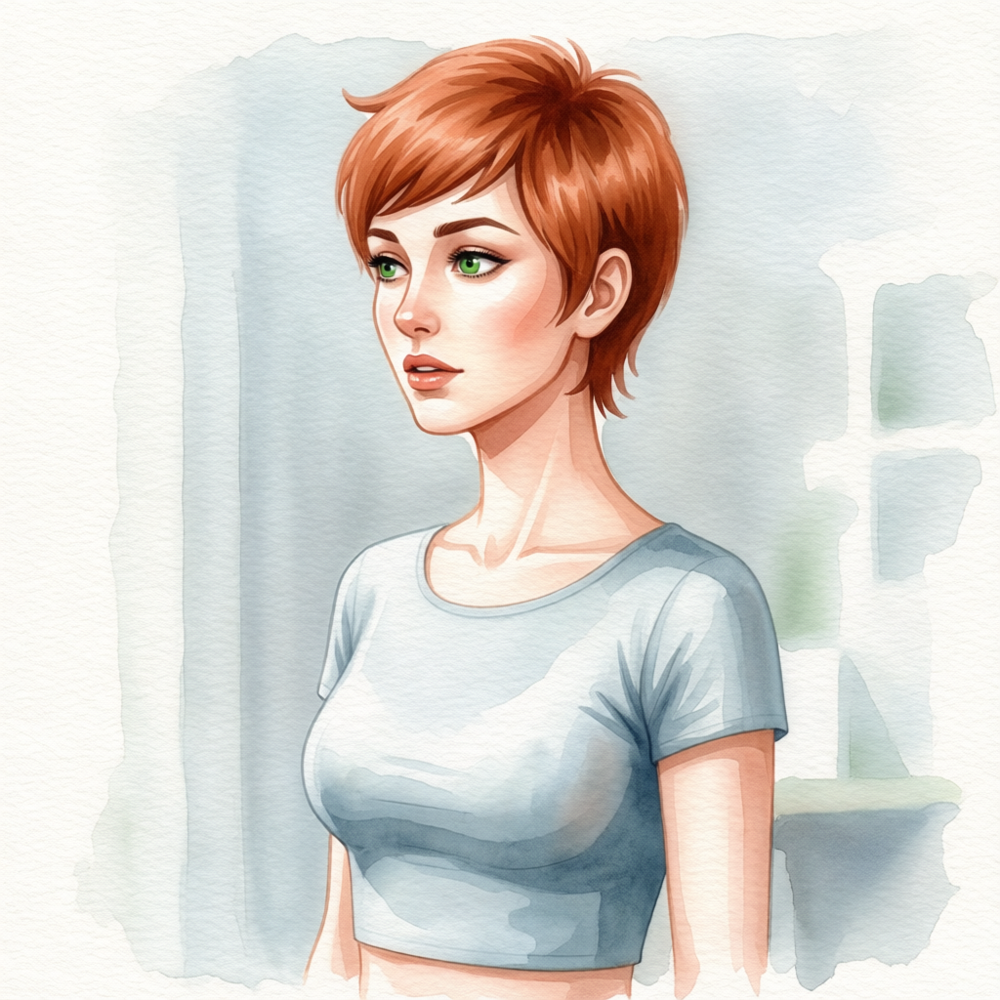](input-images/bfs-input-34-watercolor.png) | **확대 검수 보류** 푸른 실내 조명이 기준이다. 수채화는 밝은 종이 여백으로 바뀌고 다른 입력은 창틀·빛 배치의 대응을 확인한다. |
| **P711-IN-210** bfs-input-34-clay-render |  | [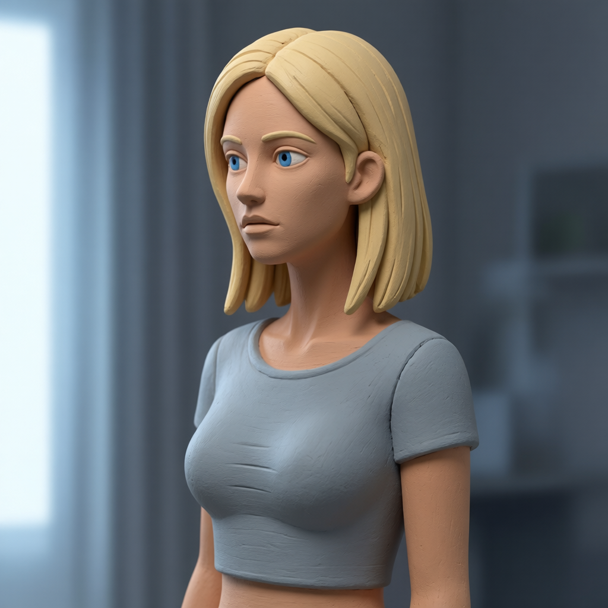](input-images/bfs-input-34-clay-render.png) | **확대 검수 보류** 푸른 실내 조명이 기준이다. 수채화는 밝은 종이 여백으로 바뀌고 다른 입력은 창틀·빛 배치의 대응을 확인한다. |

## target-35

| 관리번호 · 입력 ID | Mira 목표 | 생성 입력 후보 | 현재 검수 의견 |
| --- | --- | --- | --- |
| **P711-IN-035** bfs-input-35-oil-painting |  | [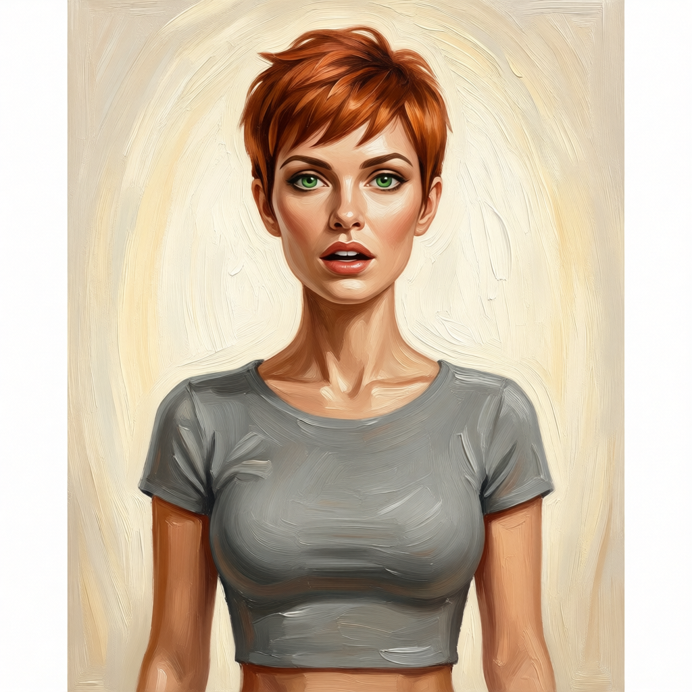](input-images/bfs-input-35-oil-painting.png) | **확대 검수 보류** 역광 윤곽이 입력마다 약해지거나 정면 조명으로 보인다. 조명 보존과 화풍 전환의 허용 범위를 확인한다. |
| **P711-IN-079** bfs-input-35-soft-photo |  |  | **확대 검수 보류** 역광 윤곽이 입력마다 약해지거나 정면 조명으로 보인다. 조명 보존과 화풍 전환의 허용 범위를 확인한다. |
| **P711-IN-123** bfs-input-35-watercolor |  | [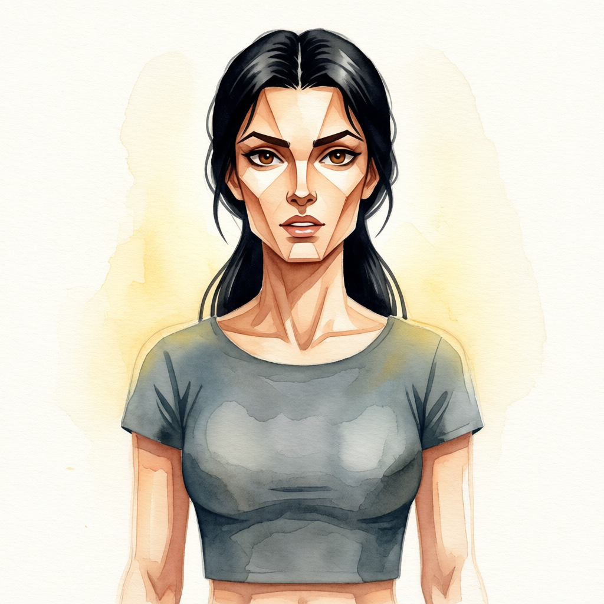](input-images/bfs-input-35-watercolor.png) | **확대 검수 보류** 역광 윤곽이 입력마다 약해지거나 정면 조명으로 보인다. 조명 보존과 화풍 전환의 허용 범위를 확인한다. |
| **P711-IN-167** bfs-input-35-clay-render |  | [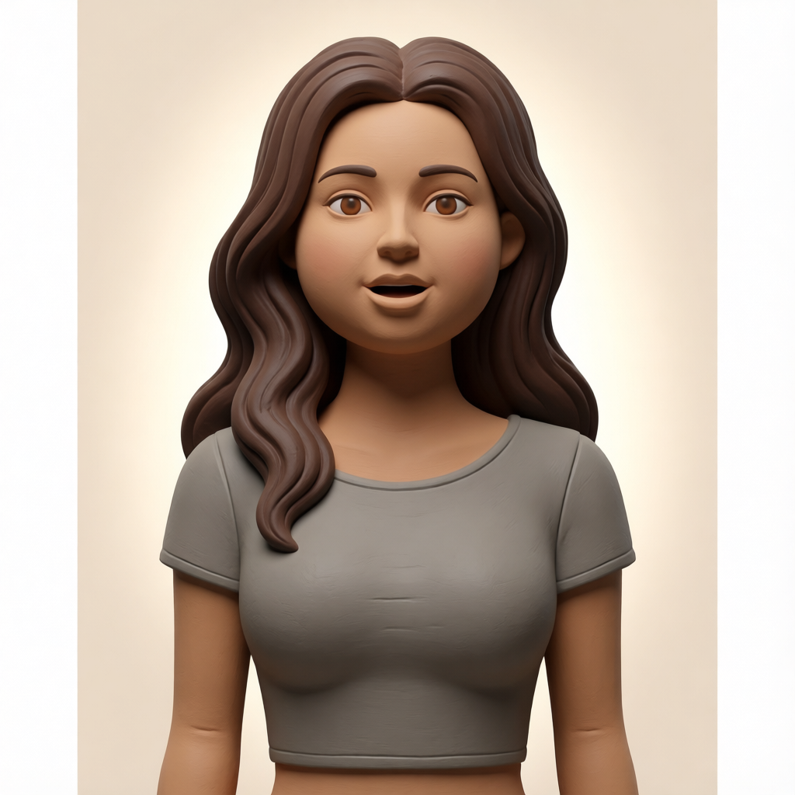](input-images/bfs-input-35-clay-render.png) | **확대 검수 보류** 역광 윤곽이 입력마다 약해지거나 정면 조명으로 보인다. 조명 보존과 화풍 전환의 허용 범위를 확인한다. |
| **P711-IN-211** bfs-input-35-ink-illustration |  |  | **확대 검수 보류** 역광 윤곽이 입력마다 약해지거나 정면 조명으로 보인다. 조명 보존과 화풍 전환의 허용 범위를 확인한다. |

## target-36

| 관리번호 · 입력 ID | Mira 목표 | 생성 입력 후보 | 현재 검수 의견 |
| --- | --- | --- | --- |
| **P711-IN-036** bfs-input-36-soft-photo | [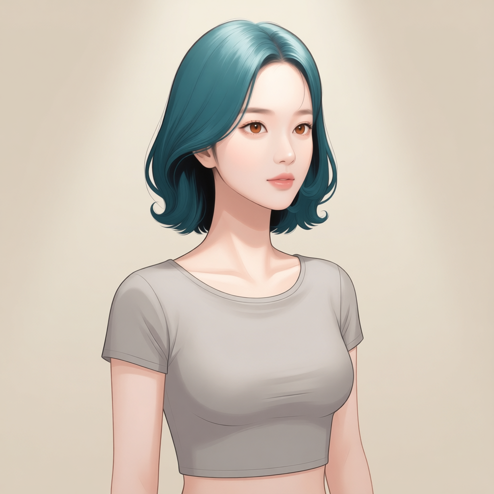](training-images/p7-5-11-mira-v2-lighting-08.png) |  | **확대 검수 보류** 사선·회색 상의는 이어진다. 얼굴과 상의의 하이라이트·몸 굴곡·입 벌림을 추가 확인한다. |
| **P711-IN-080** bfs-input-36-watercolor |  |  | **확대 검수 보류** 사선·회색 상의는 이어진다. 얼굴과 상의의 하이라이트·몸 굴곡·입 벌림을 추가 확인한다. |
| **P711-IN-124** bfs-input-36-clay-render |  |  | **확대 검수 보류** 사선·회색 상의는 이어진다. 얼굴과 상의의 하이라이트·몸 굴곡·입 벌림을 추가 확인한다. |
| **P711-IN-168** bfs-input-36-ink-illustration |  |  | **확대 검수 보류** 사선·회색 상의는 이어진다. 얼굴과 상의의 하이라이트·몸 굴곡·입 벌림을 추가 확인한다. |
| **P711-IN-212** bfs-input-36-oil-painting |  | [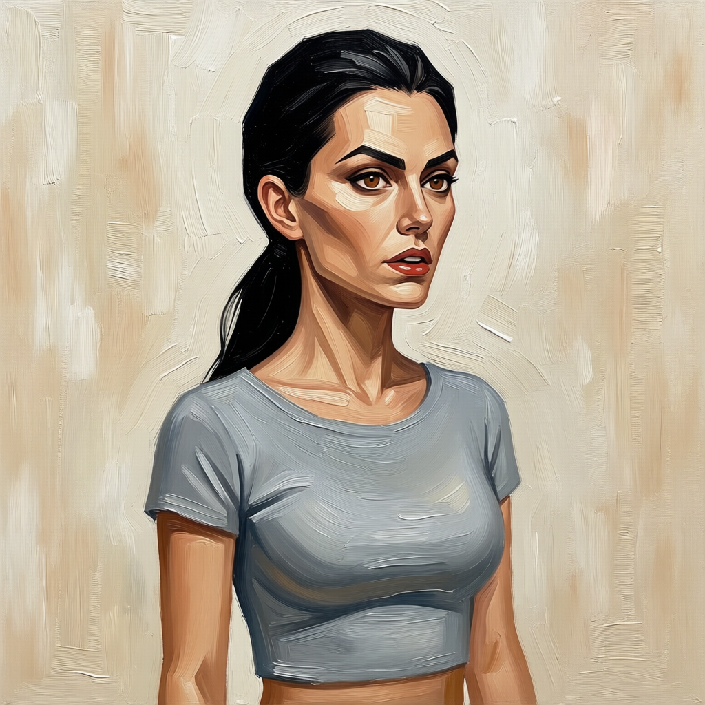](input-images/bfs-input-36-oil-painting.png) | **확대 검수 보류** 사선·회색 상의는 이어진다. 얼굴과 상의의 하이라이트·몸 굴곡·입 벌림을 추가 확인한다. |

## target-37

| 관리번호 · 입력 ID | Mira 목표 | 생성 입력 후보 | 현재 검수 의견 |
| --- | --- | --- | --- |
| **P711-IN-037** bfs-input-37-watercolor | [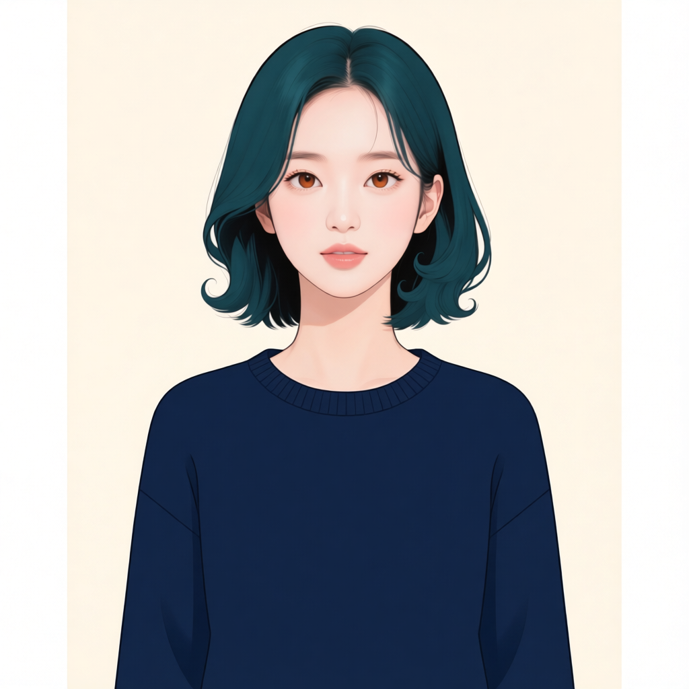](training-images/p7-5-11-mira-v2-outfit-01.png) |  | **확대 검수 보류** 정면 남색 스웨터와 단순 배경이 기준이다. 사진풍·펜화는 확대 비교했고 나머지는 목선·입 벌림을 추가 확인한다. |
| **P711-IN-081** bfs-input-37-clay-render |  | [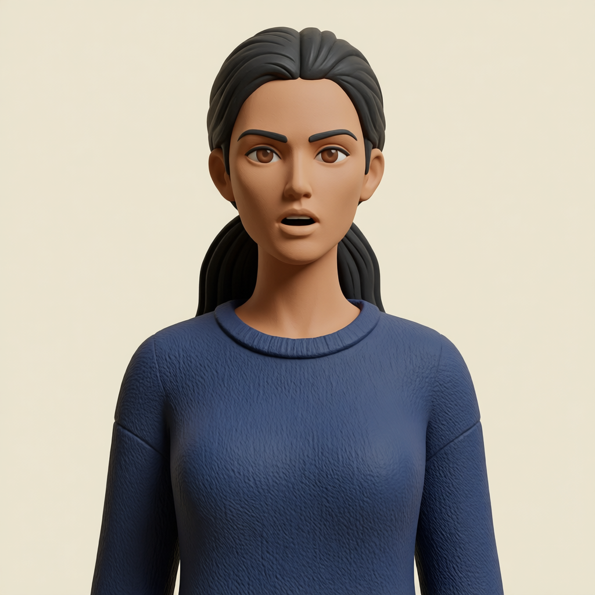](input-images/bfs-input-37-clay-render.png) | **확대 검수 보류** 정면 남색 스웨터와 단순 배경이 기준이다. 사진풍·펜화는 확대 비교했고 나머지는 목선·입 벌림을 추가 확인한다. |
| **P711-IN-125** bfs-input-37-ink-illustration |  | [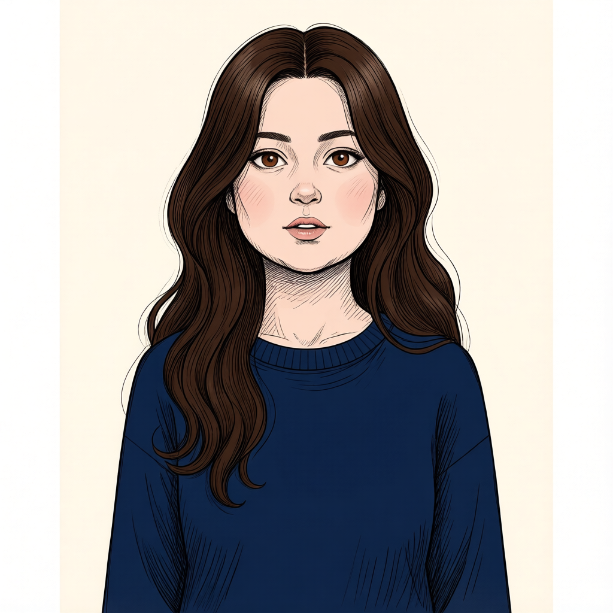](input-images/bfs-input-37-ink-illustration.png) | **실험용 채택** 확대 비교에서 정면·열린 눈·약하게 벌어진 입, 남색 스웨터와 상반신 배치가 대응하고 얼굴·긴 머리·펜화 표현으로 변환됐다. 미세한 입 벌림·의복 선 차이를 허용한 질적 후보 채택이다. |
| **P711-IN-169** bfs-input-37-oil-painting |  | [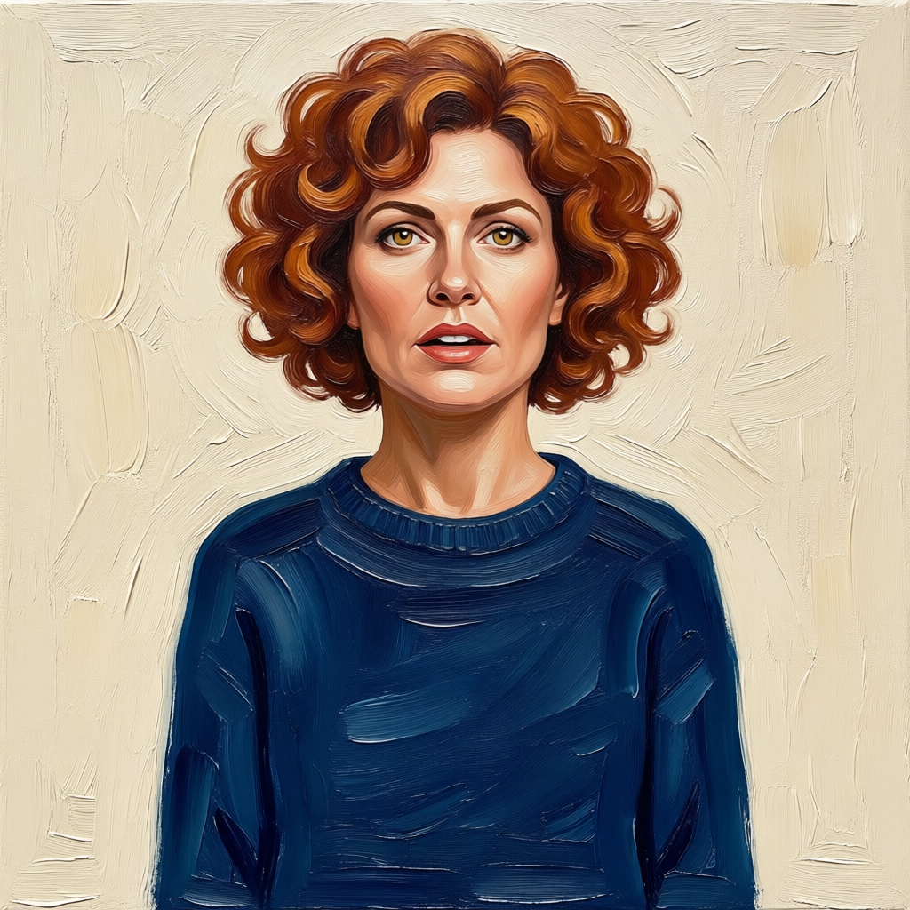](input-images/bfs-input-37-oil-painting.png) | **확대 검수 보류** 정면 남색 스웨터와 단순 배경이 기준이다. 사진풍·펜화는 확대 비교했고 나머지는 목선·입 벌림을 추가 확인한다. |
| **P711-IN-213** bfs-input-37-soft-photo |  | [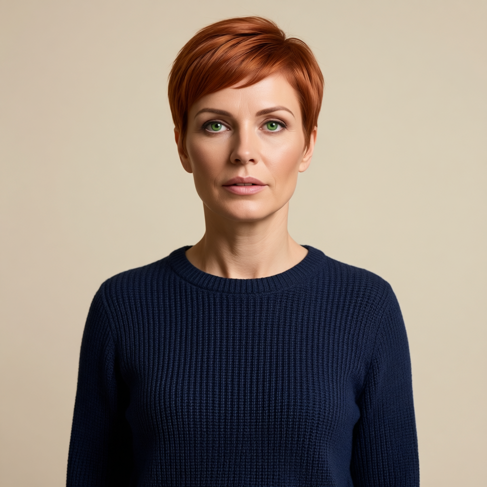](input-images/bfs-input-37-soft-photo.png) | **실험용 채택** 확대 비교에서 정면·열린 눈·약하게 벌어진 입과 남색 둥근 목 스웨터·상반신 배치가 대체로 대응한다. 얼굴·헤어와 사진 표현은 달라졌다. 목선의 세부 차이가 있어 첫 학습 후보로만 채택하며 정밀 정렬을 보장하지 않는다. |

## target-38

| 관리번호 · 입력 ID | Mira 목표 | 생성 입력 후보 | 현재 검수 의견 |
| --- | --- | --- | --- |
| **P711-IN-038** bfs-input-38-clay-render | [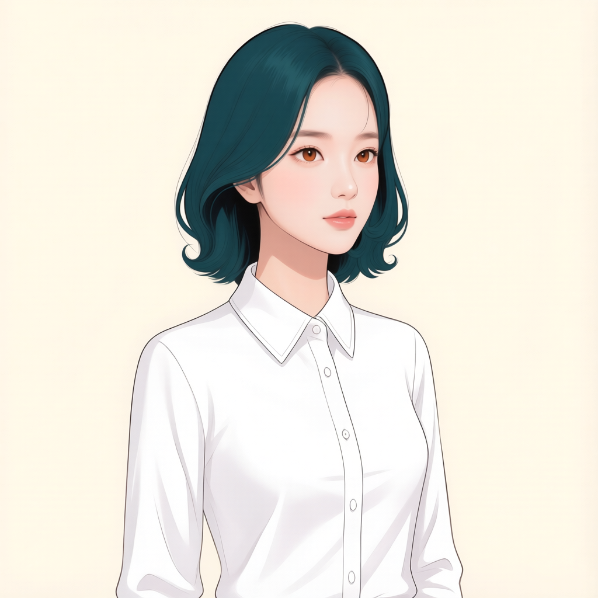](training-images/p7-5-11-mira-v2-outfit-02.png) |  | **확대 검수 보류** 흰 셔츠의 칼라·단추와 사선 방향이 이어진다. 입력별 입 벌림과 목 비례를 확인한다. |
| **P711-IN-082** bfs-input-38-ink-illustration |  |  | **확대 검수 보류** 흰 셔츠의 칼라·단추와 사선 방향이 이어진다. 입력별 입 벌림과 목 비례를 확인한다. |
| **P711-IN-126** bfs-input-38-oil-painting |  |  | **확대 검수 보류** 흰 셔츠의 칼라·단추와 사선 방향이 이어진다. 입력별 입 벌림과 목 비례를 확인한다. |
| **P711-IN-170** bfs-input-38-soft-photo |  | [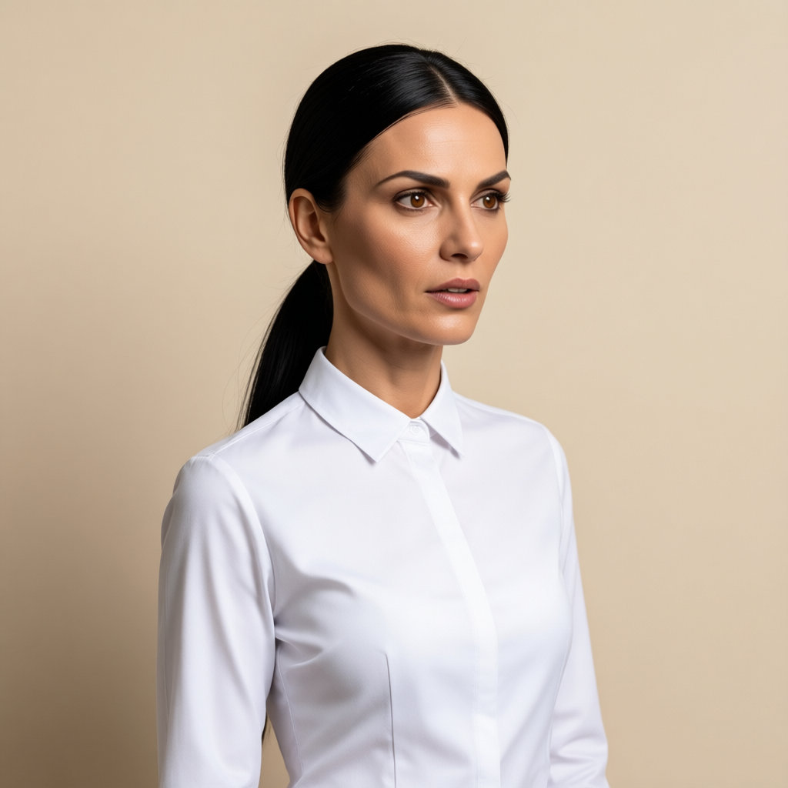](input-images/bfs-input-38-soft-photo.png) | **확대 검수 보류** 흰 셔츠의 칼라·단추와 사선 방향이 이어진다. 입력별 입 벌림과 목 비례를 확인한다. |
| **P711-IN-214** bfs-input-38-watercolor |  | [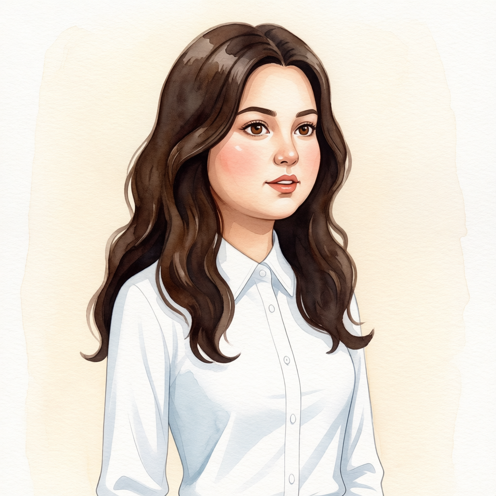](input-images/bfs-input-38-watercolor.png) | **확대 검수 보류** 흰 셔츠의 칼라·단추와 사선 방향이 이어진다. 입력별 입 벌림과 목 비례를 확인한다. |

## target-39

| 관리번호 · 입력 ID | Mira 목표 | 생성 입력 후보 | 현재 검수 의견 |
| --- | --- | --- | --- |
| **P711-IN-039** bfs-input-39-ink-illustration | [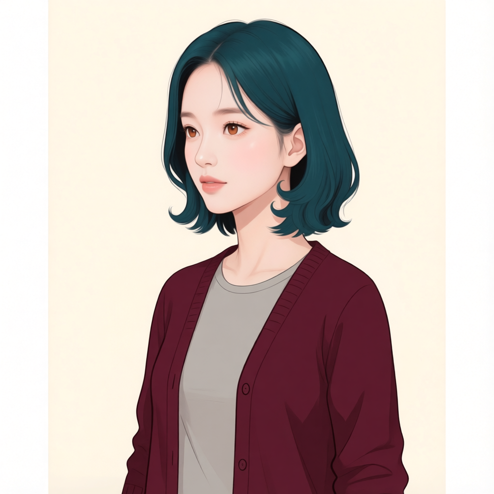](training-images/p7-5-11-mira-v2-outfit-03.png) |  | **확대 검수 보류** 버건디 카디건과 회색 이너·사선 방향이 이어진다. 눈썹·입꼬리가 표정 변화인지 외형 차이인지 확인한다. |
| **P711-IN-083** bfs-input-39-oil-painting |  | [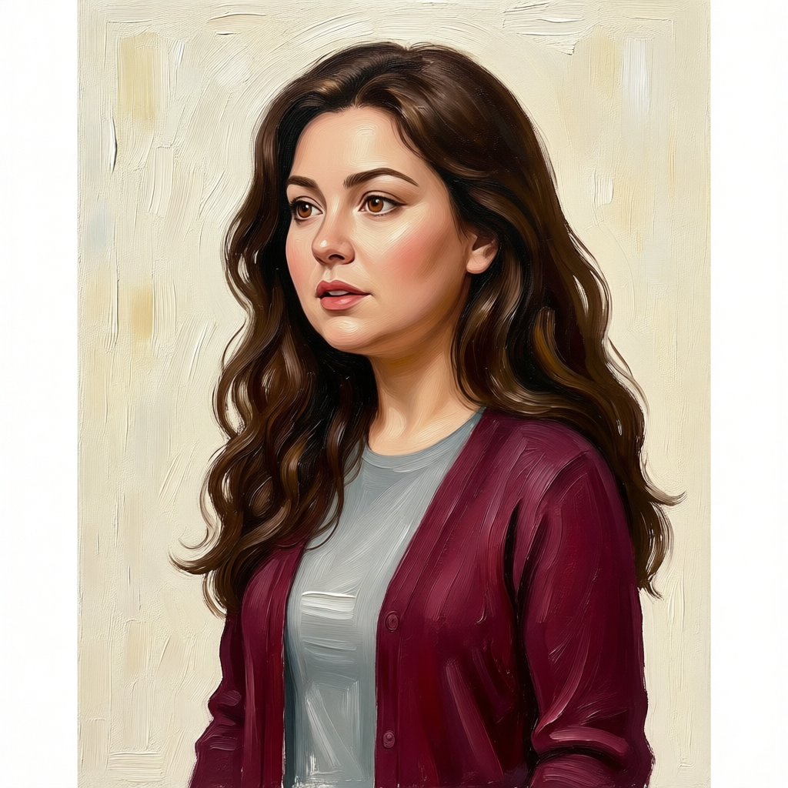](input-images/bfs-input-39-oil-painting.png) | **확대 검수 보류** 버건디 카디건과 회색 이너·사선 방향이 이어진다. 눈썹·입꼬리가 표정 변화인지 외형 차이인지 확인한다. |
| **P711-IN-127** bfs-input-39-soft-photo |  |  | **확대 검수 보류** 버건디 카디건과 회색 이너·사선 방향이 이어진다. 눈썹·입꼬리가 표정 변화인지 외형 차이인지 확인한다. |
| **P711-IN-171** bfs-input-39-watercolor |  | [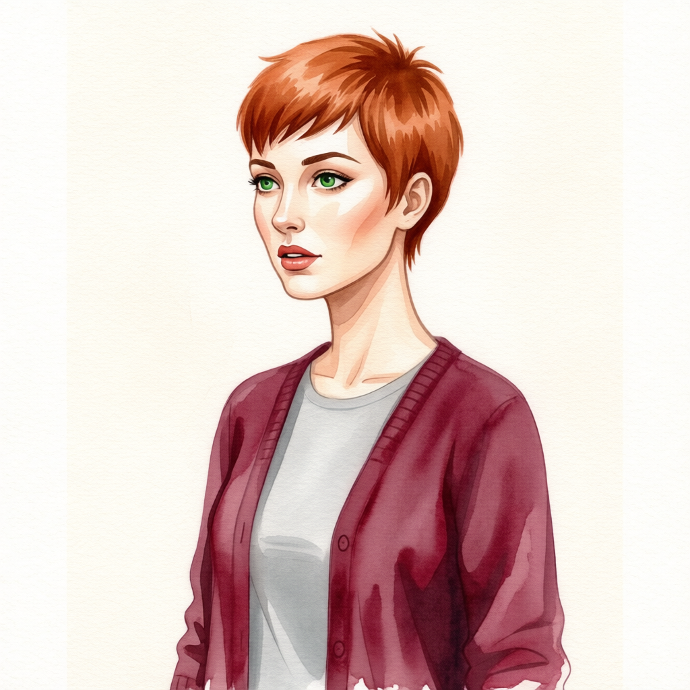](input-images/bfs-input-39-watercolor.png) | **확대 검수 보류** 버건디 카디건과 회색 이너·사선 방향이 이어진다. 눈썹·입꼬리가 표정 변화인지 외형 차이인지 확인한다. |
| **P711-IN-215** bfs-input-39-clay-render |  | [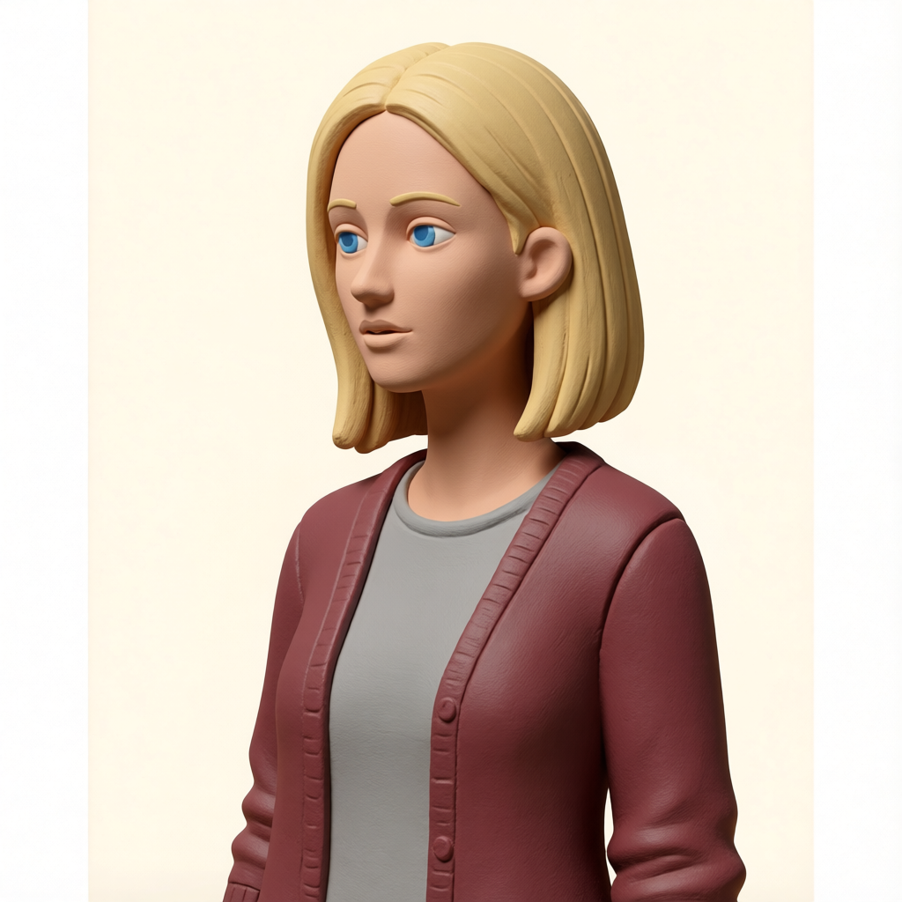](input-images/bfs-input-39-clay-render.png) | **확대 검수 보류** 버건디 카디건과 회색 이너·사선 방향이 이어진다. 눈썹·입꼬리가 표정 변화인지 외형 차이인지 확인한다. |

## target-40

| 관리번호 · 입력 ID | Mira 목표 | 생성 입력 후보 | 현재 검수 의견 |
| --- | --- | --- | --- |
| **P711-IN-040** bfs-input-40-oil-painting |  |  | **확대 검수 보류** 정면 재킷과 이너가 기준이다. 수채화의 얼굴 방향이 사선으로 바뀌었고 다른 입력은 단추·몸 비례를 확인한다. |
| **P711-IN-084** bfs-input-40-soft-photo |  |  | **확대 검수 보류** 정면 재킷과 이너가 기준이다. 수채화의 얼굴 방향이 사선으로 바뀌었고 다른 입력은 단추·몸 비례를 확인한다. |
| **P711-IN-172** bfs-input-40-clay-render |  | [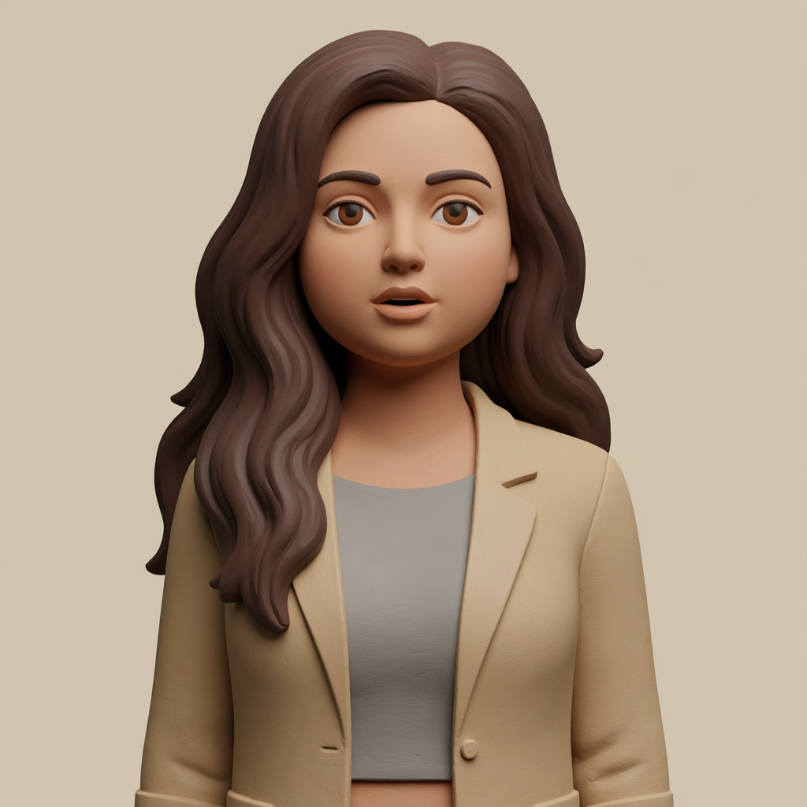](input-images/bfs-input-40-clay-render.png) | **확대 검수 보류** 정면 재킷과 이너가 기준이다. 수채화의 얼굴 방향이 사선으로 바뀌었고 다른 입력은 단추·몸 비례를 확인한다. |
| **P711-IN-216** bfs-input-40-ink-illustration |  |  | **확대 검수 보류** 정면 재킷과 이너가 기준이다. 수채화의 얼굴 방향이 사선으로 바뀌었고 다른 입력은 단추·몸 비례를 확인한다. |

## target-41

| 관리번호 · 입력 ID | Mira 목표 | 생성 입력 후보 | 현재 검수 의견 |
| --- | --- | --- | --- |
| **P711-IN-041** bfs-input-41-soft-photo | [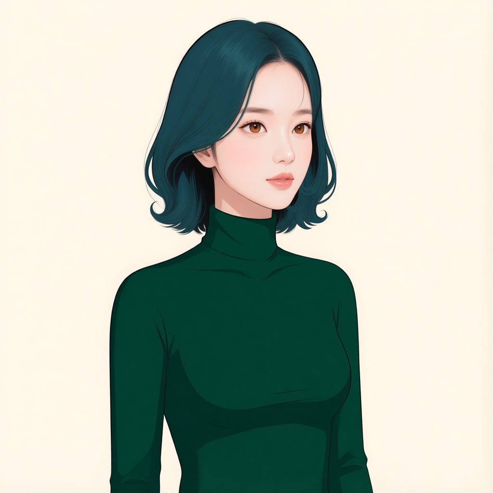](training-images/p7-5-11-mira-v2-outfit-05.png) | [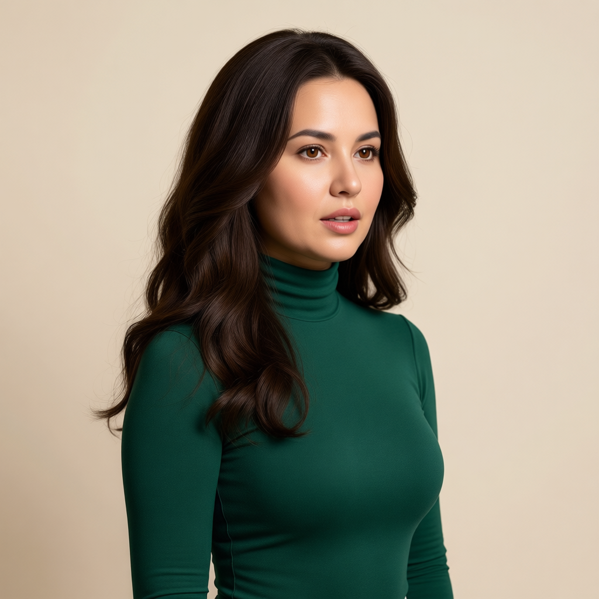](input-images/bfs-input-41-soft-photo.png) | **확대 검수 보류** 초록 터틀넥과 사선 방향은 이어진다. 몸 굴곡과 시선·입 벌림을 추가 확인한다. |
| **P711-IN-085** bfs-input-41-watercolor |  |  | **확대 검수 보류** 초록 터틀넥과 사선 방향은 이어진다. 몸 굴곡과 시선·입 벌림을 추가 확인한다. |
| **P711-IN-129** bfs-input-41-clay-render |  | [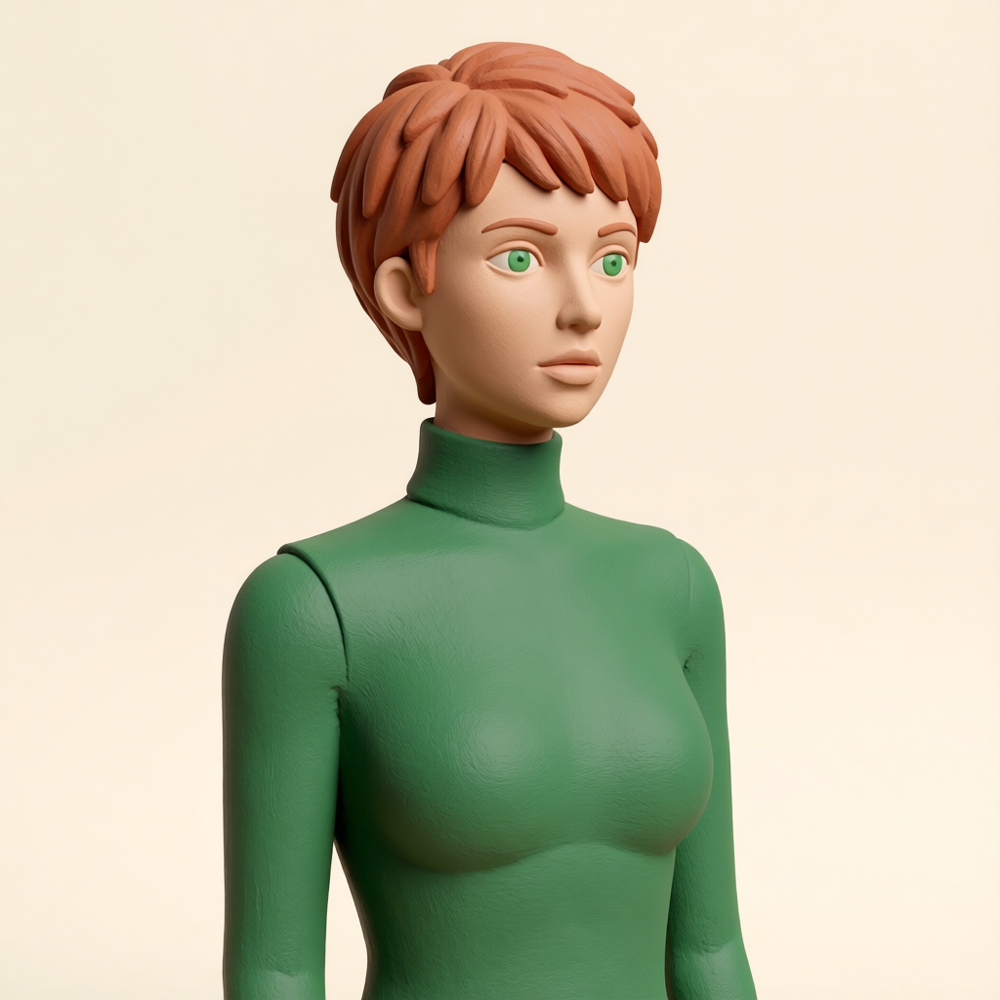](input-images/bfs-input-41-clay-render.png) | **확대 검수 보류** 초록 터틀넥과 사선 방향은 이어진다. 몸 굴곡과 시선·입 벌림을 추가 확인한다. |
| **P711-IN-173** bfs-input-41-ink-illustration |  |  | **확대 검수 보류** 초록 터틀넥과 사선 방향은 이어진다. 몸 굴곡과 시선·입 벌림을 추가 확인한다. |
| **P711-IN-212** bfs-input-41-oil-painting |  |  | **확대 검수 보류** 초록 터틀넥과 사선 방향은 이어진다. 몸 굴곡과 시선·입 벌림을 추가 확인한다. |

## target-42

| 관리번호 · 입력 ID | Mira 목표 | 생성 입력 후보 | 현재 검수 의견 |
| --- | --- | --- | --- |
| **P711-IN-042** bfs-input-42-watercolor |  |  | **확대 검수 보류** 데님 재킷의 칼라·주머니·단추와 사선 방향이 이어진다. 입 벌림과 손이 없는 프레임 경계를 확인한다. |
| **P711-IN-086** bfs-input-42-clay-render |  | [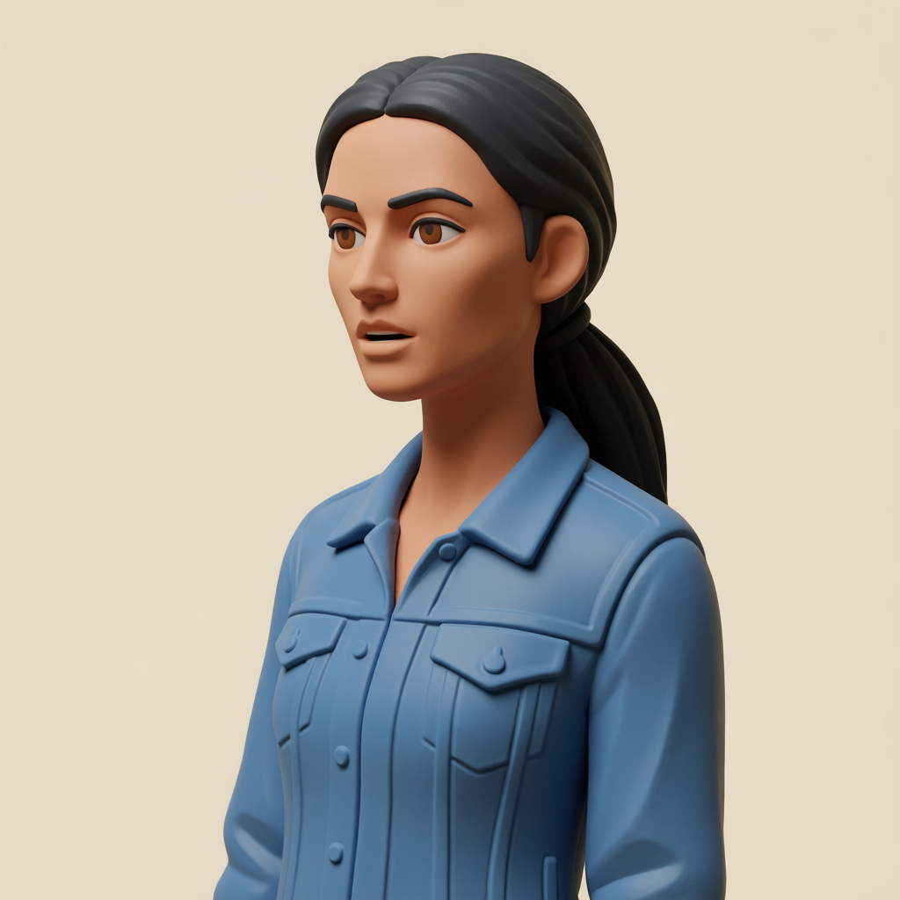](input-images/bfs-input-42-clay-render.png) | **확대 검수 보류** 데님 재킷의 칼라·주머니·단추와 사선 방향이 이어진다. 입 벌림과 손이 없는 프레임 경계를 확인한다. |
| **P711-IN-130** bfs-input-42-ink-illustration |  |  | **확대 검수 보류** 데님 재킷의 칼라·주머니·단추와 사선 방향이 이어진다. 입 벌림과 손이 없는 프레임 경계를 확인한다. |
| **P711-IN-174** bfs-input-42-oil-painting |  |  | **확대 검수 보류** 데님 재킷의 칼라·주머니·단추와 사선 방향이 이어진다. 입 벌림과 손이 없는 프레임 경계를 확인한다. |
| **P711-IN-218** bfs-input-42-soft-photo |  |  | **확대 검수 보류** 데님 재킷의 칼라·주머니·단추와 사선 방향이 이어진다. 입 벌림과 손이 없는 프레임 경계를 확인한다. |

## target-43

| 관리번호 · 입력 ID | Mira 목표 | 생성 입력 후보 | 현재 검수 의견 |
| --- | --- | --- | --- |
| **P711-IN-043** bfs-input-43-clay-render | [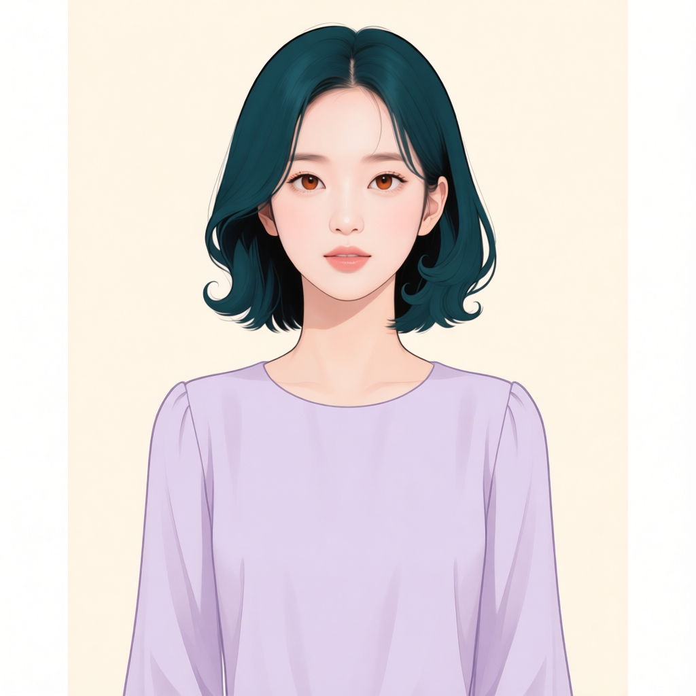](training-images/p7-5-11-mira-v2-outfit-07.png) | [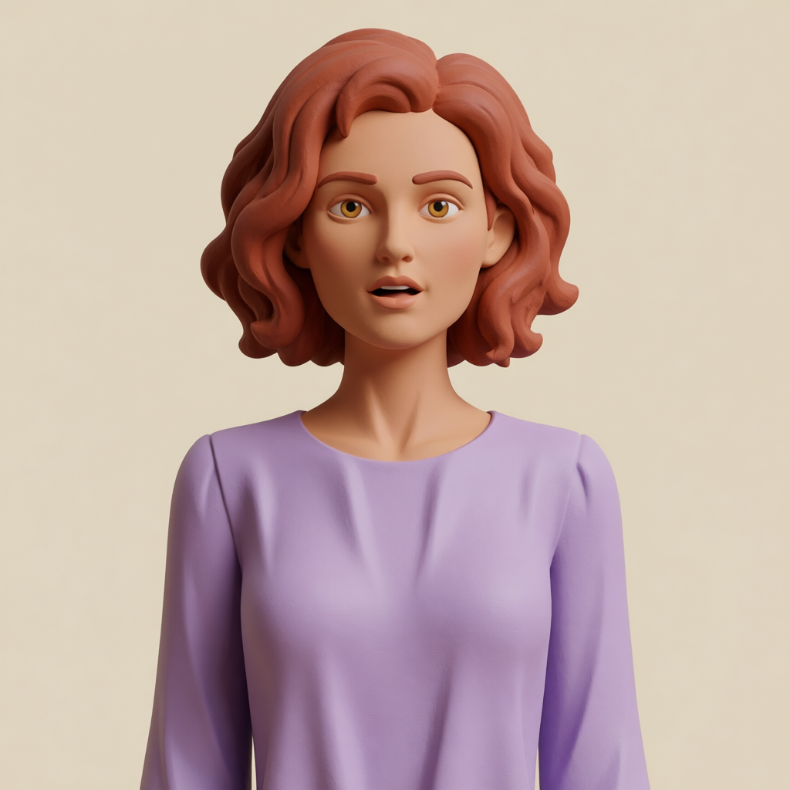](input-images/bfs-input-43-clay-render.png) | **확대 검수 보류** 정면 보라색 블라우스가 이어진다. 사진풍은 입이 더 닫히고 어깨·목선 형태가 달라 보인다. |
| **P711-IN-087** bfs-input-43-ink-illustration |  |  | **확대 검수 보류** 정면 보라색 블라우스가 이어진다. 사진풍은 입이 더 닫히고 어깨·목선 형태가 달라 보인다. |
| **P711-IN-131** bfs-input-43-oil-painting |  | [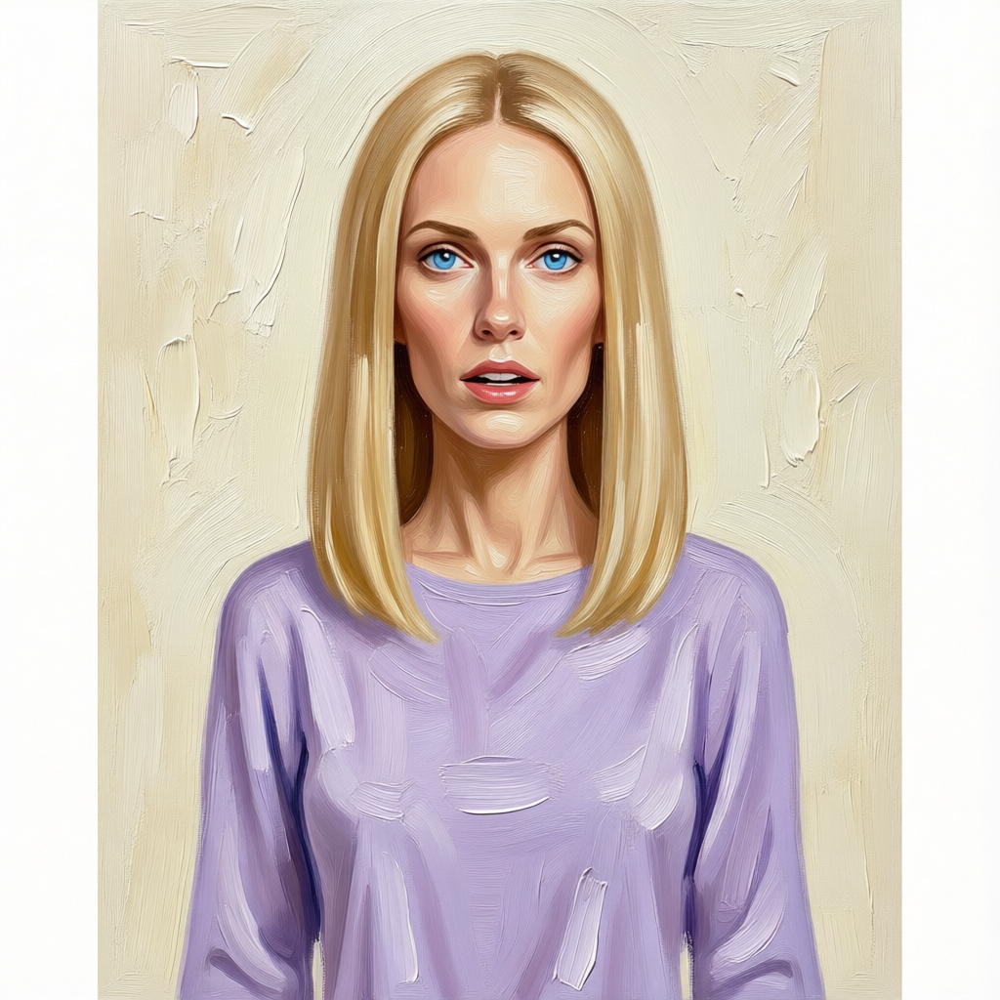](input-images/bfs-input-43-oil-painting.png) | **확대 검수 보류** 정면 보라색 블라우스가 이어진다. 사진풍은 입이 더 닫히고 어깨·목선 형태가 달라 보인다. |
| **P711-IN-175** bfs-input-43-soft-photo |  |  | **확대 검수 보류** 정면 보라색 블라우스가 이어진다. 사진풍은 입이 더 닫히고 어깨·목선 형태가 달라 보인다. |
| **P711-IN-219** bfs-input-43-watercolor |  |  | **확대 검수 보류** 정면 보라색 블라우스가 이어진다. 사진풍은 입이 더 닫히고 어깨·목선 형태가 달라 보인다. |

## target-44

| 관리번호 · 입력 ID | Mira 목표 | 생성 입력 후보 | 현재 검수 의견 |
| --- | --- | --- | --- |
| **P711-IN-044** bfs-input-44-ink-illustration | [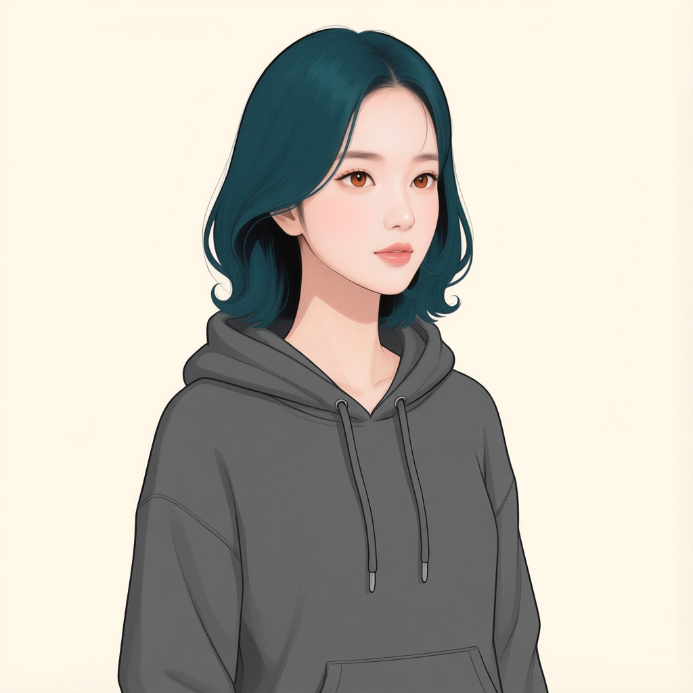](training-images/p7-5-11-mira-v2-outfit-08.png) |  | **확대 검수 보류** 회색 후드와 끈·사선 방향이 이어진다. 펜화는 눈썹 각도와 입 벌림이 커 표정 보존을 보류한다. |
| **P711-IN-088** bfs-input-44-oil-painting |  |  | **확대 검수 보류** 회색 후드와 끈·사선 방향이 이어진다. 펜화는 눈썹 각도와 입 벌림이 커 표정 보존을 보류한다. |
| **P711-IN-132** bfs-input-44-soft-photo |  |  | **확대 검수 보류** 회색 후드와 끈·사선 방향이 이어진다. 펜화는 눈썹 각도와 입 벌림이 커 표정 보존을 보류한다. |
| **P711-IN-176** bfs-input-44-watercolor |  | [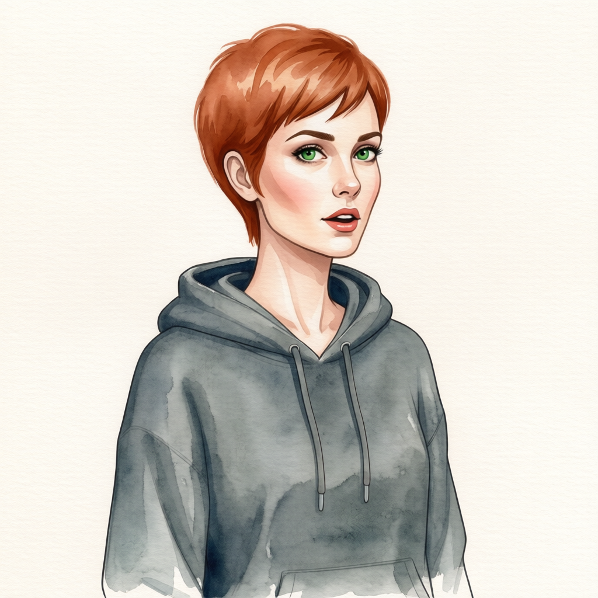](input-images/bfs-input-44-watercolor.png) | **확대 검수 보류** 회색 후드와 끈·사선 방향이 이어진다. 펜화는 눈썹 각도와 입 벌림이 커 표정 보존을 보류한다. |
| **P711-IN-220** bfs-input-44-clay-render |  |  | **확대 검수 보류** 회색 후드와 끈·사선 방향이 이어진다. 펜화는 눈썹 각도와 입 벌림이 커 표정 보존을 보류한다. |

## 폐기 확정 번호

입력 이미지와 생성 기록은 삭제되었으며 아래 번호는 재생성하지 않는다. Mira 목표 이미지와 원래 생성 항목·코드는 보존한다.

- **P711-IN-017** · `bfs-input-17-watercolor`: 사용자 폐기 확정.
- **P711-IN-023** · `bfs-input-23-clay-render`: 사용자 폐기 확정.
- **P711-IN-026** · `bfs-input-26-soft-photo`: 사용자 폐기 확정.
- **P711-IN-028** · `bfs-input-28-clay-render`: 사용자 폐기 확정.
- **P711-IN-032** · `bfs-input-32-watercolor`: 사용자 폐기 확정.
- **P711-IN-048** · `bfs-input-04-oil-painting`: 사용자 폐기 확정.
- **P711-IN-065** · `bfs-input-21-watercolor`: 사용자 폐기 확정.
- **P711-IN-067** · `bfs-input-23-ink-illustration`: 사용자 폐기 확정.
- **P711-IN-070** · `bfs-input-26-watercolor`: 사용자 폐기 확정.
- **P711-IN-072** · `bfs-input-28-ink-illustration`: 사용자 폐기 확정.
- **P711-IN-075** · `bfs-input-31-watercolor`: 사용자 폐기 확정.
- **P711-IN-092** · `bfs-input-04-soft-photo`: 사용자 폐기 확정.
- **P711-IN-111** · `bfs-input-23-oil-painting`: 사용자 폐기 확정.
- **P711-IN-114** · `bfs-input-26-clay-render`: 사용자 폐기 확정.
- **P711-IN-116** · `bfs-input-28-oil-painting`: 사용자 폐기 확정.
- **P711-IN-120** · `bfs-input-32-ink-illustration`: 사용자 폐기 확정.
- **P711-IN-128** · `bfs-input-40-watercolor`: 사용자 폐기 확정.
- **P711-IN-136** · `bfs-input-04-watercolor`: 사용자 폐기 확정.
- **P711-IN-145** · `bfs-input-13-soft-photo`: 사용자 폐기 확정.
- **P711-IN-155** · `bfs-input-23-soft-photo`: 사용자 폐기 확정.
- **P711-IN-158** · `bfs-input-26-ink-illustration`: 사용자 폐기 확정.
- **P711-IN-160** · `bfs-input-28-soft-photo`: 사용자 폐기 확정.
- **P711-IN-177** · `bfs-input-01-oil-painting`: 사용자 폐기 확정.
- **P711-IN-180** · `bfs-input-04-clay-render`: 사용자 폐기 확정.
- **P711-IN-199** · `bfs-input-23-watercolor`: 사용자 폐기 확정.
- **P711-IN-202** · `bfs-input-26-oil-painting`: 사용자 폐기 확정.
- **P711-IN-204** · `bfs-input-28-watercolor`: 사용자 폐기 확정.

[재생성 제외 목록 JSON](p7-5-11-input-generation-exclusions.json)
