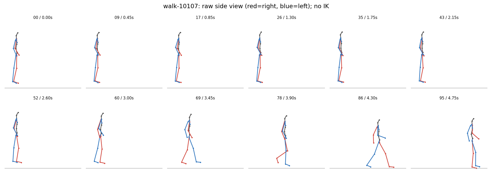
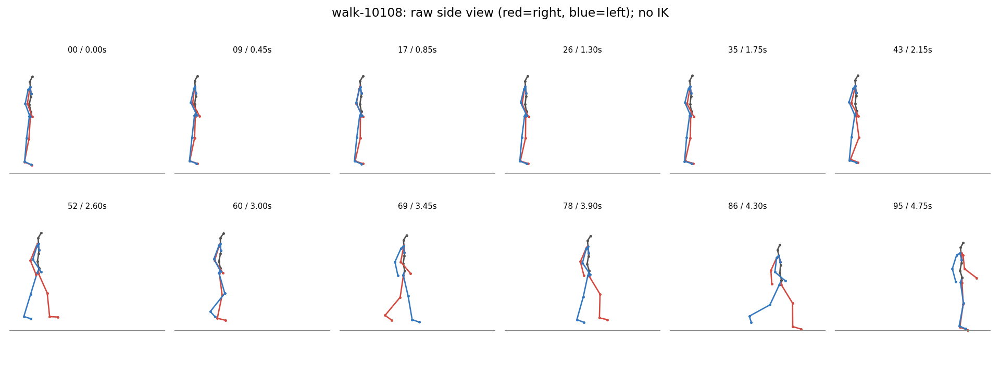
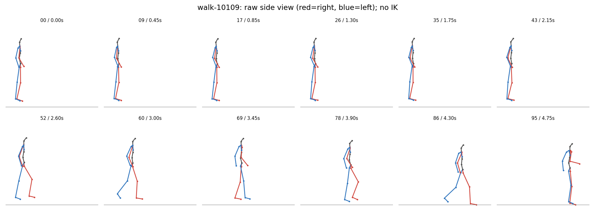
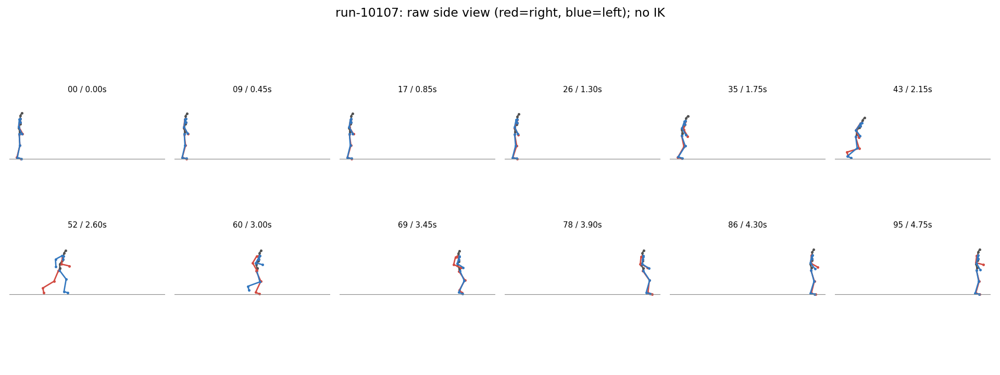
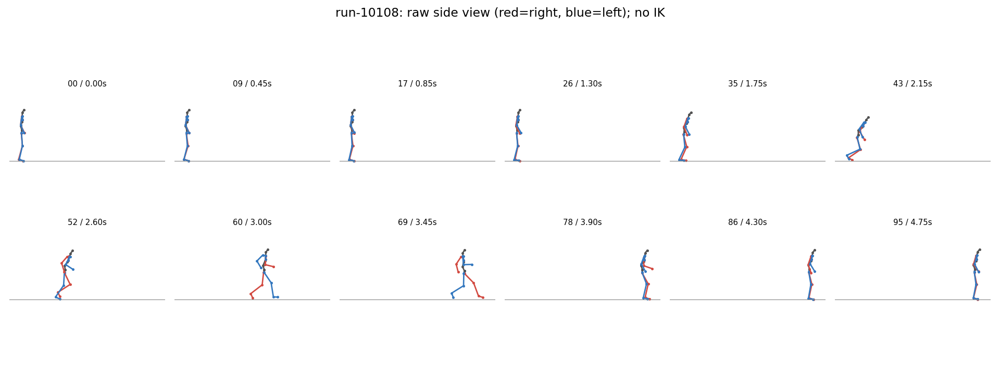
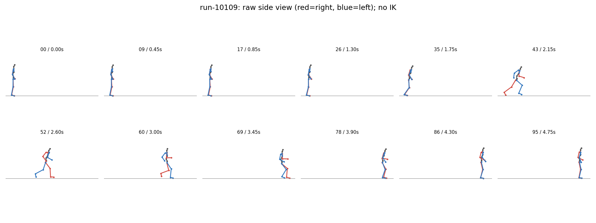

# P7-5.15 MoMask v2·StableAnimator 보존 실험

이번 실험의 자산 기준 경로: `docs/assets/part-07/chapter-05/sec-15/2026-09-19-momask-stableanimator-v1`. [자산 목록·경로 이전 기록](manifest.json)에서 묶음 구성을 확인한다. 실행 당시 JSON의 절대 경로는 이력으로 보존하며 현재 경로와의 대응은 목록에 기록했다.

2026-09-19 · RTX 5070 Laptop 8GB · 각 조건 3개 시드 · 20fps · 후처리 없는 3D 관절.

## 폐기 결정

사용자 지시에 따라 MoMask v1을 실패 실험으로 폐기했다. v1 모션 6개와 프레임·영상·실행/진단 JSON, 이를 입력으로 만든 StableAnimator 걷기 산출물을 삭제했다. 아래에서는 MoMask v2와 그 달리기 영상만 현재 자산으로 제공한다. [폐기 기록](discarded-experiments.json)을 남기며 v1을 기준군으로 재사용하지 않는다. 상위 폴더 이름의 마지막 `v1`은 최초 묶음 식별자이므로 그대로 유지한다.

## 이번 실험의 의미

사용자는 이번 산출물을 의미 있는 결과로 평가했다. 로컬 8GB GPU에서 텍스트 → 3D 모션 → 측면 포즈 → 참조 캐릭터 프레임의 연결을 실제로 실행했고, 이제 보존 대상은 v2 모션과 달리기 영상이다. 달리기에서는 원 포즈에 남아 있는 다리가 영상에서 소실되는 구간을 확보해, 다음에 점검할 영상화 단계를 구체화했다. 자연스러운 완성 영상의 확보와 별개로, 실행 가능성과 개선 대상을 확인한 첫 기준 실험이다.

## 실행 조건과 한계

- 폐기된 v1은 48프레임 기본 지시 조건이었다. 현재 비교·활용 대상에서 제외한다.
- v2: 96프레임, `A person walks steadily forward on flat ground.` / `A person runs steadily forward on flat ground.`
- v2는 길이와 프롬프트를 동시에 바꾼 탐색 실험이다. 변화의 원인을 어느 하나로 분리할 수 없다.
- 측면 카메라는 고정 z/y 직교 투영이다. 골반 이동·높이를 그대로 두고 발을 프레임별로 바닥에 맞추지 않았다.
- 바닥은 전체 시퀀스 발 관절 높이의 1백분위수로 추정했다. 발 관절은 신발 밑창이 아니며 2·4·6cm 임계값은 진단 기준일 뿐 실제 접촉 판정이 아니다.
- MoMask 원본 BVH 경로의 NumPy 비호환 때문에 공식 생성 함수와 원 관절 복원까지만 사용했다. 제거된 `np.float` 별칭에 호환 처리를 적용했고 BVH/IK는 실행하지 않았다.

## 관찰

- v2 달리기에서는 초반 정지와 중간의 짧은 달리기가 나타난다. 높이 범위는 약 0.10~0.13m로 줄었지만 지속 달리기 지시의 충족은 미흡하다.
- v2 걷기 3개 모두 시작 시 최저 발 관절이 추정 바닥보다 약 14.6~15.4cm 높고 후반에 바닥 근처로 내려온다. 사용자가 지적한 낙하 형태와 원 관절 수치가 일치한다. 지면 보행 실패로 판정하며 기준 동작으로 사용하지 않는다. [걷기 검수 기록](momask-v2/walking-review.json)에 남겼으며 산출물은 실패 증거로 보존한다.
- 12장 요약은 전체 프레임을 대신하지 않는다. 각 샘플의 MP4·연속 PNG와 높이 곡선을 함께 확인한다.

| 조건·샘플 | 발목 앞뒤 부호 변화 | 양발 4cm 초과 프레임 | 골반 높이 범위(m) |
| --- | --- | --- | --- |
| momask-v2/walk-10107 | 3 | 86 | 0.232 |
| momask-v2/walk-10108 | 2 | 85 | 0.239 |
| momask-v2/walk-10109 | 2 | 85 | 0.208 |
| momask-v2/run-10107 | 5 | 8 | 0.104 |
| momask-v2/run-10108 | 4 | 4 | 0.132 |
| momask-v2/run-10109 | 4 | 6 | 0.102 |

## momask-v2

[실행 JSON](momask-v2/result.json) · [진단 JSON](momask-v2/diagnostics.json)

### walk-10107

[전체 프레임 영상](momask-v2/walk-10107-side.mp4) · [발 높이 곡선](momask-v2/walk-10107-clearance.png) · [연속 프레임 첫 장](momask-v2/walk-10107-frames/000.png) · [원 관절·특징 배열](momask-v2/walk-10107.npz)

### walk-10108

[전체 프레임 영상](momask-v2/walk-10108-side.mp4) · [발 높이 곡선](momask-v2/walk-10108-clearance.png) · [연속 프레임 첫 장](momask-v2/walk-10108-frames/000.png) · [원 관절·특징 배열](momask-v2/walk-10108.npz)

### walk-10109

[전체 프레임 영상](momask-v2/walk-10109-side.mp4) · [발 높이 곡선](momask-v2/walk-10109-clearance.png) · [연속 프레임 첫 장](momask-v2/walk-10109-frames/000.png) · [원 관절·특징 배열](momask-v2/walk-10109.npz)

### run-10107

[전체 프레임 영상](momask-v2/run-10107-side.mp4) · [발 높이 곡선](momask-v2/run-10107-clearance.png) · [연속 프레임 첫 장](momask-v2/run-10107-frames/000.png) · [원 관절·특징 배열](momask-v2/run-10107.npz)

### run-10108

[전체 프레임 영상](momask-v2/run-10108-side.mp4) · [발 높이 곡선](momask-v2/run-10108-clearance.png) · [연속 프레임 첫 장](momask-v2/run-10108-frames/000.png) · [원 관절·특징 배열](momask-v2/run-10108.npz)

### run-10109

[전체 프레임 영상](momask-v2/run-10109-side.mp4) · [발 높이 곡선](momask-v2/run-10109-clearance.png) · [연속 프레임 첫 장](momask-v2/run-10109-frames/000.png) · [원 관절·특징 배열](momask-v2/run-10109.npz)

## 참조 캐릭터 영상화: StableAnimator

기존 sec-03 Mira 전신 참조를 재사용했다. MoMask 관절을 고정 측면 body-only OpenPose로 투영했다. 얼굴·손 관절은 없으며, 정면 참조에서 측면으로 바뀌는 조건이다. 영상 모델은 FP16 CUDA, CPU 오프로딩 없음. ONNX 얼굴 경로는 CUDA 라이브러리 부재로 CPU fallback이다.

공통: 512×512, 32프레임, 25 steps, CFG 3, seed 23123134, tile 16 / overlap 4, decode chunk 1. 모델 fps 조건은 공식 코드의 7이며 원본 GIF 재생은 8fps다. 비교 MP4만 원 모션의 20fps로 인코딩했다. 프레임 보간은 없다. 보존한 달리기는 CPU 스레드 4개로 실행했다.

| 조건 | 입력 원 모션 | 실행 시간 | PyTorch 최대 할당 / 예약 | 검수 |
| --- | --- | --- | --- | --- |
| 달리기 | momask-v2/run-10109, 36~67 | 260.24초 | 5.51 / 6.05GiB | 후반 의상·신체 변형과 하반신 소실. 실패 |

달리기는 움직이는 중간 구간을 골랐다. 원 모션 전체가 지속 달리기를 성공한 뜻이 아니다. 추정 바닥 대비 양발 4cm 초과 후보인 원 프레임 44·52·58·59·65·66을 입력 포즈와 출력에서 대조했다. 포즈에는 다리가 있지만 후반 출력이 이를 보존하지 못했다. 출력 배경에 관측 가능한 바닥이 없어 정확한 접지·공중 구간 성공을 확정할 수 없다. 캐릭터 1개·영상 생성 시드 1개이므로 일반 성능 비교가 아니다.

- 달리기: [영상](stableanimator-run-v1/preview-20fps.mp4) · [전체 32프레임](stableanimator-run-v1/all-frames.jpg) · [공중 후보 포즈 대조](stableanimator-run-v1/flight-candidate-comparison.jpg) · [조건](stableanimator-run-v1/plan.json) · [실행](stableanimator-run-v1/result.json) · [검수](stableanimator-run-v1/review.json)
- [참조 이미지](stableanimator-run-v1/reference-512.png) · [포즈 준비 코드](p7_5_15_prepare_stableanimator.py) · [추론 코드](p7_5_15_run_stableanimator.py) · [전체 프레임 검수판 코드](p7_5_15_review_stableanimator.py) · [패키지 버전](environment.json)

각 폴더의 `poses/`, `output/animated_images/`에 512×512 연속 PNG를 보관한다. `frame-hashes.json`은 출력 무결성 기록이다. 추론 당시 `result.json`의 `generated_not_reviewed`는 보존하고 이후 판정은 `review.json`에 분리했다.

Kimodo는 기반 Llama 가중치의 접근 제한이 계속되어 이번 추론에서 제외했다. 다음 비교에서는 전신이 더 크게 보이는 고정 구도와 바닥 기준을 준비하고, 동일 모션에서 포즈 크기·얼굴 관절·타일 길이 중 하나씩 바꿔 실패 원인을 분리해야 한다.
