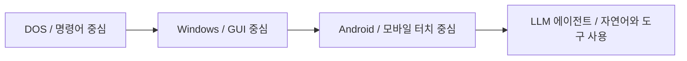

# Codex 소개와 사용 원칙

이 책은 AI 도구를 통해 만들어지고 있으며, 그 중심 도구 중 하나가 Codex입니다. 따라서 이 책을 읽는 사람에게 Codex가 어떤 역할을 하는지, 어떤 한계가 있는지, 사람이 무엇을 검토해야 하는지 설명하는 장이 필요합니다.

## Codex란 무엇인가

Codex는 OpenAI의 소프트웨어 개발용 코딩 에이전트입니다. 코드 작성, 기존 코드베이스 이해, 코드 리뷰, 디버깅, 반복적인 개발 작업 자동화에 사용할 수 있습니다.

이 저장소에서는 Codex를 단순한 코드 생성 도구가 아니라, 책의 구조를 잡고, 원고 초안을 만들고, 목차를 정리하고, MkDocs 설정과 배포 흐름을 관리하는 협업 도구로 사용합니다.

## 이 책에서 Codex가 하는 일

Codex는 다음 작업을 돕습니다.

- 커리큘럼 기준 잡기
- 원고 초안 작성
- 목차와 파일 구조 정리
- Mermaid 다이어그램 작성
- MkDocs 설정 수정
- 빌드 검증
- GitHub 브랜치, 커밋, 푸시, Pages 배포 보조
- `AGENTS.md`를 통한 작업 규칙 유지

하지만 Codex가 작성한 내용은 최종 정답이 아닙니다. AI가 생성한 설명에는 오류, 누락, 과도한 일반화가 포함될 수 있습니다. 이 책은 그런 위험을 전제로 하며, 사람이 검토하고 정정하는 과정을 중요한 일부로 봅니다.

## Codex를 사용하는 이유

이 책의 목적은 AI를 다시 배우는 것입니다. 그래서 책을 만드는 과정 자체도 AI 도구와 협업하는 방식으로 진행합니다. Codex를 사용하면 학습자는 다음을 동시에 경험할 수 있습니다.

- AI 도구를 이용한 문서 제작
- AI가 만든 초안의 검증
- 사람의 작업 가설과 표준 설명의 비교
- 정적 웹 책 제작과 배포 자동화
- AI 시대의 개발 워크플로우

즉, 이 저장소는 AI를 설명하는 책이면서 동시에 AI 도구로 만들어지는 실험 기록입니다.

## 작업 가설: CLI에서 GUI, 그리고 LLM 에이전트로

이 책에서는 Codex를 단순한 개발 보조 도구가 아니라, 컴퓨터 사용 인터페이스가 바뀌는 흐름 속에서 등장한 에이전트형 도구로 관찰합니다.

개인적인 작업 가설은 다음과 같습니다.

DOS와 CLI 환경에서는 사용자가 명령어를 정확히 알고 입력해야 했습니다. Windows 같은 GUI 환경에서는 사용자가 창, 아이콘, 메뉴, 포인터를 통해 조작할 수 있게 되었습니다. Android와 모바일 환경에서는 터치, 앱, 센서, 항상 연결된 네트워크가 사용자 경험의 중심이 되었습니다.

Codex와 같은 LLM 기반 에이전트는 그 다음 변화의 한 사례처럼 보입니다. 사용자는 더 이상 모든 명령어, 메뉴, 파일 구조를 직접 조작하지 않고, 자연어로 목표와 제약을 설명합니다. 에이전트는 파일을 읽고, 명령을 실행하고, 코드를 수정하고, 결과를 검증하면서 사용자의 의도를 작업 단위로 번역합니다.

이 관점에서 흐름은 다음처럼 볼 수 있습니다.

| 시대적 인터페이스 | 사용자의 주요 행동 | 시스템의 역할 |
| --- | --- | --- |
| CLI | 명령어를 정확히 입력 | 명령 실행 |
| GUI | 화면 요소를 선택하고 조작 | 기능을 시각적으로 노출 |
| 모바일 | 터치와 앱 흐름을 따라 사용 | 개인화된 앱 경험 제공 |
| LLM 에이전트 | 목표, 맥락, 제약을 설명 | 작업을 계획하고 도구를 사용 |

다만 이 해석은 확정된 결론이 아닙니다. LLM 에이전트가 기존 OS를 대체한다는 뜻도 아닙니다. 오히려 OS, IDE, 브라우저, CLI 위에서 동작하면서 사용자의 의도를 더 높은 수준의 작업 단위로 연결하는 새로운 인터페이스 계층으로 보는 것이 현재로서는 더 조심스러운 설명입니다.

따라서 이 가설은 앞으로 다음 질문으로 검증해야 합니다.

- LLM 에이전트는 OS의 대체재인가, 아니면 OS 위의 새로운 작업 인터페이스인가?
- 자연어 인터페이스는 CLI와 GUI의 어떤 문제를 해결하고, 어떤 새 문제를 만드는가?
- 에이전트가 도구를 사용할 때 사용자의 책임과 검증 범위는 어떻게 바뀌는가?
- Codex 같은 도구는 개발자의 사고 과정을 확장하는가, 아니면 자동화 가능한 작업만 대체하는가?

## AGENTS.md의 역할

Codex는 작업을 시작하기 전에 `AGENTS.md` 같은 지침 파일을 읽고, 저장소의 목적과 작업 규칙을 반영합니다. 이 저장소의 `AGENTS.md`에는 책의 목적, 문서 구조, 출처 표기, 브랜치 운영, 검증 방식, 차트와 다이어그램 작성 원칙이 들어 있습니다.

따라서 `AGENTS.md`는 단순한 안내문이 아니라, Codex가 이 프로젝트를 어떻게 이해해야 하는지 알려주는 운영 기준입니다. 새 원칙이 생기면 원고뿐 아니라 `AGENTS.md`도 함께 갱신해야 합니다.

## 안전과 승인

Codex는 로컬 파일을 읽고 수정하며 명령을 실행할 수 있습니다. 그래서 작업에는 sandbox, 승인 정책, 네트워크 접근 제한 같은 안전 장치가 필요합니다.

이 저장소에서는 다음 원칙을 따릅니다.

- 일반 원고 작업은 `dev` 브랜치에서 진행합니다.
- 배포는 `main` 브랜치에 반영된 변경으로만 실행합니다.
- 외부 자료를 참고하면 출처를 남깁니다.
- 빌드와 배포 관련 작업은 결과를 확인합니다.
- AI가 생성한 내용은 검증 전까지 확정된 사실로 취급하지 않습니다.

## 한계

Codex는 강력한 도구이지만, 다음 한계를 가집니다.

- 문맥을 잘못 이해할 수 있습니다.
- 최신 정보가 필요할 때 공식 문서 확인이 필요합니다.
- 그럴듯하지만 틀린 설명을 만들 수 있습니다.
- 사용자의 개인적 해석과 표준 설명을 혼동할 수 있습니다.
- 코드나 문서 변경이 의도와 다르게 넓어질 수 있습니다.

따라서 이 책에서 Codex의 출력은 초안, 제안, 자동화 결과로 다룹니다. 최종 판단은 사람이 합니다.

## 출처와 참고 자료

- OpenAI, "Codex", <https://developers.openai.com/codex/overview>, 확인 날짜: 2026-06-22.
- OpenAI, "Codex app", <https://developers.openai.com/codex/app>, 확인 날짜: 2026-06-22.
- OpenAI, "Codex CLI", <https://developers.openai.com/codex/cli>, 확인 날짜: 2026-06-22.
- OpenAI, "Custom instructions with AGENTS.md", <https://developers.openai.com/codex/guides/agents-md>, 확인 날짜: 2026-06-22.
- OpenAI, "Agent approvals & security", <https://developers.openai.com/codex/agent-approvals-security>, 확인 날짜: 2026-06-22.
- 이 문서의 "CLI에서 GUI, 그리고 LLM 에이전트로" 관점은 현재 개인적인 작업 가설이며, 외부 자료를 직접 인용하지 않았습니다.
