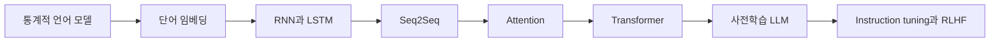

# 딥러닝 패러다임과 LLM

이 문서는 LLM의 역사를 설명할 때 함께 소개할 딥러닝 패러다임 확산 사례를 정리합니다. 목적은 Transformer만 강조하지 않고, 여러 분야에서 반복된 변화가 LLM으로 이어지는 배경을 설명하는 것입니다.

## 기본 구분

LLM의 직접 발전사는 자연어처리와 기계번역의 계보에서 설명하는 것이 표준적입니다.

하지만 LLM이 등장한 배경은 NLP 내부만으로 설명하기 어렵습니다. 2010년대 딥러닝은 이미지, 음성, 번역, 추천, 강화학습 등 여러 분야에서 공통된 성공 패턴을 보였습니다. 이 흐름은 LLM의 직접 조상이라기보다, LLM이 설득력 있는 연구 방향이 될 수 있었던 주변 근거입니다.

## 표준적 설명

- LLM의 핵심 계보는 언어 모델링, seq2seq, Attention, Transformer, 대규모 사전학습입니다.
- 이미지 인식, 객체 검출, 음성 합성 모델은 LLM의 직접 조상이 아닙니다.
- 다만 이 모델들은 딥러닝이 다양한 입력과 출력 문제에서 수작업 규칙과 특징 설계를 줄이고, 데이터 기반 표현 학습으로 성능을 낼 수 있음을 보여주었습니다.
- 따라서 LLM의 역사 앞부분에는 "딥러닝 패러다임의 확산"을 짧게 두고, 그 뒤에 NLP 내부 발전사를 설명하는 구조가 적절합니다.

## 작업 가설

사용자의 관점은 다음과 같이 정리할 수 있습니다.

> 생성형 AI는 어느 날 갑자기 LLM에서 시작된 것이 아니라, 이미지 인식, 객체 검출, 음성 합성, 기계번역, 언어 모델링 등 여러 분야에서 신경망이 표현을 학습하고 출력을 생성하거나 예측하는 방식이 누적된 결과로 볼 수 있다.

이 관점은 유용하지만, "추론 기반"이라는 표현은 조심해서 사용합니다. 한국어의 추론은 논리적 reasoning을 뜻하기도 하고, 모델을 실행하는 inference를 뜻하기도 합니다. 생성형 AI를 설명할 때는 다음처럼 구분합니다.

| 표현 | 사용할 때의 의미 |
| --- | --- |
| 학습 | 대규모 데이터에서 모델 파라미터를 조정하는 과정 |
| 추론 또는 inference | 학습된 모델을 실행해 출력을 만드는 과정 |
| reasoning | 문제를 단계적으로 풀거나 근거를 구성하는 능력 또는 행동 |
| 생성 | 입력 조건에 따라 텍스트, 이미지, 음성 같은 출력을 만들어내는 과정 |

따라서 이 책에서는 "생성형 AI는 학습된 표현을 바탕으로 사용 시점의 inference에서 다음 출력을 생성하는 시스템"처럼 표현합니다. 논리 추론 능력은 별도의 검증 주제로 둡니다.

## 근거로 소개할 사례

| 사례 | 분야 | 보여준 변화 | LLM과의 관계 |
| --- | --- | --- | --- |
| AlexNet | 이미지 분류 | 대규모 데이터, GPU, 깊은 CNN이 기존 특징 공학보다 강력할 수 있음을 보여줌 | 간접 영향: 딥러닝 붐과 GPU 기반 학습의 설득력 |
| YOLO | 객체 검출 | 객체 검출을 단일 신경망의 end-to-end 예측 문제로 재구성 | 간접 영향: 인식 문제도 통합 신경망 구조로 풀 수 있다는 사례 |
| WaveNet | 음성 생성 | raw audio를 확률적, autoregressive 방식으로 생성 | 간접 영향: 생성 모델과 순차 출력 생성의 강력한 사례 |
| Deep Voice | 음성 합성 | 전통적 TTS 파이프라인의 여러 구성요소를 신경망 기반으로 전환 | 간접 영향: 수작업 특징과 도메인별 파이프라인 축소 |
| Seq2Seq | 기계번역 | 입력 시퀀스를 벡터 표현으로 압축하고 출력 시퀀스를 생성 | 직접 영향: LLM 이전 신경망 기반 언어 생성 계보 |
| Attention | 기계번역과 NLP | 출력 시점에 입력의 관련 부분을 동적으로 참고 | 직접 영향: Transformer의 핵심 전 단계 |
| Transformer | NLP, 이후 멀티모달 | recurrence 없이 attention 중심 구조로 병렬 학습을 확대 | 직접 영향: 현대 LLM의 핵심 구조 |

## 설명 흐름 제안

책에서는 다음 흐름으로 설명합니다.

1. 딥러닝이 이미지 인식에서 강한 성과를 보이며 다시 주목받았습니다.
2. 객체 검출과 음성 합성에서도 신경망은 수작업 파이프라인을 end-to-end 학습 구조로 바꾸었습니다.
3. 기계번역에서는 seq2seq와 Attention이 "입력 전체를 표현하고 필요한 부분을 참고해 출력한다"는 방향을 만들었습니다.
4. Transformer는 이 흐름을 병렬화와 대규모 학습에 유리한 구조로 정리했습니다.
5. LLM은 Transformer만의 결과가 아니라, 데이터, GPU, 표현 학습, autoregressive 생성, 사전학습, 정렬 기법이 결합된 결과로 설명합니다.

## 주의할 표현

| 피할 표현 | 이유 | 대체 표현 |
| --- | --- | --- |
| YOLO가 LLM 발전을 이끌었다 | 직접 계보가 아님 | YOLO는 딥러닝 패러다임 확산의 사례다 |
| Deep Voice가 LLM의 조상이다 | 음성 합성 계열이며 직접 조상은 아님 | Deep Voice는 신경망 기반 생성 파이프라인의 사례다 |
| 생성형 AI는 추론 기반으로 발전했다 | 논리 추론과 inference가 혼동됨 | 생성형 AI는 학습된 모델의 inference에서 출력을 생성한다 |
| Transformer만 알면 LLM 역사를 설명할 수 있다 | 데이터, 사전학습, 스케일링, 정렬, 서비스 구조가 빠짐 | Transformer는 핵심 전환점이지만 전체 역사는 더 넓다 |

## 출처와 참고 자료

- Alex Krizhevsky, Ilya Sutskever, Geoffrey E. Hinton, [ImageNet Classification with Deep Convolutional Neural Networks](https://proceedings.neurips.cc/paper/2012/hash/c399862d3b9d6b76c8436e924a68c45b-Abstract.html), NeurIPS, 2012, 확인일: 2026-06-22.
- Joseph Redmon, Santosh Divvala, Ross Girshick, Ali Farhadi, [You Only Look Once: Unified, Real-Time Object Detection](https://arxiv.org/abs/1506.02640), 2015, 확인일: 2026-06-22.
- Aaron van den Oord et al., [WaveNet: A Generative Model for Raw Audio](https://arxiv.org/abs/1609.03499), 2016, 확인일: 2026-06-22.
- Sercan O. Arik et al., [Deep Voice: Real-time Neural Text-to-Speech](https://arxiv.org/abs/1702.07825), 2017, 확인일: 2026-06-22.
- Ilya Sutskever, Oriol Vinyals, Quoc V. Le, [Sequence to Sequence Learning with Neural Networks](https://arxiv.org/abs/1409.3215), 2014, 확인일: 2026-06-22.
- Dzmitry Bahdanau, Kyunghyun Cho, Yoshua Bengio, [Neural Machine Translation by Jointly Learning to Align and Translate](https://arxiv.org/abs/1409.0473), 2014, 확인일: 2026-06-22.
- Ashish Vaswani et al., [Attention Is All You Need](https://arxiv.org/abs/1706.03762), 2017, 확인일: 2026-06-22.
