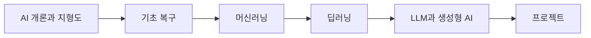

# 목차

이 목차는 현재 기준 목차로 확정한 학습 순서입니다. `확정`은 책의 구조로 채택했다는 뜻이며, 각 장의 내용이 모두 작성되었거나 검증되었다는 뜻은 아닙니다.

## 전체 흐름

## Part 1. AI 개론과 지형도

세부 기술을 깊게 들어가기 전에 AI의 큰 지도를 다시 잡습니다.

이 책의 기본 구조는 `Part > Module > Chapter > Section`입니다. Part 1은 다음 Module로 나눕니다.

| Module | 포함 Chapter | 역할 |
| --- | --- | --- |
| Module 1. AI의 범위와 역사 | Chapter 1-2 | AI가 다루는 문제와 역사적 패러다임의 큰 변화를 잡습니다. |
| Module 2. 규칙, 모델, 학습 | Chapter 3-5 | 명시적 규칙에서 데이터 기반 모델링으로 넘어가는 사고 방식을 정리합니다. |
| Module 3. 불확실성과 문제 해결 | Chapter 6-8 | 확률, 탐색, 휴리스틱, 학습 유형을 통해 불완전한 정보에서 판단하는 방식을 봅니다. |
| Module 4. 딥러닝과 생성형 AI로의 전환 | Chapter 9-11 | 딥러닝 패러다임의 확산과 LLM의 위치를 연결합니다. |
| Module 5. LLM 사용 경험의 핵심 요소 | Chapter 12-14 | 프롬프트, 임베딩, 벡터 검색, 서비스 아키텍처를 하나의 사용 흐름으로 봅니다. |
| Module 6. 사회적 쟁점과 적용 | Chapter 15-17 | 윤리, 저작권, 보안, 실무 사례, 미래 전망을 근거 중심으로 다룹니다. |

| Chapter | 제목 | 카테고리 |
| ---: | --- | --- |
| 1 | AI란 무엇인가 | 개념 정의 |
| 2 | AI의 역사와 패러다임 변화 | 역사와 패러다임 |
| 3 | 규칙에서 학습으로 | 역사와 패러다임 |
| 4 | 문제를 모델로 바꾼다는 것 | 모델링 관점 |
| 5 | 학습과 inference | 학습 원리 |
| 6 | 불확실성과 확률적 사고 | 수학 기초 |
| 7 | 탐색과 휴리스틱 | 실무 휴리스틱 |
| 8 | 지도학습, 비지도학습, 강화학습 | 학습 원리 |
| 9 | 딥러닝 패러다임의 확산 | 역사와 패러다임 |
| 10 | 생성형 AI 개론 | 개념 정의 |
| 11 | LLM은 어디에서 왔는가 | 역사와 패러다임 |
| 12 | LLM과 프롬프트 | LLM 핵심 |
| 13 | 임베딩과 벡터 검색 | LLM 핵심 |
| 14 | AI 서비스 아키텍처 | 서비스 구조 |
| 15 | AI 윤리, 저작권, 보안 | 법과 정책 |
| 16 | 실무 적용 사례 | 프로젝트 실습 |
| 17 | 앞으로의 AI | 전망 |

## Part 2. 기초 복구

수학을 깊게 증명하기보다, AI 모델 계산을 읽고 작은 코드로 재현하기 위한 최소 기반을 복구합니다.

| 순서 | 장 | 카테고리 |
| ---: | --- | --- |
| 1 | AI에서 수학은 왜 필요한가 | 수학 기초 |
| 2 | 수식 표기 다시 읽기 | 수학 기초 |
| 3 | 선형대수는 무엇을 모델링하는가 | 수학 기초 |
| 4 | 미분은 무엇을 찾기 위한 도구인가 | 수학 기초 |
| 5 | 확률과 통계는 왜 필요한가 | 수학 기초 |
| 6 | 최적화는 어떤 문제를 푸는가 | 학습 원리 |
| 7 | 학습 환경 세팅 | SW 도구 |
| 8 | Python 핵심 문법 복습 | SW 도구 |
| 9 | Jupyter, Colab, 가상환경 | SW 도구 |
| 10 | NumPy로 벡터와 행렬 재사용 | SW 도구 |
| 11 | Pandas로 데이터 구조 다루기 | SW 도구 |
| 12 | Matplotlib으로 개념 시각화 | SW 도구 |
| 13 | Git과 문서 관리 | SW 도구 |
| 14 | SW로 수학 다시 보기 | 프로젝트 실습 |

## Part 3. 머신러닝

데이터로부터 규칙을 학습한다는 말의 의미를 복구합니다. 알고리즘 목록보다 데이터 분리, 평가, 일반화, 과적합을 먼저 잡습니다.

| 순서 | 장 | 카테고리 |
| ---: | --- | --- |
| 1 | AI, 머신러닝, 딥러닝의 구분 | 개념 정의 |
| 2 | 지도학습, 비지도학습, 강화학습 | 학습 원리 |
| 3 | 휴리스틱이 필요한 이유 | 실무 휴리스틱 |
| 4 | 데이터 분리와 검증 | 학습 원리 |
| 5 | 과적합과 일반화 | 학습 원리 |
| 6 | 평가 지표 | 학습 원리 |
| 7 | 특징 선택과 전처리 휴리스틱 | 실무 휴리스틱 |
| 8 | 모델 선택 휴리스틱 | 실무 휴리스틱 |
| 9 | 하이퍼파라미터 튜닝 | 실무 휴리스틱 |
| 10 | 선형회귀 | 알고리즘 |
| 11 | 로지스틱 회귀 | 알고리즘 |
| 12 | k-NN | 알고리즘 |
| 13 | SVM | 알고리즘 |
| 14 | 결정트리 | 알고리즘 |
| 15 | 랜덤포레스트 | 알고리즘 |
| 16 | 그래디언트 부스팅 | 알고리즘 |
| 17 | 클러스터링 | 알고리즘 |
| 18 | 차원 축소 | 알고리즘 |

## Part 4. 딥러닝

신경망이 데이터를 어떻게 표현하고 학습하는지 이해합니다. 가중치, 최적화, 병렬 처리, 표현 학습을 중심으로 봅니다.

| 순서 | 장 | 카테고리 |
| ---: | --- | --- |
| 1 | 퍼셉트론 | 딥러닝 구조 |
| 2 | 다층 신경망 | 딥러닝 구조 |
| 3 | 활성화 함수 | 딥러닝 구조 |
| 4 | 손실 함수 | 학습 원리 |
| 5 | 역전파 | 딥러닝 구조 |
| 6 | 학습과 inference의 분리 | 학습 원리 |
| 7 | 옵티마이저 | 학습 원리 |
| 8 | 정규화와 드롭아웃 | 학습 원리 |
| 9 | GPU와 병렬 처리 | 역사와 패러다임 |
| 10 | 표현 학습 | 딥러닝 구조 |
| 11 | CNN | 알고리즘 |
| 12 | RNN, LSTM, GRU | 알고리즘 |
| 13 | Attention | 딥러닝 구조 |
| 14 | Transformer | 딥러닝 구조 |
| 15 | 생성 모델의 직관 | 딥러닝 구조 |

## Part 5. LLM과 생성형 AI

Transformer 이후의 흐름을 이해하고, LLM을 실제 서비스와 연결합니다. 프롬프트, 임베딩, RAG, Agent를 하나의 시스템 흐름으로 정리합니다.

| 순서 | 장 | 카테고리 |
| ---: | --- | --- |
| 1 | 토큰화 | LLM 핵심 |
| 2 | 임베딩 | LLM 핵심 |
| 3 | LLM 발전사 | 역사와 패러다임 |
| 4 | Transformer 구조 복습 | 딥러닝 구조 |
| 5 | BERT 계열 | LLM 핵심 |
| 6 | GPT 계열 | LLM 핵심 |
| 7 | 사전학습 | 학습 원리 |
| 8 | 다음 토큰 예측과 생성 | LLM 핵심 |
| 9 | 파인튜닝 | 학습 원리 |
| 10 | 지시 튜닝과 정렬 | LLM 핵심 |
| 11 | 프롬프트 엔지니어링 | LLM 핵심 |
| 12 | RAG | 서비스 구조 |
| 13 | 벡터 데이터베이스 | 서비스 구조 |
| 14 | Tool use | 서비스 구조 |
| 15 | Agent | 서비스 구조 |
| 16 | LLM 평가 | LLM 핵심 |
| 17 | 비용, 지연 시간, 운영 고려사항 | 서비스 구조 |

## Part 6. 프로젝트

배운 내용을 작은 산출물로 검증합니다. 프로젝트 문서는 성공한 결과뿐 아니라 실패, 한계, 개선점도 기록합니다.

| 순서 | 프로젝트 | 카테고리 |
| ---: | --- | --- |
| 1 | 데이터 분석 미니 프로젝트 | 프로젝트 실습 |
| 2 | 전통 머신러닝 예측 모델 | 프로젝트 실습 |
| 3 | 이미지 분류 모델 | 프로젝트 실습 |
| 4 | 텍스트 분류 모델 | 프로젝트 실습 |
| 5 | 문서 기반 RAG 챗봇 | 프로젝트 실습 |
| 6 | 도구를 사용하는 Agent | 프로젝트 실습 |
| 7 | 배포와 모니터링 | 서비스 구조 |

## 출처와 참고 자료

이 문서는 현재 프로젝트의 기준 목차를 독자가 읽기 쉬운 형태로 재구성한 자체 문서입니다. 외부 자료를 직접 인용하지 않았습니다.
