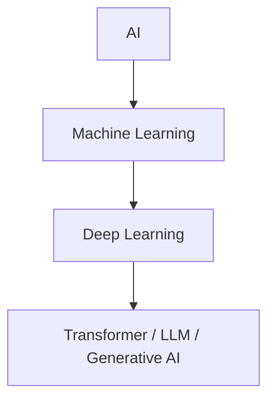

# 1장. AI 재학습 로드맵

AI를 다시 공부할 때 가장 먼저 필요한 것은 자료 목록이 아니라 순서입니다. 개념이 서로 어떻게 연결되는지 알아야 잊어버린 지식을 다시 붙잡을 수 있고, 최신 주제인 LLM과 생성형 AI도 기초 위에서 이해할 수 있습니다.

## 목표

- 재학습의 범위를 정합니다.
- AI, 머신러닝, 딥러닝, 생성형 AI의 관계를 다시 정리합니다.
- 이후 장에서 따라갈 학습 순서를 확정합니다.

## 재학습의 출발점

현재 목표는 AI 전문가용 논문 독해 과정이 아니라, 오래전에 배운 기초를 다시 복구하고 실전 프로젝트로 연결하는 것입니다. 따라서 처음부터 최신 모델만 따라가기보다 다음 순서로 돌아갑니다.

1. AI 개론으로 전체 지형을 다시 잡습니다.
2. Python과 데이터 처리 감각을 회복합니다.
3. 선형대수, 미분, 확률과 통계, 최적화의 핵심만 다시 잡습니다.
4. 전통적인 머신러닝 모델을 통해 학습, 일반화, 평가를 이해합니다.
5. 딥러닝에서 신경망이 어떻게 학습되는지 정리합니다.
6. Transformer와 LLM을 딥러닝의 연장선에서 이해합니다.
7. RAG, Agent, 모델 API 같은 실전 주제로 확장합니다.

## 참고 목차를 다루는 방식

AI 개론에는 `AI란 무엇인가`, `규칙 기반 AI와 머신러닝`, `데이터, 특징, 모델`, `지도학습 / 비지도학습 / 강화학습`, `딥러닝 개론`, `생성형 AI`, `LLM과 프롬프트`, `임베딩과 벡터 검색`, `AI 서비스 아키텍처`, `AI 윤리, 저작권, 보안`, `실무 적용 사례`, `앞으로의 AI` 같은 주제가 들어갈 수 있습니다.

다만 이 목록을 그대로 책의 목차로 적용하지는 않습니다. 이 책은 망각한 내용을 복구하고 새로운 AI 패러다임에 적응하는 것이 목적이므로, 각 주제는 이후 학습할 파트와 연결되는 방식으로 재배치합니다. 예를 들어 `임베딩과 벡터 검색`은 개론에서 직관만 잡고, LLM 파트에서 RAG와 함께 다시 다룹니다. `AI 윤리, 저작권, 보안`은 개론에서 문제의식을 잡되, 실제 서비스 구조와 프로젝트 문서에서 다시 검토합니다.

## 큰 그림

AI는 사람이 만든 규칙이나 데이터를 바탕으로 지능적인 행동을 흉내 내는 넓은 분야입니다. 머신러닝은 그중 데이터를 통해 규칙을 학습하는 접근이고, 딥러닝은 신경망을 사용해 복잡한 패턴을 학습하는 방법입니다. 생성형 AI와 LLM은 딥러닝, 특히 Transformer 계열 모델의 발전 위에 있습니다.



```text
AI
└─ Machine Learning
   └─ Deep Learning
      └─ Transformer / LLM / Generative AI
```

이 구조를 기억하면 최신 기술을 볼 때도 어느 계층의 문제인지 구분할 수 있습니다. 예를 들어 프롬프트 엔지니어링은 LLM 사용법에 가깝고, 파인튜닝은 모델 학습 전략에 가깝습니다. RAG는 모델 자체를 바꾸기보다 외부 지식을 검색해 입력으로 제공하는 시스템 설계에 가깝습니다.

## 책의 커리큘럼

| 파트 | 주제 | 핵심 질문 |
| --- | --- | --- |
| Part 1 | AI 개론과 지형도 | 지금 다시 봐야 할 AI의 큰 흐름은 무엇인가? |
| Part 2 | 기초 복구 | AI 학습에 필요한 최소 기반은 무엇인가? |
| Part 3 | 머신러닝 | 데이터로 규칙을 학습한다는 것은 무엇인가? |
| Part 4 | 딥러닝 | 신경망은 어떻게 표현하고 학습하는가? |
| Part 5 | LLM과 생성형 AI | Transformer 이후 무엇이 달라졌는가? |
| Part 6 | 프로젝트 | 배운 내용을 어떻게 작동하는 결과물로 검증할 것인가? |

## 학습 방식

각 장은 다음 구조로 작성합니다.

- 핵심 개념: 반드시 기억해야 할 정의와 직관
- 수식 또는 알고리즘: 필요한 만큼만 정리
- 코드 실습: 작은 예제로 확인
- 체크리스트: 설명할 수 있어야 하는 질문
- 출처와 참고 자료: 외부 자료를 사용한 경우 명시

## 체크리스트

- AI, 머신러닝, 딥러닝, 생성형 AI의 포함 관계를 설명할 수 있다.
- 왜 수학과 데이터 처리 기초를 먼저 복구해야 하는지 설명할 수 있다.
- 이 책의 학습 순서를 다른 사람에게 설명할 수 있다.

## 출처와 참고 자료

이 문서는 현재 개인 학습 커리큘럼을 정리한 초안이며, 외부 자료를 직접 인용하지 않았습니다.
