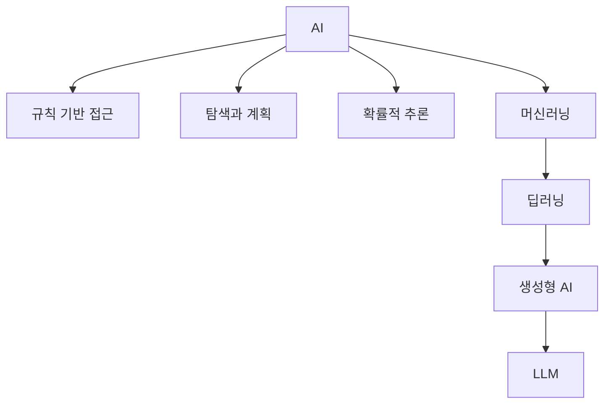

# 1.1 AI라는 말의 범위

AI를 다시 공부할 때 첫 번째 어려움은 기술 자체보다 말의 범위입니다. 같은 `AI`라는 표현이 어떤 문맥에서는 규칙 기반 프로그램을 가리키고, 어떤 문맥에서는 머신러닝 모델을 가리키며, 최근에는 생성형 AI나 LLM을 거의 같은 뜻처럼 부르기도 합니다.

이 절의 목적은 AI를 하나의 문장으로 완벽하게 정의하는 것이 아닙니다. 이후 절과 장에서 다룰 규칙 기반 AI, 머신러닝, 딥러닝, 생성형 AI, LLM을 같은 지도 위에 놓고 읽을 수 있도록 범위를 정리하는 것입니다.

## 목표

- AI라는 말이 넓게 쓰이는 이유를 설명합니다.
- AI를 특정 제품이나 최신 모델이 아니라 문제를 다루는 분야로 봅니다.
- AI, 머신러닝, 딥러닝, 생성형 AI의 관계를 이후 장에서 다시 읽을 수 있는 수준으로 정리합니다.

## AI는 하나의 기술 이름이 아니다

AI는 하나의 기술 이름이라기보다 넓은 연구 분야이자 시스템 범주에 가깝습니다. 그래서 AI를 이해할 때는 “이것이 진짜 지능인가?”라는 질문만으로 시작하면 금방 막힙니다. 실제 학습에서는 “어떤 문제를 어떤 방식으로 풀려고 하는가?”를 먼저 보는 편이 더 유용합니다.

예를 들어 체스나 바둑에서 다음 수를 찾는 시스템, 이미지에서 사물을 인식하는 모델, 문장을 번역하는 모델, 사용자의 질문에 답하는 챗봇은 겉보기에는 매우 다릅니다. 하지만 모두 입력을 받아 어떤 계산 과정을 거쳐 출력, 결정, 추천, 예측, 생성 결과를 만든다는 공통점이 있습니다.

확인한 주요 영어권·동북아권 사전과 기관 정의를 비교하면, 인공지능은 대체로 컴퓨터 시스템(computer system), 기계(machine), 알고리즘(algorithm)이 인간 지능(human intelligence)과 관련된 일부 기능을 수행하거나 모의(simulate)하는 능력 또는 그 분야로 설명됩니다. 반복해서 등장하는 기능은 언어(language), 이미지(image), 문제 해결(problem-solving), 학습(learning), 예측(prediction), 추천(recommendation), 결정(decision)입니다.

따라서 이 책에서는 인공지능을 다음처럼 읽습니다.

> 인공지능(artificial intelligence, AI)은 컴퓨터 시스템, 기계, 알고리즘이 인간 지능과 관련된 일부 기능을 수행하도록 연구·개발한 분야와 그 시스템을 함께 가리키는 넓은 말입니다.

OECD의 2023년 설명은 AI 시스템을 기계 기반 시스템으로 보고, 명시적이거나 암묵적인 목표 아래 입력을 받아 예측, 콘텐츠, 추천, 결정 같은 출력을 생성하는 시스템으로 설명합니다. 이 정의는 AI가 사람처럼 생각하는지보다, 입력과 목표와 출력의 관계를 중심으로 시스템을 바라봅니다.

이 관점은 이 책의 출발점과 잘 맞습니다. AI를 “인간 지능의 완전한 복제”로 먼저 이해하기보다, 문제를 계산 가능한 형태로 바꾸고 그 결과가 환경에 영향을 주는 시스템으로 보는 것입니다.

## AI라는 말이 넓어진 이유

AI라는 말이 넓게 느껴지는 이유는, 이 용어가 하나의 알고리즘만 가리키지 않고 여러 시대의 문제 해결 방식을 함께 품고 있기 때문입니다. 초기 AI에서는 사람이 규칙(rule), 지식(knowledge), 탐색 절차(search procedure)를 명시적으로 설계하는 접근이 중요했습니다. 가능한 답이 너무 많을 때는 휴리스틱(heuristic)을 사용해 탐색 범위를 줄였습니다.

이후 데이터가 많아지고 저장·처리 인프라가 커지면서, AI를 설명하는 중심도 점점 데이터에서 판단 기준을 찾는 방향으로 확장되었습니다. 데이터마이닝(data mining), 의사결정지원시스템(DSS, decision support system), 비즈니스 인텔리전스(BI, business intelligence), 데이터 웨어하우스(DW, data warehouse), OLAP 같은 흐름은 AI 모델 자체와 같지는 않지만, 데이터 기반 의사결정 환경이 확산되는 배경이 되었습니다.

이 배경 위에서 머신러닝(machine learning)은 사람이 모든 규칙을 직접 쓰는 대신 데이터에서 패턴을 학습하는 접근으로 자리 잡았습니다. 딥러닝(deep learning)은 여기에 신경망(neural network), 가중치(weights), 표현 학습(representation learning)을 결합해 더 복잡한 입력과 출력을 다루는 방향으로 확장되었습니다.

따라서 이 책에서는 AI라는 말을 단순히 “사람처럼 행동하는 기계”로만 읽지 않습니다. 규칙을 사람이 직접 작성하던 방식, 데이터로부터 판단 기준을 학습하는 방식, 그 결과를 서비스와 의사결정에 연결하는 방식을 함께 놓고 읽습니다.

| 층위 | 판단을 만드는 방식 | 이 Section에서의 위치 |
| --- | --- | --- |
| 규칙 기반 AI | 사람이 규칙과 지식을 명시적으로 작성 | AI 범위에 포함된 오래된 접근 |
| 탐색과 휴리스틱 | 후보를 탐색하되 경험적 기준으로 줄임 | Chapter 7에서 다시 다룸 |
| DSS/BI/DW/OLAP | 데이터를 모아 의사결정에 연결 | AI를 둘러싼 데이터 기반 시스템 배경 |
| 데이터마이닝과 머신러닝 | 데이터에서 패턴과 예측 기준을 찾음 | Chapter 3 이후에서 다시 다룸 |
| 딥러닝과 생성형 AI | 표현과 가중치를 학습해 복잡한 출력을 만듦 | Chapter 9 이후에서 다시 다룸 |

이 구분은 AI의 사전적 정의와 역사적 변화를 섞지 않기 위한 안전장치입니다. 사전적으로 AI는 인간 지능과 관련된 기능을 수행하는 컴퓨터 시스템 또는 분야입니다. 역사적으로는 그 기능을 구현하는 방식이 규칙, 탐색, 확률, 데이터 학습, 딥러닝으로 확장되어 왔습니다.

## 문맥에 따라 달라지는 AI의 범위

AI라는 말은 문맥에 따라 다르게 쓰입니다.

| 표현 | 흔한 사용 맥락 | 주의할 점 |
| --- | --- | --- |
| AI | 지능적인 행동을 보이는 시스템 전체 | 너무 넓어서 구체적인 방식이 보이지 않을 수 있음 |
| 머신러닝 | 데이터에서 패턴이나 관계를 학습하는 접근 | 모든 AI가 머신러닝인 것은 아님 |
| 딥러닝 | 신경망을 사용해 복잡한 표현을 학습하는 방법 | 모든 머신러닝이 딥러닝인 것은 아님 |
| 생성형 AI | 텍스트, 이미지, 음성, 코드 같은 콘텐츠를 생성하는 모델과 서비스 | 생성 결과가 사실이거나 근거를 가진다는 뜻은 아님 |
| LLM | 대규모 언어 모델 | 모든 생성형 AI가 LLM은 아니며, LLM도 서비스 전체가 아니라 모델 구성요소일 수 있음 |

따라서 이 책에서는 AI를 가장 넓은 범주로 두고, 그 안에서 문제를 푸는 방식에 따라 하위 개념을 나눕니다.

이 그림은 완전한 분류표가 아니라 학습용 지도입니다. 실제 기술은 서로 겹칩니다. LLM은 생성형 AI를 대표하는 모델 계열 중 하나로 볼 수 있지만, 모든 생성형 AI가 LLM인 것은 아닙니다. 예를 들어 최신 AI 서비스는 LLM만으로 구성되지 않고, 검색, 데이터베이스, 규칙, 권한 관리, 외부 도구 호출, 안전 필터를 함께 사용합니다. 반대로 전통적인 규칙 기반 시스템도 서비스 안에서는 여전히 유용합니다.

## 이 책에서 AI를 읽는 질문

중요한 것은 “AI인가 아닌가”를 한 번에 판정하는 일이 아닙니다. 지금 보고 있는 시스템이 다음 질문에 어떻게 답하는지 확인하는 것입니다.

- 입력은 무엇인가?
- 출력은 무엇인가?
- 사람이 규칙을 직접 작성했는가, 데이터에서 관계를 학습했는가?
- 불확실한 상황을 어떻게 다루는가?
- 결과가 실제 환경이나 사용자의 판단에 어떤 영향을 주는가?

이 질문을 사용하면 AI라는 넓은 말을 더 작게 나눠 볼 수 있습니다. 이후 장에서 다룰 규칙 기반 AI, 휴리스틱, 확률, 머신러닝, 딥러닝, LLM도 모두 이 질문 위에 다시 배치할 수 있습니다.

## 체크리스트

- AI라는 말이 하나의 기술 이름이 아니라 넓은 분야와 시스템 범주로 쓰인다는 점을 설명할 수 있다.
- AI, 머신러닝, 딥러닝, 생성형 AI, LLM을 같은 층위의 단어처럼 섞어 쓰면 왜 혼동이 생기는지 설명할 수 있다.
- AI의 사전적 의미와 역사적으로 확장된 사용 맥락을 구분할 수 있다.
- AI 시스템을 입력, 목표, 출력, 영향이라는 관점에서 볼 수 있다.
- 생성형 AI의 결과가 자연스럽다는 사실과 결과가 사실이라는 판단을 구분할 수 있다.

## 출처와 참고 자료

- OECD.AI, Stuart Russell, Karine Perset, Marko Grobelnik, [Updates to the OECD’s definition of an AI system explained](https://oecd.ai/en/wonk/ai-system-definition-update), 2023-11-29, 확인 날짜: 2026-06-22.
- NIST AI Resource Center, [Glossary](https://airc.nist.gov/glossary/), 확인 날짜: 2026-06-22.
- Merriam-Webster, [Artificial intelligence Definition & Meaning](https://www.merriam-webster.com/dictionary/artificial%20intelligence), 확인 날짜: 2026-06-22.
- Cambridge Dictionary, [Meaning of artificial intelligence in English](https://dictionary.cambridge.org/dictionary/english/artificial-intelligence), 확인 날짜: 2026-06-22.
- Britannica Dictionary, [Artificial intelligence Definition & Meaning](https://www.britannica.com/dictionary/artificial-intelligence), 확인 날짜: 2026-06-22.
- 汉典, [人工智能](https://www.zdic.net/hans/%E4%BA%BA%E5%B7%A5%E6%99%BA%E8%83%BD), 확인 날짜: 2026-06-22.
- Stanford Encyclopedia of Philosophy, Selmer Bringsjord and Naveen Sundar Govindarajulu, [Artificial Intelligence](https://plato.stanford.edu/entries/artificial-intelligence/), 2018-07-12, 확인 날짜: 2026-06-22.
- Stuart Russell, Peter Norvig, [Artificial Intelligence: A Modern Approach, 4th US ed.](https://aima.cs.berkeley.edu/), 확인 날짜: 2026-06-22.
- Usama M. Fayyad, Gregory Piatetsky-Shapiro, Padhraic Smyth, [From Data Mining to Knowledge Discovery in Databases](https://ojs.aaai.org/aimagazine/index.php/aimagazine/article/view/1230), AI Magazine, 1996, 확인 날짜: 2026-06-22.
- D. J. Power, [A Brief History of Decision Support Systems](https://dssresources.com/history/dsshistory.html), DSSResources.COM, version 4.0, 2007-03-10, 확인 날짜: 2026-06-22.
