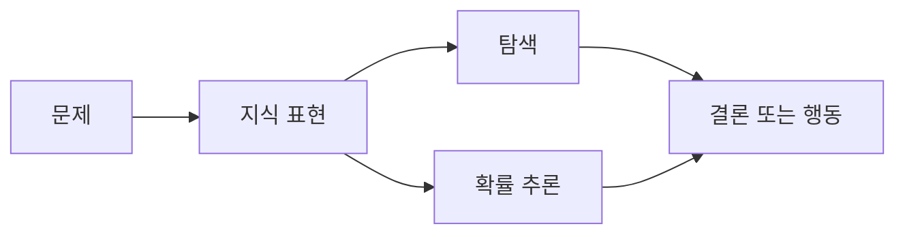

# 2.2 탐색, 지식 표현, 확률 추론

2.1에서는 기호 기반 AI와 규칙 기반 접근을 봤습니다. 이번 절에서는 그 다음 질문을 다룹니다. 규칙을 적는 것만으로는 충분하지 않을 때, AI는 가능한 후보를 탐색(search)하고, 필요한 지식을 표현(knowledge representation)하며, 불확실한 정보에서 그럴듯한 결론을 추론(probabilistic reasoning)하려 했습니다.

이 절의 목적은 알고리즘을 자세히 배우는 것이 아닙니다. 탐색, 지식 표현, 확률 추론이 왜 AI 개론에서 반복해서 등장하는지, 그리고 이 흐름이 나중의 머신러닝과 딥러닝을 이해하는 데 어떤 배경이 되는지를 잡는 것입니다.

## 목표

- 탐색이 왜 초기 AI의 핵심 문제 해결 방식이었는지 이해합니다.
- 지식 표현이 규칙 기반 접근과 어떻게 연결되는지 봅니다.
- 확률 추론이 불완전한 정보와 불확실성을 다루는 방법임을 이해합니다.
- 탐색, 지식 표현, 확률 추론을 머신러닝 이전 AI의 중요한 축으로 구분합니다.

## 규칙 다음에 나타나는 세 질문

규칙 기반 접근은 “어떤 조건에서 어떤 결론이나 행동을 낼 것인가”를 명시적으로 표현합니다. 하지만 실제 문제는 곧바로 하나의 규칙으로 끝나지 않는 경우가 많습니다.

예를 들어 배송 경로를 정한다고 생각해 봅니다. 목적지는 정해져 있지만 가능한 길이 많고, 도로 상황은 바뀔 수 있으며, 어떤 정보는 불완전합니다. 이때 AI 시스템은 다음 질문을 함께 다뤄야 합니다.

| 질문 | 연결되는 접근 | 핵심 의미 |
| --- | --- | --- |
| 가능한 후보가 많을 때 무엇부터 살펴볼 것인가? | 탐색(search) | 상태와 경로를 따라가며 목표를 찾음 |
| 문제를 풀기 위해 무엇을 알고 있어야 하는가? | 지식 표현(knowledge representation) | 사실, 관계, 제약, 규칙을 컴퓨터가 다룰 수 있게 표현함 |
| 정보가 불완전하거나 잡음이 있을 때 얼마나 그럴듯한가? | 확률 추론(probabilistic reasoning) | 관측된 증거에서 가능한 결론의 확률이나 신뢰도를 계산함 |

이 세 질문은 서로 분리되어 있지만, 실제 AI 시스템에서는 자주 함께 나타납니다. 탐색은 후보를 찾고, 지식 표현은 후보를 판단할 기준을 제공하며, 확률 추론은 불확실한 정보에서 어느 후보가 더 그럴듯한지 다룹니다.

같은 문제를 세 관점으로 나누어 보면 더 분명합니다.

| 예시 문제 | 탐색 질문 | 지식 표현 질문 | 확률 추론 질문 |
| --- | --- | --- | --- |
| 지도 경로 찾기 | 현재 위치에서 목적지까지 어떤 경로를 고를 것인가? | 도로, 교차로, 일방통행, 이동 수단을 어떻게 표현할 것인가? | 예상 시간, 혼잡, 사고 가능성을 어떻게 반영할 것인가? |
| 배송 로봇 | 어떤 순서로 이동하고 물건을 집고 내려놓을 것인가? | 로봇 위치, 물건 위치, 목적지, 적재 상태를 어떻게 표현할 것인가? | 센서가 불확실하거나 문이 닫혀 있을 가능성을 어떻게 다룰 것인가? |
| 게임 에이전트 | 다음에 어떤 위치로 이동하거나 어떤 수를 둘 것인가? | 위치, 남은 자원, 획득한 아이템, 목표 상태를 어떻게 표현할 것인가? | 상대 행동이나 관측되지 않은 상태를 어떻게 추정할 것인가? |

Poole과 Mackworth의 공개 교재도 경로 찾기, 배송 로봇, 격자 게임을 탐색과 상태 공간의 예로 사용합니다. 여기서는 원문 예시를 그대로 옮기기보다, 그 구조를 학습용으로 일반화해 사용합니다.

## 탐색: 가능한 상태 속에서 목표 찾기

탐색은 가능한 상태(state)와 행동(action)을 따라가며 목표(goal)에 도달하는 방법을 찾는 접근입니다. 경로 찾기, 퍼즐, 게임, 계획 수립, 일정 조정처럼 가능한 선택지가 많을 때 탐색 문제가 됩니다.

탐색 문제를 단순화하면 다음 구성으로 볼 수 있습니다.

| 구성 요소 | 영어 표현 | 예시 |
| --- | --- | --- |
| 시작 상태 | initial state | 현재 위치, 현재 보드 상태, 현재 일정 |
| 가능한 행동 | actions | 이동하기, 말 움직이기, 작업 순서 바꾸기 |
| 다음 상태 | transition/result | 행동 뒤에 바뀐 위치나 상태 |
| 목표 검사 | goal test | 목적지 도착, 퍼즐 완성, 조건 충족 |
| 비용 또는 평가 | cost/evaluation | 거리, 시간, 위험, 점수 |

이 구성은 실제 예시에 그대로 대응됩니다.

| 예시 | 상태 | 행동 | 목표 | 비용 또는 평가 |
| --- | --- | --- | --- | --- |
| 지도 경로 찾기 | 현재 위치, 이동 수단, 진행 방향 | 도로와 교차로를 따라 이동 | 목적지 도착 | 거리, 시간, 비용, 에너지 |
| 배송 로봇 | 로봇 위치, 운반 중인 물건, 아직 배송되지 않은 물건 | 이동, 집기, 내려놓기 | 지정된 물건이 목적지에 있음 | 이동 거리, 시간, 배터리, 실패 위험 |
| 격자 게임 | 에이전트 위치, 연료, 수집한 코인 | 상하좌우 이동, 충전, 코인 수집 | 모든 코인을 모으고 목표 위치에 도착 | 이동 수, 남은 연료, 위험 지역 회피 |

가능한 모든 후보를 끝까지 살펴볼 수 있다면 탐색은 단순해 보입니다. 하지만 현실의 문제는 후보 수가 빠르게 커집니다. 게임에서 몇 수 앞을 보는 일, 여러 도시를 거치는 경로를 고르는 일, 많은 제약을 가진 일정을 짜는 일은 가능한 조합이 폭발적으로 늘어날 수 있습니다.

그래서 탐색에서는 휴리스틱(heuristic)이 중요해집니다. 휴리스틱은 정답을 보장하는 공식이 아니라, 더 유망해 보이는 후보를 먼저 살펴보게 하는 경험적 기준입니다. 예를 들어 목적지까지의 직선거리, 현재 점수, 남은 제약 수 같은 값이 탐색 순서를 정하는 데 쓰일 수 있습니다.

이 절에서는 탐색 알고리즘을 깊게 다루지 않습니다. 너비 우선 탐색, 깊이 우선 탐색, A* 탐색, 게임 탐색, 휴리스틱 함수는 Chapter 7에서 다시 다룹니다. 여기서는 탐색을 “가능한 후보가 너무 많을 때 목표에 도달하는 경로를 찾는 방식”으로 기억하면 됩니다.

## 지식 표현: 무엇을 알고 있다고 볼 것인가

탐색이 가능한 후보를 찾는 과정이라면, 지식 표현은 그 후보를 판단하기 위해 무엇을 알고 있어야 하는지 정리하는 과정입니다.

2.1에서 본 규칙 기반 접근은 지식 표현의 한 형태입니다. 하지만 지식 표현은 단순한 규칙 목록보다 넓습니다. 사실(fact), 관계(relation), 개념(concept), 제약(constraint), 시간 변화, 행동의 결과, 예외 조건까지 표현 대상이 될 수 있습니다.

예를 들어 배송 계획을 세우는 시스템은 다음 지식을 다뤄야 할 수 있습니다.

| 지식 | 표현 예 |
| --- | --- |
| 장소 | 창고, 고객 주소, 중간 거점 |
| 관계 | 도로가 연결되어 있음, 특정 구간은 일방통행임 |
| 제약 | 냉장 상품은 일정 시간 안에 배송해야 함 |
| 행동 | 차량이 이동하면 위치와 남은 시간이 바뀜 |
| 목표 | 모든 배송을 마치고 비용을 줄임 |

지식 표현의 핵심은 “무엇을 어떤 단위로 표현할 것인가”입니다. 같은 사실도 표현 방식에 따라 다르게 다룰 수 있습니다.

| 표현하려는 사실 | 표현 방식의 예 | 의미 |
| --- | --- | --- |
| 물건 `a`는 빨간색이다 | `red(a)` | `red`를 속성처럼 사용함 |
| 물건 `a`의 색은 빨강이다 | `color(a, red)` | `red`를 값으로 두고 색이라는 관계를 표현함 |
| `a`는 소포이다 | `type(a, parcel)` 또는 `is_a(a, parcel)` | 개체가 어떤 분류에 속하는지 표현함 |
| Alex가 Chris에게 책을 주었다 | `agent(사건, alex)`, `recipient(사건, chris)`, `patient(사건, book)` | 하나의 사건을 개체로 만들고 참여자 관계를 표현함 |

Poole과 Mackworth는 지식 그래프(knowledge graph)를 설명하면서 subject, verb, object로 이루어진 triple representation을 다룹니다. 이 방식에서는 “Christine Sinclair는 Canada의 시민이다” 같은 사실을 `주어-관계-목적어` 형태의 연결로 표현할 수 있습니다. 중요한 점은 표현이 단순한 저장 형식이 아니라, 어떤 질문을 쉽게 할 수 있게 만드는 구조라는 점입니다.

Stanford Encyclopedia of Philosophy의 논리 기반 AI 항목은 초기 전문가 시스템이 큰 절차적 규칙 집합에 기반했지만, 이후에는 배경 지식을 따로 표현하는 지식 표현 구성요소의 필요성이 커졌다고 설명합니다. 즉 AI는 규칙을 실행하는 것만이 아니라, 규칙과 사실, 관계, 배경 지식을 어떻게 구조화할지도 고민해 왔습니다.

이 관점은 현대 AI에서도 남아 있습니다. 머신러닝 모델이 데이터에서 패턴을 학습하더라도, 서비스 정책, 도메인 지식, 권한 구조, 데이터 스키마, 지식 그래프(knowledge graph), 검색 인덱스 같은 명시적 표현은 여전히 필요합니다.

## 확률 추론: 불완전한 정보에서 그럴듯함 계산하기

규칙과 논리는 “조건이 참이면 결론이 따라온다”는 방식에 강합니다. 하지만 현실의 정보는 자주 불완전하고, 관측에는 잡음이 있으며, 같은 증거에서도 여러 결론이 가능할 수 있습니다.

예를 들어 다음 질문은 단순한 참·거짓 규칙만으로 다루기 어렵습니다.

| 상황 | 불확실한 점 |
| --- | --- |
| 증상으로 질병을 추정함 | 같은 증상이 여러 질병에서 나타날 수 있음 |
| 메일이 스팸인지 판단함 | 단어 몇 개만으로 확정하기 어려움 |
| 센서로 장애물을 감지함 | 센서 값에 잡음이나 누락이 있을 수 있음 |
| 고객 이탈을 예측함 | 과거 행동이 미래 행동을 완전히 결정하지 않음 |

확률 추론에서는 불확실한 대상을 확률 변수(random variable)로 표현할 수 있습니다. Poole과 Mackworth는 `Coughs`처럼 참·거짓 값을 가질 수 있는 변수와 `Distance_to_wall`처럼 연속적인 값을 가질 수 있는 변수를 예로 듭니다. 이 예시는 AI가 불확실한 세계를 숫자 하나로 단순화하는 것이 아니라, 관측 가능한 변수와 가능한 값의 범위를 정해 다룬다는 점을 보여줍니다.

| 불확실한 대상 | 확률 변수의 예 | 가능한 값 |
| --- | --- | --- |
| 환자가 기침하는가 | `Coughs` | `true`, `false` |
| 로봇과 벽 사이의 거리 | `Distance_to_wall` | 0 이상의 거리 값 |
| 도형의 모양 | `Shape` | `circle`, `triangle`, `star` |
| 도형이 채워져 있는가 | `Filled` | `true`, `false` |

확률 추론은 이런 상황에서 가능한 결론의 그럴듯함을 확률로 다룹니다. Stanford Encyclopedia of Philosophy의 AI 항목은 확률 추론을 관측된 증거에서 가설의 확률을 계산하는 과정으로 설명하고, 1990년대 이후 확률적 기법과 베이지안 네트워크(Bayesian network)가 AI에서 중요해졌다고 설명합니다.

여기서 중요한 점은 확률 추론이 “아무렇게나 무작위로 답한다”는 뜻이 아니라는 것입니다. 확률은 불확실한 정보를 정리하는 언어입니다. 관측된 증거가 바뀌면 결론의 그럴듯함도 바뀔 수 있습니다.

이 절에서는 베이즈 규칙이나 베이지안 네트워크를 계산하지 않습니다. 확률, 불확실성, stochastic의 차이는 Chapter 6에서 다시 다룹니다. 여기서는 확률 추론을 “불완전한 정보에서 가능한 결론의 그럴듯함을 계산하는 방식”으로 기억하면 됩니다.

## 세 흐름은 어떻게 연결되는가

탐색, 지식 표현, 확률 추론은 서로 다른 질문에서 출발하지만 함께 쓰일 수 있습니다.

예를 들어 로봇이 창고에서 물건을 옮긴다고 생각해 봅니다.

- 지식 표현은 창고의 위치, 통로, 물건, 로봇 상태, 제약 조건을 나타냅니다.
- 탐색은 가능한 이동 경로와 작업 순서를 찾습니다.
- 확률 추론은 센서가 불확실하거나 통로 상태가 바뀔 때 어느 판단이 더 그럴듯한지 계산합니다.

이 흐름을 보면 AI가 단순히 “규칙을 실행하는 프로그램”에서 멈추지 않았다는 점이 보입니다. AI는 가능한 후보를 다루는 탐색, 세계에 대한 지식을 구조화하는 표현, 불확실한 정보를 수학적으로 다루는 확률 추론을 함께 발전시켜 왔습니다.

## 이 절에서 기억할 관점

기호 기반 AI와 규칙 기반 접근은 AI의 중요한 출발점이었지만, 문제 해결에는 더 많은 도구가 필요했습니다. 가능한 후보가 많으면 탐색이 필요하고, 판단 기준이 복잡하면 지식 표현이 필요하며, 정보가 불완전하면 확률 추론이 필요합니다.

이 책에서는 2.2를 다음처럼 읽습니다.

> 탐색은 가능한 후보 중에서 목표에 도달하는 길을 찾는 방식이고, 지식 표현은 문제를 풀기 위해 필요한 사실과 관계를 컴퓨터가 다룰 수 있게 정리하는 방식이며, 확률 추론은 불완전한 정보에서 가능한 결론의 그럴듯함을 계산하는 방식입니다.

이 세 흐름은 머신러닝 이전 AI의 배경일 뿐 아니라, 현대 AI 서비스를 이해할 때도 유용합니다. 검색, 추천, 계획, 정책 검증, 지식 그래프, 확률적 예측은 지금도 시스템 안에서 다양한 형태로 남아 있습니다.

## 체크리스트

- 탐색이 가능한 상태와 행동을 따라 목표를 찾는 방식이라는 점을 설명할 수 있다.
- 휴리스틱이 탐색 후보를 줄이거나 순서를 정하는 경험적 기준이라는 점을 설명할 수 있다.
- 지식 표현이 규칙뿐 아니라 사실, 관계, 제약, 행동의 결과를 포함할 수 있음을 설명할 수 있다.
- 확률 추론이 불완전한 정보에서 결론의 그럴듯함을 계산하는 방식이라는 점을 설명할 수 있다.
- 탐색, 지식 표현, 확률 추론이 서로 다른 질문에서 출발하지만 실제 시스템에서는 함께 쓰일 수 있음을 설명할 수 있다.

## 출처와 참고 자료

- Stuart Russell, Peter Norvig, [Artificial Intelligence: A Modern Approach, 4th US ed., Full Table of Contents](https://aima.cs.berkeley.edu/contents.html), 확인 날짜: 2026-06-22.
- David L. Poole, Alan K. Mackworth, [Artificial Intelligence: Foundations of Computational Agents, 3rd ed.](https://artint.info/3e/html/ArtInt3e.html), 확인 날짜: 2026-06-22.
- Stanford Encyclopedia of Philosophy, Selmer Bringsjord and Naveen Sundar Govindarajulu, [Artificial Intelligence](https://plato.stanford.edu/entries/artificial-intelligence/), 2018-07-12, 확인 날짜: 2026-06-22.
- Stanford Encyclopedia of Philosophy, Richmond H. Thomason, [Logic-Based Artificial Intelligence](https://plato.stanford.edu/entries/logic-ai/), substantive revision 2024-02-27, 확인 날짜: 2026-06-22.
