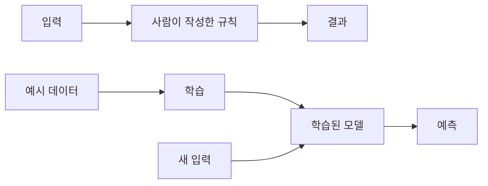
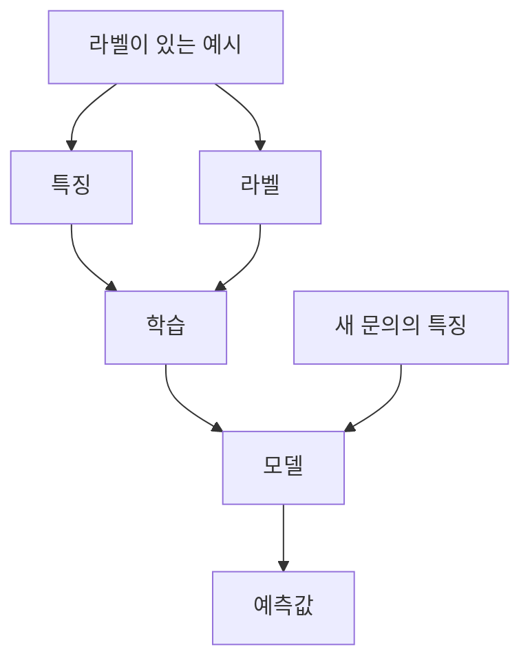

# 3.2 데이터에서 패턴을 배운다는 것

3.1에서는 사람이 규칙을 직접 쓰는 방식의 강점과 한계를 봤습니다. 이번 절에서는 그 다음 질문으로 넘어갑니다. 사람이 모든 규칙을 쓰기 어렵다면, 시스템은 어떻게 데이터에서 판단 기준을 얻을 수 있을까요?

이 절의 목적은 머신러닝 알고리즘을 자세히 설명하는 것이 아닙니다. 선형회귀, 결정트리, 신경망 같은 알고리즘은 뒤의 머신러닝과 딥러닝 파트에서 다룹니다. 여기서는 “데이터에서 패턴을 배운다”는 말이 어떤 구조를 뜻하는지, 그리고 왜 이것이 규칙 기반 시스템과 다른지 이해하는 데 집중합니다.

## 목표

- 데이터에서 패턴을 배운다는 말의 기본 구조를 이해합니다.
- 예시(example), 특징(feature), 라벨(label), 모델(model)의 역할을 구분합니다.
- 학습(training)과 사용(inference)의 차이를 간단히 봅니다.
- 패턴 학습이 단순 암기와 다른 이유를 이해합니다.
- 데이터 품질과 일반화(generalization)가 중요한 이유를 봅니다.
- 3.3에서 다룰 명시적 규칙과 학습된 표현의 차이로 연결합니다.

## 먼저 작은 예제로 보기

추상적인 정의로 시작하면 “패턴을 배운다”는 말이 막연하게 느껴질 수 있습니다. 먼저 고객 문의를 분류하는 작은 예시를 보겠습니다.

고객센터에 다음과 같은 문의가 들어온다고 해 봅니다.

| 문의 문장 | 사람이 붙인 분류 |
| --- | --- |
| “환불하고 싶어요.” | 환불 |
| “결제 취소 가능한가요?” | 환불 |
| “배송이 언제 오나요?” | 배송 |
| “내일까지 안 오면 취소할게요.” | 배송 |
| “상품이 깨져서 왔어요.” | 교환 또는 재배송 |
| “다시 보내 주세요.” | 교환 또는 재배송 |
| “주소를 바꾸고 싶어요.” | 배송 정보 변경 |
| “받는 사람 전화번호를 수정하고 싶어요.” | 배송 정보 변경 |

규칙 기반으로 접근하면 사람이 다음과 같은 규칙을 직접 작성해야 합니다.

```text
문장에 "환불" 또는 "취소"가 있으면 환불로 분류한다.
문장에 "배송" 또는 "내일"이 있으면 배송으로 분류한다.
문장에 "깨져" 또는 "다시 보내"가 있으면 교환 또는 재배송으로 분류한다.
문장에 "주소" 또는 "전화번호"가 있으면 배송 정보 변경으로 분류한다.
```

처음에는 이 방식도 그럴듯합니다. 하지만 곧 애매한 문장이 나옵니다.

```text
배송이 늦으면 환불 말고 다시 받을 수 있나요?
```

이 문장에는 `배송`, `환불`, `다시 받을`이라는 단서가 함께 있습니다. 단어 하나만 보고 분류하면 틀릴 수 있습니다. 그래서 학습 기반 접근은 질문을 바꿉니다.

```text
어떤 단어가 있으면 무조건 어떤 분류로 보낼까?
```

가 아니라,

```text
과거 문의와 분류를 많이 봤을 때,
새 문의는 어떤 분류와 가장 비슷한 구조를 가지는가?
```

를 묻습니다.

이 절의 나머지 설명은 이 작은 예시를 계속 떠올리며 읽으면 됩니다. `예시`, `특징`, `라벨`, `모델`, `학습`, `추론`은 모두 이 고객 문의 분류 과정을 설명하기 위한 이름입니다.

## 규칙을 쓰는 대신 관계를 찾는다

규칙 기반 시스템은 사람이 판단 기준을 문장이나 코드로 작성합니다.

```text
조건 A와 조건 B가 만족되면 결과 C를 낸다.
```

머신러닝(machine learning)은 접근이 다릅니다. 사람이 모든 조건을 직접 쓰는 대신, 과거 데이터나 예시에서 입력과 출력 사이의 관계를 찾습니다.

```text
예시 데이터 -> 학습 -> 모델 -> 새 입력에 대한 예측
```

Tom Mitchell의 머신러닝 교재 소개 페이지도 머신러닝을 경험을 통해 자동으로 개선되는 알고리즘을 연구하는 분야로 설명합니다. 여기서 중요한 말은 “경험”입니다. 이 절의 고객 문의 예시에서 경험은 과거 문의 문장과 사람이 붙인 분류입니다.

앞의 고객 문의 분류 예시로 다시 보면 다음과 같습니다.

| 접근 | 질문 | 작업 |
| --- | --- | --- |
| 규칙 기반 | 어떤 단어가 있으면 어떤 분류로 보낼 것인가? | 사람이 단어, 조건, 예외를 규칙으로 작성합니다. |
| 학습 기반 | 과거 문의와 분류에는 어떤 관계가 반복되는가? | 문의 문장과 분류 예시를 모아 모델이 구분 기준을 학습하게 합니다. |

두 방식 모두 입력을 받아 결과를 냅니다. 차이는 판단 기준을 어디서 얻는가에 있습니다. 규칙 기반 시스템은 사람이 기준을 명시적으로 쓰고, 머신러닝 모델은 데이터에서 기준을 조정합니다.



## 패턴은 반복되는 관계다

여기서 말하는 패턴(pattern)은 단순히 눈에 띄는 반복이 아닙니다. 학습에 쓸 수 있는 패턴은 새 데이터에 적용했을 때도 어느 정도 도움이 되는 관계여야 합니다.

고객 문의 예시에서 단순 반복은 다음처럼 보일 수 있습니다.

| 관찰 | 왜 조심해야 하는가 |
| --- | --- |
| `취소`라는 단어가 있으면 환불일 때가 많다 | “배송이 늦으면 취소할게요”는 배송 문제일 수도 있습니다. |
| `다시`라는 단어가 있으면 재배송일 때가 많다 | “다시 로그인해도 안 돼요”는 계정 문제일 수 있습니다. |
| `주소`라는 단어가 있으면 배송 정보 변경일 때가 많다 | “주소를 잘못 입력해서 환불하고 싶어요”는 환불 문제일 수 있습니다. |

따라서 패턴은 단어 하나가 아니라, 단어와 문맥, 문장 구조, 과거 분류 결과가 함께 만드는 반복 관계에 가깝습니다.

Fayyad, Piatetsky-Shapiro, Smyth의 KDD(knowledge discovery in databases) 개요 논문은 데이터에서 찾는 패턴을 데이터의 일부를 설명하는 표현이나 모델로 설명하고, 그런 패턴이 새 데이터에서도 어느 정도 유효해야 한다고 봅니다. 이 관점은 머신러닝을 이해할 때도 중요합니다. 데이터에서 찾은 관계가 과거 데이터에만 맞고 새 데이터에는 맞지 않는다면 좋은 패턴이라고 보기 어렵습니다.

예를 들어 다음 관계는 겉보기에는 패턴처럼 보일 수 있습니다.

```text
지난달에 파란색 아이콘을 클릭한 고객은 이탈률이 낮았다.
```

하지만 이 관계가 우연인지, 특정 이벤트 때문에 생긴 일시적 현상인지, 앞으로도 반복될 관계인지는 따로 확인해야 합니다. 머신러닝에서 중요한 것은 과거 데이터를 잘 설명하는 것만이 아니라, 새 입력에도 쓸 수 있는 관계를 찾는 것입니다.

| 구분 | 설명 |
| --- | --- |
| 단순 반복 | 과거 데이터 안에서 우연히 같이 나타난 현상일 수 있습니다. |
| 유용한 패턴 | 새 데이터에서도 예측이나 분류에 도움이 되는 관계입니다. |
| 과적합(overfitting) | 과거 데이터에 너무 맞춰져 새 데이터에 약한 상태입니다. |
| 과소적합(underfitting) | 데이터 안의 관계를 충분히 배우지 못해 학습 데이터에도 약한 상태입니다. |
| 일반화(generalization) | 학습하지 않은 새 데이터에도 어느 정도 맞는 상태입니다. |

이 절에서는 과적합(overfitting), 과소적합(underfitting), 일반화(generalization)를 “패턴 학습이 잘되었는지 판단하는 기본 상태”로만 소개합니다. 평가 방법과 검증 절차는 뒤의 머신러닝 파트에서 자세히 다룹니다.

## 예시, 특징, 라벨, 모델

지도학습(supervised learning)을 기준으로 보면 데이터는 보통 예시(example)의 모음으로 생각할 수 있습니다. 각 예시는 모델이 참고할 입력 값과, 예측해야 할 정답을 함께 가질 수 있습니다.

Google의 머신러닝 입문 자료는 지도학습에서 예시가 특징(features)과 라벨(label)을 포함한다고 설명합니다. 특징은 모델이 라벨을 예측하는 데 사용하는 값이고, 라벨은 모델이 맞히려는 정답 또는 목표 값입니다.

| 용어 | 영어 표현 | 의미 |
| --- | --- | --- |
| 예시 | example | 하나의 관찰 사례 또는 데이터 행 |
| 특징 | feature | 모델이 입력으로 사용하는 값 |
| 라벨 | label | 모델이 예측하려는 정답 또는 목표 값 |
| 모델 | model | 특징을 입력으로 받아 예측을 내는 계산 구조 |
| 학습 | training | 예시를 사용해 모델의 내부 값을 조정하는 과정 |
| 추론 | inference | 학습된 모델을 새 입력에 실행해 출력을 얻는 과정 |

고객 문의 분류 예시로 보면 다음과 같습니다.

| 예시 | 특징 | 라벨 |
| --- | --- | --- |
| 문의 1 | `환불`, `하고 싶어요` | 환불 |
| 문의 2 | `배송`, `언제` | 배송 |
| 문의 3 | `깨져서`, `왔어요` | 교환 또는 재배송 |
| 문의 4 | `주소`, `바꾸고 싶어요` | 배송 정보 변경 |

모델은 여러 예시를 보면서 특징과 라벨 사이의 관계를 학습합니다. 학습이 끝나면 라벨이 아직 없는 새 문의에 대해 어느 분류가 그럴듯한지 예측할 수 있습니다.



## 학습은 모델 안의 기준을 조정하는 일이다

규칙 기반 시스템에서는 사람이 기준을 직접 고칩니다. 반면 머신러닝에서는 학습 데이터와 평가 기준을 사용해 모델 내부의 파라미터(parameter)를 조정합니다.

파라미터는 모델이 입력을 출력으로 바꿀 때 사용하는 조정 가능한 값입니다. 선형 모델에서는 계수(coefficient)가 파라미터가 될 수 있고, 신경망에서는 가중치(weights)가 파라미터가 됩니다. 이 절에서는 수식을 깊게 다루지 않고, 파라미터를 “학습 과정에서 바뀌는 내부 값” 정도로 이해하면 충분합니다.

학습 과정을 단순화하면 다음과 같습니다.

```text
1. 모델이 입력을 보고 예측한다.
2. 예측과 정답의 차이를 계산한다.
3. 차이가 줄어들도록 모델 내부 값을 조정한다.
4. 여러 예시에 대해 이 과정을 반복한다.
```

이 구조를 표로 보면 규칙 기반 시스템과 차이가 분명해집니다.

| 구분 | 규칙 기반 시스템 | 학습 기반 모델 |
| --- | --- | --- |
| 기준을 만드는 주체 | 사람이 규칙을 작성함 | 데이터와 학습 절차가 파라미터를 조정함 |
| 수정 방식 | 규칙 추가, 삭제, 우선순위 변경 | 학습 데이터, 목적 함수, 알고리즘으로 내부 값 조정 |
| 오류 대응 | 어떤 규칙이 잘못되었는지 확인 | 어떤 데이터, 특징, 평가 기준, 모델 구조가 문제인지 확인 |
| 결과 설명 | 적용된 규칙을 추적하기 쉬움 | 모델에 따라 설명이 어려울 수 있음 |

이 차이 때문에 머신러닝 모델은 복잡한 패턴을 다룰 수 있지만, 규칙 기반 시스템보다 검토 방식이 달라집니다. 규칙을 읽어 보는 것만으로는 충분하지 않고, 데이터 품질, 평가 결과, 실패 사례를 함께 봐야 합니다.

## 학습은 암기가 아니다

“데이터에서 배운다”는 말을 “과거 사례를 저장했다가 그대로 꺼낸다”로 이해하면 곤란합니다. 머신러닝의 목표는 과거 데이터를 그대로 외우는 것이 아니라, 새 데이터에도 적용할 수 있는 관계를 찾는 것입니다.

앞에서 본 고객 문의 예시를 다시 사용해 보겠습니다.

| 입력 문장 | 라벨 |
| --- | --- |
| “환불하고 싶어요.” | 환불 |
| “배송이 언제 오나요?” | 배송 |
| “상품이 깨져서 왔어요.” | 교환 또는 재배송 |
| “주소를 바꾸고 싶어요.” | 배송 정보 변경 |

모델이 단순히 이 네 문장만 외웠다면, 다음 문장을 처리하기 어렵습니다.

```text
어제 받은 물건이 파손되어 다시 받고 싶습니다.
```

좋은 모델은 이 문장이 기존 예시와 단어가 완전히 같지 않아도, “파손”, “다시 받기” 같은 단서와 문맥을 통해 교환 또는 재배송 의도에 가깝다고 판단할 수 있어야 합니다.

즉 학습의 목표는 다음 둘을 구분하는 데 있습니다.

```text
그 문장을 본 적이 있는가?
```

가 아니라,

```text
그 문장이 이전에 본 어떤 유형의 문제와 비슷한가?
```

를 판단하는 것입니다.

| 상태 | 설명 |
| --- | --- |
| 암기 | 학습 데이터와 같은 입력에는 맞지만 조금만 달라져도 틀립니다. |
| 일반화 | 학습 데이터와 다르지만 비슷한 구조의 새 입력에도 대응합니다. |
| 과적합 | 학습 데이터의 세부 우연까지 따라가 새 데이터에 약해집니다. |
| 과소적합 | 충분한 관계를 배우지 못해 학습 데이터에도 약합니다. |

과적합과 과소적합은 서로 반대 방향의 실패 상태로 볼 수 있습니다. 과적합은 너무 많이 맞춘 문제이고, 과소적합은 충분히 배우지 못한 문제입니다. 여기서는 “데이터에서 패턴을 배운다”는 말이 “새 데이터에도 적용 가능한 관계를 찾는다”는 뜻임을 기억하면 됩니다.

scikit-learn의 과적합과 과소적합 예제도 같은 관점을 보여줍니다. 너무 단순한 모델은 학습 데이터를 충분히 설명하지 못하고, 너무 복잡한 모델은 학습 데이터의 잡음까지 배워 새 데이터에 약해질 수 있습니다.

## 데이터 품질이 모델 품질을 제한한다

학습 기반 모델은 데이터에서 기준을 얻습니다. 따라서 데이터가 좁거나, 편향되어 있거나, 라벨이 틀렸거나, 실제 사용 환경과 다르면 모델도 그 한계를 그대로 가질 수 있습니다.

Google의 머신러닝 입문 자료는 데이터셋의 크기(size)와 다양성(diversity)이 모델의 성능과 일반화에 영향을 준다고 설명합니다. 큰 데이터셋이라도 다양성이 부족하면 실제 환경을 충분히 대표하지 못할 수 있고, 다양성이 있어도 예시가 너무 적으면 안정적인 패턴을 찾기 어렵습니다.

| 데이터 문제 | 모델에 생길 수 있는 문제 |
| --- | --- |
| 예시가 너무 적음 | 우연한 관계를 패턴으로 착각할 수 있습니다. |
| 다양성이 부족함 | 특정 상황에서는 잘 맞지만 다른 상황에서 약해집니다. |
| 라벨이 부정확함 | 틀린 정답을 기준으로 학습합니다. |
| 중요한 특징이 빠짐 | 판단에 필요한 정보를 보지 못합니다. |
| 실제 사용 환경과 다름 | 배포 후 성능이 떨어질 수 있습니다. |

예를 들어 여름 데이터만으로 비 예측 모델을 만들면 겨울 강수 패턴에는 약할 수 있습니다. 특정 지역의 고객 문의만으로 모델을 만들면 다른 지역의 표현, 상품, 배송 정책에는 약할 수 있습니다. 데이터에서 학습한다는 것은 데이터가 가진 세계관을 모델이 따라간다는 뜻이기도 합니다.

따라서 머신러닝 프로젝트에서 중요한 질문은 “어떤 모델을 쓸 것인가?”만이 아닙니다.

```text
어떤 데이터를 모았는가?
무엇을 라벨로 삼았는가?
어떤 특징을 입력으로 넣었는가?
학습 데이터와 실제 사용 데이터는 얼마나 비슷한가?
새 데이터에서도 성능이 유지되는가?
```

## 사람의 이해와 빠른 판단을 비유로 보기

사람의 빠른 판단을 설명할 때 “컨텍스트 압축”이라는 표현을 떠올릴 수 있습니다. 다만 이 표현은 이 책에서 쓰는 학습용 비유이지, 표준 신경과학 용어로 쓰지는 않습니다. 여기서 말하는 압축은 뉴런의 신호 강화 같은 생물학적 메커니즘을 직접 설명하려는 것이 아니라, 사람이 이해한 개념과 기억된 정의를 바탕으로 복잡한 상황을 더 적은 의미 단위로 다룬다는 뜻에 가깝습니다.

인지심리학에서는 이와 가까운 설명으로 청킹(chunking)과 재부호화(recoding)를 이야기할 수 있습니다. Miller의 고전 논문은 사람이 입력을 익숙한 단위나 덩어리로 조직하고, 더 큰 덩어리로 묶으면서 기억할 수 있는 정보량을 늘릴 수 있다고 설명합니다. 처음에는 각각의 소리로 들리던 신호가 학습을 통해 글자, 단어, 구절 같은 더 큰 단위로 묶이는 예가 여기에 해당합니다. 이 근거는 사람의 정보 처리에 대한 비유를 뒷받침하기 위한 것이며, 머신러닝 모델이 사람처럼 이해한다는 근거로 쓰지는 않습니다.

AI 학습을 이해할 때 이 비유는 도움이 됩니다. 사람은 매번 모든 정보를 처음부터 계산하지 않습니다. 이미 배운 개념, 정의, 경험, 상황 맥락을 사용해 현재 입력을 빠르게 해석합니다.

예를 들어 다음 문장을 보겠습니다.

```text
배송이 내일까지 안 오면 취소할게요.
```

사람은 이 문장을 글자 하나씩 따로 처리하기보다, “배송 지연”, “취소 가능성”, “고객 불만”, “기한 조건” 같은 의미 단위로 묶어 이해합니다. 그래서 빠르게 다음 행동 후보를 떠올릴 수 있습니다.

| 입력에서 보이는 표현 | 사람이 빠르게 묶는 의미 |
| --- | --- |
| 배송이 내일까지 안 오면 | 배송 지연과 기한 조건 |
| 취소할게요 | 취소 의도 또는 취소 가능성 |
| 전체 문장 | 고객이 기한을 조건으로 문제 해결을 요구함 |

이것은 패턴이 나타나는 한 가지 모양으로 볼 수 있습니다. 반복되는 표현과 상황을 경험하면서 사람은 입력의 세부 조각을 더 큰 의미 단위로 묶고, 그 의미 단위는 다음 판단을 빠르게 만듭니다.


예를 들어 고객 문의 업무에서는 다음과 같은 패턴 모양이 생길 수 있습니다.

| 반복되는 입력 | 묶인 의미 단위 | 빠르게 떠오르는 판단 |
| --- | --- | --- |
| “내일까지 안 오면 취소” | 배송 지연 + 기한 + 취소 가능성 | 배송 상태 확인, 취소 정책 안내 |
| “깨져서 왔다” | 파손 + 수령 완료 | 교환, 재배송, 사진 확인 |
| “환불은 아니고 주소만” | 환불 부정 + 배송 정보 변경 | 주소 변경 가능 여부 확인 |
| “지난번처럼 처리” | 이전 이력 참조 | 대화 기록 또는 주문 이력 조회 |

여기서 중요한 점은 패턴이 단순한 단어 목록이 아니라는 것입니다. “취소”라는 단어가 항상 취소 요청을 뜻하지는 않습니다. “취소하지 않으려면 언제 도착하나요?”처럼 조건, 부정, 문맥에 따라 의미가 달라집니다. 그래서 사람의 빠른 판단은 단어 하나가 아니라, 상황과 의미 단위가 함께 묶인 패턴에 가깝습니다.

이 비유는 머신러닝과 사람의 사고를 같다고 말하기 위한 것이 아닙니다. 사람의 이해는 언어, 목적, 기억, 사회적 맥락, 경험을 함께 사용합니다. 머신러닝 모델은 데이터에서 통계적 관계나 표현을 학습합니다. 둘은 다르지만, “모든 규칙을 매번 처음부터 쓰거나 계산하지 않고, 학습된 구조를 사용해 빠르게 판단한다”는 점에서 비교해 볼 수 있습니다.

따라서 이 책에서는 컨텍스트 압축이라는 표현을 다음 정도로만 사용합니다.

> 사람은 이해한 개념과 기억된 정의를 바탕으로 복잡한 입력을 의미 있는 단위로 묶어 빠르게 판단할 수 있다. 머신러닝의 패턴 학습은 이와 동일한 과정은 아니지만, 새 입력을 학습된 구조에 비추어 처리한다는 점에서 학습용 비유로 연결해 볼 수 있다.

## 패턴 학습은 확률적 판단과 연결된다

현실의 데이터는 깔끔하게 나뉘지 않습니다. 같은 단어를 써도 의도가 다를 수 있고, 비슷한 행동을 해도 결과가 다를 수 있습니다. 그래서 학습 기반 모델은 많은 경우 결과를 확정 규칙이 아니라 점수(score), 확률(probability), 순위(ranking) 같은 형태로 냅니다.

예를 들어 고객 문의 분류 모델은 다음처럼 판단할 수 있습니다.

| 후보 라벨 | 모델 점수 |
| --- | ---: |
| 배송 문의 | 0.62 |
| 주문 취소 | 0.24 |
| 환불 | 0.09 |
| 기타 | 0.05 |

이 점수는 “모델이 이렇게 계산했다”는 신호이지, 반드시 실제 정답이라는 뜻은 아닙니다. 그래서 학습 기반 시스템에서는 모델 출력 뒤에 임계값(threshold), 사람 검토, 규칙 기반 안전장치가 붙을 수 있습니다.


이 구조는 3.1의 결론과 연결됩니다. 규칙 기반 시스템과 머신러닝은 서로 대체만 하는 관계가 아닙니다. 모델은 사람이 규칙으로 쓰기 어려운 패턴을 찾고, 규칙은 반드시 지켜야 하는 절차와 안전 조건을 관리할 수 있습니다.

## 이 절에서 기억할 관점

데이터에서 패턴을 배운다는 것은 과거 사례를 그대로 외우는 것이 아닙니다. 이 절의 지도학습 예시에서는 예시 데이터에서 입력과 출력의 관계를 찾아 새 데이터에도 적용하려는 시도로 이해하면 됩니다.

이 전환은 규칙 기반 시스템의 한계에서 출발합니다. 사람이 모든 예외와 복잡한 패턴을 직접 쓰기 어려운 문제에서는 데이터에서 관계를 찾는 방식이 유용해집니다. 하지만 데이터에서 배운 모델도 완전하지 않습니다. 데이터 품질, 라벨, 특징, 평가, 실제 사용 환경에 따라 모델의 판단은 달라질 수 있습니다.

따라서 학습 기반 AI를 이해할 때는 모델만 보지 말고, 데이터가 어떻게 만들어졌고 어떤 기준으로 학습되었으며 새 데이터에서 어떻게 검증되는지를 함께 봐야 합니다. 다음 절에서는 이 흐름을 이어 받아, 명시적 규칙과 학습된 표현이 어떻게 다른지 정리합니다.

## 체크리스트

- 데이터에서 패턴을 배운다는 말을 새 데이터에 적용 가능한 관계를 찾는 과정으로 설명할 수 있다.
- 예시, 특징, 라벨, 모델, 학습, 추론의 역할을 구분할 수 있다.
- 학습이 모델 내부의 파라미터를 조정하는 과정임을 설명할 수 있다.
- 학습이 단순 암기와 다르며 일반화가 중요하다는 점을 설명할 수 있다.
- 데이터의 크기, 다양성, 라벨 품질이 모델 성능에 영향을 준다는 점을 설명할 수 있다.
- 사람의 빠른 판단을 청킹과 재부호화 관점의 학습용 비유로 설명하되, 머신러닝과 동일시하지 않을 수 있다.
- 모델 출력이 점수나 확률일 수 있으며, 실제 시스템에서는 규칙과 검토 절차가 함께 필요하다는 점을 설명할 수 있다.

## 출처와 참고 자료

- Stanford Encyclopedia of Philosophy, Selmer Bringsjord and Naveen Sundar Govindarajulu, [Artificial Intelligence](https://plato.stanford.edu/entries/artificial-intelligence/), 2018-07-12, 확인 날짜: 2026-06-22.
- Tom Mitchell, [Machine Learning textbook](https://www.cs.cmu.edu/~tom/mlbook.html), Carnegie Mellon University, McGraw Hill, 1997, 확인 날짜: 2026-06-22.
- Google for Developers, [Supervised Learning](https://developers.google.com/machine-learning/intro-to-ml/supervised), 확인 날짜: 2026-06-22.
- scikit-learn, [Underfitting vs. Overfitting](https://scikit-learn.org/stable/auto_examples/model_selection/plot_underfitting_overfitting.html), 확인 날짜: 2026-06-22.
- Usama Fayyad, Gregory Piatetsky-Shapiro, Padhraic Smyth, [From Data Mining to Knowledge Discovery in Databases](https://www.kdnuggets.com/gpspubs/aimag-kdd-overview-1996-Fayyad.pdf), AI Magazine, 1996, 확인 날짜: 2026-06-22.
- George A. Miller, [The Magical Number Seven, Plus or Minus Two: Some Limits on our Capacity for Processing Information](http://psychclassics.yorku.ca/Miller/), Psychological Review, 1956, 확인 날짜: 2026-06-22.
