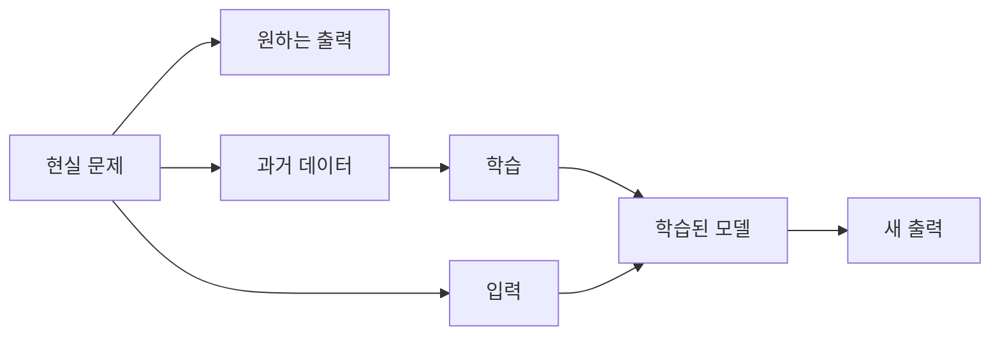

# 4.2 입력(input), 출력(output), 데이터(data)

4.1에서는 모델을 현실 문제 전체가 아니라 목적에 맞게 줄여 만든 계산 가능한 모형으로 정리했습니다. 이제 그 모델을 만들기 위해 무엇을 정해야 하는지 봅니다.

```text
무엇을 넣고, 무엇을 얻고, 어떤 사례를 모을 것인가?
```

이 절에서는 `입력(input)`, `출력(output)`, `데이터(data)`를 정리합니다. 특징(feature), 표현(representation), 파라미터(parameter)는 4.3에서 다룹니다.

이 절은 한 번에 많은 용어를 외우기보다, 하나의 예시를 계속 바꿔 보며 읽는 방식으로 진행합니다.

```text
예시 상황: 고객 문의를 AI로 도와주고 싶다.
```

이 문장은 아직 모델링 과제가 아닙니다. “도와준다”는 말이 너무 넓기 때문입니다. 이 넓은 말을 입력, 출력, 데이터로 나누어야 모델이 맡을 수 있는 작은 과제가 됩니다.

## 목표

- 입력(input), 출력(output), 데이터(data)의 역할을 구분합니다.
- 현실 문제를 입력과 출력의 관계로 보는 관점을 이해합니다.
- 같은 현실 문제도 출력 정의에 따라 다른 AI 문제가 됨을 봅니다.
- 데이터가 단순 파일 모음이 아니라 모델이 배울 기준을 제공하는 사례(example)의 모음이라는 점을 이해합니다.
- 4.3에서 다룰 특징과 표현으로 넘어갈 준비를 합니다.

## 문제를 계산 가능한 형태로 바꾸기

AI 모델은 현실 문제 전체를 그대로 다루지 않습니다. 사람이 현실의 상황 중 일부를 골라 입력으로 만들고, 모델이 만들어야 할 출력을 정해야 합니다.

예를 들어 “고객 문의를 처리하고 싶다”는 말은 아직 모델링 과제가 아닙니다. 너무 넓고 모호합니다.

이 말을 조금씩 좁혀 보겠습니다.

| 단계 | 아직 부족한 표현 | 더 나아진 표현 |
| --- | --- | --- |
| 1 | 고객 문의를 처리하고 싶다 | 고객 문의를 분류하고 싶다 |
| 2 | 고객 문의를 분류하고 싶다 | 고객 문의 문장을 보고 문의 유형을 분류하고 싶다 |
| 3 | 고객 문의 문장을 보고 문의 유형을 분류하고 싶다 | 문의 문장을 입력으로 받아 `환불`, `배송`, `교환`, `기타` 중 하나를 출력하고 싶다 |

세 번째 문장이 되면 모델링 과제에 가까워집니다. 무엇을 넣을지, 무엇을 얻을지, 어떤 과거 사례가 필요한지 보이기 시작하기 때문입니다.

AI 모델링 과제가 되려면 다음처럼 좁혀야 합니다.

| 질문 | 예시 답 |
| --- | --- |
| 입력은 무엇인가? | 고객이 작성한 문의 문장 |
| 출력은 무엇인가? | 환불, 배송, 교환, 기타 중 하나의 분류 |
| 데이터는 무엇인가? | 과거 문의 문장과 사람이 붙인 분류 |
| 모델은 무엇을 해야 하는가? | 새 문의가 어느 분류에 가까운지 예측 |

이렇게 바꾸면 현실 업무가 다음 구조로 정리됩니다.

```text
입력 -> 모델 -> 출력
```



Stanford Encyclopedia of Philosophy의 AI 항목은 지능형 에이전트를 환경에서 지각(percepts)을 받고 행동(actions)을 수행하는 함수로 설명하는 Russell과 Norvig의 관점을 소개합니다. 이 관점은 AI 문제를 입력과 출력, 또는 지각과 행동의 관계로 보는 데 도움이 됩니다.

다만 이 구조는 학습을 위한 단순화입니다. 실제 서비스에서는 입력 전에 전처리, 권한 확인, 개인정보 제거가 있을 수 있고, 출력 뒤에는 사람 검토, 정책 규칙, 업무 시스템 연동이 붙을 수 있습니다.

## 입력은 모델이 받는 관찰이다

입력(input)은 모델이 판단을 위해 받는 정보입니다. 입력은 문장일 수도 있고, 이미지일 수도 있고, 센서 값이나 표 형식 데이터일 수도 있습니다.

| 문제 | 입력 예시 |
| --- | --- |
| 고객 문의 분류 | 문의 문장 |
| 스팸 메일 분류 | 이메일 제목과 본문 |
| 비 예측 | 온도, 습도, 기압, 지역, 시간 |
| 얼굴 인식 | 얼굴 이미지 |
| 상품 추천 | 사용자의 클릭, 구매, 검색 기록 |
| 장애 탐지 | CPU, 메모리, 오류율, 응답 시간 |

입력을 정할 때 중요한 점은 “현실에서 중요한 것”과 “모델에 실제로 들어가는 것”이 다를 수 있다는 점입니다. 고객의 진짜 의도는 중요하지만, 모델이 받는 입력이 문의 문장뿐이라면 모델은 그 문장 안에 드러난 단서만 사용할 수 있습니다.

고객 문의 예시를 더 자세히 보겠습니다.

| 현실에서 사람이 볼 수 있는 정보 | 모델 입력으로 넣기로 한 정보 |
| --- | --- |
| 고객 문의 문장 | 문의 문장 |
| 고객의 과거 주문 내역 | 넣지 않음 |
| 배송 상태 | 넣지 않음 |
| 상담원이 이전에 남긴 메모 | 넣지 않음 |
| 고객 등급이나 민감 정보 | 넣지 않음 |

이 경우 모델은 문의 문장만 보고 판단합니다. 사람이 보기에는 배송 상태가 중요하더라도, 그 정보가 입력에 없으면 모델은 사용할 수 없습니다.

예를 들어 다음 두 문의는 문장만 보면 비슷하지만, 실제 처리는 다를 수 있습니다.

| 문의 문장 | 문장만 볼 때 | 추가 정보가 있으면 달라질 수 있는 점 |
| --- | --- | --- |
| “아직 안 왔어요.” | 배송 문의로 볼 수 있음 | 실제로는 주문이 결제 실패 상태일 수 있음 |
| “취소하고 싶어요.” | 환불 또는 취소 문의로 볼 수 있음 | 이미 배송 중이면 반품 절차가 필요할 수 있음 |

따라서 입력을 정한다는 것은 “모델에게 무엇을 보여 줄 것인가”를 정하는 일입니다. 동시에 “모델에게 무엇을 보여 주지 않을 것인가”를 정하는 일이기도 합니다.

따라서 입력을 정할 때는 다음 질문이 필요합니다.

```text
모델이 실제로 볼 수 있는 정보는 무엇인가?
그 정보는 판단에 충분한가?
중요하지만 빠진 정보는 없는가?
개인정보나 민감 정보가 포함되는가?
```

## 출력은 모델에게 시키는 일이다

출력(output)은 모델이 내야 하는 결과입니다. 같은 입력을 사용하더라도 출력을 어떻게 정하느냐에 따라 완전히 다른 문제가 됩니다.

예를 들어 같은 고객 문의 문장을 가지고도 다음처럼 여러 출력을 만들 수 있습니다.

| 출력 정의 | 문제의 성격 |
| --- | --- |
| 문의 유형 하나를 고른다 | 분류(classification) |
| 긴급도를 1부터 5까지 예측한다 | 점수 예측 또는 회귀(regression)에 가까움 |
| 담당 부서를 추천한다 | 추천 또는 분류 |
| 답변 초안을 생성한다 | 생성(generation) |
| 사람 검토가 필요한지 판단한다 | 이진 분류(binary classification) |

따라서 “AI로 고객 문의를 처리한다”는 말만으로는 충분하지 않습니다. 모델이 내야 하는 출력이 분류인지, 점수인지, 추천인지, 생성인지 정해야 합니다.

같은 입력 문장을 놓고 출력 정의가 어떻게 달라지는지 보겠습니다.

입력이 다음과 같다고 하겠습니다.

```text
“어제 주문했는데 아직 배송 조회가 안 됩니다.”
```

이 문장 하나도 출력 정의에 따라 다른 과제가 됩니다.

| 모델에게 시키는 일 | 출력 예시 | 설명 |
| --- | --- | --- |
| 문의 유형을 고른다 | 배송 | 정해진 범주 중 하나를 고릅니다. |
| 긴급도를 매긴다 | 2 | 숫자 점수를 냅니다. |
| 담당 부서를 추천한다 | 물류팀 | 업무 연결 대상을 고릅니다. |
| 답변 초안을 만든다 | “배송 조회 반영까지 시간이 걸릴 수 있습니다...” | 문장을 생성합니다. |
| 사람 검토 필요 여부를 판단한다 | 아니오 | 자동 처리 가능성을 판단합니다. |

여기서 중요한 점은 입력이 같아도 출력이 바뀌면 필요한 데이터와 평가 기준도 바뀐다는 점입니다. 문의 유형 분류 모델을 만들려면 과거 문의에 `배송`, `환불`, `교환` 같은 라벨이 붙어 있어야 합니다. 답변 초안 생성 모델을 만들려면 좋은 답변 예시나 답변 작성 기준이 필요합니다.

출력은 모델의 성공 기준과도 연결됩니다. 문의 유형을 맞히는 모델은 정확도(accuracy) 같은 지표를 볼 수 있고, 답변 초안을 만드는 모델은 사실성, 안전성, 문체, 근거 사용 여부 같은 다른 기준이 필요합니다. 평가 지표는 뒤의 머신러닝 파트에서 자세히 다루지만, 출력 정의가 평가 기준을 바꾼다는 점은 여기서 기억해야 합니다.

출력을 정할 때는 다음 질문이 필요합니다.

```text
모델이 하나의 범주를 고르면 되는가?
숫자 점수를 내야 하는가?
문장을 생성해야 하는가?
사람이 최종 확인할 중간 결과를 내면 되는가?
이 출력이 실제 업무 목표와 연결되는가?
```

## 데이터는 입력과 출력 사례의 모음이다

데이터(data)는 모델이 참고하거나 학습할 사례의 모음입니다. 지도학습(supervised learning)에서는 보통 입력과 정답 출력이 함께 있는 사례를 사용합니다.

Google의 머신러닝 입문 자료는 지도학습에서 예시(example)가 특징(features)과 라벨(label)을 포함한다고 설명합니다. 4.2에서는 이를 더 단순하게, 하나의 사례가 “입력과 원하는 출력의 묶음”이 될 수 있다고 보면 됩니다.

| 입력 | 출력 |
| --- | --- |
| “환불하고 싶어요.” | 환불 |
| “배송이 언제 오나요?” | 배송 |
| “상품이 깨져서 왔어요.” | 교환 또는 재배송 |
| “주소를 바꾸고 싶어요.” | 배송 정보 변경 |

이 표는 단순하지만 중요한 구조를 보여 줍니다.

```text
사례 1 = 입력 1 + 출력 1
사례 2 = 입력 2 + 출력 2
사례 3 = 입력 3 + 출력 3
...
```

조금 더 천천히 말하면, 데이터는 모델에게 보여 주는 과거 사례입니다.

```text
이런 입력이 들어왔을 때,
사람은 이런 출력을 기대했다.
```

모델은 이 반복된 사례를 통해 입력과 출력 사이의 관계를 조정합니다. Google의 머신러닝 입문 자료는 지도학습에서 예시가 특징과 라벨을 포함한다고 설명합니다. 여기서는 아직 특징을 자세히 다루지 않으므로, “모델이 참고할 입력과 원하는 출력이 함께 있는 사례” 정도로 이해하면 충분합니다.

데이터를 만들 때도 속도를 늦춰 생각해야 합니다. 같은 고객 문의라도 라벨 기준이 흔들리면 모델이 배우기 어렵습니다.

| 입력 | 라벨 A | 라벨 B | 문제 |
| --- | --- | --- | --- |
| “결제 취소하고 싶어요.” | 환불 | 취소 | 같은 뜻을 다른 라벨로 붙임 |
| “배송 전에 주소 바꿀 수 있나요?” | 배송 | 주소 변경 | 라벨 체계가 겹침 |
| “상품이 깨져서 왔어요.” | 교환 | 불량 | 처리 기준과 원인 기준이 섞임 |

이런 데이터는 파일로는 존재하지만, 좋은 학습 사례라고 보기 어렵습니다. 모델이 배울 기준이 흔들리기 때문입니다.

더 나은 데이터는 라벨 기준이 먼저 정리되어 있어야 합니다.

| 라벨 | 라벨 기준 |
| --- | --- |
| 환불 | 결제 취소, 환불 요청, 주문 취소 의도가 중심인 문의 |
| 배송 | 배송 조회, 배송 지연, 배송지 변경이 중심인 문의 |
| 교환 | 파손, 불량, 다른 상품 수령 등 교환이나 재배송이 필요한 문의 |
| 기타 | 위 기준에 명확히 들어가지 않는 문의 |

학습 기반 모델은 이런 사례를 사용해 입력과 출력 사이의 관계를 조정합니다. 다만 데이터가 있다고 해서 자동으로 좋은 모델이 되는 것은 아닙니다. 모델은 데이터에 없는 관계를 안정적으로 배울 수 없고, 잘못된 데이터의 관계도 그대로 배울 수 있습니다. 데이터가 실제 사용 환경을 충분히 대표하는지, 출력 라벨이 일관적인지, 잘못된 사례가 섞이지 않았는지 확인해야 합니다.

## 같은 현실 문제도 여러 데이터셋이 될 수 있다

현실 문제 하나가 항상 하나의 데이터셋으로 정해지는 것은 아닙니다. 어떤 입력과 출력을 고르느냐에 따라 데이터셋의 모양이 달라집니다.

예를 들어 “배송 문제를 줄이고 싶다”는 목표를 생각해 보겠습니다.

| 입력 | 출력 | 만들 수 있는 문제 |
| --- | --- | --- |
| 주문 지역, 상품 종류, 출고 시간 | 배송 지연 여부 | 지연 예측 |
| 고객 문의 문장 | 문의 유형 | 문의 분류 |
| 배송 추적 이벤트 | 다음 상태 | 배송 상태 예측 |
| 과거 지연 사례 | 지연 원인 | 원인 분류 |
| 고객 문의와 주문 정보 | 답변 초안 | 답변 생성 |

이 예시는 문제 정의가 데이터의 모양을 결정한다는 점을 보여 줍니다. 같은 업무 목표라도 입력과 출력이 다르면 필요한 데이터, 모델, 평가 방법이 달라집니다.

반대로 말하면, “데이터를 많이 모으자”만으로는 부족합니다. 어떤 입력과 출력을 학습할 데이터인지 먼저 정해야 합니다.

| 목표 | 모아야 할 데이터가 달라지는 이유 |
| --- | --- |
| 배송 지연을 예측하고 싶다 | 주문 시간, 출고 시간, 지역, 택배 상태 같은 구조화 데이터가 필요합니다. |
| 배송 문의를 분류하고 싶다 | 고객 문의 문장과 문의 유형 라벨이 필요합니다. |
| 배송 답변을 생성하고 싶다 | 문의 문장, 주문 상태, 정책, 좋은 답변 예시가 필요합니다. |

같은 “배송 문제”라도 모델에게 시키는 일이 다르면 데이터의 모양도 달라집니다.

## 입력과 출력이 잘못 정해지면 모델도 빗나간다

모델이 틀리는 이유가 항상 알고리즘에 있는 것은 아닙니다. 입력과 출력 정의가 애초에 문제를 잘못 잡았을 수도 있습니다.

예를 들어 고객 불만을 줄이고 싶으면서 입력으로 문의 문장만 사용하고, 출력으로 문의 유형만 예측한다고 해 봅니다. 이 모델은 문의를 분류할 수는 있지만, 고객 불만의 원인이 배송 지연인지, 상품 품질인지, 환불 정책인지 직접 해결하지는 못합니다.

다음과 같은 실수가 자주 생깁니다.

| 실수 | 결과 |
| --- | --- |
| 입력에 필요한 정보가 빠짐 | 모델이 중요한 단서를 보지 못합니다. |
| 출력이 너무 모호함 | 라벨이 사람마다 달라지고 학습이 흔들립니다. |
| 실제 목표와 출력이 다름 | 모델 성능은 좋아도 업무 문제는 해결되지 않습니다. |
| 데이터가 실제 환경과 다름 | 배포 후 성능이 떨어집니다. |
| 민감 정보를 무심코 입력에 포함함 | 개인정보, 보안, 윤리 문제가 생길 수 있습니다. |

따라서 모델을 고르기 전에 먼저 입력과 출력을 검토해야 합니다.

```text
이 입력으로 정말 이 출력을 판단할 수 있는가?
이 출력은 우리가 해결하려는 문제와 연결되는가?
이 데이터는 실제 사용할 상황을 대표하는가?
```

## 이 절에서 기억할 관점

현실 문제는 바로 모델 문제가 되지 않습니다. 모델 문제가 되려면 입력, 출력, 데이터가 정해져야 합니다.

입력은 모델이 볼 수 있는 관찰이고, 출력은 모델에게 시키는 일입니다. 데이터는 그 입력과 출력의 사례를 모은 것입니다. 같은 현실 문제도 입력과 출력을 어떻게 정하느냐에 따라 분류, 예측, 추천, 생성 문제로 달라질 수 있습니다.

이 절의 흐름은 다음처럼 다시 정리할 수 있습니다.

```text
현실 문제: 고객 문의를 처리하고 싶다.
입력: 모델에게 보여 줄 정보는 무엇인가?
출력: 모델에게 어떤 결과를 만들게 할 것인가?
데이터: 그런 입력과 출력의 과거 사례가 있는가?
```

이 세 가지가 정리되어야 다음 단계인 특징, 표현, 파라미터를 이야기할 수 있습니다.

4.3에서는 이 입력이 모델 내부에서 어떻게 특징(feature), 표현(representation), 파라미터(parameter)와 연결되는지 더 자세히 봅니다.

## 체크리스트

- 입력(input), 출력(output), 데이터(data)의 역할을 구분할 수 있다.
- 현실 문제를 `입력 -> 모델 -> 출력` 구조로 바꾸어 설명할 수 있다.
- 같은 입력이라도 출력 정의에 따라 문제의 성격이 달라질 수 있음을 설명할 수 있다.
- 데이터가 입력과 출력 사례의 모음임을 설명할 수 있다.
- 데이터가 모델의 내부 기준을 조정하는 근거가 됨을 설명할 수 있다.
- 입력과 출력 정의가 잘못되면 모델 선택 이전에 문제가 생길 수 있음을 설명할 수 있다.

## 출처와 참고 자료

- Stanford Encyclopedia of Philosophy, Selmer Bringsjord and Naveen Sundar Govindarajulu, [Artificial Intelligence](https://plato.stanford.edu/entries/artificial-intelligence/), 2018-07-12, 확인 날짜: 2026-06-22.
- Google for Developers, [Supervised Learning](https://developers.google.com/machine-learning/intro-to-ml/supervised), 확인 날짜: 2026-06-22.
