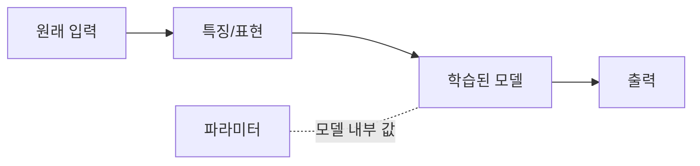

# 4.3 특징(feature), 표현(representation), 파라미터(parameter)

4.2에서는 모델에게 무엇을 보여 주고 무엇을 받으려는지, 즉 `입력(input)`, `출력(output)`, `데이터(data)`의 관계를 봤습니다. 이번 절에서는 그 입력이 모델 안에서 어떤 계산 재료로 보이는지 설명합니다.

중심 질문은 다음과 같습니다.

```text
모델은 입력을 그대로 보는가?
아니면 입력을 계산하기 쉬운 값으로 바꿔서 보는가?
```

이 절에서는 `특징(feature)`, `표현(representation)`, `파라미터(parameter)`를 입문 수준에서 정리합니다. 수식이나 알고리즘을 깊게 설명하지 않고, 4.2의 고객 문의 예시를 이어 받아 모델을 읽는 데 필요한 용어의 위치를 잡는 데 집중합니다.

## 이 절의 범위

4.3은 모델을 직접 만드는 방법을 설명하는 절이 아닙니다. 어떤 알고리즘을 고를지, 어떤 구조로 모델을 만들지, 어떤 학습 절차를 쓸지는 뒤의 머신러닝과 딥러닝 장에서 다룹니다.

여기서 필요한 질문은 더 작습니다.

```text
이미 정해진 모델을 볼 때,
입력은 어떤 값으로 바뀌어 들어가고,
모델 안의 어떤 값이 출력 계산에 쓰이는가?
```

따라서 이 절의 목표는 모델 제작 절차가 아니라, 모델의 계산 흐름을 읽기 위한 기본 어휘를 갖추는 것입니다.

## 목표

- 특징(feature)을 모델이 입력에서 사용하는 값으로 이해합니다.
- 표현(representation)을 원래 데이터를 계산하기 쉬운 형태로 바꾼 결과로 이해합니다.
- 파라미터(parameter)를 모델 내부에서 출력 계산에 쓰이는 조정된 값으로 이해합니다.
- 원래 입력, 특징, 표현, 파라미터가 같은 말이 아님을 구분합니다.
- 4.4에서 다룰 문제 정의와 모델의 관계로 넘어갈 준비를 합니다.

## 원래 입력은 그대로 계산하기 어렵다

4.2의 고객 문의 예시를 다시 보겠습니다.

```text
배송이 내일까지 안 오면 취소할게요.
```

사람은 이 문장을 읽고 여러 단서를 함께 봅니다.

| 사람이 볼 수 있는 단서 | 가능한 의미 |
| --- | --- |
| 배송 | 배송과 관련된 문의 |
| 내일까지 | 기한 조건 |
| 안 오면 | 배송 지연 가능성 |
| 취소할게요 | 취소 의도 또는 압박 |

하지만 모델은 문장을 사람처럼 그대로 이해하지 않습니다. 모델이 계산하려면 입력을 어떤 값의 형태로 바꿔야 합니다. 이때 등장하는 말이 `특징(feature)`과 `표현(representation)`입니다.

```text
원래 입력 -> 특징 또는 표현 -> 모델 계산 -> 출력
```

## 특징은 모델이 사용하는 입력 값이다

Google의 머신러닝 용어집은 특징(feature)을 머신러닝 모델의 입력 변수로 설명합니다. 하나의 예시(example)는 하나 이상의 특징과 라벨(label)을 가질 수 있습니다.

고객 문의 분류 예시를 아주 단순하게 보면 특징은 다음처럼 볼 수 있습니다.

| 원래 입력 | 특징 |
| --- | --- |
| “환불하고 싶어요.” | `환불` 단어 포함 여부 |
| “배송이 언제 오나요?” | `배송` 단어 포함 여부 |
| “상품이 깨져서 왔어요.” | `깨짐` 관련 표현 포함 여부 |
| “주소를 바꾸고 싶어요.” | `주소 변경` 관련 표현 포함 여부 |

이런 특징은 사람이 미리 정해 둘 수도 있습니다. 예를 들어 문의 문장마다 다음 값을 둘 수 있습니다.

| 문의 문장 | `환불` 단서 | `배송` 단서 | `파손` 단서 | 라벨 |
| --- | ---: | ---: | ---: | --- |
| “환불하고 싶어요.” | 1 | 0 | 0 | 환불 |
| “배송이 언제 오나요?” | 0 | 1 | 0 | 배송 |
| “상품이 깨져서 왔어요.” | 0 | 0 | 1 | 교환 |

여기서 `1`은 단서가 있다는 뜻이고, `0`은 없다는 뜻입니다. 실제 모델은 이보다 훨씬 다양한 값을 쓸 수 있지만, 입문 단계에서는 “모델이 계산에 쓰는 입력 값”이 특징이라고 이해하면 됩니다.

## 특징은 원래 입력과 같지 않다

중요한 점은 특징이 원래 입력 그 자체가 아니라는 점입니다.

| 구분 | 예시 |
| --- | --- |
| 원래 입력 | “어제 받은 물건이 파손되어 다시 받고 싶습니다.” |
| 사람이 만든 특징 | `파손` 단서 있음, `다시 받기` 단서 있음 |
| 출력 라벨 | 교환 또는 재배송 |

원래 문장은 자연어 문장입니다. 특징은 그 문장에서 모델이 쓰게 하려는 값을 뽑아낸 것입니다.

이 차이를 구분하지 않으면 “데이터를 넣으면 모델이 알아서 이해한다”고 생각하기 쉽습니다. 하지만 실제로는 입력을 어떤 값으로 바꿀지, 어떤 단서를 남기고 버릴지, 어떤 형식으로 모델에 전달할지가 중요합니다.

## 표현은 데이터를 계산하기 쉬운 형태로 바꾼 결과다

Google의 머신러닝 용어집은 표현(representation)을 데이터를 유용한 특징으로 매핑하는 과정으로 설명합니다. 4.3에서는 표현을 조금 넓게, “원래 데이터를 모델이 계산하기 쉬운 형태로 바꾼 결과”라고 이해하겠습니다.

예를 들어 같은 문의 문장도 여러 표현으로 바꿀 수 있습니다.

| 표현 방식 | 예시 | 장점 | 한계 |
| --- | --- | --- | --- |
| 키워드 특징 | `배송` 있음, `취소` 있음 | 단순하고 설명하기 쉬움 | 문맥을 놓치기 쉬움 |
| 숫자 특징 | 문장 길이, 느낌표 개수 | 표 데이터와 결합하기 쉬움 | 의미를 충분히 담기 어려움 |
| 범주 특징 | 문의 채널: 앱, 이메일, 전화 | 업무 데이터와 연결하기 쉬움 | 문장 의미 자체는 담지 못함 |
| 학습된 표현 | 문장을 벡터 같은 내부 값으로 변환 | 유사한 표현과 문맥을 다루기 좋음 | 사람이 바로 읽기 어려움 |

3.3에서는 규칙 기반 접근과 표현 학습의 차이를 봤습니다. 이 절에서는 그 논의를 반복하지 않고, 모델링 관점에서 “입력을 어떤 표현으로 바꾸느냐가 모델이 볼 수 있는 세계를 정한다”는 점만 기억하면 됩니다.

## 좋은 표현은 필요한 차이를 드러낸다

Bengio, Courville, Vincent의 표현 학습 리뷰는 머신러닝 알고리즘의 성공이 데이터 표현에 크게 의존한다고 설명합니다. 같은 데이터라도 표현이 다르면 중요한 요인이 잘 드러날 수도 있고, 숨어 버릴 수도 있습니다.

고객 문의 예시로 보겠습니다.

```text
결제 취소하고 싶어요.
배송이 안 오면 취소할게요.
```

두 문장 모두 `취소`라는 단어를 포함합니다. 하지만 첫 문장은 결제 취소나 환불에 가깝고, 두 번째 문장은 배송 지연과 조건부 취소에 가깝습니다.

단어 포함 여부만 특징으로 쓰면 두 문장이 너무 비슷해 보일 수 있습니다.

| 표현 | 두 문장을 구분하기 쉬운가? | 이유 |
| --- | --- | --- |
| `취소` 단어 포함 여부 | 어려움 | 둘 다 `취소`를 포함함 |
| `배송` 단서와 `취소` 단서를 함께 봄 | 조금 나아짐 | 두 번째 문장의 배송 맥락을 볼 수 있음 |
| 문장 전체의 의미 표현 | 더 나아질 수 있음 | 조건, 의도, 맥락을 함께 반영할 수 있음 |

좋은 표현은 모델이 구분해야 할 차이를 잘 드러냅니다. 반대로 나쁜 표현은 중요한 차이를 가리거나, 중요하지 않은 차이를 크게 보이게 만들 수 있습니다.

## 파라미터는 모델 내부의 조정된 값이다

특징과 표현이 “모델에 들어가는 값의 형태”에 가깝다면, 파라미터(parameter)는 모델 안에서 조정되는 값입니다.

Google의 머신러닝 용어집은 파라미터를 학습 중 모델이 배우는 가중치(weights)와 편향(biases)으로 설명합니다. 여기서는 파라미터를 더 쉽게 다음처럼 이해하면 됩니다.

```text
파라미터 = 모델이 입력을 출력으로 바꿀 때 사용하는 조정 가능한 내부 값
```

여기서 자주 나오는 말이 `가중치(weight)`입니다. 가중치는 어떤 입력 값이나 내부 값이 출력 계산에 얼마나 크게 영향을 주는지를 나타내는 파라미터입니다.

가중치를 설명할 때 “연결강도”라는 비유가 쓰일 때도 있습니다. 이 비유는 특히 신경망(neural network)처럼 여러 계산 단위가 연결된 구조를 설명할 때 이해를 돕습니다. 그러나 4.3의 목적은 신경망을 설명하는 것이 아닙니다. 선형 모델, 확률 모델, 트리 계열 모델처럼 구조가 다른 모델도 있고, 모든 파라미터가 신경망의 연결처럼 생긴 것은 아닙니다.

따라서 이 절에서는 `파라미터`를 기본 용어로 두겠습니다. `가중치`는 대표적인 파라미터의 한 종류이고, `연결강도`는 신경망을 배울 때 다시 꺼내 쓸 수 있는 제한적 비유로 남겨 둡니다.

고객 문의 분류를 단순화해 보겠습니다.

| 특징 | 환불 출력에 얼마나 강하게 연결할 것인가? | 배송 출력에 얼마나 강하게 연결할 것인가? |
| --- | ---: | ---: |
| `환불` 단서 | 강하게 | 약하게 |
| `배송` 단서 | 약하게 | 강하게 |
| `취소` 단서 | 중간 | 중간 |

이 표는 실제 파라미터 값을 보여 주는 것이 아닙니다. 파라미터의 직관을 보여 주기 위한 단순화입니다. 학습 과정에서는 많은 사례를 보면서 이런 내부 값이 조정됩니다.

이 절에서 중요한 점은 “파라미터를 어떻게 학습시키는가?”가 아닙니다. 그 내용은 뒤에서 따로 다룹니다. 지금은 학습이 끝난 모델을 볼 때, 모델 안에 이미 조정된 내부 값이 있고 그 값이 입력 표현을 출력으로 바꾸는 계산에 쓰인다고 이해하면 됩니다.

## 학습은 왜 잠깐 언급되는가

4.2에서는 데이터가 입력과 출력 사례의 모음이라고 했습니다. 파라미터를 설명하려면 학습(training)을 잠깐 언급할 수밖에 없습니다. 파라미터는 처음부터 의미 있는 값으로 고정되어 있는 것이 아니라, 학습 데이터와 학습 목표에 맞춰 조정되는 값이기 때문입니다.

```text
입력 사례 -> 특징/표현 -> 모델 예측 -> 정답과 비교 -> 파라미터 조정
```

예를 들어 학습 데이터에 다음 사례가 많다고 하겠습니다.

| 입력 | 라벨 |
| --- | --- |
| “환불하고 싶어요.” | 환불 |
| “결제 취소 가능한가요?” | 환불 |
| “배송이 언제 오나요?” | 배송 |
| “오늘 출고되나요?” | 배송 |

모델은 처음에는 기준이 맞지 않을 수 있습니다. 예측이 틀리면 학습 절차는 차이가 줄어드는 방향으로 내부 값을 조정합니다. 이 과정을 많은 사례에 반복하면서 모델은 입력 표현과 출력 사이의 관계를 맞춰 갑니다.

단, 파라미터가 조정된다고 해서 모델이 현실의 의미를 사람처럼 이해한다는 뜻은 아닙니다. 파라미터는 학습 데이터와 학습 목표에 맞게 조정된 계산 값입니다.

## 같은 parameter라도 층위(level)가 다를 수 있다

입문자가 자주 헷갈리는 지점이 있습니다. AI 도구를 쓰다 보면 `temperature`, `top-p`, `max tokens`처럼 사용자가 조절하는 값도 파라미터(parameter)라고 불릴 때가 있습니다. 하지만 이런 값들은 4.3에서 말하는 모델 내부 파라미터와 같은 것이 아닙니다.

Google의 머신러닝 용어집은 `temperature`를 모델 출력의 무작위성 정도를 조절하는 하이퍼파라미터(hyperparameter)로 설명합니다. LLM에서는 보통 다음 토큰을 고를 때 확률 분포를 얼마나 날카롭게 또는 평평하게 만들지 조절하는 생성 설정값으로 이해할 수 있습니다.

| 구분 | 예시 | 누가 정하는가? | 언제 쓰이는가? | 의미 |
| --- | --- | --- | --- | --- |
| 모델 파라미터(model parameter) | weight, bias | 학습 과정 | 모델 내부 계산 | 학습으로 조정되어 모델 안에 저장된 값 |
| 하이퍼파라미터(hyperparameter) | learning rate, batch size | 사람 또는 튜닝 절차 | 학습 설정 | 학습 과정의 조건을 정하는 값 |
| 생성 설정값(generation setting) | temperature, top-p, max tokens | 사용자 또는 서비스 설정 | 추론과 생성 | 학습된 모델이 출력을 고르는 방식을 조절하는 값 |

따라서 `temperature parameter`라는 표현을 보더라도, 그것을 곧바로 모델이 학습한 내부 파라미터로 이해하면 안 됩니다. 더 안전하게는 “LLM 생성 시 조절하는 설정값”이라고 부르는 편이 좋습니다.

## 용어 경계 메모

4.3의 핵심 용어는 특징, 표현, 파라미터입니다. 다만 실제 AI 도구와 챗봇 문서를 읽다 보면 이 용어들과 섞여 보이는 말이 있습니다. 여기서는 혼동을 막기 위해 경계만 짚고 넘어갑니다.

| 용어 | 4.3에서의 위치 | 자세히 다룰 곳 |
| --- | --- | --- |
| 인텐트(intent) | 입력을 업무 의도나 라벨로 해석한 결과 또는 중간 판단 | AI 서비스 아키텍처, 챗봇 구조 |
| temperature | 모델 내부 파라미터가 아니라 LLM 생성 설정값 | LLM과 생성형 AI |
| 하이퍼파라미터(hyperparameter) | 학습이나 사용 조건을 조절하는 값 | 머신러닝 |
| 임베딩(embedding) | 표현의 한 종류로 볼 수 있는 벡터 표현 | LLM과 벡터 검색 |

예를 들어 인텐트 분석은 다음처럼 볼 수 있습니다.

```text
사용자 문장 -> 특징/표현 -> 인텐트 라벨 -> 다음 업무 처리
```

Google의 머신러닝 용어집은 자연어 이해(NLU, Natural Language Understanding)를 사용자가 말하거나 입력한 것의 의도를 결정하는 자연어 처리의 하위 영역으로 설명합니다. 하지만 4.3에서는 인텐트 분석을 깊게 다루지 않습니다. 인텐트는 모델 내부 파라미터가 아니라, 입력 표현을 사용해 얻는 업무적 해석이나 출력에 가깝다고만 구분하면 충분합니다.

## 세 용어를 함께 보기

특징, 표현, 파라미터는 서로 연결되어 있지만 같은 말이 아닙니다.

| 용어 | 질문 | 고객 문의 예시 |
| --- | --- | --- |
| 특징(feature) | 모델이 입력에서 어떤 값을 쓰는가? | `배송` 단서, `환불` 단서, 문장 길이 |
| 표현(representation) | 원래 데이터를 어떤 계산 가능한 형태로 바꾸는가? | 키워드 표, 숫자 벡터, 학습된 문장 표현 |
| 파라미터(parameter) | 모델 내부에서 어떤 조정된 값이 계산에 쓰이는가? | 단서가 출력 계산에 미치는 영향에 해당하는 내부 값 |

흐름으로 보면 다음과 같습니다.



이 그림은 단순화입니다. 실제 모델에서는 특징과 표현의 경계가 흐릴 수 있고, 딥러닝에서는 표현 자체가 여러 층을 거치며 학습될 수 있습니다. 하지만 입문 단계에서는 “입력은 모델이 쓰기 쉬운 값으로 바뀌고, 모델 내부의 조정된 값과 함께 출력 계산에 쓰인다”는 흐름을 잡으면 충분합니다.

## 이 절에서 하지 않는 것

4.3은 다음 내용을 깊게 다루지 않습니다.

| 다루지 않는 내용 | 이후 위치 |
| --- | --- |
| 모델 구조를 어떻게 고르는가 | 머신러닝과 딥러닝 장 |
| 학습 알고리즘이 파라미터를 어떻게 조정하는가 | 머신러닝과 딥러닝 장 |
| 손실 함수, 역전파, 최적화는 무엇인가 | 딥러닝 기초 장 |
| 성능 평가와 모델 선택은 어떻게 하는가 | 4.4와 머신러닝 장 |
| 인텐트 라우팅과 도구 호출은 어떻게 구성하는가 | AI 서비스 아키텍처 |

이 절에서는 위 내용을 이해하기 전에 필요한 말, 즉 특징, 표현, 파라미터의 기본 위치만 잡습니다.

## 흔한 혼동

| 혼동 | 더 안전한 이해 |
| --- | --- |
| 입력과 특징은 같다 | 입력은 원래 들어온 데이터이고, 특징은 모델이 쓰도록 만든 값이다. |
| 표현은 사람이 항상 읽을 수 있다 | 학습된 표현은 사람이 바로 해석하기 어려울 수 있다. |
| 인텐트는 모델 파라미터다 | 인텐트는 사용자의 입력을 업무 목적이나 라벨로 해석한 결과에 가깝고, 모델 내부에 학습되어 저장된 파라미터와는 다르다. |
| 파라미터는 규칙이다 | 파라미터는 사람이 읽는 IF-THEN 규칙이 아니라 학습으로 조정된 내부 값이다. |
| 파라미터는 모두 신경망의 연결강도다 | 연결강도는 신경망을 설명할 때 유용한 비유일 뿐, 모든 모델의 파라미터를 설명하는 일반 정의는 아니다. |
| temperature도 모델 파라미터다 | LLM의 temperature는 모델 내부에 학습되어 저장된 값이 아니라, 출력 생성 방식을 조절하는 설정값이다. |
| 파라미터가 많으면 항상 좋다 | 모델 크기만으로 좋은 모델이 되지 않는다. 데이터, 문제 정의, 평가가 함께 맞아야 한다. |
| 데이터가 있으면 표현은 자동으로 좋아진다 | 어떤 표현을 쓰는지, 어떤 데이터로 학습하는지에 따라 성능과 한계가 달라진다. |

이 혼동은 뒤에서 계속 중요해집니다. 특히 딥러닝과 LLM으로 갈수록 파라미터 수, 표현, 임베딩 같은 말이 자주 나오기 때문입니다.

## 이 절에서 기억할 관점

모델은 원래 입력을 그대로 “이해”하지 않습니다. 입력은 특징이나 표현으로 바뀌고, 모델은 내부의 조정된 값인 파라미터와 함께 그 값을 사용해 출력을 계산합니다.

4.2가 “무엇을 입력으로 받고 무엇을 출력할 것인가?”를 묻는 절이었다면, 4.3은 “그 입력이 모델 안에서 어떤 계산 재료로 보이는가?”를 묻는 절입니다.

다음 절인 4.4에서는 이 개념들을 사용해, 왜 문제 정의가 모델과 평가 방식을 결정하는지 봅니다.

## 체크리스트

- 특징(feature)이 모델이 사용하는 입력 값임을 설명할 수 있다.
- 표현(representation)이 원래 데이터를 계산하기 쉬운 형태로 바꾼 결과임을 설명할 수 있다.
- 파라미터(parameter)가 모델 내부에서 출력 계산에 쓰이는 조정된 값임을 설명할 수 있다.
- 원래 입력, 특징, 표현, 파라미터를 구분할 수 있다.
- 좋은 표현이 중요한 차이를 드러내고, 나쁜 표현이 중요한 차이를 가릴 수 있음을 설명할 수 있다.
- 인텐트 분석을 모델 파라미터가 아니라 입력을 업무적 의도나 라벨로 해석하는 계층으로 구분할 수 있다.
- 모델 파라미터와 LLM 생성 설정값을 구분할 수 있다.
- 4.3이 모델 제작 절차가 아니라 모델 계산을 읽기 위한 기본 용어 정리임을 구분할 수 있다.

## 출처와 참고 자료

- Google for Developers, [Machine Learning Glossary](https://developers.google.com/machine-learning/glossary/), 확인 날짜: 2026-06-22.
- Google for Developers, [Supervised Learning](https://developers.google.com/machine-learning/intro-to-ml/supervised), 확인 날짜: 2026-06-22.
- Stanford Encyclopedia of Philosophy, Selmer Bringsjord and Naveen Sundar Govindarajulu, [Artificial Intelligence](https://plato.stanford.edu/entries/artificial-intelligence/), 2018-07-12, 확인 날짜: 2026-06-22.
- Yoshua Bengio, Aaron Courville, Pascal Vincent, [Representation Learning: A Review and New Perspectives](https://arxiv.org/abs/1206.5538), arXiv, 2012-06-24, 확인 날짜: 2026-06-22.
