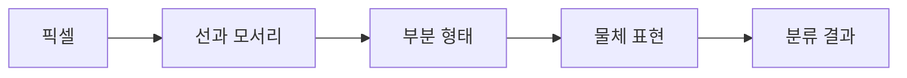

# 9.1 이미지 인식(image recognition)과 표현 학습(representation learning)

8장에서는 지도학습(supervised learning), 비지도학습(unsupervised learning), 강화학습(reinforcement learning)을 학습 신호의 차이로 구분했습니다. 이제 딥러닝(deep learning) 쪽으로 넘어갑니다.

이번 절은 딥러닝 전체를 설명하지 않습니다. 먼저 이미지 인식(image recognition) 사례를 통해, 딥러닝이 왜 “특징을 사람이 모두 설계하는 방식”에서 “모델이 표현을 함께 학습하는 방식”으로 이해되는지 봅니다.

이 절의 질문은 다음입니다.

```text
이미지를 분류할 때,
사람이 특징을 직접 쓰는 방식과
모델이 표현을 학습하는 방식은 무엇이 다른가?
```

> 딥러닝의 중요한 변화는 모델이 출력만 맞추는 것이 아니라, 입력을 다루기 좋은 내부 표현도 함께 학습한다는 점이다.

## 이 절의 범위

이 절은 합성곱 신경망(CNN, convolutional neural network)을 수식으로 설명하지 않습니다. 합성곱(convolution), 풀링(pooling), 활성화 함수(activation function), 역전파(backpropagation), 옵티마이저(optimizer)는 뒤의 딥러닝 장에서 다시 다룹니다.

또한 AlexNet을 “모든 딥러닝의 시작”으로 쓰지 않습니다. 신경망과 CNN 연구는 그 이전에도 오래 이어졌습니다. 여기서는 AlexNet을 2010년대 딥러닝 확산을 보여 주는 대표적 전환점으로만 다룹니다.

여기서는 다음 정도만 잡습니다.

```text
이미지 인식에서 딥러닝은
사람이 직접 설계한 특징만 사용하는 방식보다,
데이터에서 계층적 표현을 학습하는 방향을 강하게 보여 주었다.
```

## 목표

- 이미지 인식(image recognition)을 입력 이미지에서 범주(category)를 예측하는 문제로 이해합니다.
- 수작업 특징(hand-crafted features)과 학습된 표현(learned representation)의 차이를 설명합니다.
- CNN(convolutional neural network)이 이미지의 지역 패턴을 계층적으로 다루는 이유를 입문 수준에서 이해합니다.
- AlexNet을 대규모 데이터, GPU, 깊은 CNN, 표현 학습이 결합된 전환점으로 읽습니다.
- 이미지 인식 사례를 LLM의 직접 계보로 과장하지 않습니다.

## 이미지 인식은 사람에게 쉬워 보여도 규칙으로 쓰기 어렵다

사람은 사진을 보고 “고양이”, “자동차”, “사람 얼굴”처럼 빠르게 말할 수 있습니다. 하지만 이 판단을 규칙으로 적으려 하면 곧 어려워집니다.

예를 들어 고양이를 찾는 규칙을 쓴다고 해 봅니다.

```text
귀가 뾰족하면 고양이일 수 있다.
수염이 보이면 고양이일 수 있다.
눈이 두 개 있고 털이 있으면 고양이일 수 있다.
```

이 규칙은 곧 예외를 만납니다.

| 변화 | 규칙이 어려워지는 이유 |
| --- | --- |
| 조명 변화 | 같은 물체도 밝기와 색이 달라짐 |
| 자세 변화 | 귀, 눈, 다리의 위치가 달라짐 |
| 배경 변화 | 물체보다 배경이 더 크게 보일 수 있음 |
| 가림 | 물체 일부만 보일 수 있음 |
| 같은 범주의 다양성 | 고양이 품종, 크기, 털 색이 모두 다름 |

3.1에서 본 얼굴인식(face recognition) 사례도 이 문제와 연결됩니다. 얼굴인식 survey들은 전통적 방법이 기하학적 특징(geometry-based features), 전체 얼굴을 쓰는 방법(holistic methods), 수작업 특징(hand-crafted features), 하이브리드 방법(hybrid methods)을 사용해 왔다고 설명합니다. 이런 방법들은 중요한 연구 흐름이었지만, 통제되지 않은 환경의 조명, 자세, 표정, 나이, 가림 같은 변화에 더 강한 방법이 필요했습니다.

따라서 이미지 인식의 핵심 난점은 단순히 “분류기(classifier)를 고르는 일”이 아닙니다. 먼저 이미지에서 무엇을 보아야 하는지, 즉 특징(feature)과 표현(representation)을 어떻게 만들 것인지가 중요합니다.

## 수작업 특징(hand-crafted features)은 사람이 볼 단서를 정한다

수작업 특징(hand-crafted features)은 사람이 이미지에서 볼 단서를 미리 정하는 방식입니다. 예를 들어 다음과 같은 단서를 만들 수 있습니다.

| 문제 | 사람이 설계할 수 있는 특징 |
| --- | --- |
| 얼굴 찾기 | 눈 사이 거리, 코 위치, 얼굴 윤곽 |
| 차선 찾기 | 선의 방향, 밝기 변화, 경계선 |
| 물체 분류 | 모서리, 질감, 색상 히스토그램 |
| 문자 인식 | 획의 방향, 곡선, 교차점 |

이 방식은 장점이 있습니다. 사람이 어떤 단서를 쓰는지 비교적 이해하기 쉽고, 적은 데이터에서도 작동할 수 있습니다. 특정 조건이 안정적인 문제에서는 여전히 유용할 수 있습니다.

하지만 문제의 변형이 커질수록 사람이 모든 단서를 설계하기 어렵습니다.

```text
어떤 모서리가 중요한가?
어떤 질감은 같은 물체를 뜻하는가?
조명이 바뀌어도 같은 물체로 볼 수 있는가?
배경이 달라도 같은 범주로 묶을 수 있는가?
```

이 질문은 3.3과 4.3에서 본 표현(representation) 문제로 이어집니다. 좋은 표현은 분류에 필요한 차이를 드러내고, 중요하지 않은 차이를 줄여야 합니다.

## 학습된 표현(learned representation)은 모델 안에서 만들어진다

표현 학습(representation learning)은 원래 입력을 모델이 다루기 좋은 형태로 바꾸는 과정을 데이터에서 함께 배우려는 접근입니다. Bengio, Courville, Vincent의 표현 학습 리뷰는 머신러닝 알고리즘의 성공이 데이터 표현에 크게 의존한다고 설명합니다.

이미지에서는 픽셀(pixel)이 원래 입력입니다. 하지만 픽셀 값만 보면 고양이, 자동차, 사람 얼굴 같은 범주가 바로 드러나지 않습니다. 모델은 여러 층(layer)을 거치며 낮은 수준의 단서에서 높은 수준의 표현으로 바꿔 갈 수 있습니다.

```text
픽셀(pixel)
-> 선과 모서리(edge)
-> 질감과 부분 형태(texture, part)
-> 물체의 일부(object part)
-> 범주 판단(category prediction)
```

이 흐름은 실제 모델 내부가 항상 사람이 읽기 좋은 단계로 나뉜다는 뜻은 아닙니다. 입문용으로는 다음 정도로 이해하면 충분합니다.

```text
모델은 원래 이미지를 그대로 분류하는 것이 아니라,
여러 계산 단계를 거쳐 분류에 유용한 내부 표현을 만든다.
```

LeCun, Bengio, Hinton의 Nature 리뷰는 딥러닝을 여러 처리 층(processing layers)으로 구성된 계산 모델이 여러 추상 수준의 데이터 표현을 학습하는 방식으로 설명합니다. 또한 딥러닝이 음성 인식, 시각적 물체 인식, 객체 검출 등에서 성능을 크게 개선했다고 설명합니다.

## CNN은 이미지의 지역 패턴을 계층적으로 본다

합성곱 신경망(CNN, convolutional neural network)은 이미지 인식에서 중요하게 쓰인 신경망 구조입니다. 이 절에서는 수식 대신 직관만 봅니다.

이미지는 위치가 중요합니다. 눈, 코, 입, 바퀴, 문, 손잡이 같은 단서는 이미지의 작은 영역에서 먼저 나타납니다. CNN은 이런 지역 패턴(local pattern)을 여러 위치에서 반복적으로 탐지하고, 다음 층에서 더 큰 패턴으로 조합할 수 있도록 설계된 구조입니다.



예를 들어 자동차 이미지를 단순화하면 다음처럼 볼 수 있습니다.

| 단계 | 모델이 다룰 수 있는 단서의 예 |
| --- | --- |
| 낮은 층 | 선, 모서리, 밝기 변화 |
| 중간 층 | 바퀴처럼 반복되는 둥근 형태, 창문 모양 |
| 높은 층 | 자동차 전체와 관련된 부분 조합 |
| 출력 | 자동차, 버스, 트럭 같은 범주 점수 |

중요한 점은 사람이 `바퀴가 있으면 자동차`라는 규칙을 전부 쓰는 것이 아니라는 점입니다. 모델은 많은 이미지와 라벨(label)을 보며 분류에 도움이 되는 내부 표현과 파라미터(parameter)를 함께 조정합니다.

## AlexNet은 왜 자주 언급되는가

AlexNet은 2012년 ImageNet 이미지 분류 대회와 함께 딥러닝 확산의 대표 사례로 자주 언급됩니다. Krizhevsky, Sutskever, Hinton의 논문은 약 120만 장의 고해상도 학습 이미지를 1000개 범주로 분류하기 위해 큰 깊은 CNN을 훈련했다고 설명합니다. 논문은 이 모델이 6천만 개 파라미터, 65만 개 뉴런, 다섯 개의 합성곱 층과 세 개의 완전연결 층을 가진다고 설명합니다.

이 수치 자체보다 중요한 것은 조합입니다.

| 요소 | 의미 |
| --- | --- |
| 대규모 데이터 | 많은 이미지와 라벨이 모델 학습의 재료가 됨 |
| 깊은 CNN | 여러 층을 통해 이미지 표현을 단계적으로 바꿈 |
| GPU 구현 | 큰 행렬 계산과 반복 학습을 현실적인 시간 안에 수행 |
| 정규화와 데이터 증강 | 큰 모델이 학습 데이터에만 맞춰지는 위험을 줄임 |

AlexNet 논문은 두 개의 NVIDIA GTX 580 GPU에서 5-6일 동안 훈련했다고 설명하고, 더 빠른 GPU와 더 큰 데이터셋이 결과를 개선할 수 있다고 전망했습니다. 이 사례는 딥러닝의 부상이 단지 아이디어만의 변화가 아니라, 데이터 규모, 모델 구조, 계산 자원, 학습 기법이 함께 맞물린 변화였음을 보여 줍니다.

Nature 리뷰는 AlexNet 논문을 컴퓨터 비전(computer vision) 커뮤니티에서 딥러닝의 빠른 채택을 촉발한 돌파구로 평가합니다. 다만 이 문장을 “AlexNet이 딥러닝을 처음 만들었다”로 읽으면 안 됩니다. 더 안전한 표현은 다음입니다.

```text
AlexNet은 딥러닝이 대규모 이미지 인식에서 강력한 선택지가 될 수 있음을
명확히 보여 준 대표적 전환점이다.
```

## 이미지 인식 사례가 LLM의 직접 계보는 아니다

이 절의 목적은 LLM의 직접 역사를 쓰는 것이 아닙니다. 이미지 인식(image recognition), 객체 검출(object detection), 음성 합성(speech synthesis)은 LLM의 직접 조상이 아닙니다.

하지만 이 사례들은 한 가지 중요한 배경을 보여 줍니다.

```text
복잡한 입력을 사람이 규칙과 특징으로 모두 설명하기 어렵다.
대규모 데이터와 계산 자원이 있으면,
신경망이 유용한 표현을 학습할 수 있다.
이 접근은 이미지, 음성, 언어 등 여러 분야로 확산되었다.
```

이 배경 위에서 뒤의 절은 객체 검출과 음성 생성 사례를 봅니다. 9.2에서도 같은 원칙을 유지합니다. YOLO, WaveNet, Deep Voice 같은 사례는 LLM의 직접 원인이 아니라, 딥러닝 패러다임이 여러 입력과 출력 문제로 확산된 주변 근거로 다룹니다.

## 이 절에서 기억할 관점

이미지 인식은 사람이 보기에 직관적인 문제처럼 보이지만, 규칙과 수작업 특징만으로 안정적으로 다루기 어렵습니다. 조명, 자세, 배경, 가림, 범주 안의 다양성이 크기 때문입니다.

딥러닝은 이 문제를 다음 방향으로 바꿔 설명하게 만들었습니다.

```text
사람이 모든 특징을 직접 설계한다
-> 모델이 데이터에서 유용한 표현을 함께 학습한다
```

AlexNet은 이 전환을 널리 각인시킨 대표 사례입니다. 이 사례를 통해 기억할 것은 “이미지 인식이 LLM을 만들었다”가 아니라, “표현 학습과 대규모 신경망이 여러 분야에서 강한 성과를 보이며 딥러닝 패러다임을 확산시켰다”는 점입니다.

## 체크리스트

- 이미지 인식(image recognition)을 이미지에서 범주를 예측하는 문제로 설명할 수 있다.
- 수작업 특징(hand-crafted features)과 학습된 표현(learned representation)을 구분할 수 있다.
- CNN(convolutional neural network)이 이미지의 지역 패턴을 계층적으로 다루는 구조라는 점을 설명할 수 있다.
- AlexNet을 대규모 데이터, 깊은 CNN, GPU, 학습 기법이 결합된 전환점으로 설명할 수 있다.
- 이미지 인식 사례를 LLM의 직접 계보로 과장하지 않을 수 있다.

## 출처와 참고 자료

- Alex Krizhevsky, Ilya Sutskever, Geoffrey E. Hinton, [ImageNet Classification with Deep Convolutional Neural Networks](https://proceedings.neurips.cc/paper/2012/hash/c399862d3b9d6b76c8436e924a68c45b-Abstract.html), NeurIPS, 2012, 확인 날짜: 2026-06-23.
- Yann LeCun, Yoshua Bengio, Geoffrey Hinton, [Deep learning](https://www.nature.com/articles/nature14539), Nature 521, 436-444, 2015-05-27, 확인 날짜: 2026-06-23.
- Yoshua Bengio, Aaron Courville, Pascal Vincent, [Representation Learning: A Review and New Perspectives](https://arxiv.org/abs/1206.5538), arXiv, 2012-06-24, 확인 날짜: 2026-06-23.
- Daniel Saez Trigueros, Li Meng, Margaret Hartnett, [Face Recognition: From Traditional to Deep Learning Methods](https://arxiv.org/abs/1811.00116), arXiv, 2018, 확인 날짜: 2026-06-23.
