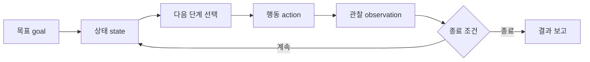

# 14.3 에이전트(agent): 목표를 작업 흐름으로 이어 가는 구조

14.2에서는 RAG(retrieval-augmented generation)와 도구 사용(tool use)을 구분했습니다.

```text
RAG:
필요한 자료를 찾아 모델 입력 맥락(context)에 붙인다.

도구 사용(tool use):
외부 시스템의 기능을 호출해 조회하거나 행동한다.
```

에이전트(agent)는 이 둘을 포함할 수 있지만, 같은 말은 아닙니다. 에이전트라는 말이 붙으면 핵심은 `한 번의 답변`보다 긴 흐름으로 이동합니다.

> 에이전트(agent)는 목표(goal)를 받아 현재 상태(state)를 확인하고, 다음 행동(action)을 선택하고, 도구 실행 결과(observation)를 반영하며, 작업을 계속하거나 멈추는 실행 구조다.

이 절에서는 에이전트를 과장된 자율성으로 보지 않고, AI 서비스 안에서 여러 단계 작업을 이어 가는 구조로 봅니다.

## 이 절의 범위

이 절은 에이전트(agent)를 `목표를 작업 흐름(workflow)으로 이어 가는 구조`로 설명합니다. MCP(Model Context Protocol)처럼 도구 연결을 표준화하는 방식은 14.4에서 다룹니다. 하네스(harness), 실행 로그(log), 평가(evaluation), 재현성은 14.5에서 다룹니다. 비용(cost), 지연 시간(latency), 운영(operation)은 14.6에서 다룹니다.

| 주제 | 이 절에서 볼 질문 |
| --- | --- |
| 목표(goal) | 사용자의 요청을 어떤 작업 목표로 볼 것인가? |
| 상태(state) | 지금까지 무엇을 알고 있고 무엇을 했는가? |
| 행동(action) | 다음에 어떤 도구를 쓰거나 어떤 답변을 만들 것인가? |
| 관찰(observation) | 도구 실행 결과를 어떻게 반영할 것인가? |
| 종료 조건(stop condition) | 언제 작업을 멈추고 결과를 보고할 것인가? |

## 이 절의 목표

- 에이전트(agent)를 단순한 챗봇이나 모델 이름이 아니라 실행 구조로 이해합니다.
- 프롬프트(prompt), RAG, 도구 사용(tool use), 에이전트(agent)의 차이를 구분합니다.
- 에이전트가 여러 단계 작업을 이어 갈 수 있지만, 무제한 자율 실행을 뜻하지는 않음을 이해합니다.
- 앱(application), 서버(server), 실행 환경(runtime)이 권한(permission), 승인(approval), 상태(state)를 관리해야 함을 이해합니다.
- Codex 같은 코딩 에이전트형 도구를 AI 서비스 구조 안에서 볼 준비를 합니다.

## 에이전트는 한 번의 답변보다 긴 흐름을 다룬다

일반적인 모델 호출(model call)은 단순하게 보면 다음 구조입니다.

```text
입력(input)
-> 모델(model)
-> 출력(output)
```

프롬프트(prompt)는 이 입력에 지시(instruction), 맥락(context), 예시(example)를 담는 방식입니다. RAG는 여기에 외부 자료를 검색해 붙입니다. 도구 사용(tool use)은 필요할 때 외부 시스템을 호출합니다.

에이전트(agent)는 이 요소들을 한 번만 쓰는 것이 아니라, 작업이 끝날 때까지 이어 붙이는 구조에 가깝습니다.

```text
사용자 목표
-> 현재 상태 확인
-> 다음 단계 선택
-> 도구 실행 또는 답변 생성
-> 실행 결과 관찰
-> 상태 갱신
-> 계속할지 멈출지 결정
```

예를 들어 사용자가 이렇게 요청한다고 합시다.

```text
14.3 절을 작성하고, 근거 메모를 남기고, 빌드가 되는지 확인해 줘.
```

이 요청은 한 번의 문장 생성만으로 끝나지 않습니다.

| 단계 | 가능한 행동 |
| --- | --- |
| 목표 이해 | 14.3의 중심 질문과 Section 경계를 확인함 |
| 상태 확인 | 목차, 14.1, 14.2, 기존 근거 메모를 읽음 |
| 근거 확보 | 에이전트 관련 공식 문서와 논문을 확인함 |
| 작성 | Section 본문과 근거 분석 문서를 만듦 |
| 검증 | `mkdocs build`로 문서 빌드를 확인함 |
| 보고 | 변경 파일과 검증 결과를 사용자에게 알림 |

이런 흐름이 에이전트형 작업의 직관입니다. 모델이 답변 하나를 만드는 수준을 넘어, 여러 단계의 작업을 상태와 도구 실행 결과에 맞게 이어 갑니다.

## 에이전트 루프: 목표, 상태, 행동, 관찰

에이전트를 이해할 때는 `루프(loop)`라는 관점이 유용합니다.



각 요소는 다음처럼 볼 수 있습니다.

| 요소 | 설명 |
| --- | --- |
| 목표(goal) | 사용자가 해결하고 싶은 일 |
| 상태(state) | 지금까지의 대화, 읽은 파일, 실행 결과, 중간 판단 |
| 다음 단계 선택 | 무엇을 먼저 할지, 어떤 도구가 필요한지 정함 |
| 행동(action) | 검색, 파일 읽기, 코드 수정, API 호출, 답변 작성 |
| 관찰(observation) | 도구 실행 결과, 오류, 검색 결과, 테스트 결과 |
| 종료 조건(stop condition) | 충분히 해결했는지, 승인이나 추가 정보가 필요한지 판단 |

ReAct 논문은 언어 모델이 추론(reasoning)과 행동(acting)을 번갈아 생성하며, 외부 지식베이스나 환경에서 정보를 얻는 흐름을 연구 사례로 제시했습니다. 여기서 중요한 점은 “생각과 행동을 섞어 여러 단계 문제를 푸는 구조”입니다. 다만 실제 서비스에서는 내부 추론 과정을 그대로 공개해야 한다는 뜻이 아닙니다. 사용자는 필요한 근거, 실행 결과, 요약된 판단을 확인할 수 있어야 합니다.

## RAG와 도구 사용은 에이전트의 재료가 될 수 있다

에이전트(agent)는 RAG나 도구 사용(tool use)을 대체하는 말이 아닙니다. 오히려 둘을 작업 흐름 안에 배치할 수 있습니다.

| 구성요소 | 에이전트 흐름 안에서의 역할 |
| --- | --- |
| 프롬프트(prompt) | 목표, 지시, 제약, 출력 형식을 전달함 |
| RAG | 필요한 근거 자료를 찾아 맥락(context)에 넣음 |
| 도구 사용(tool use) | 외부 시스템 조회, 계산, 파일 처리, API 호출을 수행함 |
| 상태(state) | 중간 결과와 실행 이력을 보존함 |
| 오케스트레이션(orchestration) | 어떤 순서로 실행할지 조정함 |

예를 들어 “출장비 규정에 맞게 영수증을 처리해 줘”라는 요청은 다음처럼 나뉠 수 있습니다.

```text
1. 규정 문서를 검색한다.        -> RAG
2. 영수증 내용을 읽는다.        -> 파일 처리 도구
3. 규정과 영수증을 비교한다.    -> 모델 판단
4. 누락된 항목을 질문한다.      -> 대화 흐름
5. 승인 후 비용 시스템에 등록한다. -> 도구 사용
6. 근거와 처리 결과를 보고한다. -> 앱 출력
```

이 전체 흐름을 묶어 관리하는 구조가 에이전트에 가깝습니다.

## 에이전트는 무제한 자율성을 뜻하지 않는다

에이전트라는 말은 쉽게 오해를 만듭니다. 마치 모델이 스스로 목표를 세우고, 모든 도구를 마음대로 사용하고, 외부 세계를 자유롭게 바꾸는 것처럼 느껴질 수 있습니다. 입문 단계에서는 이렇게 이해하면 위험합니다.

더 안전한 설명은 다음과 같습니다.

```text
에이전트는 목표를 여러 단계 작업으로 이어 가는 구조다.
하지만 권한, 승인, 실행 범위, 종료 조건은 앱과 서버가 관리해야 한다.
```

OpenAI Agents SDK 문서도 에이전트 앱에서 오케스트레이션(orchestration), 도구 실행(tool execution), 승인(approval), 상태(state)를 서버가 소유하는 경로를 설명합니다. 이는 에이전트가 모델만의 기능이 아니라 애플리케이션 구조와 실행 환경의 문제라는 점을 보여 줍니다.

| 필요한 제어 | 이유 |
| --- | --- |
| 권한(permission) | 사용자가 접근 가능한 데이터와 도구를 제한해야 함 |
| 승인(approval) | 이메일 발송, 결제, 배포처럼 위험한 행동은 사람 확인이 필요함 |
| 검증(validation) | 도구 인자와 실행 결과가 올바른지 확인해야 함 |
| 종료 조건(stop condition) | 반복 실행이나 잘못된 루프를 막아야 함 |
| 로그(log) | 무엇을 실행했는지 나중에 확인할 수 있어야 함 |

따라서 에이전트의 핵심은 “자율적으로 마음대로 행동한다”가 아니라 “정해진 실행 구조 안에서 여러 단계 작업을 이어 간다”입니다.

## Codex 같은 코딩 에이전트로 보는 예

Codex 같은 코딩 에이전트형 도구는 에이전트 구조를 이해하기 좋은 예입니다. 사용자가 “섹션을 작성하고 빌드를 확인해 줘”라고 요청하면, 단순히 문장을 생성하는 것만으로는 충분하지 않습니다.

| 작업 | 에이전트 관점 |
| --- | --- |
| 파일 읽기 | 현재 상태(state)를 확인함 |
| 근거 자료 확인 | 외부 자료와 기존 문맥을 관찰(observation)함 |
| 패치 작성 | 다음 행동(action)을 수행함 |
| 빌드 실행 | 결과가 실제로 동작하는지 검증함 |
| 커밋 또는 배포 | 사용자 지시와 권한 정책에 따라 실행함 |
| 최종 보고 | 무엇을 바꾸고 무엇을 확인했는지 설명함 |

이때 중요한 점은 실행 범위가 제한된다는 것입니다. 예를 들어 이 저장소에서는 일반 작성은 `dev` 브랜치에서 하고, `main` 배포는 사용자의 명시적 지시가 있을 때만 수행합니다. 이것은 에이전트가 따라야 하는 정책(policy)이자 승인 흐름입니다.

에이전트가 유용해지는 이유는 여러 단계를 잊지 않고 이어 가기 때문입니다. 하지만 사람이 검토해야 하는 지점도 함께 늘어납니다. 특히 책의 원고처럼 근거가 중요한 작업에서는 “그럴듯한 결과”보다 “어떤 근거로 무엇을 바꿨는가”가 더 중요합니다.

## 실패 지점을 먼저 생각해야 한다

에이전트는 강력하지만 실패 방식도 복합적입니다.

| 실패 지점 | 예 |
| --- | --- |
| 목표 해석 오류 | 사용자가 원한 범위보다 넓게 작업함 |
| 잘못된 계획 | 먼저 확인해야 할 문서를 건너뜀 |
| 잘못된 도구 선택 | 검색으로 충분한 일을 외부 API 실행으로 처리함 |
| 상태 관리 실패 | 이전 실행 결과를 잊거나 잘못 반영함 |
| 반복 루프 | 충분히 끝났는데 계속 수정하거나 재시도함 |
| 승인 누락 | 사람 확인 없이 파일 삭제, 발송, 배포를 실행함 |
| 근거 누락 | 출처 없는 내용을 사실처럼 작성함 |

그래서 에이전트형 서비스는 다음 질문을 포함해야 합니다.

```text
이 목표는 어떤 단계로 나누어야 하는가?
각 단계에서 어떤 데이터와 도구가 필요한가?
어떤 행동은 사람의 승인이 필요한가?
실패하거나 모호할 때 어디서 멈춰야 하는가?
최종 결과에 근거와 실행 이력이 남는가?
```

이 질문은 14.5의 하네스(harness), 로그(log), 평가(evaluation)로 이어집니다.

## 이 절에서 기억할 관점

에이전트(agent)는 모델 이름이 아니라 실행 구조입니다.

```text
프롬프트는 모델에 지시와 맥락을 준다.
RAG는 외부 자료를 찾아 입력 맥락을 보강한다.
도구 사용은 외부 시스템의 기능을 호출한다.
에이전트는 목표, 상태, 행동, 관찰을 이어 여러 단계 작업을 진행한다.
앱과 서버는 권한, 승인, 상태, 종료 조건을 관리한다.
```

이 관점을 잡으면 다음 절의 MCP(Model Context Protocol)를 더 정확히 볼 수 있습니다. MCP는 에이전트 자체가 아니라, 에이전트와 도구 또는 데이터가 연결되는 방식을 표준화하려는 흐름으로 다루는 것이 안전합니다.

## 체크리스트

- 에이전트(agent)를 목표(goal), 상태(state), 행동(action), 관찰(observation), 종료 조건(stop condition)의 흐름으로 설명할 수 있다.
- 프롬프트(prompt), RAG, 도구 사용(tool use), 에이전트(agent)를 같은 말로 섞지 않고 구분할 수 있다.
- 에이전트가 여러 단계 작업을 이어 갈 수 있지만, 무제한 자율 실행을 뜻하지는 않음을 설명할 수 있다.
- 앱(application)과 서버(server)가 권한(permission), 승인(approval), 상태(state), 실행 범위(scope)를 관리해야 함을 설명할 수 있다.
- Codex 같은 코딩 에이전트형 도구를 파일 읽기, 패치, 빌드, 보고가 이어지는 작업 흐름으로 설명할 수 있다.

## 출처와 참고 자료

- Shunyu Yao et al., [ReAct: Synergizing Reasoning and Acting in Language Models](https://arxiv.org/abs/2210.03629), arXiv, 2022, 확인 날짜: 2026-06-23.
- OpenAI, [Agents SDK](https://developers.openai.com/api/docs/guides/agents), OpenAI API Docs, 확인 날짜: 2026-06-23.
- OpenAI, [Function calling](https://developers.openai.com/api/docs/guides/function-calling), OpenAI API Docs, 확인 날짜: 2026-06-23.
