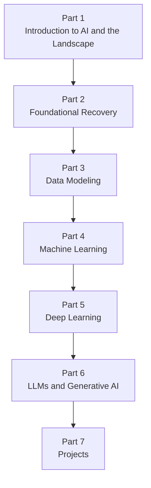

# AiBook

> Section ID: `BOOK-index`
> Version: `v2026.07.11`

AiBook is a relearning-focused web book designed for several kinds of readers at once: people studying AI for the first time, people who learned introductory AI long ago but now remember only fragments, and non-specialists who have used AI tools but want a more structured understanding.

This book is not meant to be just a collection of notes. Its goal is to present a readable learning path that runs from `foundational recovery -> machine learning -> deep learning -> LLMs and generative AI -> projects`. One central goal is to help the reader return to a state where they can explain how `AI`, `machine learning`, `deep learning`, `generative AI`, and `LLM` connect to one another. Another important goal is to take personal intuition and scattered experience, check them against reusable explanation and evidence, and update them into more general knowledge.

Within the same Part, detailed explanation of a major concept is placed in one representative location whenever possible. Later sections reconnect only what is needed for the current context. Repeated core terms can be looked up again in the [Concept Glossary](reference/concept-glossary.md). The glossary's `Core Section` and `Appears In` lists help the reader distinguish where a concept is first explained fully and where it returns later.

## Who This Book Is For

This book is especially written with the following readers in mind.

- readers who are studying AI for the first time and want to connect terms and ideas gradually
- readers who once studied introductory AI or foundational material but now remember only part of it
- readers who have used AI services such as LLMs, chatbots, or image-generation tools but have not yet organized the internal concepts

The book assumes a reader who `may not have received a university-level undergraduate education`. That means the explanation should still be readable even if the reader does not already know university-level mathematics, programming, or systems fundamentals. At the same time, for more experienced readers, the book should help reorganize scattered experience into standard terms and structures.

## Language Support

The current base edition of the book is Korean.

- Korean: the main edition currently being written and reviewed
- English: the introduction, table of contents, all of Part 1, all of Part 2, all of Part 3, and selected sections of Part 4 are available
- Simplified Chinese: the introduction, table of contents, all of Part 1, all of Part 2, all of Part 3, and selected sections of Part 4 are available

So at the current stage, neither the English edition nor the Simplified Chinese edition is a placeholder anymore. Both already include Parts 1 through 3 in full, while Part 4 and later Parts are still being expanded compared with the Korean edition.

## Why Relearn AI

The reason to relearn AI is not only to keep up with current trends. It also matters to understand how rule-based approaches, search, probability, machine learning, neural networks, and deep learning connect historically and conceptually. Without that larger flow, today's LLMs and generative AI remain much more vague than they need to be.

Questions like the following become important again.

- What kinds of problems does AI deal with?
- What is different between writing rules directly and learning patterns from data?
- How is mathematics used not mainly as a subject of proof, but as the language of model computation?
- What does learning change, and what exactly does inference execute?
- How are deep-learning weights and representation learning different from older programming habits?
- How do LLMs, prompts, embeddings, RAG, and agents connect inside one service flow?

## What This Book Covers

This book does not stop at foundational recovery. It continues far enough that the reader can interpret current AI services and tools with less confusion.

- Part 1 introduces the overall AI landscape, core terms, historical flow, and the structure of current AI services.
- Part 2 reconnects foundational material such as Python, mathematics, and data handling.
- Part 3 deals with data modeling, where raw data is reorganized into samples, features, baselines, and comparison structure.
- Part 4 covers machine-learning problem setup, data, learning, evaluation, and representative algorithms.
- Part 5 covers neural networks, backpropagation, and major deep-learning structures.
- Part 6 connects Transformers, LLMs, prompts, embeddings, retrieval, RAG, and agents.
- Part 7 checks what has been learned through small projects, records, and evaluation practice.

By contrast, this is not a book that starts by rushing into framework-specific APIs, large-scale production optimization, or full research-level mathematical derivations. Even when those details become necessary, the book first asks why they matter, what the problem and its inputs and outputs are, and what the core principle is before moving into implementation detail.

## Overall Flow

This flow is not just a list of topics. It shows the learning dependency structure. Part 1 establishes the overall map. Part 2 restores the foundations needed for reading and small experiments. Part 3 turns raw data into learnable structure through data modeling. On top of that, Part 4 establishes the common structure of machine learning, Part 5 recovers the main body of deep learning, Part 6 connects that to LLMs and generative AI, and Part 7 continues into concrete outputs and validation.

## How to Read This Book

The safest default path is `introduction page -> Part overview page -> representative explanatory section -> follow-up section -> concept glossary`. Even if the reader is already familiar with a topic, it is still safer to check the earlier Part for terminology and distinctions before jumping to a later Part, because many words shift meaning by context.

When a concept appears again, the book usually does not repeat the same explanation at full length. Instead, it expects the reader to check the representative section where that concept was first explained in detail. If a term becomes unstable again, return to the glossary, check the headword and its `Core Section`, and then follow the `Appears In` list if you want to see how it connects to the current section.

Not every chapter or section plays the same role. Some are the main representative explanation for a concept, while others show how that concept returns in a new problem scene or computational context. It helps to read earlier sections as building the conceptual skeleton and later sections as showing what changes in the current context.

The chapters and sections in this book are designed, whenever possible, to answer questions such as these:

- Why is this concept needed?
- What is the core principle?
- Can the input, output, and data be explained with a small example?
- Can the core term be restated in plain language?
- What can be checked through a small example or output?
- What still remains under `needs verification`?

## The Book's Perspective

This book allows personal intuition to be used as a starting point, but it does not leave that intuition untouched as if it were already the answer. Explanations are separated as much as possible into the following three layers.

- `standard explanation`: explanation that connects to textbooks, papers, official documentation, or other reliable sources
- `working hypothesis`: temporary analogy or personal explanation used to support understanding
- `needs verification`: content that conflicts with standard explanation or still lacks sufficient evidence

For example, it can be a useful starting point to think of deep learning as `a process of finding useful weights and representations`. But the range within which that description is actually correct still needs to be checked separately. In the same way, even if an LLM output looks like human thinking, the book does not jump directly to the conclusion that it is the same thing as human thinking.

## A Book Written With AI Tools

This book is created with the help of AI tools. Humans set the curriculum and review standards, while AI helps with research, drafting, comparison, diagramming, and document structuring.

Codex is one of the important tools in that process. The book treats Codex not simply as an automatic writer, but as a tool in the perspective of an LLM agent that helps with draft generation and review support. At the same time, outputs from Codex and other generative-AI tools are always treated as material to be checked, not as facts just because they sound natural.

So the important work in this book is not producing many plausible-looking sentences. It is checking whether each sentence has real support behind it and continuing to revise explanations that are wrong or vague.

## Writing and Review Principles

- Explanations should follow the flow `why it is needed -> what the core principle is -> how it can be checked` whenever possible.
- When needed, core terms on first appearance are written in `Korean (English)` form in the Korean edition; the English edition preserves the same conceptual correspondence without forcing that pattern mechanically.
- For readers meeting a concept for the first time, the book prioritizes short intuition, small tables, simple diagrams, and example outputs.
- Within the same Part, detailed explanation of a major concept should appear once in a representative location, and later sections should keep only the minimum explanation needed for the current context plus a glossary connection.
- If external material is directly quoted or summarized, the source and access date are recorded at the bottom of the document.
- Management documents and research notes stay under `management/`, while reader-facing text stays under `docs/`.

## Feedback and Issues

If you find a typo, explanatory error, structural problem in the table of contents, or a place that needs strengthening, please report it through the repository issues. Comments and revision suggestions for the book are collected through [AiBook repository issues](https://github.com/devchan64/AiBook/issues){: target="_blank" rel="noopener noreferrer" }.

## Start Here

- [Table of Contents](book/table-of-contents.md)
- [Part 1 Overview](parts/part-01/index.md)
- [Part 1 Summary](parts/part-01/summary.md)
- [Concept Glossary](reference/concept-glossary.md)

## Sources and References

This document is an original introduction that explains the purpose, readers, learning path, and writing perspective of the book. It does not directly quote external sources or summarize a specific external document. When later explanation grounded in external sources is added, the source and access date will be recorded together.
