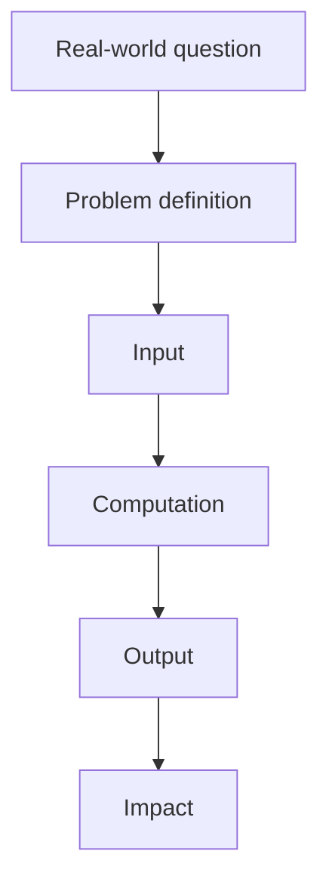

# P1-1.2 Problems AI Deals With

> Section ID: `P1-1.2`
> Version: `v2026.07.09`

Section 1.1 organized the scope of the word AI. This section looks at what kinds of problems AI actually deals with inside that broad range.

If AI is read only as the name of a technology, rule-based AI, machine learning, deep learning, and generative AI can look like separate worlds. But if the focus shifts to problem form, common structure starts to appear. Most AI systems receive some input, produce output aligned with an objective, and affect human judgment or the environment.

In Part 1, the baseline distinction among problem types such as classification, prediction, recommendation, and generation is fixed in this section. Even when the same words appear again later, only the amount needed for the current question is carried forward there. When the problem types themselves need to be separated again, return to this section and to the [Concept Glossary](../../../reference/concept-glossary.md).

## Scope of This Section

This section organizes the following questions.

- What kinds of problems does AI repeatedly deal with?
- What common structure appears when problems are read through inputs and outputs?
- Why can the same data become a different AI problem when the question changes?

This section does not go deeply into the following.

- detailed implementations of algorithms used for each problem type
- mathematical optimization techniques by problem type
- complex design of real service pipelines

The algorithms and learning structures associated with each problem type are recovered in Part 4 on machine-learning problems, Part 5 on deep-learning structures, and Part 6 on LLMs and generative AI. Here the focus is on fixing one standard first: `what goes in and what comes out`.

## Goal of This Section

- Separate AI problems through the viewpoint of input and output.
- Distinguish problem types such as recognition, search, prediction, recommendation, generation, and control.
- Understand that the same real-world situation can become different AI problems depending on how the question is defined.

## Concepts to Connect First

This section is also the main representative location where recurring terms for reading problem types are introduced together. The concepts below should be fixed briefly here first, then checked again through the glossary when fuller definitions are needed.

| Concept | Meaning to fix first here | Why it is needed now |
| --- | --- | --- |
| [recognition](../../../reference/concept-glossary.md#recognition) | a problem of reading an object or state from input | to distinguish a broader reading problem before narrowing to classification |
| [classification](../../../reference/concept-glossary.md#classification) | a problem of choosing one predefined category | to fix a representative problem where `what is being predicted` is clear |
| [prediction](../../../reference/concept-glossary.md#prediction) | a problem of estimating a future value or result from current information | to separate problems that produce values or likelihoods from classification |
| [recommendation](../../../reference/concept-glossary.md#recommendation) | a problem of choosing what is worth showing next among many candidates | to show that AI is not only answer generation |
| [generation](../../../reference/concept-glossary.md#generation) | a problem of producing new text, images, audio, or code | to fix why the character of the output differs |
| [input](../../../reference/concept-glossary.md#input) | the information received by the system | to read problem definition from `what is put in` |
| [output](../../../reference/concept-glossary.md#output) | the result produced by the system | to separate problem types by `what comes out` |
| [goal](../../../reference/concept-glossary.md#goal) | the standard that determines what counts as a good output | to see why the same data becomes a different problem when the question changes |

## Main Learning Points

This section looks at the shape of the problem before it looks at algorithm names. The three standards below form the basic map for separating problem types.

| Standard | Why it matters | Level of understanding needed here |
| --- | --- | --- |
| AI can first be read through `input` and `output` | That makes common structure visible even when very different technical names appear. | You should be able to say first what goes in and what comes out. |
| The same data becomes a different problem when the `question` changes | That reveals why classification, prediction, recommendation, and generation branch apart. | You should distinguish that one customer dataset can support several different problems. |
| Results have `impact` on people or services | This makes AI readable not as abstract calculation but as an actual judgment structure. | Connect the output to where it is used in one sentence. |

`Input`, `output`, `goal`, and `impact` already appeared in the previous section as the basic language for reading an AI system. Here those same four terms are reconnected to problem types. Input is the information received by the system. Output is the result it produces. Goal is the standard that determines what counts as a good output. `Impact` indicates where that result reaches real human judgment or environmental change. If the terms themselves become unstable again, return to the previous section and the representative entries in the [Concept Glossary](../../../reference/concept-glossary.md). In this section, they are used to read problem types as structures of `what goes in and what comes out`.

## Detailed Learning

### Why Read Through Problem Types

If AI is relearned by memorizing algorithm names first, it quickly becomes complicated. Even with the same image data, one system may classify whether something is a cat, another may locate the object, and another may generate a new image.

So the first question should not be “What technology does it use?” but “What does it receive as input, and what is it trying to produce as output?” That question lets rule-based systems, machine-learning models, deep-learning models, and LLM services sit on the same map.

### Problem Types AI Often Deals With

The following table lists the problem types that this book will reuse repeatedly. It is a learning map, not a complete taxonomy.

| Problem type | English expression | Input | Output | Example |
| --- | --- | --- | --- | --- |
| recognition | recognition | images, audio, text, sensor data | object, state, meaning | recognizing objects in an image, understanding a voice command |
| classification | classification | data and candidate categories | category or label | dividing email into spam and normal |
| clustering | clustering | unlabeled data | groups of similar items | finding customer groups, grouping documents |
| prediction | prediction, regression | past data, current state | future value, score, probability | demand forecasting, failure-risk prediction |
| search and planning | search, planning | possible states and a goal | path, sequence, action plan | finding the next move in a game, deciding a visit order |
| recommendation and ranking | recommendation, ranking | user, item, context | recommendation list, priority order | product recommendation, ordering help documents |
| generation | generation | instruction, condition, example, context | new text, image, audio, code | drafting a sentence, generating an image, drafting code |
| control and action | control, action | state observation, goal, feedback | action, policy | robot turning control, slowing before a traffic light, moving a game agent |

The key point in this table is that a problem type is not the same thing as an implementation method. A `classification` problem, for example, can be solved with hand-written rules, with a machine-learning model, or with a deep-learning model. Conversely, a single LLM service may internally combine generation, retrieval, recommendation, tool calls, and safety filtering.

One pair beginners often confuse is `recognition` and `classification`. Recognition is the broader problem of reading `what is there`, `what state it is in`, or `what it means` from input. Classification is closer to the problem of choosing one result from among predefined categories. For example, answering `cat` from a photo can be read as classification. But locating the cat in the image, describing its expression, or reading several objects together is more naturally treated as a broader recognition problem. This distinction does not need to be memorized as if it were an exam answer, but the sense that `recognition is broader and classification is one representative task inside it` helps later when images, audio, and text are handled again.

Not every problem type is closed here. Instead, the section first connects where each type will be read more fully later.

| Problem type fixed now | Where it is revisited more fully later | Why it matters at the current stage |
| --- | --- | --- |
| classification, prediction, clustering | Part 4 | because machine learning is ultimately about how questions are reformulated into prediction-style problems |
| recognition of complex inputs such as images, audio, and sequences | Part 5 | because later the need for deep-learning architectures is read again from the viewpoint of data structure |
| generation, retrieval combination, tool execution | Part 6 | because LLMs, RAG, and agents are explained there in terms of what is generated and what is brought in from outside |
| planning, control, action | Part 1 supplementary learning and Part 7 small-system perspective | because in the current book it is more important first to hold the `input-judgment-action` structure than to expand into full control theory |

### The Same Data Can Become a Different Problem

An AI problem is not determined by the data alone. It is determined by what question the data is turned into.

Suppose there is customer purchase data.

| Question | Problem type | Possible output |
| --- | --- | --- |
| Is this customer likely to churn? | prediction | churn probability |
| What did similar customers buy? | recommendation | recommended product list |
| How many customer groups can be formed? | clustering | customer groups |
| What will next month’s revenue be? | prediction | estimated revenue value |
| Can customer support conversations be summarized? | generation | summary text |

This viewpoint becomes important again in Part 2 and Part 3. Before mathematics or software is deeply understood, there needs to be practice in turning a real-world question into a problem with inputs and outputs.

### Reading by Inputs and Outputs

Poole and Mackworth’s open textbook explains an agent as an entity that acts in an environment and presents a black-box viewpoint in which an agent is read through its inputs and outputs. That viewpoint helps AI problems get read first through `what comes in and what goes out` rather than through technology names.

From that perspective, an AI system is still fundamentally a computational structure with inputs and outputs. Requests, observations, sensor values, and web requests come in. Responses, commands, recommendations, and actions come out after internal processing.

But AI often differs from ordinary software functions in that the output rule is not always fully specified by people. Traditional functions follow conditionals and procedures explicitly written by humans. Learning-based AI produces results from patterns found in data, parameters, statistical relations, and learned representations. So even when both follow an `input -> processing -> output` structure, the internal processing style and the way it must be verified are different.

The important point here is not to exaggerate that difference into a claim that AI `copies human workflow exactly`. The important point is to read how a given input is turned into an output problem and how far that result is actually automated.

### Problem Definition Comes First

When building or understanding an AI system, problem definition comes before the model. If the problem definition is unstable, even a strong model becomes hard to interpret.

At minimum, problem definition needs the following elements.

- input: what does the system receive?
- output: what should the system produce?
- goal: what counts as a good result?
- constraint: what limits exist around time, cost, safety, privacy, or copyright?
- impact: how does the output affect human judgment or the real environment?

The OECD explanation of AI systems also reads inputs, goals, outputs, and environmental impact together. Following that view, this book reads AI less as `does it look human` and more as `what problem is being turned into computational form, and what output is being produced`.

### Boundaries Among Problem Types Overlap

Real AI services are often not explained by only one problem type.

For example, a help-search service may look like one block from the outside, but in practice several problems are chained together.

| Stage | Problem type | Small work scene |
| --- | --- | --- |
| reading the question sentence | recognition or language understanding | detecting what intent is carried by `my refund is late` |
| finding candidate documents | search | gathering 20 relevant help documents first |
| deciding display order | ranking | placing the refund policy document at the top |
| writing the answer sentence | generation | answering `refund processing usually takes three business days` |

Control and action are also easier to understand when read in small scenes rather than through the entire abstraction of autonomous driving.

| Situation | Problem type seen first | Small work scene |
| --- | --- | --- |
| robot movement | control | slightly reducing speed while following a floor line |
| driver-assistance feature | prediction + control | starting to slow down because the car ahead seems likely to stop |
| game-character movement | action selection | moving left to avoid an obstacle |

So problem types are not rigid categories. They are analysis tools. When you look at how one system bundles several problems together, the broad word AI becomes easier to divide into smaller and more understandable units.

This diagram shows that a broad real-world question does not become a model problem directly. It is first cut into `problem definition`, `input`, and `output`, and only then does the result affect people or the environment. The key point to read here is the three-step flow: `real-world question -> computational problem -> impact of the result`.

## Cases and Examples

### Case 1. The Same Customer Data, Different Problems

Suppose there is one set of customer purchase data. At first, people often feel that if the data is one thing, then the AI problem must also be one thing. But with the same data, asking `is this customer likely to churn?` creates a prediction problem, asking `what did similar customers buy?` creates a recommendation problem, and asking `can the support conversation be summarized?` creates a generation problem. This case shows that problem type changes less with the data source itself than with the question asked.

### Case 2. Several Problems Mixed Inside One Search Service

Suppose a user asks a product manual site, `When is my refund completed?` From the outside it looks like one search box, but internally question understanding, document retrieval, ranking, and answer generation occur in a short chain. This case shows that a real service often does not deal with only one AI problem, but with several problem types bound into one flow.

### The Questions This Book Will Reuse

When a new AI case appears later, read it in the following order.

- What real-world problem is this system dealing with?
- What is the input and what is the output?
- Is the output closer to classification, prediction, recommendation, generation, planning, or control?
- How is correctness or evaluation defined?
- What risk appears if the result is wrong?

These questions are not for oversimplifying the technology. They are standards for breaking complex AI systems into several problem types and examining them more clearly.

### A Short Practice in Identifying Problem Type

The scenes below are meant as practice in separating `what goes in`, `what comes out`, and `what problem type it is closest to`.

| Scene | What is the input? | What is the output? | Problem type to try first |
| --- | --- | --- | --- |
| estimating next week’s inventory from this week’s orders | past order counts, event schedule, current inventory | expected order quantity for next week | prediction |
| choosing the top three help documents for a customer question | question sentence, document list, search score | top document list | search or ranking |
| reducing a support call transcript into three sentences | raw support transcript, summarization instruction | summary sentences | generation |
| warning about abnormal factory state from sensor values | sensor values such as temperature, vibration, and current | normal, warning, inspection needed | classification or recognition |

The point of this practice is not memorizing final answers. It is to verify directly that even the same work data becomes a completely different problem depending on whether the goal is to predict a future quantity, choose a priority order, generate a new sentence, or classify a state.

## What to Remember from This Section

- AI problems should first be read through what the input and output are.
- Even the same data becomes a very different problem when the question changes.
- Real services often combine several problem types, such as retrieval, ranking, and generation, in one flow.

The minimum sentence to keep at this stage is this: `The same data becomes a different AI problem when the question changes.`

The baseline that should remain from this section can be compressed into three lines.

| Baseline to keep | Why it matters first |
| --- | --- |
| AI problems are first read as `input -> output` | because that makes it possible to recover common structure even when technical names differ |
| The same data can become prediction, recommendation, or generation when the question changes | because at the introductory stage, problem definition comes before all algorithms |
| Real services can bundle several problems such as search, ranking, and generation into one flow | because later Parts will be less surprising when several structures appear inside one service |

## Checklist

- You can explain AI problems through the viewpoint of input and output.
- You can explain the difference among recognition, classification, prediction, search, recommendation, generation, and control through examples.
- You can explain that the same data can become a different AI problem depending on the question.
- You can distinguish problem type from implementation method.
- You can explain why problem definition should be checked before the model.

## When to Recall This View First

Bring this section back first when the problem type does not become clear at once even though the data or the service looks familiar.

- when one customer dataset has to be explained as prediction, recommendation, clustering, and generation in different ways
- when a single search box may actually contain search, ranking, and generation together
- when `what goes in and what comes out` needs to be clarified before model names

At that point, write the problem first in four slots: input, output, goal, and impact. Then read classification, prediction, recommendation, generation, or control on top of that structure.

## Sources and References

- OECD.AI, Stuart Russell, Karine Perset, Marko Grobelnik, [Updates to the OECD’s definition of an AI system explained](https://oecd.ai/en/wonk/ai-system-definition-update){: target="_blank" rel="noopener noreferrer" }, 2023-11-29, checked 2026-06-22.
- Cambridge Dictionary, [Meaning of artificial intelligence in English](https://dictionary.cambridge.org/dictionary/english/artificial-intelligence){: target="_blank" rel="noopener noreferrer" }, checked 2026-06-22.
- Stanford Encyclopedia of Philosophy, Selmer Bringsjord and Naveen Sundar Govindarajulu, [Artificial Intelligence](https://plato.stanford.edu/entries/artificial-intelligence/){: target="_blank" rel="noopener noreferrer" }, 2018-07-12, checked 2026-06-22.
- Stuart Russell, Peter Norvig, [Artificial Intelligence: A Modern Approach, 4th US ed.](https://aima.cs.berkeley.edu/){: target="_blank" rel="noopener noreferrer" }, checked 2026-06-22.
- David L. Poole, Alan K. Mackworth, [Artificial Intelligence: Foundations of Computational Agents, 3rd ed.](https://artint.info/3e/html/ArtInt3e.html){: target="_blank" rel="noopener noreferrer" }, 2023, checked 2026-06-22.
- Usama M. Fayyad, Gregory Piatetsky-Shapiro, Padhraic Smyth, [From Data Mining to Knowledge Discovery in Databases](https://www.kdnuggets.com/gpspubs/aimag-kdd-overview-1996-Fayyad.pdf){: target="_blank" rel="noopener noreferrer" }, AI Magazine, 1996, checked 2026-06-22.
