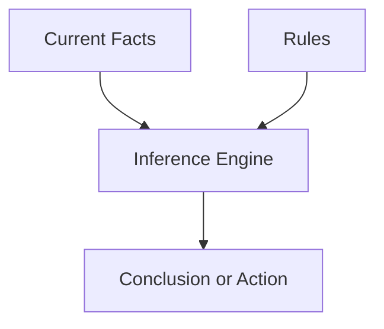

# P1-2.1 Symbolic AI and Rule-Based Approaches

> Section ID: `P1-2.1`
> Version: `v2026.07.07`

Section 1 organized the scope of AI and the relationship among the major terms. This section begins the historical-paradigm view of how AI tried to solve problems. Its central focus is `symbolic AI` and the `rule-based approach`.

Symbolic AI is the approach that tries to represent human knowledge through symbols, rules, logic, and explicit representations, then manipulate those representations to reach conclusions or actions. In simpler terms, it starts from the idea that if human knowledge can be written in a form a computer can handle, the computer can reason over that form.

In Part 1, the baseline meaning of `symbolic AI`, `rule-based approach`, and `knowledge representation` is fixed here. Later sections reconnect these terms only as much as needed for the current question. When the full definition needs to be checked again, return to this section and the shared [Concept Glossary](../../../reference/concept-glossary.md).

## Scope of This Section

This section organizes the following questions.

- What was symbolic AI trying to do?
- How are rules, knowledge representation, inference, and search connected in one larger flow?
- Why is this approach still valid in some systems today?

This section does not go deeply into the following.

- formal derivations for individual logical systems
- implementation details of expert systems
- quantitative performance comparison with machine-learning models

The more detailed flow of search, knowledge representation, and probabilistic reasoning is recovered in `P1-2.2`, and the strengths and limits of rule-based systems are evaluated more concretely in Part 1 Chapter 3.

## Goal of This Section

- Understand what symbolic AI tried to achieve.
- See how rules, knowledge representation, inference, and search connect.
- Distinguish the strengths and limits of rule-based approaches.
- Understand why this approach is still useful in some systems.

## Concepts to Connect First

This section is the representative place where the baseline for the core Chapter 2 terms is fixed.

| Concept | Meaning to fix first here | Why it is needed now |
| --- | --- | --- |
| symbolic AI | an AI approach centered on symbols, rules, and explicit knowledge representation | to establish the starting point that later learning-based approaches are compared against |
| rule-based system | a system that matches current facts against rules to determine a conclusion or action | to see one concrete implementation shape of symbolic AI |
| knowledge representation | the format used to write facts, relations, and rules | to clarify what it means for a system to “know” something |
| fact | information treated as true for the current situation | to separate the input material to which rules are applied |
| inference engine | the mechanism that finds and applies rules matching the current facts | to see the execution structure between rules and conclusions |

## Main Learning Points

Although this section looks historical, it is really introducing one old but important way of solving AI problems.

| Standard | Why it matters | Level of understanding needed here |
| --- | --- | --- |
| symbolic AI is a way of `writing knowledge explicitly` | This creates the contrast with later machine learning. | Distinguish that people write rules and facts first. |
| a rule-based approach `determines conclusions or actions by condition` | This makes the idea easier to connect to everyday rule use. | See the structure that matches a current situation against rules. |
| this approach is `not a vanished past` but still survives in some systems | This prevents it from being misunderstood as a dead prehistory. | Connect it to policy, permission, and safety rules that still exist today. |

Terms such as `symbol`, `rule`, `fact`, `knowledge representation`, and `inference` can sound similar at first. Here they are separated like this.

| Term | Very short meaning | Role in this section |
| --- | --- | --- |
| symbol | an explicit marker used to distinguish something | the unit that lets humans and systems refer to the same target |
| rule | a criterion that maps condition to conclusion or action | an explicit judgment standard |
| fact | information treated as currently true | the input material for rule application |
| knowledge representation | a format for writing facts, relations, and rules | the frame that defines what the system is considered to know |
| inference | the process of deriving a conclusion from facts and rules | the procedure that produces results |

The first distinction that should remain is this: what is named explicitly, what is written as a rule, what is treated as fact in the current state, and what conclusion is derived from them.

## Detailed Learning

### Why This Approach Appeared First

One of the large early AI questions was how to turn intelligent behavior into a computer program. One major answer was to write down human facts, rules, and reasoning procedures explicitly and let the computer manipulate them.

In that line of thought, intelligence was often approached as a process of operating over symbolically represented facts and rules. Rule-based approaches made this idea easier to turn into practical systems: experts could write explicit decision criteria as conditions, patterns, actions, and conclusions, and the computer could compare the current facts against those rules.

So symbolic AI and rule-based approaches should not be treated merely as obsolete technology. They should be read as a major early strategy for solving AI problems by writing knowledge explicitly and then reasoning over it.

### Why It Is Called “Symbolic”

Here, `symbol` does not mean a literary symbol. In the history of AI, it refers more to an explicit label or marker that a computer can distinguish and manipulate.

Examples include names such as `rain`, `wet road`, `patient`, `symptom`, `position of chess pieces`, or `rule A`. Symbolic AI uses these explicit markers to represent knowledge and then performs rule application, logical inference, or search over that representation.

So in this book, `symbolic AI` means an AI approach that tries to implement intelligence around symbols and explicit representation.

### Trying to Represent the World Through Symbols

The starting assumption of symbolic AI is that knowledge can be represented explicitly. Humans can say things such as “If it rains, roads become wet,” “certain symptoms suggest certain diseases,” or “this move changes the board state in this way.”

Symbolic AI tried to turn that kind of knowledge into structures a computer could use. The basic ingredients look like this.

| Component | Role |
| --- | --- |
| symbol | marks an object, concept, or state |
| rule | expresses what conclusion or action should follow under a condition |
| knowledge representation | stores facts, concepts, relations, and rules |
| inference | derives new conclusions from given knowledge |
| search | follows possible states or solution candidates toward a goal |

In this approach, the system solves the problem mainly through human-written knowledge rather than by automatically learning patterns from data.

### The Basic Shape of a Rule-Based Approach

A rule-based approach shows symbolic AI in one of its most understandable forms. The core idea is to compare current facts or situations against explicit rules and then determine a conclusion, classification, action, or procedure.

> condition or situation -> conclusion, classification, action, or procedure

`IF condition THEN conclusion` is the simplest way to visualize this shape, though real systems do not need to be written only in that syntax.

| Situation | Example rule | Result |
| --- | --- | --- |
| daily decision | if it is raining and you are going out, take an umbrella | action decision |
| workflow | if payment exceeds the approval limit, send it to manager approval | procedure selection |
| access control | if the user role is not admin, block settings change | allow or block |
| safety policy | if the request matches a prohibited category, stop or redirect the reply | policy application |

The key is structural: facts and rules are stored separately, then matched.

This diagram is meant to make the system readable as four parts: `current facts`, `explicit rules`, `application procedure`, and `result`. The key point is that facts alone are not enough and rules alone are not enough. A separate procedure is needed to match them and produce a conclusion.

### Strengths and Limits in Outline

The strengths of symbolic and rule-based approaches are comparatively easy to see.

- the rules are explicit, so the judgment path is easier to inspect
- domain experts can review and revise the knowledge directly
- they fit areas where law, policy, or procedure matters
- it is relatively easy to control repeatable outputs for the same input

But the limits are also clear.

- writing and maintaining rules can become expensive
- exceptions and conflicts accumulate quickly
- ambiguous inputs and noisy data are hard to cover fully
- not every pattern can be written down by humans in advance

So the right contrast is not `symbolic AI was wrong and machine learning is right`. The more accurate reading is that problem characteristics differ: some problems fit explicit rules, while others are better solved by learning patterns from data.

## Cases

### Case 1. Shipping-Refund Rules in Customer Support

Imagine a customer-support workflow that must decide whether shipping fees should be refunded. At first the rules may look simple: seller fault, customer remorse, bundled order, damaged item. A rule-based approach can make these criteria explicit and auditable. But once exceptions multiply, the rules become difficult to maintain consistently. This case shows both the practical strength and the scaling limit of explicit rules.

### Case 2. Rule-Based Access Control

A permission system often has clear standards such as role, department, and approval stage. In such a case, the problem is not mainly to learn a hidden pattern from data. It is to apply explicit policy correctly and explainably. This shows why rule-based systems still remain useful in modern service architecture.

## What to Remember from This Section

- symbolic AI is an approach that tries to represent knowledge explicitly through symbols, rules, and logic
- rule-based systems are one of its most concrete implementation forms
- this approach did not disappear; it remains useful where explicit policy, permissions, and procedures matter
- its main weakness is that growing exceptions and complexity make rule maintenance hard

The shortest sentence to keep is this: `symbolic AI tries to solve problems by writing knowledge explicitly and reasoning over it.`
