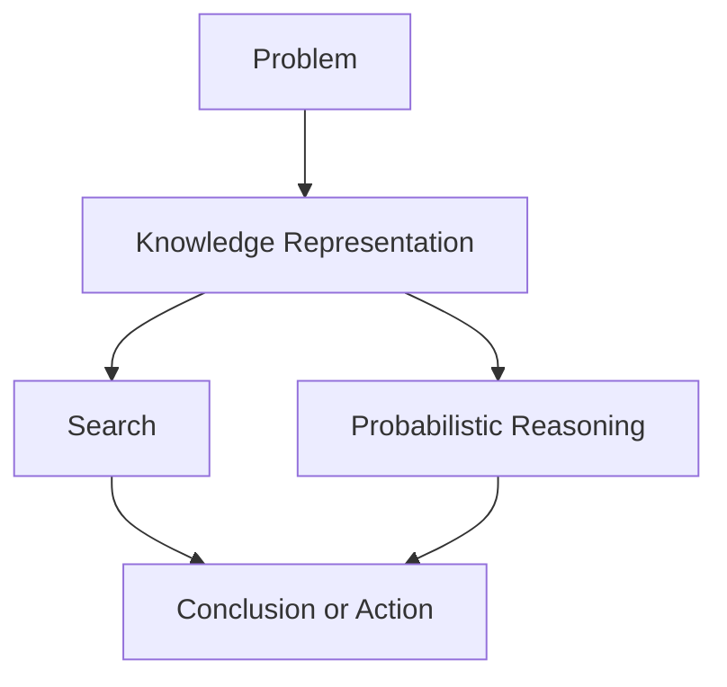

# P1-2.2 Search, Knowledge Representation, and Probabilistic Reasoning

> Section ID: `P1-2.2`
> Version: `v2026.07.07`

Section 2.1 reviewed symbolic AI and rule-based approaches. This section asks what comes next when writing rules alone is not enough. AI then had to search through candidates, represent the necessary knowledge, and reason under uncertainty.

The goal here is not to learn algorithms in detail. The goal is to fix why `search`, `knowledge representation`, and `probabilistic reasoning` keep returning in introductory AI, and how they became part of the background for later explanations of machine learning and deep learning.

In Part 1, the basic distinction between `search` and `probabilistic reasoning` is fixed here. `Knowledge representation` was introduced in 2.1 and is reconnected here only as much as needed to compare its role with search and probabilistic reasoning. If the distinction becomes unstable again later, return to this section and the shared [Concept Glossary](../../../reference/concept-glossary.md).

## Scope of This Section

This section organizes the following questions.

- Why was search a core early method of problem solving in AI?
- How does knowledge representation connect to rule-based approaches?
- How did probabilistic reasoning try to handle incomplete information and uncertainty?

This section does not go deeply into the following.

- detailed procedures and complexity comparison of search algorithms
- formal grammars for representation languages
- mathematical development of probabilistic graphical models

The focus here is to separate the `roles` of these three flows. The reason the center of explanation later moves toward learning from data is recovered in 2.3.

## Goal of This Section

- Understand why search was a core early problem-solving method in AI.
- See how knowledge representation connects to rule-based approaches.
- Understand probabilistic reasoning as a way to handle incomplete information and uncertainty.
- Distinguish search, knowledge representation, and probabilistic reasoning as major pre-machine-learning axes of AI.

## Concepts to Connect First

| Concept | Meaning to fix first here | Why it is needed now |
| --- | --- | --- |
| search | an approach that follows possible states and actions toward a goal | to see why candidate order becomes a problem when there are many options |
| knowledge representation | the format used to write facts, relations, and constraints | to separate the question of what should count as knowledge |
| probabilistic reasoning | a way to handle plausibility under incomplete information | to avoid forcing every judgment into simple true or false form |
| goal | the condition to be reached | to see what tells search where to stop |

## Main Learning Points

| Standard | Why it matters | Level of understanding needed here |
| --- | --- | --- |
| search is a problem of `which candidate to inspect first when there are too many` | This shows why rules alone are not enough. | Distinguish that too many possible choices require order. |
| knowledge representation is a problem of `what should be written down as known` | This connects why facts, rules, and relations are discussed separately. | Organize the idea of writing a problem in a form a computer can manipulate. |
| probabilistic reasoning is a way to handle `how plausible a conclusion is under incomplete information` | This connects AI to real problems that do not close cleanly into true or false. | Connect probability to uncertain judgment. |

The first distinction that should remain is this: `search deals with states, actions, and goals`, `knowledge representation decides what is written down`, and `probabilistic reasoning handles plausibility under uncertainty`.

## Detailed Learning

### Three Questions That Appear After Rules

Rule-based approaches describe what conclusion or action should follow from a condition. But real problems often do not end with one explicit rule.

For example, when planning a route, the destination may be fixed, but there are many possible roads, changing conditions, and incomplete information. At that point, an AI system has to answer at least three different questions.

| Question | Connected approach | Core meaning |
| --- | --- | --- |
| When there are many candidates, what should be inspected first? | search | following states and paths toward a goal |
| What must the system know in order to solve the problem? | knowledge representation | writing facts, relations, constraints, and rules in a usable form |
| When information is incomplete or noisy, what is more plausible? | probabilistic reasoning | calculating confidence or probability from evidence |

These three questions are separate, but real systems often contain all of them together.

### Search: Finding Goals in a Space of States

Search follows possible states and actions until a goal is reached. This appears in route finding, puzzles, games, planning, and scheduling whenever there are too many possible choices.

Search problems can be simplified into the following structure.

| Component | Example |
| --- | --- |
| initial state | current location, board position, current schedule |
| actions | move, place a piece, change task order |
| next state | the changed state after an action |
| goal test | destination reached, puzzle solved, condition satisfied |
| cost or evaluation | distance, time, risk, score |

The main difficulty is that the number of candidates can grow explosively. That is why heuristics become important. A heuristic is not a guaranteed truth rule. It is an experience-based criterion that helps decide which candidate looks more promising to inspect first.

This is where beginners often confuse `heuristic` and `probability`, because both may appear as numbers. But they answer different questions.

| Distinction | First question answered | Role of the value | Short example |
| --- | --- | --- | --- |
| heuristic | which candidate should be checked first? | determines search order or priority | inspect the route with shorter straight-line distance first |
| probability | which conclusion is more plausible? | expresses confidence under incomplete information | symptoms make disease A more likely than disease B |

So heuristics are closer to `search order`, while probability is closer to `degree of belief`.

### Knowledge Representation: What Counts as Known

If search is about moving among candidates, knowledge representation is about deciding what the system must store and reason over in the first place.

Section 2.1 already showed one form of this through rules. But representation is broader than a rule list. Facts, relations, concepts, constraints, time changes, actions, and exceptions can all become representation targets.

For a delivery-planning system, the represented knowledge may include:

- places such as warehouse, customer address, and hub
- relations such as connected roads or one-way passages
- constraints such as cold-chain time limits
- actions that change position or remaining time
- goals such as completing all deliveries while reducing cost

The main question is not only `what is true`, but `what should be written in what form so the system can ask useful questions later`.

### Probabilistic Reasoning: Calculating Plausibility Under Uncertainty

Rules and logic are strong when the structure is cleanly expressed as “if this is true, that follows.” But real information is often incomplete, noisy, and ambiguous.

Consider questions like these.

| Situation | Why it is uncertain |
| --- | --- |
| inferring disease from symptoms | the same symptom can appear in multiple diseases |
| deciding whether an email is spam | a few words are not enough for certainty |
| detecting obstacles from sensor values | sensor noise and missing signals exist |
| predicting customer churn | past behavior does not fully determine future behavior |

Probabilistic reasoning treats such problems by using probability as the language of plausibility. The key point is not random guessing. The key point is to represent uncertainty explicitly and revise how plausible conclusions are as evidence changes.

So here, `probabilistic reasoning` should be remembered simply as `a way to calculate how plausible different conclusions are under incomplete information`.

### How the Three Flows Connect

Search, knowledge representation, and probabilistic reasoning begin from different questions, but can work together.

This diagram is meant to show division of labor rather than competition. `Knowledge representation` writes down the structure, `search` explores candidates, and `probabilistic reasoning` helps when the available information is uncertain.

For example, a warehouse robot may need:

- knowledge representation for warehouse structure, object positions, and constraints
- search for path and task order
- probabilistic reasoning for uncertain sensors or changing corridor conditions

## Cases

### Case 1. Route Planning in a Delivery App

A delivery app must assign orders on a rainy evening. Search is about which delivery sequence or route to inspect. Knowledge representation is about what must be stored: rider position, store location, delivery zone, and timing constraints. Probabilistic reasoning is about uncertain traffic delay or weather-related slowdown. This case shows how the three questions coexist inside one system.

### Case 2. Structured Permissions in an Internal System

An internal permission system may not need heavy search, but it still needs strong knowledge representation: roles, departments, approval stages, and exception relations. If some status information is incomplete, probabilistic reasoning may still become relevant in surrounding systems, but the core difficulty remains representational. This case helps separate the roles rather than collapsing them into one vague “AI process.”

## What to Remember from This Section

- search is about moving through too many candidate states toward a goal
- knowledge representation is about deciding what the system should count as known and how to write it
- probabilistic reasoning is about handling plausibility under incomplete information
- real AI systems often combine all three rather than choosing only one

The shortest sentence to keep is this: `search finds paths among candidates, knowledge representation writes the problem down, and probabilistic reasoning handles uncertainty.`
