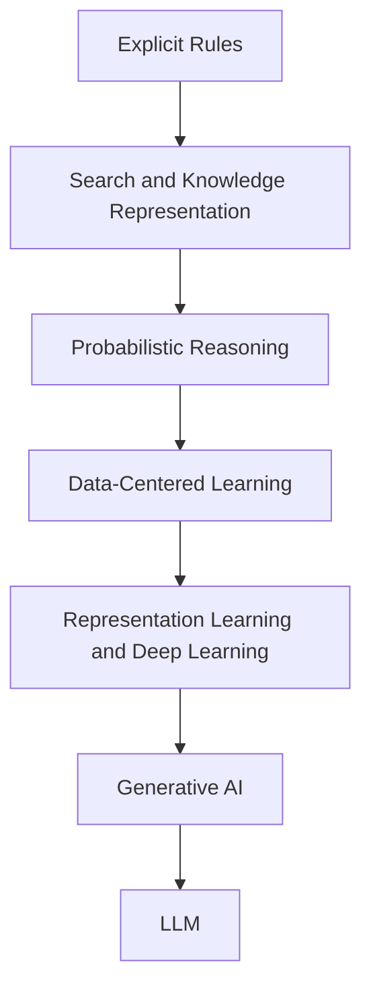

# P1-2.3 The Flow Toward Machine Learning, Deep Learning, and Generative AI

> Section ID: `P1-2.3`
> Version: `v2026.07.09`

Section 2.1 reviewed symbolic AI and rule-based approaches. Section 2.2 reviewed search, knowledge representation, and probabilistic reasoning. This section asks what came next: why did the center of AI explanation move more and more toward models that learn from data?

The task here is not to explain machine learning, deep learning, and generative AI in full detail. The task is to establish the historical reason the center of explanation moved from `people writing all rules directly` toward `models learning from data and experience`.

In Part 1, the historical shift from rule-based to learning-based approaches, and the basic connection among `data`, `features`, `representations`, and `parameters`, is fixed here. The broad relationship among `AI`, `machine learning`, `deep learning`, `generative AI`, and `LLM` was already fixed in 1.3. Here they are reconnected as one historical flow. If those term boundaries become unstable again later, return to this section and the shared [Concept Glossary](../../../reference/concept-glossary.md).

## Scope of This Section

This section organizes the following questions.

- Why did problems that were difficult to solve through rules alone lead to data-based learning?
- Through what historical flow did machine learning, deep learning, and generative AI connect?
- Why did data, features, representations, models, and parameters become more important over time?

This section does not go deeply into the following.

- detailed procedures of supervised and unsupervised algorithms
- neural-network structure and backpropagation formulas
- product-level implementation differences among LLM services

The focus here is on the historical question: `why did the center of explanation move toward learning?`

## Goal of This Section

- Understand why problems that were hard to solve through explicit rules led to data-based learning.
- Distinguish machine learning, deep learning, and generative AI inside one historical flow.
- See why data, features, representations, models, and parameters became central.
- Read generative AI and LLMs not as a sudden rupture but as later stages in an accumulated flow.

## Concepts to Connect First

| Concept | Meaning to fix first here | Why it is needed now |
| --- | --- | --- |
| data | the material used for learning and judgment | to see what replaces hand-written rules as the source of criteria |
| feature | a clue first organized or selected by people | to fix how early machine learning depends on input representation |
| representation | the internal form handled inside the model | to see why deep learning is explained through representation learning |
| parameter | the internal value adjusted through learning | to fix what learning actually changes |
| machine learning | a learning approach that improves performance from data | to understand the move from writing rules to training models |
| deep learning | a neural-network-centered approach that strongly uses representation learning | to understand the move from feature design to learned representation |
| generative AI | a category of models and services that create new content | to see where the more recent flow extends |

## Main Learning Points

| Standard | Why it matters | Level of understanding needed here |
| --- | --- | --- |
| many problems were hard to solve by writing all rules explicitly, so the center moved toward `data-based learning` | This explains why machine learning became central. | Distinguish that many problems were too complex for hand-written criteria. |
| machine learning, deep learning, and generative AI are `connected stages`, not disconnected buzzwords | This keeps many terms on one map. | Organize the flow as data learning -> representation learning -> generation. |
| LLMs are a `strong recent stream`, not all of AI | This prevents current product experience from becoming the whole history. | Connect LLMs as a representative part of generative AI rather than the whole field. |

At this stage, the useful baseline is: `data is material`, `features are human-organized clues`, `representations are internal forms`, `models are computational structures`, and `parameters are internal values changed by learning`.

## Detailed Learning

### Problems That Were Too Hard to Cover with Rules

Rule-based approaches remain strong when criteria can be written explicitly. But many real problems became too variable to cover that way.

| Problem | Why it is hard to write fully as rules |
| --- | --- |
| object recognition in photos | humans cannot feasibly write all useful pixel-level conditions |
| natural-language understanding | context, omission, ambiguity, and varied phrasing are too broad |
| spam detection | attackers change patterns and a few words are never enough |
| churn prediction | behavior patterns are complex and change over time |
| speech recognition | pronunciation, noise, recording conditions, and speaking style vary |

At that point, the question changes from `what rules should people write?` to `what relations can be learned from data?`

### Machine Learning: From Rule Writing to Model Training

Machine learning is an approach in which a model improves performance by using data or experience. Here, a `model` is the computational structure that receives input and produces prediction, classification, recommendation, score, or action.

> data or experience -> learning -> model -> prediction, classification, recommendation, or action

The contrast with rule-based systems looks like this.

| Distinction | Rule-based approach | Machine-learning approach |
| --- | --- | --- |
| judgment standard | explicit human-written rules | a model trained from data |
| main developer work | writing rules and handling exceptions | preparing data, designing features, training, and evaluating |
| strength | easier explanation and tighter control | ability to learn complex patterns from data |
| weakness | can become fragile under many exceptions and changes | depends on data quality, evaluation, and generalization |

Machine learning is not one single method. This section only fixes the broad names.

| Learning type | Basic question |
| --- | --- |
| supervised learning | given input, what output or label should be predicted? |
| unsupervised learning | how can structure be found without labels? |
| reinforcement learning | what policy should be learned when actions lead to later reward? |

The details of these learning types are recovered in Part 1 Chapter 8 and later Parts.

### Data Mining and Data-Based Judgment as Background

The move toward machine learning was not only an internal shift inside AI. It also grew together with the practical expansion of stored data and the demand to discover patterns in that data.

So it is useful to say that modern AI explanation moved from rules alone toward data-based judgment. But it is safer not to pretend AI always meant only data-based judgment. A better reading is this:

> on top of the earlier layers of rules, search, knowledge representation, and probabilistic reasoning, a stronger layer was added in which models learn judgment criteria from data

This keeps historical continuity visible instead of erasing earlier AI.

### Core Learning Terms in One Table

The following terms repeat throughout the section. They are fixed here only once as a baseline.

| Term | Meaning to fix first here |
| --- | --- |
| data | observed or stored examples and values, such as logs, images, or sentence collections |
| feature | an input clue organized so that the model can use it more directly |
| representation | the form in which data is handled inside the model |
| model | a computational structure that maps input to prediction, classification, recommendation, or generation |
| parameter | an internal value changed during learning |

At this stage, it is enough to remember: `data is material`, `features and representations make that material usable`, `the model performs the computation`, and `parameters are internal values adjusted during learning`.

### Deep Learning: From Feature Design to Representation Learning

In many traditional machine-learning settings, people had to design useful features explicitly. For example, spam detection might use link count, domain type, or keyword frequency. Image tasks might use color, edge, or shape clues prepared by hand.

Deep learning changes this balance by using multi-layer neural networks that can learn richer internal representations from data.

| Distinction | Typical earlier machine-learning flow | Typical deep-learning flow |
| --- | --- | --- |
| features | often heavily designed by people | increasingly learned by the model itself |
| model structure | often relatively shallow | often multi-layer neural networks |
| strong use case | smaller or more structured problems | complex inputs such as images, audio, and language |

Deep learning should not be explained as if it were literally the same thing as the biological brain. The useful learning description here is simpler:

> deep learning is an optimization process in which multi-layer neural networks with learnable weights discover useful representations and prediction rules from data

This is the point where the language of `representation` becomes central.

### Generative AI: A Shift That Becomes Visible Through Output

Generative AI refers to models and services that create new content such as text, images, audio, video, or code.

| Type | Central output | Example |
| --- | --- | --- |
| classification | a category | normal vs defective |
| prediction | a value or score | sales forecast, churn probability |
| recommendation | a candidate list | product or document recommendation |
| generation | new content | sentence, image, code, audio |

The important point is that generative AI is not “a machine that tells facts.” It produces outputs that look plausible by using patterns learned from data. Natural-sounding output does not automatically mean true output.

### Where LLMs Sit in This Flow

LLMs are a representative model family inside generative AI, but they are not the same thing as all generative AI, and generative AI is not the same thing as all of AI.

The flow can be read like this.

This diagram should not be read as if each stage erased the one before it. It should be read as an accumulated historical layering in which the center of explanation shifted over time.

Modern AI services still do not consist of one LLM alone. Search, tools, explicit rules, permissions, logging, evaluation, and interfaces can all remain part of the same system.

## Cases and Examples

### Case 1. Why Image Classification Stops Scaling as a Rule List

Imagine trying to classify products as normal or defective from images using only explicit rules such as crack length, stain count, or brightness threshold. That can work in a narrow setting, but lighting, angle, reflection, and subtle visual variation quickly make the rule list fragile. This case shows why explanation moved from `what more rules should we write?` to `what pattern should the model learn from many images?`

### Case 2. Why an LLM Should Not Be Read as a Sudden Exception

If a reader meets AI mainly through chatbots, LLMs can look like a sudden new thing unrelated to older AI. But once the larger flow is restored, LLMs become easier to place: they sit after data-centered learning, deep learning, and representation learning, and they remain only one strong recent stream inside AI.

## What to Remember from This Section

- the center of AI explanation moved toward learning because many important problems were too hard to cover with explicit rules alone
- machine learning, deep learning, and generative AI should be read as connected stages in one flow
- data, features, representations, models, and parameters became central because judgment increasingly depended on learning from examples
- LLMs are a strong recent stream, not the whole of AI

The shortest sentence to keep is this: `AI explanation moved from writing rules directly toward learning patterns and representations from data, and LLMs are one later result of that flow.`
