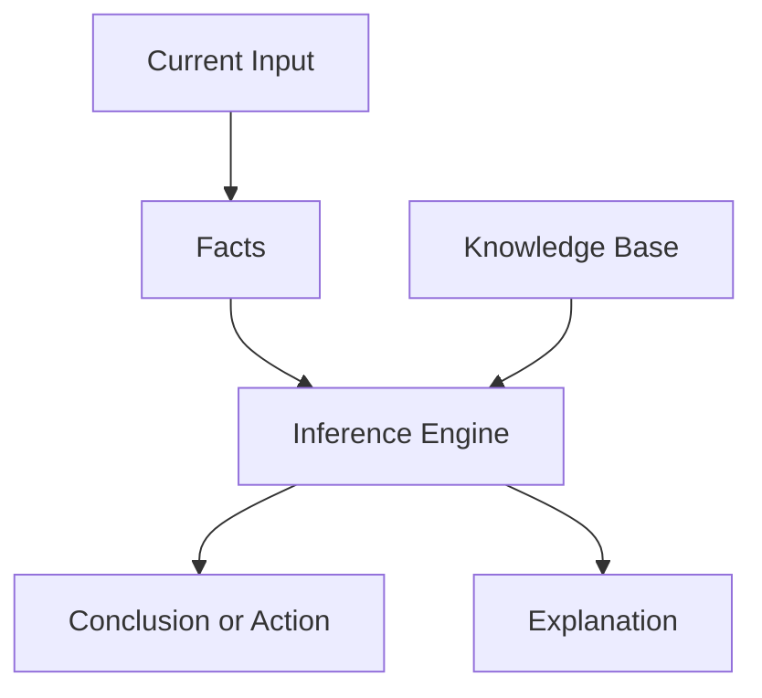

# P1-3.1 Strengths and Limits of Rule-Based Systems

> Section ID: `P1-3.1`
> Version: `v2026.07.07`

Section 2.1 located symbolic AI and rule-based approaches historically. Section 2.3 showed that even inside the same workflow, some parts are easy to write explicitly as policy conditions while other parts require learned relations from data. This section narrows the question further: what practical strengths did rule-based systems have, and where did they begin to fail?

The goal here is not to dismiss rule-based AI as a failed past. The goal is to separate why rule-based systems were useful, why attention moved toward machine learning, and why rules are still necessary in parts of modern systems.

In Part 1, the baseline for the strengths, limits, and modern operational role of the `rule-based system` is fixed here. The basic meaning of `symbolic AI`, `rule-based approach`, and `knowledge representation` was fixed in 2.1, and is reconnected here only as much as needed for evaluation.

## Scope of This Section

This section organizes the following questions.

- What components make up a rule-based system?
- Where do the strengths and limits of this approach appear?
- Why are rules still needed in modern systems?

This section does not go deeply into the following.

- full framework design of expert systems
- quantitative experiments against machine-learning models
- complete design of large policy engines

The move beyond rules into learned patterns is recovered in `P1-3.2`, and the difference from representation learning is recovered in `P1-3.3`.

## Goal of This Section

- Understand the main components of a rule-based system.
- See why rule-based systems are strong in explainability and controllability.
- Distinguish the possibility and the limit shown by expert-system history.
- Understand why rule writing, knowledge acquisition, and exception handling become difficult.
- Fix a simple picture of how rules and models coexist in modern services.

## Concepts to Connect First

| Concept | Meaning to fix first here | Why it is needed now |
| --- | --- | --- |
| rule-based system | a system that compares current facts against rules to determine a conclusion or action | to make the evaluation target explicit |
| fact | current state information treated as true | to see what rules are applied to |
| knowledge base | the structure that stores rules, facts, and domain knowledge | to see where the rule set lives |
| inference engine | the mechanism that finds and applies matching rules | to see how a conclusion is actually produced |
| explanation facility | the function that shows why a result came out | to fix one of the main strengths of rule-based systems |

## Three Standards

| Standard | Why it matters | Level of understanding needed here |
| --- | --- | --- |
| a rule-based system connects `current facts` and `rules` to produce a conclusion | This fixes the basic structure first. | Distinguish input, rules, and result. |
| its strengths are `explainability` and `controllability` | This explains why rules still remain in policy and operations. | Connect why the result path is easier to inspect. |
| its limit is that `exception and change make rule management difficult` | This connects naturally to the move toward machine learning. | Organize why narrow domains can fit while wider reality becomes hard to cover. |

## Basic Structure of a Rule-Based System

A rule-based system compares current facts or inputs against rules and then determines a conclusion, classification, action, or procedure.

> current facts + rule set -> inference engine -> conclusion or action

Broken down more explicitly, the structure looks like this.

| Component | Role |
| --- | --- |
| facts | current input, observed values, user state, business data |
| rules | knowledge that says what should follow from what condition |
| knowledge base | the structure that stores rules, facts, and domain knowledge |
| inference engine | the mechanism that finds and applies matching rules |
| explanation facility | the function that shows which rules led to the result |

The key point is not only that the system produces a result, but that it can often also expose why that result was produced.

## Example: Approval Workflow as Rules

Approval workflows are one of the easiest places to understand rule-based systems. The criteria are relatively explicit, they must be recorded, and the same condition should usually lead to the same result.

| Current fact | Rule applied | Result |
| --- | --- | --- |
| amount is under a small threshold and budget is sufficient | automatic approval | approved |
| amount is above a lower threshold | team lead approval required | waiting for team lead |
| amount is above a higher threshold | department head approval required | waiting for department head |
| budget is insufficient | reject regardless of amount | rejected for budget reason |
| requester equals approver | self-approval forbidden | approver reassignment |

This is easy to inspect and explain. But real workflows soon add urgency, project-specific exceptions, vendor restrictions, absence handling, audit rules, and more. That is where rule growth becomes difficult.

## Strength 1: It Is Readable and Reviewable

One of the biggest strengths of a rule-based system is that the judgment standard is explicit.

- people can inspect the rules directly
- domain experts can revise the criteria
- policy and legal requirements can be traced more easily
- audit and operational review fit naturally

In an approval example, it is relatively easy to answer a question like “Why is this request waiting for department-head approval?” The answer can be written as a chain of applied conditions rather than as opaque internal parameters.

## Strength 2: It Is Easier to Keep the Same Output for the Same Input

Rule-based systems are often easier to make deterministic. If the same facts and the same rules are given, the same result is easier to reproduce.

This makes them especially suitable when the system must enforce explicit procedures:

- block access without sufficient permission
- stop file upload if required conditions are missing
- prohibit forbidden request categories
- prevent self-approval

But reproducibility does not mean correctness. A wrong rule can be applied consistently and still be wrong every time.

| Distinction | Meaning | Implication in rule-based systems |
| --- | --- | --- |
| reproducibility | the same condition gives the same result again | useful for testing, auditing, and operational tracking |
| correctness | the result actually matches policy or reality | still requires separate review of the rule itself |

## Strength 3: It Can Become Useful Quickly in a Narrow Domain

When the scope is narrow and the criteria are explicit, rule-based systems can become useful relatively quickly. Expert-system history showed this possibility clearly in domains where strong expert criteria could be written down and kept within a bounded area.

The safer lesson is not “expert systems solved intelligence.” The safer lesson is that when the domain is narrow and explicit enough, symbolic knowledge can be very effective.

## Main Limits

The limits become clearer as reality becomes more variable.

- writing and maintaining rules is expensive
- exceptions accumulate and rules can conflict
- unseen or poorly expressed situations are hard to cover
- noisy, ambiguous, and changing inputs become difficult
- the system does not automatically improve its internal representation through data

This is why it is too simple to say “rule-based AI was wrong and machine learning was right.” A more accurate reading is that many later problems required something beyond explicit rule maintenance.

## Modern Role

Rules did not disappear when machine learning and deep learning became strong. They remained where explicit policy matters.

| Modern scene | Why rules still fit well |
| --- | --- |
| permissions and access control | explicit standards matter |
| approval workflow | the system must explain why a step was triggered |
| safety policy | prohibited and allowed cases must be inspectable |
| operational automation | repeatable conditions matter more than flexible pattern matching |

So the strongest summary is not that rule-based systems belong only to the past. It is that they remain strong in places where explicit policy, procedure, and auditability matter, while other parts of the same system may require learning-based models.

## Cases

### Case 1. Internal Purchase Approval

A purchase-approval workflow with amount thresholds, role constraints, and budget checks is easy to express through rules and easy to audit. But once exceptions and overlapping policy conditions multiply, the same strength turns into maintenance cost. This case shows both why rule-based systems are useful and why they become difficult as complexity grows.

### Case 2. Safety Filtering in AI Services

An AI service may use learned models to generate answers, but still place explicit safety and permission rules around that model. This case shows that rule-based systems remain important even inside modern generative-AI services.

## What to Remember from This Section

- rule-based systems are strong when explicit criteria, repeatability, and explanation matter
- their main limits appear when exceptions, ambiguity, and change accumulate
- rules did not disappear; they still remain in policy, permissions, workflow, and safety layers

The shortest sentence to keep is this: `rule-based systems are strong where standards must be explicit, but they become hard to scale when reality is full of exceptions.`
