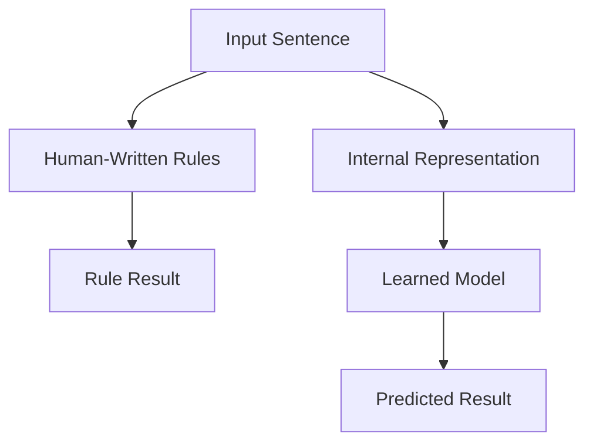
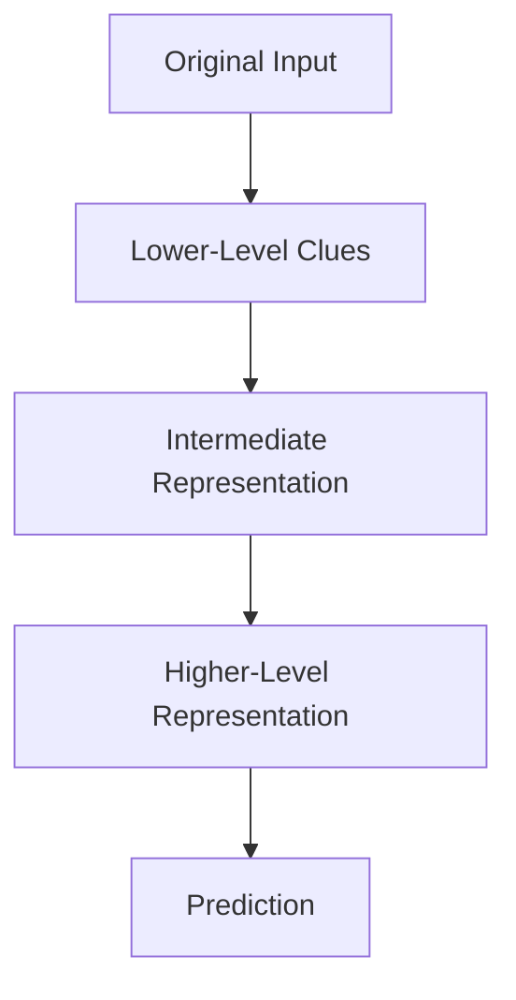
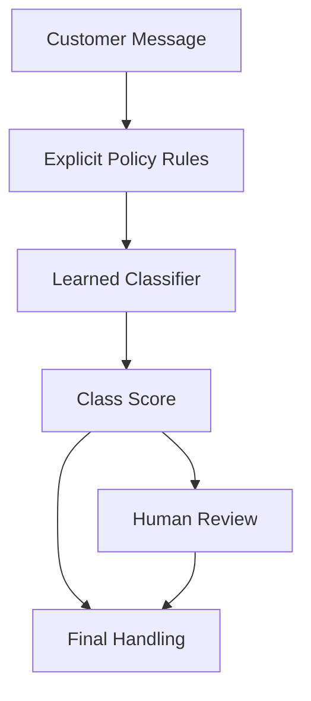

# P1-3.3 Rule-Based Approaches and Representation Learning

> Section ID: `P1-3.3`
> Version: `v2026.07.07`

Section 3.1 reviewed the strengths and limits of writing rules directly. Section 3.2 reviewed the basic structure of learning patterns from data. This section does not repeat the entire learning pipeline. Instead, it focuses on one narrower question: how is the input handled differently in a rule-based approach and in representation learning?

The core task here is not to explain deep learning internally in detail. It is to fix the positions of `rule`, `feature`, `representation`, and `parameter` so they are not mixed together.

In Part 1, the baseline meaning of `representation`, `vector`, `activation`, and `representation learning` is fixed here. The earlier structure of `example`, `label`, `training`, and `generalization` was fixed in 3.2 and is reconnected here only as much as needed to explain the internal form of input.

## Scope of This Section

This section organizes the following questions.

- What is different between rule-based approaches and representation learning in the way input is handled?
- What is the safest way to read the relationship between `feature` and `representation`?
- What does it mean to say that learned representations are powerful but harder to interpret?

This section does not go deeply into the following.

- detailed formulas for layers and parameter learning
- dimensionality and optimization details of learned vectors
- full implementation of model-interpretation methods

The focus is on one central distinction: `rules are outside the model, while learned representations are inside it`.

## Goal of This Section

- Distinguish rule-based approaches from representation learning.
- Understand the relation between features and representations.
- See the difference between human-designed features and model-learned representations.
- Understand why learned representations can be strong but harder to read.
- Connect naturally to the next chapter on inputs, outputs, data, features, and parameters.

## Three Standards

| Standard | Why it matters | Level of understanding needed here |
| --- | --- | --- |
| rules are `criteria written outside`, while representations are `internal forms used inside the model` | This makes the location difference visible. | Distinguish explicit readable criteria from internal computation. |
| features can be human-designed, while the model may learn deeper representations | This leads to the contrast between classical machine learning and deep learning. | Organize the difference between input clues and learned internal forms. |
| learned representations can be powerful but harder to interpret | This explains why evaluation and interpretation matter later. | Connect strength in handling variation with reduced direct readability. |

At this stage, the useful baseline is: `rules are external criteria`, `features are extracted clues`, `representations are internal forms`, `vectors are numeric bundles`, `activations are intermediate values`, and `parameters are learned internal criteria`.

## First Compare the Same Problem in Two Ways

Keep using the customer-support example. Suppose the message is:

> If the delivery does not arrive by tomorrow, I will cancel it.

A rule-based approach may write explicit conditions such as:

- if the message contains `delivery` and `tomorrow`, classify it as delivery-related
- if it contains `cancel`, mark it as a cancel candidate
- if both conditions appear, send it to human review

This is readable because the criteria are written directly.

A learning-based model takes a different path:

> message -> internal representation -> model computation -> class score

The new part to focus on here is the `internal representation`. The model does not use the sentence exactly as a human reads it. It turns the input into values that can be computed over.

This diagram is meant to show only one difference in location: rules sit outside as written criteria, while the representation is created inside the model before prediction.

## The Boundary of This Section

Section 3.2 explained examples, labels, models, training, inference, and generalization. Section 3.3 does not repeat that whole pipeline. Its focus is narrower.

| Distinction | Center of 3.2 | Center of 3.3 |
| --- | --- | --- |
| main question | what does it mean to learn patterns from data? | what does it mean to transform input into an internal representation? |
| key terms | example, label, model, training, inference, generalization | rule, feature, representation, parameter |
| main risk | memorization, overfitting, weak data quality | opacity and difficulty of interpretation |

## Rules Are Outside; Representations Are Inside

Explicit rules live outside the model in a relatively human-readable form: code, configuration, policy documents, or knowledge bases.

Learned representations, by contrast, live inside the model. They are intermediate values or transformed forms produced as the input passes through learned parameters.

| Distinction | Explicit rule | Learned representation |
| --- | --- | --- |
| location | code, configuration, policy, knowledge base | internal vectors, activations, learned transforms |
| how it is created | written directly by people | adjusted through data and training |
| strength | readable, reviewable, easier to control | better at handling complex patterns and variation |
| weakness | hard to maintain when exceptions explode | harder to explain directly in human terms |

This is why it is dangerous to say “the AI learned rules by itself” without qualification. The model may have learned internal criteria, but that does not mean it produced a clean human-readable rule list.

## Features Can Be Designed by People or Learned More Deeply

Section 3.2 explained `features` as the values used by the model as input. Those features can arise in at least two ways.

First, people can design them explicitly.

| Original input | Human-designed feature example |
| --- | --- |
| support sentence | whether the word `refund` appears |
| support sentence | whether the word `delivery` appears |
| support sentence | sentence length |
| customer record | number of recent orders |

These features sit between rule writing and deeper learned representations. People choose what to extract, but the final judgment can still be made by a learned model.

Second, the model can learn richer internal representations. This becomes especially important in deep learning, where the input can pass through several layers and become a different internal form at each stage.

This should not be read as if all real models store neat human-readable levels. It is a learning diagram. The key point is only that the input can be transformed gradually into different internal forms before the output is produced.

## Representation Changes the Difficulty of the Problem

The same raw input can become easier or harder to model depending on how it is represented.

Consider the two sentences below.

> The item arrived broken.  
> The product I received yesterday was damaged, so I want it resent.

As raw strings, they look different. As useful internal representations, they may become closer because both relate to receipt, damage, and replacement.

| Representation style | What it makes easier to see | What it may miss |
| --- | --- | --- |
| raw string | exact repeated wording | same meaning in different wording |
| human-designed keywords | explicit token presence | context, negation, and richer interaction |
| learned representation | combinations of clues and broader similarity | direct human readability |

That is why the choice of representation matters almost as much as the choice of algorithm.

## Learned Representations Are Broader but Less Transparent

An explicit rule is crisp.

> if the phrase means address change, route it to delivery-information change

But real sentences are not always crisp.

> I wrote the wrong number for the recipient.  
> If it has not shipped yet, can it go to another place?  
> Please send it to the office instead of the previous address.

These may all relate to delivery-information change even without using the exact same keyword. Learned representations are useful here because they can capture broader similarity across varying surface forms.

But this strength creates a tradeoff. It can become harder to explain exactly what clue mattered most or why two cases are considered similar.

| Situation | When explicit rules are stronger | When learned representations are stronger |
| --- | --- | --- |
| legal prohibition | when the condition must be blocked exactly | only as an auxiliary signal |
| approval procedure | when explicit criteria must be enforced | when suggesting exception candidates |
| text classification | when keywords are unambiguous | when phrasing varies and context matters |
| image recognition | when simple thresholds are enough | when angle, lighting, and background vary a lot |

## Rules and Representations Do Not Only Compete

It is misleading to read rule-based approaches and learned representations as if one simply replaced the other everywhere. Many real systems use both together.

For example, a support-routing system may:

- use explicit policy rules to filter prohibited or mandatory cases first
- use a learned model to classify more varied language patterns
- send low-confidence or high-risk cases to human review

The point of this diagram is division of responsibility: explicit rules can enforce non-negotiable constraints, while learned representations help handle flexible variation.

## Cases

### Case 1. Support-Message Routing

A company may use hard policy rules for prohibited actions, mandatory escalation, or special customer categories, while using learned representations to classify varied message language. This shows that rules and learned representations often coexist inside one service.

### Case 2. Visual Defect Detection

A simple visual system may begin with brightness thresholds or shape rules, but deeper variation in angle, reflection, and texture pushes the system toward learned internal representations. This shows how representation learning becomes more important as raw input grows more complex.

## What to Remember from This Section

- rules are written outside the model, while learned representations are created inside it
- features are not exactly the same thing as learned internal representations
- learned representations help models handle variation, but they are less transparent than explicit rules
- real systems often combine rule layers and learned-model layers rather than choosing only one

The shortest sentence to keep is this: `rule-based systems rely on explicit external criteria, while representation learning turns input into internal forms that the model uses for prediction.`
