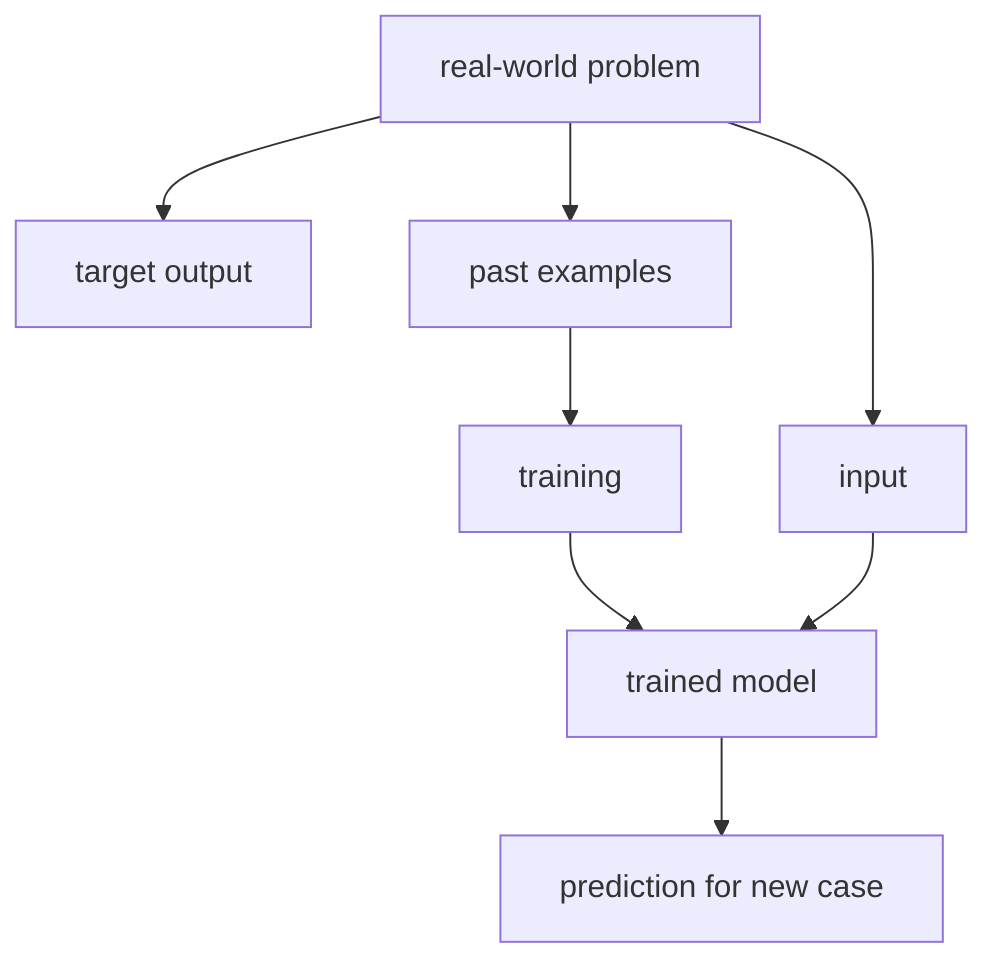

# P1-4.2 Input, Output, and Data

> Section ID: `P1-4.2`
> Version: `v2026.07.09`

Section 4.1 described a model as a computable representation reduced for a purpose rather than the whole real-world problem. Now we move to the first three elements that should be separated when we describe that model: what we put in, what we want to get out, and what kinds of cases we need to gather.

This section organizes `input`, `output`, and `data`. `feature`, `representation`, and `parameter` are handled in 4.3.

The running example is still: `we want AI to help with customer-support messages`. We keep changing that situation slightly to see how input, output, and data separate from each other.

In Part 1, the basic distinction among `input`, `output`, `data`, `example`, and `label` is fixed in this section. The basic distinction between `model` and `system` was fixed earlier in 4.1, and the differences among `feature`, `representation`, and `parameter` are handled in more detail in 4.3. Here the focus is narrower: first separate `what goes in and what should come out` from `what kinds of cases must be gathered`.

This is not yet a modeling task. The phrase “help” is too broad. That broad phrase has to be split into input, output, and data before it becomes a smaller task a model can take responsibility for.

## Scope of This Section

This section organizes the following questions.

- What roles do input, output, and data each play?
- Why does the same real-world problem become a different task when input and output are defined differently?
- Why should data be read not as a pile of files, but as a collection of examples?

This section does not go deeply into the following.

- the detailed differences among features, representations, and parameters
- learning algorithms and loss-function computation
- the full data pipeline and service-operation structure

The relation among features, representations, and parameters returns immediately in 4.3, and the way problem definition changes model choice continues in 4.4. The structure by which input and output are turned into actual feature and representation computation reconnects later in the machine-learning chapters of Part 4 and the neural-network chapters of Part 5. Here the focus stays on separating `what goes in and what comes out`.

## Goal of This Section

- Distinguish the roles of input, output, and data.
- Understand the perspective of reading a real-world problem as a relation between input and output.
- See that the same real-world problem can require different data depending on how input and output are defined.
- Understand that data is not just a file collection, but a collection of examples that gives the model a learning standard.
- Prepare to move into features and representations in 4.3.

## Three Standards

When a real-world problem is reduced to a computable one, the following three points should be separated first.

| Standard | Why it matters | Distinction fixed in this section |
| --- | --- | --- |
| input is the information the model sees | This shows what the model uses as grounds for judgment. | Keep the sense of `the information put in`, such as a message sentence, image, or sensor value. |
| output is the result the model is supposed to produce | This helps explain why the same real-world problem can turn into different tasks. | Distinguish that we must decide whether the result is a class, a score, or a sentence. |
| data is a collection of input-output examples | This shows that data is not just a bundle of files, but a learning standard. | Connect past cases to what they teach the model. |

`input`, `output`, `data`, `example`, and `label` are the core terms that carry the whole section. At this stage, a broad first distinction is enough: `input is the information put in`, `output is the result we want`, `data is a bundle of examples`, `an example is one case`, and `a label is the name of the desired answer`. Each term is tied together once more in the body below.

The part that is especially easy to confuse here is `input` versus `data`. An input is closer to one piece of information the model receives for one judgment right now, while data is closer to a training bundle where many such input-output cases are collected together. For example, the sentence `When will the delivery arrive?` can be one input, while a table containing thousands of such message sentences and their correct classes is data.

Also, one input case does not have to mean only one value. We may feed in only the message sentence, but if needed we can treat `message sentence + order state + customer tier + recent delivery events` as one bundle of input information. In this section, the structure stays clear if we distinguish `input = the bundle of information the model receives for one judgment` from `data = a large collection of those input bundles and output cases`.

## Turning a Problem into a Computable Form

AI models do not handle the whole real-world problem directly. People select part of the situation as input, then define what output the model should produce.

For example, `we want to handle customer-support messages` is not yet a modeling task. It is too broad and vague.

We can narrow it step by step.

| Stage | Still too broad | Improved expression |
| --- | --- | --- |
| 1 | we want to handle customer-support messages | we want to classify customer-support messages |
| 2 | we want to classify customer-support messages | we want to classify the message type from the support sentence |
| 3 | we want to classify the message type from the support sentence | we want to take the message sentence as input and output one of `refund`, `delivery`, `exchange`, or `other` |

By the third statement, the task becomes much closer to a modeling problem, because we can finally see what goes in, what should come out, and what past cases are needed.

To become an AI modeling task, the problem must be narrowed like this.

| Question | Example answer |
| --- | --- |
| What is the input? | the sentence written by the customer |
| What is the output? | one class among refund, delivery, exchange, and other |
| What is the data? | past message sentences and the classes assigned by people |
| What must the model do? | predict which class a new message is closest to |

Then the real-world task is organized into the following structure.

> input -> model -> output

This diagram shows that we do not place the whole real-world problem directly into the model. We first separate it into `input`, `target output`, and `past examples`, then connect them through training and prediction. The `real-world problem` at the top is still a broad real-world issue, and as the structure goes downward, what the model will actually see and what it will be asked to predict become narrower. The safest way to read this figure is not as `a machine that solves reality directly`, but as `a process that cuts a real-world problem into a smaller computable task`.

The Stanford Encyclopedia of Philosophy entry on AI introduces Russell and Norvig’s view of an intelligent agent as a function that receives percepts from an environment and performs actions. That perspective is useful here because it helps read an AI problem as a relation between input and output, or between perception and action.

This structure is still a simplification for learning. In a real service, there may be preprocessing, permission checks, and personal-information removal before the input, and human review, policy rules, or business-system integration after the output.

## Input Is What the Model Observes

Input is the information the model receives for judgment. It may be a sentence, an image, a sensor value, or tabular data.

| Problem | Example input |
| --- | --- |
| support-message classification | message sentence |
| spam classification | email title and body |
| rain prediction | temperature, humidity, pressure, region, time |
| face recognition | face image |
| product recommendation | user click, purchase, and search history |
| incident detection | CPU, memory, error rate, response time |

When defining input, one important point is this: what matters in reality and what actually goes into the model are not always the same.

The customer-support example makes this clearer.

| Information a human can see in reality | Information chosen as model input |
| --- | --- |
| customer-support sentence | message sentence |
| customer’s past order history | not included |
| delivery state | not included |
| notes left by previous agents | not included |
| customer tier or sensitive information | not included |

In that case, the model judges only from the message sentence. Even if delivery state matters to a human, the model cannot use it if that information is not part of the input.

For example, the following two messages may look similar if only the sentence is visible, but the actual handling can differ.

| Message sentence | If only the sentence is visible | What could change with extra information |
| --- | --- | --- |
| `It still has not arrived.` | it may be read as a delivery inquiry | in reality, the order may be in payment-failure status |
| `I want to cancel it.` | it may be read as a refund or cancellation inquiry | if shipping is already in progress, a return procedure may be needed |

So deciding the input means deciding `what to show the model`. At the same time, it also means deciding `what not to show the model`.

That is why defining input requires questions such as the following.

> What information can the model actually see?  
> Is that information enough for the judgment?  
> Is any important information missing?  
> Does the input contain personal or sensitive information?

`input`, `output`, `data`, `example`, and `label` can sound similar. So they should be tied together once here as a baseline before the later paragraphs keep reading input and output definitions on top of that distinction.

| Term | Very short meaning | What it looks like in the customer-support example |
| --- | --- | --- |
| input | the information the model actually receives | the message sentence |
| output | the result the model must produce | a class such as `refund`, `delivery`, `exchange`, or `other` |
| data | a collection of past examples | past message sentences plus the results assigned by people |
| example | one case inside the data | one message sentence and the result paired with it |
| label | the correct output attached to an example | a class name such as `delivery` or `refund` |

At this stage, it is enough if the following distinction remains: `input is the information put in`, `output is the result we want`, `data is the bundle of such cases`, and `label` is the name of the desired answer.

## Output Is the Job Given to the Model

Output is the result the model must produce. Even with the same input, the problem changes completely depending on how we define the output.

For example, the same customer-support sentence can be connected to several different outputs.

| Output definition | Form of output |
| --- | --- |
| choose one message type | fixed category |
| predict urgency from 1 to 5 | numeric score |
| recommend the responsible team | business-routing target |
| generate a draft reply | natural-language sentence |
| decide whether human review is needed | yes/no |

So saying `we use AI to handle customer-support messages` is not enough. We must decide whether the model should output a category, a number, a sentence, or a review flag. The way each output form leads to a different modeling task is organized separately in 4.4.

Suppose the input is the following sentence.

> I ordered yesterday, but tracking still does not work.

Even this single sentence becomes a different task depending on the output definition.

| Task given to the model | Example output | Explanation |
| --- | --- | --- |
| choose a message type | delivery | choose one from a fixed set of classes |
| assign an urgency score | 2 | output a numeric score |
| recommend the responsible team | logistics team | choose a downstream business target |
| produce a draft reply | `Tracking updates can take some time...` | generate a sentence |
| decide whether human review is needed | no | judge whether automatic handling is safe |

The important point here is that even when the input stays the same, once the output changes, the required data changes too. To build a model that chooses a message type, past messages must have labels such as `delivery`, `refund`, and `exchange`. To build a model that generates draft replies, good answer examples or answer-writing standards are needed instead.

Defining output requires questions such as the following.

> Does the model only need to choose one category?  
> Does it need to output a numeric score?  
> Does it need to generate a sentence?  
> Is an intermediate result for human confirmation enough?  
> Is this output actually connected to the real business goal?

## Data Is a Collection of Input-Output Examples

Data is the collection of cases the model uses for reference or training. In supervised learning, we usually use examples that contain both input and the desired output.

Google’s introductory material explains that an example in supervised learning contains features and a label. In this section, we read that more simply: one example is a bundle of `input + desired output`.

| Input | Output |
| --- | --- |
| `I want a refund.` | refund |
| `When will the delivery arrive?` | delivery |
| `The item arrived broken.` | exchange or reshipment |
| `I want to change the address.` | delivery-information change |

This table is simple, but it shows an important structure.

> example 1 = input 1 + output 1  
> example 2 = input 2 + output 2  
> example 3 = input 3 + output 3  
> ...

To say it more slowly, data is a collection of past cases shown to the model.

> When this kind of input came in,  
> people expected this kind of output.

The model adjusts the relation between input and output through this repeated set of cases. Since this section does not yet go deeply into features, it is enough to understand data as `examples where the input the model looks at and the desired output are kept together`.

The pace should also slow down when creating data. Even with the same customer-support message, if the label standard keeps shifting, the model has difficulty learning.

| Input | Label A | Label B | Problem |
| --- | --- | --- | --- |
| `I want to cancel the payment.` | refund | cancellation | the same meaning is assigned different labels |
| `Can I change the address before shipping?` | delivery | address change | the label scheme overlaps |
| `The item arrived broken.` | exchange | defective item | handling-based and cause-based labels are mixed |

Data like this may exist as files, but it is hard to call it good learning data. The standard the model is supposed to learn keeps moving.

A better dataset needs the label standard to be organized first.

| Label | Label standard |
| --- | --- |
| refund | inquiries centered on payment cancellation, refund requests, or order-cancellation intent |
| delivery | inquiries centered on tracking, delay, or delivery-destination change |
| exchange | inquiries that require exchange or reshipment, such as damage, defects, or receipt of the wrong item |
| other | inquiries that do not clearly fit the standards above |

Learning-based models use these examples to adjust the relation between input and output. But the existence of data does not automatically guarantee a good model. A model cannot reliably learn relations that are absent from the data, and it can also learn the wrong relations if the data itself is wrong. We have to check whether the data represents the real usage environment, whether the output labels are consistent, and whether incorrect cases are mixed in.

## When Input and Output Change, Data Changes Too

One real-world problem does not always correspond to one fixed dataset. The shape of the dataset changes depending on what input and output are chosen. In this section, we only confirm the shape of the data; task definition and evaluation criteria continue in 4.4.

Consider the goal `we want to reduce delivery problems`.

| Input | Output | Shape of the data needed |
| --- | --- | --- |
| order region, product type, shipping time | whether delay occurs | order and delivery history with delay labels |
| customer-support sentence | message type | message sentences and message-type labels |
| delivery tracking events | next delivery state | delivery events in time order |
| past delay cases | cause of delay | delay cases and cause labels |
| customer message plus order information | draft reply | message, order state, and answer examples |

This example shows that the input and output definitions determine the shape of the data. Even with the same business goal, different input and output choices require different data.

Put the other way around, it is not enough to say only `let’s collect a lot of data`. We have to decide first what input and output that data is supposed to teach.

| Goal | Why the data to gather changes |
| --- | --- |
| we want to predict delivery delays | structured data such as order time, shipping time, region, and courier state is needed |
| we want to classify delivery-related messages | customer-support sentences and message-type labels are needed |
| we want to generate delivery-related replies | message sentences, order state, policy rules, and good reply examples are needed |

Even under the same broad phrase `delivery problem`, the shape of the data changes as soon as the job given to the model changes. The questions of how to define the task, what candidate models fit it, and what evaluation criteria should be used continue in 4.4.

## Input and Output Definitions Must Be Checked First

The reason a model fails is not always in the algorithm. The input or output definition may have framed the problem incorrectly from the start. Section 4.2 only confirms this as an early warning.

For example, suppose the goal is to reduce customer complaints, but the input is only the message sentence and the output is only the message type. That model may classify messages, but it does not directly solve whether the cause of the complaint is delivery delay, product quality, or refund policy.

Mistakes like the following are common.

| Point to check | Why it matters |
| --- | --- |
| necessary information is missing from the input | the model cannot see an important clue |
| the output is too vague | labels differ from person to person and learning becomes unstable |
| the actual goal and the output do not match | model performance may look good while the business problem remains unsolved |

Whether the data matches the real environment, whether performance holds after deployment, and how sensitive information should be handled are discussed in more detail later under problem definition, evaluation, and service architecture.

> Can this input really support judging this output?  
> Is this output connected to the problem we actually want to solve?  
> Does this data represent the situation in which the model will really be used?

### A Short Exercise in Role Distinction

Look at the cases below and first separate whether the issue is closer to `an input-definition problem`, `an output-definition problem`, or `a data-definition problem`.

| Case | First question to bring to mind | First-pass judgment by the standard of this section |
| --- | --- | --- |
| only the message sentence is used, but accurate handling often requires order state | is important information missing from what the model can see? | closer to an input-definition problem |
| people frequently disagree on the boundaries among `delivery`, `refund`, `exchange`, and `other` | is the result the model is supposed to produce too vague? | closer to an output-definition problem |
| one person labels the same message as `refund`, another as `cancellation` | is the answer standard unstable? | closer to a data-definition problem |
| even inside the team, it is unclear whether the goal is to classify messages or generate draft replies | has the job given to the model really been narrowed to one task? | closer to an output-definition problem |
| only customer messages from one region were collected, so the model fails on expressions from other regions | do the past cases sufficiently represent the real usage environment? | closer to a data-definition problem |

The key to this exercise is not to treat every model-performance problem as an algorithm problem immediately. In practice, the first trouble often appears in `what was put in`, `what the model was asked to predict`, and `what cases were gathered`.

## What to Remember from This Section

A real-world problem does not become a model problem immediately. To become a model problem, input, output, and data have to be defined.

Input is what the model can observe, and output is the job given to the model. Data is the collection of cases that ties that input to that output. Even for the same real-world problem, different input and output definitions can require different data.

The flow of this section can be reorganized like this.

> real-world problem: we want to handle customer-support messages  
> input: what information will be shown to the model?  
> output: what result will the model be asked to produce?  
> data: do we have past cases of that input and output?

Only after those three are organized can we move to the next step and talk about features, representations, and parameters.

Section 4.3 looks more closely at how this input connects to features, representations, and parameters inside the model.

## Checklist

- I can distinguish the roles of input, output, and data.
- I can rewrite a real-world problem into the structure `input -> model -> output`.
- I can explain that even with the same input, different output definitions can require different data.
- I can explain that data is a collection of input-output examples.
- I can explain that data becomes the basis for adjusting the model’s internal standards.
- I can explain that if input and output are defined badly, the problem can begin before data preparation does.

## When This View Should Come to Mind First

Bring back the view of this section when, before looking at model performance, it becomes necessary to ask again `what did we put in, what do we want out, and what kinds of cases did we gather?`

- when different teams imagine different input information or output formats for the same business goal
- when the model keeps failing, but it looks like input information such as order state or contextual information is actually missing
- when there is plenty of data, but you still need to explain why it cannot teach the task you want

At that point, separate `input`, `output`, `data`, `example`, and `label` again first. Then divide the current issue into whether it is mainly an input-definition problem, an output-definition problem, or a data-definition problem. That narrows the cause faster.

## Sources and Further Reading

- Stanford Encyclopedia of Philosophy, Selmer Bringsjord and Naveen Sundar Govindarajulu, [Artificial Intelligence](https://plato.stanford.edu/entries/artificial-intelligence/){: target="_blank" rel="noopener noreferrer" }, 2018-07-12, accessed 2026-06-22.
- Google for Developers, [Supervised Learning](https://developers.google.com/machine-learning/intro-to-ml/supervised){: target="_blank" rel="noopener noreferrer" }, accessed 2026-06-22.
