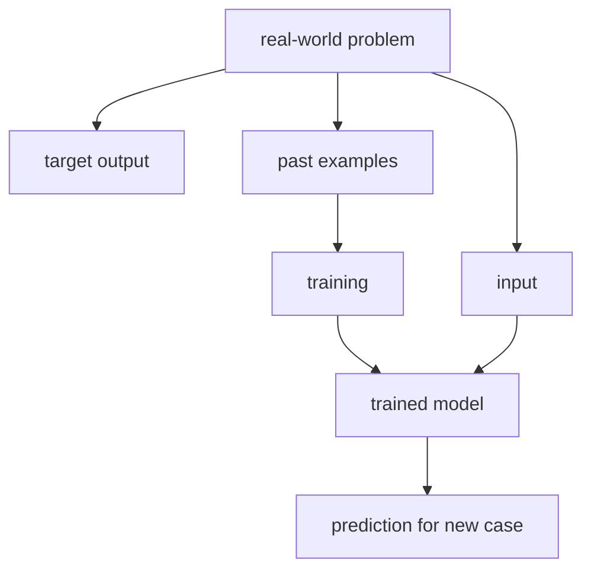

# P1-4.2 Input, Output, and Data

> Section ID: `P1-4.2`
> Version: `v2026.07.07`

Section 4.1 described a model as a computable representation reduced for a purpose rather than the whole real-world problem. Now we move to the first three elements that should be separated when we describe that model: what we put in, what we want to get out, and what kinds of cases we need to gather.

This section organizes `input`, `output`, and `data`. `feature`, `representation`, and `parameter` are handled in 4.3.

The running example is still: `we want AI to help with customer-support messages`. We keep changing that situation slightly to see how input, output, and data separate from each other.

## Scope of This Section

This section organizes the following questions.

- What roles do input, output, and data each play?
- Why does the same real-world problem become a different task when we define input and output differently?
- Why should data be read not as a pile of files, but as a collection of examples?

This section does not go deeply into the following.

- the detailed difference among features, representations, and parameters
- learning algorithms and loss-function computation
- full data pipelines and service-operation structure

The main focus here is separating `what goes in`, `what comes out`, and `what examples must be collected`.

## Goal of This Section

- Distinguish the roles of input, output, and data.
- Understand the perspective of reading a real-world problem as a relation between input and output.
- See that the same real-world problem can require different data depending on how input and output are defined.
- Understand that data is not just a file collection, but a collection of examples that gives the model a learning standard.
- Prepare to move into features and representations in 4.3.

## Three Standards

| Standard | Why it matters | Distinction fixed here |
| --- | --- | --- |
| input is the information the model sees | This shows what the model uses as grounds for judgment. | Keep the sense of `the information we put in`, such as a sentence, image, or sensor value. |
| output is the result the model is asked to produce | This shows how the same real-world problem can become different tasks. | Distinguish what kind of result must come out: a class, score, or sentence. |
| data is a collection of input-output examples | This shows that data is not just files, but the basis for learning. | Connect past cases with what the model is expected to learn. |

At this stage, one broad distinction is enough: `input is the information put in`, `output is the result we want`, `data is a bundle of examples`, `an example is one case`, and `a label is the name of the desired answer`.

## Turning a Real-World Problem into a Computable Form

AI models do not handle the whole of reality directly. People select part of the situation as input, then define what output the model should produce.

For example, `we want to handle customer-support messages` is not yet a modeling task. It is too broad and vague.

We can narrow it step by step.

| Stage | Still too broad | Improved expression |
| --- | --- | --- |
| 1 | we want to handle customer-support messages | we want to classify customer-support messages |
| 2 | we want to classify customer-support messages | we want to classify the message type from the support sentence |
| 3 | we want to classify the message type from the support sentence | we want to take the message sentence as input and output one of `refund`, `delivery`, `exchange`, or `other` |

By Stage 3, the statement is close to a modeling task because we can now see what goes in, what comes out, and what past cases are needed.

| Question | Example answer |
| --- | --- |
| What is the input? | the sentence written by the customer |
| What is the output? | one class among refund, delivery, exchange, and other |
| What is the data? | past message sentences with human-assigned classes |
| What must the model do? | predict which class a new message is closest to |

That structure can be summarized as:

> input -> model -> output

This diagram shows that we do not place the whole real-world problem directly into the model. We first separate it into `input`, `target output`, and `past examples`, then connect them through training and prediction.

## Input Is What the Model Observes

Input is the information the model receives for judgment. It may be text, an image, a sensor value, or tabular data.

| Problem | Example input |
| --- | --- |
| support-message classification | message sentence |
| spam classification | email title and body |
| rain prediction | temperature, humidity, pressure, region, time |
| face recognition | face image |
| product recommendation | click, purchase, and search history |
| incident detection | CPU, memory, error rate, response time |

When defining input, one important point is this: what matters in reality and what actually goes into the model are not always the same.

| Information a human may see in reality | Information chosen as model input |
| --- | --- |
| customer-support sentence | included |
| past order history | not included |
| delivery state | not included |
| notes left by previous agents | not included |
| customer tier or sensitive information | not included |

In that case, the model judges only from the message sentence. Even if delivery state matters to a human, the model cannot use it if that information is not part of the input.

So deciding the input means deciding both `what to show the model` and `what not to show the model`.

## Output Is the Task We Give the Model

Output is the result the model must produce. Even with the same input, the problem becomes completely different depending on how we define the output.

Using the same support sentence, we could define several different outputs.

| Output definition | Form of output |
| --- | --- |
| choose one message type | fixed category |
| predict urgency from 1 to 5 | numeric score |
| recommend the responsible team | routing target |
| generate a draft reply | natural-language sentence |
| decide whether human review is needed | yes/no |

So saying `we use AI to handle customer-support messages` is not enough. We must define whether the model should output a class, number, sentence, or review flag.

Suppose the input sentence is:

> I ordered yesterday, but tracking still does not work.

Even this single sentence becomes a different task depending on the output definition.

| Task given to the model | Example output | Explanation |
| --- | --- | --- |
| choose a message type | delivery | choose one class from a fixed set |
| assign an urgency score | 2 | output a number |
| recommend the responsible team | logistics team | choose a downstream target |
| produce a draft reply | `Tracking updates can take some time...` | generate text |
| decide whether human review is needed | no | judge whether automation is safe |

The important point is that once the output changes, the required data changes too.

## Data Is a Collection of Input-Output Examples

Data is the collection of cases the model uses for reference or training. In supervised learning, we usually use examples that contain both input and the desired output.

Google’s introductory material explains an `example` as something that contains features and a label. At this stage, we can read it more simply: one example is a bundle of `input + desired output`.

| Input | Output |
| --- | --- |
| `I want a refund.` | refund |
| `When will the delivery arrive?` | delivery |
| `The item arrived broken.` | exchange or reshipment |
| `I want to change the address.` | delivery-information change |

This simple table shows an important structure:

> example 1 = input 1 + output 1  
> example 2 = input 2 + output 2  
> example 3 = input 3 + output 3

So data should be read not merely as a pile of files, but as a collection of cases that teaches the model what relation to learn between input and output.

## What to Remember from This Section

At this stage, the key distinction is simple.

> input = the information the model sees  
> output = the result the model must produce  
> data = a collection of past examples that ties the two together

If this distinction is clear, the broad statement `we want AI to help with customer-support messages` can be turned into a smaller, computable task.

## Sources and Further Reading

- Stanford Encyclopedia of Philosophy, Selmer Bringsjord and Naveen Sundar Govindarajulu, [Artificial Intelligence](https://plato.stanford.edu/entries/artificial-intelligence/){: target="_blank" rel="noopener noreferrer" }, 2018-07-12, accessed 2026-06-22.
- Google for Developers, [Machine Learning Glossary](https://developers.google.com/machine-learning/glossary/){: target="_blank" rel="noopener noreferrer" }, accessed 2026-06-22.
- Google for Developers, [Supervised Learning](https://developers.google.com/machine-learning/intro-to-ml/supervised){: target="_blank" rel="noopener noreferrer" }, accessed 2026-06-22.
