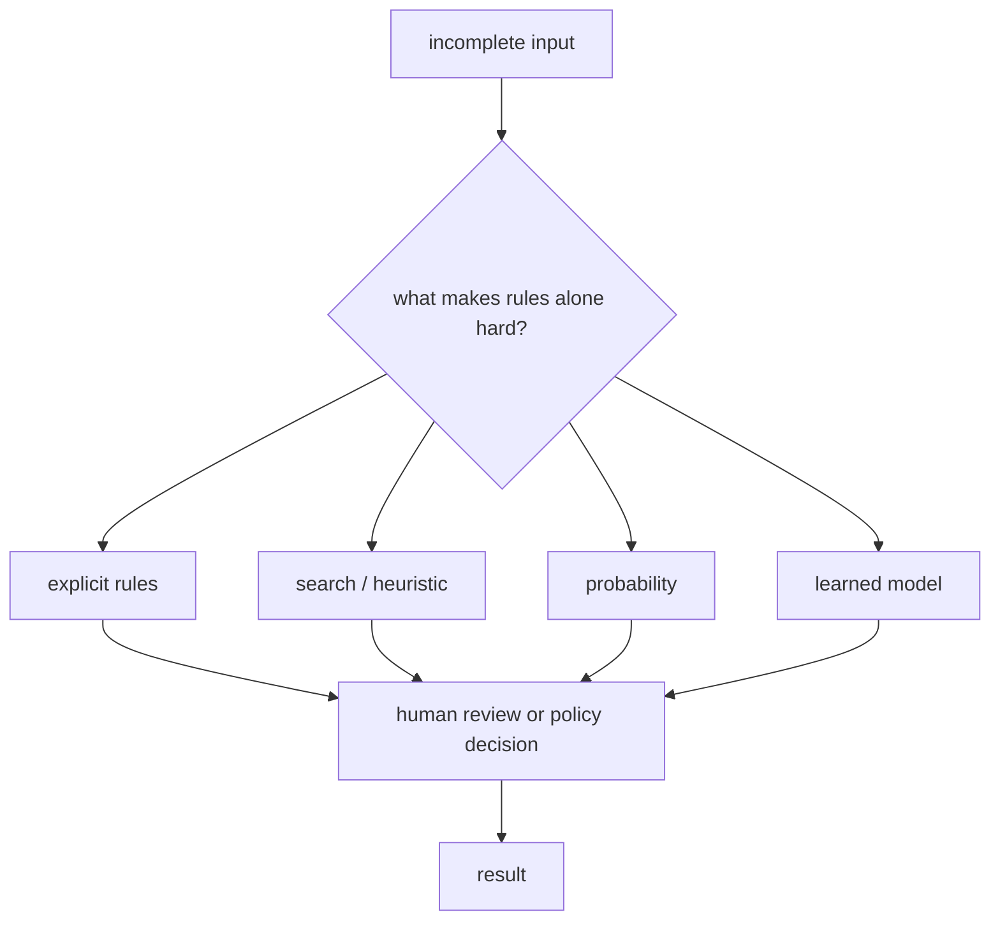

# P1-6.1 Problems with Incomplete Information and Many Exceptions

> Section ID: `P1-6.1`
> Version: `v2026.07.09`

Chapter 5 distinguished `learning` from `inference`. Now we turn to the next question: why did AI end up using rules, search, probability, and learning together?

The question here is simple: why are some problems hard to handle with explicit rules alone?

Rules remain important. Permissions, policies, forbidden conditions, work procedures, and deployment conditions should still be managed explicitly. But real-world problems are full of situations where it is difficult to write every condition and every exception in advance.

This section uses examples to show where rule-only approaches begin to shake.

In this section, we look at why rule sets do not close neatly when there is `incomplete information`, `partial observability`, `noise`, `exceptions`, or an `explosion of candidates`. The distinction among `probability`, `uncertainty`, and `stochastic` continues in 6.2, and the structure of `search` and `heuristics` continues in P1-7.

## Scope of This Section

P1-6.1 is the introduction to P1-6. Detailed probability calculation, conditional probability, random variables, and the meaning of stochastic are handled in P1-6.2. Search algorithms and heuristics are handled in P1-7.

The point here is narrower:

> rules are still necessary,  
> but real-world problems often have conditions that make rules alone insufficient

## Goal of This Section

- Understand the conditions under which rule-based approaches work well.
- Distinguish the problem conditions that are difficult to handle with rules alone.
- Connect incomplete information, partial observability, noise, exceptions, and computational limits at an introductory level.
- Prepare for why uncertainty, probability, heuristics, and learning appear next.

## Three Standards

| Standard | Why it matters | Level of understanding needed here |
| --- | --- | --- |
| rules are still necessary | This helps us read probability and learning as complements rather than replacements. | Keep the idea that policies, forbidden conditions, and procedures still need rules. |
| real-world problems often mix missing information, exceptions, and noise | This shows why explicit rules quickly become insufficient. | Understand that even the same sentence or scene can be interpreted differently depending on context. |
| that is why uncertainty, probability, heuristics, and learning appear next | This ties P1-6 and P1-7 together. | Get an intuition for why probabilistic thinking is needed after rules. |

A short role split is useful here:

| Term | Very short meaning | Role in this section |
| --- | --- | --- |
| lack of information | required information is absent from the start | one reason rules alone cannot settle the case |
| partial observability | only part of the full state can be seen | what is visible right now may be insufficient |
| noise | observed values may be unstable or wrong | the input itself may not be fully trustworthy |
| exception | cases keep appearing outside the existing rules | one reason the rule set becomes rapidly complex |
| explosion of candidates | too many possible options exist | one reason search and heuristics become necessary |

At this stage, one practical intuition is enough: when information is missing, only partly visible, noisy, full of exceptions, or when candidates are too many, rules alone often do not close the problem.

## A First Example

Suppose we process the following sentence with a rule:

> I ordered yesterday, but tracking still does not work.

One simple rule could be written like this:

> if someone says tracking does not work, send the case to the delivery team

This is not a bad rule. In many cases it can classify messages quickly. But the moment the following situations are added, the judgment becomes harder:

| Additional situation that becomes visible | Is the first rule alone enough? |
| --- | --- |
| only 10 minutes have passed since the order | it may just be system update delay |
| payment exists but there is no order number | it may be a payment or order-creation issue |
| the product is preorder delivery | it may not be a delivery problem at all |
| the customer ordered from another account | it may be an account-verification issue |
| a carrier invoice exists but tracking fails | it may be an external integration issue |

The point is not that the original rule was wrong. The point is that it stops being sufficient.

Now consider face recognition:

> if the positions of the eyes, nose, and mouth fit a certain ratio, classify it as a face

That rule is easy to understand. But real photographs include lighting, angle, occlusion, facial expression, resolution, and background.

| Image condition | Why the rule becomes difficult |
| --- | --- |
| the face is turned sideways | the eye-nose-mouth position rule breaks |
| part of the face is hidden by a mask or hand | the required clues are not visible |
| lighting is too dark or too strong | the observed pixels no longer reflect shape clearly |
| drawings, photos, and screen images appear together | it becomes unclear what should count as a real face |

Autonomous driving gives a similar picture:

> if there is an obstacle ahead, stop

That rule is necessary for safety. But on a real road, the system sees objects it must stop for, shadows it can pass through, plastic bags, lane-changing cars, and people who appear suddenly. Even the phrase `ahead` depends on sensor type, distance, speed, and road context.

These examples show why AI often cannot close a problem with simple rules alone.

> rules are necessary  
> but real inputs are incomplete, unstable, and full of exceptions

## Conditions Where Rules Work Well

Rules are strong when conditions and actions are both clear.

| Situation | Example rule | Why it is easier to handle |
| --- | --- | --- |
| permission check | only admins can deploy | the condition and action are explicit |
| input validation | block signup if the email format is invalid | the checking criterion is clear |
| work routing | delivery inquiries go to the delivery team | the label and the handling team are predefined |
| safety policy | reject the request if it is forbidden | the policy condition can be stated explicitly |

These kinds of rules remain necessary even in AI systems because they are explainable, reviewable, and keep intended control explicit.

## Conditions That Become Hard with Rules Alone

Summarizing the earlier examples, real-world problems often contain the following conditions:

| Condition | Meaning | Example |
| --- | --- | --- |
| incomplete information | not all information needed for judgment is given | `tracking does not work` alone does not identify the cause |
| partial observability | only part of the full state can be seen | a robot does not know every object location from the start |
| noise | observation is wrong or unstable | sensor error, blurred image, typo |
| growing exceptions | exceptions to the rule keep appearing | delivery, cancellation, and refund are mixed in one message |
| explosion of candidates | too many possibilities to check exhaustively | route finding, scheduling, game search |

It is always possible to write more rules. The problem is that each added rule may create new exceptions, which then require even more rules.

So the key question is not `should we throw away rules?` but this:

> how far can we state things explicitly with rules,  
> and from what point do we need search, probability, learning, or human review?

## Why Several Approaches End Up Working Together

The table of contents of *Artificial Intelligence: A Modern Approach* places search, heuristic search, partially observable environments, and uncertain knowledge and reasoning as major axes of introductory AI. Poole and Mackworth likewise explain search as the problem of finding ways for agents to reach goals, and explain that in uncertain situations agents update beliefs from observed evidence.

That flow can be read like this:

| Problem condition | Approach that becomes necessary |
| --- | --- |
| something must be explicitly forbidden or allowed | rules |
| there are too many candidates | search, heuristics |
| information is incomplete | probability, uncertainty handling |
| input expressions vary too much | data-driven learning |
| responsible judgment is required | human review, policy decision |

This is not a real service architecture diagram. In 6.1, it is only meant to show why AI often combines several approaches rather than relying on one rule set alone.

This picture is not asking us to memorize one final architecture. The point is to connect problem conditions with the kinds of approaches they tend to call for. Different conditions push us toward different combinations.

## What to Remember from This Section

Rules have not disappeared from AI. They are still strong for policy, safety, permission, procedure, and validation. But real-world problems often contain incomplete information, unstable observation, growing exceptions, and too many candidates.

That is why AI ends up asking several questions together:

> what should be stated explicitly as a rule?  
> what should be found through search?  
> what should be treated probabilistically?  
> what should be learned from data?  
> what should remain for human review?

Section 6.2 continues that flow by distinguishing terms such as `probability`, `uncertainty`, and `stochastic`.

## Checklist

- Explain the conditions where rule-based approaches work well.
- Divide rule-resistant problem conditions into incomplete information, partial observability, noise, exceptions, and explosion of candidates.
- Explain that rules did not disappear, but are combined with other approaches.
- Explain why uncertainty, probability, search, heuristics, and learning appear next.

## When Should This View Come First?

Recall this section when you need to explain why rules are clearly necessary but still do not close many real problems by themselves.

- when policies and procedures are explicit, but the input is unstable or key information is missing
- when exceptions keep growing and rule priority or conflict management becomes increasingly complex
- when you need to connect why probability, search, heuristics, and learning appear after rules rather than instead of rules

## Sources and Further Reading

- Stuart Russell, Peter Norvig, [Artificial Intelligence: A Modern Approach, 4th US ed., Full Table of Contents](https://aima.cs.berkeley.edu/contents.html){: target="_blank" rel="noopener noreferrer" }, accessed 2026-06-22.
- David L. Poole, Alan K. Mackworth, [Artificial Intelligence: Foundations of Computational Agents, 3rd ed.](https://artint.info/3e/html/ArtInt3e.html){: target="_blank" rel="noopener noreferrer" }, accessed 2026-06-22.
- Stanford Encyclopedia of Philosophy, Selmer Bringsjord and Naveen Sundar Govindarajulu, [Artificial Intelligence](https://plato.stanford.edu/entries/artificial-intelligence/){: target="_blank" rel="noopener noreferrer" }, 2018-07-12, accessed 2026-06-22.
