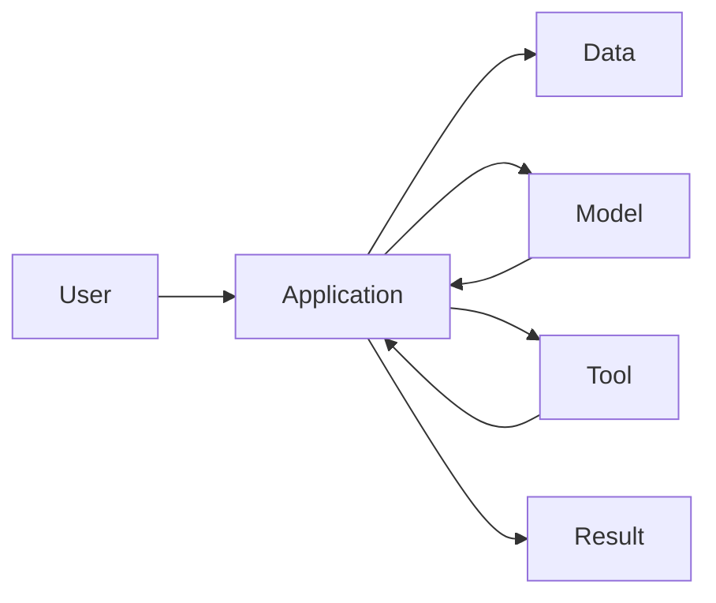

# P1-14.1 Model, Application, Data, and Tool

> Section ID: `P1-14.1`
> Version: `v2026.07.09`

Chapter 13 covered embeddings, similarity search, RAG, and the intuition behind vector search implementation. That flow creates an important shift:

> from seeing only a single `LLM`  
> to seeing the `service structure` around the LLM

An AI service is not made from a model alone. It also needs an `application` the user interacts with, `data` the model can refer to, `tools` that connect to external systems, and code that coordinates the flow.

> an AI service is a system in which the model handles generation and judgment, the application shapes user experience and flow, data provides evidence and state, and tools connect the service to external actions

What matters here is not implementation detail but a broad map.

Part 1 establishes the basic distinctions among `model`, `application`, `data`, `tool`, and `orchestration` here. Chapter 13 focused on how the model can refer to outside material through embeddings, retrieval, and RAG. This section widens the frame and asks:

> what combination of parts makes up an AI service as a whole?

## Scope of This Section

This section separates the main components of an AI service. The specific positions of `RAG` and `tool use` are covered in P1-14.2. `Agents`, `MCP`, `harnesses`, and cost or operational constraints are covered in P1-14.3 and later.

`Model`, `application`, `data`, `tool`, and `orchestration` are different service components. Their roles can first be separated like this:

| Term | Very short meaning | Role in this section |
| --- | --- | --- |
| model | a computational component that performs generation and judgment from input | the core computation element of the service |
| application | the surface and flow through which the user requests and receives results | the entry point of user experience |
| data | information that provides evidence and state | the material for answers and actions |
| tool | a connection method that calls external system functions | the execution side of lookup and action |
| orchestration | how these elements are tied together in order and under conditions | the frame that shapes the service structure |

The baseline distinction here is:

- the model handles computation
- the application shapes the experience
- data provides evidence
- tools execute external actions
- orchestration connects the whole flow

## Goal of This Section

- Understand an AI service as a combination of components rather than as a single model.
- Distinguish the roles of the `model`, `application`, `data`, and `tool`.
- Get the broad picture of where prompts, RAG, and tool calls sit in the service flow.
- Understand that the model does not do everything directly, and that service code wraps the model's inputs and outputs.
- Prepare to move into the distinction between RAG and tool use in P1-14.2.

## Three Standards

| Standard | Why it matters | Level of understanding needed here |
| --- | --- | --- |
| an AI service is not made from a model alone | This reduces the mistake of treating the chatbot experience as the whole system. | It is enough to understand that the application, data, and tools are also needed. |
| the model, application, data, and tool each have different roles | This is the map needed for the later discussions of RAG, agents, and MCP. | It is enough to distinguish generation, flow management, evidence, and external action. |
| service quality depends on the way the whole system is connected, not only on model capability | This introduces the architecture view. | It is enough to understand that permissions, retrieval, and post-processing matter too. |

## The Model Is the Core Component That Produces Answers

A `model` is the core component of an AI service. It can take user input and produce outputs such as text, code, image descriptions, or structured data.

At first, the model can be simplified like this:

> input  
> -> model  
> -> output

But a real service wraps this flow much more heavily:

> user request  
> -> input preparation in the app  
> -> retrieval of needed data  
> -> model call  
> -> review or post-processing  
> -> display to the user

The model performs important judgment and generation, but it does not handle account management, permission checks, data storage, external API calls, or screen rendering by itself. Those jobs belong to the application and service code.

## The Application Handles the User's Request and Result Flow

The `application` is the surface the user actually meets. A web page, mobile app, chat UI, IDE extension, or work dashboard can all be applications.

The application does more than simply pass a question to the model.

| Role of the application | Description |
| --- | --- |
| input collection | receives the user's question, file, selected values, and settings |
| context construction | organizes user state, screen information, previous conversation, and selected documents |
| output display | shows the model's result in a readable form |
| error handling | reports failures, delays, or permission problems to the user |
| review flow | lets the user edit, approve, or retry the result |

Even when the user feels they are talking directly to the model, the experience is usually being shaped by the application.

## Data Provides Evidence and State

`Data` plays two major roles in an AI service.

First, it provides evidence for answers. Documents used in RAG, organization knowledge bases, product manuals, and the book text itself all belong here.

Second, it provides service state. User settings, permissions, task history, order status, and project metadata are all information needed to process the current request.

| Type of data | Example |
| --- | --- |
| evidence data | documents, manuals, papers, FAQs, book sections |
| state data | user settings, permissions, session data, task status |
| input data | uploaded files, questions, selected paragraphs |
| log data | request records, errors, evaluation results, feedback |

What matters is not simply having more data, but deciding what data should be shown to the model, what data should be hidden, and what data must remain current.

## Tools Execute Actions Outside the Model

A `tool` is an execution path that connects the service to systems outside the model.

> model:  
> proposes what should be done and may generate the tool name and arguments
>
> tool execution code:  
> performs the actual API call, retrieval, file processing, or database lookup

For example, if a user asks to find decisions from last week's meeting notes and add them to a schedule, the work may involve:

| Needed work | Main component |
| --- | --- |
| find the meeting notes | search tool or file search |
| extract the decisions | model |
| turn them into calendar format | model or application code |
| add them to the calendar | calendar API tool |
| confirm the result | application |

Tool use is powerful, but it is also risky. A service can call the wrong tool, access unauthorized data, or execute actions the user did not approve. That is why tool use is examined more directly in P1-14.2.

## Orchestration Connects the Flow

Even if the model, application, data, and tools exist, they do not automatically become a good service. Someone still has to decide the order in which they are connected.

That role can be described as `orchestration`.

> receive the user request  
> -> check permissions  
> -> retrieve needed data  
> -> compose the prompt  
> -> call the model  
> -> decide whether tools are needed  
> -> post-process the result  
> -> show it to the user  
> -> save logs and feedback

The important point is that the model does not automatically own the entire flow. The model performs generation and judgment inside the flow. The application and server code decide when to call the model, what data to provide, what tools to allow, and how the result should be reviewed.

## Seeing the Four Components Together

An AI service can be simplified into the following structure:

This diagram does not capture every detail of a real system, but it is enough to connect the roles of the service components at a glance.

## The View to Keep from This Section

An AI service is not a model alone. The model is important, but the service becomes usable only when the application, data, tools, and orchestration are added around it.

> the model handles generation and judgment  
> the application shapes user experience and flow  
> data provides evidence and state  
> tools connect the service to outside action  
> orchestration ties these parts together

## Checklist

- You can explain an AI service as a combination of the model, application, data, tools, and orchestration.
- You can distinguish the roles of the model, application, data, and tool.
- You can explain that the model is a core computation component inside the service, not the whole service itself.
- You can describe data as both evidence and state.
- You can explain that tools execute actions outside the model.

## When to Recall This View First

- When the chatbot experience is being treated as if it were the whole system
- When you need to explain where prompts, retrieval, and tool calls sit in the same service flow
- When the quality of a service is being attributed only to model capability

In those cases, separate the service first into `model`, `application`, `data`, `tool`, and `orchestration`. That prevents the whole system from being flattened into the model alone.
