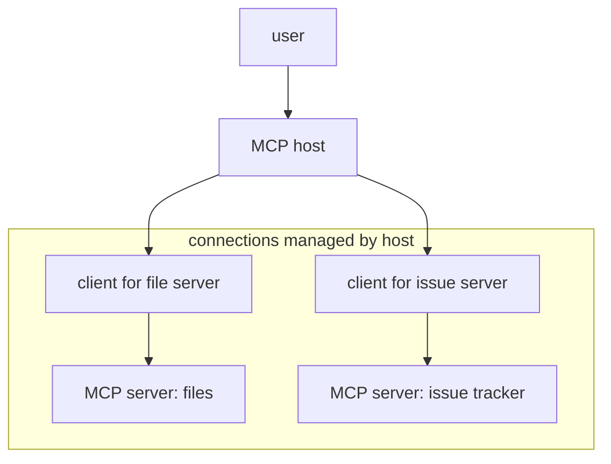

# P1-14.4 MCP and the Standardization of Tool Connections

> Section ID: `P1-14.4`
> Version: `v2026.07.07`

P1-14.3 described an `agent` as a workflow that carries `goal`, `state`, `action`, and `observation` forward. When an agent uses outside data or tools, it needs a connection method.

> agent:  
> decides what should be done and continues the workflow
>
> `MCP`:  
> standardizes how an agent or AI application connects to outside tools and data

`MCP (Model Context Protocol)` is an open protocol that aims to standardize how AI applications connect to external systems. The most important point is that MCP is neither the `model` itself nor the `agent` itself.

> MCP is a protocol for aligning the way AI applications connect to outside data, tools, and reusable work templates

## Scope of This Section

This section explains the basic role and structure of MCP. It does not cover server implementation details, SDK usage, JSON-RPC message structure, or OAuth flows. Harnesses, execution logs, and evaluation are covered in P1-14.5. Security and privacy are revisited in P1-15.1, P1-15.2, and P1-15.3.

| Term | Very short meaning | Role in this section |
| --- | --- | --- |
| MCP | a connection protocol for AI applications and external systems | the standardization view of Chapter 14 |
| host | the application or runtime the user interacts with | the side that owns the connection |
| client | the component that communicates with a particular MCP server | the unit that manages one connection |
| server | the program that provides tools, resources, or prompts | the provider of outside capability |
| tool | an executable function | the unit of action |
| resource | readable context data | the input side of state and evidence |
| prompt | a reusable interaction template | a device for reusing instruction format |

The baseline distinction here is:

- MCP is the connection rule
- the server provides capability
- tools are for execution
- resources are for reading
- prompts are reusable templates

## Goal of This Section

- Understand MCP as a connection `protocol`, not as an agent.
- Distinguish the roles of `host`, `client`, and `server`.
- Avoid mixing up `tools`, `resources`, and `prompts`.
- Understand that MCP can make tool use easier but does not automatically solve permission, approval, or validation.
- Prepare to move into the harness and evaluation environment in P1-14.5.

## Three Standards

| Standard | Why it matters | Level of understanding needed here |
| --- | --- | --- |
| MCP is a connection protocol, not an agent | This prevents MCP from being misunderstood as another AI system. | It is enough to understand it as a rule for linking applications and external systems. |
| host, client, and server have different roles | This makes the standardization structure readable. | It is enough to distinguish who requests, who mediates, and who provides capability. |
| even with standardization, permission and validation remain separate problems | This prevents overconfidence in the protocol itself. | It is enough to understand that approval and security still need separate handling. |

## Why a Connection Standard Is Needed

As P1-14.1 explained, an AI service combines the model, application, data, tools, and orchestration. As the service grows, the number of external systems also grows:

> file systems  
> databases  
> search engines  
> calendar tools  
> issue trackers  
> design tools  
> automation tools  
> internal document systems

If every AI application builds a different custom connection for every tool, the combinations become complex very quickly.

MCP can be understood as a flow that tries to reduce that problem by offering:

> a different custom connection for each tool  
> -> a discoverable and callable common protocol

## Host, Client, and Server

MCP follows a client-server structure, but it is helpful to distinguish `host`, `client`, and `server` more carefully in this context.

| Component | Description |
| --- | --- |
| MCP host | the AI application or agent runtime the user interacts with |
| MCP client | the component that maintains a connection to one particular MCP server |
| MCP server | the program that exposes outside data, tools, or prompts through MCP |

The flow can be simplified like this:

One AI application may connect to several MCP servers. The server does not have to be remote. It may run locally on the user's machine or remotely across the network.

## What an MCP Server Provides

The most common things exposed by an MCP server are `tools`, `resources`, and `prompts`.

| Element | Role | Example |
| --- | --- | --- |
| tools | executable functions or actions | file reading, issue creation, database lookup, calculation |
| resources | readable context data | file contents, database rows, API responses, document fragments |
| prompts | reusable interaction templates | task instructions with examples for a particular workflow |

This also connects back to the distinction in P1-14.2:

> resources:  
> provide context the model can read
>
> tools:  
> execute external system functions
>
> prompts:  
> help reuse an interaction pattern in a stable form

## Discovery and Calling

One of the main intuitions of MCP is `discovery`. An AI application can ask a connected MCP server what tools and resources it offers.

> 1. the AI application connects to an MCP server  
> 2. it checks what capabilities the server exposes  
> 3. it retrieves the available tool list  
> 4. it selects the needed tool and calls it  
> 5. it reflects the result into model input or application state

This matters because it turns tool use into a more structured process than vague natural-language guessing.

## MCP Organizes the Connection Surface of an Agent

If we return to the agent loop from P1-14.3:

> check the goal  
> -> inspect state  
> -> choose the next action  
> -> execute a tool  
> -> observe  
> -> update state

MCP mainly organizes the connection surface for two parts of that loop:

| Agent-flow stage | What MCP can help with |
| --- | --- |
| checking state | reading files, documents, or data through resources |
| choosing the next action | inspecting what tools are available and what they do |
| executing the tool | calling the tool in a standardized way |
| observing | receiving structured tool results for the next decision |

But MCP does not guarantee plan quality, judgment quality, or final task success. It is a connection rule, not a thinking mechanism.

## What MCP Does Not Solve

MCP helps standardize tool connections, but it does not automatically solve every problem.

| Problem it does not solve | Why |
| --- | --- |
| deciding whether a tool is safe | the server itself may expose risky capability |
| deciding user permissions | who may access what remains a service policy issue |
| execution approval | actions that change outside state may still require human confirmation |
| truthfulness of interpretation | tool results still need to be interpreted and reviewed |
| agent evaluation | success criteria still belong to harness and evaluation design |

Because MCP servers connect to outside systems, trust boundaries, isolation, approval, and logging still matter.

## The View to Keep from This Section

MCP is not the model and not the agent. It is a protocol for standardizing how AI applications discover and connect to outside capabilities.

> the host owns the connection  
> the client manages a server link  
> the server provides tools, resources, and prompts  
> tools execute actions  
> resources provide readable context  
> prompts provide reusable interaction patterns

With that distinction in place, the next section can focus on a different question:

> once the model, tools, and connections exist, how do we observe, verify, and evaluate the execution itself?

## Short Check

- You can explain MCP as a connection protocol rather than as an agent or model.
- You can distinguish the roles of host, client, and server.
- You can distinguish tools, resources, and prompts.
- You can explain that MCP helps standardize discovery and calling, but does not remove the need for permission, approval, validation, or security design.
- You can explain where MCP sits inside an agent workflow.

## When to Recall This View First

- When MCP is being described as if it were another AI system
- When multiple outside tools or data sources need a common connection pattern
- When the difference between reading context and executing actions has to stay clear even after standardization

In those cases, separate `protocol`, `server capability`, `readable resource`, and `executable tool` first.

## Sources and Further Reading

- Anthropic, [Introducing the Model Context Protocol](https://www.anthropic.com/news/model-context-protocol){: target="_blank" rel="noopener noreferrer" }, accessed 2026-06-23.
- Model Context Protocol, [Introduction](https://modelcontextprotocol.io/introduction){: target="_blank" rel="noopener noreferrer" }, accessed 2026-06-23.
- Model Context Protocol, [Architecture](https://modelcontextprotocol.io/docs/learn/architecture){: target="_blank" rel="noopener noreferrer" }, accessed 2026-06-23.
- Model Context Protocol, [Security Best Practices](https://modelcontextprotocol.io/specification/2025-06-18/basic/security_best_practices){: target="_blank" rel="noopener noreferrer" }, accessed 2026-06-23.
