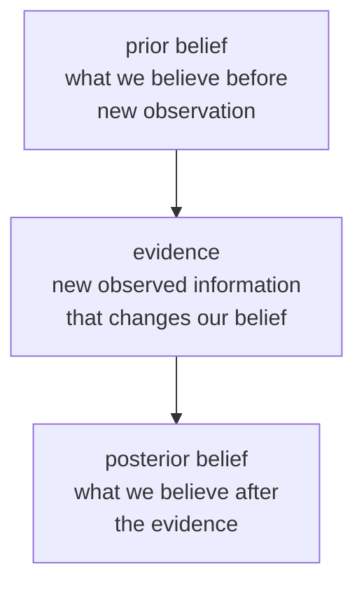

# P2-5.1 How Probability Represents Uncertainty as Numbers

> Section ID: `P2-5.1`
> Version: `v2026.07.09`

In Chapter 4 of Part 2, we used derivatives and gradients to see `how values should be changed so that loss decreases`. Now we need a different kind of mathematical language.

Differentiation lets us read the direction of change. Probability lets us deal numerically with situations that are not certain. In other words, differentiation is the language that reads how values change, and probability is the language that expresses a state of not knowing as numbers.

When studying AI, probability does not stay only at dice and coin problems. When data is limited, observation is incomplete, or a model sees the world in a simplified way, we deal not with certain answers but with `how likely is this?` Here, we fix the entrance to that perspective.

This Section reorganizes probability, uncertainty, event, outcome, and sample space. If Chapter 4 read change and the direction of learning, this Section reorganizes the entrance to probability as the language that expresses uncertain situations as numbers.

Here, instead of fully calculating probability formulas, the focus is on recovering probability as the language that expresses uncertainty numerically. If we hold onto the intuition of event, outcome, sample space, and possibility scores here, then later, when we read distributions, estimation, and model prediction probabilities, we can read with less interruption why probability language keeps returning.

## Scope of This Section

This Section introduces probability as a numerical language that expresses uncertainty.

The following topics are not treated in depth.

- strict proofs of probability axioms
- formula calculations of conditional probability
- Bayes' rule calculations
- kinds of probability distributions
- procedures of statistical estimation

These topics return later: distributions, mean, and variance in P2-5.2; samples and estimation in P2-5.3; and later ideas such as standard deviation and confidence intervals in the supplementary learning of P2-5.5.

The first question to solve here is this: `why should the state of not knowing be expressed as a number, and why is that number still not the same thing as the decision itself?`

So this Section first fixes only the following five questions.

- What is uncertainty?
- Why is probability expressed as a number between 0 and 1?
- What are event, outcome, and sample space?
- Is probability a correct answer, a belief, or a long-run frequency?
- Why does the language of probability repeatedly appear in AI?

| Term | Very Short Meaning | Role in This Section |
| --- | --- | --- |
| probability | a value that expresses possibility numerically | the starting point of this whole chapter |
| uncertainty | a state of not yet knowing | the reason probability is needed |
| event | a bundle of outcomes we care about | the target to which probability is attached |
| outcome | one individual case that can actually occur | the smallest unit that makes up an event |
| sample space | the set of all possible outcomes | the full frame in which events and outcomes are placed |

The flow after this Section is also simple.

- In `P2-5.2`, we will see how these probability numbers, when gathered together, are read as distributions, means, and variances.
- In `P2-5.3`, we move to questions of sample and estimation when the data we have is only part of the whole.
- In Part 3 and Part 5, probability appears again as the language of prediction scores, calibration, and safety judgment.

## Goals of This Section

- You can explain uncertainty as `a state of not yet knowing`.
- You can explain probability as the numerical language used to express and compare uncertainty.
- You can distinguish outcome, event, and sample space.
- You can explain that probability is not always a number that guarantees the correct answer, but an expression used for judgment and modeling.
- You can distinguish long-run frequency and degree of belief.
- You can say why AI model predictions connect to probabilistic expression.

## Three Criteria

| Criterion | Why It Matters | Level of Understanding Needed in This Section |
| --- | --- | --- |
| Uncertainty is a state of not yet knowing | Before the number itself, we must understand what kind of state probability is expressing. | Understand uncertainty as a state in which information is lacking or the future is not yet fixed. |
| Probability expresses that state numerically | To compare possibilities and use them as judgment material, we need a language of expression. | Understand probability as a method of expressing and comparing a state of not knowing with numbers. |
| AI repeatedly uses the language of probability | Because prediction and judgment are often not certain, possibility must be handled numerically. | Understand that model output may be an expression of possibility rather than a final confirmed answer. |

## Uncertainty Is a State, Not a Number

Uncertainty is not itself a number. Uncertainty is a state in which we do not yet know.

For example, think about the following questions.

- Will it rain tomorrow?
- Is this email spam?
- Is the object in this picture a cat?
- Will this user still use the service next month?

These questions are hard to determine completely right now. Information may be insufficient, the future may not have arrived yet, or observation may be incomplete.

Probability is the method of expressing this uncertain state numerically. For example, we may write a 70% chance of rain, a 95% chance of spam, an 82% chance of cat, or a 30% chance of churn.

Here, the number does not mean `we already know the answer`. It is the way of expressing, based on the current information and model, which side looks more plausible.

The chart below shows the intuition of expressing an uncertain state with a probability number between 0 and 1.


## Probability Is Expressed as a Number Between 0 and 1

Probability is usually expressed as a number between 0 and 1. `0` is the side treated as not occurring, `1` is the side treated as certain to occur, and `0.5` is the side that treats the two possibilities as similar.

Written as percentages:

```text
0.7 = 70%
0.2 = 20%
1.0 = 100%
```

The important point is that probability is not a number that directly says `good` or `bad`. Probability represents how likely some event is. For example, an 80% probability of rain means that the event of rain is likely. Whether that is good weather or bad weather depends on the purpose.

This distinction is also important in AI services. If a model outputs `spam probability 0.95`, that is a possibility score for the event of being spam. Whether to block the result, warn the user, or ask a person to review it is a separate decision layered on top of that score.

## Separate Outcome, Event, and Sample Space

To read probability, we must first separate three words.

| Term | English | Working Definition |
| --- | --- | --- |
| result | outcome | one individual result that can actually occur in a single trial |
| event | event | a bundle of results we care about |
| sample space | sample space | the set of all possible results |

Let us look at the situation of throwing one die. The possible outcomes are `1, 2, 3, 4, 5, 6`, and the sample space is `{1, 2, 3, 4, 5, 6}`. At that point, the event of getting an even number can be written as `{2, 4, 6}`.

If we assume the die is fair, the probability of getting an even number can be calculated as follows.

\[
P(\text{even}) = \frac{3}{6} = 0.5
\]

This calculation divides `the number of outcomes we care about` by `the number of all possible outcomes`. Here, the outcomes we care about are `2, 4, 6`, and the whole outcomes are `1, 2, 3, 4, 5, 6`, so the probability is `3 / 6`.

As in the chart below, an event is a bundle of the outcomes we care about inside the sample space.


But this method applies directly only when we can treat all outcomes as equally likely. In real data, outcomes are often not equally likely.

## Coins and Dice Are Only a Starting Point

Coins and dice appear often when probability is first taught for a simple reason. It is easy to list the possible outcomes, and if we assume a fair coin or die, it is easy to assume that each outcome has a similar chance.

For a coin, the possibilities are heads and tails. For a die, the possibilities can be listed simply as `1, 2, 3, 4, 5, 6`.

But real AI problems are more complex. We may think of questions such as whether a customer will churn, whether a sentence has positive sentiment, whether an image contains a pedestrian, or how risky a loan application is.

In these problems, it is hard to divide the possible outcomes into simple equal ratios. So we estimate possibility by using data, features, and models.

At that point, probability expands from `a problem where we can count like a die` into `a problem where we estimate possibility from observed data`.

## Long-Run Frequency and Degree of Belief

When understanding probability, two perspectives often appear.

One is long-run frequency. This is the perspective that repeats the same experiment many times, looks at the proportion with which some result appears, and interprets that proportion as probability.

If we throw a fair coin many times, we can expect the proportion of heads to come close to 0.5. This perspective is intuitive when explaining repeatable experiments.

The other is degree of belief. This is the perspective that expresses numerically how plausible some event seems based on the information currently available.

For example, a doctor may judge the possibility of a disease by looking at symptoms and test results, or a model may calculate the possibility that an email is spam by looking at its content. We cannot clone the same person infinitely and repeat the experiment, but we can still express possibility based on current information.

Here, we separate the two perspectives in this way. We read repeatable experiments from the perspective of long-run frequency, and situations where we must judge based on current information from the perspective of degree of belief.

In AI, both perspectives appear. We use frequencies observed in data, and we also use possibility scores based on the model's current information.

## Bayes' Rule Is the Language of Updating Belief

Bayes' rule can look very unfamiliar at first. Especially if probability is remembered only through coins, dice, and ratio calculations, the expression `updating belief` itself may not feel mathematical.

Here, we do not calculate Bayes' rule. But we do fix in advance why this name appears often in probability and AI documents.

Very roughly, Bayes' rule is the rule that handles the flow by which a belief we already had is updated into a new belief after we observe new information.

In English, it is often expressed with the following terms.

| Term | English | Working Explanation |
| --- | --- | --- |
| prior belief | prior belief | the possibility judgment we had before seeing new evidence |
| evidence | evidence | the observed information that changes that belief |
| posterior belief | posterior belief | the updated possibility judgment after seeing the evidence |

For example, suppose we initially judged that an email had a low chance of being spam. If new evidence appears such as many links, repeated suspicious phrases, and an unfamiliar sender, the judgment may change.

In other words, at first the email may have looked unlikely to be spam, but after seeing new evidence such as many links and an unfamiliar sender, we may judge the spam possibility as higher.

The chart below shows Bayes' rule not as a formula but as `a flow that updates belief with new evidence`.



The important word here is evidence. Evidence does not mean only `supporting material`. It is also used to mean the observed information that changes a probabilistic judgment. When the word evidence appears in AI documents, it helps to ask `what changed the judgment?`

Bayes' rule is not the core calculation target of P2-5.1. Here, we leave only the perspective that `probability can be updated by new observation`. The calculations of conditional probability and Bayes' rule remain outside the scope of the current main text of this book.

## Probability Is an Expression, Not the Answer

If we read probability as `the answer`, misunderstanding occurs. For example, `70% chance of rain` does not mean that it must rain, `95% probability of spam` does not mean that it is absolutely spam, and `82% probability of cat` does not mean only that the model understood the word cat.

Probability is an expression for dealing with uncertainty. Whether that expression is trustworthy is a separate question. We must separately ask whether the data is sufficient, whether the data is biased, by what criterion the model calculated possibility, whether the probability score matches real frequency well, and what the decision threshold is.

These questions return later: in Part 3, P3-6 on evaluation metrics and P3-6.4 on calibration; and in Part 5, P5-10.2 on safety and alignment.

## Why Probability Is Needed in AI

In many cases, AI does not operate only with certain rules. It finds patterns in data and, based on those patterns, calculates possibilities for new inputs.

For example, an image-classification model may give scores such as `cat: 0.82`, `dog: 0.12`, `rabbit: 0.04`, and `other: 0.02`.

These numbers show how plausible the model considers each candidate. If we choose the largest value, the prediction becomes `cat`. But inside the model, the distribution of possibilities among candidates is often more important than a single final answer.

Language models have a similar structure.

## View It Through a Case

### Case 1. Why Spam-Mail Judgment Needs the Language of Probability

Suppose a mail service looks at a new email and wants to judge `is it spam or not?` A person can also look at the title, sender, number of links, and tone of the message and become suspicious, but in many cases it is hard to assert from the start that it is `definitely spam`.

At that point, probability does not throw away the state of `we do not know`. It expresses that state numerically. For example, we can look at a specific email as having a spam probability of 0.95 and a normal-mail probability of 0.05. These numbers do not mean that we already know the correct answer. They are the language used to compare which side is more plausible under the current information.

This case also shows that probability and decision are different. Even if the spam probability is high, whether to delete the mail immediately, only warn the user, or ask a person to review it again is a separate policy question. Probability is material for judgment, and final action is another layer placed on top of it.

So, what matters at the entrance to probability is not the dice calculation itself, but how uncertain real problems are translated into a numerical language and read. This is also why probability repeatedly appears in AI.

We can also read a language model as a structure that places candidate next word A, candidate B, and candidate C side by side and compares how likely each one is to follow next.

We do not treat the detailed calculation of a language model here. But it is worth remembering that AI is less `a machine that directly pulls out the answer` and more `a system that often uses calculations comparing possibility among uncertain candidates`.

## Probability, Uncertainty, and Stochastic Are Not the Same Word

As you continue reading AI documents, you will often meet probability, uncertainty, and stochastic. These three words are connected, but they are not the same word.

| Term | English | Distinction |
| --- | --- | --- |
| uncertainty | uncertainty | the state of not yet knowing |
| probability | probability | the language that expresses uncertainty numerically |
| stochastic | stochastic | the property that a process or action includes probabilistic variation |

For example, throwing a die can be seen as a stochastic process. It is hard to say in advance which face will come out, and when we repeat the process, the result can vary.

By contrast, the situation `I cannot confidently know whether this customer will churn because I have not fully observed the customer's mind` is a problem of uncertainty. If a model expresses this uncertainty with a number such as 0.3, that becomes probability.

So uncertainty is the state of not knowing, probability is the numerical expression of that state, and `stochastic` is the property that the process itself contains probabilistic variation.

This distinction matters later when reading machine learning and generative AI. If we use `random`, `stochastic`, `nondeterministic`, and `probabilistic` as if they all meant the same thing, the explanation can become blurred.

## A Simple Example: Spam-Mail Judgment

Let us think again about spam-mail classification.

The input is the email title and body, and the output is the possibility that it is spam.

The model may look at clues such as whether certain words repeat, whether there are many links, whether the sender is unfamiliar, and whether the pattern is similar to previous spam messages.

Then it may produce a number such as `probability of spam: 0.92`.

This number is not a declaration that it is `unconditionally spam`. It is an expression that, under the current model and data, the possibility of being spam is high. In a real service, we may separately set operating criteria such as `block automatically if it is 0.99 or higher`, `move to the spam folder if it is 0.80 or higher`, or `show it for the user to judge directly if it is near 0.50`.

Here, probability is a number that helps judgment, and the operating criterion must be set separately. This distinction is very important when understanding AI services.

The chart below shows that the model's probability score and the service's operating decision should be viewed separately. Even for the same probability score, different actions may follow depending on service purpose, risk, cost, and policy.


## Perspective to Keep from This Section

Probability helps us understand AI as `computation that makes judgments in an uncertain world`. The world is not always fully observed, data can be limited and biased, and models see reality in a simplified way, so AI often computes possibilities.

Learning probability is not only about solving dice problems. It is about recovering the language needed to read prediction, classification, generation, sampling, confidence, risk, and evaluation, all of which repeatedly appear in AI documents.

## Short Check

- You can explain uncertainty not as the number itself, but as a state of not knowing.
- You can explain probability as the numerical language between 0 and 1 that expresses uncertainty.
- You can distinguish outcome, event, and sample space.
- You can calculate the probability of getting an even number from a fair die as \(3/6\).
- You can explain that probability is not always a number that guarantees the answer, but an expression based on the current information and model.
- You can distinguish long-run frequency and degree of belief.
- Even without calculating Bayes' rule, you can explain it as a flow that updates belief with new evidence.
- You can explain why probability, uncertainty, and stochastic should not be used as if they were the same word.
- You can explain that an AI model's output probability and the actual operating decision must be separated.

## When Should You Recall This Perspective First?

- Recall it first when you still remember probability only as coin and die calculation, so the connection to AI prediction scores breaks.
- Recall it first when outcome, event, and sample space look like the same word and you need to separate the basic units again.
- Recall it first when you begin to read a model's output probability directly as an operating decision, or when you remember Bayes' rule only as a formula.

## Sources and References

- Barbara Illowsky, Susan Dean, [Introductory Statistics, 3.1 Terminology](https://openstax.org/books/introductory-statistics/pages/3-1-terminology){: target="_blank" rel="noopener noreferrer" }, OpenStax, checked 2026-06-24.
- Ian Goodfellow, Yoshua Bengio, Aaron Courville, [Deep Learning, Chapter 3: Probability and Information Theory](https://www.deeplearningbook.org/contents/prob.html){: target="_blank" rel="noopener noreferrer" }, MIT Press, 2016, checked 2026-06-24.
