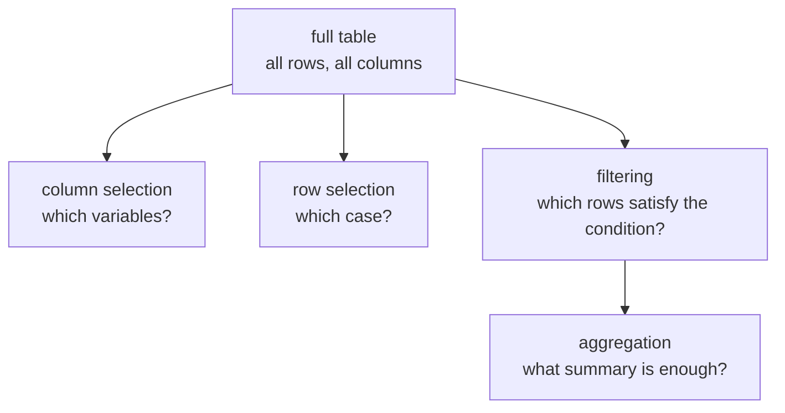
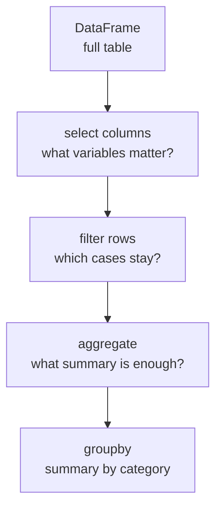

# P2-12.2 Selection, Filtering, and Aggregation

> Section ID: `P2-12.2`
> Version: `v2026.07.09`

In P2-12.1, we treated a Pandas `DataFrame` as a table-shaped data structure with rows, columns, and an index. That immediately raises one more question.

Receiving a table does not mean the needed information is already visible. In practice, you keep doing things like these.

- Choose only certain columns.
- Look at only certain rows.
- Keep only rows that satisfy a condition.
- Check the mean or count of a numeric column.
- Split the table by category and summarize it.

In Pandas, selection, filtering, and aggregation describe exactly that flow.

This Section explains the basic distinction among `Series`, filtering, aggregation, `groupby`, `loc`, and `iloc`. The representative explanation of the `DataFrame` itself stays in P2-12.1 and the [concept glossary](../../../reference/concept-glossary.md). Here, the focus is on what to read from that table, what to keep, and what to summarize.

## Scope of This Section

This Section does not yet go into full cleaning or missing-value handling. The preprocessing context of dataset preparation and the issue of data leakage reconnect in P2-12.3. We also keep `merge`, `join`, `pivot`, time series, and `MultiIndex` outside the present main track, and concentrate here on the flow of selection, filtering, and aggregation.

The first question to resolve here is this: why should we separate `what to read, what to keep, and what to summarize` into different actions when we receive a table?

So this Section answers the following questions.

- What is different between choosing one column and choosing multiple columns?
- By what standard do `loc` and `iloc` choose rows and columns?
- Which rows does a condition filter keep?
- What do aggregations such as mean, count, and sum summarize?
- Why does `groupby` appear so often?

## Goals of This Section

- You can explain how the result of selecting one column differs from the result of selecting multiple columns.
- You can explain that `loc` reads by label and `iloc` reads by position.
- You can explain that Boolean conditions filter rows.
- You can explain that aggregation turns the original table into smaller summary values.
- You can explain `groupby` as a method that first groups the same category together and then summarizes each group.

## Three Criteria

| Criterion | Why It Matters | Level of Understanding Needed in This Section |
| --- | --- | --- |
| The difference between column selection and row filtering | It prevents you from mixing up what you want to read with what you want to keep. | Understand that one chooses what to read, and the other chooses what to keep. |
| Why `loc` and `iloc` are separated | It prevents confusion between label-based reading and position-based reading. | Understand that `loc` uses labels and `iloc` uses positions. |
| What `groupby` does | It makes the flow of turning a full table into category-wise summaries explicit. | Understand it as grouping the same category together and then calculating summary values. |

| Term | Meaning to Fix First in This Section |
| --- | --- |
| Series | A one-dimensional column of values with an index attached. |
| filtering | A way of selecting by keeping only rows that satisfy a condition. |
| aggregation | The process of turning many values into smaller summaries such as a mean, sum, or count. |
| `groupby` | A method that first groups the same category together and then computes summaries for each group. |
| `loc` / `iloc` | Tools that choose rows and columns by label and by position, respectively. |

The flow after this Section is also simple.

- In `P2-12.3`, we will see how the tables we selected and summarized here connect to actual dataset preparation and leakage prevention.
- In later Pandas practice and model-input preparation sections, the same question returns as `which columns should remain, and what summaries should we make?`

## Fix a Small Example Table First

This Section keeps using the following small table.

Problem situation: to connect examples of selection, filtering, and aggregation within one table, we first need a small reference `DataFrame`.
Input: four columns containing names, scores, pass status, and region.
Expected output: an example table containing four students.
Concept to check: all later selection and filtering will change the question while keeping the same table as the base.

```python
import pandas as pd

df = pd.DataFrame(
    {
        "name": ["Kim", "Park", "Lee", "Choi"],
        "score": [82, 45, 90, 73],
        "passed": ["yes", "no", "yes", "yes"],
        "region": ["Seoul", "Busan", "Seoul", "Busan"],
    }
)

print(df)
```

You can read the output like this.

```text
   name  score passed region
0   Kim     82    yes  Seoul
1  Park     45     no  Busan
2   Lee     90    yes  Seoul
3  Choi     73    yes  Busan
```

We begin by looking at the whole table, but quickly move to questions such as `which column?`, `which row?`, and `which condition?`

Seen as a diagram, the flow of this Section is as follows.



## Choosing One Column Returns a Series

In Pandas, you can choose a single column.

Problem situation: you want to check what form the result takes when you pull out only the score column rather than a whole table.
Input: `df["score"]`.
Expected output: a one-dimensional `Series` containing only scores.
Concept to check: selecting one column usually returns a `Series`, not a `DataFrame`.

```python
print(df["score"])
```

The output looks roughly like this.

```text
0    82
1    45
2    90
3    73
Name: score, dtype: int64
```

The important point here is that the result is a `Series`, not a `DataFrame`. A `Series` is not a one-row table. It is better read as a one-dimensional column of values with an attached index.

At this stage, it is enough to remember the following difference.

- `df["score"]`: take out one column. The result is usually a `Series`.
- `df[["name", "score"]]`: choose multiple columns. The result is a `DataFrame`.

For example:

Problem situation: you want to compare how the result shape changes when you keep both the name and score columns together.
Input: `df[["name", "score"]]`.
Expected output: a small `DataFrame` that keeps two columns.
Concept to check: choosing multiple columns preserves part of the original table structure.

```python
print(df[["name", "score"]])
```

The output is still table-shaped.

```text
   name  score
0   Kim     82
1  Park     45
2   Lee     90
3  Choi     73
```

In other words, when you choose one column, it feels more like reading a single value column, while choosing multiple columns still feels like looking at a sliced piece of the original table.

The same difference becomes even clearer in a table.

| Code | Result Type | Reading Question |
| --- | --- | --- |
| `df["score"]` | `Series` | Do I want to see only the values in the score column? |
| `df[["name", "score"]]` | `DataFrame` | Do I want to compare names and scores together? |

A small check is also useful.

Problem situation: you want to verify directly that selecting one column and selecting multiple columns return different object types.
Input: `df["score"]` and `df[["name", "score"]]`.
Expected output: two type names, `Series` and `DataFrame`.
Concept to check: even selections that look similar can return different objects.

```python
print(type(df["score"]).__name__)
print(type(df[["name", "score"]]).__name__)
```

The output reads roughly as follows.

```text
Series
DataFrame
```

## `loc` Reads by Label, `iloc` Reads by Position

The Pandas official documentation describes `.loc` as label-based selection and `.iloc` as integer position-based selection.

Here, we separate them in this way.

- `loc`: choose by looking at the label.
- `iloc`: choose by looking at which position it is.

For example, when the current default index is `0, 1, 2, 3`:

Problem situation: with a default numeric index, `loc` and `iloc` can look similar enough that you miss the difference.
Input: `df.loc[1]`, `df.iloc[1]`.
Expected output: both seem to point to the second student's row.
Concept to check: even if the current results look the same, the standards are still label versus position.

```python
print(df.loc[1])
print(df.iloc[1])
```

Both may appear to point to the second row. That is only because the index labels are numbers and the positions are also numbered.

But if you change the index to names, the difference becomes clearer.

Problem situation: you want to see the distinction between label-based and position-based selection more clearly.
Input: `named`, which sets `name` as the index, and the corresponding `loc`/`iloc` calls.
Expected output: the row with the `Lee` label and the row at the third position.
Concept to check: `loc` follows the label, and `iloc` follows the order.

```python
named = df.set_index("name")

print(named.loc["Lee"])
print(named.iloc[2])
```

At that point:

- `named.loc["Lee"]` looks for the label `Lee`.
- `named.iloc[2]` looks for the row at the third position.

This distinction is very important, because reading a table by name and reading it by order are different actions.

Summarized in a small table:

| Code | Standard | Meaning |
| --- | --- | --- |
| `df.loc[1]` | label | the row whose index label is 1 |
| `df.iloc[1]` | position | the row in the second position |
| `named.loc["Lee"]` | label | the row whose name is `Lee` |
| `named.iloc[2]` | position | the row in the third position |

## Condition Filters Keep or Drop Rows

One of the most common things you do while reading a table is to keep only the rows that satisfy a condition.

Problem situation: you want to keep only students whose score is at least 80.
Input: a table filtered with the condition `df["score"] >= 80`.
Expected output: a partial table where only Kim and Lee remain.
Concept to check: a condition filter does not change row values. It chooses which rows remain.

```python
print(df[df["score"] >= 80])
```

The output looks roughly like this.

```text
  name  score passed region
0  Kim     82    yes  Seoul
2  Lee     90    yes  Seoul
```

You can read this code in two steps.

1. `df["score"] >= 80` creates `True` or `False` for each row.
2. Keep only the rows where the result is `True`.

If you look at the intermediate result directly, it becomes clearer.

Problem situation: you want to see first what list of `True`/`False` values the filter creates internally.
Input: the `mask` made by `df["score"] >= 80`.
Expected output: a Boolean `Series` showing whether each row satisfies the condition.
Concept to check: filtering first builds row-by-row judgments, then keeps only the `True` rows.

```python
mask = df["score"] >= 80
print(mask)
```

```text
0     True
1    False
2     True
3    False
Name: score, dtype: bool
```

This Boolean result is often called a `mask`. It helps to read filtering as `ask each row a question, and keep only the rows that answer yes (True)`.

You can also combine multiple conditions.

Problem situation: you want to keep only rows that satisfy both a score condition and a region condition.
Input: a compound condition where the score is at least 70 and `region == "Busan"`.
Expected output: a table where only Choi remains because only that row satisfies both conditions.
Concept to check: Boolean conditions can be combined with operators such as `&`.

```python
print(df[(df["score"] >= 70) & (df["region"] == "Busan")])
```

This code keeps only rows whose score is at least 70 and whose region is Busan.

If you compare before and after filtering, you can read it as follows.

| Step | Remaining Rows |
| --- | --- |
| original table | Kim, Park, Lee, Choi |
| `df["score"] >= 80` | Kim, Lee |
| `(df["score"] >= 70) & (df["region"] == "Busan")` | Choi |

So filtering is closer to `choosing which rows to keep` than to changing values.

## Selection and Filtering Ask Different Questions

At first, selection and filtering may look similar. But the questions are different.

| Action | Question |
| --- | --- |
| column selection | Which variables do I want to see? |
| row selection | Which case at which position or label do I want to see? |
| condition filter | Which cases that satisfy the condition should remain? |

For example:

Problem situation: you want to compare at once how column selection, single-row selection, and condition filtering each narrow a table differently.
Input: `df[["name", "score"]]`, `df.loc[2]`, `df[df["passed"] == "yes"]`.
Expected output: a table with fewer columns, one row, and multiple rows that satisfy a condition.
Concept to check: even when all of them narrow the table, the result shape changes depending on the question.

```python
print(df[["name", "score"]])
print(df.loc[2])
print(df[df["passed"] == "yes"])
```

All three pieces of code narrow the table, but they narrow it by different standards.

- The first reduces columns.
- The second points at one row.
- The third keeps multiple rows that satisfy a condition.

You need to separate these differences so that, later, even if the code grows longer, you still know what it is doing.

It becomes clearer if you read one question in three ways.

Problem situation: you want to see how column selection, row selection, and filtering followed by column selection connect even on the same data.
Input: three different Pandas selection expressions.
Expected output: results narrowed to different ranges depending on the purpose.
Concept to check: Pandas code often narrows the table by breaking a question into smaller steps.

```python
print(df[["name", "score"]])
print(df.loc[2])
print(df[df["passed"] == "yes"][["name", "score"]])
```

These three lines show the following.

- a table viewed by reducing columns
- one row viewed as a single case
- a table viewed by keeping only rows that satisfy a condition and then taking only the needed columns

## Aggregation Turns a Table into Smaller Summaries

Aggregation is the process of converting the original table into summary values.

For example:

Problem situation: you want to summarize the entire score column into a few numbers.
Input: mean, maximum, and count aggregations for the `score` column.
Expected output: three numbers that summarize the score distribution.
Concept to check: aggregation compresses many rows into a smaller summary result.

```python
print(df["score"].mean())
print(df["score"].max())
print(df["score"].count())
```

Each output answers a different question.

- mean: where is the center of the scores?
- max: what is the largest value?
- count: how many values are there?

The core of aggregation is that, instead of looking at the full table as it is, you summarize it with a few numbers.

In this Section, we use a wider meaning than simply `compute a statistic`. It is enough to understand aggregation as `compress many rows into a smaller number of results`.

A very small example makes that easier to see.

Problem situation: if you print only one mean value, it becomes easier to see how aggregation simplifies a whole table.
Input: `df["score"].mean()`.
Expected output: a single average score.
Concept to check: an aggregation result does not replace the whole table, but it quickly shows the center.

```python
print(df["score"].mean())
```

```text
72.5
```

This one number cannot replace the entire table. But it is useful when you want to see the central value quickly.

If you bundle aggregations together, you can also read them like this.

Problem situation: you want to inspect mean, maximum, and count at once.
Input: `df["score"].agg(["mean", "max", "count"])`.
Expected output: a small summary output that bundles multiple aggregation results.
Concept to check: one column can be read by multiple aggregation criteria at the same time.

```python
print(df["score"].agg(["mean", "max", "count"]))
```

The output may look roughly like this.

```text
mean     72.5
max      90.0
count     4.0
dtype: float64
```

You can read that result as a small table that summarizes the single `score` column in several ways.

## `groupby` Groups the Same Category First and Then Summarizes

The Pandas official documentation explains `groupby` as a flow that splits data according to some criterion, applies a function to each group, and combines the results. Here, it is enough to read `groupby` as a method that first groups rows with the same value together and then aggregates each group.

For example, suppose you want average scores by region.

Problem situation: you want to change the unit of the question from individual student scores to average scores by region.
Input: `groupby` code that groups by `region` and computes the mean of `score`.
Expected output: a summary result where the average score of Busan and Seoul appears separately.
Concept to check: `groupby` turns individual rows into category-wise groups and then aggregates each group.

```python
print(df.groupby("region")["score"].mean())
```

The output may look roughly like this.

```text
region
Busan    59.0
Seoul    86.0
Name: score, dtype: float64
```

Read this code in the following way.

1. Group together rows that have the same `region` value.
2. Look only at the `score` column inside each group.
3. Compute the mean for each group.

So `groupby` is a tool that makes explicit not just an average, but `an average divided according to what criterion?`

The change becomes clearer if you place the original table and the `groupby` result side by side.

| Question in the Original Table | Question After `groupby` |
| --- | --- |
| What is each student's score? | What is the average score by region? |
| How many rows are there? | How many categories are there? |
| Look at individual cases | Look at category summaries |

This point matters. `groupby` is not primarily a sorting function. It is closer to a function that changes the `unit of reading` from individual rows to groups by category.

When reading tables, one row is not always one complete case. For example, in raw logs recorded during an action, several rows together may form one action record. In that case, it is often more natural to group first by an action-identifier column and then summarize the duration, segment averages, and last values to rebuild a table at the action level.

| event_id | elapsed_seconds | progress_fraction | signal_a |
| --- | ---: | ---: | ---: |
| A-01 | 0.0 | 0.00 | 0.8 |
| A-01 | 1.0 | 0.20 | 1.4 |
| A-01 | 2.0 | 0.40 | 1.9 |
| B-02 | 0.0 | 0.00 | 0.7 |
| B-02 | 1.0 | 0.25 | 1.3 |
| B-02 | 2.0 | 0.50 | 1.5 |

| event_id | total_duration_seconds | signal_a_mean | end_signal_a |
| --- | ---: | ---: | ---: |
| A-01 | 2.0 | 1.37 | 1.9 |
| B-02 | 2.0 | 1.17 | 1.5 |

Problem situation: you want to turn raw logs recorded over multiple rows into a summary table at the action level.
Input: code that groups by `event_id` and computes time-length and sensor-value summaries.
Expected output: a summary `DataFrame` with only one row per `event_id`.
Concept to check: `groupby` is not only a function for grouping the same category together, but also a tool that lets you read many rows again as one case.

```python
log_df = pd.DataFrame(
    {
        "event_id": ["A-01", "A-01", "A-01", "B-02", "B-02", "B-02"],
        "elapsed_seconds": [0.0, 1.0, 2.0, 0.0, 1.0, 2.0],
        "progress_fraction": [0.00, 0.20, 0.40, 0.00, 0.25, 0.50],
        "signal_a": [0.8, 1.4, 1.9, 0.7, 1.3, 1.5],
    }
)

summary = (
    log_df.groupby("event_id")
    .agg(
        total_duration_seconds=("elapsed_seconds", "max"),
        signal_a_mean=("signal_a", "mean"),
        end_signal_a=("signal_a", "last"),
    )
    .reset_index()
)

print(summary)
```

You can read the output like this.

```text
  event_id  total_duration_seconds  signal_a_mean  end_signal_a
0     A-01                     2.0       1.366667           1.9
1     B-02                     2.0       1.166667           1.5
```

## A Diagram of the Table-Reading Flow

Selection, filtering, and aggregation usually connect in the following flow.



In real work, the order is not always fixed. Even so, the flow of `rather than holding the table as it is, narrow and summarize it according to the question` remains important.

## View It Through a Case

### Case 1. A Grade Table Where You Want to Review Only the Failed Students

Suppose a teacher looks at a grade table and wants to check `who failed`, `whether only the scores and regions of failed students should be reviewed again`, and `what the average score is by region`. A person can skim the table mentally and revisit only the needed part, but in data work that process has to be stated explicitly as selection, filtering, and aggregation.

If you first keep only failed students through the `passed` column, you have decided which rows to look at. If you then select only `name` and `score`, you have decided what to read. Finally, if you call `groupby("region")["score"].mean()`, you compress the individual-student table into a regional summary.

This case shows the difference among the three actions at once. Column selection decides `which variables to view`, row selection and filtering decide `which cases to keep`, and aggregation decides `which summary values should represent the whole`. Working with tables is closer to breaking a question into smaller steps than to memorizing code.

That is why even short Pandas code should be read together with the structure of the question. Even with the same grade table, `look at one student`, `look at multiple students that satisfy a condition`, and `look at category-wise averages` are different reading actions, and you need to distinguish them so that dataset preparation and model-input construction later do not become confused.

## Perspective to Keep from This Section

| Handle in This Chapter | What the Next Chapter Looks at More Closely | Where It Reappears in Part 3 |
| --- | --- | --- |
| The standard for deciding which rows and columns to keep from a table and which summary values to reduce it to | In Matplotlib, what graph shape should we use to inspect this table and its summaries? | When choosing a dataset, splitting columns, creating category-wise summaries, and then preparing model inputs |

- Selecting one column often reads as a `Series`, while selecting multiple columns often reads as a `DataFrame`.
- `loc` selects by label, and `iloc` selects by position.
- A condition filter keeps only rows that are `True`.
- Aggregation is the process of turning many rows into a small number of summary results.
- `groupby` is a method that groups the same category together and then summarizes.

## Short Check

- Can you explain the difference between selecting one column and selecting multiple columns?
- Can you say what `loc` and `iloc` each use as their standard?
- Can you explain that Boolean conditions are how rows are kept or dropped?
- Can you explain why aggregations such as mean, count, and maximum are needed?
- Can you explain `groupby` as a flow of `group first, then summarize`?

## When Should You Recall This Perspective First?

- Recall the perspective of selection, filtering, and aggregation first when you need to decide which rows and columns to keep from a table and by what standard to group and summarize.
- Return to this Section when you need to organize which questions `loc`, `iloc`, Boolean filters, and `groupby` each answer.
- Review it again when you need to move from looking at the full original table to extracting only the needed parts and turning them into an analyzable form.

## Sources and References

- pandas Developers, `Indexing and selecting data`, pandas user guide, checked 2026-06-25. [https://pandas.pydata.org/docs/user_guide/indexing.html](https://pandas.pydata.org/docs/user_guide/indexing.html){: target="_blank" rel="noopener noreferrer" }
- pandas Developers, `Group by: split-apply-combine`, pandas user guide, checked 2026-06-25. [https://pandas.pydata.org/docs/user_guide/groupby.html](https://pandas.pydata.org/docs/user_guide/groupby.html){: target="_blank" rel="noopener noreferrer" }
- pandas Developers, `10 minutes to pandas`, pandas user guide, checked 2026-06-25. [https://pandas.pydata.org/docs/user_guide/10min.html](https://pandas.pydata.org/docs/user_guide/10min.html){: target="_blank" rel="noopener noreferrer" }
