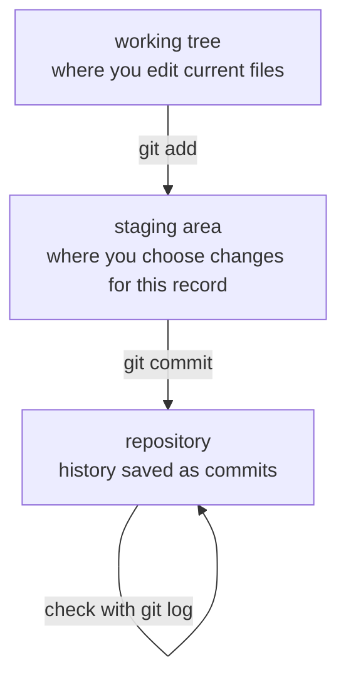

# P2-14.1 Git as a Tool for Managing Change History

> Section ID: `P2-14.1`
> Version: `v2026.07.09`

In Part 2 Chapter 13, we created plots with Matplotlib and linked the output images into documents. A problem appears immediately at that point. If documents, code, images, and research notes all change together, it becomes hard later to remember "what changed, and why."

Git is a tool for recording that kind of change. It is not just a tool for saving code. It is better read as a device for tracking how documents and example code change across a learning process. You need this sense early so that, in Part 3, even in scenes where experiment conditions change often, such as baseline comparisons, preprocessing edits, and metric interpretation, you can still explain again `what was changed, and why`.

This section explains the basic distinctions among `Git`, `version control`, `commit`, `staging area`, and `repository`. If Chapters 11 through 13 were the stage of reading and checking data through arrays, tables, and plots, then the question here changes into how to leave those calculations and checks behind as bundles of changes. Git should not be read as a tool that suddenly appeared out of nowhere. It should be read as the record tool that lets you explain again the baseline comparisons, preprocessing edits, and metric interpretations in Part 3. When the later section continues into branches and deployment, also keep the [Concept Glossary](../../../reference/concept-glossary.md) as a reference point.

## Scope of This Section

This section does not cover Git's deep internal structure. Branches, remote repositories, merge conflicts, and static-site deployment are handled in P2-14.2.

This section answers the following questions.

- Why is version control needed?
- How is Git different from file saving?
- What does it mean to check changes and group them into a record?
- What roles do `status`, `add`, `commit`, and `log` each play?
- Why should Git be read as a learning-record tool in a project that handles documents and example code together?

## Goals of This Section

- You can explain version control as "a record that lets you find a specific past state again after time has passed."
- You can understand a Git commit not as file saving but as a meaningful bundle of changes.
- You can explain intuitively the difference among the working tree, staging area, and repository.
- You can distinguish the roles of `git status`, `git add`, `git commit`, and `git log`.
- You can explain why learning documents and example code should be managed with Git.

## Three Criteria

| Criterion | Why It Matters | Required Understanding in This Section |
| --- | --- | --- |
| What does Git leave behind? | It helps you distinguish file saving from recording change history. | Understand it as a tool that records change history and explanation, not just files themselves. |
| Why are `add` and `commit` separated? | It clarifies the difference between selecting changes and finalizing a record. | Understand that choosing what to group and naming that group are different acts. |
| Why does it matter even for document work? | It helps you read outputs other than code as part of the same change unit. | Understand that it becomes easier to look back and explain when, what, and why something changed. |

| Term | Meaning to Hold First in This Section |
| --- | --- |
| Git | A version-control tool that records change history and explanation rather than just files. |
| version control | A recording method that lets you find again which file states changed over time and why. |
| commit | A record unit that leaves a meaningful bundle of changes in repository history. |
| staging area | The intermediate space where you choose which changes go into this commit. |
| repository | The Git record space where commit history accumulates. |

## Saving a File and Leaving Change History Are Different

If you save a file, the current state remains. But it does not automatically explain why the previous state changed, or which files changed together.

For example, suppose you did the following work.

- Wrote the draft of one section.
- Added a script that generates plots.
- Created two output images.
- Edited the site table-of-contents settings.

These four things may look like separate tasks, but in practice they can form one meaningful bundle of change: "reflect the plot explanation of one section together with its linked assets."

Git records this kind of bundle as a commit.

## Version Control Is Closer to Explaining Than to Going Back

When people first learn Git, they often understand it as "a tool that lets me go back if I make a mistake." That explanation is also correct. But here we take a slightly wider view.

Version control is a device for answering the following questions after time has passed.

- Which files changed?
- Why did they change?
- Which files changed together?
- When did a certain explanation enter the project?
- If a problem appeared, after which change did it appear?

The official Git book explains version control as a system that records file changes over time and lets you bring back specific versions later. Here, we apply that view to document writing and learning records.

## The Basic Flow of Git

Here, we divide the Git flow into the following three spaces.



The important point in this flow is that `saving` and `committing` are different.

Saving a file means writing the current file contents to disk in the editor. Committing means recording, in repository history, a meaningful bundle chosen from those saved changes.

## `git status` Asks About the Current State

The command you usually check first when doing Git work is `git status`.

```bash
git status
```

This command answers the following questions.

- Which files were modified?
- Is there any new file?
- Is there any file already chosen for this commit?
- What is the current branch?

Here, understand `git status` as "the command that asks what state the current workspace is in."

## `git add` Is the Act of Choosing Files

`git add` does not mean that the file is immediately and permanently saved. It means placing the changes that should be included in this commit into the staging area.

```bash
git add docs/chapter-14/section-01.md
```

The key point is, "choose which changes go into this record." Even if many files changed, you do not need to put them all into one commit. If the purposes differ, it is easier to read later if you commit them separately.

For example, the following two tasks should be recorded separately whenever possible.

| Change | Why the Commit Should Be Separate |
| --- | --- |
| Writing Chapter 14 manuscript | The purpose is adding book content |
| Editing CSS layout | The purpose is improving screen presentation |

If both changes go into one commit, it becomes harder later to trace "why was this CSS changed?"

## `git commit` Means Naming a Bundle of Changes

`git commit` leaves the staged changes in repository history.

```bash
git commit -m "docs(part2): add git version control introduction"
```

A commit message is not just a memo. It is the title that tells a later reader of the history "what this change is."

A good commit message usually satisfies the following conditions.

- It lets you tell what changed.
- It avoids expressions that are too broad.
- It shows the purpose of the change rather than just listing a file name.
- It still makes sense later when read in `git log`.

A bad example is the following.

```bash
git commit -m "update"
```

This message does not tell you what was updated.

## `git log` Is the Command That Reads Change History

Once commits accumulate, you can check the history with `git log`.

```bash
git log --oneline
```

This command shows the commit list briefly. Here, understand it as "the list that shows in what order this project changed."

In a learning-document project, `git log` helps with the following questions.

- When was this section added?
- In which commit was the table of contents changed?
- With which manuscript was a certain image file added?
- What changes entered before deployment?

## Why Git Matters in a Document Project

A document project is not just a finished document. It is the result of a learning process. The manuscript, research notes, example code, images, and deployment settings all change together. In particular, from Part 3 onward, even with the same data, preprocessing, baselines, thresholds, and evaluation tables begin to change together. In that sense, Git is closer to an `experiment comparison record` than to a `cabinet for storing final answers`.

Git lets you leave behind the following relationships.

| Output | Question You Can Leave with Git |
| --- | --- |
| manuscript Markdown | When was a certain explanation added? |
| research notes | What sources were used as grounds? |
| example code | Which output image did it create? |
| image file | Which code or section is it connected to? |
| site navigation settings | Which document entered the published table of contents? |

From this perspective, Git is not a tool only for developers. As documents grow, evidence increases, and practice code accumulates, Git becomes the tool that manages `the history of learning changes`.

## The Minimum Habits to Use with Git

You do not need to know every Git command from the beginning. In a project that handles documents and practice examples together, even the following habits help a lot.

1. Check the state with `git status` before and after work.
2. Put into one commit only changes that share one purpose.
3. Write the purpose of the change in the commit message.
4. Check the relationship between generated files and source files together.
5. Separate work that changes deployment settings from work that writes the manuscript.

These habits are needed again in P2-14.2 when you study the flow of branches, authoring branches, and deployment branches.

## Case Study

### Case 1. How Should You Explain the Day When the Manuscript and Images Changed Together?

Suppose a document writer edited the manuscript of one section, changed the example code together with it, and also changed the plot images recreated from that code. In the person's head, this is still `the same task`, but after several days it can become blurry why those files changed together.

At that point, Git works not as a simple storage box but as `a record that groups reasons for change`. If the manuscript Markdown, image-generation code, output images, and table-of-contents edits all belong to one purpose, `strengthening the plot explanation`, then that purpose can be left behind together with a commit message.

This case also shows why `git add` and `git commit` are separated. First you choose the changes that belong in this record. Then you give that bundle a name and leave it in history. Only then can you explain later `what changed, and why`.

In other words, what matters in Git basics is not memorizing many commands. It is developing the sense of grouping changes into meaningful units of explanation. Only with that sense does the history stay readable in a project where documents, code, and images move together.

## Perspective to Remember from This Section

- Git is not a file-saving tool but a change-history management tool.
- A commit is a meaningful bundle of changes.
- `git status` checks the current state, and `git add` chooses the changes that go into this record.
- `git commit` leaves the chosen changes in history, and `git log` lets you read that history.
- In a learning-document project, Git lets you track the connection among manuscripts, code, images, and research notes.

## Short Check

- Can you explain the difference between saving a file and making a Git commit?
- Can you distinguish the working tree, staging area, and repository?
- Can you state the roles of `git status`, `git add`, `git commit`, and `git log`?
- Can you explain why one commit should carry one purpose?
- Can you explain why Git is needed as a learning-record management tool in a document project?

## When Should You Recall This Perspective First?

- Recall the Git perspective first when you need to explain why saving a file and leaving work history are different.
- Return to the change-history sense in this section when you need to judge what changed, why it changed, and in what unit it should be grouped into a record.
- Check this section again when you want to leave a reproducible record in a learning project that handles documents, code, and plots together.

## Sources and References

- Scott Chacon and Ben Straub, `Pro Git 2nd Edition: About Version Control`, Git documentation, checked on 2026-06-25. [https://git-scm.com/book/en/v2/Getting-Started-About-Version-Control](https://git-scm.com/book/en/v2/Getting-Started-About-Version-Control){: target="_blank" rel="noopener noreferrer" }
- Git project, `git-status Documentation`, checked on 2026-06-25. [https://git-scm.com/docs/git-status](https://git-scm.com/docs/git-status){: target="_blank" rel="noopener noreferrer" }
- Git project, `git-commit Documentation`, checked on 2026-06-25. [https://git-scm.com/docs/git-commit](https://git-scm.com/docs/git-commit){: target="_blank" rel="noopener noreferrer" }
