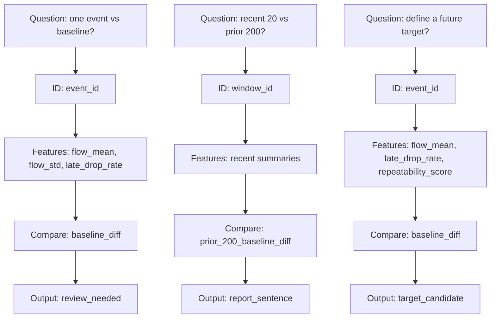

# P3-3.3 Which Columns Should Be Sketched First to Move a Question into the First Table Draft

> Section ID: `P3-3.3`
> Version: `v2026.07.10`

After receiving a question, what is immediately needed is not to write the finished table all at once, but to separate first, in the first table draft, which columns identify the sample and which columns play the roles of state, comparison, and result. When the question sentence changes, the column structure of the draft table also changes with it, so if stored records are to be moved into problem-representation structure, this first sketch has to be clear. What matters in the first table draft is not a complete column list, but this division of roles.

When drawing the first table draft, it is safer not to try to write every column. Instead, write down the following four groups first.

1. columns that identify the sample
2. candidate feature columns that describe the sample
3. baseline or difference columns needed for comparison
4. result columns that a person reads or that may later become the outcome to predict

Condensed into a table, those four groups are the following.

| Column group | Why it is needed first |
| --- | --- |
| Sample-identification columns | Because the table has to reveal what counts as one case |
| Candidate feature columns | Because values are needed to describe the state of the sample |
| Comparison columns | Because a difference structure is needed for change relative to the usual state to become visible |
| Result columns | Because the direction has to be visible: review candidate or target-label candidate |

So the first table draft is not `copying over every source column`, but `placing the column groups by role that this problem needs first`.

## The minimum transformation from question to table draft

For example, if the question is `has one recent action been shakier than usual?`, then the table draft can immediately be sketched as follows.

| Column role | Draft example |
| --- | --- |
| Sample-identification columns | `event_id` |
| Candidate feature columns | `flow_mean`, `flow_std`, `late_drop_rate` |
| Comparison columns | `baseline_diff`, `repeatability_score` |
| Result columns | `review_needed` or `report_sentence` |

When the question changes, the draft changes with it.

| Question sentence | What changes first in the draft |
| --- | --- |
| Has one recent action been shakier than usual? | the sample is fixed as `one action` |
| Have the most recent 20 cases changed relative to the prior 200? | `segment aggregate` and comparison columns come to the front before the sample |
| Which action should a person inspect first? | result columns shift toward `priority_score` and `review_needed` |
| Can a candidate future result be created? | the result column becomes more clearly a `target` candidate |

In other words, the question does not end as a sentence. It immediately pushes the column structure of the table.

## Perfect column names are not necessary from the start

The reason people often stop here is the thought, `if I do not know the exact column names yet, how can I draw the table?` But at the Part 3 stage, the column names do not need to be fixed perfectly. Roles can be written down first.

For example, the following is already enough.

- one sample-identification column
- one or two features that show level
- one or two features that show change or instability
- one difference column relative to the baseline
- one result column for human review

Even just this much already gives the outline of what table structure the question requires.

## A Small Diagram

Problem situation: confirm that when the question changes, the column groups of the first table draft also change with it.

Input: three different questions

Expected output: for each question, the draft columns for `identification`, `feature`, `comparison`, and `result` are sketched differently

Concept to check: the first table draft is not a finished list of column names, but the stage where the role-based column groups required by the question are made visible first

The key in this example is not the list of column names, but seeing `which column group changes first when the question changes`. In comparing one action, `event_id` and `review_needed` appear first. In comparing the recent 20 cases, `window_id` and `report_sentence` are more natural. By contrast, once later learning candidates are being considered, the result column changes into `target_candidate`. So the first table draft is not the process of completing the correct table all at once. It is a sketch that first reveals the sample unit and result direction required by the question.

Once the question has first been moved into role-based column groups, later sections about sample units and summary tables can also be read with `what counts as one case` and `which values play the role of comparison and result` already visible. In other words, the core of this section is to convert the question sentence directly into the role units of the table structure, so that the first table draft becomes not an abstract memo, but the design starting point of a real working table. If this section is reread as the problem of how to write `first-table specification` in role units, it becomes clearer that the first table draft is not a finished column dictionary, but the stage where the role-based column groups required by the question are specified first.

## Sources and Further Reading

- Google for Developers, `Machine Learning Glossary`: `labeled example`. Because an example presupposes feature and label structure, it provides a basis for the claim that even in the first table draft, the roles of identification, description, and result should already be separated. [https://developers.google.com/machine-learning/glossary](https://developers.google.com/machine-learning/glossary){: target="_blank" rel="noopener noreferrer" } / Accessed: 2026-07-08
- Google for Developers, `Machine Learning Glossary`: `label leakage`. Because it explains a design flaw where a feature becomes a proxy for the label, it strengthens the point that the role of result columns and descriptive columns should be separated already at the draft stage. [https://developers.google.com/machine-learning/glossary](https://developers.google.com/machine-learning/glossary){: target="_blank" rel="noopener noreferrer" } / Accessed: 2026-07-08
- U.S. Bureau of Labor Statistics, `Base period`. Because it explains that a base period is a reference used to compare with another time period, it provides a general basis for why a draft should include separate comparison-role columns such as baseline differences. [https://www.bls.gov/bls/glossary.htm](https://www.bls.gov/bls/glossary.htm){: target="_blank" rel="noopener noreferrer" } / Accessed: 2026-07-08
