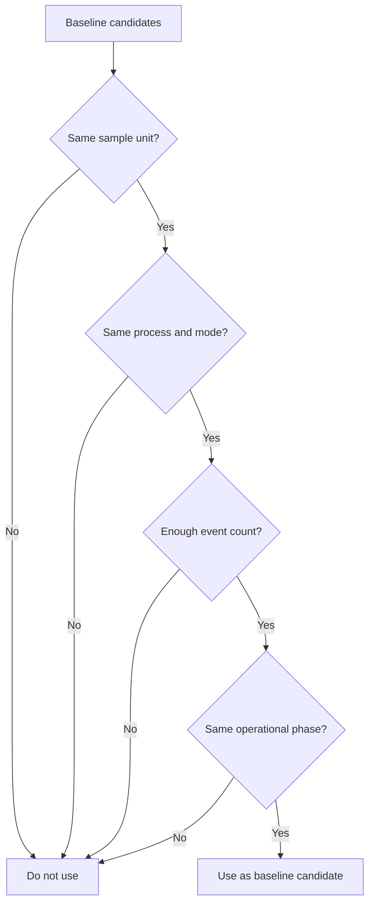

# P3-7.4 By What Range and Conditions Should We Set the Baseline

> Section ID: `P3-7.4`
> Version: `v2026.07.10`

Once we understand that a baseline is needed, the next question immediately follows. `Then what exactly should count as usual?` This is where readers easily get stuck again. If we gather past ranges at random for comparison with the recent range, a comparison table may still be produced, but the interpretation will shake easily. So it is better to hold on first to the order: `write the comparison question first`, `leave only the candidates that fit that question`, and `among the remaining candidates, choose the bundle that matches the current sample most closely in condition`.

A baseline should be not `just any bundle of past data`, but `a comparison range produced under the same kind of conditions as the sample we are looking at now`. If the action type is not the same, the operating mode is not the same, the range length is not the same, or at least the operational conditions are not similar, then even if a difference value appears, it becomes hard to say what that difference means.

| Poorly chosen baseline | Why it becomes a problem |
| --- | --- |
| A past average mixed across different process types | A difference between originally different structures gets read as change |
| A usual value built from only the most recent 3 cases | The baseline itself shakes too easily |
| A baseline that groups together cases with very different action lengths | Even the same feature column now has a different interpretation basis |
| A baseline that mixes before-maintenance and just-after-maintenance states | Operational-state change and structural change become mixed together |

So a baseline is not simply `an old average`. A baseline is the comparison counterpart that decides against what the current sample should be read. That is why matching the conditions that make the current sample comparable comes first.

## A Generalized Order for Setting the Baseline

If we shorten the order just mentioned into a table, it becomes like this.

| Step | What should be decided first | The error this step is trying to avoid |
| --- | --- | --- |
| Decide the comparison question | Against what past state should the current state be compared? | The error of choosing an average before a question exists |
| Leave only comparable candidates | Are they the same sample unit, the same condition, the same operational stage? | The error of reading between-group differences as change |
| Choose the closest candidate | Among the remaining candidates, which bundle is most like the current sample? | The error of leaving good candidates but still falling back to a convenient broad average |

These three steps do not need strong methodology names. The key point is that `the baseline is also part of comparison design`. Only when the comparison question comes first can we choose a reference range. Only when comparable candidates remain can we decide against what the current sample should be read.

## Conditions That Should Be Matched First

When building a baseline, it is safer to check the four conditions below first.

1. Is it the same sample unit?
2. Is it the same process type or operating mode?
3. Is there enough sample count for comparison?
4. Is it from before any major operational-state change?

If we reduce these four into a table, it becomes like this.

| Condition to match first | Why it is needed |
| --- | --- |
| Sample-unit match | Because if one full action and time-point rows get mixed, the interpretation of the difference value breaks |
| Process/condition match | So that originally different groups are not read as if they were change |
| Enough sample count | So that the baseline itself does not fluctuate too much |
| Operational-state match | So that equipment replacement, policy changes, or before/after maintenance are not carelessly mixed together |

This does not mean we should first learn complicated statistical techniques. At this stage, simply matching `what counts as the same group` already reduces many comparison errors.

NIST's explanation of control charts says that to regard a process as having reached a state of control, the samples should come from `presumably the same essential conditions`. The expressions in this section such as `same sample unit`, `same process/operating condition`, and `same operational state` are a restatement of that wording in the data-comparison context of this book. In other words, the generalization used here goes only as far as `build a comparable reference under the same conditions`.

## The Same Conditions Matter Before the Same Average

A common mistake when choosing a baseline is to group together cases that simply look similar in average. But even if the averages look similar, that does not mean they belong to the same comparison group. If the process type differs, the action length differs, or the operating mode differs, then the same average can still mean a completely different structure.

| The sample currently being examined | A baseline candidate that is closer | A less appropriate candidate |
| --- | --- | --- |
| A `type-A` one-action summary table | A bundle of past `type-A` action summary tables | An overall average mixing `type-B` and `type-C` |
| A recent-20-case aggregate table | A past aggregate table of roughly 20 cases under the same condition | A tiny bundle of only 3 cases |
| An action after maintenance | A stable range after maintenance | A long-term average from before maintenance |

The key point of this table is not `do the numbers look similar?` but `are the comparison conditions the same?` In the end, choosing a baseline is not the act of collecting cases with similar averages. It is the act of leaving a reference group that can answer the same question as the current sample.

## Looking Through a Small Diagram

This diagram shows that baseline selection is not the act of picking one average value. It is a judgment that filters comparison conditions step by step. In other words, it is less about printing a candidate table and more about holding on to the selection structure that checks in sequence `same sample unit`, `same process condition`, `enough sample count`, and `same operational state`.

So this section is more accurately read not as a list of field rules, but as the problem of `selecting a comparable reference group`. Choosing a baseline is not `picking one past average`, but a process of narrowing down by condition to a reference group that is comparable with the current sample.

## Sources and Further Reading

- NIST/SEMATECH e-Handbook of Statistical Methods, `What are Variables Control Charts?`. Because it explains that samples obtained under the same essential conditions are needed, it reinforces the standard in this section that only baseline candidates with the same sample unit and operating conditions should remain. [https://www.itl.nist.gov/div898/handbook/pmc/section3/pmc32.htm](https://www.itl.nist.gov/div898/handbook/pmc/section3/pmc32.htm){: target="_blank" rel="noopener noreferrer" } / Accessed: 2026-07-08
- U.S. Bureau of Labor Statistics, `Base period`. Because it provides the general definition of a reference period used for comparison, it supports the explanation that baseline candidates should also be chosen not as just any past range, but as a comparable reference period. [https://www.bls.gov/bls/glossary.htm](https://www.bls.gov/bls/glossary.htm){: target="_blank" rel="noopener noreferrer" } / Accessed: 2026-07-08
