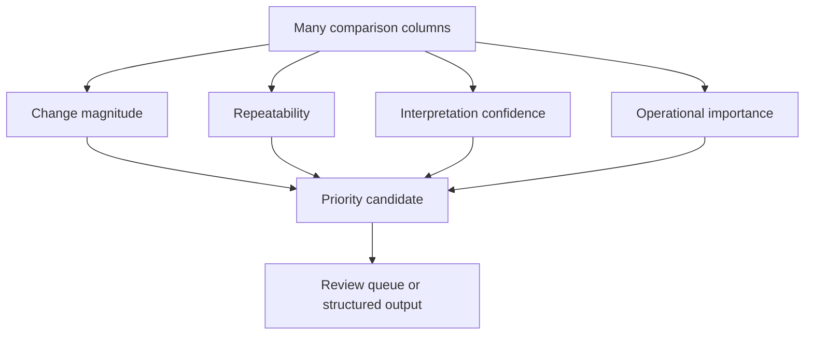

# P3-8.5 How Are Multiple Comparison Columns Grouped into One Review-Priority Candidate

> Section ID: `P3-8.5`
> Version: `v2026.07.10`

Once one table contains mean difference, variability difference, repeatability, recent-window count, and a pattern summary together, a direct question appears. `If there are many columns, what should be read first, and how should they be reduced to one line of judgment?` As the number of comparison columns grows, what is needed is not more numbers but a way to regroup different signals into a few judgment axes.

Review priority is not determined by taking one difference value as it is. It is decided after first grouping multiple comparison columns into a few judgment axes such as `change magnitude`, `repeatability`, `interpretation confidence`, and `operational importance`.

## Why You Should Not Jump Straight to One Number

Comparison tables often contain columns like these.

| Example comparison column | Meaning visible at first glance |
| --- | --- |
| `diff_mean` | Difference in average level |
| `diff_std` | Difference in amount of fluctuation |
| `repeatability_score` | Degree to which the same-direction change repeats |
| `recent_count` | Sample size in the recent window |
| `segment_shift` | Difference in summarized pattern |

It is fast to combine these columns directly into one number. But that approach easily erases the explanation of why one case rose to the top and another moved down. In Part 3, a step is therefore needed first to regroup the columns by `what kind of signal is this`.

## The Four Judgment Axes to Group First

Multiple comparison columns can first be reduced into the following four axes.

| Judgment axis | Main columns used | If turned into a question |
| --- | --- | --- |
| Change magnitude | Mean difference, ratio difference, window difference | How different is it from the usual state right now? |
| Repeatability | Repeated direction, repeated signals across windows | Is this change continuing rather than happening once? |
| Interpretation confidence | Recent count, baseline sample size | With what strength can this difference be stated? |
| Operational importance | Specific process condition, near-end window, safety-related columns | Is there an operational reason to let a person look first? |

Seen through these four axes, the feeling that `there are too many columns, so it is complicated` becomes smaller. You can see that each column answers a different question.

## Even the Same Difference Value Can Lead to Different Priority

Suppose two cases share the same mean difference value of `-0.35`. Even then, review priority can differ if the conditions below are different.

| Case | Change magnitude | Repeatability | Interpretation confidence | Operational importance |
| --- | --- | --- | --- | --- |
| A | High | High | High | High |
| B | High | Low | Low | Medium |

So if you look only at `diff`, both cases appear similar. In practice, however, A may need review earlier than B. Review priority asks not only `how different is it` but also `how much can that difference be trusted` and `does practice require this to be seen first`.

## How Human Review Sentences Connect to Priority Candidates

In the previous section, conservative sentences were written in the order `comparison result -> strength condition -> next action`. If you compress that sentence again, it can move into priority-candidate axes like this.

| What was said at the sentence stage | Meaning when moved into a priority candidate |
| --- | --- |
| The difference from the baseline is large | High change magnitude |
| It repeats across several recent windows | High repeatability |
| The recent count is sufficient | High interpretation confidence |
| It belongs to a process condition a person should inspect first | High operational importance |

So a priority candidate does not discard the explanation. It is the result of compressing the sentence again into `judgment axes`.

## Looking at the Comparison Table First

| event_id | diff_mean | repeatability_score | recent_count | safety_related |
| --- | ---: | ---: | ---: | --- |
| A | -0.35 | 4 | 20 | yes |
| B | -0.35 | 1 | 3 | no |
| C | -0.18 | 4 | 18 | yes |

Before turning this table directly into a `priority_score`, you can first group and read it like this.

| event_id | Change magnitude | Repeatability | Interpretation confidence | Operational importance |
| --- | --- | --- | --- | --- |
| A | High | High | High | High |
| B | High | Low | Low | Low |
| C | Medium | High | High | High |

Only at that point does it become explainable why A comes first and why B can move one level down even though its difference value is large.

## A Small Diagram

This diagram shows that the columns should not be collapsed straight into one score. They first need to be regrouped by `what judgment axis is this`. What should be seen first here is not the complexity that `there are many columns`, but the structure that `different questions are grouped into a few judgment axes`. Review priority is a candidate judgment created by grouping change magnitude, repeatability, interpretation confidence, and operational importance together, not by reading one difference value in isolation. The core of this section is therefore not `how should one implement a single-line score`, but `into what bundles of questions are multiple comparison columns compressed first`.

## Sources and References

- Google for Developers, `Thresholds and the confusion matrix`. It explains that a score does not become action immediately, but is interpreted through thresholds and cost structure, which supports this section's explanation that multiple comparison columns should first be grouped into judgment axes rather than merged at once into a single number. [https://developers.google.com/machine-learning/crash-course/classification/thresholding](https://developers.google.com/machine-learning/crash-course/classification/thresholding){: target="_blank" rel="noopener noreferrer" } / Accessed: 2026-07-08
- Google for Developers, `Classification: ROC and AUC`. It shows that one of the main uses of model scores is ranking, which supports this section's generalized view that review-priority candidates are built by compressing signals into axes such as change magnitude, repeatability, interpretation confidence, and operational importance. [https://developers.google.com/machine-learning/crash-course/classification/roc-and-auc](https://developers.google.com/machine-learning/crash-course/classification/roc-and-auc){: target="_blank" rel="noopener noreferrer" } / Accessed: 2026-07-08
