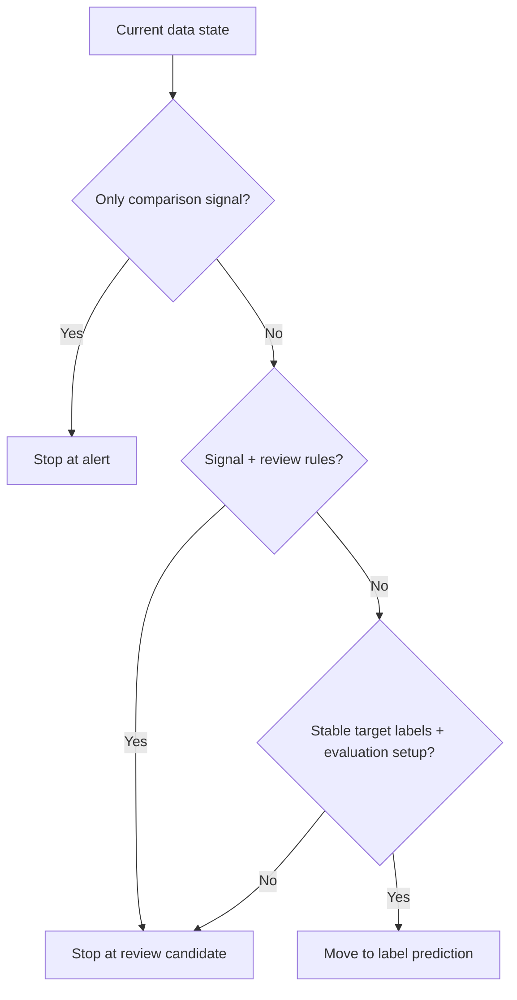

# P3-9.1 How Far Should the Current Problem Be Raised

> Section ID: `P3-9.1`
> Version: `v2026.07.10`

When looking at real data, the first reaction is often `we have sensor logs and at least some outcomes, so shouldn't we raise this straight to a classification problem?` But in operational data, that move is often too fast. Some problems can truly become prediction problems, but others are more honestly left as `problems of choosing review candidates well`, and that also fits the current data state better. Once interpretation boundaries are set, the next step is to decide how far the current problem should be raised among alert, review candidate, and label prediction.

The first judgment to hold is `how far does the current data honestly support`. An alert can begin with comparison structure and difference values alone. A review candidate needs additional operational-priority criteria. Label prediction requires a relatively stable target label and an evaluation setup as well.

| Category | Meaning at this stage | Required evidence level |
| --- | --- | --- |
| Alert | A notice that something different from the usual state appears and should be seen first | Comparison structure and difference value |
| Review candidate | A case that is worth human rechecking in practice | Change signal + operational context + priority judgment |
| Label prediction | A problem of matching an already defined target label | Relatively stable labels and a learning structure |

An alert is the lightest. If a difference from the baseline is visible, it can be made. A review candidate is one step heavier. A change must be visible, and it must also be worth human rechecking. Label prediction is the heaviest. The target label must be clear, the label must attach relatively stably, and the learning and evaluation structure must be ready.

You should not read this difference only as `is the problem simple or complex`. The more important question is `what can be said honestly in the current data state`. Alerts can begin from comparison structure alone, but label prediction needs much stronger commitments. Raising a problem upward is therefore not automatically better. It means changing it into a problem that demands stronger evidence.

The last stage is often the hardest in real problems. For example, an operational judgment such as `review needed` may be possible, while confirmed labels such as `actual internal cause` or `failure type` may still be weak. One symptom can arise from many causes, and sometimes a person records the cause only later. If you force such a situation into a classification problem, you end up building a complicated problem frame before label quality is ready.

At this stage, the following three questions should be checked immediately.

- Is what you need right now automatic diagnosis, or review prioritization?
- Are labels actually sufficient?
- Is a comparison report more realistic than a classification problem?

Written more operationally, the difference looks like this.

| Stage | Example input | Example output | What must exist first | What should not be raised yet if missing |
| --- | --- | --- | --- | --- |
| Alert | Difference between recent window and baseline | `caution` | Comparison structure and difference value | Cause label |
| Review candidate | Difference value + repeatability + operating conditions | `look first` | Alert + repeatability + operational priority criteria | Stable target label |
| Label prediction | Feature table by operating unit | `normal/abnormal` or a specific state | Relatively stable target label and evaluation setup | Building a complex classification problem before labels are sufficient |

So you do not move to a higher learning problem simply because `you want to raise it`. You move upward only when enough evidence has accumulated at the lower stage.

If you judge `where to stop right now` like the table below, forced problem escalation decreases.

| Current confirmed state | Output at this stage | Stage not yet raised |
| --- | --- | --- |
| Only the difference from baseline is stable | Alert | Review candidate, label prediction |
| Difference plus repeatability and operational-priority rules exist | Review candidate | Label prediction |
| Target labels are relatively stable and an evaluation setup exists | Label prediction | None |

In real operational flow, this usually becomes the following order.

1. Compare the recent window with the baseline and create an alert signal.
2. Add repeatability, sample size, and operational context to choose review candidates.
3. If relatively stable operational labels accumulate through that process, consider a prediction problem.

Prediction is therefore not the starting point. It becomes worth considering only after the evidence and structure from earlier stages are sufficiently organized. For some operational problems, it can remain more honest to leave them as a comparison report and a review queue all the way through. There is no need to force a judgment that is already well supported by comparison structure alone upward into a label-prediction problem.

## A Small Diagram

This diagram shows that the judgment of raising a problem upward is not `always move one stage higher`, but a branch that asks what level of evidence currently exists. It is not about listing label names, but about separating, step by step, whether to stop at `alert`, whether to go to `review candidate`, or whether to raise it to `label prediction`. The key is that `an alert is a change signal, a review candidate is operational prioritization, and label prediction is a stronger problem setup than both`. How far the current problem should be raised must be judged not by `is it more advanced`, but by `how far does the current data honestly support`.

## Sources and References

- U.S. Bureau of Labor Statistics (BLS), *BLS Handbook of Methods: Glossary*, baseline. [https://www.bls.gov/bls/glossary.htm](https://www.bls.gov/bls/glossary.htm){: target="_blank" rel="noopener noreferrer" }
- National Cancer Institute (NCI), *NCI Dictionary of Cancer Terms: baseline*, baseline. [https://www.cancer.gov/publications/dictionaries/cancer-terms/def/baseline](https://www.cancer.gov/publications/dictionaries/cancer-terms/def/baseline){: target="_blank" rel="noopener noreferrer" }
- Google, *Machine Learning Glossary*, `label`, `labeled example`, `proxy labels`, accessed 2026-07-08. [https://developers.google.com/machine-learning/glossary](https://developers.google.com/machine-learning/glossary){: target="_blank" rel="noopener noreferrer" }
- NIST/SEMATECH, *e-Handbook of Statistical Methods: What are Control Charts?*, signal detection and process monitoring. [https://www.itl.nist.gov/div898/handbook/pmc/section3/pmc32.htm](https://www.itl.nist.gov/div898/handbook/pmc/section3/pmc32.htm){: target="_blank" rel="noopener noreferrer" }

