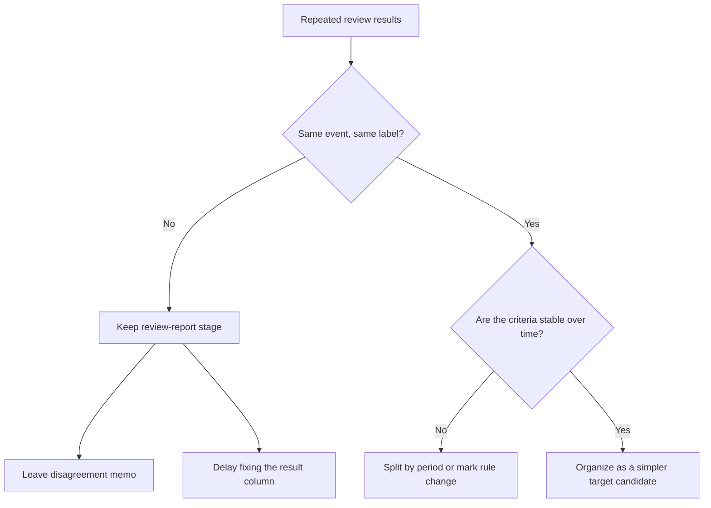

# P3-9.6 What Should Be Done If the Same Event Receives Different Labels by Person or Time

> Section ID: `P3-9.6`
> Version: `v2026.07.11`

Just because a label-candidate column exists does not mean you can immediately call it a stable learning problem. In real data, two reviewers can describe the same event differently, and something treated as `caution` last month can be recorded as `normal` this month. So when reading a [target candidate](../../../reference/concept-glossary.md#glossary-target-candidate), you need to check not only `does a column exist`, but also `does the same meaning repeat for the same event and similar conditions`.

## Why Should Label Consistency Be Checked Together

This question is needed to judge whether the current label candidate can be placed directly as a target label. Even if the sample boundary and result column are already set, it is hard to read it as a stable learning problem when the meaning of the judgment does not repeat.

| Structure already set | Why it still needs to be checked here |
| --- | --- |
| Sample unit | Because labels can still fluctuate even under the same sample rule |
| Target-candidate column | Because even if the column exists, it is hard to use it directly when the attachment rule differs by person |
| Comparison report and review queue | Because judgment consistency also needs to be checked when the review process accumulates into label candidates |

So what should be checked here is not `does a label-candidate column exist`, but `does that candidate really repeat with the same meaning`.

## Why Can Different Labels Attach to the Same Event

The reasons label candidates wobble usually gather into the following few categories.

| Reason for wobbling | What actually happens |
| --- | --- |
| Reviewers use different criteria | One person sees the same pattern as `review_needed`, another as `normal` |
| Operating criteria change over time | A pattern once treated as a warning is now treated as normal under a new policy |
| Basis sentences are weak | It becomes hard to match judgments again later because the reason was not left clearly |
| There are many boundary cases | Cases very close to the baseline are easier to label differently by person |

So the problem with a label candidate is not only `wrong/right`, but also `is the same rule repeating`.

## Looking at the Comparison Table First

| event_id | diff | repeatability | reviewer | review_label |
| --- | ---: | --- | --- | --- |
| A | -0.34 | high | kim | review_needed |
| A | -0.34 | high | lee | normal |
| B | -0.08 | low | kim | normal |
| B | -0.08 | low | lee | normal |
| C | -0.29 | medium | kim | review_needed |
| C | -0.29 | medium | lee | review_needed |

In this table, `A` is the same event, but `kim` wrote `review_needed` while `lee` wrote `normal`. `B` and `C` agree. Seeing this, people are often tempted to think, `there is still a label column, so we can immediately raise it to a learning problem`. In practice, however, the first thing to ask is how many events like `A` exist.

What matters is not that a label-candidate column exists, but `how often the same judgment repeats under the same condition`.

## What Is Worth Writing Down First at This Stage

At this stage, it is enough to leave the following notes before using more complex statistical indicators.

| Note to write first | Why it is needed |
| --- | --- |
| Are there labels that frequently diverge in repeated reviews of the same event? | To see the low-consistency region first |
| Is there a point where the rule changed? | To leave the possibility that label meaning changed by period |
| Should the current label candidate be used directly as the target, or should more weight remain on comparison reports? | To leave a reason for postponing the current problem-type decision |

These notes are not a perfect quality certificate. They are the act of leaving in the current judgment record, without hiding it, the fact that `labels can wobble`.

## When Should It Be Viewed as Hard to Raise Directly to a Target

If scenes like the following repeat, it is safer to refine the target candidate one more step before using it directly as the result column.

| Visible signal | More natural next action |
| --- | --- |
| Reviewer-specific labels for the same event often differ | Keep the comparison report and review queue longer |
| Label criteria change suddenly after a certain date | Read by period or leave a rule-change note |
| Free-form notes exist, but common judgment columns are weak | First strengthen the rule for organizing review notes |
| Boundary cases diverge often | Keep `review needed` as the target before `confirmed label` |

So instead of forcing unstable cause classification straight into a prediction problem, it fits the current problem-type decision better to take simpler and more repeatable judgment columns as target candidates first.

Leaving these notes makes it possible to check not only `is there a column`, but also `does that column repeat with the same meaning`. At the current stage, therefore, the more important judgment is not raising the problem type more heavily, but not leaving a label candidate whose meaning still wobbles as it is.

## A Small Diagram



## A Small Python Example

Problem situation: when two reviewers label the same event differently, having a label-candidate column still does not immediately make it easy to read as a stable target label.

Input: a repeated-review table made of `event_id`, `reviewer`, and `review_label`

Expected output: a side-by-side display of the review count by event, the number of label types, and the actual list of disagreement events

Concept to check: what matters more than the existence of a candidate column is whether the same meaning repeats for the same event and similar conditions

```python
import pandas as pd

reviews = pd.DataFrame(
    [
        {"event_id": "A", "reviewer": "kim", "review_label": "review_needed"},
        {"event_id": "A", "reviewer": "lee", "review_label": "normal"},
        {"event_id": "B", "reviewer": "kim", "review_label": "normal"},
        {"event_id": "B", "reviewer": "lee", "review_label": "normal"},
        {"event_id": "C", "reviewer": "kim", "review_label": "review_needed"},
        {"event_id": "C", "reviewer": "lee", "review_label": "review_needed"},
    ]
)

label_variety = reviews.groupby("event_id")["review_label"].nunique()
disagreed_events = label_variety[label_variety > 1]

review_counts = reviews.groupby("event_id").size()

print("1) reviews per event:")
print(review_counts)
print()
print("2) label variety by event:")
print(label_variety)
print()
print("3) events with disagreement:")
print(disagreed_events.index.tolist())
```

Expected output:

```text
1) reviews per event:
event_id
A    2
B    2
C    2
dtype: int64

2) label variety by event:
event_id
A    2
B    1
C    1
Name: review_label, dtype: int64

3) events with disagreement:
['A']
```

The purpose of this example is not to build model inputs, but to check first `how many reviews were performed for the same event, and where did the labels diverge`. When you first look at the review count by event, then count the number of label types, and finally extract only the events with actual disagreement, it becomes clearer why this section asks you to look at `does label meaning repeat` before `is there a label column`. What matters here is not one team's memo habit, but checking `label meaning stability`. When reading a target candidate, you need to ask together whether the current label candidate repeats with relatively the same meaning, whether a point of rule change can be noted, and whether unstable labels are being kept from being used directly as the result column. Only with that check does a target-candidate table become more than a list of columns. It becomes a structure that includes `the stability of label meaning`.

## Sources and References

- Google, *Machine Learning Glossary*, `rater`, `inter-rater agreement`, `label`, accessed 2026-07-08. [https://developers.google.com/machine-learning/glossary](https://developers.google.com/machine-learning/glossary){: target="_blank" rel="noopener noreferrer" }
- W3C, *PROV-Overview: An Overview of the PROV Family of Documents*, provenance and activity context overview. [https://www.w3.org/TR/prov-overview/](https://www.w3.org/TR/prov-overview/){: target="_blank" rel="noopener noreferrer" }
