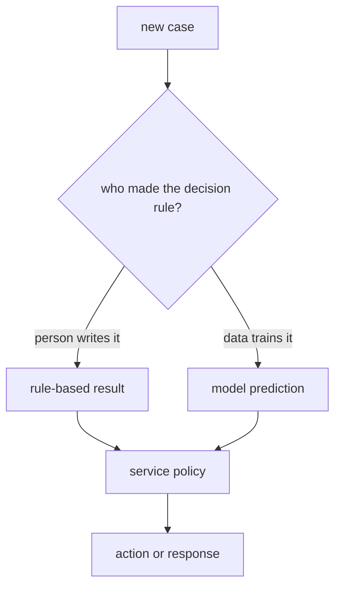
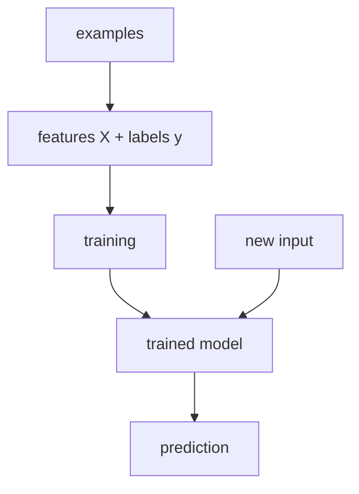
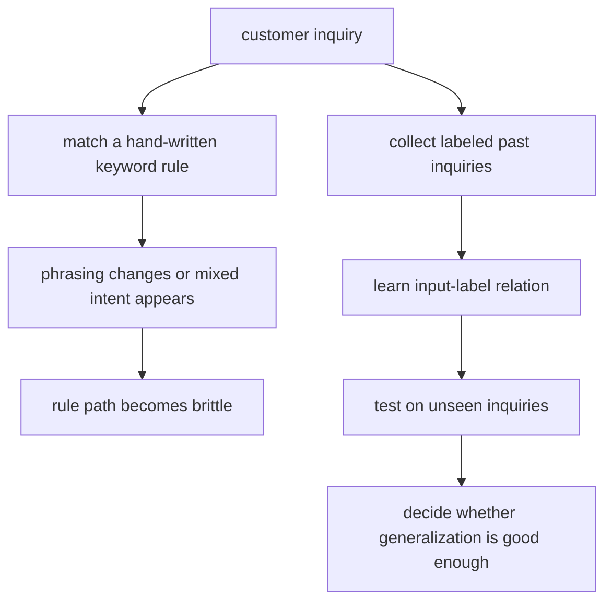

# P4-1.2 What It Means To Learn Rules From Data

> Section ID: `P4-1.2`
> Version: `v2026.07.10`

P4-1.1 distinguished the positions of AI, machine learning, deep learning, generative AI, and LLM. Now we look at machine learning more closely.

Part 3 did not try to cover all of data science. Instead, it focused on `the front-stage design that turns raw data into a problem structure ready for learning and analysis`. That was the stage of deciding what counts as one case, which columns remain as features, what should be a target candidate, and what should be kept separate for identification and interpretation.

One phrase that appears often when people explain machine learning is `it learns rules from data`. That phrase is easy to misunderstand as meaning that the model finds human-readable `if-then` rules directly. Machine learning is an approach that estimates the relation between inputs and outputs from data examples, then applies that relation to new data.

In other words, if Part 3 dealt with `how to build a table that can be learned from`, the early part of Part 4 deals with `what the model actually learns on top of that table`. It is more accurate to interpret the word `rule` as `building criteria for judging the next case after looking at many cases`. This Section explains how the method of writing criteria directly by hand differs from the method of fitting criteria from data cases.

## Scope Of This Section

This Section explains the difference between a rule-based approach and a learning-based approach. The detailed distinction among supervised learning, unsupervised learning, and reinforcement learning appears in the next Chapter.

- What does it mean for a person to write rules?
- What does it mean to learn rules from data?
- Does the model really find rules that people can understand?
- How are training data, features, labels, and models connected?
- Why must a trained model always be evaluated?

## Goals Of This Section

- You can distinguish a rule-based approach from a learning-based approach.
- You can restate `learn rules from data` more safely as `estimate relationships from data`.
- You can describe the flow of training data, features, labels, models, and prediction.
- You can understand that machine learning is not a process of discovering a perfect answer rule, but a process of building a model that meets a performance criterion.
- You can explain that fitting the training data well is different from working well on new data.

## Starting With A Very Small Example

First consider the problem of distinguishing fruits.

| What was observed | Possible judgment |
| --- | --- |
| Round, red, and about palm-sized | It is likely an apple |
| Long, yellow, and with a smooth peel | It is likely a banana |
| Round, orange-colored, and with a thick peel | It is likely an orange |

People can describe such judgments in words. They can also write direct rules such as `if it is yellow and long, it is likely a banana`. But real data are more complex. Some fruits have similar colors, some cases are ambiguous in size, and lighting in a photo can make colors look different.

Machine learning is the method of collecting these cases and fitting the relation between input and output. Here the input is observed values such as color, shape, and size of a fruit, and the output is a label such as apple, banana, or orange. This small example helps you understand machine learning not as `discovering the answer rule`, but as `adjusting judgment criteria from cases`.

## Comparing The Two First

Both rule-based and learning-based approaches take inputs and produce results. The difference is who makes the judgment criteria and in what way.

| Category | Rule-based approach | Learning-based approach |
| --- | --- | --- |
| How the criterion is made | A person writes the judgment criterion directly. | The relation between input and output is estimated from data. |
| Shape of the criterion | It is relatively explicit, like conditions, lists, thresholds, or policy documents. | It differs by model, such as weights, splits, distances, probabilities, or internal representations. |
| Strength | It is easy to explain and easy to control. | It can find patterns in data that people cannot write out completely. |
| Weakness | Rule management becomes difficult as exceptions grow. | It depends heavily on data quality, bias, and evaluation method. |
| Check question | `Can a person understand and modify this rule?` | `Does performance remain stable on unseen data?` |

The important point in this table is not that one of the two is the answer by itself. Real systems often use explicit rules and learned models together. For example, a model can calculate spam probability while the service policy decides block, review, or allow based on that score.

The next diagram shows the difference between the two approaches as a flow. The rule-based approach begins with a person writing the criterion first, while the learning-based approach builds the model from data cases. Both can ultimately lead to a judgment or action in a service.

The important point here is that `model prediction` is not automatically the final action. The model can output a score or a classification result, but the real service can still choose its final action by considering cost, risk, policy, and user experience.

## The Way People Write Rules

In a rule-based approach, a person writes the judgment criteria directly.

You can imagine a simple system that filters spam email.

- If the title contains a certain advertising phrase, mark it as spam.
- If the sender address is on a block list, mark it as spam.
- If the body contains too many suspicious links, mark it as spam.

This method is easy to understand. It is also relatively easy to explain why something was judged as spam. But once exceptions grow, the rules become complex quickly. As new expressions, evasive wording, and boundaries between normal mail and spam get mixed, it becomes difficult for a person to write every case directly.

This does not mean a rule-based approach is bad. It is still useful in real services. But because it is difficult to maintain all judgments only through hand-written rules, an approach that uses repeated patterns in data becomes necessary.

## The Way Of Estimating Relations From Data

In machine learning, instead of a person writing all rules directly, case data are prepared first.

It helps to split those case data into the following three boxes.

| Category | Simple explanation | Example |
| --- | --- | --- |
| Example | One observed target | One email, one customer, one product |
| Feature | An input value that describes the example | Word count, link count, purchase amount, visit count |
| Label | The output the model is trying to match | spam/normal, churn/retain, faulty/normal |

Once these three boxes are visible, the phrase `learn from data` looks less abstract. The model adjusts its internal criteria in the direction of matching the label after looking at the features of examples. Inside the broader flow of data science, machine learning is not a term that replaces collection, cleaning, exploration, and interpretation altogether. It is closer to the stage of building a learning model on top of organized examples, features, and target values like these.

If you recall the table prepared in Part 3, here as well you must separate once more `what should be used directly as learning input` and `what should be separated first`.

| Nature of the column | What is done at this stage | Is it used directly as model input or target? |
| --- | --- | --- |
| Feature column | Organize it as an input describing the case | Usually yes |
| Label or target candidate | Check whether it is a value you want to predict later | Conditionally yes |
| Identifier column | Use it to find and trace the case again | Usually no |
| Operational memo column | Keep context that people will use for interpretation | Usually no |

So machine learning does not begin by feeding the whole table in at once. It begins by separating columns with different roles even inside the same table.

If you use spam classification again, the needed data can look like the following.

| Extracted features from the email body | Label |
| --- | --- |
| ad-word count, link count, sender information, sentence pattern | spam |
| ad-word count, link count, sender information, sentence pattern | normal |

The model learns the relation between features and labels from these data. After that, when a new email arrives, the same style of features is created, and the trained model outputs either a spam probability or a classification result.

At this point, the phrase `learn rules` does not mean building sentence rules that people can read. The internal representation differs by model type. A linear model learns weights, a tree model builds split criteria, k-NN judges by finding nearby cases, and a deep learning model learns more complex representations.

Put more cleanly, if a person writes the rules directly, that is a rule-based approach. If the relation between inputs and outputs is estimated from data, that is a learning-based approach. If the estimated relation is applied to new data, that is model inference or prediction.

## The Three Steps In `Learning From Data`

The phrase `learn from data` is not a magical action that happens all at once. The process divides into the following three steps.

1. Represent it.
   Turn real cases into inputs a model can handle. An email body can become features such as word count, link count, and sender information.

2. Fit it.
   The model adjusts internal values so that it matches the relation between the inputs and the target values on the training data. This is training.

3. Check it.
   Check performance on data that were not used for training. Without this step, it is hard to distinguish whether the model learned the relation or merely memorized the training data.

These three steps repeat throughout Part 4. If the representation changes, the kind of problem visible to the model changes. If the learning criterion changes, the direction in which the model improves changes. If the evaluation data are weak, actual performance can be misjudged.

Here it is important to read the first step, `represent it`, as directly connected to Part 3. The questions, samples, table structure, features, baselines, and output-structure design from Part 3 are exactly the earlier part of this representation stage. Only after that preparation is done can machine learning decide relatively stably `what will be used as input X` and `what will be used as target y`.

These three steps can be bundled again as `decide what to put in, fit the relation, then check again on cases the model has never seen before`. Once that sentence is in place, `fit`, `predict`, and `evaluation` are no longer just API names but a work order.

In real work, you often have to judge first whether `writing more human rules is the right direction` or `it is time to move to a learning-based approach`.

| Current problem state | More natural starting point | Why |
| --- | --- | --- |
| The criteria are clear and exceptions are few | Rule-based approach | Because hand-written criteria are still enough to keep the problem under control. |
| Exception patterns are many and people cannot write every criterion | Learning-based approach | Because estimating repeated relations from data is more realistic. |
| It is risky to act immediately from the model output alone | Learning-based approach + policy or human review | Because prediction and final decision should be separated. |

## The Basic Flow Of Learning

The machine learning flow can be read in the following five steps.

In this figure, `X` is the input data fed into the model. It is often easiest to think of it as an array or table with samples in rows and features in columns. `y` is the target value that the model tries to match in supervised learning. In a classification problem, it can be a label. In a regression problem, it can be a numeric value.

The basic usage flow in scikit-learn looks similar. You create a model object, learn from `X` and `y` with `fit`, and compute the output for a new input with `predict`. The important thing is not memorizing the API names, but understanding that `fit` is the learning stage and `predict` is the stage that uses the learned model.

## The Learned Result Looks Different By Model

The biggest reason to be careful with the phrase `learn rules` is that the shape of what remains after learning differs by model.

| Model example | Intuition for what remains after learning | Relation to human-readable rules |
| --- | --- | --- |
| Linear model | Weights that indicate how much each feature influences the result | It can be read as a numeric relation, but not as sentence rules |
| Decision tree | Splits that divide values by criteria | It can be read comparatively like rules |
| k-NN | A distance criterion that finds nearby cases for a new input | It uses surrounding cases rather than building a separate rule set |
| Probabilistic model | A probabilistic relation between observed features and outcomes | It calculates likelihood, but the final decision rule can still be separate |
| Neural network | Multi-layer weights and learned representations | It becomes an internal representation that people cannot read directly |

So if a learned model is understood only as a `bundle of rules`, it becomes easy to miss the difference among models. The more general expression is `the model adjusted the computation that turns inputs into outputs using data`.

## The Limits Of The Expression `Learn Rules`

The phrase `learn rules from data` helps at the beginning. But if it stays unexamined, several misunderstandings can appear.

First, people can misunderstand it as meaning the model always creates rules that humans can read. A decision tree can look somewhat rule-like, but the weights of a linear model or the internal representations of a neural network are not the same as sentence rules written by people.

Second, people can misunderstand it as meaning the hidden answer rule inside the data will definitely be found. Real data contain noise, missing values, bias, and measurement error. The model is not finding complete truth. It is estimating a useful relation under the given data and target criterion.

Third, people can misunderstand it as meaning that if the model matches the training data well, it will solve the real problem well too. If the model only memorizes the training data, performance can fall on new data. This leads to the problem of overfitting.

So Part 4 uses the following expressions more often than `learn rules`.

- find patterns in data
- estimate the relationship between input and output
- train a model that raises predictive performance
- evaluate whether it generalizes to unseen data

## Small Example: Predicting Exam Scores

Consider a very simple problem of predicting exam scores from study time.

| Study time | Exam score |
| --- | --- |
| 1 hour | 50 |
| 2 hours | 60 |
| 3 hours | 65 |
| 4 hours | 75 |

If a person writes a rule, the criterion can be made directly, such as `if study time is 3 hours or more, the chance of passing is high`.

In the machine learning approach, the relation between study time and score is estimated from data. The model can express numerically the relation that `as study time increases, the score tends to increase by some amount`. If a new student studies for 5 hours, the model predicts the score using the relation it learned from the previous data.

But this is only a simple prediction. Study time alone cannot explain the score completely. Basic skill, exam difficulty, sleep, and problem type are also factors. This example shows that machine learning does not find a rule that explains reality completely. It estimates a useful relation within limited data and features.

## Small Example: Classifying Customer Inquiries

For a more common work example, think about classifying customer inquiries.

If a person writes rules, they can look like the following.

- If the title contains `refund`, classify it as a refund inquiry.
- If the body contains `my delivery has not arrived`, classify it as a delivery inquiry.
- If it contains `login` or `password`, classify it as an account inquiry.

But real inquiries are not this neat. An inquiry such as `payment went through, the item has not arrived, and I want to cancel` can mix several intents. The same meaning can be written in many different ways. If only a rule-based approach is used, exception rules keep increasing.

In a learning-based approach, past inquiries and the category labels attached by people are collected. The model learns the relation between the expression and the label, then predicts what category a new inquiry is close to. Even then, real work may not end with the model alone. If confidence is low, the case can be sent to a person, or high-risk work such as money refunds can use a separate approval flow.

This example shows that machine learning can be used not as a full replacement for business judgment, but as a way to help with repeated classification or prioritization.

## Why Evaluation Is Needed

It is not enough for a model merely to explain the training data well. The important question in machine learning is `does it also work well on new data?`

That is why Part 4 soon covers the way of splitting data.

- training data: used for the model to learn the relation
- validation data: used to choose the model or adjust settings
- test data: used to check final performance

This separation is central to machine learning. A model that estimates relations from data always carries the risk of fitting the training data too closely. So to see whether the model is truly useful, it must be evaluated on data that were not used in learning.

## Cases And Examples

### Case 1. When A Team Must Decide Whether To Split Customer Inquiries By Hand-Written Rules Or By Learning From Data

Suppose a team wants to classify customer inquiries automatically into `delivery`, `refund`, `account`, and `other`. In the early stage, they may directly write rules that send an inquiry to a department if the title contains certain words.

This method is fast at first, but exceptions increase as soon as the phrasing changes slightly. Once inquiries such as `payment went through, the item has not arrived, and I want to cancel` start coming in, rule-only management quickly becomes complicated.

This is where the learning-based approach appears. If past inquiry cases and labels attached by people are collected, the model can estimate the relation between input expressions and labels and classify new inquiries. But this does not mean it produces sentence rules that people can read directly, and fitting the training data is still different from generalizing well to new inquiries.

The checkable result appears in evaluation on new inquiries. A rule-based classifier can miss cases once the wording changes a little, while a learning-based model can predict more stably if it has learned similar patterns from past cases. On the other hand, if it only fits the training data and fails frequently on new inquiries, then generalization is still weak.

## Perspective To Remember In This Section

- A rule-based approach means people write the judgment criteria directly, while a learning-based approach means a model estimates the relation from data.
- `Learning rules from data` is safer when read as `estimating relationships from data` or `adjusting criteria from examples`.
- The table must still be separated into examples, features, labels, identifiers, and operational context before a model can be trained sensibly.
- Matching the training data well is different from generalizing to unseen data, which is why evaluation is indispensable.

## Short Check

- Can you explain why `learning rules` does not always mean producing human-readable sentence rules?
- Can you explain how Part 3's table design connects to `what becomes X` and `what becomes y` in machine learning?
- Can you explain why prediction alone is not enough and why evaluation on unseen data is still required?

## When This Perspective Should Come To Mind First

- Return to this Section when a discussion treats machine learning as if it were simply a larger version of hand-written rules.
- Recall it first when deciding whether the current problem should stay rule-based or move to a learning-based approach.
- Use this Section as the reference point when separating features, targets, identifiers, and operational notes before training begins.

## Sources And References

- Google, `Machine Learning Glossary`, entries including `feature`, `label`, `training`, and `prediction`, accessed 2026-07-10. [https://developers.google.com/machine-learning/glossary](https://developers.google.com/machine-learning/glossary){: target="_blank" rel="noopener noreferrer" }
- scikit-learn developers, `Getting Started`, scikit-learn documentation, accessed 2026-07-10. [https://scikit-learn.org/stable/getting_started.html](https://scikit-learn.org/stable/getting_started.html){: target="_blank" rel="noopener noreferrer" }
