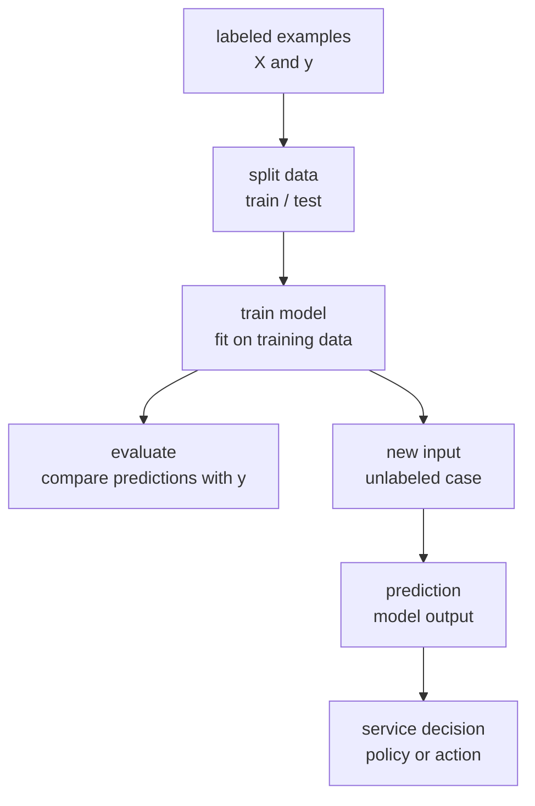
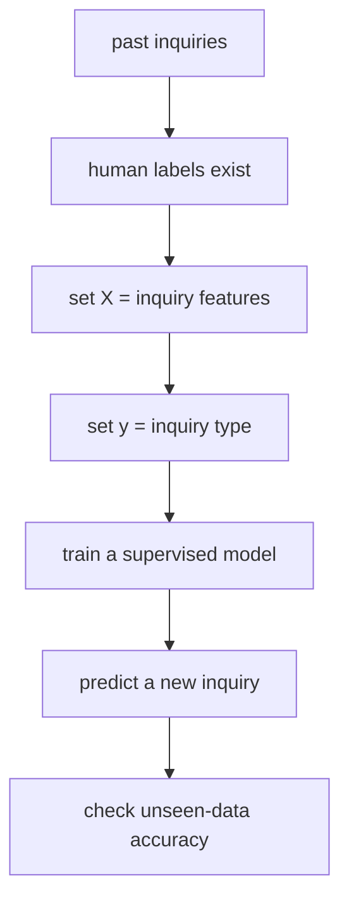

# P4-2.1 Supervised Learning

> Section ID: `P4-2.1`
> Version: `v2026.07.11`

P4-1.2 treated machine learning as `an approach that estimates the relation between input and output from data`. Now we look at the first form people usually meet inside it: supervised learning.

Supervised learning is a way of training a model on examples that already have a label or target value. Here a label is not just a name tag. It is the output the model is supposed to match. Because the examples show what result should come out when a given input is provided, the word `supervised` is used.

Supervised learning can be read as `a way of looking at examples that contain both an example and its answer, then trying to match the output of a new case`. But the model does not understand an explanation. It adjusts internal criteria so that the relation between input and output is matched across many examples.

This Section explains the basic distinction among `supervised learning`, `input X and target y`, `classification`, and `regression`. Later Sections continue the current context using this handle, and the base meaning of label-based learning is connected again through this Section and the [concept glossary](../../../reference/concept-glossary.md).

## Scope Of This Section

This Section explains the basic structure of supervised learning. Individual algorithms such as linear regression, logistic regression, and decision trees are handled separately later. Specifically, linear regression returns in P4-10, logistic regression in P4-11, and decision trees in P4-14.

- What are the input and label in supervised learning?
- How are classification and regression different?
- How do training, evaluation, and prediction connect?
- Does having labels mean the model already knows the right answer?
- What is the first misunderstanding to avoid in supervised learning?

## Goals Of This Section

- You can explain supervised learning as a way of learning the relation between input and output from labeled examples.
- You can distinguish the roles of input data `X` and label or target `y`.
- You can explain the difference between classification and regression through examples.
- You can explain why training data and evaluation data are separated.
- You can distinguish the model's prediction from the service's final decision.

## Understanding It First Through One Scene

Think about a situation where customer inquiries are classified automatically.

| Customer inquiry text | Label attached by a person |
| --- | --- |
| `I paid, but the item has still not arrived.` | delivery inquiry |
| `Where can I request a refund?` | refund inquiry |
| `I forgot my password.` | account inquiry |

In supervised learning, examples like these are shown to the model. The inquiry text is the input, and the inquiry type attached by a person is the label. The model is trained so that it predicts what label a new inquiry is close to.

The key point in this example is that `a label exists`. Without a label, the model does not directly know what it is supposed to match. Because a label exists, the model can learn in the direction of matching the relation between input and output.

## The Basic Shape Of Supervised Learning

In supervised learning, examples are prepared as pairs of inputs and outputs.

| Example | Input features | Label or target |
| --- | --- | --- |
| email 1 | title, body words, link count, sender information | spam |
| email 2 | title, body words, link count, sender information | normal |
| house 1 | area, location, number of rooms, build year | price |
| customer 1 | visit count, purchase amount, recent access date | churn status |

The input is usually written as `X`, and the label or target value as `y`. From the table perspective in Part 2, `X` is data with many rows and columns. A row is one example, and a column is one feature. `y` plays the role of the answer attached to each example.

It is clearer to read `X` and `y` not as symbols to memorize, but as the roles each notation carries.

| Symbol | What should come to mind first | Example |
| --- | --- | --- |
| `X` | bundle of inputs shown to the model | features extracted from email content, customer logs, product information |
| `y` | bundle of outputs the model is trying to match | spam/normal, churn/retain, price |
| one row | one example | one email, one customer, one house |
| one column | one feature | link count, purchase amount, number of rooms |

The word `answer` should still be used carefully. The label is the value the model tries to match in the learning data, but it does not guarantee complete truth for all of reality. A human-attached label can contain errors, and a measured value can contain noise.

If you carry over the data-organization flow from Part 3, the following four things must be separated before moving into supervised learning.

| What must be separated first | Meaning at this stage | Is it used directly in supervised learning? |
| --- | --- | --- |
| one case | Does one row mean one action or one target of the same kind? | yes |
| input-feature column | Is it a descriptive value to give as model input? | yes |
| target candidate | Is it a result you want to match later? | conditionally yes |
| identifier or operational column | Is it a value that helps find the case again or explain operational context? | usually no |

The reason `conditionally yes` appears here is that even if something looks like a target candidate, it does not automatically become a supervised learning problem. First, the label criterion must be consistent, it must be possible to attach it again in the same way later, and the question the model should match must be settled as either classification or regression. The same is true for identifier columns. They are important for finding the case again, but they are usually managed separately rather than fed into the model as-is.

## Looking At It As A Flow

The flow of supervised learning can be seen as follows.

In this diagram, `train model` is the stage where the model adjusts internal values so that it fits the relation between inputs and labels in the training data. `evaluate` is the stage where predictions are compared with actual labels on data not used in training. `prediction` is the stage where the trained model is applied to a new input.

The final `service decision` is kept separate on purpose. If a model outputs `spam probability 0.92`, that does not mean the service must block it automatically. The service may still choose block, review, or allow by also considering policy, cost, risk, and user experience.

## Distinguishing Training, Evaluation, And Prediction

The words most often mixed together when first learning supervised learning are training, evaluation, and prediction.

| Stage | What it does | Simple question |
| --- | --- | --- |
| training | It fits the model's internal criteria using labeled data. | What relation can be learned from these examples? |
| evaluation | It checks how well the model works on data not used in learning. | Does it still work on new examples? |
| prediction | It applies the trained model to an actual new input. | What result is likely for this new case? |

Once these three steps are separated, the phrase `we built a model` becomes clearer. Training the model, proving that the model is actually useful, and running the model in a service are not the same thing.

## Classification And Regression

Supervised learning is often explained through the broad split between classification and regression.

| Category | Output the model tries to match | Example |
| --- | --- | --- |
| classification | category or class | spam/normal, faulty/normal, churn/retain |
| regression | continuous numeric value | house price, demand quantity, temperature, revenue |

Classification asks `which category does it belong to?` It includes problems such as whether an email is spam or normal, whether a product review is positive or negative, or whether an image is a cat or a dog.

Regression asks `how much is it?` It includes problems such as what a house price is, how many units of demand appear tomorrow, or how many minutes delivery will take.

In both cases, the model learns the relation between input and output. The difference lies in the nature of the output. If the output is a category, the problem is closer to classification. If it is a numeric magnitude, it is closer to regression.

## Small Example: Study Time And Passing Status

Think about a small dataset like the following, where study time, mock-exam score, and pass status all exist.

| Study time | Mock-exam score | Pass status |
| --- | --- | --- |
| 1 hour | 45 | fail |
| 2 hours | 55 | fail |
| 4 hours | 72 | pass |
| 5 hours | 80 | pass |

If the target is pass status, then it is a classification problem. The goal of the model is to predict `pass` or `fail` by looking at a new student's study time and mock-exam score.

If the target is the real exam score, then it is a regression problem. The goal of the model is to predict `about how many points` the new student will get from study time and mock-exam score.

Even with the same data, the problem changes depending on what is placed into `y`. That is why problem definition matters so much in supervised learning.

## Where Labels Come From

Supervised learning needs labels. Labels can be created in several ways.

- People classify cases directly.
- The result from an existing business system is used.
- Logs from sensors or measuring devices are used.
- The result that actually occurred later is used.

For example, in churn prediction, an actual outcome such as `did the user cancel the service within 30 days` can become a label. In defective-product classification, the judgment attached by an inspector can become the label. In house-price prediction, the real transaction price can become the target value.

But the existence of labels does not always mean you already have a good supervised learning problem. If labels are inaccurate, if the label criterion changed midway, or if labels are biased toward a specific group, the model can learn those problems as well.

So `a label exists` and `it can immediately be used as a supervised learning problem` must be separated.

| Visible state | Why a direct conclusion is risky | Question to check again |
| --- | --- | --- |
| A label column exists | The criterion may not be consistent | Can it be attached again using the same criterion? |
| A past system value exists | Business-rule changes may already be mixed in | Does it still mean the same target today? |
| Human judgment results exist | Different people may judge by different standards | Is the disagreement among people large? |

In other words, supervised learning does not start from `finding a label column`. It starts from checking `does this label stably represent the result we truly want to predict?`

In practice, you must often judge briefly first whether `the current problem is really organized as supervised learning`.

| Current state | Read it as supervised learning? | Why |
| --- | --- | --- |
| Input features and target labels exist together, and the same criterion can be attached again | yes | Because input `X` and target `y` can be built stably |
| A label column exists, but the criterion changes often or differs greatly across people | not immediately | Because label quality and target definition must be rechecked first |
| Only inputs exist, and there is no result label to predict | no | Because structure exploration or another problem definition comes first |

## Why Data Are Split

It is not enough for a model to fit the training data well. What we really want is a model that is useful even on unseen data.

So supervised learning looks at split data.

| Data split | Role |
| --- | --- |
| training data | Used for the model to learn the relation |
| validation data | Used for model choice or setting adjustment |
| test data | Used for the final performance check |

The distinction between training data and test data must be fixed clearly first. The key is that `matching a problem it already learned` and `matching a problem it sees for the first time` are not the same.

## The First Misunderstandings To Avoid In Supervised Learning

The first misunderstandings to avoid in supervised learning are the following.

- Do not assume that labels automatically make the problem easy.
- Do not treat labels as complete truth about reality.
- Do not treat training-data performance as actual service performance.
- Do not treat model prediction as the service's final decision.
- Do not distinguish classification and regression by algorithm name first. Look at the nature of the output first.

Supervised learning is not `telling the model the answer so it can memorize it`. More precisely, it is a way of estimating the relation between input and output using labeled examples, then checking whether that relation generalizes to new cases.

## Cases And Examples

### Case 1. Why Inquiry Classification Fits Supervised Learning When Human Answers Already Exist

Suppose a team wants to classify customer inquiries automatically into categories such as `delivery`, `refund`, and `account`. If past inquiry records and the types attached by counselors already exist together, people naturally think `can't we use these answers to classify new inquiries as well?`

The important point in this scene is that `labels that play the role of answers already exist`. The model can learn the relation between the input, which is inquiry content, and the output, which is the type attached by the counselor. So the problem becomes predicting what type a similar new inquiry is close to.

This is why the Section explains supervised learning as a problem where `X` and `y` exist together. Inquiry content, link count, and length become `X`, while the type attached by a person becomes `y`. Only with this structure does it become clear what the model is trying to match.

The checkable result appears in evaluation on inquiries not used for learning. If classification accuracy remains stable not only on past inquiries but also on new ones, then the problem has been organized well as supervised learning using labeled examples.

## Perspective To Remember In This Section

- Supervised learning is a way of learning the relation between examples that contain input `X` and label or target `y`.
- The label is the output the model tries to match, but it does not guarantee complete truth about reality.
- Classification matches categories, while regression predicts numeric values.
- Training is the stage of fitting the relation, and evaluation is the stage of checking it on unseen data.
- Model prediction and the service's final decision should be read separately.

## Short Check

- Can you explain when a problem should be read as supervised learning because inputs and stable labels exist together?
- Can you explain why a label column alone does not automatically mean the problem is ready for supervised learning?
- Can you explain why training, evaluation, and service decision should not be collapsed into one step?

## When This Perspective Should Come To Mind First

- Return to this Section when a discussion jumps too quickly from `we have labels` to `so the problem is easy`.
- Recall it when you need to decide whether the current target is classification or regression.
- Use it as the reference point when separating model prediction from business policy or final service action.

## Sources And References

- Google, `Machine Learning Glossary`, entries including `supervised learning`, `label`, `classification`, and `regression`, accessed 2026-07-10. [https://developers.google.com/machine-learning/glossary](https://developers.google.com/machine-learning/glossary){: target="_blank" rel="noopener noreferrer" }
- scikit-learn developers, `Supervised learning`, scikit-learn User Guide, accessed 2026-07-10. [https://scikit-learn.org/stable/supervised_learning.html](https://scikit-learn.org/stable/supervised_learning.html){: target="_blank" rel="noopener noreferrer" }
