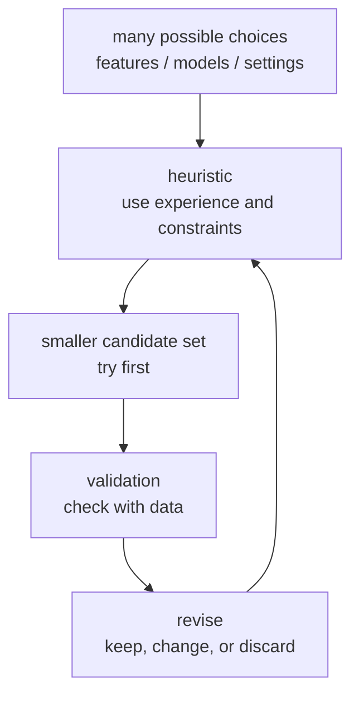
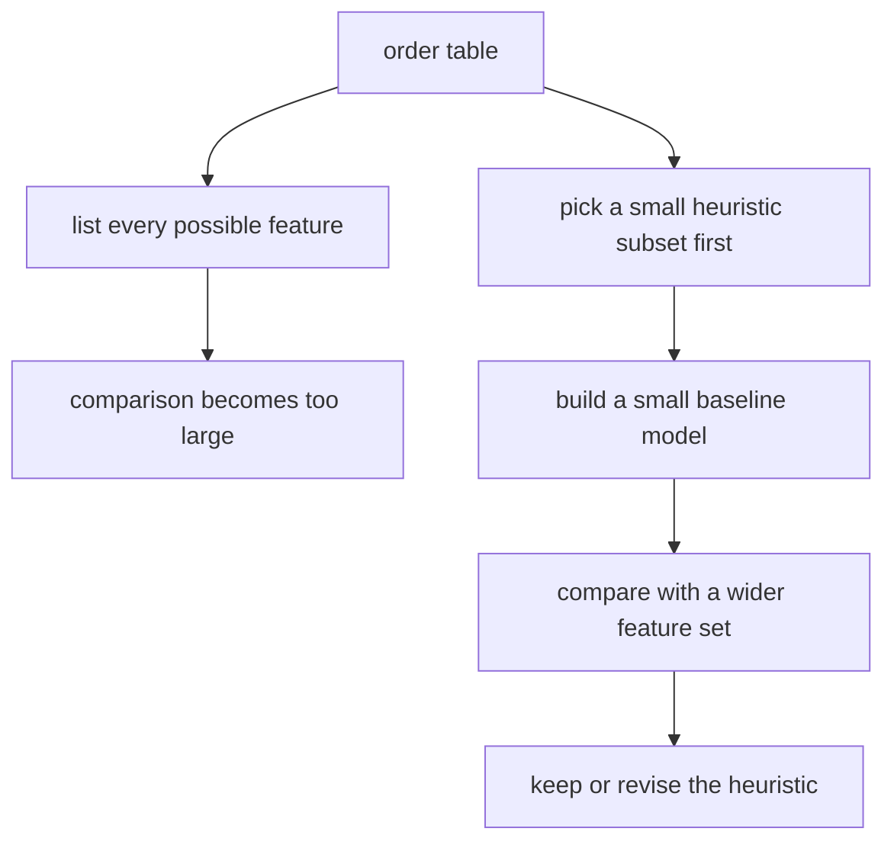

# P4-3.1 Why Heuristics Are Needed

> Section ID: `P4-3.1`
> Version: `v2026.07.11`

In Chapter P4-2, we divided supervised learning, unsupervised learning, and reinforcement learning into broad learning types. That immediately raises a question. When solving a real problem, which data should be looked at first, which model should be tried first, and at what point should the work move to the next stage?

The word that appears here is `heuristic`. A heuristic is not a rule that guarantees a complete proof or an optimal solution. It is a judgment criterion that helps you make a plausible choice quickly under limited time and limited information.

A heuristic is easy to misunderstand as `just taking a rough guess`. But in machine learning practice, a heuristic is not random guessing. It is a way to reduce candidates by using experience, problem structure, computational cost, and validation results.

This Section explains the meaning of `heuristic`, `judging by reducing candidates instead of exhaustive search`, and `a verifiable working hypothesis`. Later Sections continue the current context through this handle, and the basic meaning of reading practical judgment as a structure of hypothesis and verification is connected again through this Section and the [concept glossary](../../../reference/concept-glossary.md).

## Scope Of This Section

This Section explains why heuristics are needed. Specific model selection, feature selection, preprocessing, and hyperparameter tuning are handled separately later. Model-selection heuristics return in P4-8, feature selection and preprocessing in P4-7, and hyperparameter tuning in P4-9.

This Section answers the following questions.

- What is a heuristic?
- Why can every possible case not be fully computed?
- How is a heuristic different from an algorithm or optimization?
- Where are heuristics used in machine learning?
- Why is validation needed when using heuristics?

## Goals Of This Section

- You can explain a heuristic as a practical judgment criterion that reduces candidates under limited conditions.
- You can understand that a heuristic does not guarantee the optimal solution.
- You can describe situations where heuristics become necessary because of time, data, computation, or cost constraints.
- You can explain why heuristics and validation must be used together.
- You can treat heuristics not as private intuition, but as verifiable working hypotheses.

## Understanding It First Through One Scene

Suppose you are building a new customer-churn prediction model. The data are not perfect yet, and time is limited.

| What must be chosen | Possible choices | Why trying every choice is difficult |
| --- | --- | --- |
| Features to use | visit count, purchase amount, login interval, inquiry history | The number of feature combinations grows. |
| Model to use | logistic regression, decision tree, random forest, boosting | Each model takes training and tuning time. |
| Evaluation criterion | accuracy, precision, recall, F1 | What matters most changes with the business goal. |
| Tuning range | tree depth, learning rate, number of iterations | The cost becomes large if every combination is tried. |

In this situation, the idea `let's try every possible combination all the way through, then choose the best one` sounds reasonable in theory but is difficult in reality. So heuristics are needed, such as setting a simple baseline first, excluding obviously unnecessary features, and choosing metrics that fit the business goal.

## A Heuristic Is A Way To Reduce Candidates

A heuristic reduces the candidates needed to solve the problem. Instead of going down every path, it selects the paths worth examining first.

In this diagram, the heuristic is not the final conclusion. It is the method for selecting the candidates to try first. Once real data are used for validation, the heuristic must be changed if it does not fit.

## Why Everything Cannot Be Computed

This raises the question, `computers are fast, so why can't we just compute everything?` The reason is that the number of choices grows faster than it first appears.

For example, think about the problem of choosing which features to use among 20 features. Even if each feature is only divided into `use it` or `do not use it`, the number of possible combinations becomes very large. If you then add model type, hyperparameters, and data-splitting methods, the number of experiments grows even more.

| Expanding element | Why it becomes difficult |
| --- | --- |
| Number of features | The number of combinations grows rapidly. |
| Model candidates | Each model needs its own training time. |
| Hyperparameters | The number of configuration combinations increases. |
| Data size | The cost of a single training run becomes larger. |
| Evaluation conditions | Multiple metrics and multiple validation splits must be checked. |

So in practice, instead of exploring every possibility completely, people first narrow the plausible candidates and keep revising direction while validating.

## The Difference Between A Heuristic And An Algorithm

An algorithm is a way of solving a problem by following a fixed procedure. A heuristic is the judgment criterion that decides which candidates to inspect first, how far to calculate, and which choice to prioritize inside or around that procedure.

| Category | Phrase to recall first | Example |
| --- | --- | --- |
| Algorithm | fixed procedure | Train a decision tree on the given data. |
| Heuristic | judgment criterion for reducing candidates | Try an easy-to-interpret model first. |
| Optimization | finding values that improve the objective function | Find parameter values that reduce loss. |
| Validation | checking whether the choice is actually acceptable | Check performance on validation data. |

A heuristic does not replace an algorithm. Instead, it is used to decide which algorithm to try first, which settings to inspect first, and what level of result is enough to move to the next stage.

## Bounded Rationality And Good-Enough Choice

When understanding heuristics, Herbert A. Simon's perspective of bounded rationality is useful. The Stanford Encyclopedia of Philosophy explains bounded rationality as a view that departs from the assumption of perfect rationality and instead studies rationality appropriate for agents with limits in access to information and computational ability.

That perspective also fits machine learning practice well. We do not have complete information, infinite computation time, or a perfect evaluation environment. So `a verifiable good-enough choice under current conditions` matters more than `theoretically possible optimality`.

This does not mean giving up accuracy. It means admitting the limits and working in a way that makes better choices inside them.

## Where Heuristics Are Used In Machine Learning

In machine learning, heuristics are often used in places like the following.

| Place | Example heuristic | Where it returns later |
| --- | --- | --- |
| Feature selection | Look at explainable features before trying too many features at once. | P4-7 |
| Preprocessing | Check columns with many missing values first. | P4-7 |
| Model selection | Set up a simple baseline model first. | P4-8 |
| Tuning | Experiment with a small range before a wide range. | P4-9 |
| Evaluation | Check the more dangerous error type first for the business. | P4-6 |

The important point in this table is that a heuristic is not `the final answer`. It is the direction for starting the experiment. If the validation result is poor, the heuristic must be revised.

## Good Heuristics And Bad Heuristics

Heuristics can be useful, but they are not always right. A good heuristic should narrow the problem quickly while still remaining testable.

| Heuristic | Why it can be useful | What still must be validated |
| --- | --- | --- |
| Build a simple model first. | A comparison standard can be set quickly. | Compare whether a more complex model is actually better. |
| Suspect features with many missing values first. | Data-quality problems can be found quickly. | Still check whether that feature could contain an important signal. |
| Start with interpretable features. | It is easier to discuss them with business stakeholders. | Check that performance is not sacrificed too much. |
| Run lower-cost experiments first. | Direction can be established quickly. | Check whether the result from the small experiment still holds on larger data. |

A bad heuristic is just a repeated habit with no validation. For example, statements such as `always start with random forest` or `if there are missing values, always drop the column` can be wrong depending on the situation. A heuristic must always be read together with the current context.

## A Heuristic Is A Working Hypothesis

This Section treats a heuristic as a working hypothesis. In other words, it is a starting point that says `it may be reasonable to try this first`.

Once it is treated as a working hypothesis, the following flow appears.

1. Explain why this choice seems plausible.
2. Check it with a small dataset or a baseline model.
3. Look at the validation result.
4. Revise it if it is wrong.
5. If it still looks valid, extend it to the next stage.

This flow keeps practical experience-based judgment without throwing it away, while changing it into a form that can be validated.

In practice, you first need to judge `whether a heuristic may be used at all right now` and `what should not be accepted as-is`.

| Current state | Way of using the heuristic | What must not be left as-is |
| --- | --- | --- |
| There are too many candidates, and time or computation cost is limited | Use it as a starting point that first narrows the candidates | Freezing the heuristic as if it were the final answer |
| A baseline and small validation can check it quickly | Record it as a working hypothesis and validate immediately | Repeating it as a habit with no validation |
| Explainability, performance, and cost are in tension | State which constraint is being prioritized, then narrow the candidates | Looking at only one criterion while ignoring the others |

## Cases And Examples

### Case 1. When You Want To Identify Orders With High Return Risk First

Suppose an online shopping team wants to inspect orders with high return risk in advance. The initial human criteria were signals such as `is it in the clothing category`, `is the discount large`, and `has the same customer returned items often recently`.

These criteria are useful as a starting point, but as the number of orders grows, it becomes difficult for people to compare every combination directly. Different teams can also prioritize different criteria first, so the order of inspection can become unstable even on the same data.

Here the heuristic becomes the working hypothesis `before feeding in every possible feature, let's first check a small baseline model using features that are likely to connect directly to returns`. For example, you could first choose recent return count, product group, order amount, and delivery delay, then run a small classification experiment.

Whether that judgment is right still has to be checked through validation. You compare the performance of the chosen feature set with a wider feature set, and confirm whether the criteria that people considered important are also real signals in the data. If the results are similar, the simple starting point was useful. If the gap is large, the heuristic should be revised.

## Perspective To Remember In This Section

- A heuristic is a practical judgment criterion for reducing candidates under limited time and limited information.
- A heuristic does not guarantee an optimal solution or a final answer.
- In machine learning, heuristics are needed in feature selection, preprocessing, model selection, tuning, and the choice of evaluation criteria.
- A heuristic does not replace an algorithm. It is used to decide which candidates and which order should be tried.
- A good heuristic must be testable.
- A heuristic should be treated as a working hypothesis rather than as private intuition.

## Short Check

- Can you explain in what state a heuristic becomes a candidate-reduction device rather than `just guessing`?
- Can you explain why a heuristic must always be paired with a baseline model or validation data?
- Can you explain why it is necessary to record what should be prioritized when explainability, cost, and performance conflict?

## When This Perspective Should Come To Mind First

- Recall the heuristic perspective when you encounter a problem where all combinations cannot be calculated and the candidate set must be reduced first.
- Return to this Section when a heuristic must be treated not as `rough guessing` but as a verifiable working hypothesis.
- This Section is the reference point when reorganizing what should be recorded first in a situation where performance, explainability, and cost conflict.

## Sources And References

- Juliette R. V. Kenens, Matteo Colombo, and Stephan Hartmann, `Bounded Rationality`, Stanford Encyclopedia of Philosophy, substantive revision 2024-12-13, accessed 2026-06-25. [https://plato.stanford.edu/entries/bounded-rationality/](https://plato.stanford.edu/entries/bounded-rationality/){: target="_blank" rel="noopener noreferrer" }
- Stuart Russell and Peter Norvig, `Artificial Intelligence: A Modern Approach`, 4th ed., Pearson, 2020, accessed 2026-06-25. [https://aima.cs.berkeley.edu/](https://aima.cs.berkeley.edu/){: target="_blank" rel="noopener noreferrer" }
- Judea Pearl, `Heuristics: Intelligent Search Strategies for Computer Problem Solving`, Addison-Wesley, 1984.
