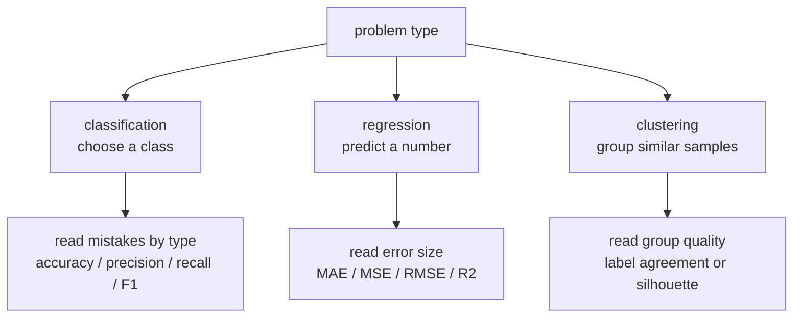
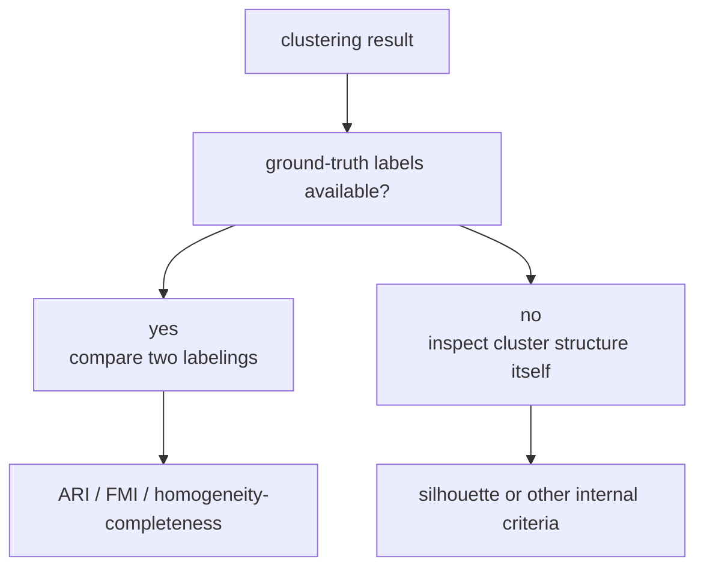
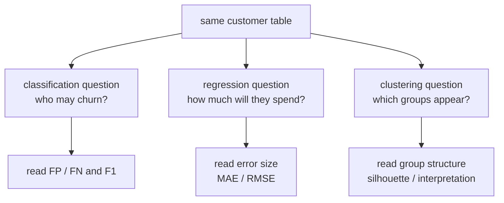

# P4-6.2 Evaluation Criteria By Problem Type

> Section ID: `P4-6.2`
> Version: `v2026.07.11`

P4-6.1 explained that an evaluation metric is not just a scoreboard. It is a criterion that reveals what we choose to treat as important. Now the next question follows. `If the problem changes, why do the metrics we inspect also change?`

The answer is simple. The model's output changes, and the judgment connected to that output changes as well. Classification is the problem of choosing a category, regression is the problem of predicting a number, and clustering is the problem of grouping similar things together. So the meaning of `did well` cannot stay the same.

## Scope Of This Section

This Section is an introductory organization of why evaluation criteria change across classification, regression, and clustering. It connects the questions that should come to mind for each problem type with representative metrics. Introductory explanations of ROC curve, PR curve, log loss, calibration, and silhouette coefficient are collected separately in the P4-6.4 supplementary Section, and clustering-quality interpretation is connected again in P4-17.1 and P4-17.2.

In the core text, the first scope is the following: `which kinds of errors hurt more in classification`, `how far off is the model on average in regression`, and `how should structure be read in clustering when there may be no answer label`. More delicate readings such as calibration curves and Brier score are first collected in P4-6.4, while actual threshold adjustment and the connection to service policy return in P4-15.3.

This Section answers the following questions.

- What differs in evaluation across classification, regression, and clustering?
- Why does classification not end with accuracy alone?
- Why does regression inspect `how far off was it` rather than just `right or wrong`?
- Why does it matter in clustering that an answer label may not exist?
- Why does it become easier to read later algorithm chapters once the problem type is separated first?

## Goals Of This Section

- You can explain that the evaluation question changes by problem type.
- You can explain why representative metrics for classification and regression are different.
- You can explain that clustering often becomes more delicate because there is frequently no answer label.
- You can prepare for what evaluation questions follow later when learning algorithms such as linear regression, logistic regression, k-NN, and decision trees.

## Learning Background

### First Separate The Problem Type

The scikit-learn documentation explains evaluation functions by separating them according to the goal of the problem. The fact that classification metrics, regression metrics, and clustering metrics are separate is itself an important hint. It means that different questions are hidden under the same word `performance`.



This diagram shows that once the problem type is chosen first, the evaluation question that should be read next also changes naturally. What should be read first here is not the metric name, but the distinction `is the current output a category, a number, or a grouping?`

The criterion to fix first in this Section is the following table.

| Problem type | Model output | The first question to ask | Representative metrics often used |
| --- | --- | --- | --- |
| classification | class or class probability | Which kind of mistake should be reduced more? | accuracy, precision, recall, F1 |
| regression | continuous number | How far is the prediction from the actual value? | MAE, MSE, RMSE, R² |
| clustering | grouping structure, cluster ID | Were truly similar things grouped together? | comparison metrics such as ARI/FMI, silhouette |

The point readers confuse most often here is that `when the shape of the output changes, the meaning of a good result also changes`.

The evaluation order by problem type can be fixed briefly like this.

| Problem type | What to inspect first | The next question that follows immediately | Where it connects to the baseline |
| --- | --- | --- | --- |
| classification | confusion matrix and representative error cases | Which FP or FN hurts more, and should precision or recall be read first? | In P4-8.2, whether the improvement in this error structure is truly meaningful is compared against a baseline. |
| regression | representative error size and the region with large errors | How far off is it on average, and where are the large failures concentrated? | It is compared against a simple baseline that predicts only the average. |
| clustering | compactness within clusters and separation across clusters | Does this grouping truly show structure, and is there an interpretation a person can attach? | Later Sections check again whether it can be compared with human labels or a simple split. |

| Problem type | Example input | Example output | What `did well` means |
| --- | --- | --- | --- |
| classification | email content, customer information, image pixels | spam/normal, churn/stay, cat/dog | it chose the correct category |
| regression | area, location, past price | 520 million won, 37 minutes, 21.3 degrees | it kept the numeric difference small |
| clustering | purchase records, click patterns, sensor data | cluster 1, cluster 2, cluster 3 | it grouped similar things together |

So classification is closer to `a problem of attaching a name label`, regression is closer to `a problem of matching a numeric scale`, and clustering is closer to `a problem of finding groups that were not named in advance by people`.

## Main Learning Content

### In Classification, Read The Types Of Errors First

In classification, it is often not enough to read the prediction result only as `correct or wrong`. As already seen in P4-6.1, the mistake of missing an actual positive case and the mistake of calling a negative case positive for no good reason can have different costs.

The scikit-learn documentation also separates classification metrics into items such as accuracy, F1, confusion matrix, ROC AUC, and precision-recall curve. That means classification performance does not end in one number.

Classification becomes clearer when read through the following order.

1. What counts as positive, and what counts as negative?
2. Does it hurt more to miss a case, or to raise a false alarm?
3. So should recall be the first metric to inspect, or precision?
4. Is there a need to inspect F1 score or another metric together to read the overall balance?

Even within the same classification problem, the questions can differ like this.

| Scene | The first question asked | A metric that is easy to inspect first |
| --- | --- | --- |
| disease screening | Were actual dangerous cases avoided from being missed? | recall |
| spam blocking | Are normal emails being blocked too often? | precision and recall together |
| fraud detection | Which costs more, misses or false alarms? | recall-centered, with precision together |
| recommendation click prediction | How do ranking and post-threshold results look? | accuracy alone may be insufficient |

So in classification, the first thing to read is `the kind of error`.

#### Reading Classification More Concretely

Classification looks simple on the surface because it only chooses one option among categories. But in practice, two layers are mixed together.

1. Which class does the model consider more likely?
2. How is that likelihood turned into an actual decision in service?

For example, a mail filter may produce an internal score such as `spam probability 0.82`. But users do not see a probability. They experience decisions such as `move to spam`, `send to review`, or `keep in inbox`. So classification evaluation goes beyond a simple label table and also ends up reading the error structure created by that decision.

The following distinctions are especially important when reading classification.

| Distinction | Question | Why it matters |
| --- | --- | --- |
| the class itself | What category is being predicted? | The problem definition changes |
| positive versus negative | What is being treated as `the target that must be caught`? | The interpretation of precision and recall changes |
| threshold | From what score onward should a case be treated as positive? | Even with the same model, the result changes |
| error cost | Which hurts more, FP or FN? | The first metric to inspect changes |

For example, in medical screening, `classifying too many cases as positive` may be a smaller problem than `missing an actual patient`. By contrast, in an automatic approval system, `letting a risky target pass incorrectly` may be the bigger problem. So classification is both `the task of choosing a category` and `the task of managing the kinds of errors`.

#### Social And Work Examples Of Classification

Classification is one of the most widely used problem types in reality. The reason is that many institutions and services eventually move through category judgments such as `pass/hold`, `normal/anomaly`, `allow/block`, and `approve/reject`.

| Scene | Example input | Example output | Why evaluation is sensitive |
| --- | --- | --- | --- |
| first-stage welfare screening | income, household information, application history | support priority / lower priority | leaving out a needed person creates social loss |
| automatic resume sorting in hiring | resume, experience, qualifications | proceed to next stage / hold | incorrect rejection creates fairness issues |
| financial anomaly detection | payment time, amount, location | normal / suspicious transaction | misses cause monetary damage, excessive blocking causes user inconvenience |
| content report classification | post text, image | normal / review / deletion candidate | both missed dangerous expression and excessive blocking must be handled carefully |

Classification is also very common in work systems.

| Work scene | Actual judgment | The metric intuition inspected first |
| --- | --- | --- |
| operational alert classification | whether to raise an alert | the balance between false alarms and missed alerts |
| customer-churn prediction | whether to select at-risk customers | if recall is low, the number of misses may grow |
| defective-product inspection | pass / reinspection / discard | comparing the cost of missed defects and excessive reinspection |
| spam and phishing blocking | block / allow / review | precision and recall must be inspected together |

These examples show that classification is more accurately understood not merely as technology for attaching labels, but as `technology that changes the next action taken by people and organizations`.

### In Regression, Read The Size Of Error First

Regression is the problem of predicting numbers. It is enough to imagine situations such as house price, delivery time, power usage, sales, or temperature. Here, what matters more is not simply `wrong`, but `how wrong`.

The scikit-learn documentation separately explains regression metrics such as mean absolute error, mean squared error, and R² score. That structure itself means that in regression, the size of error and the way error is interpreted are central.

Here the distinction is organized like this.

| Metric | Reader question | Characteristic |
| --- | --- | --- |
| MAE | On average, how far off was it? | Intuitive |
| MSE | Do we want to punish large errors more strongly? | More sensitive to large mistakes |
| RMSE | Do we want to read MSE again in the original unit? | A little easier to interpret |
| R² | How much better does it explain compared with a baseline? | It can be read like explanatory power, but it is easy to misunderstand |

The important point here is that regression metrics are connected to `the interpretation of numeric difference`.

- In delivery-time prediction, a 1-minute error and a 30-minute error are not the same mistake.
- In power-demand prediction, a large error can shake the whole operating plan.
- In house-price prediction, the average size of the difference may be more intuitive.

So in regression, the key is not `whether error exists`, but `the size and cost of the error`.

#### Reading Regression More Concretely

Because regression deals with numbers, many readers easily misunderstand it as `a problem of matching one exact correct answer`. But in practice, the key is `how close a number the model gives`.

For example, if the true house price should be 500 million won, then 501 million won and 700 million won are both wrong, but they are not the same kind of wrong. Regression metrics let that difference be read.

The following questions come attached when reading regression.

| Question | Why it is needed | Metric it connects to |
| --- | --- | --- |
| How far off was it on average? | It gives an everyday sense of error | MAE |
| Do we want to punish large errors more strongly? | It reflects scenes where a large failure is critical | MSE, RMSE |
| Is it actually useful compared with a baseline? | It checks whether it is better than simple average prediction | R² |

The sense of baseline is also important here. In regression, a good model is not automatically `a model that hit the exact value`. At the very least, it should be possible to say it is better than `a model that mindlessly says the average`. R² helps this comparison perspective, but a high number does not always mean the model is enough in practice.

Regression is also sensitive to the unit.

- MAE of 1 million won in house-price prediction
- MAE of 1 million won in delivery-time prediction

Even if the number looks the same, the meaning is completely different. So in regression, the number itself must be read together with `the unit in which that error exists`.

#### Social And Work Examples Of Regression

Regression can feel less familiar than classification at first, but it appears extremely often in actual work. The reason is that organizations constantly handle numbers such as `how much`, `until when`, `how many`, and `what cost` when making decisions.

| Scene | Example input | Example output | Why evaluation is sensitive |
| --- | --- | --- | --- |
| housing-price estimation | area, region, transaction history | expected price | a large error can distort transaction judgment |
| delivery-time prediction | origin, logistics volume, traffic condition | expected arrival time | small errors may be tolerated, but large delays break service trust |
| power-demand prediction | temperature, time slot, past usage | next-hour demand | large errors directly affect supply planning and cost |
| hospital waiting-time prediction | number of reservations, number of staff, patient condition | expected waiting time | it affects actual operating experience and resource placement |

Regression also appears often in work analysis.

| Work scene | Number to predict | The evaluation intuition being read |
| --- | --- | --- |
| sales planning | next week's sales | how far off is it on average? |
| ad operations | clicks, conversions, cost | does a large error shake budget execution? |
| manufacturing operations | next-batch production amount | how different are the costs of underprediction and overprediction? |
| infrastructure operations | CPU usage, request count | does missing a sharp peak lead to an operational incident? |

When reading regression examples, it is not enough to think only about `predicting a number`. You also have to ask `how much does the error in that number shake planning and operations?` Regression evaluation is both mathematical error and operational error.

### In Clustering, There May Be No Answer At All

Clustering may feel stranger than classification or regression. The reason is simple. Clustering usually begins from a state where `there is no answer label`.

The scikit-learn documentation explains clustering performance evaluation by separating the case where answer labels are known from the case where they are not. It explicitly says that this is not as simple as precision and recall in supervised learning.

This difference is extremely important.



The key point of this diagram is that clustering evaluation splits into two branches from the beginning. If human answer labels exist, the question becomes `how similar is this to the human grouping?` If no such labels exist, the question becomes `how plausible is the grouping itself?`

| Situation | The first question to ask | Representative way to read it |
| --- | --- | --- |
| answer labels exist | Was the grouping similar to the division people already knew? | comparison metrics such as ARI and FMI |
| answer labels do not exist | Are points inside the same cluster close, and are different clusters separated? | internal criteria such as silhouette |

So in clustering, the fact that it is `evaluation without an answer` is itself a core learning point.

#### Reading Clustering More Concretely

Clustering can feel the most abstract. Classification has an answer category, and regression has a number to match. But in clustering, from the beginning, a person must interpret again `what kind of grouping counts as a good grouping?`

So when reading clustering, what the model did has to be split into two layers.

1. What grouping structure did it create inside the data?
2. Does that grouping also match distinctions that a human can understand?

For example, when customer data are clustered, the model may output only IDs such as `cluster 1`, `cluster 2`, and `cluster 3`. But those numbers themselves do not automatically mean `loyal customers`, `customers at risk of churn`, or `occasional visitors`. A human has to read and interpret that meaning again.

The following distinctions matter.

| Distinction | Question | Why it matters |
| --- | --- | --- |
| label-free evaluation | Are the inside of clusters compact, and are clusters separated from one another? | The perspective used when people do not know the answer |
| label-based evaluation | Is it similar to a distinction people already knew? | The perspective used when a comparable criterion exists |
| interpretation of the number of clusters | Are there too many clusters or too few? | The interpretability of the result changes |
| assigning meaning to clusters | Can the cluster IDs be connected to real business groups? | The analysis result must be convertible into action |

So clustering evaluation must think about both `does the shape look plausible?` and `is it interpretable?` In that sense, clustering brings in more interpretive work of `looking at structure, comparing, and naming` than simple score reading.

#### Social And Work Examples Of Clustering

Clustering is closer to `finding hidden structure` than to `matching a known answer`. That is why it appears often in early analysis, policy planning, and service operation.

| Scene | Example input | Example output | Why evaluation is sensitive |
| --- | --- | --- | --- |
| customer segmentation | purchase cycle, average order amount, visit frequency | customer groups A/B/C | even if groups appear, they are of little use if people cannot interpret them |
| regional policy analysis | population, income, transport, medical access | groups of similar regions | clustering may help administrative judgment, but stigma effects must be handled carefully |
| exploring topics in news and posts | word distribution, embeddings | groups of similar documents | a completely different conclusion may arise depending on cluster count and interpretation |
| exploring equipment anomaly patterns | vibration, temperature, pressure changes | groups of similar behaviors | later interpretation as anomaly clusters needs a basis |

In work settings, clustering usually leads to the following questions.

| Work question | What clustering does | What people do afterwards |
| --- | --- | --- |
| Into what types do customers split? | It groups similar purchase patterns | People read the characteristics of each cluster and name them |
| Where are anomaly cases concentrated? | It finds groups unlike the general pattern | People check whether that group is actually risky |
| Is there a hidden pattern in operation logs? | It groups similar sequences | People connect it to incidents, deployments, and user behavior |
| Into what themes does a set of documents divide? | It groups similar documents | People interpret the clusters as topics or business categories |

So clustering should be understood less as `a problem where the model gives the final answer` and more as `a problem where the model reveals structure first so that people can interpret further`.

## Detailed Learning Content

### Misunderstanding Appears If The Same Kind Of Number Is Expected Across Problem Types

It is easy to think like this.

- classification also has a score
- regression also has a score
- clustering also has a score
- so in the end, doesn't a bigger number always mean better?

This reading misses an important difference.

| Problem type | What the number says | Point that is easy to misunderstand |
| --- | --- | --- |
| classification | how many kinds of prediction mistakes were made | it is easy to think only high accuracy matters |
| regression | how large the numeric error is on average | it is easy to ignore unit and cost differences |
| clustering | how plausible the grouping structure looks | it is easy to assume an answer exists |

So before looking at a metric, the first check should be `what is this model predicting?`

In evaluation by problem type, the first question is fixed by `what is this model predicting right now?`

| Current problem type | Evaluation question to ask first | Representative starting metrics |
| --- | --- | --- |
| classification | Which kind of error should be reduced more? | accuracy, precision, recall, F1 |
| regression | How far off is the number on average? | MAE, RMSE |
| clustering | Are the groups compact and separated? | silhouette or label-comparison metrics |

## Cases And Examples

### Case 1. Even With The Same Customer Data, The Evaluation Criterion Changes When The Question Changes

A service team is reviewing several tasks on the same customer dataset. People first split the work questions, such as `should we find customers likely to churn`, `should we predict next month's purchase amount`, and `should we divide customers into similar groups`.

The problem begins when the team expects the same kind of performance number simply because the dataset is the same. Churn prediction is a classification problem, so misses and false alarms must be examined. Purchase-amount prediction is a regression problem, so the size of error must be inspected. Customer segmentation is clustering, so the question becomes whether the grouping is interpretable even without answer labels. If everything is bundled under the same word `score`, the judgment criterion becomes blurry.

Here, separating the problem type becomes the starting point that changes the evaluation criterion. If it is classification, the first questions are around precision, recall, and F1. If it is regression, the size of error is read through metrics such as MAE or RMSE. If it is clustering, silhouette and human interpretability must be read together.

The checkable result is also read differently. Even with the same customer data, classification requires checking the number of missed positive cases, regression requires checking average error size, and clustering requires checking compactness within clusters and separation between clusters. In other words, the first thing that must change is not the data, but the question.

It becomes even clearer when the same customer table is drawn as a diagram that branches into different evaluation questions.



## Cases And Examples

### Reading It Again Through Very Short Scene Comparisons

Even with the same data task, once the problem type changes, the reader's question changes completely.

| Same work scene | When read as classification | When read as regression | When read as clustering |
| --- | --- | --- | --- |
| customer data | Can it be divided into churn/stay? | Can next month's purchase amount be predicted? | Can it be grouped into similar customer groups? |
| mail data | Is it separated into spam/normal? | How high is the spam score? | Do similar email types gather together? |
| sensor data | Is it classified into failure/normal? | How accurately are temperature or vibration values predicted? | Do similar behavior patterns gather together? |

This table shows that `the problem sentence must be rewritten before the algorithm is discussed`. Even with the same dataset, when the question changes, the problem type changes, and then the evaluation criterion changes with it.

## Practice And Examples

### Trying Classification Through A Python Example

In classification, precision and recall can change even with a small shift in threshold. The following example shows that even with the same score, the result changes depending on `from what score onward should the case be treated as positive`.

Problem situation:

- Even with the same classification score, the final prediction and the metrics change depending on where the threshold is placed

Input:

- true labels `y_true`
- predicted scores `scores`
- several threshold values

Expected output:

- prediction result by threshold
- TP, TN, FP, FN
- accuracy, precision, recall

Concept to check:

- classification evaluation should be read not only through model scores but through the final decision after thresholding
- the balance between precision and recall can change with the threshold

```python
y_true = [1, 1, 1, 0, 0, 0, 1, 0]
scores = [0.95, 0.80, 0.55, 0.70, 0.40, 0.20, 0.45, 0.60]

def classification_metrics(y_true, scores, threshold):
    y_pred = [1 if s >= threshold else 0 for s in scores]

    tp = sum(1 for yt, yp in zip(y_true, y_pred) if yt == 1 and yp == 1)
    tn = sum(1 for yt, yp in zip(y_true, y_pred) if yt == 0 and yp == 0)
    fp = sum(1 for yt, yp in zip(y_true, y_pred) if yt == 0 and yp == 1)
    fn = sum(1 for yt, yp in zip(y_true, y_pred) if yt == 1 and yp == 0)

    accuracy = (tp + tn) / len(y_true)
    precision = tp / (tp + fp) if (tp + fp) else 0
    recall = tp / (tp + fn) if (tp + fn) else 0

    return {
        "threshold": threshold,
        "pred": y_pred,
        "tp": tp,
        "tn": tn,
        "fp": fp,
        "fn": fn,
        "accuracy": round(accuracy, 3),
        "precision": round(precision, 3),
        "recall": round(recall, 3),
    }

for threshold in [0.4, 0.6, 0.8]:
    result = classification_metrics(y_true, scores, threshold)
    print("threshold =", result["threshold"])
    print("  pred      =", result["pred"])
    print("  TP TN FP FN =", result["tp"], result["tn"], result["fp"], result["fn"])
    print("  accuracy  =", result["accuracy"])
    print("  precision =", result["precision"])
    print("  recall    =", result["recall"])
```

The output is as follows.

```text
threshold = 0.4
  pred      = [1, 1, 1, 1, 1, 0, 1, 1]
  TP TN FP FN = 4 1 3 0
  accuracy  = 0.625
  precision = 0.571
  recall    = 1.0
threshold = 0.6
  pred      = [1, 1, 0, 1, 0, 0, 0, 1]
  TP TN FP FN = 2 2 2 2
  accuracy  = 0.5
  precision = 0.5
  recall    = 0.5
threshold = 0.8
  pred      = [1, 1, 0, 0, 0, 0, 0, 0]
  TP TN FP FN = 2 4 0 2
  accuracy  = 0.75
  precision = 1.0
  recall    = 0.5
```

This example can be experimented with like this.

- change the threshold to `0.5`, `0.7`, and `0.9`
- raise or lower one score slightly
- check in which cases recall goes up while precision goes down

So in classification, it is important to read through the flow `model score -> threshold -> final judgment`.

### Trying Regression Through A Python Example

In regression, it is important to develop a feel for reading how large the error is in numbers. In particular, you need to see directly how much `one large error` shakes the metric.

Problem situation:

- In regression, error size should be read before right-or-wrong, so it is useful to print absolute error and squared error directly

Input:

- actual values `y_true`
- predicted values `y_pred`

Expected output:

- `absolute_errors`
- `squared_errors`
- MAE, MSE, RMSE

Concept to check:

- regression metrics are criteria for reading how far the numbers were off
- MAE and MSE/RMSE look at the same error with different emphasis

```python
y_true = [10, 12, 9, 15]
y_pred = [11, 10, 8, 18]

absolute_errors = [abs(a - b) for a, b in zip(y_true, y_pred)]
squared_errors = [(a - b) ** 2 for a, b in zip(y_true, y_pred)]

mae = sum(absolute_errors) / len(absolute_errors)
mse = sum(squared_errors) / len(squared_errors)
rmse = mse ** 0.5

print("absolute_errors:", absolute_errors)
print("squared_errors :", squared_errors)
print("mae            :", round(mae, 2))
print("mse            :", round(mse, 2))
print("rmse           :", round(rmse, 2))
```

The output is as follows.

```text
absolute_errors: [1, 2, 1, 3]
squared_errors : [1, 4, 1, 9]
mae            : 1.75
mse            : 3.75
rmse           : 1.94
```

These numbers can be read like this.

- MAE means it was off by 1.75 on average.
- MSE reflects large errors more strongly.
- RMSE helps the reader return MSE to the feel of the original unit.

So in regression, `how much was it wrong` sits at the center of the metric.

Now insert one large error.

Problem situation:

- It is useful to compare which regression metric shakes more strongly when one large error enters

Input:

- small-error prediction `y_pred_small_error`
- prediction including a large error `y_pred_big_error`

Expected output:

- absolute error and squared error in the two cases
- comparison of MAE, MSE, RMSE

Concept to check:

- if you want to punish a large failure more strongly, MSE and RMSE react more sensitively
- even on the same regression problem, you still choose which type of error to weigh more heavily

```python
y_true = [10, 12, 9, 15]
y_pred_small_error = [11, 10, 8, 18]
y_pred_big_error = [11, 10, 8, 30]

def regression_metrics(y_true, y_pred):
    absolute_errors = [abs(a - b) for a, b in zip(y_true, y_pred)]
    squared_errors = [(a - b) ** 2 for a, b in zip(y_true, y_pred)]
    mae = sum(absolute_errors) / len(absolute_errors)
    mse = sum(squared_errors) / len(squared_errors)
    rmse = mse ** 0.5
    return absolute_errors, squared_errors, round(mae, 2), round(mse, 2), round(rmse, 2)

for name, pred in [
    ("small_error_case", y_pred_small_error),
    ("big_error_case", y_pred_big_error),
]:
    absolute_errors, squared_errors, mae, mse, rmse = regression_metrics(y_true, pred)
    print(name)
    print("  pred           =", pred)
    print("  absolute_error =", absolute_errors)
    print("  squared_error  =", squared_errors)
    print("  mae            =", mae)
    print("  mse            =", mse)
    print("  rmse           =", rmse)
```

The output is as follows.

```text
small_error_case
  pred           = [11, 10, 8, 18]
  absolute_error = [1, 2, 1, 3]
  squared_error  = [1, 4, 1, 9]
  mae            = 1.75
  mse            = 3.75
  rmse           = 1.94
big_error_case
  pred           = [11, 10, 8, 30]
  absolute_error = [1, 2, 1, 15]
  squared_error  = [1, 4, 1, 225]
  mae            = 4.75
  mse            = 57.75
  rmse           = 7.6
```

This example directly raises the following questions.

- When one large error enters, which metric shakes more?
- Do we want to see average error, or do we want to punish large failures more strongly?

So regression metrics are tools that choose not only `how wrong was the number` but also `which kind of wrong should be treated as heavier`.

### Trying Clustering Through A Python Example

Clustering becomes easier to understand when readers try it by hand. The following example is a very simple experiment that groups one-dimensional values by a distance criterion.

Problem situation:

- Clustering is closer to experimenting with where the standard of similarity should be placed than to matching a correct answer

Input:

- a list of one-dimensional values `points`
- several `gap` values

Expected output:

- grouping results that change according to the `gap`

Concept to check:

- the number of clusters and the composition of clusters change depending on the distance criterion
- clustering evaluation must be read together with the later step where people interpret the result again

```python
points = [1.0, 1.2, 1.4, 4.8, 5.0, 8.5]

def cluster_by_gap(points, gap):
    clusters = [[points[0]]]

    for value in points[1:]:
        if value - clusters[-1][-1] <= gap:
            clusters[-1].append(value)
        else:
            clusters.append([value])

    return clusters

for gap in [0.3, 0.6, 1.5]:
    print("gap =", gap)
    print("  clusters =", cluster_by_gap(points, gap))
```

The output is as follows.

```text
gap = 0.3
  clusters = [[1.0, 1.2, 1.4], [4.8, 5.0], [8.5]]
gap = 0.6
  clusters = [[1.0, 1.2, 1.4], [4.8, 5.0], [8.5]]
gap = 1.5
  clusters = [[1.0, 1.2, 1.4], [4.8, 5.0], [8.5]]
```

Now you can change the values a little and check how the clustering criterion changes.

- add `6.1` to `points`
- change `gap` to `2.0`
- check at what moment the number of clusters suddenly shrinks

For example, if `6.1` is added and `gap = 1.5`, then `[4.8, 5.0, 6.1]` may be read as one cluster. So clustering is closer not to `a calculation that matches a correct answer`, but to `an experiment that asks where the criterion of similarity should be placed`.

## Connection To Later Chapters

This Section is an introductory organization that separates evaluation metrics by problem type. In later algorithm chapters, the same question appears again more concretely.

- In P4-7.1 on feature selection and P4-7.2 on preprocessing, the question `what should be given as input?` becomes important again. Even if the evaluation metric looks the same, the interpretation of performance can change when input features and preprocessing change.
- In P4-8.1 on model selection and P4-8.2 on baseline models, the question `which models should be compared first?` continues. At that point, the problem-type-specific evaluation criteria organized in this Section become the basis for model comparison.
- In P4-9.1 on hyperparameters and P4-9.2 on tuning and validation cost, it becomes important to read through which metric improvement a small performance gain actually appeared. In other words, tuning is seen again not as changing numbers randomly, but as moving along an evaluation criterion.

- In P4-10.1 on the intuition of linear regression and P4-10.2 on the evaluation and limits of linear regression, regression is encountered for the first time as an actual algorithm. At that point, why MAE, MSE, RMSE, and R² are needed becomes concrete again.
- In P4-11.1 on the intuition of logistic regression and P4-11.2 on decision boundaries, a representative form of classification returns. There, accuracy, precision, recall, and F1 appear again, and threshold and probability interpretation become more important.
- In P4-12.1 on the intuition of k-NN and P4-12.2 on distance and scale, you will see that even within classification, the definition of `closeness` changes the result. In other words, it becomes possible to anticipate that even with the same classification metric, interpretation can change depending on how distance and scale are handled.
- In P4-13.1 on the intuition of SVM and P4-13.2 on the introductory meaning of kernels, classification boundaries are handled more directly. So even when reading classification performance, you are led again to think not only about accuracy, but about what kinds of mistakes the boundary is creating.
- In P4-14.1 on decision trees, P4-14.2 on overfitting in trees, P4-15.1 on random forests, P4-15.2 on feature importance, P4-16.1 on gradient boosting, and P4-16.2 on the performance and risk of boosting, both classification and regression can reappear. In other words, even when the algorithm name changes, the first thing to check remains `is this problem classification or regression?` if the evaluation metric is to be chosen correctly.

- In P4-17.1 on the intuition of clustering and P4-17.2 on caution when interpreting cluster results, the clustering explanation in this Section connects directly. In particular, the perspectives `cluster ID is not an answer name` and `cluster results must be interpreted again by people` become fully important there.
- In P4-18.1 on dimensionality reduction and P4-18.2 on visualization and information loss, as in clustering, what matters is less `matching a correct answer` and more `how to read and interpret structure`. So the feel of carefully separating visual structure from interpretation continues, much like clustering evaluation.

- Once you reach P4-19.1 on value-based reinforcement learning, P4-19.2 on policy-based reinforcement learning, and P4-19.3 on caution in applying reinforcement learning, yet another evaluation perspective opens. Reinforcement learning is hard to read by one-time prediction error alone in the way classification, regression, and clustering often are. Reward, cumulative outcome, and exploration cost must be read together. So this Section also prepares the feeling in advance that `not every problem can be read through one kind of score`.

## Perspective To Remember In This Section

- When the problem type changes, the meaning of `good performance` changes too.
- In classification, the first thing to read is the kind of error.
- In regression, the first thing to read is the size and cost of error.
- In clustering, the possibility that there may be no answer label makes evaluation harder.
- Before choosing a metric, the first thing to inspect is the model output and the usage scene.

## Checklist

- Can you explain why classification, regression, and clustering cannot help but give different meanings to `a good result`?
- Can you explain why in regression the first question is not right-or-wrong but `how far off was it`?
- Can you explain why in clustering evaluation must include not only a score but also interpretability and structure reading?

## When Should This Perspective Come To Mind First

- Bring up this Section when you need to check whether classification, regression, and clustering are being read through the same evaluation question by mistake.
- Return to this Section when you need to organize again why precision/recall matter more in one problem, MAE/RMSE more in another, and internal-structure criteria in still another.
- This Section becomes the criterion when the model output and the usage scene must be checked first before choosing a metric.

## Sources And References

- scikit-learn developers, `Metrics and scoring: quantifying the quality of predictions`, scikit-learn User Guide, accessed 2026-06-26. [https://scikit-learn.org/stable/modules/model_evaluation.html](https://scikit-learn.org/stable/modules/model_evaluation.html){: target="_blank" rel="noopener noreferrer" }
- scikit-learn developers, `Clustering performance evaluation`, scikit-learn User Guide, accessed 2026-06-26. [https://scikit-learn.org/stable/modules/clustering.html#clustering-performance-evaluation](https://scikit-learn.org/stable/modules/clustering.html#clustering-performance-evaluation){: target="_blank" rel="noopener noreferrer" }
