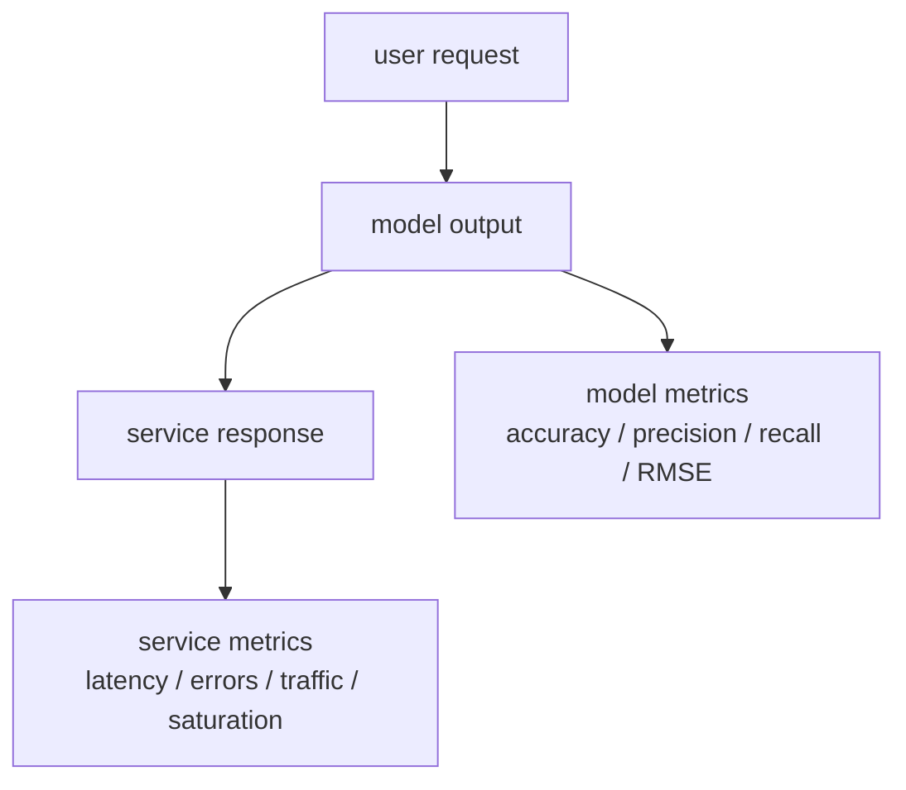
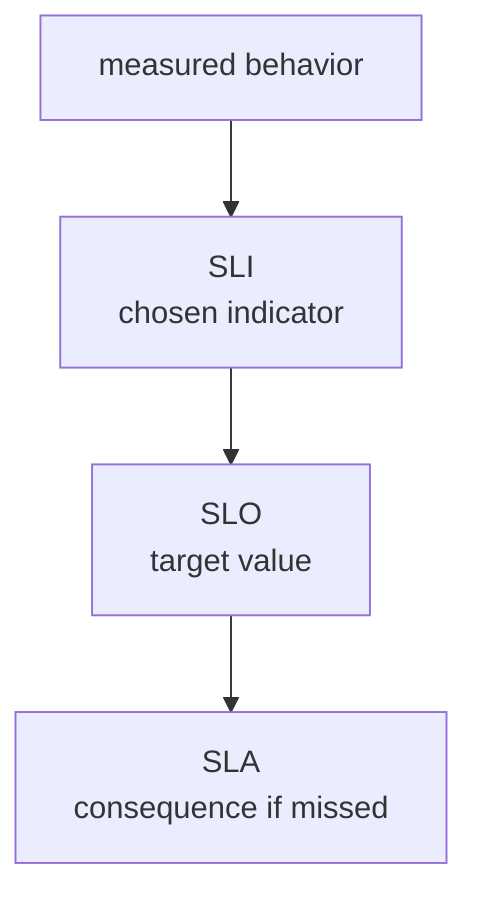
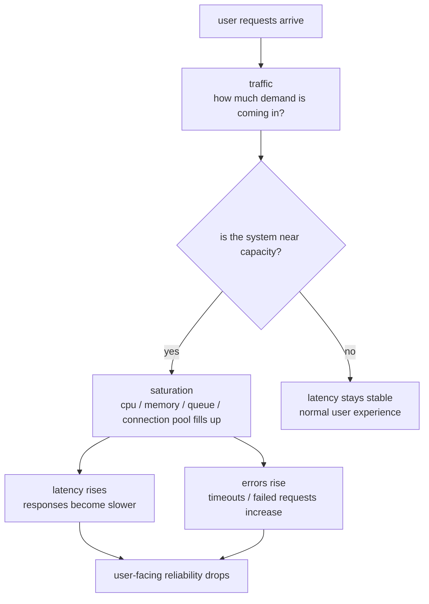
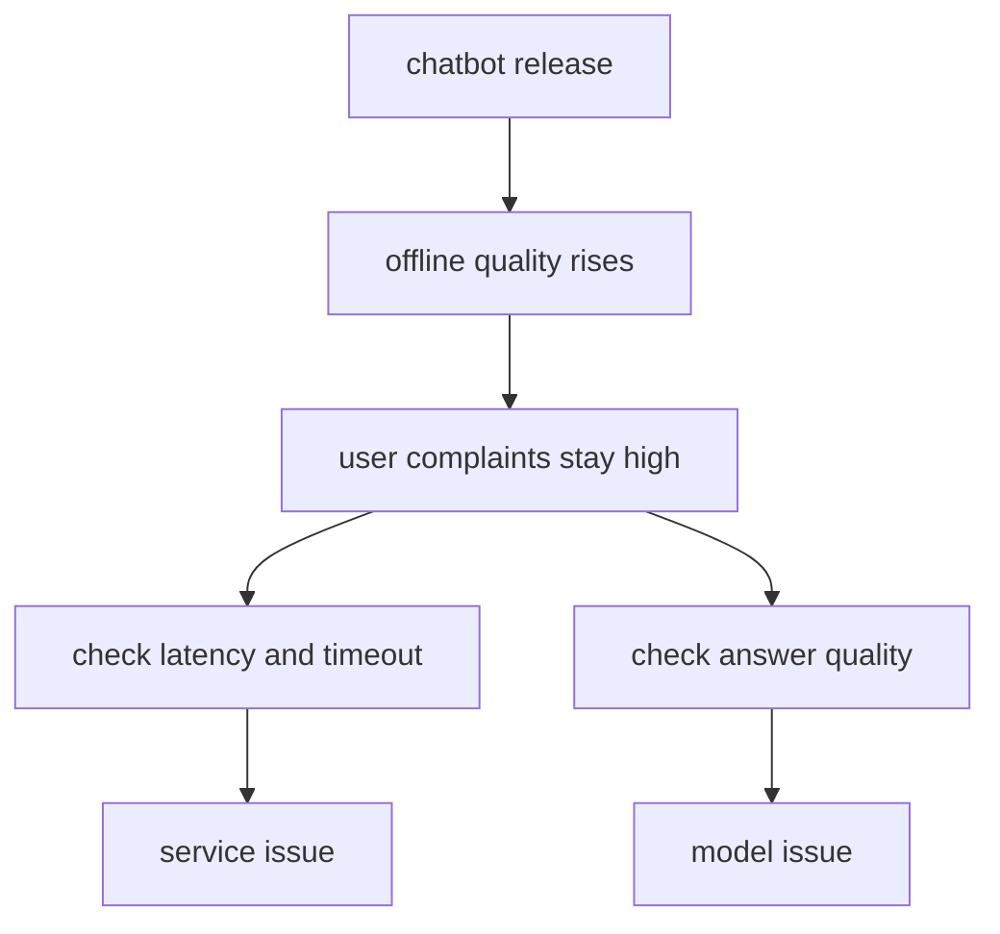

# P4-6.3 Supplementary Learning: How To Read Metrics In Site Reliability Engineering

> Section ID: `P4-6.3`
> Version: `v2026.07.11`

P4-6.1 and P4-6.2 looked at model evaluation metrics. Now the gaze moves a little outward. A model fitting well and a service operating well do not mean the same thing. To understand that difference, it helps to see how the word `metric` is used in SRE, or site reliability engineering.

This Section does not replace an introductory SRE book. It has one purpose. It organizes as supplementary learning where `the numbers used to read model quality` and `the numbers used to read service state` resemble each other and where they split apart.

## Scope Of This Supplementary Learning

This Section is a supplementary learning Section that separates machine-learning evaluation metrics from operational metrics. It connects SLI, SLO, SLA, error budget, and the operational signals often read as latency, traffic, errors, and saturation at an introductory level.

This Section answers the following questions.

- Why are a good model and a good service not the same thing?
- What differs between machine-learning metrics and SRE metrics?
- What is the relationship among SLI, SLO, and SLA?
- In operations, why are distribution, percentile, and error rate often inspected together instead of only the mean?
- In AI services, why are both model evaluation and service-operation evaluation necessary?

## Goals Of This Supplementary Learning

- You can explain that model metrics and operational metrics are numbers at different levels.
- You can distinguish SLI, SLO, and SLA at an introductory level.
- You can explain why latency, traffic, errors, and saturation are the basic signals of operations.
- You can explain that in AI services, `answer quality` and `service reliability` must be inspected separately.

## Learning Background

### What Is Different Between Model Metrics And Operational Metrics?

In machine learning, a metric is mainly a number for reading prediction results. For example, values such as accuracy, precision, recall, MAE, and RMSE show how well a model fits and what kind of error it is creating.

In SRE, a metric is mainly a number for reading how the service is actually behaving. For example, values such as latency, error rate, throughput, and availability show what kind of service users are experiencing right now.

The two resemble each other in the sense that both decide `what will be measured as important`. But the target is different.

| Distinction | Question mainly being asked | Representative examples |
| --- | --- | --- |
| model metric | How correct is the prediction? Which error matters? | accuracy, precision, recall, F1, MAE, RMSE |
| operational metric | How fast and stably is the service running? | latency, error rate, throughput, availability |

Model metrics are closer to the quality of the answer, while operational metrics are closer to the state of the service.



The key point of this diagram is that even inside one AI service, two different kinds of metrics exist together.

## Main Learning Content

### A Good Model Is Not Automatically A Good Service

This distinction is especially important in AI services.

For example, a chatbot service receives the following two questions at the same time.

1. Is the answer appropriate?
2. Does the answer arrive in time?

The first is a model-quality question, and the second is a service-operation question.

| Situation | Model-side question | Operations-side question |
| --- | --- | --- |
| chatbot | Is the answer factual and useful? | Is the response time not too long? |
| spam-classification API | Does it catch spam properly? | Are failure rate and processing time stable? |
| recommendation service | Do the recommendation results match user behavior? | Does it respond without delay even when traffic spikes? |
| search service | Does it show relevant results? | Can search continue without outage? |

So even if model performance is good, service quality can still be low if latency is long or failure rate is high. By contrast, even if the service is fast and stable, the product goal is not reached if the predictions keep being wrong.

#### An Example Of Reading The Same Service Through Two Levels

The core point is that even the same service splits into two kinds of questions. Even a chatbot alone can be read like this.

| Same chatbot service | Question the model team inspects first | Question the operations team inspects first |
| --- | --- | --- |
| ordinary consultation answers | Is the answer contextually appropriate and useful? | Is it stable even when response load increases? |
| dangerous-question handling | How well does it block risky answers? | Does timeout increase after a safety filter is attached? |
| multilingual support | Is the quality gap large by language? | Is there no outage even when traffic surges in one region? |
| tool calling | Did it choose an appropriate tool? | Does an external API failure spread into total response failure? |

So even when the same product is examined, `what did it answer well?` and `does the user experience something tolerable in practice?` are different evaluation problems.

The difference becomes more intuitive when the two situations are contrasted.

| Situation | Model-metric side | Operational-metric side | Interpretation |
| --- | --- | --- | --- |
| A | answer quality is high | latency is high, timeout increases | it can be a good model but a bad service |
| B | answer quality is low | latency is low, availability is high | it can be a stable service that still fails the product goal |

This contrast gives the sense that `AI service quality = model quality + operational quality`.

The distinction between model metrics and operational metrics becomes easier to organize when you first check `is the current problem about prediction quality, or about service state?`

| Current problem being inspected | The first question to bring up | The closer metric layer |
| --- | --- | --- |
| Is the answer correct, or is the classification accurate? | Is prediction quality sufficient? | model metric |
| Has the response become slow, or have failures increased? | Is the service state something users can tolerate? | operational metric |
| The answer is good, but user dissatisfaction is large | Is it a quality problem or an operations problem? | both must be read together |

### How Are SLI, SLO, And SLA Different?

The Google SRE Book defines SLI, SLO, and SLA separately. This distinction matters. The three terms look similar, but they ask different questions.

- SLI (service level indicator): what will be measured?
- SLO (service level objective): at what level do we want to keep that measurement?
- SLA (service level agreement): what consequence follows if that promise is broken?

If the same service is used as an example, it can be read like this.

| Term | Reader question | Example |
| --- | --- | --- |
| SLI | Which number will be watched? | request latency, error rate, availability |
| SLO | At what level should that number be maintained? | p95 latency below 300ms, success rate above 99.9% |
| SLA | What happens if the target is not met? | refund, credit, contractual compensation |



This flow shows that reading numbers in operations is not simple observation. It becomes a structure that continues into `what will be promised, and how will people respond if it is missed?`

### What Does Error Budget Add?

Once an SLO is set, the idea of an error budget follows naturally. Put very simply, it is the idea of putting a number on `how far from perfect the service is still allowed to be`.

For example, if the availability target is 99.9%, the remaining 0.1% is the acceptable failure range. This concept makes two things possible at the same time.

1. It does not demand an unrealistic 100% perfection.
2. It also does not ignore failure.

| Question | What error budget does |
| --- | --- |
| How much failure is allowed? | It shows the allowed range in numbers |
| Is the service being operated too dangerously right now? | It makes people inspect how much failure room remains |
| Is it acceptable to deploy more aggressively? | It helps balance service reliability and development speed |

So error budget is not `a concept that allows failure`. It is `a concept that keeps failure inside a manageable range`.

#### Reading Error Budget Through Work Intuition

Error budget can sound abstract. But in practice, it can be read as a criterion for deciding `is it still okay to change things aggressively, or should stabilization come first for a while?`

| Situation | When the error budget is still roomy | When the error budget is almost gone |
| --- | --- | --- |
| deployment of a new feature | more experiments and deployments can be attempted | operations should become conservative |
| model replacement | there is room to test a new model | stabilization may come before quality improvement |
| infrastructure change | structural improvement work can be pushed forward | changes with high outage risk may be postponed |

So error budget is not only a number for the operations team. It is also `a signal of change speed` read together by product teams and development teams.

### Why Do Operations Look At Distribution And Percentiles More Than A Mean?

The Google SRE Book explains that in operations, a simple mean can hide important facts. In particular, for latency, looking only at the mean can hide the tail.

For example, even if the average response time is 100ms, users may still feel the service is slow if some requests take 5 seconds. That is why operations often inspect percentiles such as p95 and p99.

It can be organized like this.

| Way of reading the number | What it shows | Why it matters |
| --- | --- | --- |
| mean | the overall central feel | it gives a simple summary at a glance |
| median, or p50 | the experience of an ordinary user | it is less affected by extreme values |
| p95, p99 | the slow tail region | it reveals bad experiences for a subset of users |

So in operations, reading numbers does not ask only `is it okay on average?` It also asks `how severe is the most inconvenient region?`

### The Four Golden Signals Of SRE

The Google SRE Book presents latency, traffic, errors, and saturation as four especially important signals for user-facing systems.

| Signal | Reader question | Intuition |
| --- | --- | --- |
| latency | How long does the response take? | If it is slow, users feel it immediately |
| traffic | How many requests are coming in? | It shows how large the demand is |
| errors | How much is failing? | It shows how often the service is wrong or stopped |
| saturation | How full is the system? | It shows whether the system is nearing a limit |

These four can be used like basic coordinates for an operations perspective.



This diagram shows the four signals not as a list to memorize, but in the order an operations team actually reads them. First traffic is used to ask `how many requests are coming in right now?` Then saturation is used to ask `is the system near its limit?` If it is near its limit, latency and errors emerge as user-facing problems, and service reliability is shaken as a result. By contrast, if saturation is not high, the team checks whether latency remains stable and confirms a normal state.

These four signals do not replace machine-learning metrics. Instead, they help check `is the good model actually being delivered as a good user experience?`

#### Applying The Four Signals To AI Service Scenes

The four signals stay better in memory when placed into scenes instead of being memorized as abstract terms.

| Signal | Example when read in a chatbot service | Example when read in a classification API |
| --- | --- | --- |
| latency | Does the answer arrive within 1 second, or does it take 8 seconds? | Does the classification result return inside a real-time request? |
| traffic | How many users are asking simultaneously right now? | How many classification requests per second are entering? |
| errors | Are timeout, 5xx, and tool-call failures increasing? | Are request failures and malformed responses increasing? |
| saturation | Are GPU, CPU, memory, and connection pools filling up? | Are worker count, queue length, and network nearing a limit? |

This table makes it even clearer that operational metrics read `is the system holding up?`

## Detailed Learning Content

### Knowing SRE Metrics Makes Machine-Learning Metrics Feel Less Strange

If a software engineer is already familiar with SRE metrics, machine-learning metrics can also feel easier to accept as a different kind of decision number.

- If you look at latency, you ask `what is slow?`
- If you look at error rate, you ask `what fails often?`
- If you look at precision and recall, you ask `which kind of prediction mistake is more problematic?`

So in the end, both worlds decide `what will be measured`, `which failure will be reduced`, and `by what criterion will people react?` The difference is whether the target is the model or the service.

## Cases And Examples

### Case 1. Answer Quality Improved, But Complaints About The Chatbot Still Rise

An operations team improved its customer-support chatbot. By human judgment, the answers became richer, and offline evaluation also showed better classification accuracy and response appropriateness.

But actual user complaints do not fall. When the team checks why, it finds that during peak periods response delay grows and timeout increases, so even good answers often arrive too late. This scene shows that model metrics and operational metrics are looking at different levels.



Here the model metric reads `the quality of the answer`, and the operational metric reads `the service experience`. Even if answer appropriateness is high, service quality can feel low when latency and error rate are bad. By contrast, even if the service is fast, the goal still fails if the answers are inaccurate.

The checkable result appears when the two kinds of numbers are placed side by side. If p95 latency, timeout rate, and availability are inspected together with the offline evaluation score, it becomes possible to explain why `a good model` does not automatically mean `a good service`.

## Cases And Examples

### Reading It Again Through Social And Work Examples

Metrics from an SRE perspective are not just server numbers. They connect to actual service experience.

| Scene | What the model metric mainly asks | What the operational metric mainly asks |
| --- | --- | --- |
| medical consultation chatbot | Is the answer appropriate? Does it avoid missing dangerous symptoms? | Is response delay too long? Is outage too frequent? |
| welfare consultation system | Are classification and recommendation appropriate? | Does it hold up even during heavy application periods? |
| financial fraud-detection API | How well does it avoid missing fraud? | Can it process the real-time flow of transactions without delay? |
| public complaint-classification service | Does it send complaints to the correct department? | Does failure rate surge when request volume spikes? |

In work settings, it can be read like this.

| Work question | What is read through the model metric | What is read through the operational metric |
| --- | --- | --- |
| Is the result correct? | precision, recall, F1, RMSE | it cannot answer directly |
| Are users not being kept waiting? | it cannot answer directly | latency, timeout rate |
| Is outage frequent? | it cannot answer directly | error rate, availability |
| Can traffic spikes be endured? | it cannot answer directly | traffic, saturation |

The core point shown by this table is simple.

`Model metrics and operational metrics are not competitors. They are complementary because they answer different questions.`

#### Reading Social Examples A Little More Concretely

The reason to read the two metric layers together becomes even clearer in services that have social impact.

| Scene | What is easy to miss if only model quality is inspected | What is easy to miss if only operational quality is inspected |
| --- | --- | --- |
| medical consultation chatbot | dangerous-symptom answers may still be inaccurate | the service may be fast while still giving wrong guidance |
| welfare consultation system | people who need support may be classified incorrectly | the service may be stable while repeating wrong guidance |
| financial fraud detection | it may miss fraud or block normal transactions too aggressively | if the real-time API is slow, the whole transaction flow is delayed |
| public complaint classification | complaints may be sent wrongly and cause administrative delay | even if classification is correct, citizen experience becomes worse if the service fails during peak intake |

So in systems connected to social phenomena, `correct judgment` and `stable operation` must both exist together.

#### Examples That Come To Mind Immediately In Technical Work

If it is rewritten into examples that feel closer to technical work, it can be read like this.

| System | Example model metrics | Example operational metrics | Actual judgment |
| --- | --- | --- | --- |
| spam-classification API | precision, recall, F1 | p95 latency, error rate | even if it catches spam well, it harms mail flow if it is too slow |
| recommendation system | offline performance tied to click rate and conversion | throughput, availability | even if recommendation quality is good, outage during peak hours weakens the value |
| search ranking service | quality metrics such as relevance and NDCG | tail latency, saturation | both result quality and response speed must be read together |
| anomaly-detection system | whether false negatives were reduced | alert noise, queue delay | even good detection becomes hard to operate with if alerts are too late or too many |

## Practice And Examples

### Reading p95 Latency Through A Python Example

It becomes immediately clear what gets missed when only the mean is read in operations. The following example shows that when a few requests are very slow, the mean and p95 tell different stories.

Problem situation:

- In operational metrics, looking only at the mean can hide a few very slow requests

Input:

- a list of request latencies `latencies_ms`

Expected output:

- sorted latency list
- mean latency
- p95 latency

Concept to check:

- the mean and the percentile show different kinds of user experience
- a metric such as p95 is needed to read tail latency

```python
latencies_ms = [95, 100, 98, 102, 97, 105, 99, 101, 96, 110, 480, 520]

sorted_latencies = sorted(latencies_ms)
mean_latency = sum(sorted_latencies) / len(sorted_latencies)

index_95 = int(len(sorted_latencies) * 0.95) - 1
index_95 = max(0, min(index_95, len(sorted_latencies) - 1))
p95_latency = sorted_latencies[index_95]

print("sorted latencies:", sorted_latencies)
print("mean latency    :", round(mean_latency, 2), "ms")
print("p95 latency     :", p95_latency, "ms")
```

The output is as follows.

```text
sorted latencies: [95, 96, 97, 98, 99, 100, 101, 102, 105, 110, 480, 520]
mean latency    : 158.58 ms
p95 latency     : 480 ms
```

This example raises the following questions.

- If the mean is only about 158ms, why can users still feel it is much slower?
- How strongly do a few slow requests shake the user experience?

Ways to experiment directly:

- Change `480` and `520` to `180` and `220`
- Add one more slow request
- See whether the mean or p95 shakes first more strongly

So the reason operations inspect percentiles is to reveal the slow tail hidden behind `an average that looks fine for most cases`.

### Reading Error Budget Through A Python Example

Error budget feels abstract if heard only as a concept. The next example is an exercise that calculates the SLO and remaining budget from a very simple record of successes and failures.

Problem situation:

- Error budget stays abstract if only read as a definition, so a sense develops better when allowed failure rate and actual failure rate are calculated directly from success/failure records

Input:

- request success/failure record `requests`
- target SLO `slo_target`

Expected output:

- total request count
- availability
- allowed failure rate
- actual failure rate
- remaining budget

Concept to check:

- error budget lets people read the allowed failure range as a number
- if the remaining budget becomes negative, failure has already gone beyond the target

```python
requests = [
    "ok", "ok", "ok", "ok", "ok",
    "ok", "ok", "fail", "ok", "ok",
    "ok", "fail", "ok", "ok", "ok",
    "ok", "ok", "ok", "ok", "ok",
]

slo_target = 0.95

total_requests = len(requests)
successful_requests = sum(1 for item in requests if item == "ok")
availability = successful_requests / total_requests
error_budget = 1 - slo_target
actual_failure_rate = 1 - availability
remaining_budget = error_budget - actual_failure_rate

print("total requests      :", total_requests)
print("successful requests :", successful_requests)
print("availability        :", round(availability, 3))
print("slo target          :", slo_target)
print("allowed failure rate:", round(error_budget, 3))
print("actual failure rate :", round(actual_failure_rate, 3))
print("remaining budget    :", round(remaining_budget, 3))
```

The output is as follows.

```text
total requests      : 20
successful requests : 18
availability        : 0.9
slo target          : 0.95
allowed failure rate: 0.05
actual failure rate : 0.1
remaining budget    : -0.05
```

This result can be read as `the current failure rate has already exceeded the allowed range`.

Ways to experiment directly:

- Reduce one `"fail"`
- Change `slo_target` to `0.99`
- See how the remaining budget changes when the total request count stays the same but the failure count shifts slightly

So error budget is not vague anxiety. It is a way to read in numbers `is there still allowed room left, or not?`

### Reading Model Quality And Operational Quality Together Through A Python Example

Now place the two kinds of numbers together for the same service.

Problem situation:

- In AI services, both model quality and operational state matter, so it is useful to practice reading the two kinds of numbers together

Input:

- precision and recall for each case
- p95 latency and error rate for each case

Output:

- judgment of model quality for each case
- judgment of service state for each case
- an interpretation sentence after reading both kinds of numbers together

Concept to check:

- a good model does not automatically become a good service
- model metrics and operational metrics are decision criteria at different levels

```python
service_cases = [
    {
        "name": "case_A",
        "precision": 0.91,
        "recall": 0.88,
        "p95_latency_ms": 420,
        "error_rate": 0.06,
    },
    {
        "name": "case_B",
        "precision": 0.72,
        "recall": 0.68,
        "p95_latency_ms": 180,
        "error_rate": 0.01,
    },
]

model_precision_threshold = 0.85
model_recall_threshold = 0.85
latency_threshold_ms = 250
error_rate_threshold = 0.02

for case in service_cases:
    model_ok = (
        case["precision"] >= model_precision_threshold
        and case["recall"] >= model_recall_threshold
    )
    service_ok = (
        case["p95_latency_ms"] <= latency_threshold_ms
        and case["error_rate"] <= error_rate_threshold
    )

    if model_ok and not service_ok:
        interpretation = "model is strong, but service reliability is weak"
    elif not model_ok and service_ok:
        interpretation = "service is stable, but model quality is weak"
    elif model_ok and service_ok:
        interpretation = "model quality and service reliability are both acceptable"
    else:
        interpretation = "both model quality and service reliability need work"

    print(case["name"])
    print(
        "  model quality :",
        "good" if model_ok else "needs work",
        f"(precision={case['precision']}, recall={case['recall']})",
    )
    print(
        "  service state :",
        "stable" if service_ok else "unstable",
        f"(p95 latency={case['p95_latency_ms']}ms, error rate={case['error_rate']})",
    )
    print("  interpretation :", interpretation)
```

The output is as follows.

```text
case_A
  model quality : good (precision=0.91, recall=0.88)
  service state : unstable (p95 latency=420ms, error rate=0.06)
  interpretation : model is strong, but service reliability is weak
case_B
  model quality : needs work (precision=0.72, recall=0.68)
  service state : stable (p95 latency=180ms, error rate=0.01)
  interpretation : service is stable, but model quality is weak
```

The key of this example is that the two cases are not compressed into one score. In `case_A`, model quality is good but operational state is unstable. In `case_B`, the service is stable but model quality is insufficient. In other words, the next action must change depending on which number is bad.

- In `case_A`, p95 latency and error rate should be fixed before precision or recall.
- In `case_B`, model improvement or checking data quality may come before infrastructure work.
- In the end, AI service operations become clearer only when `is the model weak?` and `is the service weak?` are separated.

## Connection To Later Chapters

- In P4-7.1 on feature selection and P4-7.2 on preprocessing, input design that changes model metrics becomes important again. This Section keeps hold of the point that operational metrics still sit at another level beyond that.
- In P4-8.1 on model selection, P4-8.2 on baselines, P4-9.1 on hyperparameters, and P4-9.2 on tuning and validation cost, the question becomes how model performance numbers should be compared. Even there, the distinction must remain that latency and availability in service operations are different numbers.
- While learning algorithms from P4-10 through P4-18, classification, regression, and clustering metrics return again and again. This Section prepares in advance the connection that once those algorithms are deployed into a real service, operational metrics are still needed separately.
- In P4-19 on reinforcement-learning algorithms, another evaluation perspective opens through reward and cumulative outcome. So this Section also plays the role of preparing more broadly the feeling that `the numbers to be read differ by problem`.

## Perspective To Remember In This Section

- Model metrics read prediction quality, and operational metrics read service state.
- A good model is not automatically a good service, and a good service is not automatically a good model.
- SLI is the measured value, SLO is the target value, and SLA is the promise and consequence.
- In operations, multiple signals such as percentile, error rate, availability, and saturation are read together instead of only one average.
- AI services must manage model quality and service reliability at the same time.

## Checklist

- Can you explain why `a good model` and `a good service` are not the same thing?
- Can you distinguish whether the current problem is a precision/recall problem or a latency/error-rate problem?
- Can you explain at an introductory level what SLI, SLO, and SLA each ask?

## When Should This Perspective Come To Mind First

- Bring up this Section when you need to check whether model metrics and operational metrics are being read as if they belonged to the same scoreboard.
- Return to this Section when you need to explain again what layer of question is answered by SLI, SLO, SLA, and by latency/traffic/errors/saturation.
- This Section becomes the criterion when organizing why AI services need to inspect both model quality and service reliability together.

## Sources And References

- Google SRE, `Service Level Objectives`, Site Reliability Engineering Book, accessed 2026-06-26. [https://sre.google/sre-book/service-level-objectives/](https://sre.google/sre-book/service-level-objectives/){: target="_blank" rel="noopener noreferrer" }
- Google SRE, `Monitoring Distributed Systems`, Site Reliability Engineering Book, accessed 2026-06-26. [https://sre.google/sre-book/monitoring-distributed-systems/](https://sre.google/sre-book/monitoring-distributed-systems/){: target="_blank" rel="noopener noreferrer" }
