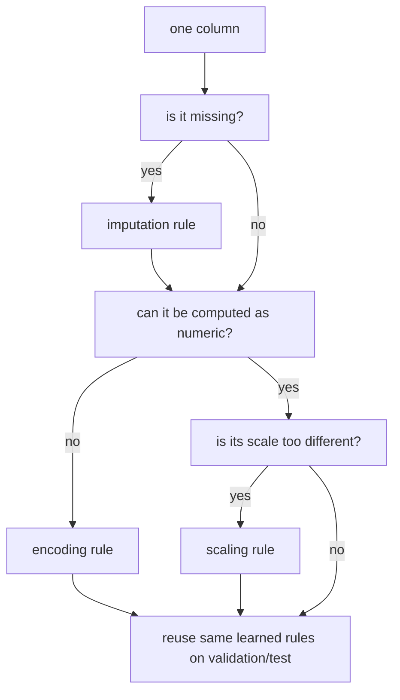

# P4-7.3 Supplementary Learning: What Input Problems Do Missing Values, Scale, And Encoding Correspond To?

> Section ID: `P4-7.3`
> Version: `v2026.07.11`

In P4-7.2, the broad meaning of preprocessing was established as `the work of changing raw input into a representation the model can calculate with`. But when readers first learn preprocessing, confusion immediately appears. Some columns are empty, some have wildly different numeric magnitudes, and some are strings, so it is not always intuitive why all three are handled under the single word preprocessing.

The purpose of this supplementary learning is not to add more preprocessing technique names. Rather, it is to create a criterion that first looks at `what problem has appeared in the current input` and then separates the kinds of preprocessing that should be brought to mind for that problem.

## Scope Of This Supplementary Learning

This Section answers the following questions.

- What input problem does missing-value handling answer, what problem does scale adjustment answer, and what problem does encoding answer?
- When looking at one column, what should be checked first?
- Does one column need only one preprocessing rule, or can several rules be attached together?
- Even after separating preprocessing types, why must the rules learned on train still be reused?

This Section does not treat the following topics deeply.

- formula differences among mean, median, robust scaling, and target encoding
- individual library syntax and detailed API options
- comparison among filter, wrapper, embedded, and dimensionality reduction

The distinction among filter, wrapper, embedded, and dimensionality reduction is revisited in the next Section, P4-7.4.

## Goals Of This Supplementary Learning

- You can distinguish preprocessing types not by `technique name` but by `type of input problem`.
- You can inspect one column by first checking `is it empty`, `is its magnitude axis unstable`, or `is it an uncomputable representation`.
- You can explain that even the same column can need several rules in sequence, such as missing-value handling and encoding.
- You can reconnect the point that even after preprocessing types are separated, rule learning must still happen only on train.

## First Grasp The Big Picture

Preprocessing types are usually not separated by column name, but by `what is currently blocking calculation`.

| Problem seen first in the input | Preprocessing to bring to mind first | Key question |
| --- | --- | --- |
| the value is empty | imputation | by what rule should this blank be handled |
| the numeric magnitude axes are too different | scaling | how should these numbers be compared fairly |
| strings, categories, or tiers are mixed in | encoding | how should this value be changed into a calculable representation |

The key point is that `preprocessing types` split not by the surface form of a column, but by `the reason calculation is being blocked`.

For example, `age` is a numeric column, but if it has empty values, it also needs missing-value handling. `membership_tier` is a categorical column, so it may need encoding, and if it also contains empty values, missing-value handling can come first there too. In other words, readers quickly get stuck if they think only one preprocessing rule can attach to one column.

## When Looking At One Column, What Should Be Asked First?

When preprocessing is first being separated, the safest approach is usually to look at one column and ask in the following order.

1. Is this value empty?
2. Can this value be calculated with directly as a number?
3. If it is numeric, is its magnitude axis excessively different when compared with other columns?
4. Is this value an ordered category or an unordered category?

If this order is applied to an example customer table, it becomes the following.

| Column | Problem seen first | Judgment attached first |
| --- | --- | --- |
| `age` | some values are empty | first inspect whether missing-value handling is needed |
| `monthly_spend` | the numeric range is very large | inspect whether scale adjustment is needed |
| `city` | it is a string category | encoding is needed |
| `membership_tier` | it is a category but may carry order meaning | inspect whether the encoding method should preserve order meaning |

The purpose of this table is not to make readers memorize the one correct preprocessing answer. It is to build the sense that `the first question attached differs by column`.

One more point is worth holding onto here. Even `numeric columns` are not always the same kind of object to process.

| Column that looks numeric | Question to grab immediately | Example preprocessing judgment |
| --- | --- | --- |
| `monthly_spend=3200, 6100` | is the magnitude axis very different from other numeric columns | review scale adjustment |
| `age=29, 35` | are there empty values, and is the unit difference too large | missing-value handling first, scaling depending on the case |
| `zip_code=06236` | does this value represent magnitude, or is it a categorical identifier | even if it looks numeric, it may be a category/identifier, so review encoding or exclusion |

That means preprocessing is not determined by data-type names alone. It also requires reading `what meaning this number actually has`.

Categorical values work the same way. If readers think `if it is a string, use one encoding`, confusion comes immediately.

| Categorical example | Question to grab first | More natural judgment |
| --- | --- | --- |
| `city = Seoul, Busan, Incheon` | is there an order of larger and smaller among them | usually treat as an unordered category and encode |
| `membership_tier = bronze, silver, gold` | should the stage order be preserved | first review whether order meaning should be retained |
| `status = pending, approved, rejected` | is the difference a transition of order or merely a distinction of state | read the work meaning first and then review the encoding method |

That means even the encoding judgment should not stop at `it is a string`. It has to go one step further to `does this category need only distinction, or does order matter too`.

## Several Rules Can Attach To The Same Column

When readers first encounter preprocessing, it is easy to think one column receives only one kind of treatment, such as `this column is for encoding` or `that column is for scaling`. In reality, that is not how it works.

For example, if `membership_tier` is a string category and some values are empty, it should be read as follows.

1. Decide how the empty values should be handled.
2. Then decide how the categorical representation should be encoded.

Numeric columns are similar.

1. If there are empty values, decide first whether missing-value handling is needed.
2. If the numeric magnitude differences are large, review scale adjustment.

That means preprocessing types are not `mutually exclusive menu items`, but `bundles of rules that can attach to the same input row one after another`.

This flow shows that the question `how should preprocessing types be distinguished` is ultimately the same as the question `in what order should input problems be diagnosed`.

## What Misunderstandings Appear If The Wrong Preprocessing Type Is Chosen?

The reason preprocessing distinctions become confusing is that even if the problem is read incorrectly, it can still look on the surface as though something was processed.

| Incorrect reading | Actual problem | Why it is dangerous |
| --- | --- | --- |
| it is a string column, so any number can be assigned to it | an encoding problem that misrepresents category meaning | the model can read an order that does not exist |
| it is a numeric column, so matching the scale is enough | a missing-value problem still remains | calculation can still break or become distorted |
| the value is empty, so filling with the mean is enough | the emptiness itself may be an important signal | the meaning of missingness can be erased |

The key point shown by this table is simple. What matters in preprocessing is not `it was processed`, but `what problem was judged to have been processed`.

## Look At The Input Problem Before Looking At The Model

When reading preprocessing explanations, readers quickly run into statements such as `this model is sensitive to scale` and `that model is less sensitive`. This information matters, but for a beginner it is not the first question.

First, readers need to look at `what the input problem is`.

- If there are empty values, inspect missing-value handling first.
- If there are string categories, inspect encoding first.
- If the numeric axes differ greatly, review scale adjustment.

Only after that is it stable to add `which models are more sensitive to this problem`. For example, distance-based models or gradient-based optimization can be affected more directly by scale, but before that readers first need to know `is the problem really that numeric axes differ in scale`.

That means the first order of preprocessing is not `model name -> technique choice`, but `input problem -> preprocessing type -> inspect model sensitivity`.

## Why Is Reusing Rules Learned On Train Still Important Here?

Even if preprocessing types are separated correctly, a problem returns if the place where the rule was learned is wrong.

For example:

- If the median for missing values is computed by mixing in test rather than only train, evaluation leaks.
- If the list of encoding categories is built from the whole dataset first, it means information was seen in advance that would not be available in the real deployment scene.
- If scaling references are set using the mean and variance of the whole dataset, the comparison is no longer fair.

So the judgment that separates preprocessing types and the location where the rules are learned need to be remembered separately.

| Question | Where it should be answered |
| --- | --- |
| what preprocessing type is needed | this current Section that reads the input problem |
| where should that rule be learned | the train-based reuse principle of P4-7.2 |

If readers separate them this way, they avoid mixing up `what rule is needed` and `where that rule was learned`.

## Cases And Examples

### Example 1. Even In The Same Customer Table, The First Preprocessing Question Differs By Column

Look again at the following simple customer table.

| age | monthly_spend | city | membership_tier |
| --- | ---: | --- | --- |
| 29 | 3200 | Seoul | gold |
| none | 6100 | Busan | silver |
| 35 | none | Incheon | none |

When reading this table, the preprocessing judgments usually split as follows.

| Column | Input problem | Rule to bring to mind first |
| --- | --- | --- |
| `age` | there is an empty value | missing-value handling |
| `monthly_spend` | there is an empty value and the numeric range may be large | review scale after missing-value handling |
| `city` | it is a string category | encoding |
| `membership_tier` | it is empty, categorical, and may need order review | review encoding method after missing-value handling |

What matters here is not `memorizing four preprocessing techniques`, but the fact that even with the same table, the first question attached differs by column.

## Perspective To Remember In This Section

- Preprocessing types are separated not by column name, but by `type of input problem`.
- Even one column can receive several rules in sequence, such as missing-value handling and encoding.
- The first order of preprocessing is `input problem -> preprocessing type -> inspect model sensitivity`.
- Even after preprocessing types are divided, rule learning must still happen only on train.

## Short Check

- In the column you are looking at now, which is the first problem: `empty value`, `magnitude axis`, or `uncomputable representation`?
- Are you oversimplifying by thinking only one preprocessing rule can attach to one column?
- Are you distinguishing `what rule is needed` from `where that rule was learned`?

## Sources And References

- scikit-learn developers, [Preprocessing data](https://scikit-learn.org/stable/modules/preprocessing.html){: target="_blank" rel="noopener noreferrer" }, accessed 2026-07-08.
- scikit-learn developers, [Imputation of missing values](https://scikit-learn.org/stable/modules/impute.html){: target="_blank" rel="noopener noreferrer" }, accessed 2026-07-08.
- Aurélien Géron, *Hands-On Machine Learning with Scikit-Learn, Keras, and TensorFlow*, 3rd ed., O'Reilly Media, 2022, accessed 2026-07-08.
