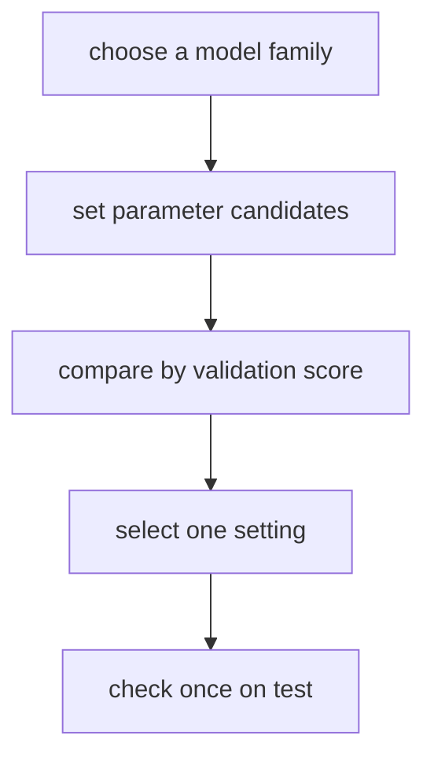
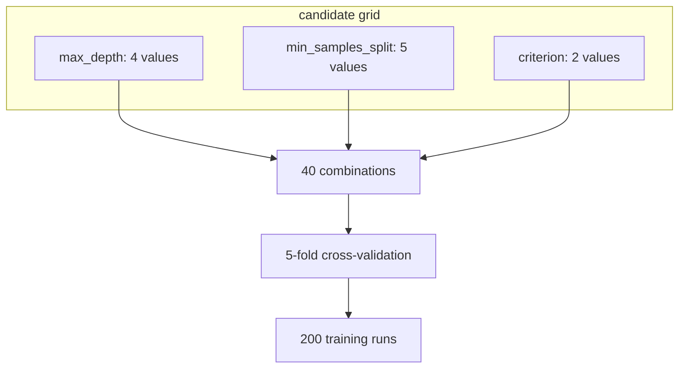
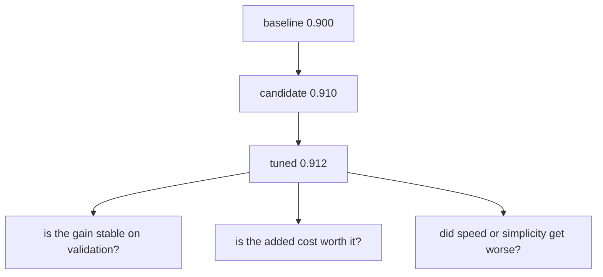
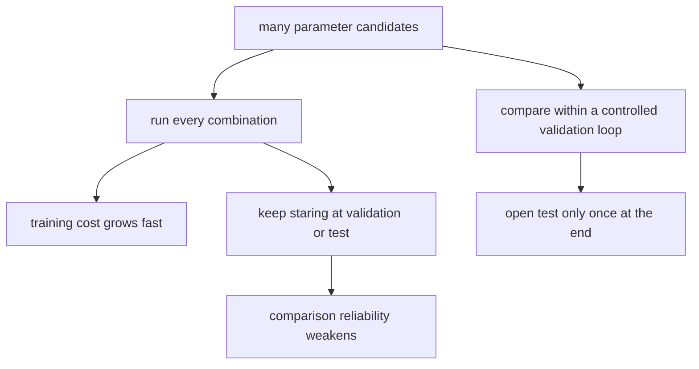

# P4-9.2 Tuning And Validation Cost

> Section ID: `P4-9.2`
> Version: `v2026.07.11`

In P4-9.1, the discussion examined what a hyperparameter is and why it has long been treated as a separate topic. Now it moves to the next question.

How should configuration values that look promising actually be chosen?

That question is exactly the starting point of tuning.

Tuning is often understood as `trying many different values`. In practice, it is a narrower and stricter task than that. Tuning is not merely the process of increasing performance numbers, but the work of comparing hyperparameter candidates inside a verifiable procedure and managing together the computational cost and validation cost required for that comparison.

That means tuning is indeed `finding better values`, but at the same time it is also `experiment design that does not break the comparison`.

This Section does not repeat at length the definition of the hyperparameter itself. The basic distinction between `learned values` and `values fixed in advance` reconnects through P4-9.1 and the [concept glossary](../../../reference/concept-glossary.md), while this Section concentrates only on how those setting values should be compared and managed.

## Scope Of This Section

This Section answers the following questions.

- What kind of work is tuning?
- Why is touching many hyperparameters not always good?
- Why does validation cost arise?
- Why should test data be used only at the end?
- How should grid search and random search be understood at an introductory level?

This Section does not treat the following topics deeply.

- advanced search techniques such as Bayesian optimization and Hyperband
- detailed procedures of nested cross-validation
- distributed tuning infrastructure and experiment-tracking systems

The bigger picture of Bayesian optimization, Hyperband, nested cross-validation, experiment tracking, and distributed tuning is reorganized again in the supplementary learning of P4-9.3.

## Goals Of This Section

- You can explain tuning as `the work of comparing setting values inside a validation procedure`.
- You can distinguish computational cost from validation cost.
- You can explain why it is dangerous to choose settings while repeatedly looking at test data.
- You can describe the difference between grid search and random search at an introductory level.
- You can understand why, when reading improvement after the baseline, the validation procedure matters more than the tuning log itself.

## Learning Background

Up to P4-8.2, the discussion organized `what should be used as the comparison standard`, and in P4-9.1 it examined `what kinds of setting values exist inside the same model family`. But if the discussion stops there, the experiment is still only half prepared.

- Even if there are candidate models, the comparison becomes unstable if readers do not decide how the setting values will be chosen.
- The more setting-value candidates there are, the more computation time and experiment count increase.
- If the validation procedure is loose, a value that looks good by chance can be mistaken for real improvement.

In other words, this Section is the stage that moves from the fact that `there are hyperparameters` to the fact that `a fair method for choosing those hyperparameters is needed`.

If one more point is fixed here, the interpretation of the tuning Section becomes less unstable. Tuning is the work of changing `numbers inside the model`, but before that the notes about `what is being treated as one sample`, `what baseline it is being compared against`, and `what error scene is being reduced` should already be fixed. Without these notes, even if the validation score rises a little, it is hard to explain what actually improved. The score gap should first be read as a signal of change, and explanation of cause should be added only after representative error cases and input representation are checked again.

| What should be left first before tuning | Why it is needed |
| --- | --- |
| sample unit and input representation | because even with the same model, the meaning of comparison changes depending on whether raw time series are used directly or changed into one-action summary rows |
| baseline and current candidate score | because the reader must read what tuning improved beyond the starting point |
| representative error cases or large-error regions | because it must be checked what failures the rise in score actually reduced |
| review notes | because grounds must be left for what settings should be narrowed or widened next |

The order of tuning comparison is fixed briefly as follows.

| What to look at first | Question that comes immediately next | What to confirm only at the end |
| --- | --- | --- |
| validation comparison between baseline and candidate model | did this setting change actually reduce the same error scene | does the test score really follow in the same direction |
| problematic cells in the confusion matrix and representative error cases | is the score rise a reduction in FN, FP, or large errors | does this improvement justify increased computational cost and complexity |
| validation differences among candidate settings | is this value only accidentally good, or is it similar even when repeated | what candidate should be narrowed further in the next Section or next experiment |

| Curriculum position | Role of this Section |
| --- | --- |
| after P4-9.1 | connects the existence of settings to an experiment procedure |
| before the algorithm Sections after P4-10 | provides the criterion for reading each algorithm's hyperparameters |
| before project practice | prepares the habit of looking at experiment cost and validation cost together |

## Main Learning Content

### What Does Tuning Do?

The scikit-learn documentation on hyperparameter tuning explains a procedure in which an estimator's setting values are treated as candidate sets and compared by cross-validation scores.

`Tuning is the work of fixing hyperparameter candidates in advance and choosing the settings that better fit the current data and objective by comparing validation scores.`

Two things are important here.

1. The reader is not changing any value infinitely at random.
2. The comparison must be made through validation procedures inside train.

That means tuning is not the work of intuitively pointing at `a value that looks good`, but the work of comparing within a pre-fixed candidate space and validation rule.



This diagram shows that the core of tuning is `the procedure that, after choosing a model, compares candidate settings by validation score and checks test only at the very end`. What is especially important here is the role separation that `test is not for selection, but for final confirmation`.

The core of this diagram is that `test is used only once at the end`. The body of tuning lies in the `B -> C -> D` interval.

### How Are Computational Cost And Validation Cost Different?

When readers hear the word cost, they easily think only of training time. But in tuning, at least two kinds of cost must be distinguished.

| Type of cost | Meaning |
| --- | --- |
| computational cost | the time, memory, and GPU/CPU resources required to train models many times and produce scores |
| validation cost | the risk of overfitting that arises while repeatedly looking at validation data to choose settings |

Computational cost is relatively visible.

- The more candidate values there are, the longer it takes.
- The more cross-validation folds there are, the longer it takes.
- The longer one model takes to train, the larger the total tuning time becomes.

Validation cost, however, does not appear directly like a number. That is why it can be more dangerous.

- If the reader stares at validation scores for too long, choices may start fitting the validation data.
- Then the model can look good on validation, but not be that good on truly new data.

That means computational cost is the issue of `how expensive it is`, while validation cost is the issue of `how trustworthy the comparison is`.

Validation cost should also be read as `the cost of repeated experiment records`. If the reader only writes the score and moves on, it becomes hard later to check how many times validation was run, which candidates were discarded, and what kept remaining as the same error. In other words, validation cost includes not only computation volume, but also `the burden of leaving comparison records that can be read again later`.

The diagram below shows in the simplest form why computational cost grows so quickly.



This diagram shows that once hyperparameter candidates grow even a little, the actual number of training runs can rapidly grow multiplicatively. That means tuning is not simple value play, but work that must manage computational cost together with experiment design.

## Detailed Learning Content

### Why Should Test Data Be Used Only At The End?

The scikit-learn common pitfalls documentation explains that if test data are mixed into model selection or preprocessing, performance estimation can look overly optimistic. This principle applies in exactly the same way to tuning.

`Test is for checking scores, not for decision-making.`

In other words:

- train is for learning
- validation is for selection
- test is for final confirmation

That is the basic division.

If this order is reversed, what problem appears?

| Incorrect use | Resulting problem |
| --- | --- |
| choosing hyperparameters while looking at test scores | test can no longer play the role of truly new data |
| changing the model while checking test repeatedly | the final score can look overly good |
| referring to test even in preprocessing | leakage and overestimation can arise together |

The core of this role separation is the same as in the earlier diagram. If the order `train for learning, validation for candidate comparison, test for final confirmation` collapses, the score may look good, but trust in truly new data can fall.

The key point is that test is not `data that help comparison`, but `confirmation data left over after comparison ends`.

### How Should Grid Search And Random Search Be Understood?

scikit-learn provides grid search and randomized search as representative search methods.

They can be distinguished through the following table.

| Method | Introductory understanding |
| --- | --- |
| grid search | the method that runs every combination in a pre-fixed candidate table |
| random search | the method that draws some combinations from a fixed distribution or range and compares them |

Grid search is simple and easy to explain.

- It is clear what values were tried.
- If candidates are few, implementation and explanation are convenient.

But once candidate axes increase, it quickly becomes expensive.

For example, if there are only:

- `max_depth`: 4 candidates
- `min_samples_split`: 5 candidates
- `criterion`: 2 candidates

that already makes `4 x 5 x 2 = 40` combinations. If 5-fold cross-validation is added, actual learning can happen 200 times.

Random search does not need to inspect every combination, so it can sweep a wide space more cheaply. The paper by Bergstra and Bengio explains that if only a few axes are important for performance, random search can be more efficient.

- grid search: when a narrow candidate table should be compared carefully
- random search: when a wide candidate range should be swept more cheaply

That means the difference between them is better understood not as `the exact method name`, but as `whether every combination will be seen, or some of them will be seen strategically`.

### How Should Improvement After The Baseline Be Read?

The reason a baseline was placed first in P4-8.2 becomes clearer here. Even if the tuning result gets a little better, that does not always mean something big.

The reader can imagine scenes such as the following.

| Comparison scene | Interpretation question |
| --- | --- |
| baseline 0.90 -> candidate model 0.91 | is this gap actually meaningful? |
| candidate model 0.91 -> after tuning 0.912 | is it worth paying the increased computational cost? |
| candidate model recall rises, precision falls | what error cost was reduced? |

### What Tuning Method Should Be Used First?

Tuning also should not always be run broadly without restraint. The comparison method should be chosen to match the current number of candidates and the computation budget.

| Current situation | Method to bring to mind first | Reason |
| --- | --- | --- |
| there are few candidate values and explainable comparison matters | grid search | because it is easy to inspect every combination directly |
| the range is wide but resources are limited | random search | because it is easy to sweep a wide space by sampling part of it |
| the reader feels tempted to keep looking at test | refix the validation procedure | because test must be removed from the selection process and used only for final confirmation |
| only tiny score differences repeat | review error cases and cost again | because the meaning of the improvement should be rechecked against additional computational cost |
| the number of candidate combinations grows rapidly | reduce the search space | because computational cost grows multiplicatively |

This table helps the reader see tuning not as `the technique of running many things`, but as `the choice that manages validation procedure and cost`.

In other words, tuning is not `the work of making the number higher`, but `the work of reading what kind of improvement was obtained by spending what kind of cost`.

That is why when reading tuning, the reader must always look at three things together.

1. How much did it improve over the baseline?
2. Did it improve consistently under the validation criterion?
3. Is that improvement meaningful enough to justify the increase in computational cost and complexity?

The comparison unit must not become unstable here either. When the baseline, candidate model, and tuned model are placed side by side, they should be read, as much as possible, under the same sample unit, the same input representation, and the same error scene. Only then can the reader judge whether `the score rose a little` really means that the same failures were reduced.

If it is a classification problem, one more layer should be added by looking again at representative error cases. Even if the score rises slightly above the baseline, the model may in reality still be missing the same minority class or the same confusion region. In particular, even if a score rise appears in a recent interval, that difference alone does not automatically say why it improved.

So after tuning, the reader should not stop at `the score rose`, but should inspect again what error scene actually changed.

Only when the comparison is made on the same recent interval, the same problematic cells of the confusion matrix, and the same representative error cases can the reader speak more stably about `what truly improved`.

| What should be inspected again after tuning | Why it must be inspected again |
| --- | --- |
| key metric difference from the baseline | because the reader must first confirm how much it actually improved over the starting point |
| problematic cells in the confusion matrix | because the reader must know whether the score rise is a reduction in FP, FN, or large-error patterns |
| representative error case | because the reader must confirm whether the same type is still being missed, or whether the failure changed into something else |
| computational cost and model complexity | because the reader must judge whether a small score rise justifies longer training time and harder operations |

If this table is rewritten in the format of project notes, it becomes even clearer.

| Item to leave in experiment notes | Example |
| --- | --- |
| change from the baseline | `recall +0.03`, `MAE -0.12` |
| failure that still remained unchanged | `still missed the same minority class 2 times` |
| newly added cost | `training time tripled`, `compared 40 setting candidates` |
| next experiment question | `should the depth be increased more, or should the reader switch to another candidate model` |

Only with such notes does tuning remain not as `score optimization`, but as `repeated experimentation that preserved the comparison structure`.

If only the flow of scores is seen, it can look simple. But the questions for reading it become increasingly demanding.



### Why Can Tuning Be Stopped Early In Practice?

In practice, people do not always pursue the highest score to the end. In the following situations, it can be better to stop tuning early.

- when there is already a simple model that is sufficiently better than the baseline
- when computational cost is rising rapidly
- when improvement in the validation score becomes too small
- when interpretability or deployment speed matters more

In other words, the goal of tuning may be not `the highest number possible`, but `a model that is sufficiently good for the current objective`.

This perspective remains important in the later algorithm Sections as well, because scenes where the operational difference matters more than the performance difference appear often.

## Cases And Examples

### Case 1. Why Is It Hard To Trust The Result Immediately Even After Running Many Settings?

A team building a fraud-detection model wants to change decision-tree and random-forest settings across a wide range. The criteria people first looked at were signals such as `repeated payment in a short time`, `different region from usual`, and `transaction at a strange hour`.

They assume that the more candidates they put in, the better, and they densely try all values of `max_depth`, `min_samples_split`, and `n_estimators`. In that case, computational cost grows rapidly, and the longer they stare at validation scores, the greater the risk of mistaking a combination that happened to look good for real improvement. In particular, if they even start checking test scores in the middle, the meaning of data reserved for final confirmation also weakens.

In this scene, tuning must be read not as `changing many values`, but as `comparing candidates inside a validation procedure`. Settings must be compared through validation inside train, and test must be checked only once at the end. Even the difference between grid search and random search ultimately connects to the cost-management question of `will every combination be seen`, or `will a wide space be sampled partially`.

The confirmable result appears when the reader multiplies the number of combinations by the number of cross-validation runs and then reads separately the highest validation score and the final test score. Even if the improvement is the same 0.002, the reader must also see what multiple of computational cost and what degree of validation risk was paid for it in order for the tuning to remain explainable.



### Example 1. How Does Computational Cost Grow When Candidate Combinations Increase?

If readers look only at definitions, computational cost and validation cost can feel abstract. But when it is turned into an actual experiment scene, it becomes much clearer why the two should be viewed separately.

As seen in the earlier part of this Section, even if only a few hyperparameter axes are added, the number of combinations grows multiplicatively.

- `max_depth`: 4 candidates
- `min_samples_split`: 5 candidates
- `criterion`: 2 candidates

These three axes alone already make 40 combinations. If 5-fold cross-validation is added, actual learning can happen 200 times.

This number can still look manageable in a toy example, but in tasks where training one model takes several minutes or several hours, the meaning changes completely.

| Situation | What the same 200 training runs mean |
| --- | --- |
| small decision-tree exercise | a comparison that ends quickly |
| large text-classification model | a long experiment waiting time |
| large-scale image model | increased GPU cost and experiment schedule |

That means computational cost is not an abstract theory. It is a real constraint that directly limits `how many candidates should be entered`.

### Example 2. If Validation Is Watched For Too Long, The Comparison Procedure Itself Can Become Unstable

The scikit-learn common pitfalls documentation explains that if test data are mixed into model selection, performance estimation can look overly optimistic. The reader can easily read this warning as a story that applies only to test, but if validation is watched repeatedly for too long, a similar problem can arise in the same direction.

For example, the reader can imagine a scene like this.

1. Keep increasing candidates until the validation score rises a little.
2. Remember only settings that looked good, and discard combinations that did not.
3. Repeat tiny adjustments again and again on the same validation split.

The longer this process continues, the more the model can start fitting `accidental characteristics of that validation split` rather than `general patterns`.

`Validation is for selection, but if it is used too long for selection, it can itself partially become a learning target.`

That means validation cost is not a separate monetary cost, but `the cost that gradually erodes the trustworthiness of comparison`.

### Example 3. A Small Performance Gain Can Have Little Meaning In Operations

If the reader has already seen the baseline in P4-8.2, then the difference between the candidate model and the tuned model now needs to be read more conservatively.

For example, consider the following comparison.

| Stage | Score | First impression |
| --- | --- | --- |
| baseline | 0.900 | starting point |
| candidate model | 0.910 | looks like an improvement |
| after tuning | 0.912 | looks even better |

But before trusting this scene as it is, the reader has to ask again:

- Is the extra 0.002 improvement consistent under the validation criterion?
- How many times did the number of combinations increase for this tiny gap?
- Were prediction speed, interpretability, or operational simplicity sacrificed?

That means in practice, `a slightly higher number` and `a slightly better choice` may not mean the same thing.

### Example 4. Why Was Random Search Meaningful? Because The Entire Space Was Not Equally Important

The paper by Bergstra and Bengio explains that in hyperparameter space, often only a subset of the axes strongly shakes actual performance. That is why, rather than grid search, which sweeps all axes at equal intervals, random search, which samples some combinations more widely, can be more efficient.

- Not every axis in the search space may be equally important.
- That is why `thoroughness` does not always mean `efficiency`.
- Empirical cases show that the search method itself becomes a target of comparison.

That means tuning is not simply the work of choosing values, but the problem of experiment design that includes `by what method comparison itself will be carried out`.

## Practice And Examples

### Looking At A Small Tuning Procedure Through A Python Example

The example below is a very small exercise that places candidates for `max_depth` and `min_samples_split` for the same decision-tree model and compares them with `GridSearchCV`.

- Problem situation: flower data (iris) are treated as a classification problem of species.
- Input: four numeric features.
- Label: three species.
- Concepts to check:
  - several hyperparameter combinations can be compared through a validation procedure
  - `best_params_`, `best_score_`, and `test score` must be read separately

```python
from sklearn.datasets import load_iris
from sklearn.model_selection import GridSearchCV, train_test_split
from sklearn.tree import DecisionTreeClassifier

X, y = load_iris(return_X_y=True)

X_train, X_test, y_train, y_test = train_test_split(
    X, y, test_size=0.3, random_state=42, stratify=y
)

param_grid = {
    "max_depth": [1, 2, 3, None],
    "min_samples_split": [2, 4, 6],
}

search = GridSearchCV(
    estimator=DecisionTreeClassifier(random_state=42),
    param_grid=param_grid,
    cv=5,
)

search.fit(X_train, y_train)

print("candidate combinations:", len(search.cv_results_["params"]))
print("best params           :", search.best_params_)
print("best cv score         :", round(search.best_score_, 3))
print("test score            :", round(search.score(X_test, y_test), 3))
```

An example of the execution result is as follows.

```text
candidate combinations: 12
best params           : {'max_depth': 3, 'min_samples_split': 2}
best cv score         : 0.952
test score            : 0.933
```

What this example shows is simple.

- the number of candidate combinations is directly tied to computational cost
- `best cv score` is the score that was best inside the validation procedure
- `test score` is the final confirmation score

These two must not be read as if they were numbers in the same cell.

This toy example can also be read as a small empirical case.

- 12 candidate combinations are not a big burden in a small exercise.
- But if a few more axes are added in the same way, computational cost quickly rises.
- The fact that `best cv score` and `test score` are not the same again shows that validation and final confirmation have different roles.

For example, if the candidate model is 0.910 and after tuning it becomes 0.912, the reader does not immediately conclude deployment. First the reader has to inspect which combinations fit too much only to the same validation split, and whether the 0.002 improvement is worth the increased inference time and operational complexity. In other words, the core of the tuning Section is not memorizing `the highest score`, but checking all the way through whether `a small improvement is still a real improvement in practice`. Here too, the score gap is only a signal that raises review priority, and it does not immediately move into explanation of cause before input representation and error scenes are checked again.

## Perspective To Remember In This Section

- Tuning is the work of comparing hyperparameter candidates through a validation procedure.
- Computational cost and validation cost are different.
- Test data must be left for final confirmation only.
- Grid search can be understood as comparing everything, while random search can be understood as comparing part of the space strategically.
- Small score gaps after the baseline must be read together with cost.

After reading this Section, the following boundary should be clear.

| What this Section does now | What it does not yet conclude here | What must be viewed together to the end |
| --- | --- | --- |
| compare candidate settings inside validation | concluding immediately that it is a good model just from one `best score` | difference from the baseline, problematic cells in the confusion matrix, representative error cases, computational cost |

## Short Check

- Are you choosing settings through validation and leaving test only for final confirmation?
- Are you viewing computational cost and validation cost separately rather than mixing them as the same thing?
- When a small score rise appears, are you reviewing representative error cases and operational cost together again?

## When Should This Perspective Come To Mind First

- Bring up the tuning-procedure perspective first when candidate settings must be compared inside validation and test must be kept only for final confirmation.
- Return to this Section when computational cost and validation cost must be read separately rather than being mixed as if they were the same thing.
- This Section becomes the standard when a small score rise must be checked again through the baseline and representative error cases to see whether it is real improvement.

- Have you distinguished whether the score you are looking at came from train, validation, or test?
- Do you understand that the number of hyperparameter candidates is directly connected to computational cost?
- Can you explain why it is dangerous to choose settings while looking at test?
- Are you examining whether the improvement over the baseline is actually meaningful?
- Do you have an intuition for when grid search and random search should be used differently?

## Connection To The Next Section

By the time the reader reaches P4-9, the discussion has now prepared `choosing a model`, `setting a baseline`, and `the procedure for comparing setting values`. From that point on, the perspective of this Section keeps being reused in each algorithm chapter.

- P4-10 linear regression
- P4-11 logistic regression
- P4-12 k-NN
- P4-13 SVM
- P4-14 decision tree
- P4-15 random forest

In other words, the setting values that appear in later Sections should now be read not as `things whose names must be memorized`, but as `candidates that should be compared inside a validation procedure`.

## Sources And References

- scikit-learn, `3.2. Tuning the hyper-parameters of an estimator`, scikit-learn User Guide, accessed 2026-06-26. [https://scikit-learn.org/stable/modules/grid_search.html](https://scikit-learn.org/stable/modules/grid_search.html){: target="_blank" rel="noopener noreferrer" }
- scikit-learn, `12. Common pitfalls and recommended practices`, scikit-learn User Guide, accessed 2026-06-26. [https://scikit-learn.org/stable/common_pitfalls.html](https://scikit-learn.org/stable/common_pitfalls.html){: target="_blank" rel="noopener noreferrer" }
- James Bergstra, Yoshua Bengio, `Random Search for Hyper-Parameter Optimization`, Journal of Machine Learning Research, 2012, accessed 2026-06-26. [https://jmlr.org/beta/papers/v13/bergstra12a.html](https://jmlr.org/beta/papers/v13/bergstra12a.html){: target="_blank" rel="noopener noreferrer" }
