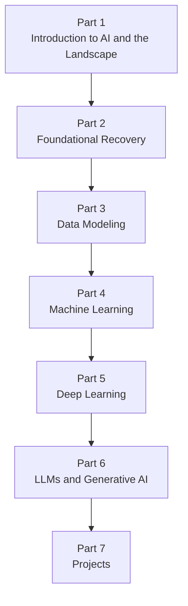

# AiBook

> Section ID: `BOOK-index`
> Version: `v2026.07.19`

AiBook is a static web book for relearning AI. It is designed so that people studying AI for the first time, people who once learned introductory AI but now remember only fragments, and non-specialists who have used AI tools but want to understand the underlying ideas can follow the same learning flow.

The goal of this book is not to collect as much material as possible. Its goal is to build a relearning path that runs from `Introduction to AI and the Landscape -> Foundational Recovery -> Data Modeling -> Machine Learning -> Deep Learning -> LLMs and Generative AI -> Projects`, so that readers can explain where each concept is used when they look at an AI service.

Instead of memorizing `AI`, `machine learning`, `deep learning`, `generative AI`, and `LLM (large language model)` as separate labels, this book reconnects rule-based approaches, data, learning, model execution, representation learning, generation, retrieval, and tool use as one connected flow.

If this is your first visit, start with the [Table of Contents](table-of-contents.md) to see the full learning sequence, then move to the [Part 1 Overview](parts/part-01/index.md). When a term becomes unclear while reading, you can use the [Concept Glossary](reference/concept-glossary.md) to find the representative section where that concept is explained.

## Who This Book Is For

This book is written with the following readers in mind.

- readers who are studying AI for the first time and want to connect terms and ideas gradually
- readers who once studied introductory AI or foundational material but now remember only part of it
- readers who have used AI services such as LLMs, chatbots, or image-generation tools but have not yet organized the internal concepts

The explanation level assumes readers who `may not have received a university-level undergraduate education`. It does not assume prior university-level mathematics, programming, or systems knowledge. At the same time, it does not stop at easy analogies; it connects core terms back to standard explanations so they can be found again later.

## What This Book Relearns

Relearning AI is not only about keeping up with current trends. To make today's LLMs and generative AI less vague, it helps to understand how rule-based approaches, search, probability, machine learning, neural networks, and deep learning connect historically and conceptually.

This book closes the following questions in order.

- What kinds of problems does AI deal with?
- How is directly writing rules different from learning patterns from data?
- How is mathematics used as a language for reading model computation, rather than only as a subject of proof?
- What does it mean to turn raw data into samples, features, baselines, and comparison structures?
- What does learning change, and what does model execution or inference run?
- What computational flow is created by weights, representations, and backpropagation in deep learning?
- How do Transformers, LLMs, prompts, embeddings, retrieval-augmented generation (RAG), and agents connect inside AI services?
- How can the learned material be validated and recorded through small projects?

## Book Structure

The book is organized into seven Parts.

- **Part 1. Introduction to AI and the Landscape**: builds the overall map of AI, its history, the difference between rules and learning, and the basic vocabulary needed for the LLM user experience.
- **Part 2. Foundational Recovery**: restores mathematics, Python, data tools, and execution environments only as much as needed to read AI model computation.
- **Part 3. Data Modeling**: reorganizes raw data into learnable inputs and comparable output structures.
- **Part 4. Machine Learning**: reads problem setup, data splitting, learning, evaluation, and representative algorithms as one common structure.
- **Part 5. Deep Learning**: covers neural-network computation, backpropagation, CNNs, RNNs, attention, and the structure leading to Transformers.
- **Part 6. LLMs and Generative AI**: connects tokens, prompts, generation settings, embeddings, retrieval, RAG, agents, and evaluation.
- **Part 7. Projects**: turns the concepts from earlier Parts into small outputs, then validates them through execution logs and evaluation criteria.

Conversely, this book does not begin by pushing detailed framework APIs, large-scale operations optimization, or full research-level mathematical derivations. Even when those details become necessary, the book first asks `why this is needed`, `what the problem, input, and output are`, `what the core principle is`, and `how it can be checked simply`, then moves into implementation details.

## Overall Flow

This flow is not just a table-of-contents sequence. It is a learning dependency structure. Part 1 builds the overall map, Part 2 restores the foundations for reading and small experiments, and Part 3 turns data into a learnable structure. On top of that, Part 4 establishes the common structure of machine learning, and Part 5 covers deep-learning computation and structure. Part 6 connects those ideas to current LLM and generative-AI services, and Part 7 closes the learning path through project outputs and validation records.

## How To Read

The basic path is `Table of Contents -> Part overview -> representative explanation section -> follow-up sections -> Concept Glossary`. If you want to see the full structure first, open the [Table of Contents](table-of-contents.md). If you want to start reading immediately, begin with the [Part 1 Overview](parts/part-01/index.md) and build the broad AI landscape first.

First-time readers and readers with some prior experience can choose different starting paths.

| Reader state | Good starting path |
| --- | --- |
| The overall AI flow feels unfamiliar | Introduction -> Part 1 -> Part 2 |
| Mathematics or Python feels rusty | Introduction -> Part 1 -> Part 2 -> Part 3 |
| AI tools are familiar but the internal structure is weak | Introduction -> Part 1 -> Part 3 -> Part 4 |

Within the same Part, detailed explanation of an important concept is placed in one representative location whenever possible. Later sections reconnect only what is needed for the current context. When a term becomes unclear, return to the [Concept Glossary](reference/concept-glossary.md), check its `Core Section`, and then follow `Appears In` if you want to see where it returns in the current context.

Each section in this book does not play the same role. Some sections provide a representative explanation of a concept, while others show how that concept returns in another problem scene. Read earlier sections as the place where the concept skeleton is built, and later sections as places where the current context changes what matters.

## The Book's Viewpoint

This book may start from personal intuition, but it does not leave that intuition as the answer. Explanations are separated into the following three layers whenever possible.

- `standard explanation`: an explanation connected to textbooks, papers, official documentation, or reliable sources
- `working hypothesis`: a personal analogy or temporary explanation that helps understanding
- `needs verification`: a point that conflicts with standard explanation or does not yet have enough support

For example, understanding deep learning as `a process of finding useful weights and representations` can be a starting point. But how far that expression remains accurate has to be checked separately. Likewise, even if LLM output looks like human thinking, this book does not immediately conclude that it is the same as human thinking.

## A Book Made With AI Tools

This book is made with AI tools. Humans set the curriculum and review standards, while AI helps with source research, drafting, comparison, diagramming, and document structuring.

Codex is an important tool in this production process. This book treats Codex not as an automatic writer, but as a tool viewed from the perspective of an LLM agent that assists with drafting and review. At the same time, the output of generative AI, including Codex, is always something to review. Natural-sounding prose is not accepted as fact for that reason alone.

What matters in this book is not producing many plausible sentences, but checking whether each sentence has real support and continuing to fix explanations that are wrong or unclear.

## Language Support

The current base edition of the book is Korean.

- Korean: the main edition currently being written and reviewed
- English: the introduction, table of contents, all of Part 1, all of Part 2, all of Part 3, all of Part 4, and the first-pass translation of all of Part 5 are available
- Simplified Chinese: the introduction, table of contents, all of Part 1, all of Part 2, all of Part 3, all of Part 4, and the first-pass translation of all of Part 5 are available

## Feedback and Issues

If you find a typo, explanatory error, table-of-contents problem, or a place that needs more support, please report it through the [AiBook repository issues](https://github.com/devchan64/AiBook/issues){: target="_blank" rel="noopener noreferrer" }.

## Sources and References

This document is an original introduction to the book's purpose, audience, learning path, and writing perspective. It does not directly quote or summarize external sources. If source-backed material is added later, the source and access date will be recorded together.
