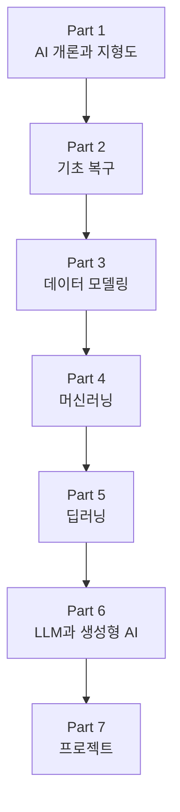

# AiBook

> Section ID: `BOOK-index`
> Version: `v2026.07.19`

AiBook은 AI를 다시 배우기 위한 정적 웹 책입니다. AI를 처음 공부하는 사람, 예전에 AI 개론을 배웠지만 개념이 흐릿해진 사람, AI 도구는 써 봤지만 내부 원리를 더 알고 싶은 비전공자가 같은 흐름을 따라갈 수 있게 설계합니다.

이 책의 목표는 자료를 많이 모으는 것이 아닙니다. `AI 개론과 지형도 -> 기초 복구 -> 데이터 모델링 -> 머신러닝 -> 딥러닝 -> LLM과 생성형 AI -> 프로젝트`로 이어지는 재학습 경로를 만들고, 독자가 AI 서비스를 볼 때 어떤 개념이 어디에서 쓰이는지 설명할 수 있게 하는 것입니다.

특히 `AI`, `머신러닝(machine learning)`, `딥러닝(deep learning)`, `생성형 AI(generative AI)`, `LLM(large language model)`을 따로 외우는 대신, 규칙 기반 접근, 데이터, 학습, 모델 실행, 표현 학습, 생성, 검색, 도구 사용이 하나의 흐름 안에서 어떻게 이어지는지 다시 정리합니다.

처음 들어왔다면 [책의 목차](table-of-contents.md)에서 전체 학습 순서를 확인한 뒤 [Part 1 개요](parts/part-01/index.md)로 이동하면 됩니다. 읽는 중 용어가 헷갈리면 [개념사전](reference/concept-glossary.md)에서 해당 용어의 대표 설명 위치를 다시 찾을 수 있습니다.

## 누구를 위한 책인가

이 책은 다음 독자를 염두에 둡니다.

- AI를 처음 공부하지만, 용어와 흐름을 천천히 연결하며 배우고 싶은 독자
- 예전에 AI 개론이나 기초 과목을 배웠지만, 지금은 기억이 많이 흐릿해진 독자
- LLM, 챗봇, 이미지 생성 도구 같은 AI 서비스를 써 봤지만 내부 개념은 정리되지 않은 독자

설명 수준은 `대학 학사 교육을 받지 않았을 수 있는 독자`를 기준으로 잡습니다. 대학 수준의 수학, 프로그래밍, 시스템 기초를 이미 안다고 가정하지 않습니다. 대신 너무 쉬운 비유로 끝내지 않고, 핵심 용어를 표준적인 설명과 연결해 다시 찾을 수 있게 합니다.

## 무엇을 다시 배우는가

AI를 다시 배우는 이유는 단순히 최신 유행을 따라가기 위해서만은 아닙니다. 규칙 기반 접근, 탐색(search), 확률(probability), 머신러닝, 신경망, 딥러닝이 어떤 흐름으로 이어졌는지 이해해야 현재의 LLM과 생성형 AI도 덜 막연하게 볼 수 있습니다.

이 책은 다음 질문을 순서대로 닫아 갑니다.

- AI는 어떤 문제를 다루는 분야인가?
- 규칙을 직접 쓰는 방식과 데이터에서 패턴을 배우는 방식은 무엇이 다른가?
- 수학은 증명의 대상이 아니라 모델 계산의 언어로 어떻게 쓰이는가?
- 원천데이터를 샘플(sample), 특징(feature), 기준선(baseline), 비교 구조로 바꾼다는 것은 무슨 뜻인가?
- 학습(learning)은 무엇을 바꾸고, 모델 실행(inference)은 무엇을 실행하는가?
- 딥러닝의 가중치(weight), 표현(representation), 역전파(backpropagation)는 어떤 계산 흐름을 만드는가?
- Transformer, LLM, 프롬프트(prompt), 임베딩(embedding), RAG(retrieval-augmented generation), 에이전트(agent)는 AI 서비스 안에서 어떻게 연결되는가?
- 작은 프로젝트로 이해한 내용을 어떻게 검증하고 기록할 수 있는가?

## 책의 구성

책은 일곱 개 Part로 이어집니다.

- **Part 1. AI 개론과 지형도**: AI의 범위, 역사, 규칙과 학습의 차이, LLM 사용 경험의 기본 요소를 잡습니다.
- **Part 2. 기초 복구**: 수학, Python, 데이터 도구, 실행 환경을 AI 모델 계산을 읽는 데 필요한 만큼 복구합니다.
- **Part 3. 데이터 모델링**: 원천데이터를 학습 가능한 입력과 비교 가능한 결과 구조로 정리합니다.
- **Part 4. 머신러닝**: 문제 설정, 데이터 분리, 학습, 평가, 대표 알고리즘을 하나의 공통 구조로 봅니다.
- **Part 5. 딥러닝**: 신경망 계산, 역전파, CNN, RNN, attention, Transformer로 이어지는 구조를 다룹니다.
- **Part 6. LLM과 생성형 AI**: 토큰, 프롬프트, 생성 설정, 임베딩, 검색, RAG, 에이전트, 평가를 연결합니다.
- **Part 7. 프로젝트**: 앞에서 배운 개념을 작은 산출물로 만들고, 실행 로그와 평가 기준으로 검증합니다.

반대로 이 책은 특정 프레임워크의 세부 API, 대규모 운영 최적화, 연구용 수식 전개 전체를 처음부터 빠르게 밀어 넣는 책은 아닙니다. 필요한 경우에도 먼저 `왜 필요한가`, `문제와 입력·출력은 무엇인가`, `핵심 원리는 무엇인가`, `간단히 어떻게 확인할 수 있는가`를 정리한 뒤 세부 구현으로 이동합니다.

## 전체 흐름

이 흐름은 단순한 목차 순서가 아니라 학습 의존 관계입니다. Part 1이 전체 지도를 잡고, Part 2가 읽기와 실습의 기초를 복구하며, Part 3이 데이터를 학습 가능한 구조로 바꿉니다. 그 위에서 Part 4가 머신러닝의 공통 구조를 세우고, Part 5가 딥러닝 계산과 구조를 다룹니다. Part 6은 현재의 LLM과 생성형 AI 서비스를 읽는 관점으로 이어지고, Part 7은 배운 내용을 프로젝트 산출물과 검증 기록으로 닫습니다.

## 읽는 방법

기본 경로는 `책의 목차 -> Part 시작 페이지 -> 대표 설명 Section -> 후속 Section -> 개념사전` 순서입니다. 전체 구성을 먼저 보고 싶다면 [책의 목차](table-of-contents.md)를 열고, 바로 읽기 시작하려면 [Part 1 개요](parts/part-01/index.md)에서 AI의 큰 지형부터 잡는 편이 좋습니다.

처음 읽는 독자와 이미 경험이 있는 독자는 아래처럼 출발점을 달리 잡아도 됩니다.

| 독자 상태 | 먼저 읽기 좋은 경로 |
| --- | --- |
| AI 전체 흐름이 낯선 독자 | 소개 페이지 -> Part 1 -> Part 2 |
| 수학·Python 기억이 흐릿한 독자 | 소개 페이지 -> Part 1 -> Part 2 -> Part 3 |
| 도구는 써 봤지만 내부 구조가 약한 독자 | 소개 페이지 -> Part 1 -> Part 3 -> Part 4 |

같은 Part 안에서 중요한 개념의 상세 설명은 가능한 한 한 번만 대표 위치에 둡니다. 뒤쪽 절에서는 현재 맥락에 필요한 만큼만 다시 연결합니다. 읽다가 용어가 헷갈리면 [개념사전](reference/concept-glossary.md)에서 표제어와 `중심 Section`을 확인하고, 현재 절과의 연결이 궁금하면 `등장 Section`까지 이어서 추적합니다.

이 책의 각 절은 같은 역할을 맡지 않습니다. 어떤 절은 개념의 대표 설명을 맡고, 어떤 절은 그 개념이 다른 문제 장면에서 어떻게 다시 쓰이는지 보여 줍니다. 따라서 앞 절에서는 개념의 뼈대를 세우고, 뒤 절에서는 현재 맥락에서 무엇이 달라지는지 읽는 구조로 따라가면 됩니다.

## 이 책의 관점

이 책은 개인적인 직관을 출발점으로 삼을 수는 있지만, 그 직관을 그대로 정답처럼 두지는 않습니다. 설명은 가능한 한 다음 세 층으로 구분합니다.

- `표준적 설명`: 교과서, 논문, 공식 문서, 신뢰 가능한 자료와 연결되는 설명
- `작업 가설`: 이해를 돕는 개인적 비유나 임시 설명
- `검증 필요`: 표준 설명과 충돌하거나 근거가 아직 충분하지 않은 부분

예를 들어 딥러닝을 `좋은 가중치와 표현을 찾는 과정`으로 이해하는 것은 출발점이 될 수 있습니다. 하지만 이 표현이 어떤 범위까지 맞는지는 별도로 확인해야 합니다. 마찬가지로 LLM 출력이 사람의 사고처럼 보인다고 해서, 곧바로 인간의 사고와 같다고 단정하지는 않습니다.

## AI 도구와 함께 만드는 책

이 책은 AI 도구를 사용해 만들어집니다. 사람은 커리큘럼과 검토 기준을 세우고, AI는 자료 조사, 초안 작성, 비교 정리, 다이어그램 작성, 문서 구조화를 돕습니다.

Codex는 이 제작 과정에서 중요한 도구입니다. 이 책은 Codex를 단순한 자동 작성기가 아니라, 초안 생성과 검토 보조를 수행하는 LLM 에이전트 관점의 도구로 다룹니다. 동시에 Codex를 포함한 생성형 AI의 출력은 항상 검토 대상이며, 자연스러운 문장이라는 이유만으로 사실로 받아들이지 않습니다.

따라서 이 책에서 중요한 일은 그럴듯한 문장을 많이 만드는 것이 아니라, 각 문장이 실제 근거를 가지는지 확인하고, 틀리거나 모호한 설명을 계속 고치는 것입니다.

## 언어 지원

현재 기본 본문은 한국어입니다.

- 한국어: 현재 집필과 검토가 진행되는 기본 본문
- 영어: 소개, 목차, Part 1 전체, Part 2 전체, Part 3 전체, Part 4 전체, Part 5 전체의 1차 번역을 공개
- 중국어(간체): 소개, 목차, Part 1 전체, Part 2 전체, Part 3 전체, Part 4 전체, Part 5 전체의 1차 번역을 공개

## 책에 대한 의견과 이슈

책을 읽다가 오탈자, 설명 오류, 목차 구조 문제, 보강이 필요한 부분을 발견하면 [AiBook 저장소 이슈](https://github.com/devchan64/AiBook/issues){: target="_blank" rel="noopener noreferrer" }로 알려 주세요.

## 출처와 참고 자료

이 문서는 책의 목적, 독자, 학습 경로, 작성 관점을 설명하기 위한 자체 소개입니다. 외부 자료를 직접 인용하거나 특정 자료를 요약하지 않았습니다. 이후 외부 자료에 근거한 설명이 추가되면 출처와 확인 날짜를 함께 기록합니다.
