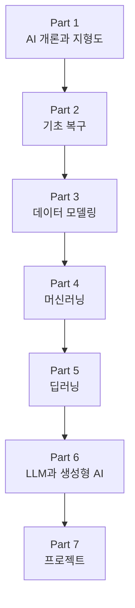

# AiBook

> Section ID: `BOOK-index`
> Version: `v2026.07.08`

AiBook은 AI를 처음 배우는 사람부터, 예전에 배웠지만 개념이 흐릿해진 사람, AI 도구를 써 봤지만 더 깊이 이해하고 싶은 비전공자까지 함께 읽을 수 있게 설계한 재학습용 웹 책입니다.

이 책은 단순한 자료 모음이 아니라, `기초 복구 -> 머신러닝 -> 딥러닝 -> LLM과 생성형 AI -> 프로젝트`로 이어지는 학습 경로를 책처럼 읽을 수 있게 만드는 것을 목표로 합니다. 특히 `AI`, `머신러닝(machine learning)`, `딥러닝(deep learning)`, `생성형 AI(generative AI)`, `LLM(large language model)`이 서로 어떻게 연결되는지 다시 설명할 수 있는 상태로 돌아가는 것을 목표로 합니다. 또한 개인의 경험적 지식과 직관을 검토 가능한 설명과 근거 위에서 다시 정리해, 더 넓게 재사용할 수 있는 일반화된 지식으로 업데이트하는 것도 이 책의 중요한 목적입니다.

같은 Part 안에서 중요한 개념의 상세 설명은 가능한 한 한 번만 대표 위치에 두고, 이후 절에서는 현재 맥락에 필요한 만큼만 다시 연결합니다. 반복해서 등장하는 핵심 용어는 별도의 [개념사전](reference/concept-glossary.md)에서 다시 찾을 수 있으며, 개념사전의 `중심 Section`과 `등장 Section`을 함께 보면 어디서 처음 충분히 배우고 어디서 다시 쓰이는지 구분해 따라갈 수 있습니다.

## 누구를 위한 책인가

이 책은 특히 다음 독자를 염두에 둡니다.

- AI를 처음 공부하지만, 용어와 흐름을 천천히 연결하며 배우고 싶은 독자
- 예전에 AI 개론이나 기초 과목을 배웠지만, 지금은 기억이 많이 흐릿해진 독자
- LLM, 챗봇, 이미지 생성 도구 같은 AI 서비스를 써 봤지만 내부 개념은 정리되지 않은 독자

이 책은 `대학 학사 교육을 받지 않았을 수 있는 독자`도 따라올 수 있는 설명을 기준으로 잡습니다. 그래서 대학 수준의 수학, 프로그래밍, 시스템 기초를 모른다고 가정해도 읽을 수 있어야 합니다. 동시에 이미 익숙한 독자에게는 흩어진 경험을 표준 용어와 구조로 다시 묶어 주는 역할을 해야 합니다.

## 기본 언어 지원

현재 본문 기본 버전은 한국어입니다.

- 한국어: 현재 집필과 검토가 진행되는 기본 본문
- 영어: 기본 진입 페이지만 제공하며 본문은 추후 작성
- 중국어(간체): 기본 진입 페이지만 제공하며 본문은 추후 작성

즉, 현재 시점에서 영어와 중국어(간체) 페이지는 다국어 구조를 미리 잡아 두기 위한 `TBD` 상태입니다.

## 왜 다시 배우는가

AI를 다시 배우는 이유는 단순히 최신 유행을 따라가기 위해서만은 아닙니다. 규칙 기반 접근, 탐색(search), 확률(probability), 머신러닝, 신경망, 딥러닝이 어떤 흐름으로 이어졌는지 이해해야 현재의 LLM과 생성형 AI도 덜 막연하게 볼 수 있습니다.

특히 다음 질문이 다시 중요해집니다.

- AI는 어떤 문제를 다루는 분야인가?
- 규칙을 직접 쓰는 방식과 데이터에서 패턴을 배우는 방식은 무엇이 다른가?
- 수학은 증명의 대상이 아니라 모델 계산의 언어로 어떻게 쓰이는가?
- 학습(learning)은 무엇을 바꾸고, 모델 실행(inference)은 무엇을 실행하는가?
- 딥러닝의 가중치와 표현 학습은 기존 프로그래밍 사고와 어떻게 다른가?
- LLM, 프롬프트(prompt), 임베딩(embedding), RAG(retrieval-augmented generation), 에이전트(agent)는 하나의 서비스 흐름 안에서 어떻게 연결되는가?

## 이 책이 다루는 범위

이 책은 기초를 복구하는 데서 멈추지 않고, 현재의 AI 서비스와 도구를 읽을 수 있는 수준까지 이어집니다.

- Part 1에서는 AI 전체 지형, 핵심 용어, 역사적 흐름, 현재의 AI 서비스 구성을 먼저 봅니다.
- Part 2에서는 Python, 수학, 데이터 다루기 같은 기초를 다시 연결합니다.
- Part 3에서는 원천데이터를 샘플, 특징, 기준선, 비교 구조로 다시 묶는 데이터 모델링을 다룹니다.
- Part 4에서는 머신러닝의 문제 설정, 데이터, 학습, 평가, 대표 알고리즘을 다룹니다.
- Part 5에서는 신경망, 역전파(backpropagation), 주요 딥러닝 구조를 다룹니다.
- Part 6에서는 Transformer, LLM, 프롬프트, 임베딩, 검색, RAG, 에이전트를 연결합니다.
- Part 7에서는 작은 프로젝트로 배운 내용을 검증하고, 기록과 평가 관점까지 이어갑니다.

반대로 이 책은 처음부터 특정 프레임워크의 세부 API, 대규모 운영 최적화, 연구용 수식 전개 전체를 빠르게 밀어 넣는 책은 아닙니다. 그런 내용이 필요할 때도 먼저 `왜 필요한가`, `문제와 입력·출력은 무엇인가`, `핵심 원리는 무엇인가`를 설명한 뒤 세부 구현으로 이동합니다.

## 전체 흐름

위 흐름은 단순한 목차 순서가 아니라 학습 의존 관계를 보여 줍니다. Part 1이 전체 지도를 잡고, Part 2가 읽기와 실습의 기초를 복구하며, Part 3이 원천데이터를 학습 가능한 구조로 바꾸는 데이터 모델링을 다룹니다. 그 위에서 Part 4가 머신러닝의 공통 구조를 세우고, Part 5가 딥러닝 본문을 회수합니다. 이후 Part 6의 LLM과 생성형 AI를 읽고, Part 7에서 실제 산출물과 검증 관점으로 이어집니다.

## 읽는 방법

가장 안전한 기본 경로는 `소개 페이지 -> Part 시작 페이지 -> 대표 설명 Section -> 후속 Section -> 개념사전` 순서입니다. 이미 특정 주제에 익숙하더라도 앞 Part에서 용어와 구분을 먼저 확인한 뒤 뒤 Part로 가야 같은 단어를 다른 뜻으로 읽는 혼동이 줄어듭니다.

어떤 개념이 다시 나오면 같은 설명을 매번 길게 반복하기보다, 그 Part에서 처음 자세히 설명한 대표 Section를 먼저 확인합니다. 읽다가 용어가 헷갈리면 개념사전으로 돌아가 표제어와 `중심 Section`을 함께 확인하고, 현재 절과의 연결이 궁금하면 `등장 Section`까지 이어서 추적합니다.

이 책의 각 절은 같은 역할을 맡지 않습니다. 어떤 절은 개념의 대표 설명을 맡고, 어떤 절은 그 개념이 다른 문제 장면에서 어떻게 다시 쓰이는지 보여 줍니다. 따라서 앞 절에서는 개념의 뼈대를 세우고, 뒤 절에서는 현재 맥락에서 무엇이 달라지는지 읽는 구조로 따라가면 됩니다.

이 책의 각 장과 절은 가능하면 다음 질문에 답하도록 설계합니다.

- 이 개념은 왜 필요한가?
- 핵심 원리는 무엇인가?
- 입력(input), 출력(output), 데이터(data)를 작은 예시로 설명할 수 있는가?
- 핵심 용어를 내 말로 설명할 수 있는가?
- 간단한 예제나 출력 결과로 무엇을 확인할 수 있는가?
- 어떤 부분이 아직 `검증 필요`로 남아 있는가?

## 이 책의 관점

이 책은 개인적인 직관을 출발점으로 삼을 수는 있지만, 그 직관을 그대로 정답처럼 두지는 않습니다. 설명은 가능한 한 다음 세 층으로 구분합니다.

- `표준적 설명`: 교과서, 논문, 공식 문서, 신뢰 가능한 자료와 연결되는 설명
- `작업 가설`: 이해를 돕는 개인적 비유나 임시 설명
- `검증 필요`: 표준 설명과 충돌하거나 근거가 아직 충분하지 않은 부분

예를 들어 딥러닝을 `좋은 가중치와 표현을 찾는 과정`으로 이해하는 것은 출발점이 될 수 있습니다. 하지만 이 표현이 어떤 범위까지 맞는지는 별도로 확인해야 합니다. 마찬가지로 LLM 출력이 사람의 사고처럼 보인다고 해서, 곧바로 인간의 사고와 같다고 단정하지는 않습니다.

## AI 도구와 함께 쓰는 책

이 책은 AI 도구를 사용해 만들어집니다. 사람은 커리큘럼과 검토 기준을 세우고, AI는 자료 조사, 초안 작성, 비교 정리, 다이어그램 작성, 문서 구조화를 돕습니다.

Codex는 이 제작 과정에서 중요한 도구입니다. 이 책은 Codex를 단순한 자동 작성기가 아니라, 초안 생성과 검토 보조를 수행하는 LLM 에이전트 관점의 도구로 다룹니다. 동시에 Codex를 포함한 생성형 AI의 출력은 항상 검토 대상이며, 자연스러운 문장이라는 이유만으로 사실로 받아들이지 않습니다.

따라서 이 책에서 중요한 일은 그럴듯한 문장을 많이 만드는 것이 아니라, 각 문장이 실제 근거를 가지는지 확인하고, 틀리거나 모호한 설명을 계속 고치는 것입니다.

## 작성과 검토 원칙

- 설명은 가능한 한 `왜 필요한가 -> 핵심 원리는 무엇인가 -> 어떻게 확인할 수 있는가`의 흐름을 따릅니다.
- 처음 등장하는 핵심 용어는 필요한 경우 `한국어(English)`로 병기합니다.
- 처음 읽는 독자를 위해 짧은 직관, 작은 표, 간단한 도식, 실행 결과 예시를 우선 사용합니다.
- 같은 Part 안에서 주요 개념의 상세 설명은 대표 위치 한 번을 기준으로 두고, 이후 절에서는 현재 맥락에 필요한 최소 설명과 개념사전 연결만 남깁니다.
- 외부 자료를 직접 인용하거나 요약한 경우 문서 하단에 출처와 확인 날짜를 남깁니다.
- 관리 문서와 조사 메모는 `management/` 아래에 두고, 독자용 본문은 `docs/` 아래에 둡니다.

## 책에 대한 의견과 이슈

책을 읽다가 오탈자, 설명 오류, 목차 구조 문제, 보강이 필요한 부분을 발견하면 저장소 이슈로 알려 주시면 됩니다. 책 관련 의견과 수정 제안은 [AiBook 저장소 이슈](https://github.com/devchan64/AiBook/issues){: target="_blank" rel="noopener noreferrer" }를 통해 받습니다.

## 출처와 참고 자료

이 문서는 책의 목적, 독자, 학습 경로, 작성 관점을 설명하기 위한 자체 소개입니다. 외부 자료를 직접 인용하거나 특정 자료를 요약하지 않았습니다. 이후 외부 자료에 근거한 설명이 추가되면 출처와 확인 날짜를 함께 기록합니다.
